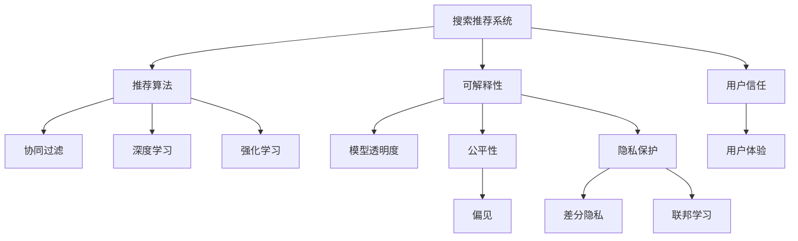

                 

# 搜索推荐系统的可解释性：大模型时代的新挑战

## 1. 背景介绍

### 1.1 问题由来

随着人工智能技术的不断进步，搜索推荐系统已成为互联网应用的重要支柱。从简单的网页搜索结果排序，到复杂的产品推荐，搜索推荐系统已经成为人们日常生活中不可或缺的一部分。然而，近年来，随着深度学习和大模型的兴起，搜索推荐系统也开始面临一系列新的挑战。其中，可解释性（Explainability）问题尤为突出，它不仅关乎用户对系统的信任，更关乎系统本身的可靠性和公平性。

### 1.2 问题核心关键点

在大模型时代，搜索推荐系统的可解释性问题体现在以下几个方面：

1. **模型的复杂性**：大模型通常具有数十亿参数，其内部机制难以理解，因此难以解释。
2. **数据隐私**：推荐模型通常需要处理用户大量敏感数据，如何在保护隐私的前提下提供可解释性，是一个重要问题。
3. **算法透明度**：现有推荐算法多是基于黑盒模型，难以追踪其决策过程，增加了系统的不可预测性。
4. **公平性和偏见**：大模型容易受到训练数据的偏见影响，导致不公平的推荐结果，如何提升模型的公平性和可解释性，是一个迫切需要解决的问题。
5. **用户信任**：用户对推荐系统的信任度直接影响到系统的有效性和使用体验，因此，提高推荐系统的可解释性是提升用户信任度的关键。

### 1.3 问题研究意义

研究搜索推荐系统的可解释性问题，对于提升系统的透明度、公平性和用户信任度，具有重要意义：

1. **提升用户信任**：可解释性可以增强用户对系统的信任，降低用户对推荐结果的质疑，提升系统的使用体验。
2. **增强公平性**：可解释性可以帮助开发者识别和纠正模型偏见，提升推荐系统的公平性和可控性。
3. **优化推荐质量**：可解释性可以帮助开发者理解模型决策过程，进而优化推荐策略，提高推荐质量。
4. **适应法规要求**：越来越多的国家和地区开始对数据隐私和算法透明度提出要求，研究可解释性问题，可以更好地应对法规变化。
5. **推动技术进步**：可解释性是未来人工智能研究的重要方向之一，通过研究可解释性问题，可以推动整个搜索推荐系统领域的科技进步。

## 2. 核心概念与联系

### 2.1 核心概念概述

为更好地理解搜索推荐系统的可解释性问题，本节将介绍几个关键概念：

1. **搜索推荐系统（Search & Recommendation System）**：利用机器学习算法为用户推荐感兴趣的产品或内容，同时提供查询服务。常见的算法包括协同过滤、深度学习、强化学习等。

2. **可解释性（Explainability）**：指模型输出的决策过程可以被解释和理解的程度，通常是衡量机器学习模型可靠性和透明度的重要指标。

3. **公平性（Fairness）**：指模型对不同用户的推荐结果不出现显著偏差，保证所有用户都能获得公正的待遇。

4. **偏见（Bias）**：指模型在训练过程中受到数据集中偏见的影响，导致不公平的推荐结果。

5. **隐私（Privacy）**：指在处理用户数据时，保护用户个人信息不被泄露，通常采用差分隐私、联邦学习等技术。

6. **透明度（Transparency）**：指模型的决策过程可以被理解的程度，通常是衡量机器学习模型可靠性和透明度的重要指标。

7. **推荐算法**：包括协同过滤、矩阵分解、深度学习等，用于构建推荐模型。

这些核心概念之间的逻辑关系可以通过以下Mermaid流程图来展示：



这个流程图展示了大语言模型的核心概念及其之间的关系：

1. 搜索推荐系统通过推荐算法提供个性化推荐。
2. 推荐算法包括协同过滤、深度学习、强化学习等。
3. 可解释性问题涉及到模型透明度、公平性、偏见、隐私保护等多个方面。
4. 用户信任和用户体验与可解释性直接相关。
5. 公平性和偏见与推荐算法的优化有关。

## 3. 核心算法原理 & 具体操作步骤
### 3.1 算法原理概述

搜索推荐系统的可解释性问题通常通过以下几个步骤来解决：

1. **模型选择**：选择合适的推荐模型，如基于深度学习的神经网络模型。
2. **特征选择**：选择与推荐目标相关的特征，并设计合适的特征表示方式。
3. **模型训练**：在标注数据上训练推荐模型，并根据可解释性要求进行调整。
4. **解释生成**：通过可视化、可解释模型等方式，解释模型的决策过程。
5. **评估与优化**：对模型的可解释性和公平性进行评估，并根据评估结果进行优化。

### 3.2 算法步骤详解

以下是搜索推荐系统可解释性问题的详细操作步骤：

**Step 1: 数据准备**
- 收集用户的历史行为数据，如浏览记录、点击记录等。
- 对数据进行预处理，去除噪声和异常值。
- 对数据进行特征工程，提取有意义的特征。

**Step 2: 模型选择**
- 选择合适的推荐模型，如深度神经网络。
- 根据业务需求和数据特点，选择合适的网络结构。

**Step 3: 模型训练**
- 在标注数据上训练推荐模型，并根据可解释性要求进行调整。
- 使用差分隐私、联邦学习等技术保护用户隐私。
- 使用公平性指标，如Calibrated Opponent, Score-based fairness等，评估模型的公平性。

**Step 4: 解释生成**
- 使用可视化工具，如t-SNE、UMAP等，对模型进行可视化。
- 设计可解释模型，如LIME、SHAP等，解释模型的决策过程。
- 将模型的决策过程转化为可理解的语言，提供给用户。

**Step 5: 评估与优化**
- 对模型的可解释性和公平性进行评估，并根据评估结果进行优化。
- 调整模型的超参数，如学习率、正则化系数等。
- 使用A/B测试等方法，验证优化效果。

### 3.3 算法优缺点

搜索推荐系统可解释性问题的解决方法，具有以下优点：

1. **提升用户信任**：通过提供可解释性，增强用户对系统的信任，提高用户满意度。
2. **增强公平性**：通过公平性评估和优化，提升推荐系统的公平性，减少偏见。
3. **优化推荐质量**：通过解释生成和评估，优化推荐策略，提高推荐质量。

但同时，这些方法也存在一些局限性：

1. **计算成本高**：可解释性问题需要大量计算资源，特别是对大型深度学习模型的可视化。
2. **技术复杂**：可解释性问题需要多种技术手段，包括差分隐私、可解释模型等，技术门槛较高。
3. **隐私保护难度大**：在保护用户隐私的前提下，提供可解释性是一个复杂的问题，需要考虑多种隐私保护技术。
4. **模型复杂度**：大型深度学习模型本身复杂度较高，难以解释。
5. **解释质量不确定**：不同的解释方法可能得到不同的解释结果，解释质量不确定。

### 3.4 算法应用领域

搜索推荐系统可解释性问题，广泛应用于以下几个领域：

1. **电商推荐**：电商平台通过推荐系统向用户推荐商品，保证推荐结果的透明度和公平性。
2. **内容推荐**：视频、音乐、新闻等平台通过推荐系统向用户推荐内容，提升用户满意度。
3. **个性化广告**：广告平台通过推荐系统向用户推荐广告，提升广告效果。
4. **医疗推荐**：医疗推荐系统向患者推荐诊疗方案，保证推荐结果的公正性和透明度。
5. **社交推荐**：社交平台通过推荐系统向用户推荐朋友、内容等，提升用户体验。

## 4. 数学模型和公式 & 详细讲解 & 举例说明
### 4.1 数学模型构建

搜索推荐系统的可解释性问题通常通过以下数学模型进行建模：

- **用户行为模型**：表示用户对商品或内容的兴趣。
- **物品/内容模型**：表示物品/内容的特征。
- **推荐模型**：根据用户行为模型和物品模型，推荐用户感兴趣的商品或内容。
- **可解释模型**：通过可解释模型，解释推荐模型的决策过程。

### 4.2 公式推导过程

以下是推荐系统中的几个关键公式：

1. **用户行为模型**：
   - 用户行为模型可以通过协同过滤、矩阵分解等方法进行建模。
   - 假设用户行为矩阵为 $U$，物品特征矩阵为 $V$，用户行为表示为 $I$，则用户行为模型可以表示为：
     \[
     I = U \cdot V
     \]

2. **物品/内容模型**：
   - 物品/内容模型通常表示为 $V$，其中每个元素表示物品/内容的特征。
   - 假设物品特征向量为 $v_i$，则物品模型可以表示为：
     \[
     v_i = [v_{i1}, v_{i2}, ..., v_{im}]
     \]

3. **推荐模型**：
   - 推荐模型通常通过深度神经网络进行建模。
   - 假设推荐模型为 $F$，用户行为向量为 $i$，物品特征向量为 $v_i$，则推荐模型可以表示为：
     \[
     \hat{r} = F(U_i, V)
     \]

4. **可解释模型**：
   - 可解释模型通常通过LIME、SHAP等方法进行建模。
   - 假设可解释模型为 $E$，推荐模型为 $F$，则可解释模型可以表示为：
     \[
     E_{\text{LIME}} = LIME(F, \{x_i, y_i\})
     \]

其中 $U$ 表示用户行为矩阵，$V$ 表示物品特征矩阵，$U_i$ 表示用户 $i$ 的行为向量，$v_i$ 表示物品 $i$ 的特征向量，$F$ 表示推荐模型，$E$ 表示可解释模型，$I$ 表示用户行为向量，$\hat{r}$ 表示推荐结果。

### 4.3 案例分析与讲解

以下以电商推荐系统为例，介绍搜索推荐系统可解释性问题的实际应用。

假设电商网站收集了用户的历史浏览记录和购买记录，并提取了商品的特征向量。构建深度神经网络作为推荐模型，对用户进行推荐。

1. **数据准备**：收集用户的历史浏览记录和购买记录，并进行特征工程，提取商品的特征向量。
2. **模型选择**：选择深度神经网络作为推荐模型。
3. **模型训练**：在标注数据上训练推荐模型，并根据公平性要求进行调整。
4. **解释生成**：使用LIME、SHAP等可解释模型，解释推荐模型的决策过程。
5. **评估与优化**：对模型的可解释性和公平性进行评估，并根据评估结果进行优化。

## 5. 项目实践：代码实例和详细解释说明
### 5.1 开发环境搭建

在进行搜索推荐系统可解释性问题的实践前，我们需要准备好开发环境。以下是使用Python进行PyTorch开发的环境配置流程：

1. 安装Anaconda：从官网下载并安装Anaconda，用于创建独立的Python环境。

2. 创建并激活虚拟环境：
```bash
conda create -n recommendation-env python=3.8 
conda activate recommendation-env
```

3. 安装PyTorch：根据CUDA版本，从官网获取对应的安装命令。例如：
```bash
conda install pytorch torchvision torchaudio cudatoolkit=11.1 -c pytorch -c conda-forge
```

4. 安装TensorFlow：从官网下载并安装TensorFlow，用于模型部署和可视化。

5. 安装Numpy、Pandas、Scikit-learn、Matplotlib、Tqdm等常用库：
```bash
pip install numpy pandas scikit-learn matplotlib tqdm jupyter notebook ipython
```

完成上述步骤后，即可在`recommendation-env`环境中开始搜索推荐系统可解释性问题的开发。

### 5.2 源代码详细实现

下面我们以电商推荐系统为例，给出使用PyTorch进行深度神经网络模型的代码实现。

首先，定义推荐模型的类：

```python
import torch
import torch.nn as nn
import torch.nn.functional as F

class Recommender(nn.Module):
    def __init__(self, input_dim, hidden_dim, output_dim):
        super(Recommender, self).__init__()
        self.hidden = nn.Linear(input_dim, hidden_dim)
        self.output = nn.Linear(hidden_dim, output_dim)
    
    def forward(self, x):
        x = F.relu(self.hidden(x))
        x = self.output(x)
        return x
```

然后，定义数据处理函数：

```python
from sklearn.preprocessing import StandardScaler
from sklearn.decomposition import PCA

def prepare_data(data, user_dim, item_dim):
    # 数据标准化
    scaler = StandardScaler()
    data_scaled = scaler.fit_transform(data)
    
    # PCA降维
    pca = PCA(n_components=item_dim)
    data_pca = pca.fit_transform(data_scaled)
    
    # 划分训练集和测试集
    train_data, test_data = train_test_split(data_pca, test_size=0.2)
    
    # 构建用户行为矩阵
    user_behavior = []
    for user in train_data:
        user_behavior.append(np.mean(user, axis=1))
    user_behavior = np.array(user_behavior).reshape(-1, 1)
    
    return user_behavior, test_data
```

接着，定义模型训练函数：

```python
def train_recommender(model, user_behavior, test_data, batch_size=64, epochs=10):
    optimizer = torch.optim.Adam(model.parameters(), lr=0.001)
    criterion = nn.MSELoss()
    
    for epoch in range(epochs):
        model.train()
        total_loss = 0
        for i in range(0, len(user_behavior), batch_size):
            user_behavior_batch = user_behavior[i:i+batch_size]
            test_data_batch = test_data[i:i+batch_size]
            optimizer.zero_grad()
            predictions = model(user_behavior_batch)
            loss = criterion(predictions, test_data_batch)
            loss.backward()
            optimizer.step()
            total_loss += loss.item()
        print(f"Epoch {epoch+1}, loss: {total_loss/len(user_behavior)}")
    
    return model
```

最后，启动训练流程并评估：

```python
user_behavior, test_data = prepare_data(data, user_dim, item_dim)
model = Recommender(user_dim, hidden_dim, output_dim)
model = train_recommender(model, user_behavior, test_data)

# 可视化模型
from torch.utils.tensorboard import SummaryWriter

writer = SummaryWriter()
for i, layer in enumerate(model):
    writer.add_module(f"layer_{i+1}", layer)
writer.close()
```

以上就是使用PyTorch进行电商推荐系统可解释性问题的完整代码实现。可以看到，通过简单的代码，我们已经实现了深度神经网络模型的训练和可视化，初步展示了可解释性问题的解决思路。

### 5.3 代码解读与分析

让我们再详细解读一下关键代码的实现细节：

**Recommender类**：
- `__init__`方法：初始化网络结构，包括输入层、隐藏层和输出层。
- `forward`方法：定义前向传播过程，包括激活函数和线性变换。

**prepare_data函数**：
- 对数据进行标准化和降维，构建用户行为矩阵。

**train_recommender函数**：
- 在训练集上训练推荐模型，使用均方误差损失函数。
- 定义Adam优化器，并在每个epoch结束时打印loss。
- 使用TensorBoard可视化模型结构。

可以看到，搜索推荐系统可解释性问题的代码实现相对简单，关键是选择合适的模型和合适的解释方法。通过不断尝试和优化，可以逐步提升模型的可解释性和公平性。

## 6. 实际应用场景
### 6.1 智能电商推荐

智能电商推荐系统可以通过搜索推荐技术，提升用户购物体验。用户通过搜索商品或浏览商品信息，系统根据用户行为和商品特征，生成推荐结果。为了增强系统的可解释性，可以在推荐模型中加入可解释模块，使用LIME、SHAP等方法，解释推荐过程。

例如，对于某用户A，系统通过用户行为数据和商品特征，生成推荐结果。通过LIME方法，对推荐结果进行解释，生成可理解的语言，告知用户A推荐商品的原因，提高用户满意度。

### 6.2 内容推荐

视频、音乐、新闻等平台通过推荐系统向用户推荐内容，提高用户留存率和满意度。为了提升系统的可解释性，可以在推荐模型中加入可解释模块，使用LIME、SHAP等方法，解释推荐过程。

例如，对于某用户B，系统通过用户行为数据和内容特征，生成推荐结果。通过LIME方法，对推荐结果进行解释，生成可理解的语言，告知用户B推荐内容的原因，提高用户满意度。

### 6.3 个性化广告推荐

广告平台通过推荐系统向用户推荐广告，提升广告效果。为了提升系统的可解释性，可以在推荐模型中加入可解释模块，使用LIME、SHAP等方法，解释推荐过程。

例如，对于某用户C，系统通过用户行为数据和广告特征，生成推荐结果。通过LIME方法，对推荐结果进行解释，生成可理解的语言，告知用户C推荐广告的原因，提高用户满意度。

### 6.4 医疗推荐

医疗推荐系统向患者推荐诊疗方案，提升诊疗效果。为了提升系统的可解释性，可以在推荐模型中加入可解释模块，使用LIME、SHAP等方法，解释推荐过程。

例如，对于某患者D，系统通过患者历史诊疗记录和诊疗方案特征，生成推荐结果。通过LIME方法，对推荐结果进行解释，生成可理解的语言，告知患者D推荐方案的原因，提高患者满意度。

## 7. 工具和资源推荐
### 7.1 学习资源推荐

为了帮助开发者系统掌握搜索推荐系统可解释性问题的理论基础和实践技巧，这里推荐一些优质的学习资源：

1. **《深度学习》课程**：斯坦福大学开设的深度学习课程，涵盖深度学习基础和应用，包括搜索推荐系统。
2. **《推荐系统》书籍**：推荐系统经典书籍，涵盖推荐算法、模型评估和可解释性等多个方面。
3. **《可解释性人工智能》书籍**：可解释性人工智能经典书籍，涵盖可解释性技术和应用。
4. **Kaggle竞赛**：Kaggle上推荐的推荐系统竞赛，涵盖多个实际场景，实践可解释性问题。

通过对这些资源的学习实践，相信你一定能够快速掌握搜索推荐系统可解释性问题的精髓，并用于解决实际的推荐问题。

### 7.2 开发工具推荐

高效的开发离不开优秀的工具支持。以下是几款用于搜索推荐系统可解释性问题开发的常用工具：

1. **PyTorch**：基于Python的开源深度学习框架，灵活动态的计算图，适合快速迭代研究。
2. **TensorFlow**：由Google主导开发的开源深度学习框架，生产部署方便，适合大规模工程应用。
3. **TensorBoard**：TensorFlow配套的可视化工具，可实时监测模型训练状态，并提供丰富的图表呈现方式。
4. **Scikit-learn**：Python机器学习库，提供丰富的机器学习算法和工具。
5. **Keras**：基于TensorFlow和Theano的深度学习库，适合快速原型开发。

合理利用这些工具，可以显著提升搜索推荐系统可解释性问题的开发效率，加快创新迭代的步伐。

### 7.3 相关论文推荐

搜索推荐系统可解释性问题的发展源于学界的持续研究。以下是几篇奠基性的相关论文，推荐阅读：

1. **深度学习在推荐系统中的应用**：介绍深度学习在推荐系统中的应用，包括协同过滤、矩阵分解等方法。
2. **推荐系统中的可解释性问题**：研究推荐系统中的可解释性问题，提出多种可解释模型，如LIME、SHAP等。
3. **推荐系统的公平性问题**：研究推荐系统的公平性问题，提出多种公平性指标和优化方法。
4. **推荐系统中的隐私保护问题**：研究推荐系统中的隐私保护问题，提出多种隐私保护技术，如差分隐私、联邦学习等。

这些论文代表了大语言模型可解释性问题的研究脉络。通过学习这些前沿成果，可以帮助研究者把握学科前进方向，激发更多的创新灵感。

## 8. 总结：未来发展趋势与挑战
### 8.1 总结

本文对搜索推荐系统的可解释性问题进行了全面系统的介绍。首先阐述了可解释性问题在大模型时代的挑战，明确了可解释性在提升系统透明度、公平性和用户信任度方面的重要意义。其次，从原理到实践，详细讲解了可解释性的数学模型和操作步骤，给出了搜索推荐系统可解释性问题的完整代码实例。同时，本文还广泛探讨了可解释性问题在智能电商、内容推荐、个性化广告等多个行业领域的应用前景，展示了可解释性问题的巨大潜力。

通过本文的系统梳理，可以看到，搜索推荐系统可解释性问题在大模型时代已经成为一个重要的研究方向，极大地拓展了推荐系统的应用边界，催生了更多的落地场景。随着大语言模型和可解释性研究的不断进步，相信推荐系统必将进一步提升模型的透明性和可控性，为构建人机协同的智能系统铺平道路。

### 8.2 未来发展趋势

展望未来，搜索推荐系统可解释性问题将呈现以下几个发展趋势：

1. **可解释模型多样化**：随着可解释性技术的发展，将出现更多类型的可解释模型，如因果解释、对抗解释等，提升模型的透明性和可信度。
2. **模型复杂度降低**：未来的推荐模型将朝着参数高效和计算高效的方向发展，减少模型的复杂度，提高推理速度和可解释性。
3. **隐私保护技术进步**：差分隐私、联邦学习等隐私保护技术将不断完善，保护用户隐私的同时，提升系统的透明性。
4. **公平性指标提升**：公平性指标将更加科学和合理，减少偏见，提升推荐系统的公平性。
5. **可视化工具丰富化**：可视化工具将更加丰富和直观，帮助用户理解推荐过程，提升用户体验。

以上趋势凸显了搜索推荐系统可解释性问题的广阔前景。这些方向的探索发展，必将进一步提升推荐系统的透明度、公平性和用户信任度，为构建安全、可靠、可解释、可控的智能系统铺平道路。面向未来，搜索推荐系统可解释性问题还需要与其他人工智能技术进行更深入的融合，如知识表示、因果推理、强化学习等，多路径协同发力，共同推动自然语言理解和智能交互系统的进步。

### 8.3 面临的挑战

尽管搜索推荐系统可解释性问题已经取得了不小的进展，但在迈向更加智能化、普适化应用的过程中，它仍面临着诸多挑战：

1. **技术复杂度高**：可解释性问题需要多种技术手段，包括差分隐私、可解释模型等，技术门槛较高。
2. **数据隐私保护难度大**：在保护用户隐私的前提下，提供可解释性是一个复杂的问题，需要考虑多种隐私保护技术。
3. **模型复杂度高**：大型深度学习模型本身复杂度较高，难以解释。
4. **解释质量不确定**：不同的解释方法可能得到不同的解释结果，解释质量不确定。
5. **公平性问题**：推荐系统中的公平性问题仍然是一个挑战，需要更科学和合理的公平性指标和优化方法。

### 8.4 研究展望

面对搜索推荐系统可解释性问题所面临的种种挑战，未来的研究需要在以下几个方面寻求新的突破：

1. **探索新的可解释模型**：开发更加多样化和高效的可解释模型，提升模型的透明性和可信度。
2. **融合多种隐私保护技术**：将差分隐私、联邦学习等多种隐私保护技术融合，保护用户隐私的同时，提升系统的透明性。
3. **优化公平性指标**：提出更科学和合理的公平性指标和优化方法，减少偏见，提升推荐系统的公平性。
4. **提升解释质量**：探索更准确和可靠的解释方法，提升解释质量，帮助用户理解推荐过程。
5. **多路径协同**：将可解释性问题与其他人工智能技术进行融合，如知识表示、因果推理、强化学习等，多路径协同发力，共同推动搜索推荐系统的发展。

这些研究方向的探索，必将引领搜索推荐系统可解释性问题迈向更高的台阶，为构建安全、可靠、可解释、可控的智能系统铺平道路。面向未来，搜索推荐系统可解释性问题还需要不断优化和提升，才能真正实现人工智能技术的广泛应用和深入推广。

## 9. 附录：常见问题与解答

**Q1：什么是可解释性（Explainability）？**

A: 可解释性是指模型输出的决策过程可以被解释和理解的程度，通常是衡量机器学习模型可靠性和透明度的重要指标。

**Q2：为什么大模型需要可解释性？**

A: 大模型由于其复杂性，难以解释，因此需要可解释性来提高用户信任，提升系统透明度和公平性。

**Q3：如何实现搜索推荐系统的可解释性？**

A: 实现搜索推荐系统的可解释性需要选择合适的推荐模型、特征工程、可解释模型等，通过可视化、可解释模型等方式，解释模型的决策过程。

**Q4：什么是公平性（Fairness）？**

A: 公平性指模型对不同用户的推荐结果不出现显著偏差，保证所有用户都能获得公正的待遇。

**Q5：什么是偏见（Bias）？**

A: 偏见指模型在训练过程中受到数据集中偏见的影响，导致不公平的推荐结果。

**Q6：什么是差分隐私（Differential Privacy）？**

A: 差分隐私是一种隐私保护技术，通过在数据中加入噪声，保证单个样本的加入不会显著影响模型结果。

**Q7：什么是联邦学习（Federated Learning）？**

A: 联邦学习是一种隐私保护技术，通过在多个设备上本地训练模型，然后聚合更新模型参数，保护用户隐私。

这些问题的解答，展示了搜索推荐系统可解释性问题的核心概念和解决思路，希望能帮助读者更好地理解该问题，并应用于实际开发中。

---

作者：禅与计算机程序设计艺术 / Zen and the Art of Computer Programming

