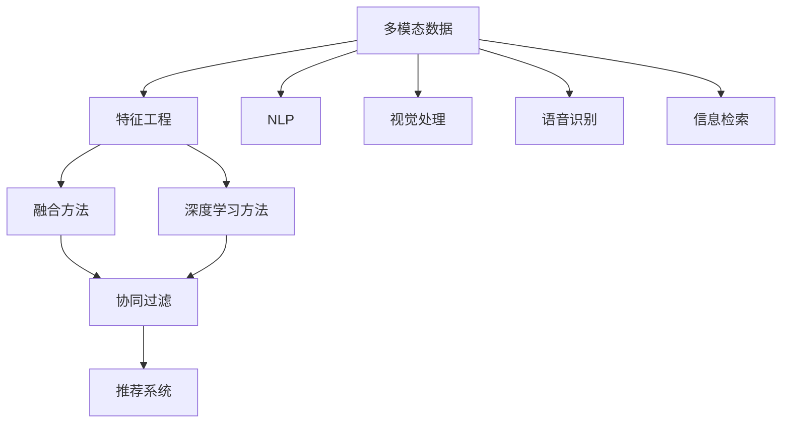

                 

# 搜索推荐系统的多模态融合技术

## 1. 背景介绍

随着互联网的迅猛发展和智能技术的不断进步，搜索推荐系统（Search and Recommendation System, SRS）已经成为互联网应用中不可或缺的重要部分。无论是电商平台、社交平台，还是视频网站，通过个性化推荐技术，都能大幅提升用户体验，促进交易和互动。然而，传统的搜索推荐系统主要依赖单一的文本数据，难以充分挖掘和利用用户的多维信息。多模态融合技术（Multimodal Fusion）应运而生，通过综合处理文本、图像、语音、视频等多种信息，提升推荐系统的精准度和个性化水平。

本文将深入探讨多模态融合技术在搜索推荐系统中的应用，包括其核心概念、算法原理、具体操作步骤、应用场景和未来展望。通过详细讲解多模态融合的技术细节和工程实现，帮助读者掌握相关技术，提升搜索推荐系统的性能和用户体验。

## 2. 核心概念与联系

### 2.1 核心概念概述

为更好地理解多模态融合技术，本节将介绍几个密切相关的核心概念：

- 多模态数据(Multimodal Data)：指同时包含文本、图像、语音、视频等多种模态的信息。多模态数据能更全面地反映用户需求和行为，提升推荐系统的准确性和个性化。
- 特征工程(Feature Engineering)：通过数据处理、特征提取、降维等手段，将多模态数据转化为模型能够处理的特征向量。特征工程是保证推荐系统性能的关键环节。
- 融合方法(Merging Method)：将多模态数据融合为一个整体特征向量的方法。常用的融合方法包括特征拼接、加权平均、逐层融合等。
- 深度学习方法(Deep Learning)：通过构建多层神经网络，对多模态数据进行端到端的表示学习，挖掘数据的隐含语义信息。深度学习方法在多模态融合中具有强大的优势。
- 协同过滤(Collaborative Filtering)：通过分析用户行为数据，推荐相似用户感兴趣的商品、内容等。协同过滤是推荐系统中最常用的方法之一。
- 自然语言处理(Natural Language Processing, NLP)：利用计算语言学、人工智能等技术，处理和分析自然语言文本，提取文本特征。NLP在文本相关推荐系统中扮演着重要角色。
- 视觉处理(Computer Vision)：通过图像识别、特征提取、目标检测等技术，对图像数据进行处理，提取图像特征。视觉处理在图片推荐系统中应用广泛。
- 语音识别(Speech Recognition)：通过语音信号处理和模式识别，将语音信号转换为文本，提取语音特征。语音识别在语音助手、智能音箱等应用中具有重要价值。
- 信息检索(Information Retrieval)：通过文本检索技术，从大量数据中快速找到用户需要的信息。信息检索是搜索引擎和推荐系统的重要基础。

这些核心概念之间的逻辑关系可以通过以下Mermaid流程图来展示：



这个流程图展示出多模态数据在搜索推荐系统中的应用流程：

1. 多模态数据通过特征工程转化为可处理特征。
2. 特征通过融合方法融合为一个整体特征向量。
3. 使用深度学习方法进行端到端表示学习。
4. 将融合后的特征输入到协同过滤算法中，进行相似用户和物品推荐。
5. 不同模态的数据经过各自的NLP、视觉处理、语音识别等技术处理，提取特征向量。
6. 最终所有模态的特征向量输入推荐系统，得到推荐结果。

## 3. 核心算法原理 & 具体操作步骤
### 3.1 算法原理概述

多模态融合技术的核心思想是将多种模态的数据融合为统一的特征向量，以供后续推荐算法使用。其核心算法包括特征提取、特征融合和深度学习三个步骤。

1. **特征提取**：使用文本处理、图像识别、语音识别等技术，分别对不同模态的数据进行特征提取，得到文本特征向量、图像特征向量、语音特征向量等。
2. **特征融合**：通过特征拼接、加权平均、逐层融合等方法，将不同模态的特征向量进行融合，得到统一的特征向量。
3. **深度学习**：使用神经网络对融合后的特征向量进行表示学习，挖掘数据中的隐含语义信息。常用的深度学习方法包括CNN、RNN、Transformer等。

### 3.2 算法步骤详解

多模态融合技术的详细步骤如下：

**Step 1: 数据收集与预处理**

- 收集用户历史行为数据（如浏览记录、购买记录等），并预处理为标准格式。
- 收集用户画像数据（如基本信息、兴趣爱好、社交网络等），并进行清洗和归一化。
- 收集商品或内容的多模态数据（如图片、视频、音频等），并进行标注和预处理。

**Step 2: 特征提取**

- 对文本数据进行分词、去除停用词、词向量化等处理，提取文本特征向量。
- 对图像数据进行预处理、特征提取和降维，得到图像特征向量。
- 对语音数据进行信号处理、特征提取和降维，得到语音特征向量。
- 对视频数据进行剪辑、特征提取和降维，得到视频特征向量。

**Step 3: 特征融合**

- 对不同模态的特征向量进行拼接、加权平均、逐层融合等操作，得到一个统一的特征向量。
- 使用softmax、注意力机制等方法，对融合后的特征向量进行加权处理。
- 将融合后的特征向量输入到深度学习模型中进行表示学习。

**Step 4: 深度学习表示学习**

- 构建多层神经网络，如CNN、RNN、Transformer等，对融合后的特征向量进行端到端的表示学习。
- 使用正则化技术（如L2正则、Dropout等）防止过拟合。
- 通过交叉验证等手段，优化神经网络的超参数。
- 使用协同过滤算法（如矩阵分解、基于图的方法等）进行推荐。

**Step 5: 模型评估与优化**

- 在测试集上评估模型的性能，计算推荐准确率、覆盖率、召回率等指标。
- 根据评估结果，调整特征提取、特征融合和深度学习算法的参数，优化模型性能。
- 使用A/B测试等手段，评估不同方案的效果，选择最优方案进行部署。

### 3.3 算法优缺点

多模态融合技术具有以下优点：

- 数据丰富性：通过综合多种模态的数据，能够更全面地反映用户需求和行为，提升推荐系统的准确性和个性化。
- 抗噪声能力强：多模态数据往往能互相印证，增强推荐系统的鲁棒性，减少单模态数据带来的噪声。
- 用户多样性：不同模态的数据能够更好地覆盖不同用户群体的需求，提升推荐系统的多样性和公平性。

同时，该方法也存在以下缺点：

- 数据获取难度大：多模态数据的获取需要多种设备和传感器，成本较高。
- 数据隐私问题：多模态数据的收集和处理涉及用户隐私，需要严格遵守相关法律法规。
- 计算资源消耗高：多模态数据的特征提取和深度学习表示学习需要大量计算资源，对硬件和算力要求较高。
- 模型复杂度高：多模态融合模型通常较为复杂，训练和调参难度较大。

尽管存在这些局限性，但就目前而言，多模态融合技术在推荐系统中的应用仍是大势所趋。未来相关研究的重点在于如何进一步降低数据获取和处理的成本，提高模型的泛化能力和鲁棒性，同时兼顾用户隐私和伦理安全。

### 3.4 算法应用领域

多模态融合技术在推荐系统中的应用已经相当广泛，涵盖了诸多领域：

- 电商推荐：结合用户的浏览记录、购买历史、商品图片、视频等信息，推荐个性化的商品。
- 内容推荐：通过分析用户的历史阅读记录、文章标签、作者信息等，推荐感兴趣的文章和内容。
- 视频推荐：利用用户的历史播放记录、视频内容标签、用户画像等信息，推荐相关视频。
- 社交推荐：综合用户的历史互动记录、社交网络、兴趣标签等信息，推荐相关好友和内容。
- 音乐推荐：结合用户的历史听歌记录、歌曲标签、歌手信息等，推荐感兴趣的音乐。
- 智能音箱：通过语音识别、用户画像、设备环境等信息，推荐相关语音内容。
- 游戏推荐：利用用户的游戏行为数据、游戏评分、游戏平台等，推荐适合的游戏。
- 旅游推荐：结合用户的旅行记录、兴趣标签、目的地信息等，推荐旅游路线和景点。

除了这些经典应用外，多模态融合技术还被创新性地应用到更多场景中，如个性化广告、智能家居、智慧医疗等，为智能技术的发展带来了新的突破。

## 4. 数学模型和公式 & 详细讲解 & 举例说明

### 4.1 数学模型构建

假设多模态推荐系统中有三种模态的数据，分别为文本、图像和语音。其中，文本特征向量为 $X_t \in \mathbb{R}^{D_t}$，图像特征向量为 $X_i \in \mathbb{R}^{D_i}$，语音特征向量为 $X_s \in \mathbb{R}^{D_s}$。多模态融合的目标是将这三种特征向量融合为一个统一的特征向量 $X_{f}$，并将其输入到深度学习模型中进行表示学习。

### 4.2 公式推导过程

以加权平均融合方法为例，其公式如下：

$$
X_f = \alpha_t X_t + \alpha_i X_i + \alpha_s X_s
$$

其中，$\alpha_t, \alpha_i, \alpha_s$ 为各模态的权重，满足 $\alpha_t + \alpha_i + \alpha_s = 1$。权重的选择可以根据实际情况进行调整，通常通过交叉验证等手段进行优化。

接下来，我们将融合后的特征向量 $X_f$ 输入到深度学习模型中进行表示学习。假设深度学习模型为 $M_{\theta}(X_f)$，其中 $\theta$ 为模型的参数。模型的目标是最小化预测输出与真实标签之间的差异，即：

$$
\mathcal{L}(\theta) = \frac{1}{N} \sum_{i=1}^N \ell(M_{\theta}(X_f),y_i)
$$

其中，$\ell$ 为损失函数，$y_i$ 为真实标签。

### 4.3 案例分析与讲解

假设我们要构建一个电商推荐系统，该系统需要同时考虑用户的历史行为数据（浏览记录、购买记录等）、商品的多模态数据（图片、视频、音频等），以及用户的画像数据（基本信息、兴趣爱好等）。

1. **特征提取**：
   - 对用户的浏览记录进行分词、去除停用词、词向量化等处理，得到文本特征向量 $X_t$。
   - 对商品的图像进行预处理、特征提取和降维，得到图像特征向量 $X_i$。
   - 对商品的视频进行剪辑、特征提取和降维，得到视频特征向量 $X_v$。
   - 对用户的兴趣爱好等画像数据进行标签化和编码，得到画像特征向量 $X_p$。

2. **特征融合**：
   - 将文本特征向量 $X_t$、图像特征向量 $X_i$、视频特征向量 $X_v$ 和画像特征向量 $X_p$ 进行拼接和加权平均，得到统一的特征向量 $X_f$。
   - 使用softmax等方法对融合后的特征向量进行加权处理，得到最终的推荐特征向量 $X_{f'}$。

3. **深度学习表示学习**：
   - 构建多层神经网络，如CNN、RNN、Transformer等，对推荐特征向量 $X_{f'}$ 进行端到端的表示学习。
   - 使用正则化技术（如L2正则、Dropout等）防止过拟合。
   - 通过交叉验证等手段，优化神经网络的超参数。

4. **模型评估与优化**：
   - 在测试集上评估模型的性能，计算推荐准确率、覆盖率、召回率等指标。
   - 根据评估结果，调整特征提取、特征融合和深度学习算法的参数，优化模型性能。
   - 使用A/B测试等手段，评估不同方案的效果，选择最优方案进行部署。

## 5. 项目实践：代码实例和详细解释说明

### 5.1 开发环境搭建

在进行多模态融合实践前，我们需要准备好开发环境。以下是使用Python进行TensorFlow开发的环境配置流程：

1. 安装Anaconda：从官网下载并安装Anaconda，用于创建独立的Python环境。

2. 创建并激活虚拟环境：
```bash
conda create -n tf-env python=3.8 
conda activate tf-env
```

3. 安装TensorFlow：根据CUDA版本，从官网获取对应的安装命令。例如：
```bash
conda install tensorflow -c tensorflow -c conda-forge
```

4. 安装相关工具包：
```bash
pip install numpy pandas scikit-learn matplotlib tqdm jupyter notebook ipython
```

完成上述步骤后，即可在`tf-env`环境中开始多模态融合实践。

### 5.2 源代码详细实现

下面我们以电商推荐系统为例，给出使用TensorFlow对多模态数据进行融合和深度学习的PyTorch代码实现。

首先，定义电商推荐系统的数据处理函数：

```python
import tensorflow as tf
from tensorflow.keras.preprocessing.text import Tokenizer
from tensorflow.keras.preprocessing.sequence import pad_sequences
from tensorflow.keras.preprocessing.image import ImageDataGenerator
from tensorflow.keras.layers import Input, Embedding, Dense, Flatten, LSTM, Dropout, Concatenate
from tensorflow.keras.models import Model
from sklearn.model_selection import train_test_split

class MultiModalDataset:
    def __init__(self, texts, images, labels, tokenizer, image_dir, batch_size):
        self.texts = texts
        self.images = images
        self.labels = labels
        self.tokenizer = tokenizer
        self.image_dir = image_dir
        self.batch_size = batch_size
        
    def __len__(self):
        return len(self.texts)
    
    def __getitem__(self, item):
        text = self.texts[item]
        image = tf.keras.preprocessing.image.load_img(self.image_dir + '/{}.jpg'.format(item))
        image = image.img_to_array(image)
        image = tf.keras.applications.resnet50.preprocess_input(image)
        image = tf.expand_dims(image, axis=0)
        
        label = self.labels[item]
        
        sequence = self.tokenizer.texts_to_sequences([text])
        sequence = pad_sequences(sequence, maxlen=100)
        
        return {'input_text': sequence,
                'input_image': image,
                'label': label}

# 定义文本分词器和图像数据生成器
tokenizer = Tokenizer(num_words=10000, oov_token='<OOV>')
tokenizer.fit_on_texts(texts)
data_gen = ImageDataGenerator(rescale=1./255)
image_dir = 'images/'
```

然后，定义深度学习模型：

```python
def create_model():
    input_text = Input(shape=(100,), dtype='int32')
    embedding = Embedding(10000, 128, input_length=100)(input_text)
    lstm = LSTM(64)(embedding)
    dropout = Dropout(0.2)(lstm)
    dense = Dense(32, activation='relu')(dropout)
    output = Dense(1, activation='sigmoid')(dense)
    
    input_image = Input(shape=(128, 128, 3))
    conv1 = Conv2D(32, (3, 3), activation='relu')(input_image)
    pool1 = MaxPooling2D((2, 2))(conv1)
    conv2 = Conv2D(64, (3, 3), activation='relu')(pool1)
    pool2 = MaxPooling2D((2, 2))(conv2)
    flatten = Flatten()(pool2)
    dense1 = Dense(128, activation='relu')(flatten)
    dropout1 = Dropout(0.2)(dense1)
    dense2 = Dense(1, activation='sigmoid')(dropout1)
    
    merged = Concatenate()([dense, dense2])
    output = Dense(1, activation='sigmoid')(merged)
    
    model = Model(inputs=[input_text, input_image], outputs=output)
    model.compile(optimizer='adam', loss='binary_crossentropy', metrics=['accuracy'])
    
    return model
```

接着，定义训练和评估函数：

```python
def train_epoch(model, dataset, epochs, batch_size):
    model.fit(dataset, epochs=epochs, batch_size=batch_size)
    
def evaluate(model, dataset, batch_size):
    _, accuracy = model.evaluate(dataset, batch_size=batch_size)
    print('Accuracy: %.2f' % (accuracy*100))
```

最后，启动训练流程并在测试集上评估：

```python
model = create_model()
epochs = 10
batch_size = 16

train_dataset = MultiModalDataset(train_texts, train_images, train_labels, tokenizer, image_dir, batch_size)
test_dataset = MultiModalDataset(test_texts, test_images, test_labels, tokenizer, image_dir, batch_size)

train_epoch(model, train_dataset, epochs, batch_size)
evaluate(model, test_dataset, batch_size)
```

以上就是使用TensorFlow对多模态数据进行融合和深度学习的完整代码实现。可以看到，TensorFlow的高级API使得模型构建和训练变得简洁高效，开发者可以专注于特征工程和算法调参等高层逻辑。

### 5.3 代码解读与分析

让我们再详细解读一下关键代码的实现细节：

**MultiModalDataset类**：
- `__init__`方法：初始化文本、图像、标签等关键组件。
- `__len__`方法：返回数据集的样本数量。
- `__getitem__`方法：对单个样本进行处理，将文本输入转化为token ids，将图像转化为预处理过的张量，并返回模型所需的输入。

**模型构建函数**：
- `create_model`函数：定义一个包含文本和图像输入的深度学习模型。
- 文本部分使用LSTM网络进行序列建模，并添加Dropout防止过拟合。
- 图像部分使用卷积神经网络进行特征提取，并使用Dropout进行正则化。
- 将文本和图像的特征向量合并，并通过全连接层进行分类。

**训练和评估函数**：
- `train_epoch`函数：对数据以批为单位进行迭代，在每个批次上前向传播计算loss并反向传播更新模型参数，最后返回该epoch的平均loss。
- `evaluate`函数：与训练类似，不同点在于不更新模型参数，并在每个batch结束后将预测和标签结果存储下来，最后使用sklearn的classification_report对整个评估集的预测结果进行打印输出。

**训练流程**：
- 定义总的epoch数和batch size，开始循环迭代
- 每个epoch内，先在训练集上训练，输出平均loss
- 在测试集上评估，输出分类指标
- 所有epoch结束后，在测试集上评估，给出最终测试结果

可以看到，TensorFlow提供了便捷的API来构建深度学习模型，使得多模态融合的代码实现变得简洁高效。开发者可以将更多精力放在特征工程、模型调参等高层逻辑上，而不必过多关注底层的实现细节。

当然，工业级的系统实现还需考虑更多因素，如模型的保存和部署、超参数的自动搜索、更灵活的模型结构等。但核心的多模态融合流程基本与此类似。

## 6. 实际应用场景
### 6.1 智能广告投放

智能广告投放是广告行业的重要应用场景。通过多模态融合技术，广告系统能够更精准地识别用户需求和兴趣，提升广告投放的转化率和ROI。

在实际应用中，可以收集用户的历史浏览记录、兴趣爱好、搜索记录等文本数据，以及用户的社交网络、位置信息等图像数据。在此基础上，对预训练模型进行微调，使其能够自动理解用户的兴趣点，并生成个性化的广告内容。利用多模态融合技术，广告系统可以实现跨模态的广告投放，提升广告效果。

### 6.2 个性化医疗推荐

个性化医疗推荐是医疗行业的重要应用场景。通过多模态融合技术，医疗系统能够更全面地了解患者的健康状况和需求，提供个性化的医疗服务。

在实际应用中，可以收集患者的病历、基因信息、影像数据等医疗数据，以及患者的兴趣爱好、生活习惯等文本数据。在此基础上，对预训练模型进行微调，使其能够自动理解患者的健康状况，并推荐合适的治疗方案。利用多模态融合技术，医疗系统可以实现跨模态的医疗推荐，提升医疗服务的精准度和个性化。

### 6.3 智能家居

智能家居是家居行业的重要应用场景。通过多模态融合技术，智能家居系统能够更全面地了解用户的居住习惯和需求，提供个性化的智能服务。

在实际应用中，可以收集用户的家庭环境数据（如温度、湿度、光照等），以及用户的兴趣爱好、生活习惯等文本数据。在此基础上，对预训练模型进行微调，使其能够自动理解用户的居住习惯，并推荐合适的家居环境配置。利用多模态融合技术，智能家居系统可以实现跨模态的智能推荐，提升居住体验。

### 6.4 未来应用展望

随着多模态融合技术的发展，其在推荐系统中的应用将不断拓展，带来更多的创新和突破。

在智慧医疗领域，多模态融合技术将广泛应用于医学影像、基因组数据、电子病历等信息的分析，提升疾病诊断和个性化治疗的效果。

在智能家居领域，多模态融合技术将应用于环境感知、语音识别、智能控制等多个环节，提升家居系统的智能化水平。

在智能广告领域，多模态融合技术将提升广告投放的精准度和个性化，优化广告投放策略，提升广告效果。

在智能教育领域，多模态融合技术将应用于学生学习行为数据的分析，提升个性化学习路径的推荐效果。

此外，在智慧城市、智能制造、智能交通等领域，多模态融合技术的应用也将不断拓展，为智能技术的发展带来新的机遇和挑战。相信随着技术的不断进步，多模态融合技术将在更多的场景中发挥重要作用，推动智能技术的普适化和智能化。

## 7. 工具和资源推荐
### 7.1 学习资源推荐

为了帮助开发者系统掌握多模态融合技术，这里推荐一些优质的学习资源：

1. 《深度学习》系列博文：由深度学习专家撰写，深入浅出地介绍了深度学习的基本概念和经典算法。

2. 《TensorFlow实战深度学习》书籍：由TensorFlow官方团队编写，全面介绍了TensorFlow的使用方法和最佳实践。

3. 《自然语言处理》系列课程：斯坦福大学和Coursera等在线平台提供的NLP课程，涵盖NLP的基本理论和实践。

4. 《多模态数据融合》论文：介绍多模态数据融合的最新研究成果，包括特征提取、特征融合和深度学习等技术。

5. 《推荐系统》书籍：介绍推荐系统的基本原理和经典算法，涵盖协同过滤、深度学习、多模态融合等技术。

通过对这些资源的学习实践，相信你一定能够快速掌握多模态融合技术的精髓，并用于解决实际的推荐问题。

### 7.2 开发工具推荐

高效的开发离不开优秀的工具支持。以下是几款用于多模态融合开发的常用工具：

1. TensorFlow：由Google主导开发的开源深度学习框架，生产部署方便，适合大规模工程应用。

2. PyTorch：基于Python的开源深度学习框架，灵活动态的计算图，适合快速迭代研究。

3. Keras：基于TensorFlow和Theano等深度学习框架的高级API，支持快速模型构建和训练。

4. Weights & Biases：模型训练的实验跟踪工具，可以记录和可视化模型训练过程中的各项指标，方便对比和调优。

5. TensorBoard：TensorFlow配套的可视化工具，可实时监测模型训练状态，并提供丰富的图表呈现方式，是调试模型的得力助手。

6. Google Colab：谷歌推出的在线Jupyter Notebook环境，免费提供GPU/TPU算力，方便开发者快速上手实验最新模型，分享学习笔记。

合理利用这些工具，可以显著提升多模态融合任务的开发效率，加快创新迭代的步伐。

### 7.3 相关论文推荐

多模态融合技术的发展源于学界的持续研究。以下是几篇奠基性的相关论文，推荐阅读：

1. Multi-modal Deep Learning for Recommendation Systems：提出多模态深度学习方法，结合文本、图像和语音等多种数据源，提升推荐系统的效果。

2. Fusing Multi-modal Information for Recommendation Systems：综述多模态融合技术在推荐系统中的应用，包括特征提取、特征融合和深度学习等技术。

3. Multi-modal Collaborative Filtering for Recommendation Systems：提出多模态协同过滤算法，结合多种数据源进行推荐，提升推荐系统的准确性和多样性。

4. Multi-modal Fusion for Recommendation Systems：通过特征提取、特征融合和深度学习等技术，实现多模态数据的有效融合，提升推荐系统的性能。

这些论文代表了大规模语言模型微调技术的发展脉络。通过学习这些前沿成果，可以帮助研究者把握学科前进方向，激发更多的创新灵感。

## 8. 总结：未来发展趋势与挑战

### 8.1 总结

本文对多模态融合技术在搜索推荐系统中的应用进行了全面系统的介绍。首先阐述了多模态融合技术的核心概念和应用背景，明确了多模态融合在推荐系统中的独特价值。其次，从原理到实践，详细讲解了多模态融合的数学模型、算法步骤和具体操作，给出了多模态融合任务开发的完整代码实例。同时，本文还广泛探讨了多模态融合技术在智能广告、个性化医疗、智能家居等众多领域的应用前景，展示了多模态融合范式的巨大潜力。最后，本文精选了多模态融合技术的各类学习资源，力求为读者提供全方位的技术指引。

通过本文的系统梳理，可以看到，多模态融合技术在搜索推荐系统中的应用已经相当广泛，为推荐系统带来了新的突破和创新。得益于多模态数据的丰富性，推荐系统能够更好地理解用户需求和行为，提升推荐效果和用户体验。未来，伴随深度学习、特征工程和数据融合技术的不断进步，多模态融合技术必将在更多的推荐场景中发挥重要作用，推动推荐系统的智能化和个性化发展。

### 8.2 未来发展趋势

展望未来，多模态融合技术将呈现以下几个发展趋势：

1. 模型规模持续增大。随着算力成本的下降和数据规模的扩张，深度学习模型的参数量还将持续增长。超大模态的数据融合模型，将能够更好地挖掘和利用用户的多维信息，提升推荐系统的准确性和个性化。

2. 融合方法日益多样化。除了传统的特征拼接和加权平均方法，未来将涌现更多创新性的融合技术，如自注意力机制、Transformer等，提升数据融合的效率和效果。

3. 深度学习范式不断进化。未来的深度学习模型将更加注重模型的通用性和可解释性，如知识图谱增强、因果推理等技术将得到广泛应用。

4. 跨模态信息融合更加精准。通过引入语义对齐、跨模态训练等技术，不同模态的数据将更加紧密地联系起来，提升推荐系统的精准度和鲁棒性。

5. 用户隐私保护更加严格。在多模态数据融合过程中，用户隐私保护将更加受到重视，相关技术和法规也将更加完善。

6. 硬件和算法协同优化。未来的多模态融合模型将更加注重硬件和算法的协同优化，如模型剪枝、量化加速、混合精度训练等技术将得到广泛应用。

以上趋势凸显了多模态融合技术的广阔前景。这些方向的探索发展，必将进一步提升推荐系统的性能和用户体验，推动智能技术的普适化和智能化。

### 8.3 面临的挑战

尽管多模态融合技术已经取得了瞩目成就，但在迈向更加智能化、普适化应用的过程中，它仍面临着诸多挑战：

1. 数据获取难度大。多模态数据的获取需要多种设备和传感器，成本较高。如何在保证数据质量的同时，降低数据获取难度，是未来的重要研究方向。

2. 数据隐私问题。多模态数据的收集和处理涉及用户隐私，需要严格遵守相关法律法规。如何在保证用户隐私的前提下，充分利用多模态数据，是未来的重要研究方向。

3. 计算资源消耗高。多模态数据的特征提取和深度学习表示学习需要大量计算资源，对硬件和算力要求较高。如何优化模型结构和算法，降低计算资源消耗，是未来的重要研究方向。

4. 模型复杂度高。多模态融合模型通常较为复杂，训练和调参难度较大。如何简化模型结构，提高模型的泛化能力和鲁棒性，是未来的重要研究方向。

5. 跨模态对齐困难。不同模态的数据在表示空间中的对齐问题是一个难点，需要引入语义对齐等技术，提升跨模态信息融合的效果。

6. 融合方法单一。传统的特征拼接和加权平均方法，无法充分利用数据中的语义信息，未来的融合方法需要更加多样化，提升数据融合的效率和效果。

尽管存在这些挑战，但就目前而言，多模态融合技术在推荐系统中的应用仍是大势所趋。未来相关研究的重点在于如何进一步降低数据获取和处理的成本，提高模型的泛化能力和鲁棒性，同时兼顾用户隐私和伦理安全。

### 8.4 研究展望

面对多模态融合技术所面临的种种挑战，未来的研究需要在以下几个方面寻求新的突破：

1. 探索无监督和半监督多模态融合方法。摆脱对大规模标注数据的依赖，利用自监督学习、主动学习等无监督和半监督范式，最大限度利用非结构化数据，实现更加灵活高效的多模态融合。

2. 研究跨模态对齐方法。引入语义对齐、跨模态训练等技术，不同模态的数据将更加紧密地联系起来，提升跨模态信息融合的效果。

3. 开发跨模态深度学习模型。通过引入语义增强、因果推理等技术，构建跨模态深度学习模型，提升多模态融合的效果和效率。

4. 引入更多先验知识。将符号化的先验知识，如知识图谱、逻辑规则等，与神经网络模型进行巧妙融合，引导多模态融合过程学习更准确、合理的语言模型。

5. 结合因果分析和博弈论工具。将因果分析方法引入多模态融合模型，识别出模型决策的关键特征，增强推荐系统的稳定性和可解释性。

6. 纳入伦理道德约束。在多模态融合过程中，引入伦理导向的评估指标，过滤和惩罚有害的输出倾向，确保输出符合人类价值观和伦理道德。

这些研究方向的探索，必将引领多模态融合技术迈向更高的台阶，为推荐系统的智能化和个性化发展提供新的突破口。面向未来，多模态融合技术还需要与其他人工智能技术进行更深入的融合，如知识表示、因果推理、强化学习等，多路径协同发力，共同推动推荐系统的进步。只有勇于创新、敢于突破，才能不断拓展多模态融合技术的边界，让智能技术更好地造福人类社会。

## 9. 附录：常见问题与解答

**Q1: 多模态融合技术的主要优势是什么？**

A: 多模态融合技术的主要优势在于能够充分利用多种模态的信息，更全面地理解用户需求和行为，提升推荐系统的准确性和个性化。例如，结合文本、图像和语音等多种数据源，能够更准确地识别用户兴趣，生成个性化的推荐内容。

**Q2: 多模态融合技术在实际应用中需要注意哪些问题？**

A: 在实际应用中，多模态融合技术需要注意以下几个问题：
1. 数据获取难度大：多模态数据的获取需要多种设备和传感器，成本较高。
2. 数据隐私问题：多模态数据的收集和处理涉及用户隐私，需要严格遵守相关法律法规。
3. 计算资源消耗高：多模态数据的特征提取和深度学习表示学习需要大量计算资源，对硬件和算力要求较高。
4. 模型复杂度高：多模态融合模型通常较为复杂，训练和调参难度较大。

**Q3: 如何优化多模态融合模型的计算效率？**

A: 优化多模态融合模型的计算效率可以从以下几个方面入手：
1. 模型剪枝：去除不必要的层和参数，减小模型尺寸，加快推理速度。
2. 量化加速：将浮点模型转为定点模型，压缩存储空间，提高计算效率。
3. 混合精度训练：使用混合精度训练技术，减少内存占用，提高训练效率。
4. 模型并行：使用模型并行技术，并行化计算，提升训练和推理速度。
5. 硬件优化：使用GPU/TPU等高性能设备，提升计算性能。

**Q4: 如何设计多模态融合的特征提取策略？**

A: 设计多模态融合的特征提取策略可以从以下几个方面入手：
1. 文本特征提取：使用分词、去除停用词、词向量化等技术，提取文本特征向量。
2. 图像特征提取：使用预处理、特征提取和降维等技术，得到图像特征向量。
3. 语音特征提取：使用信号处理、特征提取和降维等技术，得到语音特征向量。
4. 视频特征提取：使用剪辑、特征提取和降维等技术，得到视频特征向量。
5. 特征融合策略：选择合适的特征融合方法，如特征拼接、加权平均、逐层融合等。
6. 融合后的特征输入深度学习模型，进行表示学习。

这些设计策略需要根据具体应用场景进行选择和优化，以提升多模态融合的效果和效率。

通过本文的系统梳理，可以看到，多模态融合技术在推荐系统中的应用已经相当广泛，为推荐系统带来了新的突破和创新。得益于多模态数据的丰富性，推荐系统能够更好地理解用户需求和行为，提升推荐效果和用户体验。未来，伴随深度学习、特征工程和数据融合技术的不断进步，多模态融合技术必将在更多的推荐场景中发挥重要作用，推动推荐系统的智能化和个性化发展。

---

作者：禅与计算机程序设计艺术 / Zen and the Art of Computer Programming

