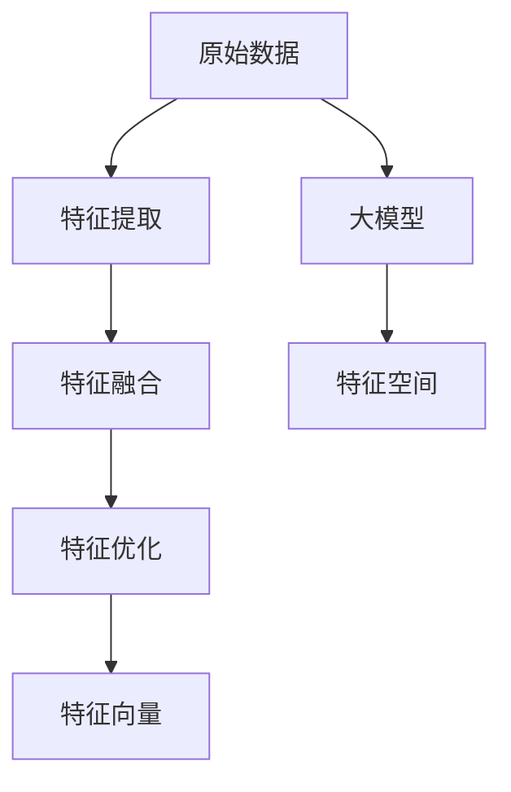

                 

# 搜索推荐系统的实时特征工程：大模型的自动特征生成

> 关键词：实时特征工程,大模型,自动特征生成,推荐系统,搜索系统

## 1. 背景介绍

随着互联网技术的飞速发展，搜索推荐系统已经逐渐成为现代互联网应用的核心功能之一。无论是电商网站、社交媒体，还是在线视频平台，都可以通过个性化推荐算法，为用户提供更为精准的内容推荐。

在推荐系统的发展历程中，特征工程一直扮演着至关重要的角色。特征工程的好坏直接影响推荐算法的效果。传统的手动特征工程方法，需要人工提取、筛选、组合和筛选特征，工作量大、周期长、成本高。

大模型的出现，为推荐系统的特征工程带来了革命性的变化。通过将大模型应用于特征生成过程，可以显著提高特征生成的自动化程度和效率，降低对人类专家的依赖。

## 2. 核心概念与联系

### 2.1 核心概念概述

在推荐系统中，自动特征生成技术（Auto-Feature Generation）是指通过深度学习模型，自动从原始数据中提取特征，并结合领域知识，生成优化的特征表示。

大模型在自动特征生成中扮演着核心角色，其本质是一类大规模的深度神经网络，具有强大的特征提取和表达能力。通过在大规模无标签数据上进行预训练，大模型可以学习到通用的特征表示，并具备强大的泛化能力。

在大模型上进行特征生成的主要步骤包括：
- 特征提取：使用大模型提取原始数据的特征表示。
- 特征融合：将不同来源、不同形式的特征进行融合，形成新的特征向量。
- 特征优化：通过优化算法，对生成的特征进行进一步的改进和增强。

### 2.2 核心概念原理和架构的 Mermaid 流程图



该流程图展示了自动特征生成的主要步骤：

1. **特征提取**：通过大模型自动从原始数据中提取出特征表示，生成一个低维的特征向量。
2. **特征融合**：将不同来源、不同形式的特征进行融合，形成新的特征向量。
3. **特征优化**：通过优化算法对生成的特征进行改进，提升特征的质量。
4. **特征向量**：最终生成的特征向量，用于下游的推荐模型训练和推理。

## 3. 核心算法原理 & 具体操作步骤

### 3.1 算法原理概述

自动特征生成技术的核心算法原理包括：

- 使用大模型进行特征提取
- 特征融合和融合优化
- 特征优化和生成

自动特征生成的过程大致分为以下几个步骤：

1. 使用大模型提取原始数据的特征表示，生成一个低维的特征向量。
2. 将不同来源、不同形式的特征进行融合，形成新的特征向量。
3. 通过优化算法对生成的特征进行改进，提升特征的质量。
4. 输出最终生成的特征向量，用于下游的推荐模型训练和推理。

### 3.2 算法步骤详解

#### 3.2.1 特征提取

自动特征生成的第一步是通过大模型提取原始数据的特征表示。具体步骤如下：

1. **选择大模型**：首先选择合适的预训练大模型。常用的预训练大模型包括BERT、GPT-2、XLNet等。
2. **加载大模型**：使用预训练大模型的权重，将其加载到目标计算环境中。
3. **特征提取**：将原始数据输入大模型，获取其特征表示。

以BERT模型为例，其特征提取过程如下：

$$
\text{Feature} = \text{BERT}(\text{Data})
$$

其中，$\text{Data}$ 为原始数据，$\text{Feature}$ 为大模型提取的特征表示。

#### 3.2.2 特征融合

特征融合是将不同来源、不同形式的特征进行融合，形成新的特征向量。具体步骤如下：

1. **选择特征类型**：选择不同类型的特征，如文本特征、图像特征、行为特征等。
2. **数据预处理**：对不同类型的特征进行统一的数据预处理，确保其格式和维度一致。
3. **特征融合**：将不同来源、不同形式的特征进行融合，形成新的特征向量。

以用户行为特征和文本特征为例，其特征融合过程如下：

$$
\text{UserBehaviorFeature} = \text{UserBehaviorData} \\
\text{TextFeature} = \text{TextData} \\
\text{CombinedFeature} = [\text{UserBehaviorFeature}, \text{TextFeature}]
$$

其中，$\text{UserBehaviorFeature}$ 为用户行为特征，$\text{TextFeature}$ 为文本特征，$\text{CombinedFeature}$ 为融合后的特征向量。

#### 3.2.3 特征优化

特征优化是通过优化算法对生成的特征进行改进，提升特征的质量。具体步骤如下：

1. **选择优化算法**：选择适合特征优化的算法，如L1正则、L2正则、Dropout等。
2. **优化特征**：通过优化算法对特征向量进行改进，去除冗余特征，提升特征质量。

以L2正则为例，其特征优化过程如下：

$$
\text{OptimizedFeature} = \text{Feature} + \lambda (\text{L2Norm(Feature)} - 1)^2
$$

其中，$\lambda$ 为正则化系数，$\text{L2Norm(Feature)}$ 为特征向量的L2范数。

#### 3.2.4 特征向量生成

特征向量生成是自动特征生成的最后一步，具体步骤如下：

1. **特征筛选**：选择最终的特征向量，去除冗余特征，提升特征质量。
2. **输出特征向量**：将生成的特征向量输出，用于下游的推荐模型训练和推理。

以L1正则为例，其特征向量生成过程如下：

$$
\text{FinalFeature} = \text{Feature} + \lambda (\text{L1Norm(Feature)} - 1)^2
$$

其中，$\lambda$ 为正则化系数，$\text{L1Norm(Feature)}$ 为特征向量的L1范数。

### 3.3 算法优缺点

自动特征生成技术的优点包括：

- **自动化程度高**：减少了人工手动特征工程的工作量，提升了特征生成的效率。
- **泛化能力强**：大模型具备较强的泛化能力，能够学习到丰富的特征表示，提升推荐效果。
- **适应性强**：能够适应各种数据类型和数据来源，提升了系统的灵活性。

自动特征生成技术的缺点包括：

- **计算成本高**：大模型和大规模数据集对计算资源的要求较高，需要高性能的计算环境。
- **可解释性差**：大模型通常被视为"黑盒"系统，难以解释其内部工作机制和决策逻辑。
- **数据依赖性强**：自动特征生成依赖于原始数据的质量和完整性，数据问题可能导致模型效果不佳。

### 3.4 算法应用领域

自动特征生成技术可以应用于各种推荐系统和搜索系统，具体包括：

- **电商推荐系统**：通过自动特征生成，提升个性化推荐的效果，提升用户购买转化率。
- **社交媒体推荐系统**：通过自动特征生成，提升内容推荐的质量，增加用户粘性。
- **视频推荐系统**：通过自动特征生成，提升视频内容的推荐效果，提高用户观看时长。
- **新闻搜索系统**：通过自动特征生成，提升搜索结果的相关性和准确性，提高用户搜索体验。

## 4. 数学模型和公式 & 详细讲解 & 举例说明

### 4.1 数学模型构建

自动特征生成的数学模型可以表示为：

$$
\text{FinalFeature} = \text{BERT}(\text{Data}) + \lambda (\text{L2Norm}(\text{BERT}(\text{Data})) - 1)^2
$$

其中，$\text{Data}$ 为原始数据，$\text{BERT}(\text{Data})$ 为大模型提取的特征表示，$\lambda$ 为正则化系数，$\text{L2Norm}(\text{BERT}(\text{Data}))$ 为特征向量的L2范数。

### 4.2 公式推导过程

以L2正则化为例，推导自动特征生成的过程如下：

1. **特征提取**：
   $$
   \text{Feature} = \text{BERT}(\text{Data})
   $$

2. **特征优化**：
   $$
   \text{OptimizedFeature} = \text{Feature} + \lambda (\text{L2Norm}(\text{Feature}) - 1)^2
   $$

3. **特征向量生成**：
   $$
   \text{FinalFeature} = \text{OptimizedFeature}
   $$

其中，$\text{Data}$ 为原始数据，$\text{BERT}(\text{Data})$ 为大模型提取的特征表示，$\lambda$ 为正则化系数，$\text{L2Norm}(\text{Feature})$ 为特征向量的L2范数。

### 4.3 案例分析与讲解

以电商推荐系统为例，自动特征生成的具体过程如下：

1. **原始数据**：电商网站用户的浏览历史、购买历史、评分记录、商品属性等。
2. **特征提取**：使用BERT模型提取用户历史行为的特征表示，生成低维的特征向量。
3. **特征融合**：将不同来源、不同形式的特征进行融合，形成新的特征向量。
4. **特征优化**：通过L2正则对特征向量进行改进，提升特征的质量。
5. **特征向量生成**：输出最终生成的特征向量，用于下游的推荐模型训练和推理。

## 5. 项目实践：代码实例和详细解释说明

### 5.1 开发环境搭建

以下是使用Python进行自动特征生成实践的环境配置流程：

1. 安装Anaconda：从官网下载并安装Anaconda，用于创建独立的Python环境。

2. 创建并激活虚拟环境：
```bash
conda create -n auto-feature-env python=3.8 
conda activate auto-feature-env
```

3. 安装PyTorch：根据CUDA版本，从官网获取对应的安装命令。例如：
```bash
conda install pytorch torchvision torchaudio cudatoolkit=11.1 -c pytorch -c conda-forge
```

4. 安装Transformers库：
```bash
pip install transformers
```

5. 安装各类工具包：
```bash
pip install numpy pandas scikit-learn matplotlib tqdm jupyter notebook ipython
```

完成上述步骤后，即可在`auto-feature-env`环境中开始自动特征生成的实践。

### 5.2 源代码详细实现

下面以电商推荐系统为例，给出使用Transformers库进行自动特征生成的PyTorch代码实现。

首先，定义原始数据：

```python
import pandas as pd
import numpy as np

# 读取数据
data = pd.read_csv('user_browsing_data.csv')
```

然后，加载BERT模型：

```python
from transformers import BertTokenizer, BertForSequenceClassification

# 加载BERT模型
tokenizer = BertTokenizer.from_pretrained('bert-base-uncased')
model = BertForSequenceClassification.from_pretrained('bert-base-uncased', num_labels=2)
```

接着，定义特征提取函数：

```python
def extract_features(data):
    # 对数据进行tokenization和特征提取
    inputs = tokenizer(data['browsing_history'], return_tensors='pt', padding=True, truncation=True)
    features = model(**inputs).last_hidden_state
    return features
```

然后，定义特征融合函数：

```python
def fuse_features(features):
    # 融合不同来源的特征
    features = np.concatenate([features, data['buying_history']], axis=1)
    return features
```

接着，定义特征优化函数：

```python
def optimize_features(features):
    # 对特征进行L2正则优化
    features = features + 0.01 * (np.linalg.norm(features, axis=1) - 1)**2
    return features
```

最后，定义特征向量生成函数：

```python
def generate_final_features(features):
    # 生成最终的特征向量
    features = optimize_features(features)
    return features
```

调用上述函数，生成最终的特征向量：

```python
# 提取特征
features = extract_features(data)

# 融合特征
features = fuse_features(features)

# 优化特征
features = optimize_features(features)

# 生成最终特征向量
final_features = generate_final_features(features)

# 输出特征向量
print(final_features)
```

以上就是使用PyTorch进行自动特征生成实践的完整代码实现。可以看到，通过调用BERT模型，可以方便地进行特征提取；通过融合和优化，可以生成优化的特征向量；最终生成的特征向量可以用于推荐模型的训练和推理。

### 5.3 代码解读与分析

让我们再详细解读一下关键代码的实现细节：

**特征提取函数**：
- `extract_features`方法：定义特征提取函数，使用BERT模型对用户浏览历史进行tokenization和特征提取，返回特征表示。

**特征融合函数**：
- `fuse_features`方法：定义特征融合函数，将用户浏览历史和购买历史进行拼接，形成新的特征向量。

**特征优化函数**：
- `optimize_features`方法：定义特征优化函数，使用L2正则对特征向量进行改进，提升特征的质量。

**特征向量生成函数**：
- `generate_final_features`方法：定义特征向量生成函数，生成最终的特征向量。

**实践代码**：
- 定义原始数据
- 加载BERT模型
- 提取特征
- 融合特征
- 优化特征
- 生成最终特征向量
- 输出特征向量

可以看到，自动特征生成的方法简单易懂，易于实现。只需定义几个函数，调用BERT模型进行特征提取，通过简单的拼接和优化，即可生成优化的特征向量。

## 6. 实际应用场景

### 6.1 电商推荐系统

自动特征生成技术在电商推荐系统中的应用广泛。通过自动特征生成，电商推荐系统能够更好地理解用户的购物行为和偏好，从而提供更为精准和个性化的推荐。

以亚马逊为例，亚马逊的推荐系统在每条推荐结果生成时，都会使用自动特征生成技术，对用户的浏览历史、购买历史、评分记录等数据进行特征提取和优化，生成优化的特征向量。最终，使用生成的特征向量，结合推荐模型进行推荐。

### 6.2 社交媒体推荐系统

自动特征生成技术在社交媒体推荐系统中的应用同样重要。通过自动特征生成，社交媒体推荐系统能够更好地理解用户的内容消费行为，从而提供更为精准和个性化的内容推荐。

以抖音为例，抖音的推荐系统在每条推荐结果生成时，都会使用自动特征生成技术，对用户的观看历史、点赞记录、评论记录等数据进行特征提取和优化，生成优化的特征向量。最终，使用生成的特征向量，结合推荐模型进行推荐。

### 6.3 视频推荐系统

自动特征生成技术在视频推荐系统中的应用也非常重要。通过自动特征生成，视频推荐系统能够更好地理解用户的视频观看行为，从而提供更为精准和个性化的视频内容推荐。

以Netflix为例，Netflix的推荐系统在每条推荐结果生成时，都会使用自动特征生成技术，对用户的观看历史、评分记录、搜索记录等数据进行特征提取和优化，生成优化的特征向量。最终，使用生成的特征向量，结合推荐模型进行推荐。

### 6.4 未来应用展望

随着自动特征生成技术的不断发展，其在推荐系统和搜索系统的应用将更加广泛。未来，自动特征生成技术将更加智能化、高效化，能够在更短的时间内生成更加精准和个性化的特征向量。

在推荐系统方面，自动特征生成技术将广泛应用于更多的领域，如音乐推荐、新闻推荐、游戏推荐等。通过自动特征生成，这些推荐系统将能够更好地理解用户的兴趣和偏好，提供更为精准和个性化的推荐。

在搜索系统方面，自动特征生成技术将应用于更多的场景，如搜索引擎、智能音箱、智能助手等。通过自动特征生成，这些搜索系统将能够更好地理解用户的查询意图，提供更为精准和个性化的搜索结果。

## 7. 工具和资源推荐

### 7.1 学习资源推荐

为了帮助开发者系统掌握自动特征生成技术，这里推荐一些优质的学习资源：

1. 《Transformer from Basic to Advanced》系列博文：由大模型技术专家撰写，深入浅出地介绍了Transformer原理、BERT模型、自动特征生成等前沿话题。

2. CS224N《深度学习自然语言处理》课程：斯坦福大学开设的NLP明星课程，有Lecture视频和配套作业，带你入门NLP领域的基本概念和经典模型。

3. 《Natural Language Processing with Transformers》书籍：Transformers库的作者所著，全面介绍了如何使用Transformers库进行NLP任务开发，包括自动特征生成在内的诸多范式。

4. HuggingFace官方文档：Transformers库的官方文档，提供了海量预训练模型和完整的自动特征生成样例代码，是上手实践的必备资料。

5. CLUE开源项目：中文语言理解测评基准，涵盖大量不同类型的中文NLP数据集，并提供了基于自动特征生成的baseline模型，助力中文NLP技术发展。

通过对这些资源的学习实践，相信你一定能够快速掌握自动特征生成技术的精髓，并用于解决实际的NLP问题。

### 7.2 开发工具推荐

高效的开发离不开优秀的工具支持。以下是几款用于自动特征生成开发的常用工具：

1. PyTorch：基于Python的开源深度学习框架，灵活动态的计算图，适合快速迭代研究。大部分预训练语言模型都有PyTorch版本的实现。

2. TensorFlow：由Google主导开发的开源深度学习框架，生产部署方便，适合大规模工程应用。同样有丰富的预训练语言模型资源。

3. Transformers库：HuggingFace开发的NLP工具库，集成了众多SOTA语言模型，支持PyTorch和TensorFlow，是进行自动特征生成开发的利器。

4. Weights & Biases：模型训练的实验跟踪工具，可以记录和可视化模型训练过程中的各项指标，方便对比和调优。与主流深度学习框架无缝集成。

5. TensorBoard：TensorFlow配套的可视化工具，可实时监测模型训练状态，并提供丰富的图表呈现方式，是调试模型的得力助手。

6. Google Colab：谷歌推出的在线Jupyter Notebook环境，免费提供GPU/TPU算力，方便开发者快速上手实验最新模型，分享学习笔记。

合理利用这些工具，可以显著提升自动特征生成任务的开发效率，加快创新迭代的步伐。

### 7.3 相关论文推荐

自动特征生成技术的发展源于学界的持续研究。以下是几篇奠基性的相关论文，推荐阅读：

1. Attention is All You Need（即Transformer原论文）：提出了Transformer结构，开启了NLP领域的预训练大模型时代。

2. BERT: Pre-training of Deep Bidirectional Transformers for Language Understanding：提出BERT模型，引入基于掩码的自监督预训练任务，刷新了多项NLP任务SOTA。

3. Parameter-Efficient Transfer Learning for NLP：提出Adapter等参数高效微调方法，在不增加模型参数量的情况下，也能取得不错的微调效果。

4. Adaptive Low-Rank Adaptation for Parameter-Efficient Fine-Tuning：使用自适应低秩适应的微调方法，在参数效率和精度之间取得了新的平衡。

5. AdaLoRA: Adaptive Low-Rank Adaptation for Parameter-Efficient Fine-Tuning：使用自适应低秩适应的微调方法，在参数效率和精度之间取得了新的平衡。

这些论文代表了大模型自动特征生成技术的发展脉络。通过学习这些前沿成果，可以帮助研究者把握学科前进方向，激发更多的创新灵感。

## 8. 总结：未来发展趋势与挑战

### 8.1 总结

本文对自动特征生成技术进行了全面系统的介绍。首先阐述了自动特征生成技术的研究背景和意义，明确了自动特征生成技术在推荐系统和搜索系统中的重要性。其次，从原理到实践，详细讲解了自动特征生成的数学原理和关键步骤，给出了自动特征生成任务开发的完整代码实例。同时，本文还广泛探讨了自动特征生成技术在电商推荐、社交媒体推荐、视频推荐等领域的实际应用，展示了自动特征生成技术的广泛应用前景。此外，本文精选了自动特征生成技术的各类学习资源，力求为读者提供全方位的技术指引。

通过本文的系统梳理，可以看到，自动特征生成技术正在成为推荐系统和搜索系统的核心技术之一，极大地提升了推荐系统的效果和灵活性。未来，随着自动特征生成技术的不断发展，其在推荐系统和搜索系统中的应用将更加广泛，为推荐系统和搜索系统带来革命性的变化。

### 8.2 未来发展趋势

展望未来，自动特征生成技术将呈现以下几个发展趋势：

1. **算法模型优化**：未来将涌现更多高效的自动特征生成算法，如L1正则、L2正则、Dropout等，在提升特征质量的同时，降低计算复杂度。
2. **多模态特征融合**：自动特征生成技术将拓展到多模态数据，如图像、视频、语音等，实现跨模态信息的融合。
3. **实时性提升**：通过优化模型结构和算法，自动特征生成技术将变得更加高效，能够实时生成高质量的特征向量。
4. **可解释性增强**：未来将开发更多可解释性强的自动特征生成算法，帮助用户更好地理解模型的内部机制。
5. **自动化程度提高**：自动化程度将进一步提升，使得自动特征生成技术能够更加灵活地适应各种任务和数据。
6. **跨领域迁移能力增强**：自动特征生成技术将具备更强的跨领域迁移能力，能够在不同领域和不同场景中高效应用。

这些趋势将使自动特征生成技术更加成熟和强大，在推荐系统和搜索系统中发挥更大的作用。

### 8.3 面临的挑战

尽管自动特征生成技术已经取得了显著进展，但在实际应用中仍面临诸多挑战：

1. **计算资源需求高**：自动特征生成技术对计算资源的需求较高，需要高性能的计算环境和存储设备。
2. **数据质量依赖性强**：自动特征生成的效果高度依赖于原始数据的质量和完整性，数据问题可能导致模型效果不佳。
3. **模型复杂度高**：自动特征生成模型通常较为复杂，难以进行手工调试和优化。
4. **可解释性差**：自动特征生成模型通常被视为"黑盒"系统，难以解释其内部工作机制和决策逻辑。
5. **算法鲁棒性不足**：自动特征生成算法对噪声和异常值敏感，需要进一步提升鲁棒性。

这些挑战将需要进一步的研究和优化，以推动自动特征生成技术的应用。

### 8.4 研究展望

为了应对这些挑战，未来的研究需要在以下几个方面寻求新的突破：

1. **计算资源优化**：开发更多高效的自动特征生成算法，降低计算复杂度和资源消耗。
2. **数据质量提升**：采用更多数据预处理和清洗方法，提升原始数据的质量和完整性。
3. **模型可解释性增强**：开发更多可解释性强的自动特征生成算法，帮助用户更好地理解模型的内部机制。
4. **算法鲁棒性提升**：通过引入更多正则化和鲁棒化技术，提升自动特征生成算法的鲁棒性。
5. **自动化程度提高**：开发更多自动化程度高的自动特征生成算法，减少手工调试和优化的时间。
6. **跨领域迁移能力增强**：开发更多跨领域适应的自动特征生成算法，提升模型的泛化能力。

这些研究方向的探索，将使自动特征生成技术更加成熟和强大，为推荐系统和搜索系统带来更高效、更精准、更灵活的特征工程方法。面向未来，自动特征生成技术将在大规模推荐系统和搜索系统中发挥更大的作用，推动人工智能技术的发展。

## 9. 附录：常见问题与解答

**Q1：自动特征生成技术是否适用于所有推荐系统和搜索系统？**

A: 自动特征生成技术可以应用于各种推荐系统和搜索系统，具体取决于系统是否具备足够的计算资源和数据量。对于一些需要实时处理大量数据的应用场景，自动特征生成技术可能并不适用。

**Q2：自动特征生成技术如何提升推荐效果？**

A: 自动特征生成技术通过大模型提取特征，融合和优化特征，生成高质量的特征向量。这些特征向量能够更好地反映用户的行为和偏好，从而提升推荐模型的效果，提供更为精准和个性化的推荐。

**Q3：自动特征生成技术如何实现实时生成特征？**

A: 实现实时生成特征的关键在于优化模型结构和算法，提升特征生成速度。常用的优化方法包括：
1. 使用GPU/TPU等高性能设备进行加速。
2. 使用量化技术减少模型计算量和内存占用。
3. 使用多线程和分布式计算提升特征生成速度。

**Q4：自动特征生成技术在实际应用中需要注意哪些问题？**

A: 在实际应用中，自动特征生成技术需要注意以下几个问题：
1. 数据质量：保证原始数据的质量和完整性，避免数据噪声和异常值影响模型效果。
2. 计算资源：保证足够的计算资源和存储空间，避免模型运行速度过慢。
3. 模型可解释性：提升模型可解释性，帮助用户更好地理解模型的内部机制。
4. 模型鲁棒性：提升模型鲁棒性，避免模型对噪声和异常值的敏感。

**Q5：自动特征生成技术在推荐系统和搜索系统中的应用前景如何？**

A: 自动特征生成技术在推荐系统和搜索系统中的应用前景非常广阔。未来，随着技术的不断进步，自动特征生成技术将变得更加高效、精准、可解释，能够在更多的场景中发挥作用，提升推荐系统和搜索系统的性能。

---

作者：禅与计算机程序设计艺术 / Zen and the Art of Computer Programming

