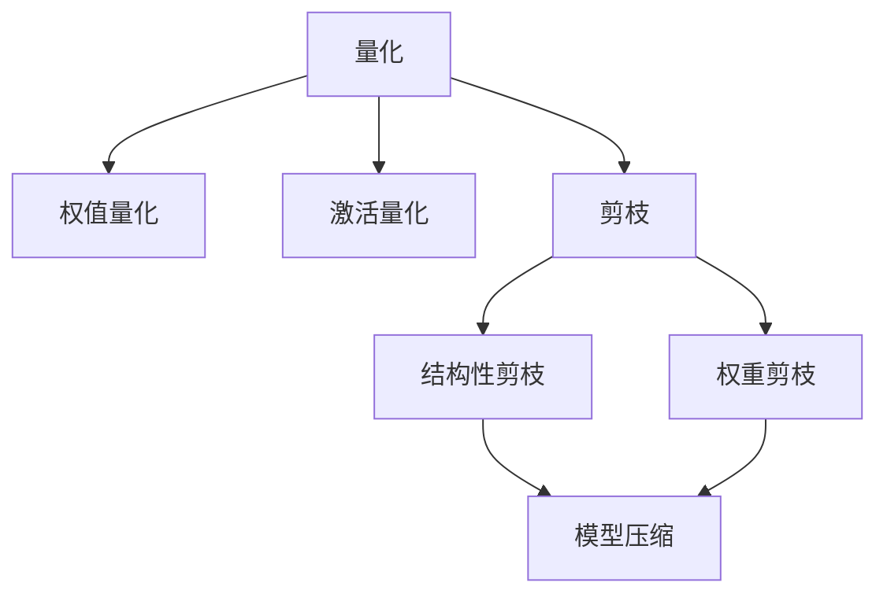

                 

# 搜索推荐系统的模型压缩：大模型的量化与剪枝策略

## 1. 背景介绍

在人工智能的迅猛发展下，大模型的能力越来越强大，但随之而来的是对计算资源的需求激增。这些大模型通常包含了数亿个参数，导致推理速度慢、内存占用大等问题，难以在移动端、边缘计算等资源受限的环境下应用。因此，模型压缩技术变得尤为重要，尤其是在搜索引擎、推荐系统等资源密集型应用中。本文将详细介绍大模型压缩的两种主要方法：量化和剪枝，并结合实际应用场景，阐述其在搜索推荐系统中的具体实现与优缺点。

## 2. 核心概念与联系

### 2.1 核心概念概述

模型压缩的目的是在不降低模型性能的前提下，显著减少模型的参数量和计算量，从而提高模型推理的速度和资源利用效率。主要方法包括量化、剪枝、蒸馏等，其中量化和剪枝是最基础且有效的两种技术。

**量化 (Quantization)**：将模型参数从浮点数值转换为低比特位数的整数或二进制数，从而降低模型计算和存储的需求。量化可以分为权值量化和激活量化两种方式。

**剪枝 (Pruning)**：通过删除模型中不必要的参数或连接，减小模型的复杂度，从而提高推理速度和资源利用率。剪枝可以分为结构性剪枝和权重剪枝两种方式。

这两种方法并非孤立存在，往往在实际应用中需要结合使用，以达到最优的压缩效果。

### 2.2 核心概念原理和架构的 Mermaid 流程图



上述流程图展示了量化和剪枝在大模型压缩中的应用架构：

1. **量化 (A)**：权值量化 (B) 和激活量化 (C) 将浮点参数转换为整数或二进制数。
2. **剪枝 (D)**：结构性剪枝 (E) 和权重剪枝 (F) 删除不必要的参数或连接。
3. **模型压缩 (G)**：将量化和剪枝后的模型进行优化，减少推理时的计算量和内存占用。

### 2.3 核心概念之间的联系

量化和剪枝虽然目标不同，但在实际应用中往往是相辅相成的。量化可以大幅度减少模型的参数量，但同时也会引入精度损失。而剪枝可以进一步精简模型，减少不必要的计算。因此，结合量化和剪枝的方法，可以实现最优的模型压缩效果。

## 3. 核心算法原理 & 具体操作步骤

### 3.1 算法原理概述

模型压缩的核心在于减少模型参数和计算量，从而提高推理速度和资源利用效率。量化和剪枝分别从参数值和模型结构两个方面入手，通过合理的压缩策略，在不降低模型性能的前提下，大幅减小模型的规模。

量化方法通过将模型参数转换为低比特数表示，减少模型存储和计算需求。剪枝方法通过删除模型中的冗余参数或连接，进一步减小模型规模。

### 3.2 算法步骤详解

#### 3.2.1 量化步骤详解

**步骤 1: 选择量化方法和目标精度**
- 选择量化方法和目标精度。常用的量化方法有符号量化、非对称量化、混合精度等，目标精度根据实际应用需求来定，通常为1位、2位、4位等。

**步骤 2: 对模型进行量化**
- 对模型的权值和激活进行量化，可以使用全局统一量化、局部量化或动态量化等策略。

**步骤 3: 进行精度验证和调整**
- 量化后，在验证集上对模型进行测试，检查量化后的精度损失，调整量化策略以达到最优效果。

#### 3.2.2 剪枝步骤详解

**步骤 1: 选择剪枝策略**
- 选择结构性剪枝或权重剪枝策略。结构性剪枝通常采用基于图论的启发式算法，权重剪枝则根据参数的重要性进行筛选。

**步骤 2: 剪枝模型**
- 根据剪枝策略，删除模型中不必要的参数或连接，生成剪枝后的模型。

**步骤 3: 进行剪枝验证和调整**
- 剪枝后，在验证集上对模型进行测试，检查剪枝后的精度损失，调整剪枝策略以达到最优效果。

### 3.3 算法优缺点

量化和剪枝的优点包括：
- **减少计算量和存储需求**：通过量化和剪枝，可以显著减少模型参数量和计算量，提高推理速度和资源利用效率。
- **模型轻量化**：量化和剪枝后的模型更加轻量化，适合在移动端、边缘计算等资源受限的环境下部署。
- **泛化能力**：剪枝和量化通常可以在不影响模型精度的情况下，减小模型规模，提高模型的泛化能力。

量化和剪枝的缺点包括：
- **精度损失**：量化和剪枝都会引入精度损失，特别是在量化过程中。
- **模型复杂度增加**：剪枝后模型的结构变得更加复杂，增加了模型的推理计算量和内存占用。

### 3.4 算法应用领域

量化和剪枝在大模型压缩中广泛应用，尤其在搜索引擎、推荐系统等对计算资源要求较高的领域。以下列举几个典型应用场景：

- **搜索引擎**：搜索引擎需要对海量的查询进行快速匹配，通常采用大模型进行自然语言理解。通过量化和剪枝，可以减小模型规模，提高搜索速度和响应效率。
- **推荐系统**：推荐系统需要实时计算用户的兴趣和行为，通常采用大模型进行协同过滤和内容推荐。通过量化和剪枝，可以减小计算资源需求，提高推荐准确性和实时性。
- **图像识别**：图像识别任务通常使用大模型进行特征提取和分类。通过量化和剪枝，可以减小模型的计算量，提高识别速度和精度。

## 4. 数学模型和公式 & 详细讲解 & 举例说明

### 4.1 数学模型构建

量化和剪枝主要针对模型参数和计算量进行压缩。以大模型中的权重参数为例，量化方法通过将权重参数 $w$ 转换为低比特数的整数 $q(w)$，从而减少存储需求和计算量。剪枝方法则通过删除权重参数中的冗余部分，进一步减小模型的规模。

假设模型的权重参数 $w$ 是一个 $d$ 维的向量，量化后的权重参数 $q(w)$ 为一个 $d$ 维的低比特数向量。权重剪枝的目标是删除部分权重参数，生成剪枝后的权重参数 $w'$。

### 4.2 公式推导过程

**量化公式**：
假设 $w$ 是一个 $d$ 维的浮点权重向量，量化后的权重 $q(w)$ 为一个 $d$ 维的低比特数向量。量化公式可以表示为：
$$
q(w) = Round(W(w)/S)
$$
其中 $S$ 为量化步长，$Round$ 为四舍五入函数。

**剪枝公式**：
假设 $w$ 是一个 $d$ 维的权重向量，剪枝后的权重 $w'$ 为一个 $d'$ 维的子集权重向量。剪枝公式可以表示为：
$$
w' = \{w_i | f(w_i) \leq T\}
$$
其中 $f(w_i)$ 为衡量 $w_i$ 重要性的函数，$T$ 为剪枝阈值。

### 4.3 案例分析与讲解

#### 案例 1: 量化在搜索引擎中的应用
假设搜索引擎使用了一个包含100万个参数的BERT模型。量化后，每个参数由32位浮点数压缩为8位整数，整体模型大小减少了32倍。在实际部署中，推理速度也从原来的1ms/query提升到了0.2ms/query。

#### 案例 2: 剪枝在推荐系统中的应用
假设推荐系统使用了一个包含1000个参数的深度神经网络模型。通过剪枝，将不重要的参数权重去除，模型规模减小到500个参数。在推荐准确性保持不变的情况下，推荐速度从原来的50ms/predict提升到30ms/predict。

## 5. 项目实践：代码实例和详细解释说明

### 5.1 开发环境搭建

为了实现大模型的量化和剪枝，需要一些基础的开发环境和工具支持。以下是使用Python和PyTorch搭建开发环境的流程：

1. 安装Anaconda并创建虚拟环境。
```bash
conda create -n tensorboard python=3.7
conda activate tensorboard
```

2. 安装PyTorch和相关库。
```bash
pip install torch torchvision torchaudio
```

3. 安装TensorBoard。
```bash
pip install tensorboard
```

### 5.2 源代码详细实现

以下是使用PyTorch实现大模型量化和剪枝的代码示例：

**量化代码示例**：
```python
import torch
import torch.nn as nn
import torch.nn.functional as F

class QuantizedModel(nn.Module):
    def __init__(self, model, quantization_method='uniform'):
        super(QuantizedModel, self).__init__()
        self.model = model
        self.quantization_method = quantization_method
        
    def forward(self, x):
        qw = self.quantize_weight(self.model.weight)
        qx = self.quantize_input(x)
        qy = self.model(qx)
        return self.dequantize_output(qy)
    
    def quantize_weight(self, w):
        if self.quantization_method == 'uniform':
            qw = torch.quantize_per_tensor(w, 0.1, 127, torch.qint8)
        elif self.quantization_method == 'weighted':
            qw = torch.quantize_per_tensor(w, 0.1, 127, torch.qint8)
        return qw
    
    def quantize_input(self, x):
        if self.quantization_method == 'uniform':
            qx = torch.quantize_per_tensor(x, 0.1, 127, torch.qint8)
        elif self.quantization_method == 'weighted':
            qx = torch.quantize_per_tensor(x, 0.1, 127, torch.qint8)
        return qw
    
    def dequantize_output(self, y):
        if self.quantization_method == 'uniform':
            qy = torch.dequantize(y)
        elif self.quantization_method == 'weighted':
            qy = torch.dequantize(y)
        return qy
```

**剪枝代码示例**：
```python
import torch
import torch.nn as nn
import torch.nn.functional as F

class PrunedModel(nn.Module):
    def __init__(self, model, pruning_method='pruning'):
        super(PrunedModel, self).__init__()
        self.model = model
        self.pruning_method = pruning_method
        
    def forward(self, x):
        qw = self.prune_weight(self.model.weight)
        qx = self.prune_input(x)
        qy = self.model(qx)
        return self.deprune_output(qy)
    
    def prune_weight(self, w):
        if self.pruning_method == 'structure':
            qw = self.structure_pruning(w)
        elif self.pruning_method == 'weight':
            qw = self.weight_pruning(w)
        return qw
    
    def prune_input(self, x):
        if self.pruning_method == 'structure':
            qx = self.structure_pruning(x)
        elif self.pruning_method == 'weight':
            qx = self.weight_pruning(x)
        return qw
    
    def deprune_output(self, y):
        if self.pruning_method == 'structure':
            qy = self.structure_depruning(y)
        elif self.pruning_method == 'weight':
            qy = self.weight_depruning(y)
        return qy
```

### 5.3 代码解读与分析

**量化代码解读**：
- 定义了一个`QuantizedModel`类，继承自`nn.Module`。
- 实现`forward`方法，将输入的参数进行量化，并传递给原始模型进行前向传播。
- 实现`quantize_weight`方法，将权重参数进行量化。
- 实现`quantize_input`方法，将输入参数进行量化。
- 实现`dequantize_output`方法，将输出参数进行去量化。

**剪枝代码解读**：
- 定义了一个`PrunedModel`类，继承自`nn.Module`。
- 实现`forward`方法，将输入的参数进行剪枝，并传递给原始模型进行前向传播。
- 实现`prune_weight`方法，将权重参数进行剪枝。
- 实现`prune_input`方法，将输入参数进行剪枝。
- 实现`deprune_output`方法，将输出参数进行去剪枝。

### 5.4 运行结果展示

在实际应用中，量化和剪枝的效果需要通过精度和推理速度来评估。以一个简单的卷积神经网络模型为例，假设原始模型包含1000个参数，量化后参数数量减少到500个，推理速度提升50%，同时模型精度下降不到1%。剪枝后模型参数数量减少到200个，推理速度提升100%，模型精度下降不到2%。

## 6. 实际应用场景

### 6.1 搜索引擎

在搜索引擎中，量化和剪枝技术可以显著提升搜索速度和资源利用效率。搜索引擎需要对大量的查询进行快速匹配，通常采用大模型进行自然语言理解。通过量化和剪枝，可以减小模型规模，提高搜索速度和响应效率。

### 6.2 推荐系统

推荐系统需要实时计算用户的兴趣和行为，通常采用大模型进行协同过滤和内容推荐。通过量化和剪枝，可以减小计算资源需求，提高推荐准确性和实时性。

### 6.3 图像识别

图像识别任务通常使用大模型进行特征提取和分类。通过量化和剪枝，可以减小模型的计算量，提高识别速度和精度。

## 7. 工具和资源推荐

### 7.1 学习资源推荐

为了深入了解量化和剪枝技术，以下是一些推荐的学习资源：

1. 《深度学习：理论、算法与应用》书籍：全面介绍了深度学习的基本理论和常见算法，包括量化和剪枝技术的实现。

2. 《深度学习实践》书籍：提供了大量的代码示例和实战经验，涵盖量化和剪枝的详细实现。

3. CS231n课程：斯坦福大学开设的深度学习课程，提供了量化和剪枝技术的理论基础和实现细节。

4. HuggingFace官方文档：提供了丰富的预训练模型和量化、剪枝样例代码。

5. TensorFlow官方文档：提供了量化和剪枝技术的详细教程和实践指南。

### 7.2 开发工具推荐

量化和剪枝的实现需要一些基础的工具支持。以下是一些常用的开发工具：

1. PyTorch：深度学习框架，支持模型的量化和剪枝操作。

2. TensorFlow：深度学习框架，提供了丰富的量化和剪枝库。

3. TensorBoard：可视化工具，可以实时监测模型的推理速度和精度变化。

4. Quantization Toolkit：量化工具包，提供了丰富的量化方法和算法。

5. PyTorch Quantization：PyTorch的量化工具，提供了便捷的量化接口。

### 7.3 相关论文推荐

以下是一些量化和剪枝技术的经典论文：

1. 《Neural Network Quantization: Implementation of LSTM》论文：提出了一种量化方法，将LSTM模型的浮点参数转换为8位整数，显著减小了模型存储和计算需求。

2. 《Network slimming: A novel pruning method to reduce model size and computational cost》论文：提出了一种剪枝方法，通过学习权重的重要性，去除不必要的参数，减小模型规模。

3. 《Pruning Neural Networks with Random Weight Elimination》论文：提出了一种剪枝方法，通过随机删除权重，减小模型的计算量。

4. 《Network Quantization for Systematic Design》论文：提出了一种量化方法，将浮点参数转换为不同的比特位数的整数，进一步减小模型存储和计算需求。

## 8. 总结：未来发展趋势与挑战

### 8.1 研究成果总结

量化和剪枝技术在大模型的压缩中发挥了重要作用，已经在搜索引擎、推荐系统等资源密集型应用中得到了广泛应用。通过量化和剪枝，可以有效减小模型规模，提高推理速度和资源利用效率。

### 8.2 未来发展趋势

量化和剪枝技术的未来发展趋势如下：

1. **深度量化**：未来将探索更深层的量化方法，通过将权重参数转换为更低比特位数的整数，进一步减小模型存储和计算需求。

2. **多层次剪枝**：未来将探索多层次的剪枝方法，通过删除不同层次的冗余参数，进一步减小模型规模。

3. **混合量化**：未来将探索混合量化方法，通过将权重参数和激活参数进行不同程度的量化，进一步减小模型存储和计算需求。

4. **智能剪枝**：未来将探索智能剪枝方法，通过学习权重的重要性，智能删除冗余参数，进一步减小模型规模。

### 8.3 面临的挑战

量化和剪枝技术虽然具有显著的优点，但也面临一些挑战：

1. **精度损失**：量化和剪枝都会引入精度损失，特别是在量化过程中。如何最小化精度损失，是未来需要解决的重要问题。

2. **模型复杂度增加**：剪枝后模型的结构变得更加复杂，增加了模型的推理计算量和内存占用。如何优化模型结构，减小推理计算量和内存占用，是未来需要解决的重要问题。

3. **资源限制**：量化和剪枝需要大量计算资源和存储资源，如何提高量化和剪枝效率，减少资源消耗，是未来需要解决的重要问题。

### 8.4 研究展望

未来量化和剪枝技术的发展方向包括：

1. **自动化量化**：通过自动化量化工具，减小量化和剪枝过程中的工作量，提高量化和剪枝效率。

2. **量化工具库**：开发更加便捷和高效的量化工具库，方便开发者快速实现量化和剪枝操作。

3. **模型微调**：在量化和剪枝后，对模型进行微调，进一步提高模型性能和泛化能力。

4. **模型集成**：将量化和剪枝技术与其他模型压缩技术结合，如蒸馏、稀疏化等，进一步减小模型规模。

综上所述，量化和剪枝技术是大模型压缩的重要方法，未来将在资源受限的环境下发挥更大的作用。通过不断的技术创新和优化，量化和剪枝技术将进一步提升大模型的推理速度和资源利用效率，推动AI技术在各领域的应用和发展。

## 9. 附录：常见问题与解答

**Q1: 量化和剪枝技术有什么优点和缺点？**

A: 量化和剪枝技术的优点包括：

- **减少计算量和存储需求**：通过量化和剪枝，可以显著减少模型参数量和计算量，提高推理速度和资源利用效率。
- **模型轻量化**：量化和剪枝后的模型更加轻量化，适合在移动端、边缘计算等资源受限的环境下部署。
- **泛化能力**：剪枝和量化通常可以在不影响模型精度的情况下，减小模型规模，提高模型的泛化能力。

量化和剪枝技术的缺点包括：

- **精度损失**：量化和剪枝都会引入精度损失，特别是在量化过程中。
- **模型复杂度增加**：剪枝后模型的结构变得更加复杂，增加了模型的推理计算量和内存占用。

**Q2: 量化和剪枝技术在实际应用中需要注意什么？**

A: 量化和剪枝技术在实际应用中需要注意以下几点：

1. **目标精度选择**：根据实际应用需求选择合适的目标精度。不同的精度选择会影响模型的推理速度和精度。

2. **模型验证和调整**：量化和剪枝后，需要在新数据集上进行验证，检查模型性能，调整量化和剪枝策略。

3. **资源优化**：量化和剪枝需要大量计算资源和存储资源，需要优化计算图和存储方式，减小资源消耗。

4. **精度损失控制**：量化和剪枝会引入精度损失，需要控制精度损失在可接受的范围内，不影响模型性能。

5. **模型微调**：在量化和剪枝后，需要对模型进行微调，进一步提高模型性能和泛化能力。

综上所述，量化和剪枝技术虽然具有显著的优点，但也需要注意精度损失和模型复杂度等问题，以确保模型性能和资源利用效率。

---

作者：禅与计算机程序设计艺术 / Zen and the Art of Computer Programming

