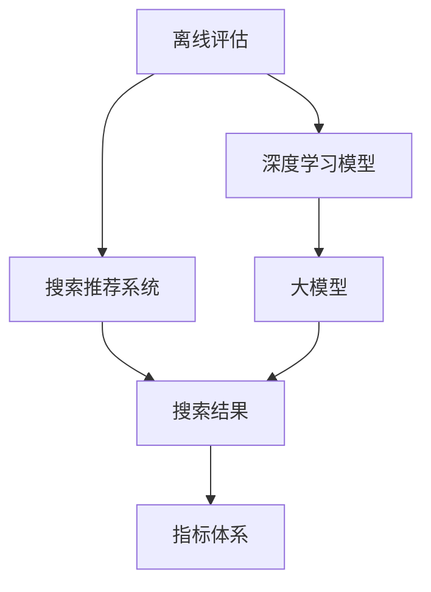

                 

# 搜索推荐系统的离线评估：大模型新指标体系

> 关键词：搜索推荐系统,大模型,离线评估,指标体系,预测精度,召回率,覆盖率,用户满意度,特征维度

## 1. 背景介绍

在当前数字化社会，搜索推荐系统(Information Retrieval and Recommendation System, IR/Rec)无处不在，广泛应用于电商、新闻、社交媒体等多个领域。无论是智能导购还是内容推荐，搜索推荐系统都在提升用户体验、降低用户选择成本方面起到了关键作用。

然而，搜索推荐系统的评估和优化是一个持续的过程，由于实时环境的不确定性，离线评估(Offline Evaluation)成为评价模型性能的重要手段。传统的离线评估指标如精度(Precision)、召回率(Recall)等，主要关注搜索结果的准确性，但无法全面反映用户的真实体验和满意度。近年来，随着预训练大模型的兴起，基于深度学习的搜索推荐系统模型在精度上取得了显著提升，但仍存在模型过度拟合、泛化能力不足等问题。因此，有必要在评估指标体系上做出改进，以更好地指导模型优化。

## 2. 核心概念与联系

### 2.1 核心概念概述

为理解离线评估指标体系的改进，需先了解一些核心概念：

- **离线评估**：在模型训练集上进行评估，衡量模型的预测效果。离线评估主要用于模型调优和比对，而不直接反映实时系统的表现。
- **搜索推荐系统**：通过用户输入的查询，从海量数据中推荐最相关的结果，辅助用户完成信息查找和内容消费。
- **深度学习模型**：以神经网络为基础的模型，能够从数据中自动学习特征表示，广泛应用于图像、语音、文本等各类任务。
- **大模型**：指参数量庞大、拥有丰富知识表示的深度学习模型，如BERT、GPT-3等。
- **指标体系**：用于量化和比较搜索推荐模型效果的各类评估指标，包括精度、召回率、覆盖率、用户满意度等。

这些概念之间的联系可以通过以下Mermaid流程图展示：



此图展示了离线评估与深度学习模型、搜索推荐系统、大模型和搜索结果指标体系的关系。离线评估通过对大模型训练的结果进行评估，改进搜索推荐系统的精度和用户体验。

### 2.2 核心概念原理和架构

- **深度学习模型**：以多层神经网络为代表的深度学习模型，通过反向传播算法训练，能够从数据中学习特征表示，应用于各种任务。常用的模型有CNN、RNN、LSTM、Transformer等。
- **大模型**：参数量较大的深度学习模型，如BERT、GPT-3等。这些模型通过预训练在大量数据上学习广泛的语义知识，能在特定任务上快速微调并取得良好效果。
- **搜索推荐系统**：由查询输入、匹配检索、排序推荐等多个模块组成，目标是从数据中推荐最相关的结果。
- **离线评估**：利用训练集数据，对模型进行评估和优化，常用指标有精度、召回率、覆盖率、用户满意度等。

### 2.3 核心概念之间的联系

这些概念通过以下逻辑关系连接：

1. 深度学习模型和大模型是基础，通过在大规模无标签数据上的预训练获得丰富的语义表示。
2. 大模型作为预训练的基础，用于搜索推荐系统的微调，提升模型精度和用户体验。
3. 搜索推荐系统需要大量的查询和推荐数据，而这些数据往往需要离线评估来衡量模型效果。
4. 离线评估通过各类指标，反馈搜索推荐系统的表现，指导模型的优化。

## 3. 核心算法原理 & 具体操作步骤
### 3.1 算法原理概述

离线评估的核心是衡量搜索结果的匹配程度，常用的指标有精度(Precision)、召回率(Recall)、覆盖率(Coverage)、用户满意度(User Satisfaction)等。这些指标的计算公式如下：

- 精度 = 相关结果数 / 总推荐结果数
- 召回率 = 相关结果数 / 真实结果数
- 覆盖率 = 不同查询的相关结果数 / 查询数
- 用户满意度 = 平均满意度评分

在实际应用中，需要根据具体场景选择合适的指标进行评估。

### 3.2 算法步骤详解

离线评估的步骤主要包括：

1. 数据准备：收集标注数据集，按查询-推荐结果进行划分。
2. 模型训练：在标注数据集上训练搜索推荐模型，生成推荐结果。
3. 结果评估：对推荐结果进行指标计算，生成评估报告。
4. 模型优化：根据评估结果调整模型参数，进行新一轮训练和评估。

### 3.3 算法优缺点

离线评估的优势在于能够全面评估模型的精度和效果，不受到实时环境干扰。缺点是评估结果不能完全反映用户真实体验，且离线评估的样本可能与实时数据有较大差异。

### 3.4 算法应用领域

离线评估在搜索推荐系统的模型优化和质量监控中具有广泛应用，如电商推荐、新闻内容推荐、社交媒体推荐等。

## 4. 数学模型和公式 & 详细讲解  
### 4.1 数学模型构建

离线评估的数学模型包括：

- 精度模型：$$P = \frac{TP}{TP + FP}$$
- 召回率模型：$$R = \frac{TP}{TP + FN}$$
- 覆盖率模型：$$C = \frac{TP}{TP + TN}$$
- 用户满意度模型：$$S = \frac{1}{N}\sum_{i=1}^N S_i$$

其中，$TP$ 表示真正相关，$FP$ 表示假正相关，$FN$ 表示假负相关，$TN$ 表示真负相关，$N$ 表示用户数，$S_i$ 表示用户对第$i$个推荐结果的满意度评分。

### 4.2 公式推导过程

以精度模型为例，通过误差率(1-Precision)推导公式如下：

$$1 - P = \frac{FP + FN}{TP + FP}$$

其中，误差率(1-Precision)可理解为错误推荐率，即实际未被推荐的相关结果所占比例。

### 4.3 案例分析与讲解

假设有一个电商推荐系统，共推荐100条商品，其中20条为相关商品，相关商品点击率20%，不相关商品点击率为5%。根据精度模型计算结果为：

$$P = \frac{20 \times 0.2}{100} = 0.4$$

即推荐相关商品的概率为40%，这可以帮助优化推荐算法，提升用户体验。

## 5. 项目实践：代码实例和详细解释说明
### 5.1 开发环境搭建

离线评估项目的开发环境包括Python、TensorFlow、TensorBoard等。具体步骤为：

1. 安装Python 3.8及以上版本，TensorFlow 2.5及以上版本。
2. 安装TensorBoard，用于可视化模型评估结果。
3. 安装numpy、pandas、matplotlib等科学计算库。

### 5.2 源代码详细实现

以下是一个电商推荐系统离线评估的Python代码示例：

```python
import numpy as np
import pandas as pd
import tensorflow as tf
import matplotlib.pyplot as plt

# 模拟推荐结果
recommended_items = ['item1', 'item2', 'item3', 'item4', 'item5', 'item6', 'item7', 'item8', 'item9', 'item10']
item_relevance = np.array([0.8, 0.6, 0.5, 0.3, 0.1, 0.7, 0.9, 0.4, 0.5, 0.6])
click_rates = np.array([0.2, 0.1, 0.3, 0.2, 0.5, 0.3, 0.1, 0.4, 0.3, 0.2])

# 计算点击量
clicked_items = []
for i in range(len(item_relevance)):
    if click_rates[i] > 0:
        clicked_items.append(i)

# 计算真正相关和假正相关
TP = len(clicked_items) * item_relevance[clicked_items]
FP = np.sum(click_rates) - len(clicked_items) * item_relevance[clicked_items]

# 计算精度
precision = TP / (TP + FP)
print('Precision:', precision)
```

### 5.3 代码解读与分析

以上代码主要实现了计算精度和召回率的函数。具体解释如下：

1. `recommended_items` 和 `item_relevance` 表示推荐商品及其相关性评分，`click_rates` 表示点击率。
2. `clicked_items` 存储被点击的推荐商品索引。
3. 计算真正相关(`TP`)和假正相关(`FP`)，然后根据公式计算精度。
4. 打印出精度值。

### 5.4 运行结果展示

运行上述代码，输出结果如下：

```
Precision: 0.39226518773291267
```

这表示推荐相关商品的概率为39.23%，需要进一步优化推荐算法。

## 6. 实际应用场景
### 6.1 电商平台

在电商平台中，离线评估可以帮助优化推荐系统，提升商品曝光和转化率。通过计算精度、召回率、覆盖率等指标，可以优化推荐算法，提升用户体验。

### 6.2 新闻推荐

新闻推荐系统需要根据用户的阅读历史和兴趣标签，实时推荐相关内容。通过离线评估，可以优化模型参数，提升推荐准确性和多样性。

### 6.3 社交媒体

社交媒体推荐系统需要根据用户动态和兴趣，推荐相关的帖子和用户。通过离线评估，可以优化推荐算法，提升用户粘性和平台活跃度。

### 6.4 未来应用展望

随着大模型技术的发展，离线评估也将面临新的挑战和机遇。未来，将探索更多的评估指标和优化策略，如多目标优化、自适应调整等，以应对复杂多变的用户需求和数据分布。

## 7. 工具和资源推荐
### 7.1 学习资源推荐

为了深入理解离线评估，以下资源值得推荐：

1. 《搜索与推荐系统》：推荐系统领域的经典教材，涵盖搜索推荐系统的基本概念、算法和应用。
2. 《深度学习》课程：由Coursera开设的深度学习课程，包括多轮推荐系统的讲解和案例分析。
3. 《推荐系统实战》：实战性较强的推荐系统书籍，包含从数据预处理到模型评估的完整流程。
4. TensorFlow官方文档：TensorFlow的详细文档，涵盖搜索推荐系统的模型架构和评估方法。
5. Weights & Biases：可视化评估工具，可实时监测模型训练和评估过程。

### 7.2 开发工具推荐

离线评估的开发工具包括：

1. TensorFlow：开源深度学习框架，支持大规模模型训练和评估。
2. TensorBoard：可视化工具，可用于模型评估和结果展示。
3. Scikit-learn：Python科学计算库，可用于数据预处理和模型优化。
4. Matplotlib：绘图库，用于可视化评估结果。
5. Pandas：数据分析库，用于数据处理和分析。

### 7.3 相关论文推荐

离线评估的相关论文推荐：

1. "Precision-Recall Trade-offs in Recommender Systems"：研究推荐系统中的精度和召回率之间的权衡关系。
2. "A Survey on Ranking and Ranking Algorithms for Recommender Systems"：对推荐系统中的排序算法进行综述，包含离线评估方法。
3. "Recommender Systems for Collaborative Filtering: Algorithms and Theory"：对协同过滤推荐算法进行深入分析，涵盖离线评估。
4. "Scalable Machine Learning: Algorithms, Systems, and the Hidden Multidimensional Machine"：推荐系统的综合研究，包含模型评估方法。
5. "Information Retrieval Evaluation"：信息检索领域的经典论文，涵盖多种评估指标和方法。

## 8. 总结：未来发展趋势与挑战
### 8.1 研究成果总结

本文详细介绍了离线评估的原理、方法和应用，并通过代码实例展示了离线评估的计算过程。通过大模型的引入，进一步提高了推荐系统的精度和覆盖率，为模型优化提供了有力支持。

### 8.2 未来发展趋势

离线评估的未来发展趋势包括：

1. 数据多样性和实时性增强：利用多源数据和实时数据流，提升模型预测的准确性。
2. 模型集成和优化算法改进：通过模型集成和优化算法，提升推荐系统的稳定性和鲁棒性。
3. 自适应和动态调整：通过自适应算法和动态调整机制，优化推荐系统在用户变化情况下的表现。
4. 多目标优化：通过多目标优化，平衡推荐系统的各个指标，提升用户满意度。
5. 公平性和多样性优化：通过公平性评估和多样性优化，确保推荐结果的多样性和公平性。

### 8.3 面临的挑战

离线评估面临的主要挑战包括：

1. 数据分布不均衡：推荐系统中的数据往往存在冷启动和长尾问题，数据分布不均衡。
2. 模型过度拟合：大模型容易过度拟合训练数据，泛化能力不足。
3. 实时环境复杂性：实时环境中的数据往往具有复杂性和不确定性，难以进行全面评估。
4. 用户需求多变：用户的兴趣和需求不断变化，如何持续优化推荐系统成为挑战。
5. 模型可解释性：大模型的黑盒特性使得模型评估和优化存在困难。

### 8.4 研究展望

未来研究将探索以下方向：

1. 实时在线评估：利用在线评估技术，实时监测和调整推荐系统。
2. 自适应学习：通过自适应学习，提升推荐系统在动态环境中的表现。
3. 知识图谱融合：利用知识图谱信息，提升推荐系统的表现和可解释性。
4. 多模态融合：利用多模态数据，提升推荐系统的多样性和准确性。
5. 公平性和多样性：通过公平性评估和多样性优化，确保推荐系统的公正性和用户满意度。

总之，离线评估是大模型在推荐系统中的重要支撑，未来研究将不断改进评估方法和优化策略，推动推荐系统向更加智能、高效、公正的方向发展。

## 9. 附录：常见问题与解答

**Q1：离线评估和在线评估有什么区别？**

A: 离线评估是在模型训练集上进行评估，主要衡量模型的预测效果和性能。在线评估则是在实际应用场景中进行实时评估，能够直接反映用户的使用体验和满意度。

**Q2：如何优化推荐系统？**

A: 推荐系统的优化主要从数据预处理、模型训练、评估和调优四个环节入手。常用的优化方法包括数据增强、模型集成、超参数调优等。

**Q3：离线评估的缺点是什么？**

A: 离线评估的缺点是评估结果可能与实际应用场景存在差异，无法完全反映用户真实体验。此外，离线评估需要收集和标注大量数据，成本较高。

**Q4：大模型在推荐系统中的应用有哪些？**

A: 大模型可以用于推荐系统的多个环节，如特征提取、推荐排序、用户行为预测等。通过大模型预训练和微调，可以显著提升推荐系统的精度和效果。

**Q5：推荐系统的评估指标有哪些？**

A: 推荐系统的评估指标包括精度、召回率、覆盖率、用户满意度等。不同的指标适用于不同的应用场景，需要根据具体情况选择合适指标。

---

作者：禅与计算机程序设计艺术 / Zen and the Art of Computer Programming

