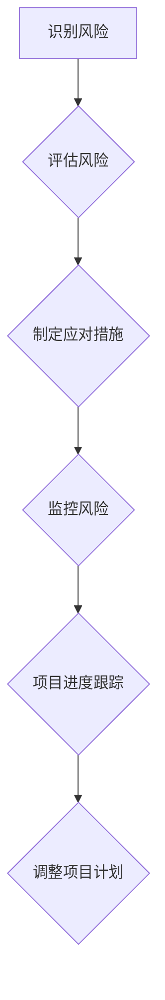

> 项目进度跟踪,风险管控,项目管理,敏捷开发,代码实战,Python,风险评估,风险应对

## 1. 背景介绍

在当今快速发展的科技时代，软件项目开发周期不断缩短，项目规模不断扩大，对项目进度跟踪和风险管控的要求也越来越高。高效的项目进度跟踪和风险管控机制能够帮助项目团队更好地管理项目进度，及时发现和应对潜在风险，最终提高项目成功率。

传统的项目管理方法往往过于僵化，难以适应快速变化的项目环境。而敏捷开发方法强调迭代开发、持续反馈和团队协作，更适合于应对复杂和不确定的项目。

## 2. 核心概念与联系

**2.1 项目进度跟踪**

项目进度跟踪是指在项目执行过程中，定期收集和分析项目进度信息，并与预期的进度进行比较，以便及时发现进度偏差，并采取相应的措施进行调整。

**2.2 风险管控**

风险管控是指在项目执行过程中，识别、评估、应对和监控项目潜在风险，以最大程度地降低风险对项目的影响。

**2.3 核心概念联系**

项目进度跟踪和风险管控是相互关联的两个重要环节。风险事件可能会导致项目进度延迟，而项目进度偏差也可能增加风险发生的可能性。因此，项目团队需要将这两个环节紧密结合起来，形成一个完整的风险管理体系。

**2.4 Mermaid 流程图**



## 3. 核心算法原理 & 具体操作步骤

**3.1 算法原理概述**

项目进度跟踪和风险管控通常采用一些特定的算法和模型来进行分析和预测。例如，甘特图、PERT图、关键路径法等都是常用的项目进度管理工具。风险评估则通常采用一些定量或定性分析方法，例如风险矩阵、风险概率评估等。

**3.2 算法步骤详解**

**3.2.1 项目进度跟踪算法步骤**

1. **定义项目里程碑和任务:** 将项目分解成多个可管理的里程碑和任务，并为每个任务分配时间和资源。
2. **建立项目进度跟踪工具:** 使用甘特图、看板或其他项目管理工具来跟踪项目进度。
3. **定期收集进度信息:** 定期收集每个任务的完成情况，并更新项目进度跟踪工具。
4. **分析进度偏差:** 将实际进度与计划进度进行比较，分析进度偏差的原因。
5. **调整项目计划:** 根据进度偏差情况，调整项目计划，例如延长任务时间、增加资源投入等。

**3.2.2 风险管控算法步骤**

1. **识别风险:** 通过头脑风暴、专家访谈等方法，识别项目潜在的风险。
2. **评估风险:** 对每个风险进行评估，确定其发生的可能性和潜在影响。
3. **制定应对措施:** 根据风险评估结果，制定相应的应对措施，例如风险规避、风险转移、风险减轻等。
4. **监控风险:** 定期监控风险情况，及时发现风险变化，并调整应对措施。

**3.3 算法优缺点**

**3.3.1 项目进度跟踪算法**

* **优点:** 能够清晰地展示项目进度，方便项目团队进行进度管理。
* **缺点:** 难以应对项目环境变化带来的影响，需要频繁调整计划。

**3.3.2 风险管控算法**

* **优点:** 可以有效地识别和应对项目风险，降低项目风险。
* **缺点:** 风险评估和应对措施的制定需要专业知识和经验，且难以预测所有风险。

**3.4 算法应用领域**

项目进度跟踪和风险管控算法广泛应用于软件开发、工程建设、金融投资等各个领域。

## 4. 数学模型和公式 & 详细讲解 & 举例说明

**4.1 数学模型构建**

项目进度跟踪和风险管控可以利用一些数学模型来进行分析和预测。例如，可以使用贝叶斯网络来建模项目风险，并进行概率预测。

**4.2 公式推导过程**

贝叶斯网络是一种概率图模型，可以用来表示随机变量之间的依赖关系。在项目风险管控中，可以使用贝叶斯网络来建模风险因素之间的关系，并根据历史数据进行风险概率的更新。

**4.3 案例分析与讲解**

假设一个软件项目有三个风险因素：技术风险、人员风险和市场风险。可以使用贝叶斯网络来建模这三个风险因素之间的关系，并根据历史数据进行风险概率的更新。例如，如果项目团队发现技术风险较高，那么可以更新市场风险和人员风险的概率，从而提高项目风险管理的效率。

**4.4 数学公式**

贝叶斯公式：

$$P(A|B) = \frac{P(B|A)P(A)}{P(B)}$$

其中：

* $P(A|B)$ 是在已知事件 B 发生的情况下，事件 A 发生的概率。
* $P(B|A)$ 是在已知事件 A 发生的情况下，事件 B 发生的概率。
* $P(A)$ 是事件 A 发生的概率。
* $P(B)$ 是事件 B 发生的概率。

## 5. 项目实践：代码实例和详细解释说明

**5.1 开发环境搭建**

本案例使用 Python 语言进行开发，需要安装 Python 3.x 及相关库，例如 pandas、numpy、matplotlib 等。

**5.2 源代码详细实现**

```python
import pandas as pd
import numpy as np
import matplotlib.pyplot as plt

# 构建项目风险数据
data = {
    '风险因素': ['技术风险', '人员风险', '市场风险'],
    '发生概率': [0.2, 0.15, 0.3],
    '影响程度': ['高', '中', '低']
}
df = pd.DataFrame(data)

# 计算风险得分
df['风险得分'] = df['发生概率'] * df['影响程度'].map({'高': 3, '中': 2, '低': 1})

# 排序风险得分
df = df.sort_values(by='风险得分', ascending=False)

# 绘制风险得分柱状图
plt.bar(df['风险因素'], df['风险得分'])
plt.xlabel('风险因素')
plt.ylabel('风险得分')
plt.title('项目风险得分')
plt.show()
```

**5.3 代码解读与分析**

这段代码首先构建了一个项目风险数据，包括风险因素、发生概率和影响程度。然后，计算了每个风险因素的风险得分，并根据风险得分对风险因素进行排序。最后，绘制了风险得分柱状图，直观地展示了项目风险的分布情况。

**5.4 运行结果展示**

运行代码后，会生成一个风险得分柱状图，展示了每个风险因素的风险得分。

## 6. 实际应用场景

项目进度跟踪和风险管控在软件开发、工程建设、金融投资等各个领域都有广泛的应用场景。

**6.1 软件开发**

在软件开发过程中，项目进度跟踪和风险管控可以帮助项目团队更好地管理项目进度，及时发现和应对潜在风险，提高项目成功率。例如，可以使用甘特图来跟踪软件开发进度，并使用风险矩阵来评估和应对软件开发风险。

**6.2 工程建设**

在工程建设过程中，项目进度跟踪和风险管控可以帮助项目团队更好地管理工程进度，及时发现和应对潜在风险，确保工程安全和按期完工。例如，可以使用PERT图来跟踪工程进度，并使用风险评估模型来评估和应对工程风险。

**6.3 金融投资**

在金融投资过程中，项目进度跟踪和风险管控可以帮助投资者更好地管理投资组合，及时发现和应对潜在风险，降低投资损失。例如，可以使用财务报表分析来跟踪投资项目进度，并使用风险模型来评估和应对投资风险。

**6.4 未来应用展望**

随着人工智能和机器学习技术的不断发展，项目进度跟踪和风险管控将更加智能化和自动化。例如，可以使用机器学习算法来预测项目进度偏差和风险发生的可能性，并自动生成相应的应对措施。

## 7. 工具和资源推荐

**7.1 学习资源推荐**

* **书籍:**
    * 《项目管理实战》
    * 《风险管理》
    * 《敏捷软件开发》
* **在线课程:**
    * Coursera 上的项目管理课程
    * Udemy 上的风险管理课程
    * edX 上的敏捷软件开发课程

**7.2 开发工具推荐**

* **项目管理工具:**
    * Jira
    * Trello
    * Asana
* **风险管理工具:**
    * Riskonnect
    * LogicManager
    * RSA Archer

**7.3 相关论文推荐**

* **项目进度跟踪:**
    * "A Review of Project Scheduling Techniques"
    * "Critical Path Method: A Review"
* **风险管控:**
    * "Risk Management: Principles and Practice"
    * "A Framework for Risk Management in Software Development"

## 8. 总结：未来发展趋势与挑战

**8.1 研究成果总结**

项目进度跟踪和风险管控已经取得了显著的成果，为项目管理提供了有效的工具和方法。

**8.2 未来发展趋势**

未来，项目进度跟踪和风险管控将更加智能化和自动化，并与人工智能、机器学习等新技术更加紧密地结合。

**8.3 面临的挑战**

项目进度跟踪和风险管控仍然面临一些挑战，例如如何更好地应对项目环境变化带来的影响，如何更准确地预测风险发生的可能性，如何更有效地应对风险事件。

**8.4 研究展望**

未来，需要进一步研究和探索项目进度跟踪和风险管控的新方法和技术，以更好地应对项目管理的挑战。

## 9. 附录：常见问题与解答

**9.1 如何选择合适的项目进度跟踪工具？**

选择合适的项目进度跟踪工具需要根据项目的规模、复杂度和团队规模等因素进行考虑。

**9.2 如何评估项目风险？**

项目风险评估通常采用定量或定性分析方法，例如风险矩阵、风险概率评估等。

**9.3 如何应对项目风险？**

项目风险应对措施包括风险规避、风险转移、风险减轻等。

**9.4 如何提高项目进度跟踪和风险管控的效率？**

提高项目进度跟踪和风险管控的效率可以采用一些方法，例如自动化工具、团队协作、定期回顾等。


作者：禅与计算机程序设计艺术 / Zen and the Art of Computer Programming 
<end_of_turn>