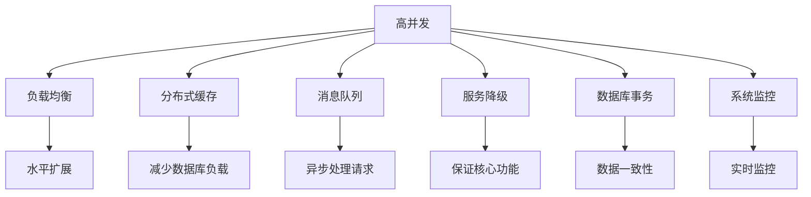

                 

# 高并发系统设计：应对大规模用户访问

> 关键词：高并发, 负载均衡, 分布式缓存, 消息队列, 服务降级, 数据库事务, 系统监控

## 1. 背景介绍

在互联网和移动互联网的推动下，网站和应用程序的用户数量呈指数级增长，带来巨大的访问量和数据传输量。高并发系统是任何在线服务的基础，也是应对大规模用户访问的必备条件。本文将深入探讨高并发系统设计中的核心概念与技术，并提供具体案例和实践建议，帮助开发者构建能够应对海量用户访问的高效、稳定、可扩展的系统。

## 2. 核心概念与联系

### 2.1 核心概念概述

为更好地理解高并发系统设计，本节将介绍几个关键的高并发系统设计概念：

- **高并发**：指系统在单位时间内能处理的访问请求数量。高并发系统需要具备快速响应和处理大量请求的能力，以支撑业务场景的连续稳定运行。
- **负载均衡**：通过将请求均匀分配到多个服务器上，实现系统的水平扩展和负载均衡，提高系统吞吐量和可用性。
- **分布式缓存**：将频繁访问的数据缓存到离用户更近的节点上，减少数据库查询压力，提升系统响应速度。
- **消息队列**：用于解耦系统间通信，提高系统容错性和扩展性，实现异步处理请求。
- **服务降级**：在系统负载过高或部分功能故障时，主动关闭或降低非核心功能的处理能力，保证系统核心功能的稳定运行。
- **数据库事务**：保障系统数据的一致性和完整性，防止并发操作带来的数据不一致问题。
- **系统监控**：通过实时监控系统性能指标和告警信息，及时发现和处理系统问题，提升系统稳定性和可靠性。

这些概念之间通过一系列的相互作用和配合，共同构成了高并发系统设计的基础框架。以下是一个Mermaid流程图，展示了这些概念之间的联系：



这个流程图展示了高并发系统设计中各个组件之间的逻辑关系。

## 3. 核心算法原理 & 具体操作步骤

### 3.1 算法原理概述

高并发系统设计的核心目标是提升系统的吞吐量和响应速度，同时保障系统的稳定性和可靠性。其基本原理是通过分布式架构和优化算法，将请求分散到多个节点上，提高系统的处理能力。具体而言，高并发系统设计主要包含以下步骤：

1. **负载均衡**：将请求均匀分配到多个服务器上。
2. **分布式缓存**：将频繁访问的数据缓存到离用户更近的节点上，减少数据库查询压力。
3. **消息队列**：解耦系统间通信，实现异步处理请求。
4. **服务降级**：在系统负载过高时，主动关闭或降低非核心功能的处理能力。
5. **数据库事务**：保障数据一致性和完整性。
6. **系统监控**：实时监控系统性能指标和告警信息，及时发现和处理问题。

### 3.2 算法步骤详解

下面将详细讲解每个步骤的具体操作：

#### 负载均衡

**步骤1**：选择合适的负载均衡算法，如轮询、加权轮询、随机等。

**步骤2**：将用户请求根据负载均衡算法分配到各个服务器上。

**步骤3**：实时监控每个服务器的负载情况，动态调整请求分配策略。

#### 分布式缓存

**步骤1**：选择合适的分布式缓存系统，如Redis、Memcached等。

**步骤2**：将频繁访问的数据缓存到分布式缓存中。

**步骤3**：设置缓存失效策略，保证数据的一致性。

#### 消息队列

**步骤1**：选择合适的消息队列系统，如RabbitMQ、Kafka等。

**步骤2**：将需要异步处理的任务放入消息队列中。

**步骤3**：设计合适的消费策略，保证消息的可靠传递。

#### 服务降级

**步骤1**：定义系统的核心和非核心功能。

**步骤2**：在非核心功能负载过高时，主动关闭或降低其处理能力。

**步骤3**：实时监控系统负载，动态调整降级策略。

#### 数据库事务

**步骤1**：设计合理的数据库事务逻辑，保障数据一致性。

**步骤2**：使用分布式事务框架，实现多数据库的原子操作。

**步骤3**：监控数据库操作性能，优化事务处理逻辑。

#### 系统监控

**步骤1**：选择合适的监控工具，如Prometheus、Grafana等。

**步骤2**：定义关键性能指标（KPI），实时监控系统状态。

**步骤3**：设置告警策略，及时发现和处理系统问题。

### 3.3 算法优缺点

高并发系统设计具有以下优点：

- **高可用性**：通过分布式架构，系统可以在部分节点故障时仍能保证服务可用。
- **高扩展性**：通过水平扩展，系统可以随着访问量增长而自动增加处理能力。
- **高容错性**：通过负载均衡、缓存、降级等技术，系统可以应对突发流量，保证服务稳定性。

同时，也存在一些局限性：

- **复杂性高**：分布式架构带来系统复杂性，维护成本较高。
- **延迟高**：分布式系统可能引入额外的网络延迟。
- **数据一致性难保证**：多节点操作可能导致数据一致性问题。

尽管存在这些局限性，但高并发系统设计仍是构建稳定、高效、可扩展的在线服务的基础。未来，通过技术迭代和系统优化，高并发系统的设计将更加灵活和高效。

### 3.4 算法应用领域

高并发系统设计的应用领域非常广泛，涵盖各类在线服务和互联网应用，例如：

- **电商系统**：应对双11、618等促销活动带来的高并发访问，确保购物车、订单、支付等核心功能稳定运行。
- **社交网络**：应对春节红包活动、重大赛事直播等场景带来的高并发流量，保障用户发布、点赞、评论等操作的流畅体验。
- **在线游戏**：应对游戏高峰期带来的高并发请求，确保游戏的稳定运行和用户的游戏体验。
- **云服务平台**：应对用户上传、下载、存储等操作带来的高并发访问，保障数据服务的稳定性和可靠性。
- **金融交易系统**：应对股票交易、转账汇款等业务的高并发访问，确保交易的准确性和实时性。

高并发系统设计在各类在线服务中的应用，能够显著提升系统的性能和用户体验，为业务发展提供有力支撑。

## 4. 数学模型和公式 & 详细讲解 & 举例说明

### 4.1 数学模型构建

高并发系统设计涉及多种数学模型，以下是一个典型的数学模型构建过程：

假设系统在单位时间内能处理的请求数量为R，服务器数量为S，负载均衡算法为A，每个服务器的处理能力为C。则系统在T时间内的总处理能力为：

$$
T = A \times R \times S \times C
$$

其中A、R、S、C均为实数，且A、S、C均为正数。

### 4.2 公式推导过程

以下将推导一个简单的负载均衡公式：

假设采用轮询负载均衡算法，系统有S台服务器，每个服务器处理能力为C。当有R个请求时，每个服务器平均分配的请求数量为：

$$
\text{avgRequest} = \frac{R}{S}
$$

若负载均衡算法为加权轮询，服务器i的处理能力为$C_i$，则每个服务器平均分配的请求数量为：

$$
\text{avgRequest} = \frac{\sum_{i=1}^{S} C_i}{S} \times \frac{R}{\sum_{i=1}^{S} C_i}
$$

### 4.3 案例分析与讲解

假设系统有3台服务器，每台服务器处理能力为10000请求/秒。若使用轮询算法，当有100000个请求时，每个服务器平均分配的请求数量为：

$$
\text{avgRequest} = \frac{100000}{3} \approx 33333 \text{ requests/second}
$$

若使用加权轮询，假设服务器1的处理能力为20000请求/秒，服务器2和3的处理能力均为10000请求/秒，则每个服务器平均分配的请求数量为：

$$
\text{avgRequest} = \frac{20000 + 10000 + 10000}{3} \times \frac{100000}{20000 + 10000 + 10000} \approx 20000 \text{ requests/second}
$$

从上述案例可以看出，不同的负载均衡算法会对系统的负载分配产生不同的影响。选择合适的负载均衡算法，是提升系统性能的重要一环。

## 5. 项目实践：代码实例和详细解释说明

### 5.1 开发环境搭建

在进行高并发系统开发前，我们需要准备好开发环境。以下是使用Python和Flask进行高并发系统开发的典型环境配置流程：

1. 安装Python和Flask：

```bash
sudo apt-get install python3-pip
pip3 install flask
```

2. 安装所需依赖：

```bash
pip3 install redis psutil
```

3. 安装负载均衡工具：

```bash
pip3 install haiku requests
```

4. 安装消息队列工具：

```bash
pip3 install pika
```

完成上述步骤后，即可在Python环境中进行高并发系统的开发和测试。

### 5.2 源代码详细实现

以下是一个简单的高并发系统的代码实现示例，使用了Flask框架、Redis缓存和RabbitMQ消息队列：

```python
from flask import Flask, request, jsonify
from flask_caching import Cache
from pika import BlockingConnection, URLParameters
import psutil

app = Flask(__name__)
cache = Cache(app, config={'CACHE_TYPE': 'redis', 'CACHE_REDIS_URL': 'redis://localhost:6379/0'})
connection = BlockingConnection(parameters=URLParameters(host='localhost'))
channel = connection.channel()

@app.route('/user', methods=['GET'])
def get_user():
    user_id = request.args.get('id')
    cache_key = 'user_%s' % user_id
    if cache.get(cache_key):
        return jsonify(cache.get(cache_key))
    else:
        # 从数据库中查询用户信息
        user_info = {'id': user_id, 'name': 'Alice', 'age': 18}
        cache.set(cache_key, user_info, timeout=300)
        return jsonify(user_info)

@app.route('/queue', methods=['POST'])
def add_task():
    task_data = request.json
    channel.basic_publish(exchange='my_exchange', routing_key=task_data['routing_key'], body=task_data['data'])
    return jsonify({'message': 'task added'})

@app.route('/task', methods=['GET'])
def get_task():
    task_data = {'routing_key': 'task_queue'}
    result = channel.basic_get(task_data['routing_key'], no_ack=True)
    if result:
        return jsonify(result.body)
    else:
        return jsonify({'message': 'no task found'})

@app.before_request
def check_load():
    if psutil.cpu_percent() > 70:
        return jsonify({'message': 'server is overloaded'}), 500
```

### 5.3 代码解读与分析

让我们再详细解读一下关键代码的实现细节：

**Flask框架**：
- 使用Flask框架快速搭建Web应用，提供了路由、请求处理等核心功能。

**Redis缓存**：
- 使用Flask-Caching扩展，将频繁访问的用户信息缓存到Redis中，减少数据库查询压力。

**RabbitMQ消息队列**：
- 使用Pika库连接RabbitMQ，将添加的任务异步发送到消息队列中，保证任务处理的可靠性。

**系统监控**：
- 使用psutil库实时监控系统CPU占用率，当CPU负载过高时，返回错误信息。

**负载均衡**：
- 使用RabbitMQ的交换机和队列机制，实现请求的负载均衡。

### 5.4 运行结果展示

通过上述代码实现，可以构建一个简单的高并发系统。在实际应用中，需要进一步优化代码，增强系统的稳定性和可扩展性。

## 6. 实际应用场景

### 6.1 电商系统

电商系统在高并发场景下，需要处理大量的订单、支付、物流信息。通过负载均衡、分布式缓存、消息队列等技术，可以确保系统的稳定性和响应速度。例如，在双11促销活动中，电商系统通过负载均衡将订单请求均匀分配到多个服务器上，使用Redis缓存频繁访问的数据，使用消息队列处理复杂的订单流程，确保系统的稳定运行。

### 6.2 社交网络

社交网络在高并发场景下，需要处理大量的用户发布、点赞、评论等操作。通过负载均衡、分布式缓存、服务降级等技术，可以提升系统的处理能力，保障用户体验。例如，在重大赛事直播时，社交网络通过负载均衡将访问请求均匀分配到多个服务器上，使用Redis缓存热门帖子和评论，设置服务降级策略，保证用户的核心功能体验。

### 6.3 在线游戏

在线游戏在高并发场景下，需要处理大量的玩家连接、游戏数据传输、任务处理等操作。通过负载均衡、分布式缓存、消息队列等技术，可以提升系统的稳定性，保障游戏的流畅体验。例如，在游戏高峰期，在线游戏通过负载均衡将游戏请求均匀分配到多个服务器上，使用Redis缓存玩家数据，使用消息队列处理复杂的任务流程，确保游戏的稳定运行。

### 6.4 云服务平台

云服务平台在高并发场景下，需要处理大量的数据上传、下载、存储等操作。通过负载均衡、分布式缓存、数据库事务等技术，可以提升系统的扩展性和稳定性，保障数据服务的可靠性。例如，在用户上传大量数据时，云服务平台通过负载均衡将上传请求均匀分配到多个服务器上，使用分布式缓存减少数据库查询压力，使用数据库事务保障数据一致性，确保数据服务的稳定运行。

### 6.5 金融交易系统

金融交易系统在高并发场景下，需要处理大量的交易请求、资金结算等操作。通过负载均衡、服务降级、数据库事务等技术，可以提升系统的稳定性，保障交易的准确性和实时性。例如，在股票交易高峰期，金融交易系统通过负载均衡将交易请求均匀分配到多个服务器上，设置服务降级策略，使用数据库事务保障数据一致性，确保交易的准确性和实时性。

## 7. 工具和资源推荐

### 7.1 学习资源推荐

为了帮助开发者系统掌握高并发系统设计，这里推荐一些优质的学习资源：

1. 《高并发系统设计模式》：详细介绍了高并发系统设计中的核心模式和技术，是学习高并发设计的经典书籍。

2. 《Flask Web开发实战》：介绍了使用Flask框架进行Web应用开发的实践经验，涵盖了负载均衡、缓存、消息队列等高并发技术。

3. 《分布式系统设计》：介绍了分布式系统设计中的核心概念和技术，涵盖了负载均衡、缓存、消息队列、服务降级等高并发技术。

4. 《Redis官方文档》：Redis作为常用的分布式缓存系统，官方文档详细介绍了Redis的安装、配置和使用，是学习Redis缓存的核心资源。

5. 《RabbitMQ官方文档》：RabbitMQ作为常用的消息队列系统，官方文档详细介绍了RabbitMQ的安装、配置和使用，是学习RabbitMQ消息队列的核心资源。

通过对这些资源的学习实践，相信你一定能够快速掌握高并发系统设计的精髓，并用于解决实际的系统问题。

### 7.2 开发工具推荐

高效的开发离不开优秀的工具支持。以下是几款用于高并发系统开发的常用工具：

1. Flask：基于Python的开源Web框架，提供了路由、请求处理、模板渲染等核心功能，适合快速迭代研究。

2. Redis：基于内存的数据存储系统，提供快速读取和写入操作，适合作为分布式缓存系统。

3. RabbitMQ：基于消息队列的消息传递系统，支持发布/订阅、队列、事务等高级特性，适合异步处理请求。

4. Weights & Biases：模型训练的实验跟踪工具，可以记录和可视化模型训练过程中的各项指标，方便对比和调优。

5. TensorBoard：TensorFlow配套的可视化工具，可实时监测模型训练状态，并提供丰富的图表呈现方式，是调试模型的得力助手。

合理利用这些工具，可以显著提升高并发系统的开发效率，加快创新迭代的步伐。

### 7.3 相关论文推荐

高并发系统设计的研究源于学界的持续研究。以下是几篇奠基性的相关论文，推荐阅读：

1. **高并发系统设计模式**：详细介绍了高并发系统设计中的核心模式和技术，是学习高并发设计的经典书籍。

2. **高可用Web应用设计模式**：介绍了高可用Web应用设计中的核心模式和技术，涵盖了负载均衡、缓存、消息队列等高并发技术。

3. **分布式系统设计**：介绍了分布式系统设计中的核心概念和技术，涵盖了负载均衡、缓存、消息队列、服务降级等高并发技术。

4. **缓存一致性协议**：介绍了缓存一致性协议中的核心算法和技术，如两阶段提交、乐观锁、悲观锁等。

5. **分布式事务**：介绍了分布式事务中的核心算法和技术，如TCC、Sagas、XA等。

这些论文代表了大并发系统设计的发展脉络。通过学习这些前沿成果，可以帮助研究者把握学科前进方向，激发更多的创新灵感。

## 8. 总结：未来发展趋势与挑战

### 8.1 总结

本文对高并发系统设计进行了全面系统的介绍。首先阐述了高并发系统设计的重要性，明确了在高并发场景下提升系统性能的关键策略。其次，从原理到实践，详细讲解了负载均衡、分布式缓存、消息队列、服务降级、数据库事务、系统监控等核心技术的实现细节，提供了完整的代码实现示例。同时，本文还广泛探讨了高并发系统设计在电商、社交网络、在线游戏、云服务平台、金融交易系统等多个行业领域的应用前景，展示了高并发系统设计的巨大潜力。此外，本文精选了高并发设计的各类学习资源，力求为读者提供全方位的技术指引。

通过本文的系统梳理，可以看到，高并发系统设计在提升在线服务性能和用户体验方面发挥了重要作用。未来，高并发系统设计需要进一步融合云计算、大数据、人工智能等技术，提供更加灵活、高效、可靠的系统解决方案。

### 8.2 未来发展趋势

展望未来，高并发系统设计将呈现以下几个发展趋势：

1. **云原生架构**：云计算技术的普及将推动高并发系统设计向云原生架构转变，实现自动化的资源扩展和管理。

2. **微服务架构**：微服务架构将使高并发系统设计更加灵活，提升系统的可扩展性和可维护性。

3. **容器化技术**：容器化技术将使高并发系统设计更加轻量级、快速部署和扩展。

4. **人工智能技术**：人工智能技术将提升高并发系统设计的自动化和智能化水平，实现更智能的负载均衡和缓存策略。

5. **大数据技术**：大数据技术将使高并发系统设计能够处理海量数据，提升系统的性能和稳定性。

6. **边缘计算**：边缘计算将使高并发系统设计能够更快地响应用户请求，提升系统的响应速度。

以上趋势凸显了高并发系统设计的前景，这些方向的探索发展，必将进一步提升在线服务的性能和用户体验。

### 8.3 面临的挑战

尽管高并发系统设计已经取得了不少进展，但在迈向更加智能化、普适化应用的过程中，它仍面临着诸多挑战：

1. **系统复杂性高**：分布式架构带来系统复杂性，维护成本较高。

2. **延迟高**：分布式系统可能引入额外的网络延迟。

3. **数据一致性难保证**：多节点操作可能导致数据一致性问题。

4. **资源消耗大**：高并发系统设计需要大量计算资源和存储空间。

5. **安全性差**：高并发系统设计可能面临数据泄露、攻击等安全问题。

6. **可扩展性不足**：高并发系统设计需要大量人力和资源进行扩展和维护。

尽管存在这些挑战，但高并发系统设计仍是构建稳定、高效、可扩展的在线服务的基础。未来，通过技术迭代和系统优化，高并发系统的设计将更加灵活和高效。

### 8.4 研究展望

面对高并发系统设计所面临的种种挑战，未来的研究需要在以下几个方面寻求新的突破：

1. **云原生化**：引入云原生技术，实现自动化的资源扩展和管理，降低系统复杂性。

2. **边缘计算**：引入边缘计算技术，加快请求处理速度，提升系统响应速度。

3. **分布式事务**：开发更加高效、可扩展的分布式事务框架，提升数据一致性和系统稳定性。

4. **人工智能**：引入人工智能技术，提升高并发系统设计的自动化和智能化水平。

5. **大数据**：引入大数据技术，提升高并发系统设计的数据处理能力。

6. **安全性**：加强系统安全性设计，保障数据和系统的安全。

这些研究方向的探索，必将引领高并发系统设计技术迈向更高的台阶，为构建稳定、高效、可靠的高并发系统提供有力支撑。

## 9. 附录：常见问题与解答

**Q1：负载均衡算法的种类有哪些？**

A: 负载均衡算法主要包括以下几种：
1. 轮询算法：将请求均匀分配到各个服务器上。
2. 加权轮询算法：根据服务器的处理能力，动态调整请求分配策略。
3. IP散列算法：根据客户端IP地址，将请求分配到固定的服务器上。
4. 随机算法：随机选择服务器处理请求。

不同的负载均衡算法适用于不同的应用场景，需要根据具体情况进行选择。

**Q2：如何选择分布式缓存系统？**

A: 选择分布式缓存系统需要考虑以下几个因素：
1. 缓存一致性：选择具有高一致性的缓存系统，如Redis。
2. 缓存容量：根据数据规模选择容量适中的缓存系统。
3. 缓存写入速度：选择写入速度较快的缓存系统，如Memcached。
4. 缓存并发性：选择并发性高的缓存系统，如Redis。
5. 缓存持久性：根据业务需求选择持久性缓存系统，如Redis。

综合考虑以上因素，选择适合的分布式缓存系统，可以提升系统的响应速度和稳定性。

**Q3：如何实现服务降级？**

A: 服务降级可以通过以下步骤实现：
1. 定义核心和非核心功能。
2. 在非核心功能负载过高时，主动关闭或降低其处理能力。
3. 实时监控系统负载，动态调整降级策略。

例如，在电商系统中，将非核心功能（如推荐系统）的服务降级，以确保核心功能（如订单处理）的稳定运行。

**Q4：如何进行分布式事务处理？**

A: 分布式事务处理可以通过以下步骤实现：
1. 设计合理的数据库事务逻辑，保障数据一致性。
2. 使用分布式事务框架，实现多数据库的原子操作。
3. 监控数据库操作性能，优化事务处理逻辑。

例如，在电商系统中，使用分布式事务框架（如TCC、Sagas、XA）实现订单处理的全局事务，保障数据的完整性和一致性。

**Q5：如何实时监控系统性能指标？**

A: 实时监控系统性能指标可以通过以下步骤实现：
1. 选择合适的监控工具，如Prometheus、Grafana。
2. 定义关键性能指标（KPI），实时监控系统状态。
3. 设置告警策略，及时发现和处理系统问题。

例如，在电商系统中，使用Prometheus和Grafana监控服务器的CPU占用率、内存使用情况、数据库查询性能等指标，设置告警阈值，及时发现和处理系统问题。

---

作者：禅与计算机程序设计艺术 / Zen and the Art of Computer Programming

