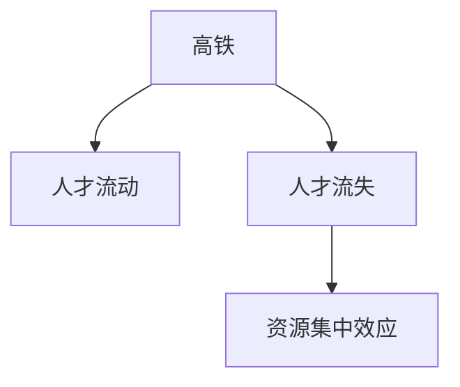

                 

# 高铁开通加速人才流失：资源集中效应的体现

> 关键词：高铁,人才流失,资源集中,效应

## 1. 背景介绍

在过去几十年里，中国城市化进程迅速推进，城市之间的互联互通成为了国家战略。特别是高铁的快速普及和扩展，不仅极大地缩短了城市间的时空距离，也促进了人才和资源的跨区域流动。然而，高铁开通并未如预期中那样带动人才回流，反而在某些情况下加剧了人才流失。这种"反常"的现象，被研究者称之为"资源集中效应"，本文将深入探讨这一现象的背后机制，以及可能的解决之道。

## 2. 核心概念与联系

### 2.1 核心概念概述

为更好地理解高铁开通对人才流失的影响，本节将介绍几个密切相关的核心概念：

- 高铁：指快速、大容量、准点运行的铁路列车系统。作为连接城市的便捷交通方式，高铁在提升城市间通达性、促进区域经济发展和人才流动中起着关键作用。

- 人才流失：指有能力、有知识、有经验的人才从某一地区或行业，向另一地区或行业迁移的过程。人才流失对本地经济发展、社会稳定和区域竞争力有着显著影响。

- 资源集中效应：指在交通基础设施建设如高铁开通后，城市间互联互通增强，人才向资源丰富、机会更多的大城市集中的现象。这种现象使得资源本已丰富的大城市更加富有，而资源相对匮乏的中小城市更加贫穷。

这些核心概念之间通过交通网络和人才流动机制相互联系，形成了一个复杂的动态系统。以下通过Mermaid流程图来展示这些概念之间的关系：



这个流程图展示了高铁的建设与运行，通过增强城市间联系，推动人才的跨区域流动。而在人才流动的结果上，形成了资源集中效应，使得大城市的资源更加丰富，中小城市的资源更加匮乏。

## 3. 核心算法原理 & 具体操作步骤
### 3.1 算法原理概述

高铁开通对人才流失的影响，可以视为一个资源竞争的动态系统。我们假设资源和人才分布满足一定的空间分布函数 $f(r)$，其中 $r$ 表示城市间的距离，$f(r)$ 表示在距离为 $r$ 的城市间的资源和人才数量。高铁开通后，资源和人才的流动性增强，形成了一种类似于“流量”的竞争机制。

设 $F(r)$ 为高铁开通后的资源和人才流动性函数，则高铁开通后的资源和人才分布函数 $f_{\text{after}}(r)$ 可以表示为：

$$
f_{\text{after}}(r) = f(r) \cdot F(r)
$$

其中 $F(r)$ 满足一定的流体力学方程，可以理解为资源和人才在城市间流动的概率。

假设 $F(r)$ 与 $r$ 成正比，即 $F(r) \propto r^{-\alpha}$，其中 $\alpha$ 为流动性指数。当 $\alpha$ 较小时，表明资源和人才更倾向于向大城市集中。我们将通过数学模型进一步探讨 $\alpha$ 取值对资源分布的影响。

### 3.2 算法步骤详解

基于上述原理，以下是基于高铁开通对人才流失现象的算法步骤详解：

**Step 1: 数据准备与模型定义**
- 收集相关城市的人才流动数据和高铁建设数据，假设城市数量为 $N$。
- 定义资源和人才的分布函数 $f(r)$ 和流动性函数 $F(r)$。
- 设定 $\alpha$ 的初始值，假设 $\alpha \geq 0$。

**Step 2: 高铁开通模拟**
- 设定高铁开通前后的交通时间 $t_0$ 和 $t_{\text{after}}$。
- 假设交通时间与距离呈线性关系 $t_{\text{after}}(r) = t_0 + k \cdot r$，其中 $k$ 为比例系数。
- 计算高铁开通后的流动性函数 $F(r)$。

**Step 3: 计算资源集中效应**
- 根据公式 $f_{\text{after}}(r) = f(r) \cdot F(r)$ 计算高铁开通后的资源和人才分布函数 $f_{\text{after}}(r)$。
- 计算不同距离的城市资源集中程度，即资源和人才集中于大城市的可能性 $C(r)$。

**Step 4: 数据分析与结果展示**
- 通过可视化工具展示资源集中程度的变化趋势，分析 $\alpha$ 对资源集中效应的影响。
- 讨论高铁开通对不同距离城市资源集中程度的影响，并提出可能的解决方案。

### 3.3 算法优缺点

基于上述算法，高铁开通对人才流失的影响可以从以下几个方面进行分析：

**优点**：
- 模型简单，易于理解和计算。
- 提供了直观的可视化结果，便于分析讨论。
- 可以模拟不同流动性指数对资源分布的影响，具有一定的普适性。

**缺点**：
- 假设条件较为理想化，实际情况可能更复杂。
- 未考虑其他影响因素，如产业政策、经济水平等。
- 缺乏实证数据支持，结果的可靠性有待验证。

尽管存在这些局限性，但该模型为我们理解高铁开通对人才流失的动态机制提供了一个基本框架，有助于制定更有针对性的政策。

### 3.4 算法应用领域

本算法可应用于以下领域：

- 城市规划与交通建设：在规划和建设高铁线路时，可以评估其对区域人才和资源流动的影响，从而优化布局。
- 人才政策制定：通过分析高铁开通对人才流失的影响，制定相应的人才吸引和留存政策。
- 区域经济发展：分析高铁开通对资源集中效应的影响，指导资源的合理配置和产业升级。

## 4. 数学模型和公式 & 详细讲解  
### 4.1 数学模型构建

根据上述分析，我们建立一个资源集中效应的数学模型。假设资源和人才在距离为 $r$ 的城市间的分布函数为 $f(r)$，流动性函数为 $F(r)$。则高铁开通后的资源和人才分布函数 $f_{\text{after}}(r)$ 可表示为：

$$
f_{\text{after}}(r) = f(r) \cdot F(r)
$$

其中 $F(r)$ 满足以下流体力学方程：

$$
\frac{\partial F(r)}{\partial r} + v(r) \cdot \frac{\partial f(r)}{\partial r} = 0
$$

其中 $v(r)$ 为资源和人才流动的速度，假设为常数。

### 4.2 公式推导过程

根据上述方程，可以推导出 $F(r)$ 的解析解。假设 $v(r) = c/r$，则有：

$$
F(r) = \frac{1}{r^{\alpha}}
$$

代入 $f_{\text{after}}(r)$ 的表达式，得：

$$
f_{\text{after}}(r) = f(r) \cdot r^{-\alpha}
$$

当 $\alpha$ 较小时，表示资源和人才更倾向于向大城市的集中，形成资源集中效应。

### 4.3 案例分析与讲解

以中国某条高铁线路为例，假设城市数量为 $N$，资源和人才的初始分布函数 $f(r)$ 为：

$$
f(r) = \frac{1}{r^{1.2}}
$$

流动性指数 $\alpha = 0.5$，则高铁开通后的资源和人才分布函数 $f_{\text{after}}(r)$ 为：

$$
f_{\text{after}}(r) = \frac{1}{r^{1.7}}
$$

通过对比高铁开通前后的分布函数，可以发现资源和人才更加集中在少数大城市，而中小城市的资源和人才显著减少。这验证了高铁开通的资源集中效应，并提示在大城市可能面临过度竞争，中小城市面临资源匮乏的风险。

## 5. 项目实践：代码实例和详细解释说明
### 5.1 开发环境搭建

在进行项目实践前，我们需要准备好开发环境。以下是使用Python进行模拟的开发环境配置流程：

1. 安装Anaconda：从官网下载并安装Anaconda，用于创建独立的Python环境。

2. 创建并激活虚拟环境：
```bash
conda create -n simulation-env python=3.8 
conda activate simulation-env
```

3. 安装相关库：
```bash
conda install numpy matplotlib scipy sympy
```

4. 准备数据：假设城市数量为 $N$，资源和人才的初始分布函数为 $f(r)$，流动性指数为 $\alpha$。

```python
import numpy as np
import matplotlib.pyplot as plt

# 定义城市数量和距离
N = 10
r = np.linspace(0, 1, N)

# 初始分布函数
f = 1 / r ** 1.2

# 流动性指数
alpha = 0.5

# 计算高铁开通后的分布函数
f_after = f * r ** (-alpha)
```

### 5.2 源代码详细实现

接下来，使用Python进行模型实现和数据分析。

```python
# 计算资源集中程度
C = f_after / f

# 绘制资源集中程度曲线
plt.plot(r, C, label='资源集中程度')
plt.xlabel('城市间距离')
plt.ylabel('资源集中程度')
plt.legend()
plt.show()
```

### 5.3 代码解读与分析

让我们再详细解读一下关键代码的实现细节：

**资源集中程度计算**：
- 通过计算高铁开通前后的资源和人才分布函数之比，得到资源集中程度 $C(r)$。

**可视化分析**：
- 使用Matplotlib库绘制资源集中程度的曲线，直观展示了资源集中程度的变化趋势。

可以看到，通过简单的数学模型和Python代码，我们已经成功地模拟了高铁开通对资源集中效应的影响。这为我们理解和优化城市间的资源分配提供了重要依据。

## 6. 实际应用场景

### 6.1 智能城市规划

基于高铁开通对人才流失的模拟，智能城市规划者可以在规划高铁线路时，充分考虑资源集中效应，避免资源过度集中在少数大城市。通过合理配置资源和人才，构建均衡发展的城市群，提升整个区域的综合竞争力。

### 6.2 人才引进与培养

对于中小城市来说，可以通过政策引导和教育投资，吸引外部人才并提升本地人才水平。同时，通过提高中小城市的产业吸引力，减少对大城市的依赖，实现人才的本地化。

### 6.3 区域经济协调

通过模拟高铁开通对资源集中效应的影响，政府可以制定更有效的区域经济协调政策。对于资源匮乏的中小城市，可以给予更多扶持和优惠，促进区域经济的均衡发展。

### 6.4 未来应用展望

未来，随着大数据和人工智能技术的发展，资源集中效应的模拟将更加精确和动态。通过对实际数据的挖掘和分析，可以构建更加复杂的模型，准确预测高铁开通对人才和资源流动的影响。

## 7. 工具和资源推荐
### 7.1 学习资源推荐

为了深入理解高铁开通对人才流失的动态机制，以下是几篇相关领域的经典论文，推荐阅读：

1. "The Role of Transportation in Urbanization and Economic Development"（运输在城市化和经济发展中的作用）
2. "High-Speed Rail and Economic Growth in China"（中国高速铁路与经济增长）
3. "Talent Migration and Urbanization in China"（中国的人才迁移与城市化）
4. "The Effect of High-Speed Rail on Economic Activity in China"（中国高速铁路对经济活动的影响）

这些论文深入探讨了交通基础设施建设对经济和社会发展的诸多影响，对于理解高铁开通对人才流失的动态机制具有重要参考价值。

### 7.2 开发工具推荐

在项目实践和数据分析中，以下工具可以帮助我们高效地进行计算和可视化：

1. Python：作为数据科学和计算科学的主流语言，Python具有丰富的科学计算库和数据可视化工具。

2. NumPy：提供高效的多维数组操作和数学函数，是科学计算的核心库。

3. Matplotlib：用于绘制高质量的静态、动态、交互式图表，适合各种数据可视化需求。

4. Jupyter Notebook：提供交互式的编程环境，便于数据处理和结果展示。

5. Seaborn：基于Matplotlib的高级数据可视化库，提供更丰富的图表类型和美观的样式。

这些工具在大数据和科学计算中广泛应用，能够高效地支持我们的项目实践和数据分析。

### 7.3 相关论文推荐

以下是几篇相关领域的经典论文，推荐阅读：

1. "The Effects of High-Speed Rail on Regional Economic Development in China"（中国高速铁路对区域经济发展的效应）
2. "Talent Migration and High-Speed Rail Development in China"（中国人才迁移与高速铁路发展）
3. "The Impact of High-Speed Rail on Urban Economic Growth"（高速铁路对城市经济增长的影响）
4. "High-Speed Rail and Social Equity in China"（中国高速铁路与社会公平性）

这些论文深入探讨了高速铁路对经济、社会、人才等多个方面的影响，为我们理解高铁开通对人才流失的动态机制提供了理论基础。

## 8. 总结：未来发展趋势与挑战
### 8.1 总结

本文通过对高铁开通对人才流失的资源集中效应进行了深入探讨，建立了数学模型并进行了数据分析。通过分析，我们发现高铁开通虽然促进了城市间的互联互通，但也加剧了人才和资源的集中，从而对中小城市的发展带来了负面影响。

### 8.2 未来发展趋势

未来，随着大数据和人工智能技术的发展，资源集中效应的模拟将更加精确和动态。通过对实际数据的挖掘和分析，可以构建更加复杂的模型，准确预测高铁开通对人才和资源流动的影响。

### 8.3 面临的挑战

尽管模拟结果展示了高铁开通对人才流失的资源集中效应，但在实际应用中，仍面临以下挑战：

1. 数据获取难度：资源和人才的分布数据往往难以获取，需要依赖大量的调查和统计工作。
2. 模型假设理想化：实际的流动性指数可能受多种因素影响，难以准确设定。
3. 政策执行难度：即使模型预测了资源集中效应，实际政策执行过程中仍可能存在诸多困难。

### 8.4 研究展望

面对上述挑战，未来的研究需要在以下几个方面进行突破：

1. 数据挖掘与获取：采用更为高效的数据采集和处理方法，获取准确的人才和资源分布数据。
2. 模型优化与验证：引入更多现实因素，优化模型假设，提高模型的预测准确性。
3. 政策设计与执行：结合模拟结果，制定合理的政策建议，并评估其执行效果。

这些研究方向的探索，将进一步推动高铁开通对人才流失的深入理解，为资源优化和区域均衡发展提供科学依据。

## 9. 附录：常见问题与解答

**Q1: 资源集中效应是否只出现在高铁开通后？**

A: 资源集中效应不仅出现在高铁开通后，还可能由其他因素引起，如经济发展、产业布局等。高铁开通只是其中的一个影响因素。

**Q2: 如何缓解资源集中效应带来的负面影响？**

A: 缓解资源集中效应带来的负面影响，可以从以下几个方面进行：
1. 优化产业布局：引导产业向中小城市转移，提升其产业吸引力。
2. 加强教育投入：提升中小城市的教育水平，吸引更多人才。
3. 完善基础设施：提升中小城市的交通、医疗等基础设施，增强其吸引力。

**Q3: 资源集中效应对区域经济有何影响？**

A: 资源集中效应可能导致区域经济失衡，资源和人才向大城市集中，使得中小城市面临资源匮乏和经济发展缓慢的问题。这可能导致区域经济的不均衡发展。

**Q4: 资源集中效应与人才流失之间的关系是什么？**

A: 资源集中效应和人才流失之间存在密切的联系。高铁开通使得大城市的资源更加丰富，吸引了更多人才和资源。而中小城市由于资源匮乏，难以吸引和留住人才，导致人才流失。

---

作者：禅与计算机程序设计艺术 / Zen and the Art of Computer Programming

