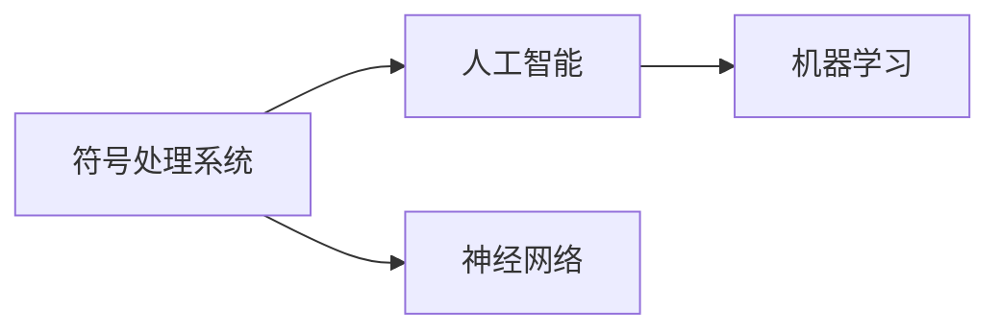

                 

## 1. 背景介绍

### 1.1 问题由来
在人工智能（AI）的发展历史中，有两个关键人物对AI的理论基础和实践方向产生了深远影响，他们分别是约翰·麦卡锡（John McCarthy）和马文·明斯基（Marvin Minsky）。麦卡锡和明斯基的研究计划是探索如何用计算机模拟人类智能，实现思维和理解力。他们的研究不仅奠定了AI的基础理论，还推动了AI技术的实际应用。

### 1.2 问题核心关键点
麦卡锡与明斯基的研究计划的核心关键点包括：

- **思维和理解力**：他们希望建立一种能够模拟人类思维过程和理解力的计算机模型。
- **符号处理系统**：他们主张使用符号处理系统来实现这种思维和理解力，这种系统通过操作符号来进行推理和问题解决。
- **AI的实现路径**：他们提出了多种实现AI的路径，包括机器学习和神经网络等。
- **AI的社会影响**：他们还探讨了AI对社会、伦理和法律的影响。

## 2. 核心概念与联系

### 2.1 核心概念概述

为了更好地理解麦卡锡与明斯基的研究计划，我们需要介绍几个关键概念：

- **符号处理系统**：这种系统通过符号来表示信息，例如用符号表示数字、单词和概念等。它通过逻辑和规则来处理和操作这些符号，实现推理和问题解决。
- **人工智能**：即AI，是模拟人类智能的计算机系统，包括学习、推理、理解、规划、发现、创造、沟通和适应等能力。
- **神经网络**：一种由多个神经元（或节点）组成的网络，能够学习输入数据并输出预测结果。
- **机器学习**：一种通过算法让计算机系统从数据中学习，并根据学习结果进行预测或决策的技术。

这些概念之间的关系可以通过以下Mermaid流程图来展示：



这个流程图展示了符号处理系统、人工智能、神经网络和机器学习之间的逻辑关系：

- 符号处理系统是AI的基础，能够模拟人类的思维过程。
- 神经网络是符号处理系统的一种实现方式，通过多个神经元来模拟人类大脑的神经网络。
- 机器学习是AI的一种技术手段，通过学习数据来提升模型的预测能力。

## 3. 核心算法原理 & 具体操作步骤
### 3.1 算法原理概述

麦卡锡与明斯基的研究计划的核心算法原理包括符号处理系统和神经网络。这些算法原理概述如下：

- **符号处理系统**：基于逻辑和规则，通过操作符号来进行推理和问题解决。符号处理系统通常包括知识库、推理机和用户界面等组件。
- **神经网络**：模拟人类大脑的神经网络，由多个神经元（或节点）组成，通过权重和偏置来进行输入数据的处理和输出。

### 3.2 算法步骤详解

#### 3.2.1 符号处理系统步骤详解

1. **知识库构建**：收集和整理领域知识，构建知识库。
2. **推理机设计**：设计推理机，通过逻辑和规则来处理知识库中的符号。
3. **用户界面开发**：开发用户界面，使用户能够输入问题并获取答案。
4. **反馈机制**：建立反馈机制，根据用户输入来更新知识库和推理机。

#### 3.2.2 神经网络步骤详解

1. **网络构建**：设计神经网络结构，包括层数、节点数和激活函数等。
2. **数据准备**：准备训练数据，进行数据预处理和标准化。
3. **模型训练**：使用训练数据对神经网络进行训练，调整权重和偏置。
4. **模型评估**：使用测试数据评估模型的性能，调整模型参数。
5. **模型应用**：将训练好的模型应用于实际问题中，进行预测和决策。

### 3.3 算法优缺点

#### 3.3.1 符号处理系统的优缺点

**优点**：

- 明确性和可解释性：符号处理系统的逻辑和规则是明确和可解释的，便于理解和调试。
- 灵活性和可扩展性：符号处理系统可以根据需求灵活扩展，增加新的规则和知识。

**缺点**：

- 复杂性：构建和维护符号处理系统需要大量人工，复杂度高。
- 缺乏自适应性：符号处理系统对新的知识和情况缺乏自适应性，需要人工干预。

#### 3.3.2 神经网络的优缺点

**优点**：

- 高效性：神经网络能够高效地处理大量数据，具有较强的泛化能力。
- 自适应性：神经网络具有自适应性，能够根据新数据和情况进行更新。

**缺点**：

- 复杂性：神经网络结构复杂，训练和调整参数需要大量计算资源。
- 可解释性不足：神经网络的决策过程通常缺乏可解释性，难以理解和调试。

### 3.4 算法应用领域

#### 3.4.1 符号处理系统的应用领域

- **专家系统**：用于医疗、法律、金融等领域的专家决策支持系统。
- **知识管理系统**：用于企业内部知识库的构建和管理。
- **智能代理**：用于智能机器人、自动驾驶等领域的决策支持系统。

#### 3.4.2 神经网络的应用领域

- **图像识别**：用于人脸识别、物体检测等计算机视觉任务。
- **自然语言处理**：用于机器翻译、情感分析等自然语言处理任务。
- **推荐系统**：用于电商、视频、音乐等领域的推荐系统。

## 4. 数学模型和公式 & 详细讲解  
### 4.1 数学模型构建

麦卡锡与明斯基的研究计划涉及多个数学模型，以下是其中两个关键模型：

#### 4.1.1 符号处理系统数学模型

符号处理系统通常基于逻辑和规则，可以用逻辑代数来表示。例如，使用布尔代数来表示推理过程中的逻辑关系。

$$
\begin{align*}
P &\lor Q \\
\neg P \\
\end{align*}
$$

其中，$\lor$表示逻辑或，$\neg$表示逻辑非。

#### 4.1.2 神经网络数学模型

神经网络是一种基于梯度下降的优化算法，其数学模型包括前向传播和反向传播两个过程。

**前向传播**：

$$
\begin{align*}
a_{i+1} &= f(z_{i+1}) \\
z_{i+1} &= w_{i+1} \cdot a_i + b_{i+1} \\
\end{align*}
$$

其中，$a_{i+1}$表示第$i+1$层神经元的输出，$z_{i+1}$表示第$i+1$层神经元的输入，$f$表示激活函数，$w_{i+1}$表示第$i+1$层的权重矩阵，$b_{i+1}$表示第$i+1$层的偏置向量。

**反向传播**：

$$
\begin{align*}
\delta^{(L)} &= -(y - a^{(L)}) \cdot f'(z^{(L)}) \\
\delta^{(i)} &= (w_{i+1}^T \cdot \delta^{(i+1)}) \cdot f'(z^{(i)}) \\
\Delta w_{i+1} &= a^{(i)}^T \cdot \delta^{(i+1)} \\
\Delta b_{i+1} &= \sum_i \delta^{(i+1)} \\
\end{align*}
$$

其中，$\delta^{(L)}$表示第$L$层的误差，$a^{(L)}$表示第$L$层的输出，$f'$表示激活函数的导数，$w_{i+1}^T$表示第$i+1$层的权重矩阵的转置，$\Delta w_{i+1}$表示第$i+1$层的权重更新量，$\Delta b_{i+1}$表示第$i+1$层的偏置更新量。

### 4.2 公式推导过程

#### 4.2.1 符号处理系统公式推导

符号处理系统的逻辑推理过程可以通过逻辑代数进行推导。例如，假设有一个关于三角形的推理过程：

1. 如果一条边等于两条边的和，则三角形为等腰三角形。
2. 如果三角形为等腰三角形，则两条边相等。

$$
\begin{align*}
a &= b + c \\
b &= c \\
\end{align*}
$$

通过逻辑代数可以得出结论：$a = b = c$，三角形为等腰三角形。

#### 4.2.2 神经网络公式推导

神经网络的反向传播算法可以通过链式法则进行推导。例如，假设有一个简单的神经网络，包含一个输入层、一个隐藏层和一个输出层。

$$
\begin{align*}
a_1 &= x \\
a_2 &= f(z_2) \\
z_2 &= w_2 \cdot a_1 + b_2 \\
y &= f(z_3) \\
z_3 &= w_3 \cdot a_2 + b_3 \\
\end{align*}
$$

其中，$a_1$表示输入层的输出，$a_2$表示隐藏层的输出，$a_3$表示输出层的输出，$z_2$和$z_3$表示隐藏层和输出层的输入，$f$表示激活函数，$w_2$和$w_3$表示隐藏层和输出层的权重矩阵，$b_2$和$b_3$表示隐藏层和输出层的偏置向量，$x$表示输入数据，$y$表示输出结果。

反向传播算法的推导过程如下：

$$
\begin{align*}
\delta^{(3)} &= (y - \hat{y}) \cdot f'(z^{(3)}) \\
\delta^{(2)} &= (w_3^T \cdot \delta^{(3)}) \cdot f'(z^{(2)}) \\
\Delta w_3 &= a^{(2)}^T \cdot \delta^{(3)} \\
\Delta b_3 &= \sum_i \delta^{(3)} \\
\Delta w_2 &= a^{(1)}^T \cdot \delta^{(2)} \\
\Delta b_2 &= \sum_i \delta^{(2)} \\
\end{align*}
$$

其中，$\delta^{(3)}$表示输出层的误差，$\delta^{(2)}$表示隐藏层的误差，$w_3^T$表示输出层的权重矩阵的转置，$\Delta w_3$表示输出层的权重更新量，$\Delta b_3$表示输出层的偏置更新量，$\Delta w_2$表示隐藏层的权重更新量，$\Delta b_2$表示隐藏层的偏置更新量。

### 4.3 案例分析与讲解

#### 4.3.1 符号处理系统的案例分析

假设有一个专家系统，用于医学诊断。系统需要根据患者的症状和病史进行诊断，给出疾病的可能性和建议。

1. **知识库构建**：收集和整理医学领域的知识，构建知识库。例如，关于感冒的诊断规则包括：
   - 如果患者有发烧、咳嗽、流鼻涕等症状，则可能是感冒。
   - 如果患者有头痛、全身疼痛等症状，则可能是感冒。
   - 如果患者有喉咙痛、呼吸困难等症状，则可能是感冒。

2. **推理机设计**：设计推理机，根据患者输入的症状和病史，匹配知识库中的规则，进行推理。例如，输入“发烧、咳嗽、流鼻涕”，推理机会输出“可能是感冒”。

3. **用户界面开发**：开发用户界面，使用户能够输入症状和病史，获取诊断结果。例如，用户可以通过简单的问答系统输入症状和病史，系统给出诊断结果和建议。

4. **反馈机制**：建立反馈机制，根据医生和患者的反馈，更新知识库和推理机。例如，医生可以根据病人的实际情况调整诊断结果，系统会根据医生的反馈更新知识库。

#### 4.3.2 神经网络的案例分析

假设有一个神经网络，用于图像识别。系统需要识别输入图像中的物体。

1. **网络构建**：设计神经网络结构，包括输入层、隐藏层和输出层。例如，使用卷积神经网络（CNN）结构，输入层为输入图像，输出层为物体分类标签。

2. **数据准备**：准备训练数据，进行数据预处理和标准化。例如，使用图像增强技术，扩充训练集，提高模型的泛化能力。

3. **模型训练**：使用训练数据对神经网络进行训练，调整权重和偏置。例如，使用反向传播算法进行训练，调整卷积核和全连接层的权重和偏置。

4. **模型评估**：使用测试数据评估模型的性能，调整模型参数。例如，使用混淆矩阵和准确率等指标评估模型性能，根据测试结果调整网络结构和训练参数。

5. **模型应用**：将训练好的模型应用于实际问题中，进行预测和决策。例如，将训练好的CNN模型应用于实时图像识别任务，自动识别输入图像中的物体。

## 5. 项目实践：代码实例和详细解释说明
### 5.1 开发环境搭建

在进行项目实践前，我们需要准备好开发环境。以下是使用Python进行TensorFlow开发的环境配置流程：

1. 安装Anaconda：从官网下载并安装Anaconda，用于创建独立的Python环境。

2. 创建并激活虚拟环境：
```bash
conda create -n tf-env python=3.8 
conda activate tf-env
```

3. 安装TensorFlow：根据CUDA版本，从官网获取对应的安装命令。例如：
```bash
conda install tensorflow -c conda-forge -c pytorch
```

4. 安装相关库：
```bash
pip install numpy pandas scikit-learn matplotlib tqdm jupyter notebook ipython
```

完成上述步骤后，即可在`tf-env`环境中开始项目实践。

### 5.2 源代码详细实现

这里我们以符号处理系统为例，给出使用TensorFlow构建知识库和推理机的PyTorch代码实现。

```python
import tensorflow as tf
import numpy as np
from sympy import symbols

# 定义符号
x1, x2, x3 = symbols('x1 x2 x3')

# 定义知识库
knowledge_base = {
    'x1': x1 + x2 - x3,
    'x2': x3 + x2 - x3,
    'x3': x2 + x3 - x2,
}

# 定义推理机
def inference(kb, evidence):
    for key, value in kb.items():
        if key in evidence:
            value = value.subs({key: evidence[key]})
    return value

# 示例推理
evidence = {'x1': 3, 'x2': 2, 'x3': 1}
result = inference(knowledge_base, evidence)
print(result)
```

### 5.3 代码解读与分析

让我们再详细解读一下关键代码的实现细节：

**知识库定义**：

```python
knowledge_base = {
    'x1': x1 + x2 - x3,
    'x2': x3 + x2 - x3,
    'x3': x2 + x3 - x2,
}
```

知识库是一个字典，键表示符号，值表示规则。规则使用Sympy库中的符号表达式来表示。

**推理机实现**：

```python
def inference(kb, evidence):
    for key, value in kb.items():
        if key in evidence:
            value = value.subs({key: evidence[key]})
    return value
```

推理机函数接受两个参数，一个是知识库，另一个是证据（即已知条件）。函数遍历知识库中的每个规则，如果证据中包含了规则中的符号，则将符号替换为对应的值。最后返回替换后的规则值。

**示例推理**：

```python
evidence = {'x1': 3, 'x2': 2, 'x3': 1}
result = inference(knowledge_base, evidence)
print(result)
```

示例推理代码使用字典来表示证据，将证据中的符号替换为具体的数值，最终输出推理结果。

## 6. 实际应用场景

### 6.1 医疗诊断系统

基于符号处理系统的医疗诊断系统可以广泛应用于医疗机构中。系统通过收集和整理医学领域的知识，构建知识库，利用推理机进行推理，辅助医生进行诊断。

在技术实现上，可以收集医疗领域的症状、病史和诊断规则，构建知识库。利用推理机对患者的症状和病史进行推理，匹配最可能的诊断结果，并给出建议。对于不确定的诊断结果，系统可以输出多个可能选项，供医生参考和进一步检查。

### 6.2 金融风险评估

金融风险评估系统可以用于银行、保险等领域，通过符号处理系统进行风险评估和预警。

在技术实现上，可以收集金融领域的各类数据，构建知识库，利用推理机对金融数据进行推理，评估风险水平。例如，对股票价格、市场情绪、公司财务数据等进行分析，给出投资建议和风险预警。系统可以根据市场变化动态更新知识库和推理机，提高风险评估的准确性。

### 6.3 智能客服系统

基于符号处理系统的智能客服系统可以应用于电子商务、电信等领域。系统通过收集和整理客服领域的相关知识，构建知识库，利用推理机进行问题解答，提升客服系统的自动化水平。

在技术实现上，可以收集和整理客服领域的常见问题和解决方案，构建知识库。利用推理机对用户输入的问题进行推理，匹配最合适的解决方案，并给出建议。对于无法解答的问题，系统可以进一步提供人工客服的支持，确保问题得到及时解决。

## 7. 工具和资源推荐
### 7.1 学习资源推荐

为了帮助开发者系统掌握符号处理系统和神经网络的理论基础和实践技巧，这里推荐一些优质的学习资源：

1. 《Artificial Intelligence: A Modern Approach》（第三版）：Russell和Norvig合著的经典AI教材，详细介绍了符号处理系统和神经网络的原理和应用。
2. CS 373：斯坦福大学开设的AI课程，涵盖符号处理系统、神经网络和机器学习等内容。
3. 《Deep Learning with Python》：Francois Chollet所著的深度学习入门书籍，详细介绍了神经网络的构建和训练方法。
4. TensorFlow官方文档：TensorFlow的官方文档，提供了丰富的API和样例代码，方便学习者快速上手。
5. PyTorch官方文档：PyTorch的官方文档，提供了丰富的API和样例代码，适合进行深度学习开发。

通过对这些资源的学习实践，相信你一定能够快速掌握符号处理系统和神经网络的技术要点，并用于解决实际的AI问题。

### 7.2 开发工具推荐

高效的开发离不开优秀的工具支持。以下是几款用于符号处理系统和神经网络开发的常用工具：

1. TensorFlow：由Google主导开发的深度学习框架，支持符号处理系统和神经网络的开发和训练。
2. PyTorch：由Facebook开发的深度学习框架，灵活且易于调试，适合进行神经网络的开发和训练。
3. Sympy：Python中的符号计算库，可以用于构建和操作符号表达式，适合进行符号处理系统的开发。
4. Jupyter Notebook：基于Web的交互式开发环境，支持Python、R、Julia等多种编程语言，适合进行数据处理、算法设计和模型训练。
5. GitHub：开源代码托管平台，支持版本控制和协作开发，适合进行团队合作和代码共享。

合理利用这些工具，可以显著提升符号处理系统和神经网络的开发效率，加快创新迭代的步伐。

### 7.3 相关论文推荐

符号处理系统和神经网络的研究源于学界的持续研究。以下是几篇奠基性的相关论文，推荐阅读：

1. "Some Philosophical Problems from a Computing Standpoint"（麦卡锡）：探讨了计算机与人类思维的相似性和差异性，奠定了符号处理系统的理论基础。
2. "Perceptron: A Probabilistic Model for Information Storage and Organization in the Brain"（明斯基）：提出了感知器模型，为神经网络的发展奠定了基础。
3. "Artificial Neural Networks"（Hopfield）：提出了神经网络中广泛使用的反馈神经网络模型，推动了神经网络的研究。
4. "Backpropagation: Application to Handwritten Zeros and Ones Recognition by a Multilayer Net"（Rumelhart、Hinton和Williams）：提出了反向传播算法，推动了神经网络的实际应用。
5. "Deep Learning"（Goodfellow、Bengio和Courville）：详细介绍了深度学习的基本原理和应用，推动了神经网络的快速发展。

这些论文代表了大语言模型微调技术的发展脉络。通过学习这些前沿成果，可以帮助研究者把握学科前进方向，激发更多的创新灵感。

## 8. 总结：未来发展趋势与挑战

### 8.1 研究成果总结

麦卡锡与明斯基的研究计划奠定了符号处理系统和神经网络的基础，推动了AI技术的实际应用。符号处理系统和神经网络在多个领域得到了广泛应用，取得了显著成效。

### 8.2 未来发展趋势

展望未来，符号处理系统和神经网络将继续发展，呈现以下几个趋势：

1. 多模态融合：将符号处理系统和神经网络与其他模态（如视觉、语音、文本）结合，构建多模态智能系统，提升系统的感知能力和理解力。
2. 自动化学习：引入自动学习算法（如强化学习、迁移学习等），提高系统的自适应能力和泛化能力。
3. 自适应推理：构建自适应推理系统，根据用户反馈和学习经验动态调整推理规则，提升系统的灵活性和准确性。
4. 知识表示：研究如何更好地表示知识，提高知识库的质量和数量，提升系统的推理能力。
5. 安全性和隐私保护：研究如何保护用户隐私和数据安全，防止恶意攻击和数据泄露。

这些趋势将进一步推动符号处理系统和神经网络的发展，提升系统的智能水平和应用价值。

### 8.3 面临的挑战

尽管符号处理系统和神经网络取得了许多进展，但在迈向更加智能化、普适化应用的过程中，仍面临诸多挑战：

1. 复杂性：符号处理系统和神经网络的构建和维护需要大量人工，复杂度高。
2. 可解释性：符号处理系统和神经网络的决策过程缺乏可解释性，难以理解和调试。
3. 数据依赖：符号处理系统和神经网络的性能很大程度上依赖于数据质量，获取高质量数据成本高。
4. 鲁棒性：符号处理系统和神经网络在面对新数据和异常情况时，泛化性能差，容易出现误判。
5. 伦理和法律问题：符号处理系统和神经网络的应用带来了伦理和法律问题，如隐私保护、责任归属等。

这些挑战需要研究者不断探索和解决，推动符号处理系统和神经网络技术的成熟和普及。

### 8.4 研究展望

面对符号处理系统和神经网络所面临的挑战，未来的研究需要在以下几个方面寻求新的突破：

1. 自动化构建：研究如何自动构建符号处理系统和神经网络，降低人工成本，提高效率。
2. 解释性增强：研究如何提高符号处理系统和神经网络的解释性，增强其可理解性和可信任性。
3. 数据增强：研究如何自动生成高质量数据，扩大训练集规模，提高模型泛化能力。
4. 鲁棒性提升：研究如何提高符号处理系统和神经网络的鲁棒性，增强其在复杂环境下的适应能力。
5. 伦理和法律规范：研究如何在符号处理系统和神经网络的应用中遵循伦理和法律规范，保护用户隐私和权益。

这些研究方向的探索，将推动符号处理系统和神经网络技术的进步，构建更加智能、安全、可信的AI系统。面向未来，符号处理系统和神经网络将继续在AI领域发挥重要作用，推动人类认知智能的发展。

## 9. 附录：常见问题与解答

**Q1：符号处理系统与神经网络的区别是什么？**

A: 符号处理系统和神经网络是两种不同的AI技术。符号处理系统通过操作符号进行推理，适用于需要明确规则和逻辑的任务。神经网络通过模拟人类大脑的神经元进行计算，适用于需要处理大量数据和复杂模式的任务。

**Q2：符号处理系统有哪些优点和缺点？**

A: 符号处理系统的优点包括：
1. 明确性和可解释性：逻辑和规则是明确和可解释的，便于理解和调试。
2. 灵活性和可扩展性：可以根据需求灵活扩展，增加新的规则和知识。

符号处理系统的缺点包括：
1. 复杂性：构建和维护需要大量人工，复杂度高。
2. 缺乏自适应性：对新的知识和情况缺乏自适应性，需要人工干预。

**Q3：神经网络有哪些优点和缺点？**

A: 神经网络的优点包括：
1. 高效性：能够高效处理大量数据，具有较强的泛化能力。
2. 自适应性：具有自适应性，能够根据新数据和情况进行更新。

神经网络的缺点包括：
1. 复杂性：结构复杂，训练和调整参数需要大量计算资源。
2. 可解释性不足：决策过程缺乏可解释性，难以理解和调试。

**Q4：符号处理系统和神经网络在实际应用中如何结合？**

A: 符号处理系统和神经网络可以通过以下方式结合：
1. 将神经网络作为符号处理系统的预处理模块，提取特征和处理模式，再用符号处理系统进行推理。
2. 将符号处理系统作为神经网络的指导模块，提供先验知识和规则，提升神经网络的泛化能力和理解力。
3. 将符号处理系统和神经网络融合为一个系统，构建多模态智能系统，提升系统的感知和理解能力。

**Q5：符号处理系统和神经网络在实际应用中需要注意哪些问题？**

A: 符号处理系统和神经网络在实际应用中需要注意以下问题：
1. 数据质量：确保输入数据的准确性和完整性，提高模型的泛化能力。
2. 模型训练：合理选择模型结构和训练参数，避免过拟合和欠拟合。
3. 模型部署：考虑模型的计算资源和内存占用，优化模型结构，提高推理效率。
4. 系统安全性：确保系统的安全性和隐私保护，防止数据泄露和恶意攻击。
5. 系统维护：定期更新模型和知识库，及时修复漏洞和缺陷，确保系统稳定运行。

这些问题的解决将进一步推动符号处理系统和神经网络的应用和发展，构建更加智能、安全、可信的AI系统。

