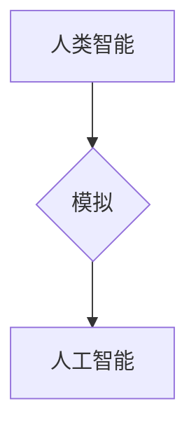

> 人工智能，麦卡锡，人工智能命名，图灵测试，专家系统，机器学习，深度学习

## 1. 背景介绍

人工智能（Artificial Intelligence，简称AI）作为一项前沿科技，自诞生以来便引发了广泛的关注和讨论。从早期简单的专家系统到如今的深度学习，AI技术经历了飞速发展，并在各个领域展现出强大的应用潜力。然而，对于人工智能的定义和界定，一直以来都存在着不同的观点和理解。

1956年，达特茅斯夏季研究项目被认为是人工智能的正式诞生日。在该项目中，麦卡锡（John McCarthy）提出了“人工智能”这个词，并对人工智能的本质进行了初步的阐述。麦卡锡认为，人工智能是指使机器能够像人类一样思考、学习和解决问题的能力。

## 2. 核心概念与联系

麦卡锡对人工智能的命名，标志着人工智能研究的正式开始。他的定义强调了人工智能的核心目标：模拟人类智能。

**核心概念：**

* **智能：** 指生物体或机器能够感知、理解、学习、推理、决策和解决问题的能力。
* **模拟：** 指通过某种方式复制或模仿人类智能的行为模式。

**联系：**

麦卡锡的定义将人工智能与人类智能联系在一起，并明确了人工智能的目标是模拟人类智能。

**Mermaid 流程图：**

## 3. 核心算法原理 & 具体操作步骤

### 3.1  算法原理概述

人工智能算法是实现人工智能目标的关键技术。这些算法通过学习和处理数据，使机器能够模拟人类智能的行为。常见的AI算法包括：

* **机器学习（Machine Learning）：** 通过训练模型，使机器能够从数据中学习规律，并对新数据进行预测或分类。
* **深度学习（Deep Learning）：** 基于多层神经网络，能够学习更复杂的特征和模式，在图像识别、自然语言处理等领域取得了突破性进展。

### 3.2  算法步骤详解

以机器学习为例，其基本步骤包括：

1. **数据收集和预处理：** 收集相关数据，并进行清洗、转换和特征工程等预处理工作。
2. **模型选择：** 根据任务需求选择合适的机器学习模型，例如线性回归、逻辑回归、决策树等。
3. **模型训练：** 使用训练数据训练模型，调整模型参数，使模型能够准确地预测或分类。
4. **模型评估：** 使用测试数据评估模型的性能，例如准确率、召回率、F1-score等。
5. **模型部署：** 将训练好的模型部署到实际应用场景中，用于预测或分类新数据。

### 3.3  算法优缺点

**机器学习算法：**

* **优点：** 能够自动学习数据规律，无需人工编程；具有较强的泛化能力，能够对新数据进行预测或分类。
* **缺点：** 需要大量的数据进行训练；模型训练时间较长；对数据质量要求较高。

**深度学习算法：**

* **优点：** 能够学习更复杂的特征和模式；在图像识别、自然语言处理等领域取得了突破性进展。
* **缺点：** 需要更大的数据量和计算资源进行训练；模型训练时间更长；解释性较差。

### 3.4  算法应用领域

人工智能算法广泛应用于各个领域，例如：

* **图像识别：** 用于识别物体、场景、人脸等。
* **自然语言处理：** 用于文本分类、机器翻译、语音识别等。
* **推荐系统：** 用于推荐商品、电影、音乐等。
* **医疗诊断：** 用于辅助医生诊断疾病。
* **金融风险控制：** 用于识别和预防金融风险。

## 4. 数学模型和公式 & 详细讲解 & 举例说明

### 4.1  数学模型构建

机器学习算法通常基于数学模型进行构建。例如，线性回归模型的数学表达式为：

$$y = w_0 + w_1x_1 + w_2x_2 + ... + w_nx_n + \epsilon$$

其中：

* $y$ 是预测值
* $w_0, w_1, w_2, ..., w_n$ 是模型参数
* $x_1, x_2, ..., x_n$ 是输入特征
* $\epsilon$ 是误差项

### 4.2  公式推导过程

模型参数的学习过程通常使用梯度下降算法进行优化。梯度下降算法的目标是找到使模型预测值与真实值误差最小化的参数值。

梯度下降算法的迭代公式为：

$$w_i = w_i - \alpha \frac{\partial Loss}{\partial w_i}$$

其中：

* $w_i$ 是模型参数
* $\alpha$ 是学习率
* $\frac{\partial Loss}{\partial w_i}$ 是损失函数对参数 $w_i$ 的梯度

### 4.3  案例分析与讲解

例如，在图像识别任务中，可以使用卷积神经网络（CNN）模型进行训练。CNN模型能够学习图像的特征，并对图像进行分类。

## 5. 项目实践：代码实例和详细解释说明

### 5.1  开发环境搭建

使用Python语言进行开发，并安装必要的库，例如TensorFlow、PyTorch等深度学习框架。

### 5.2  源代码详细实现

使用深度学习框架构建CNN模型，并使用图像数据集进行训练。

### 5.3  代码解读与分析

解释模型的结构、参数、训练过程等细节。

### 5.4  运行结果展示

展示模型的训练结果和预测效果。

## 6. 实际应用场景

### 6.1  图像识别

* **人脸识别：** 用于解锁手机、验证身份等。
* **物体检测：** 用于自动驾驶、安防监控等。

### 6.2  自然语言处理

* **机器翻译：** 用于翻译文本、对话等。
* **文本摘要：** 用于提取文本的关键信息。

### 6.3  推荐系统

* **商品推荐：** 用于推荐用户可能感兴趣的商品。
* **内容推荐：** 用于推荐用户可能感兴趣的文章、视频等。

### 6.4  未来应用展望

人工智能技术将继续发展，并在更多领域得到应用，例如：

* **医疗保健：** 用于辅助诊断、个性化治疗等。
* **教育：** 用于个性化学习、智能辅导等。
* **金融：** 用于风险控制、欺诈检测等。

## 7. 工具和资源推荐

### 7.1  学习资源推荐

* **在线课程：** Coursera、edX、Udacity等平台提供丰富的AI课程。
* **书籍：** 《深度学习》、《人工智能：现代方法》等书籍。
* **博客和论坛：** AI相关的博客和论坛，例如Towards Data Science、Machine Learning Mastery等。

### 7.2  开发工具推荐

* **深度学习框架：** TensorFlow、PyTorch、Keras等。
* **数据处理工具：** Pandas、NumPy等。
* **可视化工具：** Matplotlib、Seaborn等。

### 7.3  相关论文推荐

* **《ImageNet Classification with Deep Convolutional Neural Networks》**
* **《Attention Is All You Need》**
* **《BERT: Pre-training of Deep Bidirectional Transformers for Language Understanding》**

## 8. 总结：未来发展趋势与挑战

### 8.1  研究成果总结

人工智能技术取得了显著的进展，在各个领域展现出强大的应用潜力。

### 8.2  未来发展趋势

* **更强大的计算能力：** 随着计算能力的提升，人工智能模型将变得更加复杂和强大。
* **更丰富的训练数据：** 数据是人工智能发展的关键要素，未来将会有更多的数据被收集和利用。
* **更有效的算法：** 研究人员将继续开发更有效的算法，提高人工智能的效率和准确性。

### 8.3  面临的挑战

* **数据隐私和安全：** 人工智能的训练需要大量数据，如何保护数据隐私和安全是一个重要的挑战。
* **算法可解释性：** 许多人工智能算法的决策过程难以理解，如何提高算法的可解释性是一个重要的研究方向。
* **伦理问题：** 人工智能的应用可能会带来一些伦理问题，例如算法偏见、工作岗位替代等，需要认真思考和解决。

### 8.4  研究展望

未来，人工智能技术将继续发展，并对人类社会产生深远的影响。我们需要积极探索人工智能的应用潜力，同时也要关注其带来的挑战和风险，确保人工智能技术能够造福人类。

## 9. 附录：常见问题与解答

### 9.1  什么是人工智能？

人工智能是指使机器能够像人类一样思考、学习和解决问题的能力。

### 9.2  人工智能有哪些应用场景？

人工智能应用场景广泛，例如图像识别、自然语言处理、推荐系统、医疗诊断等。

### 9.3  如何学习人工智能？

可以通过在线课程、书籍、博客和论坛等方式学习人工智能。

作者：禅与计算机程序设计艺术 / Zen and the Art of Computer Programming

<end_of_turn>