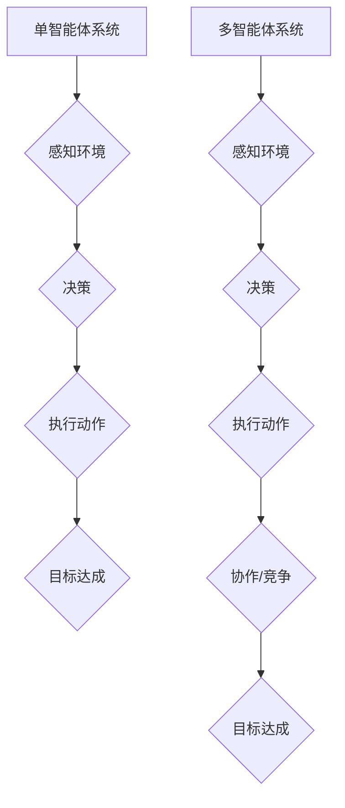

> AI Agent, 单智能体系统, 多智能体系统, 强化学习, 决策理论, 协作学习, 分布式人工智能

## 1. 背景介绍

人工智能（AI）正以惊人的速度发展，从语音识别到图像生成，AI已经渗透到我们生活的方方面面。然而，我们离真正的人工智能，即能够像人类一样思考、学习和解决问题，还有很长的路要走。

在AI领域，**AI Agent**（人工智能代理）是一个重要的概念，它代表着能够感知环境、做出决策并与环境交互的智能体。AI Agent可以是单一的，也可以是多智能体的，两者在架构、算法和应用场景上都存在着显著的差异。

本文将深入探讨单智能体系统和多智能体系统的区别，分析其各自的优势和局限性，并展望未来发展趋势。

## 2. 核心概念与联系

**单智能体系统**是指由单个AI Agent组成的系统，该Agent负责感知环境、制定决策并执行动作，以实现预定的目标。例如，一个无人驾驶汽车就是一个单智能体系统，它通过摄像头、雷达等传感器感知周围环境，并根据预先训练的模型做出驾驶决策。

**多智能体系统**则由多个AI Agent组成，这些Agent之间可以相互通信、协作或竞争，共同完成复杂的任务。例如，一个无人机编队就是一个多智能体系统，多个无人机协同工作，可以完成更复杂的飞行任务，例如搜索和救援、环境监测等。

**核心概念与联系：**



## 3. 核心算法原理 & 具体操作步骤

### 3.1  算法原理概述

单智能体系统和多智能体系统都依赖于各种AI算法，例如强化学习、决策理论、机器学习等。

**强化学习**是一种训练AI Agent通过与环境交互学习最优策略的算法。AI Agent会根据环境的状态和采取的动作获得奖励或惩罚，通过不断调整策略，最终学习到能够最大化奖励的策略。

**决策理论**则关注如何根据不确定性信息做出最优决策。在多智能体系统中，决策理论可以帮助Agent预测其他Agent的行为，并制定相应的策略。

**机器学习**则可以用于训练AI Agent识别模式、预测未来事件等。

### 3.2  算法步骤详解

**单智能体系统算法步骤：**

1. **环境感知:** AI Agent通过传感器收集环境信息。
2. **状态评估:** AI Agent根据收集到的信息评估当前环境状态。
3. **策略选择:** AI Agent根据状态评估和预先训练的模型选择最优动作。
4. **动作执行:** AI Agent执行选择的动作，并观察环境的变化。
5. **奖励反馈:** 环境根据AI Agent的动作提供奖励或惩罚。
6. **策略更新:** AI Agent根据奖励反馈更新策略，以提高未来获得奖励的概率。

**多智能体系统算法步骤：**

1. **环境感知:** 每个AI Agent通过传感器收集环境信息。
2. **状态评估:** 每个AI Agent根据收集到的信息评估当前环境状态。
3. **策略选择:** 每个AI Agent根据状态评估、其他Agent的行为预测以及预先训练的模型选择最优动作。
4. **动作执行:** 每个AI Agent执行选择的动作，并观察环境的变化。
5. **奖励反馈:** 环境根据所有Agent的动作提供奖励或惩罚。
6. **策略更新:** 每个AI Agent根据奖励反馈更新策略，以提高未来获得奖励的概率。

### 3.3  算法优缺点

**单智能体系统算法:**

* **优点:** 
    * 结构简单，易于理解和实现。
    * 可以有效地解决一些独立的任务。
* **缺点:** 
    * 难以处理复杂、多变的环境。
    * 缺乏协作能力，难以完成需要多个Agent协同完成的任务。

**多智能体系统算法:**

* **优点:** 
    * 可以有效地处理复杂、多变的环境。
    * 具有协作能力，可以完成需要多个Agent协同完成的任务。
* **缺点:** 
    * 结构复杂，难以理解和实现。
    * 需要解决Agent之间的通信、协作和竞争问题。

### 3.4  算法应用领域

**单智能体系统算法:**

* 无人驾驶汽车
* 机器人控制
* 游戏AI

**多智能体系统算法:**

* 无人机编队
* 分布式机器人
* 智能交通系统

## 4. 数学模型和公式 & 详细讲解 & 举例说明

### 4.1  数学模型构建

**单智能体系统:**

我们可以用马尔可夫决策过程（MDP）来建模单智能体系统。MDP由以下几个要素组成：

* 状态空间 S：表示系统可能存在的各种状态。
* 动作空间 A：表示Agent可以采取的各种动作。
* 转移概率 P(s', r | s, a)：表示从状态 s 执行动作 a 后，转移到状态 s' 的概率，以及获得奖励 r 的概率。
* 奖励函数 R(s, a)：表示在状态 s 执行动作 a 后获得的奖励。

**多智能体系统:**

多智能体系统可以建模为多智能体马尔可夫决策过程（MMDP）。MMDP与MDP类似，但增加了多个Agent的概念，每个Agent都有自己的状态空间、动作空间和奖励函数。

### 4.2  公式推导过程

**单智能体系统价值函数:**

价值函数 V(s) 表示从状态 s 开始执行最优策略的期望累积奖励。

$$V(s) = \max_{\pi} \mathbb{E}_{\pi}[R_t + \gamma R_{t+1} + \gamma^2 R_{t+2} + ... | s]$$

其中：

* $\pi$ 表示策略
* $\mathbb{E}_{\pi}$ 表示根据策略 $\pi$ 的期望
* $R_t$ 表示在时间步 t 获得的奖励
* $\gamma$ 表示折扣因子，控制未来奖励的权重

**多智能体系统联合价值函数:**

联合价值函数 $V(s_1, s_2, ..., s_n)$ 表示从状态 $(s_1, s_2, ..., s_n)$ 开始执行所有Agent最优策略的期望累积奖励。

$$V(s_1, s_2, ..., s_n) = \max_{\pi_1, \pi_2, ..., \pi_n} \mathbb{E}_{\pi_1, \pi_2, ..., \pi_n}[R_t + \gamma R_{t+1} + \gamma^2 R_{t+2} + ... | (s_1, s_2, ..., s_n)]$$

其中：

* $\pi_i$ 表示第 i 个Agent的策略

### 4.3  案例分析与讲解

**单智能体系统案例:**

一个无人驾驶汽车的单智能体系统，可以使用MDP模型来建模。状态空间可以包含汽车的位置、速度、周围环境等信息。动作空间可以包含加速、减速、转向等动作。奖励函数可以设计为鼓励汽车安全到达目的地，并避免碰撞等危险情况。

**多智能体系统案例:**

一个无人机编队的多智能体系统，可以使用MMDP模型来建模。每个无人机都是一个Agent，其状态空间可以包含无人机的飞行高度、速度、方向等信息。动作空间可以包含改变飞行高度、速度、方向等动作。奖励函数可以设计为鼓励无人机编队保持稳定，并完成预定的任务。

## 5. 项目实践：代码实例和详细解释说明

### 5.1  开发环境搭建

* Python 3.x
* TensorFlow 或 PyTorch
* ROS (Robot Operating System) (可选)

### 5.2  源代码详细实现

```python
# 单智能体系统强化学习代码示例

import gym
import numpy as np
from tensorflow.keras.models import Sequential
from tensorflow.keras.layers import Dense, Flatten

# 创建环境
env = gym.make('CartPole-v1')

# 定义神经网络模型
model = Sequential()
model.add(Flatten(input_shape=env.observation_space.shape))
model.add(Dense(128, activation='relu'))
model.add(Dense(2, activation='softmax'))

# 编译模型
model.compile(loss='categorical_crossentropy', optimizer='adam')

# 训练模型
for episode in range(1000):
    state = env.reset()
    done = False
    total_reward = 0
    while not done:
        action = np.argmax(model.predict(state.reshape(1, -1)))
        next_state, reward, done, _ = env.step(action)
        total_reward += reward
        state = next_state
    print(f'Episode {episode+1}, Total Reward: {total_reward}')

# 保存模型
model.save('cartpole_model.h5')
```

### 5.3  代码解读与分析

* 代码首先创建了一个CartPole-v1环境，这是一个经典的强化学习环境。
* 然后定义了一个神经网络模型，用于预测最佳动作。
* 模型使用Adam优化器和交叉熵损失函数进行训练。
* 训练过程循环执行多个episode，每个episode中Agent与环境交互，并根据奖励更新模型参数。
* 最后，训练好的模型被保存为文件。

### 5.4  运行结果展示

训练完成后，模型能够在CartPole环境中保持平衡杆的时间显著延长。

## 6. 实际应用场景

### 6.1  无人驾驶汽车

* 单智能体系统：负责车辆的路径规划、避障、速度控制等。
* 多智能体系统：多个车辆协同行驶，实现更安全、高效的交通流。

### 6.2  机器人控制

* 单智能体系统：控制单个机器人完成特定任务，例如搬运物体、清洁地面等。
* 多智能体系统：多个机器人协同完成复杂任务，例如组装产品、探索未知环境等。

### 6.3  智能交通系统

* 单智能体系统：控制交通信号灯、优化交通流量等。
* 多智能体系统：多个车辆、交通工具协同行驶，实现更智能、高效的交通管理。

### 6.4  未来应用展望

随着AI技术的不断发展，单智能体系统和多智能体系统将在更多领域得到应用，例如：

* 智能医疗：辅助医生诊断疾病、制定治疗方案。
* 智能教育：个性化学习辅导、智能答疑。
* 智能金融：风险评估、欺诈检测。

## 7. 工具和资源推荐

### 7.1  学习资源推荐

* **书籍:**
    * Reinforcement Learning: An Introduction by Sutton and Barto
    * Multi-Agent Reinforcement Learning by Busoniu, Babuska, and De Schutter
* **在线课程:**
    * Coursera: Reinforcement Learning Specialization
    * Udacity: Intro to Artificial Intelligence
* **开源库:**
    * TensorFlow
    * PyTorch
    * OpenAI Gym

### 7.2  开发工具推荐

* **编程语言:** Python
* **机器学习框架:** TensorFlow, PyTorch
* **机器人操作系统:** ROS

### 7.3  相关论文推荐

* **单智能体系统:**
    * Deep Reinforcement Learning with Double Q-learning
    * Proximal Policy Optimization Algorithms
* **多智能体系统:**
    * Multi-Agent Reinforcement Learning with Communication
    * Decentralized Multi-Agent Reinforcement Learning

## 8. 总结：未来发展趋势与挑战

### 8.1  研究成果总结

近年来，