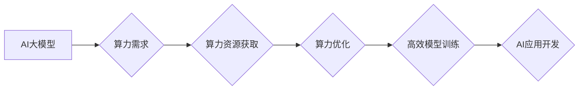

> AI大模型，算力，创业，深度学习，模型训练，应用场景

## 1. 背景介绍

近年来，人工智能（AI）技术取得了飞速发展，特别是深度学习算法的突破，使得AI大模型的规模和能力不断提升。这些大模型在自然语言处理、计算机视觉、语音识别等领域展现出强大的应用潜力，也为创业者带来了新的机遇。

然而，训练和部署AI大模型需要大量的算力资源，这对于创业公司来说是一个巨大的挑战。如何有效利用算力优势，降低成本，并快速将AI大模型应用于实际场景，是创业者需要思考的关键问题。

## 2. 核心概念与联系

**2.1 AI大模型**

AI大模型是指参数量巨大、训练数据海量的人工智能模型。这些模型通常拥有数十亿甚至数千亿的参数，能够学习复杂的模式和关系，从而实现更精准、更智能的应用。

**2.2 算力**

算力是指计算机系统处理信息的速率，通常以FLOPS（每秒浮点运算次数）为单位衡量。训练AI大模型需要大量的算力，因为模型参数的更新和优化需要进行海量的计算。

**2.3 算力优势**

对于AI创业公司来说，拥有强大的算力优势可以带来以下好处：

* **加速模型训练:** 强大的算力可以显著缩短模型训练时间，提高开发效率。
* **提升模型性能:** 更大的模型规模和更长的训练时间可以提升模型的精度和泛化能力。
* **支持更复杂的应用:** 强大的算力可以支持更复杂的AI应用，例如实时语音识别、图像生成等。

**2.4 算力资源获取方式**

创业公司可以采用以下方式获取算力资源：

* **自建数据中心:** 投资建设自己的数据中心，拥有独立的算力资源。
* **云计算平台:** 利用云计算平台提供的GPU和TPU等高性能计算资源。
* **算力租赁:** 从第三方租赁算力资源，按需付费使用。

**2.5 算力优化技术**

为了更有效地利用算力资源，创业公司可以采用以下优化技术：

* **模型压缩:** 通过量化、剪枝等技术，减少模型参数量，降低计算成本。
* **分布式训练:** 将模型训练任务分发到多个计算节点上，并行训练，加速训练速度。
* **混合精度训练:** 使用不同精度的数据类型进行训练，平衡精度和效率。

**Mermaid 流程图**



## 3. 核心算法原理 & 具体操作步骤

**3.1 算法原理概述**

深度学习算法是训练AI大模型的核心技术。常见的深度学习算法包括卷积神经网络（CNN）、循环神经网络（RNN）和Transformer等。这些算法通过多层神经网络结构，学习数据中的特征和模式，从而实现各种AI任务。

**3.2 算法步骤详解**

训练AI大模型的步骤通常包括以下几个阶段：

1. **数据预处理:** 收集和清洗数据，将其转换为模型可以理解的格式。
2. **模型构建:** 根据任务需求选择合适的深度学习算法，并构建模型架构。
3. **模型训练:** 使用训练数据训练模型，调整模型参数，使其能够准确预测或分类数据。
4. **模型评估:** 使用测试数据评估模型的性能，例如准确率、召回率等指标。
5. **模型部署:** 将训练好的模型部署到实际应用场景中，例如网站、应用程序等。

**3.3 算法优缺点**

深度学习算法具有以下优点：

* **高精度:** 深度学习模型能够学习到数据中的复杂模式，从而实现高精度预测和分类。
* **自动化特征提取:** 深度学习模型能够自动提取数据特征，无需人工特征工程。
* **泛化能力强:** 深度学习模型能够泛化到未见过的数据，具有较强的应用推广能力。

然而，深度学习算法也存在一些缺点：

* **训练成本高:** 训练大型深度学习模型需要大量的算力和时间。
* **数据依赖性强:** 深度学习模型的性能取决于训练数据的质量和数量。
* **可解释性差:** 深度学习模型的决策过程较为复杂，难以解释其预测结果。

**3.4 算法应用领域**

深度学习算法在各个领域都有广泛的应用，例如：

* **自然语言处理:** 文本分类、情感分析、机器翻译、对话系统等。
* **计算机视觉:** 图像识别、物体检测、图像分割、视频分析等。
* **语音识别:** 语音转文本、语音助手、语音搜索等。
* **医疗诊断:** 病理图像分析、疾病预测、药物研发等。

## 4. 数学模型和公式 & 详细讲解 & 举例说明

**4.1 数学模型构建**

深度学习模型通常基于神经网络结构，其数学模型可以表示为一系列的线性变换和非线性激活函数。

**4.2 公式推导过程**

深度学习模型的训练过程基于梯度下降算法，其目标是通过调整模型参数，最小化模型预测结果与真实值的误差。

**4.3 案例分析与讲解**

以卷积神经网络（CNN）为例，其数学模型可以表示为：

$$
y = f(W_L * ReLU(W_{L-1} * ... * ReLU(W_1 * x)) + b_L)
$$

其中：

* $x$ 是输入数据
* $W_i$ 是第 $i$ 层的权重矩阵
* $b_i$ 是第 $i$ 层的偏置向量
* $ReLU$ 是ReLU激活函数
* $f$ 是输出层激活函数
* $y$ 是模型预测结果

**举例说明**

假设我们训练一个图像分类模型，输入图像大小为28x28，输出类别为10个。

* 模型架构：包含卷积层、池化层、全连接层等。
* 权重矩阵 $W_i$ 和偏置向量 $b_i$ 是模型参数，需要通过训练过程学习得到。
* 训练数据：包含大量图像和对应的类别标签。
* 损失函数：例如交叉熵损失函数，用于衡量模型预测结果与真实标签之间的差异。
* 梯度下降算法：用于更新模型参数，最小化损失函数值。

## 5. 项目实践：代码实例和详细解释说明

**5.1 开发环境搭建**

* 操作系统：Linux
* Python版本：3.7+
* 深度学习框架：TensorFlow或PyTorch
* GPU：NVIDIA GeForce GTX 1080Ti或更高

**5.2 源代码详细实现**

```python
import tensorflow as tf

# 定义模型架构
model = tf.keras.models.Sequential([
    tf.keras.layers.Conv2D(32, (3, 3), activation='relu', input_shape=(28, 28, 1)),
    tf.keras.layers.MaxPooling2D((2, 2)),
    tf.keras.layers.Conv2D(64, (3, 3), activation='relu'),
    tf.keras.layers.MaxPooling2D((2, 2)),
    tf.keras.layers.Flatten(),
    tf.keras.layers.Dense(10, activation='softmax')
])

# 编译模型
model.compile(optimizer='adam',
              loss='sparse_categorical_crossentropy',
              metrics=['accuracy'])

# 训练模型
model.fit(x_train, y_train, epochs=10)

# 评估模型
loss, accuracy = model.evaluate(x_test, y_test)
print('Test loss:', loss)
print('Test accuracy:', accuracy)
```

**5.3 代码解读与分析**

* 代码使用TensorFlow框架构建了一个简单的卷积神经网络模型。
* 模型包含卷积层、池化层和全连接层，用于提取图像特征和进行分类。
* 模型使用Adam优化器、交叉熵损失函数和准确率指标进行训练和评估。

**5.4 运行结果展示**

训练完成后，模型可以用于预测新的图像类别。

## 6. 实际应用场景

**6.1 图像识别**

AI大模型可以用于识别图像中的物体、场景和人物，应用于自动驾驶、安防监控、医疗诊断等领域。

**6.2 自然语言处理**

AI大模型可以理解和生成自然语言，应用于机器翻译、聊天机器人、文本摘要等领域。

**6.3 语音识别**

AI大模型可以将语音转换为文本，应用于语音助手、语音搜索、语音识别等领域。

**6.4 其他应用场景**

AI大模型还可以应用于药物研发、金融风险评估、个性化推荐等领域。

**6.5 未来应用展望**

随着算力技术的不断发展，AI大模型的应用场景将更加广泛，例如：

* 更智能的虚拟助手
* 更精准的医疗诊断
* 更个性化的教育体验
* 更安全的网络环境

## 7. 工具和资源推荐

**7.1 学习资源推荐**

* 深度学习课程：Coursera、edX、Udacity等平台提供丰富的深度学习课程。
* 深度学习书籍：
    * 《深度学习》
    * 《动手学深度学习》
    * 《深度学习实战》

**7.2 开发工具推荐**

* 深度学习框架：TensorFlow、PyTorch、Keras等。
* 数据处理工具：Pandas、NumPy等。
* 可视化工具：Matplotlib、Seaborn等。

**7.3 相关论文推荐**

* 《ImageNet Classification with Deep Convolutional Neural Networks》
* 《Attention Is All You Need》
* 《BERT: Pre-training of Deep Bidirectional Transformers for Language Understanding》

## 8. 总结：未来发展趋势与挑战

**8.1 研究成果总结**

近年来，AI大模型取得了显著的进展，在各个领域展现出强大的应用潜力。

**8.2 未来发展趋势**

* 模型规模和能力将继续提升。
* 模型训练效率将得到进一步提高。
* 模型的解释性和可解释性将得到加强。
* AI大模型将应用于更多新的领域。

**8.3 面临的挑战**

* 算力需求不断增长，需要持续发展更强大的算力技术。
* 数据安全和隐私保护问题需要得到有效解决。
* 模型的公平性和可解释性需要得到进一步研究。

**8.4 研究展望**

未来，AI大模型研究将继续朝着更智能、更安全、更可解释的方向发展。


## 9. 附录：常见问题与解答

**9.1 如何选择合适的深度学习框架？**

选择深度学习框架需要根据具体项目需求和个人偏好。TensorFlow和PyTorch是目前最流行的深度学习框架，各有优缺点。

**9.2 如何获取训练数据？**

训练数据可以从公开数据集、Web爬虫、传感器数据等多种渠道获取。

**9.3 如何评估模型性能？**

模型性能可以通过准确率、召回率、F1-score等指标进行评估。

**9.4 如何部署模型到实际应用场景？**

模型部署可以采用云端部署、边缘部署等方式。

**9.5 如何解决模型过拟合问题？**

模型过拟合问题可以通过数据增强、正则化、Dropout等技术进行解决。


作者：禅与计算机程序设计艺术 / Zen and the Art of Computer Programming 
<end_of_turn>