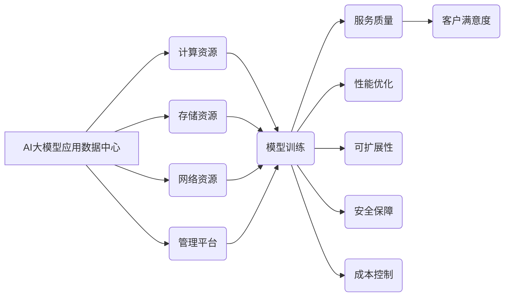

> AI大模型、数据中心、客户满意度、服务质量、模型部署、性能优化、可扩展性、安全保障、成本控制

## 1. 背景介绍

近年来，人工智能（AI）技术蓬勃发展，大规模语言模型（LLM）的出现更是掀起了一场AI应用的革命。这些强大的模型能够理解和生成人类语言，在自然语言处理、机器翻译、文本生成等领域展现出令人惊叹的性能。然而，将这些模型部署到实际应用场景中，并为客户提供高质量的服务，仍然面临着诸多挑战。

数据中心作为AI大模型应用的基础设施，其性能、可靠性、安全性以及成本控制能力直接影响着客户的满意度。因此，如何构建一个高效、可靠、安全的AI大模型应用数据中心，并不断提升客户体验，成为当前业界关注的焦点。

## 2. 核心概念与联系

**2.1 AI大模型应用数据中心架构**

AI大模型应用数据中心通常由以下几个关键组件组成：

* **计算资源:** 包括高性能CPU、GPU、TPU等硬件，用于模型训练和推理。
* **存储资源:** 用于存储模型参数、训练数据、运行日志等大规模数据。
* **网络资源:** 提供高带宽、低延迟的网络连接，确保模型训练和推理的效率。
* **管理平台:** 用于监控数据中心运行状态、管理资源分配、部署模型等。

**2.2 客户满意度关键因素**

客户满意度是一个多维度的概念，在AI大模型应用数据中心中，主要受以下因素影响：

* **服务质量:** 包括模型准确率、响应时间、可用性等指标。
* **性能优化:** 数据中心能够高效利用资源，满足模型训练和推理的需求。
* **可扩展性:** 数据中心能够根据业务需求灵活扩展计算、存储和网络资源。
* **安全保障:** 数据中心能够有效保护用户数据和模型安全。
* **成本控制:** 数据中心能够提供经济高效的服务。

**2.3 核心概念关系图**



## 3. 核心算法原理 & 具体操作步骤

**3.1 算法原理概述**

在AI大模型应用数据中心中，许多算法被用于优化服务质量、性能、可扩展性和安全性。例如：

* **模型压缩算法:** 用于减小模型大小，降低部署成本和延迟。
* **模型加速算法:** 用于提高模型推理速度，提升服务响应时间。
* **资源调度算法:** 用于高效分配计算、存储和网络资源，提高数据中心利用率。
* **安全防护算法:** 用于检测和防御网络攻击，保护用户数据和模型安全。

**3.2 算法步骤详解**

以模型压缩算法为例，其具体操作步骤如下：

1. **选择压缩方法:** 常用的压缩方法包括量化、剪枝、知识蒸馏等。
2. **进行模型分析:** 分析模型结构和参数分布，选择合适的压缩方法和参数。
3. **压缩模型参数:** 根据选择的压缩方法，对模型参数进行量化、剪枝或知识蒸馏等操作。
4. **评估压缩效果:** 使用测试数据集评估压缩后的模型性能，确保压缩后模型精度损失在可接受范围内。
5. **部署压缩模型:** 将压缩后的模型部署到数据中心，提供服务。

**3.3 算法优缺点**

不同的算法具有不同的优缺点，需要根据实际应用场景选择合适的算法。例如，量化压缩算法简单易实现，但精度损失较大；剪枝算法可以有效降低模型大小，但需要复杂的搜索算法；知识蒸馏算法可以将大模型的知识迁移到小模型，但需要训练多个模型。

**3.4 算法应用领域**

模型压缩算法广泛应用于移动设备、嵌入式系统等资源受限的设备上，以降低模型部署成本和延迟。

## 4. 数学模型和公式 & 详细讲解 & 举例说明

**4.1 数学模型构建**

在AI大模型应用数据中心中，可以使用数学模型来描述服务质量、性能优化、可扩展性和安全性等方面的指标。例如，可以使用线性回归模型来预测模型推理时间，可以使用马尔可夫链模型来分析用户访问数据中心的服务请求模式。

**4.2 公式推导过程**

以预测模型推理时间为例，可以使用以下线性回归模型：

$$
T = a + b * S
$$

其中：

* $T$ 表示模型推理时间
* $S$ 表示模型输入数据大小
* $a$ 和 $b$ 是模型参数

可以通过最小二乘法等方法训练模型参数，得到预测模型推理时间的公式。

**4.3 案例分析与讲解**

假设我们训练了一个模型，用于预测图像分类任务的推理时间。通过收集大量训练数据，我们得到了以下线性回归模型：

$$
T = 0.1 + 0.05 * S
$$

其中，$T$ 表示以秒为单位的推理时间，$S$ 表示图像大小以像素为单位。

如果输入图像大小为1000x1000像素，则模型推理时间为：

$$
T = 0.1 + 0.05 * (1000 * 1000) = 50.1 秒
$$

## 5. 项目实践：代码实例和详细解释说明

**5.1 开发环境搭建**

* 操作系统：Ubuntu 20.04
* 编程语言：Python 3.8
* 框架：TensorFlow 2.x
* 工具：Docker、Kubernetes

**5.2 源代码详细实现**

```python
import tensorflow as tf

# 定义模型结构
model = tf.keras.models.Sequential([
    tf.keras.layers.Conv2D(32, (3, 3), activation='relu', input_shape=(28, 28, 1)),
    tf.keras.layers.MaxPooling2D((2, 2)),
    tf.keras.layers.Conv2D(64, (3, 3), activation='relu'),
    tf.keras.layers.MaxPooling2D((2, 2)),
    tf.keras.layers.Flatten(),
    tf.keras.layers.Dense(10, activation='softmax')
])

# 编译模型
model.compile(optimizer='adam',
              loss='sparse_categorical_crossentropy',
              metrics=['accuracy'])

# 训练模型
model.fit(x_train, y_train, epochs=10)

# 保存模型
model.save('mnist_model.h5')
```

**5.3 代码解读与分析**

这段代码定义了一个简单的卷积神经网络模型，用于手写数字识别任务。

* `tf.keras.models.Sequential` 创建了一个顺序模型，将层级依次连接。
* `tf.keras.layers.Conv2D` 定义了卷积层，用于提取图像特征。
* `tf.keras.layers.MaxPooling2D` 定义了最大池化层，用于降低特征图尺寸。
* `tf.keras.layers.Flatten` 将多维特征图转换为一维向量。
* `tf.keras.layers.Dense` 定义了全连接层，用于分类。
* `model.compile` 编译模型，指定优化器、损失函数和评价指标。
* `model.fit` 训练模型，使用训练数据进行迭代训练。
* `model.save` 保存训练好的模型。

**5.4 运行结果展示**

训练完成后，模型可以用于预测新的手写数字图像。

## 6. 实际应用场景

AI大模型应用数据中心在各个领域都有广泛的应用场景，例如：

* **金融领域:** 用于风险评估、欺诈检测、客户服务等。
* **医疗领域:** 用于疾病诊断、药物研发、医疗影像分析等。
* **教育领域:** 用于个性化学习、智能辅导、自动批改等。
* **制造业:** 用于设备预测维护、质量控制、生产优化等。

## 7. 工具和资源推荐

**7.1 学习资源推荐**

* TensorFlow 官方文档: https://www.tensorflow.org/
* PyTorch 官方文档: https://pytorch.org/
* 深度学习书籍: 《深度学习》、《动手学深度学习》

**7.2 开发工具推荐**

* Docker: https://www.docker.com/
* Kubernetes: https://kubernetes.io/
* Jupyter Notebook: https://jupyter.org/

**7.3 相关论文推荐**

* 《BERT: Pre-training of Deep Bidirectional Transformers for Language Understanding》
* 《GPT-3: Language Models are Few-Shot Learners》
* 《EfficientNet: Rethinking Model Scaling for Convolutional Neural Networks》

## 8. 总结：未来发展趋势与挑战

**8.1 研究成果总结**

近年来，AI大模型技术取得了长足的进步，在各个领域展现出巨大的应用潜力。

**8.2 未来发展趋势**

* 模型规模和能力将继续提升，模型参数量将达到万亿级甚至更高。
* 模型训练效率将得到进一步提高，训练时间将大幅缩短。
* 模型部署方式将更加灵活，支持边缘计算、云端计算等多种部署模式。
* 模型安全性将得到加强，能够有效防御各种攻击和恶意利用。

**8.3 面临的挑战**

* 模型训练成本高昂，需要大量的计算资源和数据。
* 模型解释性和可信度需要进一步提升，需要开发更有效的解释方法和评估标准。
* 模型安全性需要得到加强，需要开发更有效的安全防护机制。
* 模型伦理问题需要得到重视，需要制定相应的规范和制度。

**8.4 研究展望**

未来，AI大模型技术将继续发展，并对社会产生更深远的影响。我们需要加强基础研究，探索更有效的模型训练方法、部署方式和安全防护机制。同时，还需要关注模型伦理问题，确保AI技术能够安全、可靠、公平地服务于人类社会。

## 9. 附录：常见问题与解答

**9.1 如何选择合适的模型压缩方法？**

选择合适的模型压缩方法需要根据实际应用场景和模型结构进行综合考虑。

**9.2 如何评估模型压缩效果？**

可以使用测试数据集评估压缩后的模型性能，主要指标包括精度、速度和内存占用。

**9.3 如何部署模型到数据中心？**

可以使用容器化技术（如Docker）和编排工具（如Kubernetes）将模型部署到数据中心。

**9.4 如何保障模型安全？**

可以使用加密、身份验证、访问控制等安全机制保障模型安全。


作者：禅与计算机程序设计艺术 / Zen and the Art of Computer Programming 
<end_of_turn>