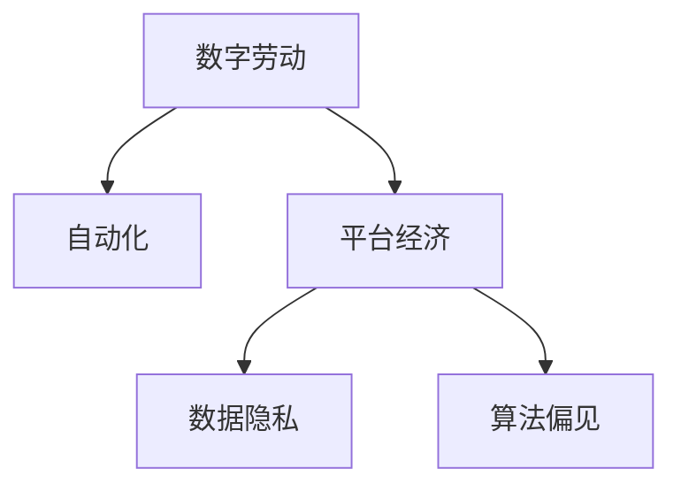

                 

# 数字劳动：人类计算的社会和经济影响

## 1. 背景介绍

### 1.1 问题由来

随着数字化的不断深入，计算已经成为现代社会不可或缺的一部分。从个人生活的智能助手，到企业运营的数据中心，再到国家安全的战略资源，计算能力正在深刻地影响着人类的工作方式、社会结构和经济模式。然而，随着计算能力的增强，我们越来越难以直接参与到计算过程中。这种趋势引发了关于计算和劳动关系的新思考。本文旨在探讨数字劳动的本质，以及它在社会和经济中的影响。

### 1.2 问题核心关键点

数字劳动的核心关键点包括：

1. **计算与劳动的关系**：随着计算技术的进步，哪些工作需要人类参与，哪些可以由计算替代。
2. **数据隐私与所有权**：在数字劳动中，数据作为计算的原料，其隐私与所有权问题至关重要。
3. **自动化与就业**：自动化技术对就业市场的影响，包括就业结构变化和技能需求。
4. **价值创造与分配**：数字劳动中价值的创造和分配机制，特别是在平台经济中的问题。
5. **社会不平等**：数字劳动带来的社会不平等问题，包括收入差距和技术鸿沟。

### 1.3 问题研究意义

理解数字劳动的社会和经济影响，有助于我们更好地应对数字化转型带来的挑战，制定合理的政策和规范，促进社会的公平与进步。具体而言，其研究意义包括：

1. **政策制定**：为政府和企业提供制定数字劳动相关政策的支持。
2. **技术发展**：指导技术开发和应用，避免技术滥用，促进可持续发展。
3. **社会公平**：关注数字劳动对社会公平的影响，推动构建更加包容的数字社会。
4. **经济转型**：探索数字劳动对经济结构的影响，促进经济转型升级。

## 2. 核心概念与联系

### 2.1 核心概念概述

为更好地理解数字劳动，本节将介绍几个关键概念：

1. **数字劳动**：指通过计算技术实现的工作，包括数据收集、处理、分析、开发等活动。
2. **自动化**：指使用计算机和软件代替人工进行重复性劳动的过程。
3. **平台经济**：基于互联网和计算技术的经济模式，典型的如电子商务、共享经济等。
4. **数据隐私**：指个人或企业数据在处理和共享过程中，保护其不被滥用的权利。
5. **算法偏见**：指算法在训练和应用过程中，因数据不平衡或设计缺陷导致的决策偏见。

这些概念之间的逻辑关系可以通过以下Mermaid流程图来展示：



这个流程图展示了大劳动模型的核心概念及其之间的关系：

1. 数字劳动通过自动化技术实现，减少了人力成本，提高了效率。
2. 平台经济是数字劳动的主要应用场景，促进了数字劳动的普及和创新。
3. 数据隐私是数字劳动中需要重点保护的问题，直接关系到算法的公平性和用户信任。
4. 算法偏见是数字劳动中难以避免的问题，需要通过设计和技术手段来解决。

这些概念共同构成了数字劳动的宏观框架，帮助我们更深入地理解其在社会和经济中的作用。

## 3. 核心算法原理 & 具体操作步骤

### 3.1 算法原理概述

数字劳动的核心算法原理可以追溯到信息论和计算理论。信息论告诉我们，信息是通过传输、存储和处理来实现的。而计算理论则提供了如何高效地进行这些信息处理的算法基础。

在数字劳动中，计算是实现信息处理的主要手段。通过计算机和软件，我们可以对数据进行采集、存储、处理、分析和应用。这些计算过程通常需要大量的数据输入和计算资源。然而，随着计算能力的提升，数据量和计算资源的需求也在不断增长，这使得直接参与计算变得越来越困难。

### 3.2 算法步骤详解

数字劳动的算法步骤通常包括以下几个关键环节：

1. **数据收集**：从各种来源收集数据，包括传感器、社交媒体、网络日志等。
2. **数据预处理**：对原始数据进行清洗、标注和转换，为后续分析做准备。
3. **特征提取**：从原始数据中提取有意义的特征，用于训练模型或进行决策。
4. **模型训练**：使用机器学习算法，对数据进行建模，提取规律和模式。
5. **结果应用**：将模型应用到实际问题中，进行预测、分类、推荐等任务。

### 3.3 算法优缺点

数字劳动的算法具有以下优点：

1. **高效性**：通过自动化的计算，可以显著提高数据处理和信息分析的效率。
2. **可扩展性**：计算能力可以轻松扩展，支持大规模数据的处理。
3. **精确性**：算法模型能够精确地分析和预测复杂现象，提供可靠的决策支持。

但同时也存在一些缺点：

1. **数据质量依赖**：算法的输出质量高度依赖于数据的质量和数量。
2. **算法偏见**：算法在训练和应用过程中，可能因数据不平衡或设计缺陷导致偏见。
3. **资源消耗**：大规模计算需要大量的计算资源和能源，对环境产生影响。

### 3.4 算法应用领域

数字劳动的应用领域非常广泛，涵盖了多个行业和场景，例如：

1. **金融科技**：用于信用评分、风险管理、欺诈检测等。
2. **医疗健康**：用于疾病预测、个性化治疗、药物研发等。
3. **零售电商**：用于用户画像、需求预测、推荐系统等。
4. **物流供应链**：用于路径规划、库存管理、需求预测等。
5. **智能制造**：用于设备监控、质量控制、故障预测等。

## 4. 数学模型和公式 & 详细讲解 & 举例说明

### 4.1 数学模型构建

在数字劳动中，我们通常使用机器学习模型来处理和分析数据。以下是一个简单的线性回归模型的数学模型构建过程：

设 $y$ 为需要预测的目标变量，$x$ 为特征向量，$\theta$ 为模型参数。则线性回归模型的数学模型为：

$$
y = \theta_0 + \theta_1 x_1 + \theta_2 x_2 + \cdots + \theta_n x_n + \epsilon
$$

其中，$\theta_0$ 为截距，$\theta_1, \theta_2, \cdots, \theta_n$ 为特征系数，$\epsilon$ 为误差项。

### 4.2 公式推导过程

在线性回归模型中，我们通过最小化预测误差 $\epsilon$ 的平方和，来求解模型参数 $\theta$。具体来说，目标函数为：

$$
J(\theta) = \frac{1}{2m} \sum_{i=1}^m (y^{(i)} - h_\theta(x^{(i)}))^2
$$

其中，$m$ 为样本数量，$h_\theta(x)$ 为模型预测函数。

通过求解该目标函数的最小值，我们可以得到模型的最优参数 $\theta$。常用的求解方法包括梯度下降法、正规方程法等。

### 4.3 案例分析与讲解

以零售电商中的推荐系统为例，我们可以使用协同过滤算法（Collaborative Filtering）来构建推荐模型。协同过滤算法通过分析用户的历史行为数据，预测用户对未购买商品的可能偏好。具体步骤如下：

1. **数据准备**：收集用户的历史购买记录和评分数据。
2. **特征提取**：将用户和商品转化为高维向量，用于计算相似度。
3. **模型训练**：使用用户和商品之间的相似度矩阵，进行矩阵分解，得到用户和商品的隐向量表示。
4. **推荐计算**：根据用户隐向量和新商品隐向量的相似度，计算推荐结果。

## 5. 项目实践：代码实例和详细解释说明

### 5.1 开发环境搭建

在进行数字劳动项目实践前，我们需要准备好开发环境。以下是使用Python进行Scikit-learn开发的环境配置流程：

1. 安装Anaconda：从官网下载并安装Anaconda，用于创建独立的Python环境。

2. 创建并激活虚拟环境：
```bash
conda create -n digitallabor python=3.8 
conda activate digitallabor
```

3. 安装Scikit-learn：
```bash
pip install scikit-learn
```

4. 安装各类工具包：
```bash
pip install numpy pandas scikit-learn matplotlib tqdm jupyter notebook ipython
```

完成上述步骤后，即可在`digitallabor`环境中开始数字劳动实践。

### 5.2 源代码详细实现

以下是使用Scikit-learn构建线性回归模型的Python代码实现：

```python
from sklearn.linear_model import LinearRegression
from sklearn.metrics import mean_squared_error
import numpy as np
import pandas as pd

# 数据准备
data = pd.read_csv('data.csv')
X = data.drop('y', axis=1)
y = data['y']

# 模型训练
model = LinearRegression()
model.fit(X, y)

# 模型评估
y_pred = model.predict(X)
mse = mean_squared_error(y, y_pred)
print('Mean Squared Error:', mse)
```

### 5.3 代码解读与分析

让我们再详细解读一下关键代码的实现细节：

**数据准备**：
- `pd.read_csv('data.csv')`：读取CSV格式的数据文件。
- `X = data.drop('y', axis=1)`：将数据集分为特征集和目标变量。

**模型训练**：
- `model = LinearRegression()`：创建线性回归模型。
- `model.fit(X, y)`：使用训练数据训练模型。

**模型评估**：
- `y_pred = model.predict(X)`：使用训练好的模型进行预测。
- `mse = mean_squared_error(y, y_pred)`：计算预测误差的平方和。

### 5.4 运行结果展示

在运行上述代码后，会输出预测误差的平方和，用于评估模型的性能。

## 6. 实际应用场景

### 6.1 智能客服系统

基于数字劳动的智能客服系统可以自动处理大量的客户咨询请求，提高服务效率和客户满意度。通过收集和分析客户的历史咨询记录，智能客服系统可以理解客户的语义意图，并给出相应的回复。

在技术实现上，智能客服系统通常使用自然语言处理（NLP）技术，将客户咨询文本转化为可计算的形式，进行分析和回答。

### 6.2 金融风险管理

金融风险管理需要实时监控大量的交易数据，以识别潜在的欺诈和异常行为。通过数字劳动技术，金融机构可以构建高效的欺诈检测系统，实时分析交易数据，预测和预防潜在的风险。

在实际应用中，数字劳动技术可以通过机器学习模型，对交易数据进行特征提取和模式识别，及时发现和响应异常交易行为。

### 6.3 个性化推荐系统

个性化推荐系统通过分析用户的行为数据，为用户推荐感兴趣的内容。通过数字劳动技术，推荐系统可以高效地处理大规模数据，提供个性化的推荐结果，提升用户满意度。

在技术实现上，推荐系统通常使用协同过滤算法、深度学习模型等，对用户和商品进行建模，并根据模型的预测结果进行推荐。

### 6.4 未来应用展望

随着数字劳动技术的不断进步，其应用场景将进一步扩展。未来，数字劳动将在以下几个方面取得突破：

1. **智能制造**：通过数字劳动技术，可以实现设备的自动监控和故障预测，提升生产效率和质量。
2. **智慧城市**：数字劳动技术可以应用于城市交通、环境监测、公共安全等领域，提升城市管理效率。
3. **健康医疗**：通过数字劳动技术，可以实现疾病的早期预测和个性化治疗，提升医疗服务质量。
4. **金融科技**：数字劳动技术可以用于风险管理、信用评分、智能投顾等领域，提升金融服务的智能化水平。

## 7. 工具和资源推荐

### 7.1 学习资源推荐

为了帮助开发者系统掌握数字劳动的理论基础和实践技巧，这里推荐一些优质的学习资源：

1. 《深度学习》系列书籍：全面介绍深度学习的基础理论和应用实践，涵盖线性回归、协同过滤等数字劳动核心技术。
2. Coursera《机器学习》课程：由斯坦福大学开设的机器学习课程，系统讲解机器学习的基本概念和算法。
3. GitHub开源项目：包含各种数字劳动项目和代码实现，是学习数字劳动实践的宝贵资源。
4. Scikit-learn官方文档：Scikit-learn的官方文档，提供详细的API文档和示例代码。
5. Kaggle竞赛：参与Kaggle的数据科学竞赛，锻炼数据处理和模型优化能力。

通过对这些资源的学习实践，相信你一定能够快速掌握数字劳动的核心技术和应用方法，并用于解决实际问题。

### 7.2 开发工具推荐

高效的开发离不开优秀的工具支持。以下是几款用于数字劳动开发的常用工具：

1. Jupyter Notebook：交互式编程环境，适合快速迭代实验和数据处理。
2. Google Colab：免费的Jupyter Notebook服务，支持GPU/TPU计算资源，适合大规模实验。
3. Visual Studio Code：轻量级代码编辑器，支持Python、R等多种语言。
4. PyCharm：功能强大的Python IDE，适合大型项目开发。
5. Scikit-learn：用于机器学习建模和数据分析的开源库，包含多种算法实现。

合理利用这些工具，可以显著提升数字劳动任务的开发效率，加快创新迭代的步伐。

### 7.3 相关论文推荐

数字劳动的相关研究源于学界的持续探索。以下是几篇奠基性的相关论文，推荐阅读：

1. "Pattern Recognition and Machine Learning" by Christopher Bishop：介绍机器学习的基本原理和算法。
2. "Data Science for Business" by Foster Provost and Tom Fawcett：探讨数据科学在商业中的应用。
3. "The Economics of Data Mining" by Cukier et al.：分析数据挖掘的经济影响和社会效应。
4. "Big Data: A Revolution That Will Transform How We Live, Work, and Think" by Viktor Mayer-Schönberger and Kenneth Cukier：讨论大数据对社会和经济的影响。

这些论文代表了大劳动模型研究的发展脉络。通过学习这些前沿成果，可以帮助研究者把握学科前进方向，激发更多的创新灵感。

## 8. 总结：未来发展趋势与挑战

### 8.1 总结

本文对数字劳动的本质及其社会和经济影响进行了全面系统的介绍。首先阐述了数字劳动的核心概念和关键技术，明确了数字劳动在现代社会中的重要地位。其次，从原理到实践，详细讲解了数字劳动的数学模型和算法步骤，给出了数字劳动任务开发的完整代码实例。同时，本文还广泛探讨了数字劳动在智能客服、金融风险管理、个性化推荐等领域的实际应用，展示了数字劳动技术的广阔前景。

通过本文的系统梳理，可以看到，数字劳动技术正在深刻地改变我们的工作和生活方式，推动社会的数字化转型。伴随技术的发展，数字劳动的影响将愈发显著，成为未来社会的重要组成部分。

### 8.2 未来发展趋势

展望未来，数字劳动技术将呈现以下几个发展趋势：

1. **自动化和智能化**：自动化技术将进一步普及，智能算法将更广泛地应用于各个领域。
2. **数据驱动决策**：决策过程将更多依赖数据驱动，提升决策的科学性和有效性。
3. **跨领域融合**：数字劳动技术将与其他学科和领域进行深度融合，推动跨学科发展。
4. **伦理和社会责任**：数字劳动技术将受到更多的伦理和社会责任约束，保障社会公平和数据安全。
5. **持续学习**：数字劳动模型将具备持续学习的能力，适应数据分布的变化。

以上趋势凸显了数字劳动技术的广阔前景。这些方向的探索发展，必将进一步提升数字劳动的应用价值，为社会带来更深刻的变化。

### 8.3 面临的挑战

尽管数字劳动技术已经取得了瞩目成就，但在迈向更加智能化、普适化应用的过程中，它仍面临着诸多挑战：

1. **数据隐私和安全**：如何在数据利用和隐私保护之间找到平衡，防止数据滥用和泄露。
2. **算法偏见和公平性**：如何避免算法偏见，确保数字劳动技术的公平性和透明性。
3. **资源消耗和环境影响**：如何提高数字劳动的资源利用效率，降低对环境的影响。
4. **社会不平等和就业**：如何缓解数字劳动带来的社会不平等和就业问题，促进社会的包容性。
5. **技术壁垒和普及**：如何降低数字劳动技术的入门门槛，使其更广泛地应用到各个领域。

这些挑战需要我们共同面对，通过不断的技术创新和政策引导，逐步解决数字劳动技术面临的问题。

### 8.4 研究展望

面对数字劳动技术面临的挑战，未来的研究需要在以下几个方面寻求新的突破：

1. **数据隐私保护**：开发更加高效的数据隐私保护技术，如联邦学习、差分隐私等，保障数据安全。
2. **算法公平性**：研究更公平的算法设计方法和评估指标，避免算法偏见。
3. **资源优化**：优化数字劳动技术的计算图和资源管理，提升效率和可扩展性。
4. **社会责任**：建立数字劳动技术的伦理和责任框架，促进社会公平和可持续发展。
5. **技术普及**：开发更易用的数字劳动工具和平台，降低技术门槛，促进普及应用。

这些研究方向的探索，必将引领数字劳动技术迈向更高的台阶，为构建安全、可靠、公平的数字社会做出贡献。面向未来，数字劳动技术还需要与其他人工智能技术进行更深入的融合，多路径协同发力，共同推动社会的数字化转型和进步。

## 9. 附录：常见问题与解答

**Q1：数字劳动与传统的劳动形式有何区别？**

A: 数字劳动主要通过计算技术实现，强调数据的采集、处理、分析和应用。与传统的体力劳动或脑力劳动相比，数字劳动更依赖于算法和模型，而非直接的物理或心理劳动。

**Q2：数字劳动对就业市场有哪些影响？**

A: 数字劳动通过自动化和智能化，取代了大量的重复性劳动，导致就业结构变化，部分岗位将被淘汰，但同时也会创造出新的就业机会，如算法工程师、数据科学家等。

**Q3：如何应对数字劳动带来的社会不平等问题？**

A: 政府和企业应制定相应的政策和规范，保障数字劳动中的数据隐私和公平性，防止数据滥用和算法偏见。同时，应加强教育和培训，提升公众的数字素养，缩小技术鸿沟。

**Q4：数字劳动在未来的应用前景如何？**

A: 随着技术的进步和数据的积累，数字劳动将广泛应用于各个领域，推动社会向更加智能化、自动化、数据驱动的方向发展。数字劳动技术将在智慧城市、智能制造、金融科技等领域发挥更大的作用。

**Q5：如何确保数字劳动的公平性和透明性？**

A: 应建立透明的算法设计和评估机制，定期进行算法审查和测试，发现和纠正潜在的偏见。同时，应制定相应的政策和规范，保障数据隐私和公平性，防止滥用和歧视。

---

作者：禅与计算机程序设计艺术 / Zen and the Art of Computer Programming

