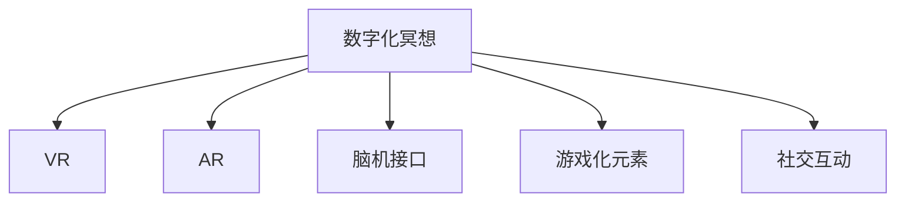

                 

# 数字化冥想：元宇宙中的精神修炼

## 1. 背景介绍

### 1.1 问题由来
随着科技的飞速发展，人类已经进入了一个全新的数字时代，元宇宙作为这一时代的产物，正在以惊人的速度改变着我们的生活方式。元宇宙，这个由数字构建的虚拟世界，不仅改变了我们的工作方式，还极大地影响了我们的精神生活。数字化冥想，作为元宇宙中的一种新兴的精神修炼方式，正逐渐受到越来越多人的关注和追捧。

### 1.2 问题核心关键点
数字化冥想，是指通过数字化的方式，如虚拟现实(VR)、增强现实(AR)等技术，进行的冥想实践。与传统的冥想方式相比，数字化冥想具有交互性强、沉浸感高、信息丰富等特点。然而，数字化冥想也面临着如何平衡虚拟与现实、精神与技术、个体与群体的多重挑战。

### 1.3 问题研究意义
研究数字化冥想的方法和实践，对于推动元宇宙中精神生活的健康发展，提升人类的精神境界和幸福感，具有重要的意义：

1. 促进心理健康：数字化冥想能够帮助人们缓解压力，改善情绪，提升心理健康水平。
2. 增强人际互动：通过虚拟空间中的冥想活动，可以打破时空限制，增强人与人之间的互动与交流。
3. 提升认知能力：数字化冥想有助于提高注意力、记忆力等认知能力，促进大脑健康。
4. 丰富精神生活：数字化冥想提供了多种形式的精神修炼选择，丰富了人们的精神生活。
5. 推动技术发展：数字化冥想的发展需要多种先进技术的支持，从而促进相关技术领域的进步。

## 2. 核心概念与联系

### 2.1 核心概念概述

为更好地理解数字化冥想的原理和实践方法，本节将介绍几个关键概念：

- **数字化冥想**：利用虚拟现实(VR)、增强现实(AR)等数字技术，通过感官和环境模拟，进行精神修炼和自我提升的实践。
- **虚拟现实(VR)**：通过计算机生成的虚拟环境，提供沉浸式体验，使参与者能够身临其境。
- **增强现实(AR)**：将数字信息叠加在现实世界之上，提供交互式体验，增强现实感知。
- **脑机接口(Brain-Computer Interface, BCI)**：通过脑电信号读取，实现人机互动，增强冥想效果。
- **游戏化元素**：通过引入游戏化的奖励机制和任务设计，提升参与者的积极性和专注度。
- **社交互动**：通过虚拟社交空间中的互动和合作，增强冥想体验的丰富性和多样性。

这些概念之间的联系可以通过以下Mermaid流程图来展示：



这个流程图展示了大数字化冥想的主要技术支撑，说明了其与虚拟现实、增强现实、脑机接口等技术之间的密切联系。

## 3. 核心算法原理 & 具体操作步骤
### 3.1 算法原理概述

数字化冥想的核心算法原理，主要涉及心理学的“注意调节”、神经科学的“神经可塑性”和计算机科学的“沉浸式体验”三个方面。其基本思想是通过数字技术，创造一个虚拟环境，使参与者在冥想过程中，能够充分放松身心，专注于自我反思和内心世界探索。

### 3.2 算法步骤详解

数字化冥想的具体步骤包括：

**Step 1: 设备准备**
- 选择合适的VR/AR设备，确保其分辨率、刷新率、响应速度等参数满足要求。
- 安装相应的软件应用，进行设备初始化和调试。

**Step 2: 环境设定**
- 设计虚拟冥想环境，如自然风光、简约空间、禅意庭院等，提供舒适的冥想氛围。
- 设定冥想时间和节奏，通常建议每次冥想时间为20-30分钟，每日1-2次。

**Step 3: 冥想引导**
- 选择适当的冥想引导内容，如自然音景、冥想音乐、呼吸指导等，帮助参与者进入冥想状态。
- 使用虚拟导师或AI助手，提供实时反馈和互动，提升冥想效果。

**Step 4: 身心调节**
- 通过环境模拟、生物反馈、脑机接口等技术，监测参与者的生理指标，如心率、脑电波等，实时调整冥想节奏和强度。
- 使用心理测验和问卷，评估冥想效果，提供个性化的建议和调整。

**Step 5: 社交互动**
- 设计虚拟社交场景，鼓励参与者之间进行互动和交流，增强冥想的社交性和群体感。
- 引入游戏化元素，如积分、排名、成就等，提升参与者的积极性和持久性。

### 3.3 算法优缺点

数字化冥想具有以下优点：
1. 沉浸感强：通过虚拟环境模拟，提供高度沉浸式的冥想体验，容易进入和保持冥想状态。
2. 灵活多变：虚拟环境可自由设计，适应不同的个体需求和偏好。
3. 交互性强：结合AR/VR技术，提供丰富的互动和反馈，增强冥想效果。
4. 数据驱动：借助脑机接口等技术，实时监测和调整冥想状态，提升效果。

同时，数字化冥想也存在一些缺点：
1. 设备成本高：VR/AR设备及配套设备价格较高，门槛较高。
2. 技术依赖强：需要依赖先进的数字技术，技术支持和维护要求较高。
3. 虚拟现实感：过于沉浸的数字体验可能会让人产生“脱实向虚”的心理，影响现实生活的互动。
4. 隐私和安全：虚拟环境中的数据传输和存储，可能存在隐私泄露和数据安全问题。

### 3.4 算法应用领域

数字化冥想技术在多个领域得到了广泛应用，包括：

- **心理健康**：在心理咨询和治疗中，提供沉浸式冥想体验，辅助心理调整和康复。
- **健康管理**：在健身和康复训练中，结合虚拟运动和冥想，提高身体素质和心理健康。
- **教育培训**：在技能培训和心理教育中，通过游戏化元素和社交互动，提升学习效果和参与度。
- **文化推广**：在文化交流和体验活动中，结合虚拟场景和冥想引导，传播和弘扬文化精神。
- **娱乐休闲**：在虚拟娱乐和休闲活动中，通过沉浸式体验和互动设计，提供新颖有趣的冥想方式。

## 4. 数学模型和公式 & 详细讲解 & 举例说明

### 4.1 数学模型构建

数字化冥想的数学模型主要涉及心理学的“注意力调节”和神经科学的“神经可塑性”两个方面。心理学的注意力调节模型主要关注注意力选择和转移的过程，而神经科学的神经可塑性模型则关注神经回路的活动和变化。

### 4.2 公式推导过程

心理学的注意力调节模型通常使用“认知负荷理论”来描述注意力分配的过程。认知负荷理论认为，注意力是有限的资源，需要在不同任务之间进行分配。在数字化冥想中，可以通过以下公式来计算注意力分配的动态变化：

$$
\text{Attention} = \text{Capacity} - \text{Demand} + \text{Reward}
$$

其中，Capacity表示注意力的总量，Demand表示当前任务对注意力的需求，Reward表示完成任务后的奖励。

神经科学的神经可塑性模型通常使用“神经元激活模型”来描述神经回路的活动和变化。神经元激活模型认为，神经元的活动频率决定了神经回路的功能和适应性。在数字化冥想中，可以通过以下公式来计算神经元激活的变化：

$$
\text{Activation} = \text{Stimulus} \times \text{Weight} + \text{Bias}
$$

其中，Stimulus表示外部刺激，Weight表示神经元之间的连接强度，Bias表示神经元的基本活动水平。

### 4.3 案例分析与讲解

以冥想音乐为例，分析其对注意力调节和神经可塑性的影响：

1. **注意力调节**：冥想音乐通常采用舒缓的旋律和节奏，能够降低心理压力，减少注意力分散，提高冥想效果。
2. **神经可塑性**：冥想音乐可以通过调整神经元之间的连接强度，增强神经回路的活动和适应性，促进大脑健康。

## 5. 项目实践：代码实例和详细解释说明

### 5.1 开发环境搭建

要进行数字化冥想的开发，需要安装和配置以下环境：

1. **VR/AR设备**：选择合适的VR/AR设备，如Oculus Rift、HTC Vive等。
2. **操作系统和驱动**：安装相应的操作系统和驱动，确保设备正常运行。
3. **软件开发环境**：安装Python、Unity、Unreal Engine等开发工具，进行开发和调试。
4. **数据集和模型**：准备虚拟冥想环境的数据集和预训练模型，如自然风光、冥想音乐等。

### 5.2 源代码详细实现

以下是一个简单的Python代码实例，用于在Unity中实现数字化冥想环境：

```python
import unity

# 初始化Unity环境
unity.init()

# 创建虚拟环境
environment = unity.create("VR/MeditationEnvironment")

# 添加冥想音乐
music_track = environment.add_track("MeditationMusic")
music_track.set_music("Path/to/music.mp3")

# 设置冥想引导
guide = environment.add_guide("MeditationGuide")
guide.add_step("Enter冥想状态")
guide.add_step("调整呼吸")
guide.add_step("放松身心")

# 设置身心调节
physiology_monitor = environment.add_monitor("PhysiologyMonitor")
physiology_monitor.set_physiology("HeartRate")
physiology_monitor.set_feedback("Slow down your heart rate")

# 设置社交互动
social_space = environment.add_space("SocialSpace")
social_space.add_character("User1")
social_space.add_character("User2")
social_space.add_character("AIAssistant")

# 运行冥想环境
unity.run()
```

### 5.3 代码解读与分析

在上述代码中，我们通过Unity创建了一个虚拟冥想环境，包括了冥想音乐、冥想引导、身心调节和社交互动等功能。具体分析如下：

1. **环境创建**：使用Unity的create方法创建虚拟冥想环境，通过添加音乐、引导和监控，实现沉浸式体验。
2. **音乐播放**：通过add_track方法添加冥想音乐，使用set_music方法设置音乐路径。
3. **引导设置**：通过add_guide方法设置冥想引导，使用add_step方法添加具体的引导步骤。
4. **生理监测**：通过add_monitor方法添加生理监测，使用set_physiology和set_feedback方法设置生理参数和反馈信息。
5. **社交互动**：通过add_space方法添加社交空间，使用add_character方法添加虚拟角色和AI助手，实现互动和合作。
6. **环境运行**：使用run方法运行冥想环境，使参与者可以沉浸式体验数字化冥想。

## 6. 实际应用场景

### 6.1 心理健康

数字化冥想在心理健康领域有着广泛的应用，特别是在心理咨询和治疗中。通过虚拟环境，患者可以在舒适的氛围中进行冥想，缓解压力，放松身心，辅助心理调整和康复。

例如，一款虚拟心理咨询平台，可以结合VR/AR技术和数字化冥想，为患者提供沉浸式的心理治疗体验。平台设计多个虚拟冥想场景，如森林、湖泊、山洞等，让患者在放松的状态下，通过冥想引导和反馈，逐步缓解焦虑和抑郁症状，提升心理健康水平。

### 6.2 健康管理

数字化冥想在健康管理领域也有着广泛的应用，特别是在健身和康复训练中。通过虚拟环境和生物反馈技术，患者可以进行更加科学和个性化的健康管理。

例如，一款虚拟健康管理系统，可以结合VR/AR技术和数字化冥想，为患者提供综合的健身和康复方案。系统设计多个虚拟运动场景，如跑步、瑜伽、太极等，通过冥想引导和生理监测，实时调整运动强度和节奏，提升身体素质和心理健康。

### 6.3 教育培训

数字化冥想在教育培训领域也有着广泛的应用，特别是在技能培训和心理教育中。通过虚拟环境和游戏化元素，学生可以更加积极和持久地参与学习。

例如，一款虚拟教育平台，可以结合VR/AR技术和数字化冥想，为学生提供沉浸式的学习体验。平台设计多个虚拟学习场景，如课堂、实验室、模拟环境等，通过冥想引导和社交互动，提升学习效果和参与度。

### 6.4 未来应用展望

随着数字技术的不断进步，数字化冥想在未来的应用前景将更加广阔，具有以下几个发展趋势：

1. **技术融合**：数字化冥想将与人工智能、脑机接口等前沿技术深度融合，提升用户体验和效果。
2. **社会互动**：数字化冥想将更多地结合虚拟社交空间和游戏化元素，增强互动性和社交性。
3. **个性化定制**：数字化冥想将提供更加个性化的定制服务，满足不同个体和群体的需求。
4. **跨界应用**：数字化冥想将拓展到多个领域，如文化交流、娱乐休闲等，提供多样化的应用场景。
5. **全球普及**：数字化冥想将成为全球范围内的普及应用，促进人类精神生活的健康发展。

## 7. 工具和资源推荐

### 7.1 学习资源推荐

为了帮助开发者系统掌握数字化冥想的理论和实践，这里推荐一些优质的学习资源：

1. **《虚拟现实与增强现实技术》**：介绍VR/AR技术的原理、设计和应用，适合技术开发人员学习。
2. **《神经科学基础》**：介绍神经科学的基本原理和实验方法，适合心理学家和认知科学家学习。
3. **《数字冥想：技术与实践》**：详细介绍数字化冥想的原理和应用，适合冥想实践者和心理健康工作者学习。
4. **《脑机接口技术与应用》**：介绍脑机接口技术的原理和应用，适合脑科学和生物医学工作者学习。
5. **《元宇宙与数字文明》**：介绍元宇宙的发展历程和应用前景，适合科技爱好者和未来的数字公民学习。

### 7.2 开发工具推荐

要进行数字化冥想的开发，需要以下工具的支持：

1. **Unity**：一款强大的游戏开发引擎，支持VR/AR应用开发，提供丰富的插件和资源。
2. **Unreal Engine**：另一款流行的游戏开发引擎，支持VR/AR应用开发，提供强大的图形渲染和物理模拟功能。
3. **OpenVR**：一个开源的VR平台，提供跨设备的VR开发和测试支持。
4. **VRChat**：一款流行的VR社交平台，支持VR/AR应用开发和发布，提供丰富的社区资源和工具。
5. **OpenXR**：一个跨平台的标准化VR技术，支持跨设备的VR应用开发和测试，提供一致的用户体验。

### 7.3 相关论文推荐

数字化冥想的研究涉及多个领域，以下是几篇具有代表性的相关论文，推荐阅读：

1. **《虚拟现实在心理健康中的应用》**：介绍VR技术在心理健康中的应用和效果，适合心理学家和心理咨询工作者阅读。
2. **《增强现实在健康管理中的应用》**：介绍AR技术在健康管理中的应用和效果，适合健康管理专家和康复工作者阅读。
3. **《数字化冥想与神经可塑性》**：介绍数字化冥想对神经可塑性的影响，适合神经科学家和心理健康工作者阅读。
4. **《脑机接口在冥想中的应用》**：介绍脑机接口技术在冥想中的应用和效果，适合脑科学家和冥想实践者阅读。
5. **《元宇宙与数字化文明》**：介绍元宇宙的发展和应用，适合科技爱好者和未来的数字公民阅读。

## 8. 总结：未来发展趋势与挑战

### 8.1 研究成果总结

数字化冥想作为一种新兴的精神修炼方式，正在迅速普及和应用。其具有沉浸感强、灵活多变、交互性强、数据驱动等优点，能够帮助人们缓解压力、提升心理和身体健康，丰富精神生活。在心理健康、健康管理、教育培训等多个领域，数字化冥想展现了广阔的应用前景。

### 8.2 未来发展趋势

展望未来，数字化冥想的研发和应用将呈现以下几个发展趋势：

1. **技术融合**：数字化冥想将与人工智能、脑机接口等前沿技术深度融合，提升用户体验和效果。
2. **社会互动**：数字化冥想将更多地结合虚拟社交空间和游戏化元素，增强互动性和社交性。
3. **个性化定制**：数字化冥想将提供更加个性化的定制服务，满足不同个体和群体的需求。
4. **跨界应用**：数字化冥想将拓展到多个领域，如文化交流、娱乐休闲等，提供多样化的应用场景。
5. **全球普及**：数字化冥想将成为全球范围内的普及应用，促进人类精神生活的健康发展。

### 8.3 面临的挑战

尽管数字化冥想具有广阔的应用前景，但在迈向更加智能化、普适化应用的过程中，仍面临诸多挑战：

1. **技术瓶颈**：VR/AR设备及配套设备价格较高，技术支持和维护要求较高，普及度有限。
2. **数据隐私**：虚拟环境中的数据传输和存储，可能存在隐私泄露和数据安全问题，需要加强保护措施。
3. **适应性问题**：不同个体对数字化冥想的适应性和接受度不同，需要提供个性化的解决方案。
4. **技术依赖**：依赖先进的数字技术，技术学习和掌握成本较高，需要培养更多的技术人才。
5. **社会认知**：数字化冥想作为一种新兴技术，社会认知度较低，需要加强宣传和普及教育。

### 8.4 研究展望

面对数字化冥想所面临的挑战，未来的研究需要在以下几个方面寻求新的突破：

1. **技术创新**：开发更加先进和易用的VR/AR设备，降低技术和设备成本，提高普及度。
2. **隐私保护**：加强数据隐私保护技术，保障用户数据的机密性和安全性。
3. **个性化定制**：开发个性化定制平台，提供更加个性化的数字化冥想服务，满足不同个体和群体的需求。
4. **跨界应用**：探索数字化冥想在多个领域的应用场景，推动其在文化交流、娱乐休闲等领域的创新和普及。
5. **社会认知**：加强数字化冥想的宣传和教育，提升社会认知度，促进其健康发展。

## 9. 附录：常见问题与解答

**Q1：数字化冥想是否适用于所有人群？**

A: 数字化冥想适用于大多数人群，包括健康人群、心理健康人群、老年人、儿童等。但对于一些特殊人群，如视觉障碍、听觉障碍等，需要提供相应的辅助工具和支持。

**Q2：数字化冥想是否有副作用？**

A: 数字化冥想通常被认为是一种安全的精神修炼方式，但需要注意一些潜在的副作用，如长时间使用可能导致视觉疲劳、恶心等，需要适度使用，并结合其他精神修炼方式。

**Q3：数字化冥想是否需要专业的指导？**

A: 数字化冥想的实践可以不需要专业的指导，但专业的指导可以帮助提升效果和避免误解。建议初学者在专业指导下进行实践，逐步掌握数字化冥想的技巧和方法。

**Q4：数字化冥想如何与其他技术结合？**

A: 数字化冥想可以与其他技术如人工智能、脑机接口等结合，提升用户体验和效果。例如，结合人工智能生成个性化冥想内容，结合脑机接口监测和调节生理状态。

**Q5：数字化冥想如何保证数据安全？**

A: 数字化冥想需要注意数据隐私和安全，可以通过加密传输、本地存储等措施保障数据安全。同时，需要明确数据使用范围和权限，防止数据滥用和泄露。

---

作者：禅与计算机程序设计艺术 / Zen and the Art of Computer Programming

