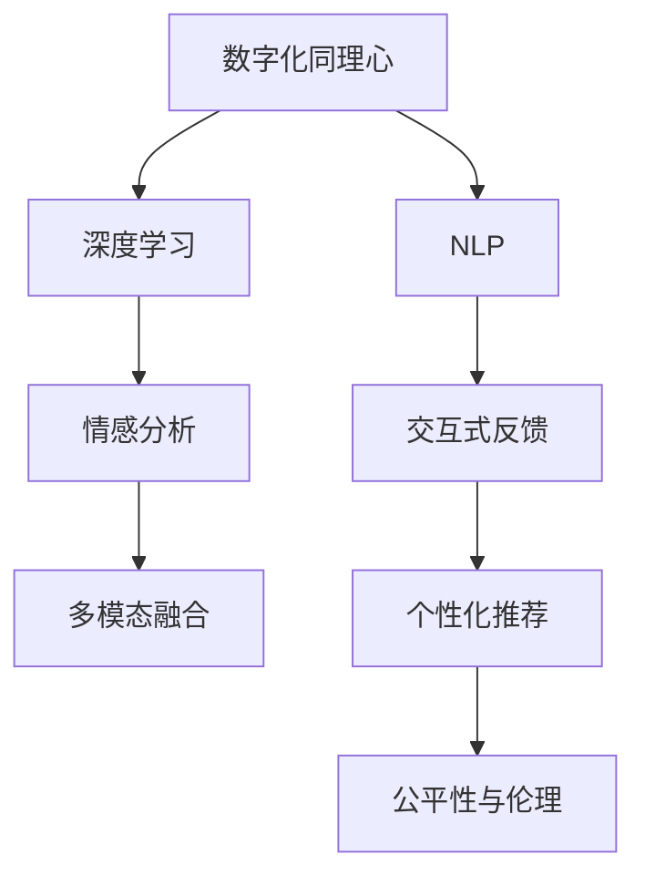

                 

# 数字化同理心培养：AI增强的人际理解方法

> 关键词：数字化同理心,人际理解,人工智能,自然语言处理(NLP),深度学习,情感分析,多模态融合

## 1. 背景介绍

### 1.1 问题由来
在数字化转型深入推进的今天，人际沟通的数字化水平日益提升，人们通过数字媒介进行交流、协作、娱乐的频率日益增加。然而，数字化的另一面，也带来了沟通效率降低、人际关系疏远、情感表达困难等问题。如何在数字化时代，增强人际理解、培养数字化同理心，成为我们面临的重要课题。

### 1.2 问题核心关键点
数字化同理心培养的核心在于，借助人工智能技术，模拟和优化人类同理心的形成机制，提升个体在数字环境下的情感感知、理解与回应能力。具体而言，需要在以下几个方面进行探索：

1. **情感感知与识别**：通过自然语言处理(NLP)技术，自动理解文本中的情感色彩和情绪状态。
2. **多模态信息融合**：结合语音、图像、视频等多模态数据，构建更全面的情绪感知模型。
3. **情感响应与反馈**：根据接收到的情感信息，生成合适的情感回应，以维护良好的情感互动。
4. **个性化与普适性**：构建能够根据不同情境、不同个体的情感需求，进行适应的同理心模型。
5. **公平性与伦理考量**：确保模型在各类人群、文化和情境中，均能公平、公正地提供同理心支持。

### 1.3 问题研究意义
培养数字化同理心，不仅有助于提升个体和组织在数字化环境下的沟通效率与幸福感，还将促进社会和谐，推动数字文明的发展。具体而言：

1. **提升用户体验**：通过理解和响应用户情感，提供更人性化的服务体验，增强用户粘性。
2. **促进社会和谐**：帮助个体在数字化情境下更好地理解和回应他人，减少因数字化带来的情感隔阂。
3. **驱动产业升级**：利用同理心技术，推动医疗、教育、零售等各行业向人性化、智能化转型。
4. **塑造新文化**：通过数字化同理心的推广，形成更加包容、开放、互信的数字文化。

## 2. 核心概念与联系

### 2.1 核心概念概述

为了深入理解数字化同理心的培养机制，本节将介绍几个关键概念及其相互联系：

1. **数字化同理心**：指在数字媒介环境中，个体通过理解他人的情感状态，产生共鸣，从而做出合适的情感回应。

2. **自然语言处理(NLP)**：专注于处理和理解自然语言的计算技术，包括语音识别、文本分类、情感分析等。

3. **深度学习**：一种模拟人脑神经网络结构的人工智能技术，通过多层神经网络对复杂模式进行学习与预测。

4. **情感分析**：通过文本、语音等数据，自动识别和理解情感状态的技术。

5. **多模态融合**：结合多种模态数据，构建更全面、更准确的情绪感知与识别模型。

6. **交互式反馈**：根据接收到的情感反馈，调整模型输出，增强模型的适应性与互动性。

7. **个性化推荐**：基于用户的历史情感行为数据，个性化推荐合适的情感回应。

8. **公平性与伦理**：确保模型在各类人群、文化和情境中，均能公平、公正地提供同理心支持。

这些概念之间的联系可以通过以下Mermaid流程图来展示：



这个流程图展示了数字化同理心的培养机制，其中NLP技术是基础，深度学习提供强有力的模型训练支持，情感分析用于识别情感状态，多模态融合提高感知能力，交互式反馈增强模型互动性，个性化推荐提供定制化服务，公平性与伦理确保模型应用的普适性。

## 3. 核心算法原理 & 具体操作步骤
### 3.1 算法原理概述

数字化同理心的培养，本质上是一个基于深度学习的情感识别与回应系统。其核心思想是：通过训练模型理解文本或多媒体数据中的情感信息，并根据接收到的情感反馈，生成相应的情感回应。

形式化地，假设训练数据集为 $D=\{(x_i,y_i)\}_{i=1}^N$，其中 $x_i$ 为输入数据， $y_i$ 为对应的情感标签。情感分析模型的目标是最小化损失函数 $\mathcal{L}(\theta)$，使得模型 $M_{\theta}(x)$ 的预测输出 $y$ 与真实标签 $y_i$ 之间的误差最小。

具体而言，情感分析模型通常是一个序列到序列的神经网络结构，如长短时记忆网络(LSTM)或门控循环单元(GRU)，在输入序列 $x$ 上进行训练。模型通过前向传播计算预测输出 $y$，并通过后向传播计算损失函数 $\mathcal{L}(\theta)$，再利用优化算法更新模型参数 $\theta$，使得模型输出更接近真实标签。

### 3.2 算法步骤详解

基于深度学习的数字化同理心培养，一般包括以下几个关键步骤：

**Step 1: 数据准备与标注**
- 收集大量的文本、语音、视频等多模态数据，并标注其中的情感信息。情感标签可以基于预先设定的情感词典，也可以使用半监督、弱监督方法自动标注。
- 将标注数据集划分为训练集、验证集和测试集，用于模型的训练、调优和评估。

**Step 2: 模型构建**
- 选择合适的深度学习模型结构，如RNN、LSTM、GRU、Transformer等。
- 定义模型输入输出接口，并选择合适的损失函数，如交叉熵、均方误差等。
- 在模型中引入情感嵌入向量，用于捕捉输入数据的情感特征。

**Step 3: 训练与调优**
- 使用深度学习框架如TensorFlow、PyTorch等，对模型进行训练。
- 选择合适的优化算法如Adam、SGD等，并设置合适的学习率、批大小等超参数。
- 在训练过程中，定期在验证集上评估模型性能，避免过拟合。
- 根据评估结果，调整模型结构、超参数等，优化模型表现。

**Step 4: 测试与部署**
- 在测试集上评估模型性能，对比训练前后的精度提升。
- 使用训练好的模型对新数据进行情感分析，并生成相应的情感回应。
- 将模型集成到实际应用系统中，如聊天机器人、智能客服等，提升用户体验。

### 3.3 算法优缺点

基于深度学习的数字化同理心培养方法具有以下优点：
1. 精度高：深度学习模型具备强大的特征提取能力，能够在海量数据上学习复杂的情感模式。
2. 适应性强：模型结构灵活，可以根据不同情境、不同个体进行适应性调整。
3. 自动化程度高：自动化标注、自动化训练、自动化评估，极大提升了研发效率。

同时，该方法也存在一些局限性：
1. 对数据质量依赖大：数据标注需要大量人工参与，标注质量直接影响模型效果。
2. 训练成本高：深度学习模型参数量大，训练和推理耗时耗资源。
3. 黑盒模型：模型内部运作机制复杂，难以进行可解释性分析。
4. 多模态融合困难：不同模态数据格式不同，融合难度较大。
5. 伦理与安全问题：情感分析可能侵犯用户隐私，模型输出可能带来误导。

尽管存在这些局限性，但就目前而言，基于深度学习的情感分析方法仍是培养数字化同理心的主流范式。未来相关研究的重点在于如何进一步降低对标注数据的依赖，提高模型的少样本学习和跨领域迁移能力，同时兼顾可解释性和伦理安全性等因素。

### 3.4 算法应用领域

基于深度学习的情感分析方法，在多个领域已经得到了广泛的应用，例如：

1. **智能客服**：通过情感分析，智能客服系统可以理解用户情感状态，提供个性化的情感回应，提升用户满意度。
2. **医疗健康**：情感分析可以用于心理健康监测、情绪障碍识别，辅助医生进行心理干预。
3. **教育培训**：通过分析学生的情感反应，提供个性化的学习建议，提升学习效果。
4. **零售电商**：情感分析可以用于分析用户评论，提供产品改进建议，提升用户购物体验。
5. **媒体传播**：情感分析可以用于舆情监测、情绪传播分析，优化新闻报道和社交媒体内容。
6. **安全监控**：情感分析可以用于识别异常行为，辅助视频监控、舆情预警等应用。

## 4. 数学模型和公式 & 详细讲解 & 举例说明
### 4.1 数学模型构建

本节将使用数学语言对基于深度学习的数字化同理心培养过程进行更加严格的刻画。

假设输入数据为 $x \in \mathcal{X}$，其中 $\mathcal{X}$ 为输入空间，如文本、语音、图像等。情感分析模型的目标是最小化损失函数 $\mathcal{L}(\theta)$，使得模型 $M_{\theta}(x)$ 的预测输出 $y$ 与真实标签 $y_i$ 之间的误差最小。

设模型 $M_{\theta}(x)$ 的预测输出为 $y = M_{\theta}(x)$，真实标签为 $y_i$，则情感分析模型的损失函数为：

$$
\mathcal{L}(\theta) = \frac{1}{N} \sum_{i=1}^N \ell(y_i, y)
$$

其中 $\ell(y_i, y)$ 为预测输出与真实标签之间的误差函数，如交叉熵损失、均方误差损失等。

### 4.2 公式推导过程

以下我们以二分类任务为例，推导交叉熵损失函数及其梯度的计算公式。

假设模型 $M_{\theta}$ 在输入 $x$ 上的输出为 $\hat{y}=M_{\theta}(x) \in [0,1]$，表示样本属于正类的概率。真实标签 $y \in \{0,1\}$。则二分类交叉熵损失函数定义为：

$$
\ell(y_i, y) = -[y\log \hat{y} + (1-y)\log (1-\hat{y})]
$$

将其代入损失函数公式，得：

$$
\mathcal{L}(\theta) = -\frac{1}{N}\sum_{i=1}^N [y_i\log M_{\theta}(x_i)+(1-y_i)\log(1-M_{\theta}(x_i))]
$$

根据链式法则，损失函数对参数 $\theta_k$ 的梯度为：

$$
\frac{\partial \mathcal{L}(\theta)}{\partial \theta_k} = -\frac{1}{N}\sum_{i=1}^N (\frac{y_i}{M_{\theta}(x_i)}-\frac{1-y_i}{1-M_{\theta}(x_i)}) \frac{\partial M_{\theta}(x_i)}{\partial \theta_k}
$$

其中 $\frac{\partial M_{\theta}(x_i)}{\partial \theta_k}$ 可进一步递归展开，利用自动微分技术完成计算。

在得到损失函数的梯度后，即可带入参数更新公式，完成模型的迭代优化。重复上述过程直至收敛，最终得到适应特定情感分析任务的最优模型参数 $\theta^*$。

## 5. 项目实践：代码实例和详细解释说明
### 5.1 开发环境搭建

在进行情感分析项目实践前，我们需要准备好开发环境。以下是使用Python进行PyTorch开发的环境配置流程：

1. 安装Anaconda：从官网下载并安装Anaconda，用于创建独立的Python环境。

2. 创建并激活虚拟环境：
```bash
conda create -n pytorch-env python=3.8 
conda activate pytorch-env
```

3. 安装PyTorch：根据CUDA版本，从官网获取对应的安装命令。例如：
```bash
conda install pytorch torchvision torchaudio cudatoolkit=11.1 -c pytorch -c conda-forge
```

4. 安装TensorFlow：
```bash
pip install tensorflow==2.9.0
```

5. 安装各类工具包：
```bash
pip install numpy pandas scikit-learn matplotlib tqdm jupyter notebook ipython
```

完成上述步骤后，即可在`pytorch-env`环境中开始情感分析项目的开发。

### 5.2 源代码详细实现

下面我们以情感分析任务为例，给出使用PyTorch进行深度学习模型训练的PyTorch代码实现。

首先，定义情感分析任务的数据处理函数：

```python
import torch
from torch.utils.data import Dataset, DataLoader
from torch.nn import functional as F
from transformers import BertTokenizer, BertForSequenceClassification

class SentimentDataset(Dataset):
    def __init__(self, texts, labels):
        self.texts = texts
        self.labels = labels
        self.tokenizer = BertTokenizer.from_pretrained('bert-base-uncased')

    def __len__(self):
        return len(self.texts)

    def __getitem__(self, item):
        text = self.texts[item]
        label = self.labels[item]

        encoding = self.tokenizer(text, return_tensors='pt', max_length=512, padding='max_length', truncation=True)
        input_ids = encoding['input_ids']
        attention_mask = encoding['attention_mask']

        return {'input_ids': input_ids, 
                'attention_mask': attention_mask,
                'labels': torch.tensor(label, dtype=torch.long)}

# 定义模型结构
model = BertForSequenceClassification.from_pretrained('bert-base-uncased', num_labels=2)

# 定义优化器
optimizer = torch.optim.Adam(model.parameters(), lr=2e-5)

# 定义损失函数
loss_fn = F.cross_entropy

# 定义训练函数
def train_epoch(model, dataloader, optimizer):
    model.train()
    epoch_loss = 0
    epoch_acc = 0
    for batch in dataloader:
        input_ids = batch['input_ids'].to(device)
        attention_mask = batch['attention_mask'].to(device)
        labels = batch['labels'].to(device)
        model.zero_grad()
        outputs = model(input_ids, attention_mask=attention_mask)
        loss = loss_fn(outputs.logits, labels)
        epoch_loss += loss.item()
        acc = (torch.argmax(outputs.logits, dim=1) == labels).float().mean().item()
        epoch_acc += acc
        loss.backward()
        optimizer.step()
    return epoch_loss / len(dataloader), epoch_acc / len(dataloader)

# 定义评估函数
def evaluate(model, dataloader):
    model.eval()
    total_loss = 0
    total_acc = 0
    with torch.no_grad():
        for batch in dataloader:
            input_ids = batch['input_ids'].to(device)
            attention_mask = batch['attention_mask'].to(device)
            labels = batch['labels'].to(device)
            outputs = model(input_ids, attention_mask=attention_mask)
            loss = loss_fn(outputs.logits, labels)
            total_loss += loss.item()
            acc = (torch.argmax(outputs.logits, dim=1) == labels).float().mean().item()
            total_acc += acc
    return total_loss / len(dataloader), total_acc / len(dataloader)

# 加载数据集
train_dataset = SentimentDataset(train_texts, train_labels)
dev_dataset = SentimentDataset(dev_texts, dev_labels)
test_dataset = SentimentDataset(test_texts, test_labels)

# 设置训练参数
epochs = 5
batch_size = 16

# 训练模型
for epoch in range(epochs):
    loss, acc = train_epoch(model, DataLoader(train_dataset, batch_size=batch_size))
    print(f"Epoch {epoch+1}, train loss: {loss:.3f}, train acc: {acc:.3f}")
    
    print(f"Epoch {epoch+1}, dev results:")
    dev_loss, dev_acc = evaluate(model, DataLoader(dev_dataset, batch_size=batch_size))
    print(f"dev loss: {dev_loss:.3f}, dev acc: {dev_acc:.3f}")
    
print("Test results:")
test_loss, test_acc = evaluate(model, DataLoader(test_dataset, batch_size=batch_size))
print(f"test loss: {test_loss:.3f}, test acc: {test_acc:.3f}")
```

以上代码实现了基于BERT模型的二分类情感分析任务。可以看到，使用PyTorch和Transformer库，可以实现高效、便捷的情感分析模型训练和评估。

### 5.3 代码解读与分析

让我们再详细解读一下关键代码的实现细节：

**SentimentDataset类**：
- `__init__`方法：初始化文本和标签数据，并创建BERT分词器。
- `__len__`方法：返回数据集的样本数量。
- `__getitem__`方法：对单个样本进行处理，将文本输入转换为BERT可接受的格式，并返回模型所需的输入和标签。

**训练与评估函数**：
- `train_epoch`函数：对数据以批为单位进行迭代，在每个批次上前向传播计算loss并反向传播更新模型参数，最后返回该epoch的平均loss和准确率。
- `evaluate`函数：与训练类似，不同点在于不更新模型参数，并在每个batch结束后将预测和标签结果存储下来，最后使用softmax函数计算预测概率并计算准确率。

**训练流程**：
- 定义总的epoch数和batch size，开始循环迭代
- 每个epoch内，先在训练集上训练，输出平均loss和准确率
- 在验证集上评估，输出验证集上的平均loss和准确率
- 所有epoch结束后，在测试集上评估，给出最终测试结果

可以看到，PyTorch配合Transformer库使得BERT情感分析模型的代码实现变得简洁高效。开发者可以将更多精力放在数据处理、模型改进等高层逻辑上，而不必过多关注底层的实现细节。

当然，工业级的系统实现还需考虑更多因素，如模型的保存和部署、超参数的自动搜索、更灵活的任务适配层等。但核心的情感分析过程基本与此类似。

## 6. 实际应用场景
### 6.1 智能客服系统

基于深度学习的情感分析技术，可以广泛应用于智能客服系统的构建。传统客服往往需要配备大量人力，高峰期响应缓慢，且一致性和专业性难以保证。而使用情感分析技术，智能客服系统可以实时监测用户情绪状态，自动进行情绪分类，并提供个性化的情感回应，提升用户体验。

在技术实现上，可以收集企业内部的历史客服对话记录，将问题和最佳答复构建成监督数据，在此基础上对预训练情感分析模型进行微调。微调后的情感分析模型能够自动理解用户情绪状态，匹配最合适的情感回应。对于客户提出的新问题，还可以接入检索系统实时搜索相关内容，动态组织生成回答。如此构建的智能客服系统，能大幅提升客户咨询体验和问题解决效率。

### 6.2 医疗健康

情感分析技术在医疗健康领域也有广泛应用。心理健康监测、情绪障碍识别等领域，情感分析可以用于分析患者的情绪状态，辅助医生进行心理干预和治疗。例如，智能医疗平台可以通过分析患者的社交媒体、电子病历中的情感信息，提供个性化的心理健康建议和治疗方案，帮助患者更好地管理情绪。

在技术实现上，可以收集患者的情感信息，构建情感标注数据集。在此基础上训练情感分析模型，并将其应用于患者的日常情绪监测和分析。通过不断迭代和优化，提高模型的精度和泛化能力，帮助患者及时发现和应对情绪问题。

### 6.3 教育培训

在教育培训领域，情感分析技术可以用于分析学生的情感反应，提供个性化的学习建议，提升学习效果。例如，智能教学系统可以通过分析学生的情绪反馈，动态调整教学内容和节奏，提供个性化的学习资源和辅导，帮助学生更好地掌握知识。

在技术实现上，可以收集学生的情绪数据，构建情感标注数据集。在此基础上训练情感分析模型，并将其应用于学生的学习行为分析。通过不断迭代和优化，提高模型的精度和泛化能力，帮助教师更好地了解学生的学习状态，提供个性化的教学支持。

### 6.4 零售电商

情感分析技术在零售电商领域也有广泛应用。情感分析可以用于分析用户的评论、评分等数据，提供产品改进建议，提升用户购物体验。例如，智能推荐系统可以通过分析用户的情感反馈，推荐用户可能感兴趣的商品，并提供个性化的购物建议，增强用户的购物满意度。

在技术实现上，可以收集用户的评论、评分等情感数据，构建情感标注数据集。在此基础上训练情感分析模型，并将其应用于用户的购物行为分析。通过不断迭代和优化，提高模型的精度和泛化能力，帮助电商平台更好地了解用户需求，提供个性化的推荐服务。

## 7. 工具和资源推荐
### 7.1 学习资源推荐

为了帮助开发者系统掌握情感分析的理论基础和实践技巧，这里推荐一些优质的学习资源：

1. 《深度学习》书籍：由深度学习领域的权威专家撰写，全面介绍了深度学习的基本原理和应用实例。
2. 《自然语言处理综论》书籍：涵盖了NLP领域的核心概念和前沿技术，适合深入学习。
3. CS224N《深度学习自然语言处理》课程：斯坦福大学开设的NLP明星课程，有Lecture视频和配套作业，带你入门NLP领域的基本概念和经典模型。
4. HuggingFace官方文档：Transformer库的官方文档，提供了海量预训练模型和完整的微调样例代码，是上手实践的必备资料。
5. 《Natural Language Processing with PyTorch》书籍：详细介绍了使用PyTorch进行NLP任务开发，包括情感分析在内的诸多范式。

通过对这些资源的学习实践，相信你一定能够快速掌握情感分析的精髓，并用于解决实际的NLP问题。
### 7.2 开发工具推荐

高效的开发离不开优秀的工具支持。以下是几款用于情感分析开发的常用工具：

1. PyTorch：基于Python的开源深度学习框架，灵活动态的计算图，适合快速迭代研究。大部分预训练语言模型都有PyTorch版本的实现。
2. TensorFlow：由Google主导开发的开源深度学习框架，生产部署方便，适合大规模工程应用。同样有丰富的预训练语言模型资源。
3. Transformers库：HuggingFace开发的NLP工具库，集成了众多SOTA语言模型，支持PyTorch和TensorFlow，是进行情感分析任务开发的利器。
4. Weights & Biases：模型训练的实验跟踪工具，可以记录和可视化模型训练过程中的各项指标，方便对比和调优。与主流深度学习框架无缝集成。
5. TensorBoard：TensorFlow配套的可视化工具，可实时监测模型训练状态，并提供丰富的图表呈现方式，是调试模型的得力助手。
6. Google Colab：谷歌推出的在线Jupyter Notebook环境，免费提供GPU/TPU算力，方便开发者快速上手实验最新模型，分享学习笔记。

合理利用这些工具，可以显著提升情感分析任务的开发效率，加快创新迭代的步伐。

### 7.3 相关论文推荐

情感分析技术的发展源于学界的持续研究。以下是几篇奠基性的相关论文，推荐阅读：

1. Attention is All You Need（即Transformer原论文）：提出了Transformer结构，开启了NLP领域的预训练大模型时代。
2. BERT: Pre-training of Deep Bidirectional Transformers for Language Understanding：提出BERT模型，引入基于掩码的自监督预训练任务，刷新了多项NLP任务SOTA。
3. Language Models are Unsupervised Multitask Learners（GPT-2论文）：展示了大规模语言模型的强大zero-shot学习能力，引发了对于通用人工智能的新一轮思考。
4. Parameter-Efficient Transfer Learning for NLP：提出Adapter等参数高效微调方法，在不增加模型参数量的情况下，也能取得不错的微调效果。
5. Adversarial Regularization in Deep Learning：提出对抗性正则化方法，增强模型的鲁棒性和泛化能力。
6. Representation Transfer Learning with BERT and Adversarial Networks：提出对抗性训练方法，提升模型的迁移能力和泛化性能。

这些论文代表了大语言模型情感分析技术的发展脉络。通过学习这些前沿成果，可以帮助研究者把握学科前进方向，激发更多的创新灵感。

## 8. 总结：未来发展趋势与挑战

### 8.1 总结

本文对基于深度学习的数字化同理心培养方法进行了全面系统的介绍。首先阐述了情感分析技术在数字化同理心培养中的重要性，明确了情感分析技术在提升用户体验、促进社会和谐、驱动产业升级等方面的应用价值。其次，从原理到实践，详细讲解了情感分析模型的构建、训练、评估等步骤，给出了情感分析任务开发的完整代码实例。同时，本文还广泛探讨了情感分析技术在智能客服、医疗健康、教育培训、零售电商等多个行业领域的应用前景，展示了情感分析技术的广泛应用潜力。

通过本文的系统梳理，可以看到，基于深度学习的情感分析方法正在成为数字化同理心培养的重要手段，极大地提升了数字环境下的情感理解和交互能力。未来，伴随深度学习技术的发展，情感分析技术有望在更多领域得到应用，为数字文明的发展注入新的活力。

### 8.2 未来发展趋势

展望未来，情感分析技术将呈现以下几个发展趋势：

1. **模型规模持续增大**：随着算力成本的下降和数据规模的扩张，深度学习模型的参数量还将持续增长。超大规模模型蕴含的丰富情感知识，有望支撑更加复杂多变的情感分析任务。
2. **多模态融合深入**：情感分析技术将更多地结合语音、图像、视频等多模态数据，构建更全面、更准确的情绪感知与识别模型。
3. **少样本学习与零样本学习**：未来的情感分析模型将更加注重少样本学习和零样本学习，通过提示模板、知识图谱等方式，利用预训练模型在少量标注数据上的学习能力。
4. **公平性与伦理考量**：未来的情感分析模型将更多地考虑公平性与伦理问题，确保模型在各类人群、文化和情境中，均能公平、公正地提供情感支持。
5. **自动化与个性化**：未来的情感分析系统将更加注重自动化与个性化，通过自监督、弱监督等方法，提升模型的泛化能力和适应性。

以上趋势凸显了情感分析技术的广阔前景。这些方向的探索发展，必将进一步提升情感分析系统的性能和应用范围，为数字文明的发展提供有力支持。

### 8.3 面临的挑战

尽管情感分析技术已经取得了瞩目成就，但在迈向更加智能化、普适化应用的过程中，它仍面临着诸多挑战：

1. **数据质量瓶颈**：高质量的标注数据对于情感分析模型的训练至关重要，但标注成本高、质量参差不齐，成为制约情感分析模型发展的瓶颈。如何进一步降低对标注数据的依赖，利用自监督、弱监督等方法提升模型性能，将是重要的研究方向。
2. **模型鲁棒性不足**：情感分析模型面对域外数据时，泛化性能往往大打折扣。对于噪声数据、恶意攻击等情况，情感分析模型的鲁棒性仍有待提升。如何增强模型对异常情况的应对能力，提高模型的泛化性和鲁棒性，将成为重要的研究课题。
3. **可解释性不足**：情感分析模型通常是"黑盒"系统，难以解释其内部工作机制和决策逻辑。对于医疗、金融等高风险应用，算法的可解释性和可审计性尤为重要。如何赋予情感分析模型更强的可解释性，将是亟待攻克的难题。
4. **隐私与安全问题**：情感分析模型可能侵犯用户隐私，输出可能带来误导。如何在保障数据隐私和安全的前提下，有效利用情感分析技术，将是未来的重要研究方向。
5. **跨文化与跨领域应用**：情感分析模型在不同文化和领域中的表现差异较大，如何构建普适性的情感分析模型，适应不同文化和领域的需求，将是重要的研究课题。

这些挑战凸显了情感分析技术在实际应用中的复杂性。只有在充分考虑数据、模型、伦理和安全等因素的前提下，才能真正实现情感分析技术的全面应用。

### 8.4 研究展望

面对情感分析技术面临的挑战，未来的研究需要在以下几个方面寻求新的突破：

1. **探索无监督和半监督方法**：摆脱对大规模标注数据的依赖，利用自监督学习、主动学习等无监督和半监督范式，最大限度利用非结构化数据，实现更加灵活高效的情感分析。
2. **引入更多先验知识**：将符号化的先验知识，如知识图谱、逻辑规则等，与神经网络模型进行巧妙融合，引导情感分析过程学习更准确、合理的情感知识。
3. **融合因果分析和博弈论工具**：将因果分析方法引入情感分析模型，识别出模型决策的关键特征，增强输出解释的因果性和逻辑性。借助博弈论工具刻画人机交互过程，主动探索并规避模型的脆弱点，提高系统稳定性。
4. **纳入伦理道德约束**：在模型训练目标中引入伦理导向的评估指标，过滤和惩罚有害的输出倾向。同时加强人工干预和审核，建立模型行为的监管机制，确保输出符合人类价值观和伦理道德。

这些研究方向的探索，必将引领情感分析技术迈向更高的台阶，为构建安全、可靠、可解释、可控的智能系统铺平道路。面向未来，情感分析技术还需要与其他人工智能技术进行更深入的融合，如知识表示、因果推理、强化学习等，多路径协同发力，共同推动情感理解与互动技术的进步。

## 9. 附录：常见问题与解答

**Q1：情感分析模型如何处理情感极性？**

A: 情感分析模型通常会将情感分为正面、负面和中性三类。在训练过程中，可以收集大量的情感标注数据，包括不同情感极性的文本。模型通过学习文本中的情感词汇、情感句式等特征，自动进行情感分类。在实际应用中，可以根据业务需求，调整模型的情感分类粒度，例如将情感分为极强、强、中、弱、无情感等不同级别。

**Q2：情感分析模型如何处理歧义情感？**

A: 文本中的情感表达往往具有一定程度的歧义性，即同一段文本可能同时包含正面和负面的情感。在训练情感分析模型时，可以收集多情感标签的数据，让模型学习如何综合理解文本中的复杂情感。在实际应用中，可以通过上下文分析、情感词汇权重等方式，减少歧义情感的影响，提升模型精度。

**Q3：情感分析模型如何处理多语言情感？**

A: 情感分析模型在处理多语言情感时，需要考虑语言差异、文化背景等因素。常用的方法包括：
1. 使用多语言情感标注数据，训练多语言情感分析模型。
2. 利用预训练的语言模型，如BERT、RoBERTa等，进行多语言情感迁移学习。
3. 结合多语言词典、情感词典等工具，对不同语言的情感表达进行统一处理。
4. 引入多语言数据增强技术，扩充多语言情感数据集，提升模型的泛化能力。

**Q4：情感分析模型如何处理情感变化趋势？**

A: 情感分析模型可以结合时间序列分析方法，对情感变化趋势进行建模。例如，可以使用LSTM或GRU等序列模型，对用户的历史情感数据进行建模，预测其未来的情感状态。在实际应用中，可以结合情感分析结果，构建情感变化趋势的可视化界面，帮助用户了解自身的情感波动，提供相应的情感管理建议。

**Q5：情感分析模型如何处理情感模糊度？**

A: 情感模糊度是指文本中的情感表达不够明确，难以简单分类。在训练情感分析模型时，可以通过引入情感模糊度标注数据，训练能够识别模糊情感的模型。在实际应用中，可以通过情感词汇的情感权重、上下文分析等方式，对情感模糊度进行判断和处理。

通过本文的系统梳理，可以看到，基于深度学习的情感分析技术正在成为数字化同理心培养的重要手段，极大地提升了数字环境下的情感理解和交互能力。未来，伴随深度学习技术的发展，情感分析技术有望在更多领域得到应用，为数字文明的发展提供有力支持。

