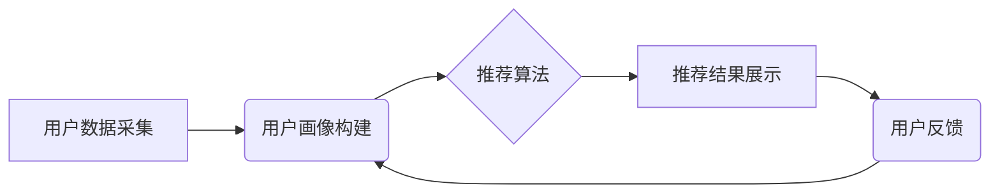

> AI推荐系统，个性化推荐，协同过滤，内容过滤，深度学习，推荐算法，用户行为分析

## 1. 背景介绍

在信息爆炸的时代，海量数据和信息涌现，用户面临着选择困难和信息过载的挑战。个性化推荐系统应运而生，旨在根据用户的兴趣、偏好、行为等信息，精准推荐用户感兴趣的内容，提升用户体验，并为企业带来商业价值。

个性化推荐系统已广泛应用于电商、视频、音乐、新闻等领域，例如：

* **电商平台:** 推荐商品、优惠券、促销活动等，提高用户购买意愿。
* **视频平台:** 推荐视频、电视剧、电影等，提升用户观看时长和用户粘性。
* **音乐平台:** 推荐歌曲、专辑、歌手等，满足用户个性化音乐需求。
* **新闻平台:** 推荐新闻资讯、文章、博客等，满足用户个性化信息获取需求。

## 2. 核心概念与联系

个性化推荐系统的核心是理解用户的需求和偏好，并根据这些信息推荐最相关的物品。

**2.1 核心概念**

* **用户:** 个性化推荐系统的目标用户，拥有独特的兴趣、偏好和行为模式。
* **物品:** 需要被推荐的内容，例如商品、视频、歌曲等。
* **交互:** 用户与物品之间的互动行为，例如点击、浏览、购买、评分等。
* **推荐:** 根据用户和物品的信息，预测用户对特定物品的兴趣，并将其推荐给用户。

**2.2 系统架构**



**2.3 核心技术**

* **协同过滤:** 基于用户或物品之间的相似性进行推荐。
* **内容过滤:** 基于物品的特征和用户偏好进行推荐。
* **深度学习:** 利用深度神经网络学习用户和物品之间的复杂关系，进行更精准的推荐。

## 3. 核心算法原理 & 具体操作步骤

### 3.1 算法原理概述

协同过滤算法是一种基于用户行为相似性的推荐算法。它假设，如果用户A喜欢物品X，并且用户B与用户A的兴趣相似，那么用户B也可能喜欢物品X。

### 3.2 算法步骤详解

1. **数据预处理:** 收集用户行为数据，例如用户对物品的评分、点击、购买等行为。
2. **用户-物品矩阵构建:** 将用户和物品作为矩阵的行和列，将用户对物品的行为作为矩阵的元素。
3. **相似性计算:** 计算用户之间的相似度或物品之间的相似度。常用的相似度度量方法包括余弦相似度、皮尔逊相关系数等。
4. **推荐生成:** 根据用户与相似用户的行为，预测用户对特定物品的兴趣，并生成推荐列表。

### 3.3 算法优缺点

**优点:**

* 能够发现隐含的用户兴趣和物品关系。
* 不需要物品的特征信息，可以推荐用户从未接触过的物品。

**缺点:**

* 数据稀疏性问题: 当用户行为数据较少时，难以计算出准确的相似度。
* 冷启动问题: 新用户和新物品难以获得推荐。

### 3.4 算法应用领域

协同过滤算法广泛应用于电商推荐、电影推荐、音乐推荐等领域。

## 4. 数学模型和公式 & 详细讲解 & 举例说明

### 4.1 数学模型构建

协同过滤算法的数学模型可以表示为用户-物品交互矩阵的预测问题。

设用户集合为U，物品集合为I，用户-物品交互矩阵为R，其中R(u,i)表示用户u对物品i的评分或行为。

目标是预测用户u对物品i的评分或行为，即R(u,i)。

### 4.2 公式推导过程

常用的协同过滤算法包括基于用户的协同过滤和基于物品的协同过滤。

**基于用户的协同过滤:**

预测用户u对物品i的评分为：

$$R(u,i) = \frac{\sum_{v \in N(u)} \frac{sim(u,v) * R(v,i)}{\sum_{w \in N(u)} sim(u,w)}}{\sum_{v \in N(u)} \frac{sim(u,v)}{\sum_{w \in N(u)} sim(u,w)}}$$

其中：

* N(u) 表示与用户u相似的用户集合。
* sim(u,v) 表示用户u和用户v之间的相似度。

**基于物品的协同过滤:**

预测用户u对物品i的评分为：

$$R(u,i) = \frac{\sum_{w \in N(i)} \frac{sim(i,w) * R(u,w)}{\sum_{z \in N(i)} sim(i,z)}}{\sum_{w \in N(i)} \frac{sim(i,w)}{\sum_{z \in N(i)} sim(i,z)}}$$

其中：

* N(i) 表示与物品i相似的物品集合。
* sim(i,w) 表示物品i和物品w之间的相似度。

### 4.3 案例分析与讲解

假设有一个用户-物品交互矩阵，其中用户集合为{u1, u2, u3}, 物品集合为{i1, i2, i3}, 矩阵元素表示用户对物品的评分。

根据上述公式，可以计算出用户对特定物品的评分预测值。

## 5. 项目实践：代码实例和详细解释说明

### 5.1 开发环境搭建

* Python 3.x
* scikit-learn
* pandas
* numpy

### 5.2 源代码详细实现

```python
import pandas as pd
from sklearn.metrics.pairwise import cosine_similarity

# 加载用户-物品交互数据
data = pd.read_csv('user_item_data.csv')

# 构建用户-物品矩阵
user_item_matrix = data.pivot_table(index='user_id', columns='item_id', values='rating')

# 计算用户相似度
user_similarity = cosine_similarity(user_item_matrix)

# 预测用户对特定物品的评分
def predict_rating(user_id, item_id):
    # 获取与用户相似的用户
    similar_users = user_similarity[user_id].argsort()[:-10:-1]
    # 计算预测评分
    predicted_rating = sum([user_item_matrix.loc[similar_user, item_id] * user_similarity[user_id][similar_user] for similar_user in similar_users]) / sum([user_similarity[user_id][similar_user] for similar_user in similar_users])
    return predicted_rating

# 示例
user_id = 1
item_id = 3
predicted_rating = predict_rating(user_id, item_id)
print(f'用户 {user_id} 对物品 {item_id} 的预测评分为: {predicted_rating}')
```

### 5.3 代码解读与分析

* 代码首先加载用户-物品交互数据，并构建用户-物品矩阵。
* 然后使用余弦相似度计算用户之间的相似度。
* 预测用户对特定物品的评分函数 `predict_rating` 根据用户相似度和用户对相似物品的评分进行预测。

### 5.4 运行结果展示

运行代码后，将输出用户对特定物品的预测评分。

## 6. 实际应用场景

个性化推荐系统已广泛应用于各个领域，例如：

* **电商平台:** 推荐商品、优惠券、促销活动等，提高用户购买意愿。
* **视频平台:** 推荐视频、电视剧、电影等，提升用户观看时长和用户粘性。
* **音乐平台:** 推荐歌曲、专辑、歌手等，满足用户个性化音乐需求。
* **新闻平台:** 推荐新闻资讯、文章、博客等，满足用户个性化信息获取需求。

### 6.4 未来应用展望

随着人工智能技术的不断发展，个性化推荐系统将更加智能化、精准化。

* **多模态推荐:** 将文本、图像、音频等多种模态信息融合，提供更丰富的推荐结果。
* **个性化解释:** 为推荐结果提供个性化解释，提升用户信任度。
* **实时推荐:** 基于用户实时行为，提供更及时、更精准的推荐。

## 7. 工具和资源推荐

### 7.1 学习资源推荐

* **书籍:**
    * 《推荐系统》
    * 《机器学习》
* **在线课程:**
    * Coursera: Recommender Systems
    * edX: Machine Learning

### 7.2 开发工具推荐

* **Python:** 广泛用于机器学习和数据分析。
* **scikit-learn:** Python机器学习库，提供各种推荐算法实现。
* **TensorFlow:** 深度学习框架，可用于构建更复杂的推荐模型。

### 7.3 相关论文推荐

* **Collaborative Filtering for Implicit Feedback Datasets**
* **Deep Learning for Recommender Systems**

## 8. 总结：未来发展趋势与挑战

### 8.1 研究成果总结

个性化推荐系统已取得显著成果，为用户提供更精准、更个性化的服务。

### 8.2 未来发展趋势

个性化推荐系统将朝着更智能化、更精准化、更个性化的方向发展。

### 8.3 面临的挑战

* 数据稀疏性问题
* 冷启动问题
* 算法解释性问题
* 隐私安全问题

### 8.4 研究展望

未来研究将重点关注解决上述挑战，并探索更先进的推荐算法和技术。

## 9. 附录：常见问题与解答

* **什么是协同过滤？**

协同过滤是一种基于用户行为相似性的推荐算法。

* **什么是内容过滤？**

内容过滤是一种基于物品特征和用户偏好的推荐算法。

* **什么是深度学习？**

深度学习是一种利用深度神经网络学习用户和物品之间复杂关系的推荐算法。

作者：禅与计算机程序设计艺术 / Zen and the Art of Computer Programming


<end_of_turn>