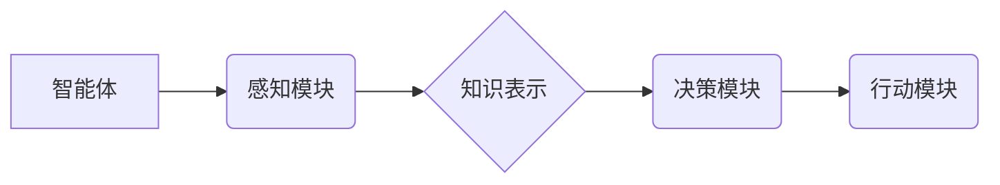

> AI Agent, 智能体, 强化学习, 决策理论, 知识表示, 自然语言处理, 机器学习

## 1. 背景介绍

在人工智能领域，智能体（Agent）的概念至关重要。智能体可以被理解为一个能够感知环境、做出决策并采取行动的系统。它拥有自主性，能够根据自身目标和环境反馈进行学习和调整行为。智能体在各个领域都有广泛的应用，例如机器人控制、游戏 AI、金融交易、医疗诊断等。

随着人工智能技术的不断发展，智能体的功能和复杂性也在不断提升。从简单的规则型智能体到能够学习和适应复杂环境的深度学习智能体，智能体的发展经历了多个阶段。

## 2. 核心概念与联系

**2.1 智能体类型**

智能体可以根据其感知能力、决策机制和行为方式进行分类：

* **代理（Agent）：** 能够感知环境并做出决策的系统。
* **简单反射式代理（Simple Reflex Agent）：** 基于当前感知信息做出反应的代理。
* **模型-基于代理（Model-Based Agent）：** 建立环境模型，并根据模型预测未来状态做出决策的代理。
* **基于目标的代理（Goal-Based Agent）：** 拥有明确的目标，并根据目标选择行动的代理。
* **学习代理（Learning Agent）：** 能够从经验中学习并改进决策的代理。

**2.2 智能体架构**

智能体的架构通常包括以下几个主要部分：

* **感知模块（Perception Module）：** 收集环境信息，例如传感器数据、图像、文本等。
* **知识表示模块（Knowledge Representation Module）：** 将感知信息转换为可理解的知识表示形式，例如符号逻辑、规则网络、语义网络等。
* **决策模块（Decision Module）：** 根据知识表示和目标，选择最优行动。
* **行动模块（Action Module）：** 将决策转化为实际行动，例如控制机器人运动、发出语音指令等。

**2.3 核心概念关系图**



## 3. 核心算法原理 & 具体操作步骤

**3.1 算法原理概述**

强化学习（Reinforcement Learning，RL）是一种机器学习方法，它通过奖励和惩罚机制来训练智能体学习最优行为策略。

**3.2 算法步骤详解**

1. **环境建模：** 建立环境模型，包括状态空间、动作空间和奖励函数。
2. **策略初始化：** 初始化智能体的行为策略，例如随机策略或贪婪策略。
3. **交互学习：** 智能体与环境交互，根据当前状态选择动作，并获得奖励或惩罚。
4. **策略更新：** 根据获得的奖励和惩罚，更新智能体的行为策略，使其朝着获得更高奖励的方向发展。
5. **重复步骤3-4：** 重复交互学习和策略更新过程，直到智能体达到预设的目标或性能指标。

**3.3 算法优缺点**

* **优点：**
    * 可以学习复杂的行为策略。
    * 不需要明确的规则或知识，能够从经验中学习。
    * 适用于动态变化的环境。
* **缺点：**
    * 训练过程可能需要大量的时间和资源。
    * 容易陷入局部最优解。
    * 需要设计合理的奖励函数，否则可能导致智能体学习到不期望的行为。

**3.4 算法应用领域**

* **机器人控制：** 训练机器人完成复杂的任务，例如导航、抓取、组装等。
* **游戏 AI：** 开发能够与人类玩家进行竞争的 AI 对手。
* **金融交易：** 预测市场趋势，进行自动交易。
* **医疗诊断：** 辅助医生诊断疾病，制定治疗方案。

## 4. 数学模型和公式 & 详细讲解 & 举例说明

**4.1 数学模型构建**

强化学习的数学模型通常包括以下几个关键要素：

* **状态空间（State Space）：** 环境可能存在的全部状态集合。
* **动作空间（Action Space）：** 智能体在每个状态下可以采取的所有动作集合。
* **奖励函数（Reward Function）：** 将状态和动作映射到奖励值，奖励值表示智能体采取该动作在该状态下的收益。
* **价值函数（Value Function）：** 评估智能体在特定状态下采取特定策略的长期收益。

**4.2 公式推导过程**

* **Bellman 方程：** 价值函数的更新公式，用于迭代地估计价值函数。

$$
V(s) = \max_a \left[ R(s, a) + \gamma \sum_{s'} P(s' | s, a) V(s') \right]
$$

其中：

* $V(s)$ 是状态 $s$ 的价值函数。
* $R(s, a)$ 是在状态 $s$ 执行动作 $a$ 得到的奖励。
* $\gamma$ 是折扣因子，控制未来奖励的权重。
* $P(s' | s, a)$ 是从状态 $s$ 执行动作 $a$ 到状态 $s'$ 的转移概率。

**4.3 案例分析与讲解**

例如，在玩游戏时，智能体可以将游戏状态作为输入，选择行动作为输出，游戏奖励作为反馈。通过不断地学习和更新价值函数，智能体可以逐渐掌握游戏的策略，并最终获得更高的分数。

## 5. 项目实践：代码实例和详细解释说明

**5.1 开发环境搭建**

* Python 3.x
* TensorFlow 或 PyTorch 等深度学习框架
* OpenAI Gym 等强化学习环境

**5.2 源代码详细实现**

```python
import gym
import tensorflow as tf

# 定义神经网络模型
model = tf.keras.Sequential([
    tf.keras.layers.Dense(64, activation='relu'),
    tf.keras.layers.Dense(64, activation='relu'),
    tf.keras.layers.Dense(env.action_space.n)
])

# 定义损失函数和优化器
optimizer = tf.keras.optimizers.Adam()
loss_fn = tf.keras.losses.CategoricalCrossentropy()

# 训练循环
for episode in range(num_episodes):
    state = env.reset()
    done = False
    total_reward = 0

    while not done:
        # 选择动作
        action = model.predict(state[None, :])[0]
        # 执行动作
        next_state, reward, done, _ = env.step(action)
        # 更新状态
        state = next_state
        # 计算损失
        with tf.GradientTape() as tape:
            loss = loss_fn(tf.one_hot(action, env.action_space.n), model.predict(state[None, :])[0])
        # 反向传播
        gradients = tape.gradient(loss, model.trainable_variables)
        optimizer.apply_gradients(zip(gradients, model.trainable_variables))
        # 更新总奖励
        total_reward += reward

    print(f"Episode {episode+1}, Total Reward: {total_reward}")

```

**5.3 代码解读与分析**

这段代码实现了基于深度学习的强化学习算法。

* 首先定义了一个神经网络模型，用于将状态映射到动作概率分布。
* 然后定义了损失函数和优化器，用于训练神经网络模型。
* 训练循环中，智能体与环境交互，根据当前状态选择动作，并根据奖励更新模型参数。

**5.4 运行结果展示**

训练完成后，智能体能够在环境中完成预设的任务，例如在游戏环境中获得更高的分数。

## 6. 实际应用场景

**6.1 机器人控制**

强化学习可以用于训练机器人完成复杂的任务，例如导航、抓取、组装等。例如，Google DeepMind 的 AlphaGo 利用强化学习技术战胜了世界围棋冠军。

**6.2 游戏 AI**

强化学习可以用于开发能够与人类玩家进行竞争的 AI 对手。例如，OpenAI 的 Dota 2 AI 利用强化学习技术在 Dota 2 游戏中取得了优异的成绩。

**6.3 金融交易**

强化学习可以用于预测市场趋势，进行自动交易。例如，一些金融机构利用强化学习技术开发自动交易系统，以提高交易效率和收益。

**6.4 医疗诊断**

强化学习可以用于辅助医生诊断疾病，制定治疗方案。例如，一些研究人员利用强化学习技术开发医疗诊断系统，以提高诊断准确率和效率。

**6.5 未来应用展望**

强化学习在未来将有更广泛的应用场景，例如自动驾驶、个性化推荐、药物研发等。随着算法的不断改进和计算资源的提升，强化学习将成为人工智能领域的重要驱动力。

## 7. 工具和资源推荐

**7.1 学习资源推荐**

* **书籍：**
    * Reinforcement Learning: An Introduction by Richard S. Sutton and Andrew G. Barto
    * Deep Reinforcement Learning Hands-On by Maxim Lapan
* **在线课程：**
    * Coursera: Reinforcement Learning Specialization by David Silver
    * Udacity: Deep Reinforcement Learning Nanodegree

**7.2 开发工具推荐**

* **OpenAI Gym:** 强化学习环境库
* **TensorFlow:** 深度学习框架
* **PyTorch:** 深度学习框架

**7.3 相关论文推荐**

* Deep Q-Network (DQN)
* Proximal Policy Optimization (PPO)
* Trust Region Policy Optimization (TRPO)

## 8. 总结：未来发展趋势与挑战

**8.1 研究成果总结**

近年来，强化学习取得了显著的进展，在多个领域取得了突破性成果。例如，AlphaGo、AlphaStar等模型在围棋、星际争霸等游戏中战胜了人类冠军。

**8.2 未来发展趋势**

* **模型效率提升：** 研究更有效率的强化学习算法，降低训练成本和时间。
* **泛化能力增强：** 使强化学习模型能够更好地泛化到新的环境和任务。
* **安全性和可靠性提升：** 确保强化学习模型的安全性和可靠性，避免出现不可预知的错误行为。
* **多智能体强化学习：** 研究多智能体协作学习的算法，解决复杂的多智能体问题。

**8.3 面临的挑战**

* **奖励函数设计：** 设计合理的奖励函数仍然是强化学习面临的挑战。
* **样本效率：** 强化学习算法通常需要大量的样本数据进行训练，这在某些情况下可能难以实现。
* **可解释性：** 强化学习模型的决策过程往往难以解释，这可能导致模型的信任度降低。

**8.4 研究展望**

未来，强化学习将继续朝着更智能、更安全、更可靠的方向发展。随着算法的不断改进和计算资源的提升，强化学习将应用于更多领域，并为人类社会带来更多福祉。

## 9. 附录：常见问题与解答

**9.1 什么是强化学习？**

强化学习是一种机器学习方法，它通过奖励和惩罚机制来训练智能体学习最优行为策略。

**9.2 强化学习与监督学习有什么区别？**

监督学习需要 labeled 数据，而强化学习不需要 labeled 数据，而是通过与环境交互学习。

**9.3 强化学习有哪些应用场景？**

强化学习的应用场景非常广泛，例如机器人控制、游戏 AI、金融交易、医疗诊断等。

**9.4 如何设计一个合理的奖励函数？**

奖励函数的设计是强化学习的关键，它应该能够有效地引导智能体学习目标行为。

**9.5 强化学习的未来发展趋势是什么？**

强化学习的未来发展趋势包括模型效率提升、泛化能力增强、安全性和可靠性提升、多智能体强化学习等。


作者：禅与计算机程序设计艺术 / Zen and the Art of Computer Programming 
<end_of_turn>