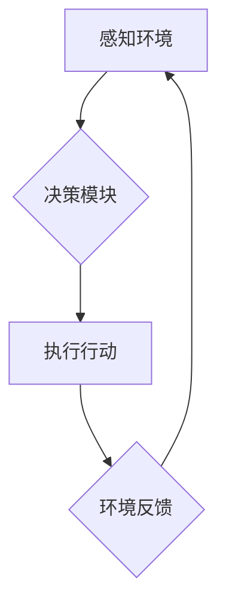

> AI代理，工作流，仿真环境，实验评估，机器学习，强化学习，决策优化

## 1. 背景介绍

在当今数据爆炸和智能化浪潮席卷的时代，人工智能（AI）正以惊人的速度发展，并逐渐渗透到各个领域。其中，AI代理作为一种能够自主学习、决策和执行任务的智能实体，在自动化、智能决策和复杂系统管理等方面展现出巨大的潜力。

AI代理的工作流是指AI代理在执行任务过程中所遵循的一系列步骤或规则，它决定了代理如何感知环境、制定决策和执行行动。在仿真环境中，我们可以构建复杂的模拟系统，并通过部署AI代理来研究其工作流的有效性、鲁棒性和可扩展性。

仿真环境的优势在于能够提供一个安全、可控和可重复的测试平台，让我们可以对AI代理的工作流进行深入的实验和评估，从而更好地理解其行为模式、优化其性能，并最终将其应用于现实世界中的实际问题。

## 2. 核心概念与联系

**2.1 AI代理**

AI代理是一个能够感知环境、做出决策并执行行动的智能实体。它通常由以下几个核心组件组成：

* **感知模块:** 用于收集环境信息，例如传感器数据、网络流量等。
* **决策模块:** 基于感知到的信息，制定最优的行动策略。
* **执行模块:** 将决策转化为实际行动，并与环境交互。

**2.2 工作流**

工作流是指AI代理在执行任务过程中所遵循的一系列步骤或规则。它可以是预先定义的流程，也可以是通过学习和适应环境而动态生成的。

**2.3 仿真环境**

仿真环境是一个模拟真实世界的虚拟环境，可以用来测试和评估AI代理的工作流。它可以包含各种类型的实体、规则和事件，以模拟现实世界的复杂性。

**2.4 实验与评估**

实验与评估是研究AI代理工作流的关键环节。通过设计不同的实验场景和评估指标，我们可以量化AI代理的工作流性能，并从中获得宝贵的 insights。

**2.5 Mermaid 流程图**



## 3. 核心算法原理 & 具体操作步骤

### 3.1  算法原理概述

在AI代理工作流中，常用的算法包括：

* **强化学习 (Reinforcement Learning):** 通过奖励机制，让AI代理学习最优的行动策略。
* **决策树 (Decision Tree):** 使用树形结构来表示决策规则，并根据环境信息进行决策。
* **贝叶斯网络 (Bayesian Network):** 使用概率图模型来表示知识和推理关系，并进行概率预测。

### 3.2  算法步骤详解

**3.2.1 强化学习**

1. **环境建模:** 建立一个模拟真实世界的环境模型。
2. **代理初始化:** 初始化AI代理，赋予其初始状态和行为策略。
3. **环境交互:** AI代理与环境交互，感知环境信息并执行行动。
4. **奖励机制:** 根据代理的行动和环境状态，给予相应的奖励或惩罚。
5. **策略更新:** 使用强化学习算法，根据奖励信号更新代理的行为策略。
6. **重复步骤3-5:** 持续进行环境交互和策略更新，直到代理达到预设的目标或性能指标。

**3.2.2 决策树**

1. **数据收集:** 收集大量环境数据和对应的决策结果。
2. **决策树构建:** 使用决策树算法，根据数据构建决策树模型。
3. **决策推理:** 当AI代理感知到环境信息时，根据决策树模型进行决策推理。

**3.2.3 贝叶斯网络**

1. **知识表示:** 将相关知识和推理关系表示为贝叶斯网络模型。
2. **概率推理:** 使用贝叶斯推理算法，根据环境信息和贝叶斯网络模型进行概率预测。
3. **决策制定:** 根据概率预测结果，制定最优的行动策略。

### 3.3  算法优缺点

| 算法 | 优点 | 缺点 |
|---|---|---|
| 强化学习 | 可以学习复杂决策策略，适应动态环境 | 需要大量数据和计算资源，训练时间长 |
| 决策树 | 易于理解和解释，训练速度快 | 容易过拟合，对数据质量要求高 |
| 贝叶斯网络 | 可以处理不确定性，表达复杂的因果关系 | 建模复杂度高，数据需求量大 |

### 3.4  算法应用领域

* **机器人控制:** 控制机器人完成复杂的任务，例如导航、抓取、组装等。
* **自动驾驶:** 帮助车辆自主驾驶，避开障碍物，规划路线等。
* **金融交易:** 自动执行交易策略，优化投资组合。
* **医疗诊断:** 辅助医生诊断疾病，预测患者病情。

## 4. 数学模型和公式 & 详细讲解 & 举例说明

### 4.1  数学模型构建

在强化学习中，常用的数学模型包括状态空间、动作空间、奖励函数和价值函数。

* **状态空间 (State Space):** 描述环境的当前状态，例如机器人位置、速度、传感器读数等。
* **动作空间 (Action Space):** 描述代理可以执行的动作，例如前进、后退、转弯、抓取等。
* **奖励函数 (Reward Function):** 将代理的行动和环境状态映射到一个奖励值，用于指导代理学习最优策略。
* **价值函数 (Value Function):** 估计代理在特定状态下采取特定行动的长期回报。

### 4.2  公式推导过程

**价值函数的更新公式:**

$$
V(s) = \max_{\alpha} \sum_{t=0}^{\infty} \gamma^t r(s_t, \alpha_t)
$$

其中：

* $V(s)$ 是状态 $s$ 的价值函数。
* $\alpha$ 是代理的行为策略。
* $r(s_t, \alpha_t)$ 是在状态 $s_t$ 下采取行动 $\alpha_t$ 得到的奖励。
* $\gamma$ 是折扣因子，控制未来奖励的权重。

### 4.3  案例分析与讲解

假设一个机器人需要在迷宫中找到出口。我们可以将迷宫视为状态空间，机器人可以执行的行动包括前进、后退、转弯等。

奖励函数可以设计为：

* 当机器人到达出口时，奖励为 100。
* 当机器人撞到墙壁时，惩罚为 -1。
* 其他情况下，奖励为 0。

通过强化学习算法，机器人可以学习到最优的行动策略，从而找到出口。

## 5. 项目实践：代码实例和详细解释说明

### 5.1  开发环境搭建

* 操作系统: Ubuntu 20.04
* Python 版本: 3.8
* 必要的库: OpenAI Gym, TensorFlow, PyTorch

### 5.2  源代码详细实现

```python
import gym
import numpy as np

# 创建环境
env = gym.make('CartPole-v1')

# 定义代理
class Agent:
    def __init__(self, state_size, action_size):
        self.state_size = state_size
        self.action_size = action_size
        self.model = ... # 使用强化学习算法构建模型

    def act(self, state):
        # 根据状态选择动作
        action = self.model.predict(state)
        return action

# 初始化代理
agent = Agent(env.observation_space.shape[0], env.action_space.n)

# 训练代理
for episode in range(1000):
    state = env.reset()
    done = False
    total_reward = 0
    while not done:
        action = agent.act(state)
        next_state, reward, done, _ = env.step(action)
        total_reward += reward
        state = next_state
    print(f"Episode {episode+1}, Total Reward: {total_reward}")

# 测试代理
state = env.reset()
while True:
    action = agent.act(state)
    state, reward, done, _ = env.step(action)
    env.render()
    if done:
        break
```

### 5.3  代码解读与分析

* 代码首先创建了一个CartPole-v1环境，这是一个经典的强化学习环境。
* 然后定义了一个代理类，包含状态空间、动作空间和模型。
* 模型可以使用强化学习算法构建，例如DQN、A2C等。
* 代理的act方法根据当前状态选择动作。
* 训练过程循环执行多个episode，每个episode中代理与环境交互，并根据奖励更新模型参数。
* 测试过程使用训练好的模型，在环境中进行模拟，并展示代理的行为。

### 5.4  运行结果展示

运行代码后，代理将在环境中学习并最终能够稳定地平衡杆子。

## 6. 实际应用场景

### 6.1  智能客服

AI代理可以作为智能客服，自动回答用户常见问题，处理简单的请求，并引导用户到合适的资源。

### 6.2  个性化推荐

AI代理可以根据用户的行为数据和偏好，推荐个性化的商品、服务和内容。

### 6.3  自动驾驶

AI代理可以作为自动驾驶系统的核心，负责感知环境、规划路线、控制车辆。

### 6.4  未来应用展望

随着人工智能技术的不断发展，AI代理的工作流将在更多领域得到应用，例如：

* **医疗保健:** 辅助医生诊断疾病、制定治疗方案、管理患者数据。
* **教育:** 提供个性化学习体验、自动批改作业、辅助教师教学。
* **金融:** 自动化交易、风险管理、欺诈检测。

## 7. 工具和资源推荐

### 7.1  学习资源推荐

* **书籍:**
    * 《Reinforcement Learning: An Introduction》 by Richard S. Sutton and Andrew G. Barto
    * 《Deep Learning》 by Ian Goodfellow, Yoshua Bengio, and Aaron Courville
* **在线课程:**
    * Coursera: Reinforcement Learning Specialization
    * Udacity: Deep Learning Nanodegree

### 7.2  开发工具推荐

* **OpenAI Gym:** 用于构建和测试强化学习环境。
* **TensorFlow:** 深度学习框架。
* **PyTorch:** 深度学习框架。

### 7.3  相关论文推荐

* **Deep Q-Network (DQN):** Mnih et al. (2015)
* **Proximal Policy Optimization (PPO):** Schulman et al. (2017)
* **Trust Region Policy Optimization (TRPO):** Schulman et al. (2015)

## 8. 总结：未来发展趋势与挑战

### 8.1  研究成果总结

近年来，AI代理的工作流研究取得了显著进展，例如：

* 强化学习算法取得了突破性进展，能够解决更复杂的任务。
* 仿真环境技术不断发展，能够模拟更真实的场景。
* AI代理的应用领域不断扩展，覆盖了多个行业。

### 8.2  未来发展趋势

* **更强大的AI代理:** 能够学习更复杂的行为策略，适应更动态的环境。
* **更真实的仿真环境:** 能够模拟更复杂的现实世界场景。
* **更广泛的应用场景:** AI代理将应用于更多领域，例如医疗保健、教育、金融等。

### 8.3  面临的挑战

* **数据获取和标注:** 训练AI代理需要大量数据，获取和标注数据成本高。
* **算法效率:** 训练复杂AI代理需要大量的计算资源，算法效率是一个重要的挑战。
* **安全性和可靠性:** AI代理的决策需要安全可靠，避免出现意外情况。

### 8.