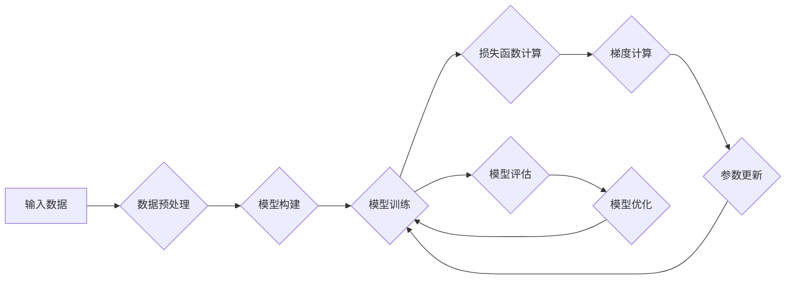

> 深度学习，模型优化，参数调整，梯度下降，正则化，超参数调优，神经网络

## 1. 背景介绍

深度学习作为人工智能领域最前沿的技术之一，在图像识别、自然语言处理、语音识别等领域取得了突破性的进展。深度学习模型的性能很大程度上取决于模型结构和参数的优化。模型优化是指通过调整模型参数，使得模型在训练数据上表现最佳，并能够泛化到未见过的数据。参数调整是模型优化的核心环节，它涉及到如何选择合适的学习率、优化算法、正则化方法等。

随着深度学习模型的规模和复杂度不断增加，模型优化和参数调整变得更加重要。传统的优化算法在处理大规模模型时效率低下，容易陷入局部最优解。因此，研究新的优化算法和参数调整方法成为深度学习领域的重要研究方向。

## 2. 核心概念与联系

**2.1 深度学习模型**

深度学习模型通常由多层神经网络组成，每层神经网络包含多个神经元。神经元之间通过连接权重进行信息传递。模型的输出结果由最后一层神经元的激活值决定。

**2.2 损失函数**

损失函数用于衡量模型预测结果与真实值的差距。常见的损失函数包括均方误差、交叉熵等。

**2.3 梯度下降**

梯度下降是深度学习模型训练中最常用的优化算法。它通过计算损失函数对模型参数的梯度，并沿着梯度负方向更新参数，从而逐渐降低损失函数的值。

**2.4 正则化**

正则化是一种防止模型过拟合的技术。它通过在损失函数中添加惩罚项，限制模型参数的复杂度，从而提高模型的泛化能力。常见的正则化方法包括L1正则化和L2正则化。

**2.5 超参数调优**

超参数是深度学习模型训练过程中需要预先设置的参数，例如学习率、批处理大小、迭代次数等。超参数的设置对模型性能有重要影响。超参数调优是指通过尝试不同的超参数组合，找到最优的超参数设置。

**2.6 模型优化流程图**



## 3. 核心算法原理 & 具体操作步骤

### 3.1 算法原理概述

梯度下降算法是深度学习模型训练中最常用的优化算法。它通过迭代更新模型参数，逐步降低损失函数的值。

**3.1.1 梯度概念**

梯度是一个向量，它表示函数在某一点变化的方向和速率。在深度学习中，梯度表示损失函数对模型参数的偏导数。

**3.1.2 梯度下降步骤**

1. 初始化模型参数。
2. 计算损失函数对模型参数的梯度。
3. 根据梯度更新模型参数。
4. 重复步骤2和3，直到损失函数收敛。

### 3.2 算法步骤详解

**3.2.1 参数初始化**

模型参数的初始值可以随机初始化，也可以使用预训练模型的参数。

**3.2.2 梯度计算**

使用链式法则计算损失函数对每个模型参数的偏导数。

**3.2.3 参数更新**

使用梯度下降公式更新模型参数：

```
参数 = 参数 - 学习率 * 梯度
```

其中，学习率是一个控制参数更新幅度的超参数。

**3.2.4 损失函数收敛**

当损失函数的值不再显著下降时，认为模型训练完成。

### 3.3 算法优缺点

**优点:**

* 算法简单易懂，易于实现。
* 能够找到局部最优解。

**缺点:**

* 容易陷入局部最优解。
* 学习率的选择对算法性能影响较大。
* 在处理大规模模型时效率低下。

### 3.4 算法应用领域

梯度下降算法广泛应用于深度学习模型的训练，例如图像识别、自然语言处理、语音识别等领域。

## 4. 数学模型和公式 & 详细讲解 & 举例说明

### 4.1 数学模型构建

**4.1.1 损失函数**

假设模型的预测值是 $y_i$，真实值是 $t_i$，则均方误差损失函数可以表示为：

$$
L = \frac{1}{N} \sum_{i=1}^{N} (y_i - t_i)^2
$$

其中，$N$ 是样本数量。

**4.1.2 梯度下降公式**

梯度下降公式可以表示为：

$$
\theta_j = \theta_j - \eta \frac{\partial L}{\partial \theta_j}
$$

其中，$\theta_j$ 是模型参数，$\eta$ 是学习率，$\frac{\partial L}{\partial \theta_j}$ 是损失函数对参数 $\theta_j$ 的偏导数。

### 4.2 公式推导过程

**4.2.1 损失函数对参数的偏导数**

对均方误差损失函数求导，得到：

$$
\frac{\partial L}{\partial \theta_j} = \frac{2}{N} \sum_{i=1}^{N} (y_i - t_i) \frac{\partial y_i}{\partial \theta_j}
$$

其中，$\frac{\partial y_i}{\partial \theta_j}$ 是模型输出 $y_i$ 对参数 $\theta_j$ 的偏导数。

**4.2.2 参数更新公式**

将偏导数代入梯度下降公式，得到参数更新公式：

$$
\theta_j = \theta_j - \eta \frac{2}{N} \sum_{i=1}^{N} (y_i - t_i) \frac{\partial y_i}{\partial \theta_j}
$$

### 4.3 案例分析与讲解

**4.3.1 线性回归模型**

假设我们有一个线性回归模型，其输出为：

$$
y = \theta_0 + \theta_1 x
$$

其中，$\theta_0$ 和 $\theta_1$ 是模型参数，$x$ 是输入特征。

**4.3.2 损失函数和梯度计算**

使用均方误差损失函数，并计算损失函数对参数 $\theta_0$ 和 $\theta_1$ 的偏导数。

**4.3.3 参数更新**

使用梯度下降公式更新参数 $\theta_0$ 和 $\theta_1$。

## 5. 项目实践：代码实例和详细解释说明

### 5.1 开发环境搭建

使用 Python 语言和 TensorFlow 或 PyTorch 深度学习框架进行开发。

### 5.2 源代码详细实现

```python
import tensorflow as tf

# 定义模型
model = tf.keras.models.Sequential([
    tf.keras.layers.Dense(units=10, activation='relu', input_shape=(784,)),
    tf.keras.layers.Dense(units=10, activation='softmax')
])

# 定义损失函数和优化器
loss_fn = tf.keras.losses.SparseCategoricalCrossentropy()
optimizer = tf.keras.optimizers.Adam(learning_rate=0.001)

# 训练模型
model.compile(loss=loss_fn, optimizer=optimizer)
model.fit(x_train, y_train, epochs=10)

# 评估模型
loss, accuracy = model.evaluate(x_test, y_test)
print('Loss:', loss)
print('Accuracy:', accuracy)
```

### 5.3 代码解读与分析

* 定义模型：使用 TensorFlow 的 Keras API 定义一个简单的多层感知机模型。
* 定义损失函数和优化器：使用均方误差损失函数和 Adam 优化器。
* 训练模型：使用 `model.fit()` 方法训练模型。
* 评估模型：使用 `model.evaluate()` 方法评估模型性能。

### 5.4 运行结果展示

训练完成后，打印出模型的损失值和准确率。

## 6. 实际应用场景

深度学习模型优化和参数调整在各个领域都有广泛的应用，例如：

**6.1 图像识别**

在图像识别任务中，模型优化可以提高模型对不同角度、光照条件和分辨率的图像的识别准确率。

**6.2 自然语言处理**

在自然语言处理任务中，模型优化可以提高模型对文本的理解和生成能力。

**6.3 语音识别**

在语音识别任务中，模型优化可以提高模型对不同口音和背景噪声的语音识别准确率。

**6.4 其他应用场景**

模型优化和参数调整还可以应用于其他领域，例如推荐系统、医疗诊断、金融预测等。

## 7. 工具和资源推荐

### 7.1 学习资源推荐

* 深度学习书籍：
    * 《深度学习》
    * 《动手学深度学习》
* 在线课程：
    * Coursera 深度学习课程
    * Udacity 深度学习课程

### 7.2 开发工具推荐

* TensorFlow
* PyTorch
* Keras

### 7.3 相关论文推荐

* 《Gradient Descent Optimization Algorithms》
* 《Deep Learning》

## 8. 总结：未来发展趋势与挑战

### 8.1 研究成果总结

深度学习模型优化和参数调整取得了显著的进展，例如：

* 提出了一些新的优化算法，例如 Adam、RMSprop 等。
* 开发了一些自动参数调整工具，例如 Hyperopt、Optuna 等。

### 8.2 未来发展趋势

* 研究更有效的优化算法，例如基于进化算法的优化算法。
* 开发更智能的自动参数调整工具，例如基于强化学习的自动参数调整工具。
* 研究模型压缩和加速技术，提高模型在移动设备上的部署效率。

### 8.3 面临的挑战

* 大规模模型的训练和优化仍然是一个挑战。
* 模型的泛化能力和鲁棒性仍然需要提高。
* 模型的可解释性和可信度仍然需要进一步研究。

### 8.4 研究展望

未来，深度学习模型优化和参数调整将继续是一个重要的研究方向。随着人工智能技术的不断发展，我们将看到更多更有效的优化算法和参数调整方法的出现，从而推动深度学习技术的进一步发展。

## 9. 附录：常见问题与解答

**9.1 什么是学习率？**

学习率是梯度下降算法中的一个超参数，它控制着参数更新的幅度。学习率过大可能会导致模型训练不稳定，学习率过小可能会导致模型训练速度过慢。

**9.2 如何选择合适的学习率？**

可以使用学习率衰减策略，例如指数衰减或阶梯衰减，逐渐降低学习率。也可以使用学习率调度器，自动调整学习率。

**9.3 什么是正则化？**

正则化是一种防止模型过拟合的技术。它通过在损失函数中添加惩罚项，限制模型参数的复杂度，从而提高模型的泛化能力。

**9.4 什么是超参数调优？**

超参数调优是指通过尝试不同的超参数组合，找到最优的超参数设置。常用的超参数调优方法包括网格搜索、随机搜索和贝叶斯优化。


作者：禅与计算机程序设计艺术 / Zen and the Art of Computer Programming 
<end_of_turn>