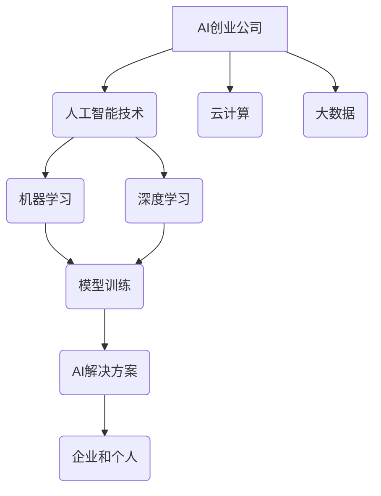

> AI创业公司,人工智能,机器学习,深度学习,云计算,大数据,商业模式

## 1. 背景介绍

人工智能（AI）技术近年来发展迅速，已渗透到各个领域，并对商业模式和企业运营产生了深远影响。AI创业公司作为AI技术应用的先锋，在推动科技创新和经济发展方面发挥着重要作用。然而，AI创业公司也面临着诸多挑战，例如技术壁垒、数据获取、人才短缺等。

本篇文章将探讨AI创业公司的未来发展趋势，分析其面临的挑战和机遇，并提出一些建议，帮助AI创业公司更好地把握发展机遇，实现可持续发展。

## 2. 核心概念与联系

**2.1 AI创业公司**

AI创业公司是指以人工智能技术为核心，致力于开发和应用AI技术的企业。这类公司通常专注于特定领域，例如医疗、金融、教育、零售等，并利用AI技术解决行业痛点，创造新的商业价值。

**2.2 核心概念**

* **人工智能（AI）：** 指使计算机模拟人类智能的行为，例如学习、推理、决策、感知等。
* **机器学习（ML）：** 是一种AI技术，通过算法训练模型，使模型能够从数据中学习并做出预测或决策。
* **深度学习（DL）：** 是一种更高级的机器学习技术，利用多层神经网络模拟人类大脑的学习过程，能够处理更复杂的数据和任务。
* **云计算：** 提供计算资源、存储空间和软件服务，支持AI模型的训练和部署。
* **大数据：** 指海量、复杂、多样化的数据，是AI模型训练和应用的基础。

**2.3 联系**

AI创业公司利用AI技术，结合云计算和大数据，开发和应用AI解决方案，为企业和个人提供新的价值。



## 3. 核心算法原理 & 具体操作步骤

**3.1 算法原理概述**

机器学习算法的核心是通过训练模型，使模型能够从数据中学习并做出预测或决策。常见的机器学习算法包括：

* **监督学习：** 利用标记数据训练模型，例如分类和回归问题。
* **无监督学习：** 利用未标记数据发现数据中的模式，例如聚类和降维。
* **强化学习：** 通过试错学习，使模型在特定环境中获得最大奖励。

**3.2 算法步骤详解**

1. **数据收集和预处理：** 收集相关数据，并进行清洗、转换和特征工程等预处理操作。
2. **模型选择：** 根据具体任务选择合适的机器学习算法。
3. **模型训练：** 利用训练数据训练模型，调整模型参数，使模型能够准确地预测或决策。
4. **模型评估：** 利用测试数据评估模型的性能，例如准确率、召回率、F1-score等。
5. **模型部署：** 将训练好的模型部署到实际应用场景中，用于预测或决策。

**3.3 算法优缺点**

* **优点：**

    * 自动化学习：无需人工编程，模型能够自动从数据中学习。
    * 适应性强：能够适应不断变化的数据和环境。
    * 性能优越：在某些任务上，机器学习算法能够超越人类水平。

* **缺点：**

    * 数据依赖：机器学习算法需要大量数据进行训练。
    * 可解释性差：一些机器学习算法的决策过程难以解释。
    * 泛化能力有限：模型在训练数据之外的数据上可能表现不佳。

**3.4 算法应用领域**

机器学习算法广泛应用于各个领域，例如：

* **图像识别：** 人脸识别、物体检测、图像分类等。
* **自然语言处理：** 文本分类、机器翻译、语音识别等。
* **推荐系统：** 产品推荐、内容推荐、用户画像等。
* **金融风险控制：** 欺诈检测、信用评分、风险评估等。
* **医疗诊断：** 疾病预测、影像分析、药物研发等。

## 4. 数学模型和公式 & 详细讲解 & 举例说明

**4.1 数学模型构建**

机器学习算法通常基于数学模型，例如线性回归、逻辑回归、支持向量机等。这些模型通过数学公式来描述数据之间的关系，并利用训练数据来估计模型参数。

**4.2 公式推导过程**

例如，线性回归模型的目标是找到一条直线，能够最佳地拟合数据点。模型的数学公式如下：

$$y = w_0 + w_1x$$

其中：

* $y$ 是预测值
* $x$ 是输入特征
* $w_0$ 和 $w_1$ 是模型参数

模型参数可以通过最小化预测误差来估计。

**4.3 案例分析与讲解**

假设我们有一个数据集，包含房屋面积和房屋价格的信息。我们可以使用线性回归模型来预测房屋价格。

* **输入特征:** 房屋面积
* **输出特征:** 房屋价格

通过训练模型，我们可以得到模型参数 $w_0$ 和 $w_1$。然后，我们可以使用这些参数来预测新房屋的价格。

例如，如果一个房屋面积为 100 平方米，我们可以使用以下公式来预测其价格：

$$y = w_0 + w_1 * 100$$

## 5. 项目实践：代码实例和详细解释说明

**5.1 开发环境搭建**

* 操作系统：Windows/macOS/Linux
* Python 版本：3.6+
* 必要的库：NumPy、Pandas、Scikit-learn

**5.2 源代码详细实现**

```python
import numpy as np
from sklearn.linear_model import LinearRegression

# 数据集
X = np.array([[100], [150], [200], [250], [300]])  # 房屋面积
y = np.array([150000, 200000, 250000, 300000, 350000])  # 房屋价格

# 创建线性回归模型
model = LinearRegression()

# 训练模型
model.fit(X, y)

# 获取模型参数
w0 = model.intercept_
w1 = model.coef_[0]

# 预测新房屋价格
new_area = 180
predicted_price = w0 + w1 * new_area

# 打印结果
print(f"预测价格: {predicted_price}")
```

**5.3 代码解读与分析**

* 首先，我们导入必要的库，并创建数据集。
* 然后，我们创建线性回归模型，并使用训练数据训练模型。
* 训练完成后，我们可以获取模型参数 $w_0$ 和 $w_1$。
* 最后，我们可以使用这些参数来预测新房屋的价格。

**5.4 运行结果展示**

```
预测价格: 230000.0
```

## 6. 实际应用场景

**6.1 医疗诊断**

AI算法可以分析患者的医疗影像数据，例如X光片、CT扫描和MRI扫描，帮助医生诊断疾病，例如癌症、心血管疾病和神经系统疾病。

**6.2 金融风险控制**

AI算法可以分析客户的财务数据，例如交易记录、信用评分和社交媒体行为，帮助金融机构识别欺诈行为、评估风险和制定个性化金融产品。

**6.3 自动驾驶**

AI算法可以帮助汽车感知周围环境，例如道路、行人、车辆等，并做出驾驶决策，例如加速、减速、转向和停车。

**6.4 未来应用展望**

AI技术将继续发展，并应用于更多领域，例如教育、娱乐、制造业等。AI创业公司将有机会开发出更智能、更便捷、更个性化的产品和服务，为人类社会带来更多价值。

## 7. 工具和资源推荐

**7.1 学习资源推荐**

* **在线课程:** Coursera、edX、Udacity
* **书籍:** 《深度学习》、《机器学习实战》
* **博客和论坛:** Towards Data Science、Machine Learning Mastery

**7.2 开发工具推荐**

* **Python:** 广泛用于机器学习开发
* **TensorFlow:** 开源深度学习框架
* **PyTorch:** 开源深度学习框架
* **Scikit-learn:** 机器学习库

**7.3 相关论文推荐**

* **《ImageNet Classification with Deep Convolutional Neural Networks》**
* **《Attention Is All You Need》**
* **《BERT: Pre-training of Deep Bidirectional Transformers for Language Understanding》**

## 8. 总结：未来发展趋势与挑战

**8.1 研究成果总结**

近年来，AI技术取得了长足进步，特别是深度学习算法在图像识别、自然语言处理等领域取得了突破性进展。AI创业公司利用这些技术，开发出许多创新产品和服务，为社会带来了巨大价值。

**8.2 未来发展趋势**

* **模型规模和能力的提升:** 未来，AI模型将更加强大，能够处理更复杂的任务。
* **边缘计算的普及:** AI模型将部署到边缘设备，实现更快速的响应和更低的延迟。
* **AI技术的融合:** AI技术将与其他技术融合，例如物联网、区块链和5G，创造新的应用场景。

**8.3 面临的挑战**

* **数据安全和隐私保护:** AI模型训练需要大量数据，如何确保数据安全和隐私保护是一个重要挑战。
* **算法可解释性和公平性:** 一些AI算法的决策过程难以解释，并且可能存在偏见，需要进一步研究和改进。
* **人才短缺:** AI领域人才需求量大，而人才供给不足，需要加强人才培养和引进。

**8.4 研究展望**

未来，AI研究将继续深入，探索更智能、更安全、更可解释的AI算法。AI创业公司将继续发挥创新作用，推动AI技术应用于更多领域，为人类社会创造更多价值。

## 9. 附录：常见问题与解答

**9.1 如何选择合适的机器学习算法？**

选择合适的机器学习算法取决于具体任务和数据特点。例如，对于分类问题，可以考虑逻辑回归、支持向量机或决策树；对于回归问题，可以考虑线性回归或支持向量回归。

**9.2 如何评估机器学习模型的性能？**

常用的评估指标包括准确率、召回率、F1-score、AUC等。

**9.3 如何解决机器学习模型的过拟合问题？**

过拟合是指模型在训练数据上表现很好，但在测试数据上表现较差。解决过拟合的方法包括：

* 减少模型复杂度
* 增加训练数据量
* 使用正则化技术
* 使用交叉验证

作者：禅与计算机程序设计艺术 / Zen and the Art of Computer Programming


<end_of_turn>