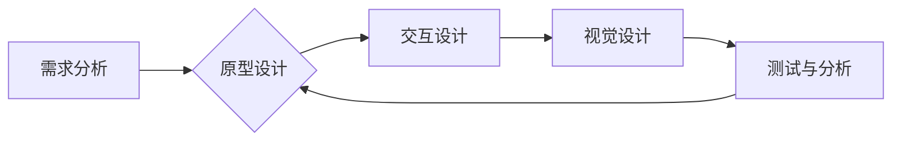

> AI创业公司,用户体验设计,需求分析,设计评审,迭代优化,用户研究,原型设计,交互设计,视觉设计,测试与分析

## 1. 背景介绍

在当今科技飞速发展的时代，人工智能（AI）技术正在各个领域掀起一场革命。AI创业公司应运而生，致力于利用AI技术解决各种现实问题，创造新的价值。然而，仅仅拥有先进的AI技术还不够，用户体验（UX）设计同样至关重要。良好的用户体验可以提升用户满意度，促进产品推广，最终推动企业发展。

然而，许多AI创业公司在用户体验设计方面存在一些问题，例如：

* **缺乏对用户需求的深入了解：** 很多AI创业公司过于专注于技术的研发，而忽略了用户需求的调研和分析。
* **设计评审机制不完善：**  缺乏有效的设计评审机制，导致设计方案存在缺陷，难以满足用户需求。
* **迭代优化不足：**  对用户反馈的收集和处理不够及时，导致产品迭代速度慢，难以适应用户的不断变化需求。

为了解决这些问题，本文将探讨AI创业公司用户体验设计流程的优化方法，包括需求分析、设计评审与迭代优化等环节。

## 2. 核心概念与联系

用户体验设计是一个多学科交叉的领域，涉及心理学、人机交互、设计学等多个方面。其核心目标是通过优化产品的设计和交互，提升用户使用产品的愉悦感、效率和满意度。

**用户体验设计流程**通常包括以下几个阶段：

1. **需求分析：** 了解用户需求、目标和痛点。
2. **原型设计：**  根据需求分析结果，创建产品原型，进行初步交互体验测试。
3. **交互设计：**  设计产品的交互逻辑和用户界面，确保用户操作流畅自然。
4. **视觉设计：**  设计产品的视觉风格和界面元素，提升产品的美观度和吸引力。
5. **测试与分析：**  进行用户测试，收集用户反馈，并根据反馈进行产品迭代优化。

**AI技术与用户体验设计**的结合，可以带来以下优势：

* **个性化体验：** AI可以根据用户的行为和偏好，提供个性化的产品推荐、内容定制和服务。
* **智能交互：** AI可以实现自然语言交互、语音识别等功能，提升用户体验的便捷性和效率。
* **预测性设计：** AI可以分析用户行为数据，预测用户的潜在需求，提前进行产品设计和优化。

**Mermaid 流程图**



## 3. 核心算法原理 & 具体操作步骤

### 3.1  算法原理概述

用户体验设计流程优化中，可以应用多种算法和技术，例如：

* **用户行为分析算法：**  分析用户在产品中的行为数据，例如点击、停留时间、滑动等，以了解用户使用习惯和偏好。
* **推荐算法：**  根据用户的历史行为和偏好，推荐相关产品、内容或服务。
* **自然语言处理算法：**  理解用户的自然语言输入，例如文本、语音，并进行相应的处理和响应。

### 3.2  算法步骤详解

以用户行为分析算法为例，其具体操作步骤如下：

1. **数据收集：** 收集用户在产品中的行为数据，例如点击事件、页面浏览记录、搜索历史等。
2. **数据预处理：** 对收集到的数据进行清洗、转换和格式化，以便于后续分析。
3. **特征提取：** 从用户行为数据中提取特征，例如用户访问的页面类型、停留时间、点击次数等。
4. **模型训练：** 使用机器学习算法，对提取的特征进行训练，建立用户行为预测模型。
5. **模型评估：** 使用测试数据评估模型的准确性和性能，并进行模型调优。
6. **应用部署：** 将训练好的模型部署到产品中，用于分析用户行为和提供个性化推荐等功能。

### 3.3  算法优缺点

**优点：**

* 可以自动分析大量用户行为数据，发现隐藏的模式和趋势。
* 可以根据用户行为进行个性化推荐和服务，提升用户体验。
* 可以帮助企业了解用户需求，改进产品设计和功能。

**缺点：**

* 需要大量的用户行为数据进行训练，否则模型效果可能不佳。
* 模型训练需要一定的技术和资源投入。
* 用户行为数据可能存在隐私问题，需要妥善处理。

### 3.4  算法应用领域

用户行为分析算法广泛应用于以下领域：

* **电商平台：**  推荐商品、个性化广告、用户画像分析。
* **社交媒体：**  内容推荐、用户关系分析、社区运营。
* **游戏行业：**  游戏行为分析、玩家画像分析、游戏设计优化。
* **金融行业：**  风险控制、欺诈检测、客户服务优化。

## 4. 数学模型和公式 & 详细讲解 & 举例说明

### 4.1  数学模型构建

用户行为分析算法通常基于概率统计模型，例如：

* **贝叶斯网络：**  用于表示用户行为之间的依赖关系，并进行概率预测。
* **马尔科夫链：**  用于描述用户在不同页面之间的跳转行为，并预测用户未来的行为。
* **隐马尔可夫模型：**  用于分析用户隐藏状态下的行为模式，例如用户兴趣、情绪等。

### 4.2  公式推导过程

以贝叶斯网络为例，其核心公式为：

$$P(A|B) = \frac{P(B|A)P(A)}{P(B)}$$

其中：

* $P(A|B)$ 表示在已知事件B发生的情况下，事件A发生的概率。
* $P(B|A)$ 表示在已知事件A发生的情况下，事件B发生的概率。
* $P(A)$ 表示事件A发生的概率。
* $P(B)$ 表示事件B发生的概率。

### 4.3  案例分析与讲解

假设我们想要预测用户是否会购买某个商品，我们可以构建一个贝叶斯网络模型，其中：

* 事件A：用户购买商品。
* 事件B：用户浏览了该商品的详情页。

根据用户浏览历史数据，我们可以估计出：

* $P(B|A)$：用户浏览了详情页的概率，如果用户购买了商品。
* $P(A)$：用户购买商品的概率。
* $P(B)$：用户浏览了详情页的概率。

然后，我们可以使用贝叶斯公式计算出：

* $P(A|B)$：用户浏览了详情页的情况下，购买商品的概率。

## 5. 项目实践：代码实例和详细解释说明

### 5.1  开发环境搭建

* 操作系统：Windows/macOS/Linux
* Python版本：3.6+
* 必要的库：pandas, numpy, scikit-learn, matplotlib

### 5.2  源代码详细实现

```python
import pandas as pd
from sklearn.model_selection import train_test_split
from sklearn.linear_model import LogisticRegression
from sklearn.metrics import accuracy_score

# 加载用户行为数据
data = pd.read_csv('user_behavior.csv')

# 选择特征和目标变量
features = ['page_views', 'click_count', 'purchase_history']
target = 'purchase'

# 将数据分割为训练集和测试集
X_train, X_test, y_train, y_test = train_test_split(data[features], data[target], test_size=0.2, random_state=42)

# 创建逻辑回归模型
model = LogisticRegression()

# 训练模型
model.fit(X_train, y_train)

# 对测试集进行预测
y_pred = model.predict(X_test)

# 计算模型准确率
accuracy = accuracy_score(y_test, y_pred)
print(f'模型准确率: {accuracy}')
```

### 5.3  代码解读与分析

* 代码首先加载用户行为数据，并选择特征和目标变量。
* 然后使用`train_test_split`函数将数据分割为训练集和测试集。
* 创建一个逻辑回归模型，并使用`fit`函数对训练集进行训练。
* 使用训练好的模型对测试集进行预测，并计算模型准确率。

### 5.4  运行结果展示

运行上述代码后，会输出模型的准确率。

## 6. 实际应用场景

### 6.1  电商平台

* **个性化推荐：**  根据用户的浏览历史、购买记录等行为数据，推荐相关的商品，提升用户购买意愿。
* **广告投放：**  根据用户的兴趣爱好和行为特征，精准投放广告，提高广告点击率和转化率。
* **用户画像分析：**  分析用户的行为数据，构建用户画像，了解用户的消费习惯和偏好，为产品设计和营销策略提供参考。

### 6.2  社交媒体

* **内容推荐：**  根据用户的点赞、评论、分享等行为数据，推荐相关的文章、视频、图片等内容，提升用户粘性和活跃度。
* **用户关系分析：**  分析用户的社交关系，识别用户群组和兴趣圈，为社交活动和社区运营提供参考。
* **用户行为分析：**  分析用户的浏览、互动、分享等行为数据，了解用户的兴趣爱好和使用习惯，为产品设计和功能优化提供参考。

### 6.3  游戏行业

* **游戏行为分析：**  分析玩家的游戏行为数据，例如游戏时长、关卡完成率、道具使用频率等，了解玩家的游戏体验和偏好。
* **玩家画像分析：**  根据玩家的游戏行为数据，构建玩家画像，了解玩家的年龄、性别、游戏类型偏好等信息，为游戏设计和营销策略提供参考。
* **游戏设计优化：**  根据玩家行为分析结果，优化游戏关卡设计、道具设置、游戏机制等，提升玩家的游戏体验和粘性。

### 6.4  未来应用展望

随着人工智能技术的不断发展，用户体验设计流程优化将更加智能化、个性化和自动化。未来，我们可以期待以下应用场景：

* **基于深度学习的用户行为预测：**  利用深度学习算法，对用户行为进行更精准的预测，为产品设计和个性化推荐提供更强大的支持。
* **实时用户体验监控：**  利用实时数据分析技术，实时监控用户体验，并根据用户反馈进行动态调整，确保用户始终获得最佳体验。
* **虚拟现实和增强现实的用户体验设计：**  利用虚拟现实和增强现实技术，创造更加沉浸式和交互式的用户体验。

## 7. 工具和资源推荐

### 7.1  学习资源推荐

* **书籍：**
    * 《Don't Make Me Think》 by Steve Krug
    * 《The Design of Everyday Things》 by Don Norman
    * 《Lean UX》 by Jeff Gothelf and Josh Seiden
* **在线课程：**
    * Coursera: User Experience Design Specialization
    * Udemy: The Complete UX Design Course
    * Interaction Design Foundation: UX Design Courses

### 7.2  开发工具推荐

* **原型设计工具：**
    * Figma
    * Sketch
    * Adobe XD
* **交互设计工具：**
    * Axure RP
    * InVision Studio
* **视觉设计工具：**
    * Adobe Photoshop
    * Adobe Illustrator

### 7.3  相关论文推荐

* **User Experience Design: A Practical Guide** by Jakob Nielsen
* **The Psychology of Everyday Things** by Don Norman
* **Lean UX: Applying Lean Principles to Improve User Experience** by Jeff Gothelf and Josh Seiden

## 8. 总结：未来发展趋势与挑战

### 8.1  研究成果总结

本文探讨了AI创业公司用户体验设计流程的优化方法，包括需求分析、设计评审与迭代优化