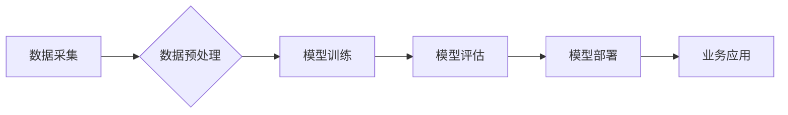

>  人工智能、垂直领域、创业机遇、深度学习、数据驱动

## 1. 背景介绍

人工智能（AI）技术近年来发展迅速，从语音识别、图像识别到自然语言处理等领域取得了突破性进展。这使得AI技术开始渗透到各个行业，为企业带来了新的机遇和挑战。然而，通用型AI解决方案往往难以满足特定行业细分领域的独特需求。因此，专注于垂直领域的AI创业正成为新的趋势。

垂直领域AI创业是指利用AI技术解决特定行业或领域的特定问题，并提供定制化的解决方案。与通用型AI相比，垂直领域AI创业具有以下优势：

* **更精准的解决方案:** 垂直领域AI创业可以深入了解特定行业的业务流程、数据特点和痛点，从而开发更精准、更有效的解决方案。
* **更强的市场竞争力:** 垂直领域AI创业可以专注于特定市场，积累行业经验和客户资源，从而获得更强的市场竞争力。
* **更快的商业化路径:** 垂直领域AI创业可以更快地将解决方案推向市场，并获得商业回报。

## 2. 核心概念与联系

**2.1 垂直领域AI创业的核心概念**

* **垂直领域:** 指特定行业或领域的细分市场，例如医疗、金融、教育、制造等。
* **AI技术:** 指利用机器学习、深度学习等算法，使计算机能够模拟人类智能的行为。
* **定制化解决方案:** 指根据特定行业或领域的具体需求，开发个性化的AI解决方案。

**2.2 垂直领域AI创业的联系**

垂直领域AI创业的核心在于将AI技术与特定行业或领域的业务需求相结合，从而创造新的价值。

**2.3 垂直领域AI创业的架构**



## 3. 核心算法原理 & 具体操作步骤

**3.1 算法原理概述**

深度学习是垂直领域AI创业中常用的算法之一。深度学习是一种基于多层神经网络的机器学习算法，能够学习复杂的数据模式和关系。

**3.2 算法步骤详解**

1. **数据采集:** 收集与目标领域相关的海量数据。
2. **数据预处理:** 对数据进行清洗、转换、特征提取等操作，使其适合深度学习模型的训练。
3. **模型构建:** 选择合适的深度学习模型架构，例如卷积神经网络（CNN）、循环神经网络（RNN）等。
4. **模型训练:** 利用训练数据训练深度学习模型，调整模型参数，使其能够准确地预测或分类目标数据。
5. **模型评估:** 使用测试数据评估模型的性能，例如准确率、召回率、F1-score等。
6. **模型部署:** 将训练好的模型部署到生产环境中，用于实际应用。

**3.3 算法优缺点**

* **优点:** 深度学习算法能够学习复杂的数据模式，具有较高的准确率和泛化能力。
* **缺点:** 深度学习算法需要大量的训练数据和计算资源，训练时间较长。

**3.4 算法应用领域**

深度学习算法广泛应用于垂直领域AI创业，例如：

* **医疗领域:** 疾病诊断、影像分析、药物研发
* **金融领域:** 风险评估、欺诈检测、投资预测
* **教育领域:** 个性化学习、智能辅导、自动批改
* **制造领域:** 质量控制、设备故障预测、生产优化

## 4. 数学模型和公式 & 详细讲解 & 举例说明

**4.1 数学模型构建**

深度学习模型通常采用多层神经网络结构，每个神经元接收多个输入信号，并通过激活函数进行处理，输出一个信号。

**4.2 公式推导过程**

深度学习模型的训练过程基于梯度下降算法，目标是找到最优的模型参数，使得模型的预测结果与真实值之间的误差最小。

**4.3 案例分析与讲解**

例如，在图像分类任务中，深度学习模型可以学习图像特征，并将其映射到不同的类别。

**举例说明:**

假设我们有一个图像分类模型，需要将图像分类为猫和狗两类。模型的输出层有两个神经元，分别对应猫和狗类别。每个神经元的输出值代表该类别预测的概率。

**4.3.1 损失函数:**

常用的损失函数是交叉熵损失函数，用于衡量模型预测结果与真实值的差异。

$$
L = -\sum_{i=1}^{N} y_i \log(p_i)
$$

其中：

* $L$ 是损失函数的值
* $N$ 是样本数量
* $y_i$ 是真实标签
* $p_i$ 是模型预测的概率

**4.3.2 梯度下降算法:**

梯度下降算法用于更新模型参数，使得损失函数的值最小化。

$$
\theta = \theta - \alpha \nabla L(\theta)
$$

其中：

* $\theta$ 是模型参数
* $\alpha$ 是学习率
* $\nabla L(\theta)$ 是损失函数对模型参数的梯度

## 5. 项目实践：代码实例和详细解释说明

**5.1 开发环境搭建**

* Python 3.x
* TensorFlow 或 PyTorch 深度学习框架
* Jupyter Notebook 或 VS Code 开发环境

**5.2 源代码详细实现**

```python
import tensorflow as tf

# 定义模型结构
model = tf.keras.models.Sequential([
    tf.keras.layers.Conv2D(32, (3, 3), activation='relu', input_shape=(28, 28, 1)),
    tf.keras.layers.MaxPooling2D((2, 2)),
    tf.keras.layers.Conv2D(64, (3, 3), activation='relu'),
    tf.keras.layers.MaxPooling2D((2, 2)),
    tf.keras.layers.Flatten(),
    tf.keras.layers.Dense(10, activation='softmax')
])

# 编译模型
model.compile(optimizer='adam',
              loss='sparse_categorical_crossentropy',
              metrics=['accuracy'])

# 训练模型
model.fit(x_train, y_train, epochs=10)

# 评估模型
loss, accuracy = model.evaluate(x_test, y_test)
print('Test loss:', loss)
print('Test accuracy:', accuracy)
```

**5.3 代码解读与分析**

* 代码定义了一个简单的卷积神经网络模型，用于图像分类任务。
* 模型包含两个卷积层、两个最大池化层、一个全连接层和一个输出层。
* 模型使用Adam优化器、交叉熵损失函数和准确率作为评估指标。
* 模型使用训练数据进行训练，并使用测试数据进行评估。

**5.4 运行结果展示**

训练完成后，模型的准确率可以达到较高的水平。

## 6. 实际应用场景

**6.1 医疗领域**

* **疾病诊断:** 利用深度学习算法分析患者的影像数据，辅助医生诊断疾病。
* **影像分析:** 自动识别和分割医学影像中的目标，例如肿瘤、骨折等。
* **药物研发:** 利用深度学习算法分析药物分子结构和生物活性，加速药物研发过程。

**6.2 金融领域**

* **风险评估:** 利用深度学习算法分析客户的信用信息，评估其贷款风险。
* **欺诈检测:** 利用深度学习算法分析交易数据，识别欺诈行为。
* **投资预测:** 利用深度学习算法分析市场数据，预测股票价格走势。

**6.3 教育领域**

* **个性化学习:** 根据学生的学习进度和能力，提供个性化的学习内容和辅导。
* **智能辅导:** 利用深度学习算法模拟老师的辅导，帮助学生解决学习问题。
* **自动批改:** 利用深度学习算法自动批改学生的作业，提高效率。

**6.4 未来应用展望**

随着AI技术的不断发展，垂直领域AI创业将迎来更大的发展机遇。未来，AI技术将更加深入地融入各个行业，为企业和社会带来更多价值。

## 7. 工具和资源推荐

**7.1 学习资源推荐**

* **在线课程:** Coursera、edX、Udacity 等平台提供丰富的AI课程。
* **书籍:** 《深度学习》、《机器学习实战》等书籍。
* **开源项目:** TensorFlow、PyTorch 等开源深度学习框架。

**7.2 开发工具推荐**

* **Python:** 作为AI开发的主要编程语言。
* **Jupyter Notebook:** 用于代码编写、数据分析和可视化。
* **VS Code:** 强大的代码编辑器，支持Python和深度学习框架的开发。

**7.3 相关论文推荐**

* **ImageNet Classification with Deep Convolutional Neural Networks**
* **Attention Is All You Need**
* **BERT: Pre-training of Deep Bidirectional Transformers for Language Understanding**

## 8. 总结：未来发展趋势与挑战

**8.1 研究成果总结**

垂直领域AI创业取得了显著的成果，为各个行业带来了新的机遇和挑战。

**8.2 未来发展趋势**

* **模型更加精准:** 随着数据量的增加和算法的改进，AI模型的预测精度将进一步提高。
* **应用场景更加广泛:** AI技术将应用于更多领域，解决更多实际问题。
* **技术更加成熟:** AI技术的开发和应用将更加成熟，成本也将进一步降低。

**8.3 面临的挑战**

* **数据获取和隐私保护:** 垂直领域AI创业需要大量的数据，如何获取高质量的数据并保护用户隐私是一个挑战。
* **算法解释性和可信度:** 深度学习模型的决策过程往往难以解释，如何提高算法的解释性和可信度是一个重要问题。
* **人才短缺:** 垂直领域AI创业需要大量的人才，而目前AI人才仍然比较稀缺。

**8.4 研究展望**

未来，垂直领域AI创业将继续发展，并面临新的挑战和机遇。我们需要不断探索新的算法、新的应用场景，并解决数据获取、隐私保护、算法解释性等问题，才能推动AI技术更好地服务于社会。

## 9. 附录：常见问题与解答

**9.1 如何获取高质量的数据？**

* 与行业合作伙伴合作，获取行业数据。
* 利用公开数据平台，例如Kaggle、UCI Machine Learning Repository等。
* 使用数据合成技术，生成模拟数据。

**9.2 如何保护用户隐私？**

* 对用户数据进行匿名化处理。
* 使用联邦学习等隐私保护技术。
* 遵守相关数据保护法规。

**9.3 如何提高算法的解释性和可信度？**

* 使用可解释的机器学习模型，例如决策树、线性回归等。
* 使用可视化技术，展示模型的决策过程。
* 进行模型评估和验证，确保模型的准确性和可靠性。


作者：禅与计算机程序设计艺术 / Zen and the Art of Computer Programming 
<end_of_turn>