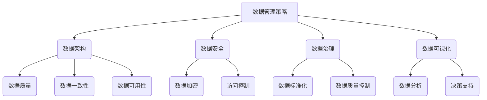

> AI创业, 数据管理, 数据策略, 数据架构, 数据安全, 数据治理, 数据可视化

## 1. 背景介绍

人工智能（AI）技术近年来发展迅速，已渗透到各个行业，并催生了一批新的创业公司。然而，AI创业面临着诸多挑战，其中数据管理是至关重要的环节。数据是AI算法训练和运行的基础，高质量的数据能够提升AI模型的准确性和效率，而数据管理不善则会导致模型性能下降、决策失误甚至安全风险。

随着AI技术的普及，数据量呈指数级增长，数据管理的复杂性也随之增加。AI创业公司需要制定有效的策略，建立健全的数据管理体系，才能充分利用数据资源，实现可持续发展。

## 2. 核心概念与联系

**2.1 数据管理策略**

数据管理策略是指企业在收集、存储、处理、分析和共享数据时遵循的一系列原则和流程。它涵盖了数据质量、数据安全、数据隐私、数据治理等多个方面。

**2.2 数据架构**

数据架构是指企业数据系统的设计和组织方式，包括数据模型、数据存储、数据传输和数据访问等。合理的架构能够确保数据的一致性、完整性和可用性。

**2.3 数据安全**

数据安全是指保护数据免受未经授权的访问、使用、修改或破坏。AI创业公司需要采取措施防止数据泄露、数据篡改和数据攻击。

**2.4 数据治理**

数据治理是指企业对数据进行管理和控制的一系列流程和制度。它包括数据标准化、数据质量控制、数据安全管理和数据隐私保护等。

**2.5 数据可视化**

数据可视化是指将数据以图形、图表等形式呈现出来，以便于理解和分析。数据可视化能够帮助AI创业公司发现数据中的趋势和模式，并做出更明智的决策。

**数据管理策略与核心概念的联系**



## 3. 核心算法原理 & 具体操作步骤

**3.1 算法原理概述**

数据管理的核心算法包括数据清洗、数据转换、数据整合、数据建模等。这些算法利用数学和统计方法，对数据进行处理和分析，以提高数据质量和可利用性。

**3.2 算法步骤详解**

**数据清洗:**

1. 识别缺失值、重复值、错误值等数据质量问题。
2. 使用适当的算法填充缺失值、删除重复值、修正错误值。

**数据转换:**

1. 将数据从一种格式转换为另一种格式，例如将文本数据转换为数字数据。
2. 使用数据转换规则将数据进行标准化、规范化等处理。

**数据整合:**

1. 从多个数据源中提取数据，并将其整合到一个统一的数据仓库中。
2. 使用数据匹配算法识别和合并重复数据。

**数据建模:**

1. 根据业务需求，构建数据模型，定义数据结构和关系。
2. 使用数据挖掘和机器学习算法，从数据中发现模式和趋势。

**3.3 算法优缺点**

**优点:**

* 提高数据质量和可利用性。
* 促进数据分析和决策支持。
* 降低数据管理成本。

**缺点:**

* 算法复杂度高，需要专业知识和技术支持。
* 数据清洗和转换过程可能耗时费力。
* 数据整合和建模需要对业务需求有深入了解。

**3.4 算法应用领域**

数据管理算法广泛应用于各个行业，例如：

* 金融行业：用于风险管理、欺诈检测、客户画像等。
* 医疗行业：用于疾病诊断、药物研发、患者管理等。
* 电商行业：用于商品推荐、用户行为分析、库存管理等。

## 4. 数学模型和公式 & 详细讲解 & 举例说明

**4.1 数学模型构建**

数据管理的数学模型通常基于概率论、统计学和信息论等理论。例如，数据清洗算法可以使用贝叶斯定理来判断数据是否缺失或错误。

**4.2 公式推导过程**

假设我们有一个数据集D，包含n个样本，每个样本包含m个特征。我们想要预测样本的类别y，可以使用逻辑回归模型。逻辑回归模型的输出是一个概率值，表示样本属于某个类别的概率。

逻辑回归模型的公式如下：

$$
p(y=1|x) = \frac{1}{1 + e^{-(w^T x + b)}}
$$

其中：

* $p(y=1|x)$ 是样本x属于类别1的概率。
* $w$ 是模型的参数向量。
* $x$ 是样本的特征向量。
* $b$ 是模型的偏置项。

**4.3 案例分析与讲解**

假设我们有一个数据集，包含学生的成绩和学习时间，我们想要预测学生的考试成绩。我们可以使用逻辑回归模型，将学习时间作为特征，将考试成绩作为标签。通过训练模型，我们可以得到模型的参数w和b，然后使用这些参数预测新的学生的考试成绩。

## 5. 项目实践：代码实例和详细解释说明

**5.1 开发环境搭建**

* Python 3.x
* Jupyter Notebook
* scikit-learn

**5.2 源代码详细实现**

```python
from sklearn.linear_model import LogisticRegression
from sklearn.model_selection import train_test_split
from sklearn.metrics import accuracy_score

# 加载数据
data = ...

# 将数据分为特征和标签
X = data[:, :-1]
y = data[:, -1]

# 将数据分为训练集和测试集
X_train, X_test, y_train, y_test = train_test_split(X, y, test_size=0.2)

# 创建逻辑回归模型
model = LogisticRegression()

# 训练模型
model.fit(X_train, y_train)

# 预测测试集的标签
y_pred = model.predict(X_test)

# 计算模型的准确率
accuracy = accuracy_score(y_test, y_pred)
print(f"模型准确率: {accuracy}")
```

**5.3 代码解读与分析**

* 首先，我们加载数据并将其分为特征和标签。
* 然后，我们将数据分为训练集和测试集，用于训练和评估模型。
* 接下来，我们创建逻辑回归模型并训练模型。
* 最后，我们使用训练好的模型预测测试集的标签，并计算模型的准确率。

**5.4 运行结果展示**

运行代码后，会输出模型的准确率。

## 6. 实际应用场景

**6.1 数据清洗**

* 银行：清洗客户数据，去除重复客户、错误客户信息。
* 电商：清洗商品数据，去除重复商品、错误商品信息。

**6.2 数据转换**

* 金融：将不同格式的财务数据转换为统一格式。
* 医疗：将医学影像数据转换为数字格式。

**6.3 数据整合**

* 医疗：整合患者的电子病历、实验室报告、影像报告等数据。
* 电商：整合用户购买记录、浏览记录、评价记录等数据。

**6.4 未来应用展望**

随着AI技术的不断发展，数据管理将更加智能化、自动化。例如，可以使用机器学习算法自动识别和处理数据质量问题，可以使用数据可视化工具更直观地展示数据趋势和模式。

## 7. 工具和资源推荐

**7.1 学习资源推荐**

* 书籍：《数据科学实战》、《数据挖掘与机器学习》
* 在线课程：Coursera、edX、Udacity

**7.2 开发工具推荐**

* Python：数据分析和机器学习的常用语言。
* Spark：大数据处理框架。
* Hadoop：分布式存储和处理框架。

**7.3 相关论文推荐**

* 《数据质量管理：概念、方法和挑战》
* 《数据治理：原则、实践和案例》

## 8. 总结：未来发展趋势与挑战

**8.1 研究成果总结**

数据管理在AI创业中至关重要，有效的策略和技术能够帮助企业充分利用数据资源，实现可持续发展。

**8.2 未来发展趋势**

* 数据管理将更加智能化、自动化。
* 数据安全和隐私保护将更加重要。
* 数据可视化将更加直观、交互式。

**8.3 面临的挑战**

* 数据量和复杂度不断增加。
* 数据安全和隐私保护面临新的挑战。
* 数据管理人才短缺。

**8.4 研究展望**

未来，需要进一步研究数据管理的智能化、自动化和安全性的技术，并培养更多的数据管理人才。

## 9. 附录：常见问题与解答

**9.1 如何选择合适的数据库？**

选择数据库需要考虑数据量、数据类型、访问频率等因素。

**9.2 如何保证数据安全？**

数据安全需要采取多种措施，例如数据加密、访问控制、数据备份等。

**9.3 如何提高数据质量？**

提高数据质量需要进行数据清洗、数据转换、数据整合等操作。


作者：禅与计算机程序设计艺术 / Zen and the Art of Computer Programming 
<end_of_turn>