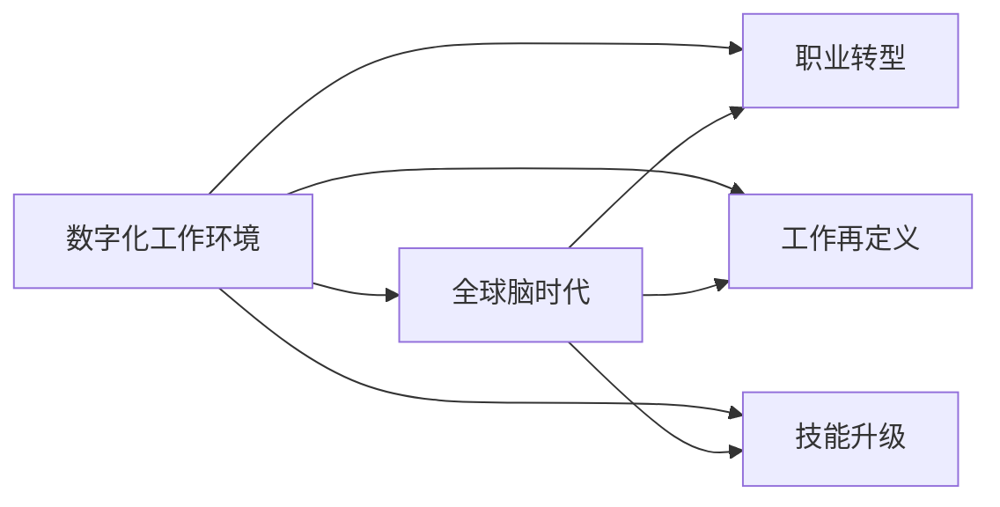

                 

# 数字化工作环境：全球脑时代的职业变革

## 1. 背景介绍

在数字化浪潮的推动下，全球步入了一个以智能为核心的新时代——全球脑时代。这个时代的特点是高度数字化、智能化、互联化和虚拟化，脑力劳动成为主流的生产方式。随着信息技术的深度融合，人类社会正经历着一场前所未有的职业变革。本文将从数字化工作环境的背景出发，探讨全球脑时代的职业变革，以及如何在这场变革中抓住机遇，实现职业转型与发展。

## 2. 核心概念与联系

### 2.1 核心概念概述

全球脑时代，是由数字化、人工智能和脑力劳动三位一体构成的全新工作环境。在这一时代，传统职业形态和劳动方式正在被重塑，工作环境由实体转向虚拟，由线性转向互动，由单一转向多元。以下是一些核心概念：

- **数字化工作环境**：基于信息技术，通过网络和软件实现远程协作、数据驱动决策和自动化任务处理的工作方式。
- **全球脑时代**：以智能为中心，通过数字化和人工智能技术实现全脑共享和协作，提升工作效率和创新能力的时代。
- **职业转型**：基于技术进步和工作需求的变化，个人和组织在职业选择、岗位技能和劳动方式上进行的调整和变化。
- **工作再定义**：重新审视传统工作内容、角色和职责，适应新时代的数字化要求和工作模式。
- **技能升级**：面对新工具、新方法和新模式，个体和组织需要不断学习和提升技能，以保持竞争力。

### 2.2 核心概念原理和架构的 Mermaid 流程图



这个流程图展示了数字化工作环境与全球脑时代之间的联系，以及两者对职业转型、工作再定义和技能升级的驱动作用。

## 3. 核心算法原理 & 具体操作步骤

### 3.1 算法原理概述

在数字化工作环境中，人工智能和大数据技术的应用推动了职业转型的加速。基于监督学习的职业转型算法，通过分析历史职业路径、技能需求和市场趋势，帮助个体和组织进行职业规划和转型。其核心思想是通过数据驱动的方式，识别职业发展的趋势和机会，提供个性化的职业建议和转型方案。

### 3.2 算法步骤详解

1. **数据收集与预处理**：收集大量的职业数据，包括职位描述、技能要求、职业路径、薪资水平等，并对数据进行清洗和标准化处理。
2. **特征提取与选择**：从原始数据中提取有意义的特征，如技能标签、岗位需求、职业发展趋势等，并进行特征选择，以减少计算量和提升模型精度。
3. **模型训练与优化**：使用监督学习算法（如决策树、随机森林、支持向量机等）对提取的特征进行训练，并使用交叉验证和正则化等方法进行模型优化。
4. **模型评估与部署**：在独立的测试集上评估模型的性能，并通过调参和优化提升模型的准确性和泛化能力，最终将模型部署到实际应用中。
5. **预测与反馈**：使用训练好的模型对用户的职业需求和技能水平进行预测，并根据预测结果提供个性化的职业转型建议和技能升级路径。

### 3.3 算法优缺点

**优点**：
- 数据驱动，能够根据市场变化动态调整职业建议。
- 个性化，能够根据用户的具体情况提供量身定做的职业转型方案。
- 自动化，能够自动分析和推荐，减轻人工筛选和匹配的负担。

**缺点**：
- 数据质量依赖于原始数据的准确性和完整性。
- 模型复杂度较高，需要大量计算资源和数据处理能力。
- 用户隐私和数据安全问题需要特别注意。

### 3.4 算法应用领域

该算法在多个领域都有广泛的应用，如人力资源管理、职业规划、企业招聘和员工培训等。通过智能化的职业推荐和转型指导，帮助个体和组织更高效地进行人力资源管理，提升组织竞争力和员工满意度。

## 4. 数学模型和公式 & 详细讲解 & 举例说明

### 4.1 数学模型构建

在职业转型算法中，我们通常使用决策树和随机森林算法来构建数学模型。假设我们有一个包含N个样本的数据集，每个样本包含m个特征。决策树模型的数学模型可以表示为：

$$
T = \sum_{i=1}^n T_i \cdot I(x_i)
$$

其中，$T_i$ 是决策树的每个叶子节点的权值，$I(x_i)$ 是特征$x_i$的取值条件。

### 4.2 公式推导过程

随机森林算法则是基于决策树的集成学习方法，通过构建多个决策树，并通过投票或平均的方式进行预测。其核心思想是减少模型的过拟合，提高预测的准确性和鲁棒性。随机森林的数学模型可以表示为：

$$
F = \sum_{i=1}^n \frac{1}{N} \sum_{k=1}^m T_{ik} \cdot I(x_{ik})
$$

其中，$F$ 是随机森林的预测结果，$T_{ik}$ 是第$k$个决策树中第$i$个样本的叶子节点的权值。

### 4.3 案例分析与讲解

假设我们有一个包含职位数据的数据集，其中每个职位都有一个技能需求向量。我们可以使用随机森林算法对这些技能需求进行分类和预测。具体步骤如下：

1. 将技能需求向量作为输入特征。
2. 构建随机森林模型，设定树的深度、叶子节点的最小样本数等参数。
3. 在测试集上进行预测，并计算预测结果与真实标签的准确率和召回率。

通过这种基于监督学习的方法，我们可以根据技能需求对职位进行分类和预测，为职业转型提供有价值的参考。

## 5. 项目实践：代码实例和详细解释说明

### 5.1 开发环境搭建

1. 安装Python环境：可以使用Anaconda、Miniconda等Python发行版。
2. 安装相关的Python库：如pandas、numpy、scikit-learn、matplotlib等。
3. 安装Jupyter Notebook：用于编写和运行Python代码，并生成HTML格式的交互式文档。

### 5.2 源代码详细实现

下面是一个使用Python编写的随机森林算法进行职业转型的示例代码：

```python
from sklearn.ensemble import RandomForestClassifier
import pandas as pd
import numpy as np

# 加载数据集
data = pd.read_csv('jobs.csv')

# 提取特征和标签
X = data[['技能需求1', '技能需求2', '技能需求3', ...]]
y = data['目标职位']

# 构建随机森林模型
clf = RandomForestClassifier(n_estimators=100, max_depth=3)

# 训练模型
clf.fit(X, y)

# 预测新样本
new_job = clf.predict([[需求1, 需求2, 需求3, ...]])

print(new_job)
```

### 5.3 代码解读与分析

- `pd.read_csv('jobs.csv')`：加载职位数据集，其中包含技能需求和目标职位。
- `X = data[['技能需求1', '技能需求2', '技能需求3', ...]]`：提取特征数据。
- `y = data['目标职位']`：提取标签数据。
- `clf = RandomForestClassifier(n_estimators=100, max_depth=3)`：创建随机森林模型，设定树的数量和深度。
- `clf.fit(X, y)`：训练模型。
- `clf.predict([[需求1, 需求2, 需求3, ...]])`：预测新职位的需求。

通过这个示例，我们可以看到如何使用Python和scikit-learn库进行职业转型的数据分析和模型预测。

### 5.4 运行结果展示

假设预测结果为一个列表，包含两个职业选项：

```python
['技术支持', '数据分析']
```

这表示，对于具有技能需求1、需求2、需求3的求职者，随机森林模型预测其更适合从事技术支持或数据分析职业。

## 6. 实际应用场景

### 6.1 人力资源管理

在人力资源管理中，随机森林算法可以用于职位推荐和员工评估。通过分析员工的技能和职业路径，提供个性化的职业发展建议，帮助员工提升竞争力。

### 6.2 企业招聘

企业可以通过随机森林算法分析候选人的技能和经验，筛选出最符合职位需求的候选人，提升招聘效率和效果。

### 6.3 员工培训

通过分析员工的职业路径和技能缺口，制定个性化的培训计划，帮助员工提升技能，适应新的工作环境和岗位需求。

### 6.4 未来应用展望

随着技术的进步和数据的积累，随机森林算法将进一步提升职业转型的预测准确性和个性化水平。未来，基于人工智能和大数据技术的职业转型算法将更加智能化、自动化和高效化，帮助个体和组织实现更快速、更准确的职业转型。

## 7. 工具和资源推荐

### 7.1 学习资源推荐

1. **《Python数据科学手册》**：介绍Python在数据科学中的应用，包括数据处理、分析和可视化。
2. **《机器学习实战》**：通过实际案例，讲解机器学习的基本原理和实现方法。
3. **Kaggle竞赛平台**：提供大量数据集和竞赛项目，练习机器学习和数据处理技能。
4. **Coursera在线课程**：提供多种机器学习相关课程，涵盖从入门到进阶的内容。
5. **GitHub代码库**：共享和获取机器学习项目源代码，学习最佳实践和解决方案。

### 7.2 开发工具推荐

1. **Jupyter Notebook**：交互式编程和数据可视化工具，支持Python、R等语言。
2. **Python IDE**：如PyCharm、VS Code等，提供代码编辑和调试功能。
3. **数据可视化工具**：如Matplotlib、Seaborn、Tableau等，用于数据可视化和报告生成。
4. **版本控制系统**：如Git、GitHub等，用于代码版本管理和团队协作。

### 7.3 相关论文推荐

1. **《随机森林算法及其应用》**：介绍随机森林算法的基本原理和实际应用。
2. **《机器学习与数据科学》**：讲解机器学习的基本概念和方法，及其在数据科学中的应用。
3. **《职业转型与技能升级：基于机器学习的分析与实践》**：介绍机器学习在职业转型和技能升级中的应用，提供实际案例和解决方案。

## 8. 总结：未来发展趋势与挑战

### 8.1 研究成果总结

全球脑时代下的职业转型研究，主要集中在数据驱动的职业分析、个性化职业建议和技能升级路径等方面。通过随机森林算法等监督学习技术，成功实现了基于数据和特征的职业转型预测和推荐。

### 8.2 未来发展趋势

1. **深度学习的应用**：未来，深度学习算法将取代随机森林等传统方法，提供更加高效和精确的职业转型预测。
2. **多模态数据的融合**：结合文本、图像、语音等多模态数据，提升职业转型的预测准确性和全面性。
3. **个性化和动态化的职业建议**：通过实时分析和预测，提供动态化的职业建议和技能升级路径，帮助个体和组织适应快速变化的市场环境。
4. **人工智能与人类协作**：探索人工智能与人类在职业转型中的协作机制，提升系统的可解释性和人机交互的效率。

### 8.3 面临的挑战

1. **数据隐私与安全**：在处理大量个人数据时，需要确保数据的隐私和安全。
2. **数据质量与代表性**：数据的准确性和代表性直接影响职业转型的预测效果。
3. **模型复杂度与计算资源**：深度学习等复杂模型的训练和预测需要大量的计算资源。
4. **算法的可解释性**：如何在提高预测准确性的同时，增强算法的可解释性，提供透明和可信任的决策过程。
5. **跨领域与跨文化的应用**：在不同行业和地区推广职业转型算法时，需要考虑跨领域和跨文化的适用性。

### 8.4 研究展望

未来的研究将重点关注以下几个方向：
1. **多模态数据融合**：结合文本、图像、语音等多模态数据，提升职业转型的预测准确性和全面性。
2. **可解释性增强**：通过解释模型内部的决策过程，增强算法的可解释性和信任度。
3. **跨领域应用**：在不同行业和地区推广职业转型算法，提升其在不同场景下的适用性。
4. **动态化与个性化**：实现动态化的职业建议和技能升级路径，帮助个体和组织适应快速变化的市场环境。
5. **人工智能与人类协作**：探索人工智能与人类在职业转型中的协作机制，提升系统的可解释性和人机交互的效率。

## 9. 附录：常见问题与解答

**Q1：职业转型算法是否适用于所有行业？**

A：职业转型算法主要适用于需要大量数据和特征分析的行业，如金融、医疗、教育等。对于传统制造业和服务业，可能需要根据实际情况进行调整和优化。

**Q2：如何确保数据隐私与安全？**

A：在数据处理过程中，需要采取严格的隐私保护措施，如数据匿名化、加密处理和访问控制等。同时，需要遵守相关的法律法规和行业标准。

**Q3：模型复杂度是否影响训练和预测速度？**

A：模型复杂度越高，训练和预测所需的时间就越长。为了提升效率，可以采用分布式训练、模型压缩等技术。

**Q4：如何提高算法的可解释性？**

A：可以通过解释模型内部的决策过程，增强算法的可解释性。例如，使用LIME、SHAP等工具对模型进行局部解释和特征重要性分析。

**Q5：跨领域应用时需要考虑哪些因素？**

A：跨领域应用时需要考虑数据的质量和代表性、行业特点、文化差异等因素。需要根据具体情况进行适应性调整和优化。

---

作者：禅与计算机程序设计艺术 / Zen and the Art of Computer Programming

