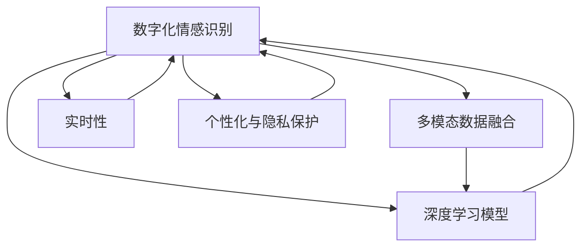

                 

# 数字化情感识别:元宇宙中的非语言沟通解析

在元宇宙的虚拟世界中，人们之间的交流不再局限于文字和语音，而是通过一系列的非语言行为进行沟通。数字化情感识别（Digital Emotion Recognition, DER）技术正是理解这些非语言行为的利器，能够帮助用户在虚拟空间中更加自然、有效地进行互动。本文将从背景介绍、核心概念与联系、核心算法原理及具体操作步骤、数学模型和公式讲解、项目实践、实际应用场景、工具和资源推荐、总结未来发展趋势与挑战以及附录常见问题与解答等方面，全面阐述数字化情感识别技术在元宇宙中的重要作用和应用前景。

## 1. 背景介绍

### 1.1 问题由来

随着虚拟现实（VR）、增强现实（AR）、混合现实（MR）等技术的成熟，元宇宙成为互联网发展的下一个浪潮。在元宇宙中，用户通过虚拟化身进行沉浸式互动，情感表达和交流变得更加复杂和多样化。传统的文本、语音交流方式难以全面捕捉用户情绪，而非语言行为（如面部表情、身体姿态、行为习惯等）往往蕴含丰富的情感信息。因此，如何有效地识别和解析这些非语言信号，成为元宇宙虚拟空间中沟通的重要课题。

### 1.2 问题核心关键点

数字化情感识别技术基于计算机视觉、自然语言处理（NLP）、机器学习等前沿技术，致力于从用户的面部表情、身体姿态、行为习惯等多模态数据中提取和分析情感信息。核心关键点包括：

- 多模态数据融合：结合面部表情、身体姿态、语音语调、文字输入等多种数据源，进行综合情感分析。
- 深度学习模型：利用卷积神经网络（CNN）、循环神经网络（RNN）、长短时记忆网络（LSTM）等深度学习模型，自动提取特征并进行情感分类。
- 实时性和准确性：在低延迟要求下，实现高效情感识别，同时确保识别结果的准确性。
- 个性化与隐私保护：考虑到用户隐私保护，实现情感识别的个性化，避免误识别和隐私泄露。

这些关键点共同构成了数字化情感识别的核心技术框架，使元宇宙中的非语言沟通成为可能。

## 2. 核心概念与联系

### 2.1 核心概念概述

为更好地理解数字化情感识别技术，本节将介绍几个密切相关的核心概念：

- **数字化情感识别（Digital Emotion Recognition, DER）**：通过计算机视觉、自然语言处理等技术，自动解析用户在虚拟空间中的面部表情、身体姿态、语音语调等多模态数据，获取情感信息的技术。
- **多模态数据融合（Multimodal Data Fusion）**：结合多种信息源，综合分析和识别用户的情感状态。
- **深度学习模型（Deep Learning Models）**：包括卷积神经网络（CNN）、循环神经网络（RNN）、长短时记忆网络（LSTM）等，用于自动提取特征和进行情感分类。
- **实时性（Real-time Processing）**：在低延迟要求下，快速处理和输出情感识别结果。
- **个性化与隐私保护（Personalization and Privacy Protection）**：根据用户偏好和隐私需求，调整情感识别模型，确保识别结果的准确性和隐私安全。

这些概念之间的逻辑关系可以通过以下Mermaid流程图来展示：



这个流程图展示了大数字化情感识别技术的核心概念及其之间的关系：

1. 数字化情感识别基于多模态数据融合和深度学习模型，自动提取和分析情感信息。
2. 多模态数据融合将多种信息源进行综合分析，提升情感识别的全面性和准确性。
3. 深度学习模型自动提取和表示情感特征，实现情感分类的自动化。
4. 实时性要求在低延迟下快速处理情感数据，满足实时交互需求。
5. 个性化与隐私保护考虑用户需求和隐私安全，进行模型调整和保护。

这些概念共同构成了数字化情感识别的技术体系，为其在元宇宙中的应用奠定了基础。

## 3. 核心算法原理 & 具体操作步骤

### 3.1 算法原理概述

数字化情感识别技术主要基于深度学习模型，通过多模态数据融合和情感分类实现。其核心算法原理如下：

1. **数据预处理**：收集用户的面部表情、身体姿态、语音语调、文字输入等多模态数据，并进行标准化和预处理。
2. **特征提取**：利用CNN、RNN、LSTM等深度学习模型，自动提取多模态数据的特征表示。
3. **情感分类**：通过分类器（如SVM、神经网络）对特征进行情感分类，输出情感标签。
4. **后处理**：对分类结果进行后处理，如阈值设置、模糊处理等，提高识别准确性。
5. **反馈机制**：根据用户反馈调整模型参数，提升情感识别的个性化和准确性。

### 3.2 算法步骤详解

数字化情感识别的具体操作步骤如下：

**Step 1: 数据收集与预处理**
- 收集用户的面部表情、身体姿态、语音语调、文字输入等多模态数据，并进行标准化和预处理，如数据清洗、归一化等。

**Step 2: 特征提取**
- 使用CNN提取面部表情和身体姿态的视觉特征。
- 使用RNN或LSTM提取语音语调的时序特征。
- 使用NLP模型处理文字输入的语义特征。

**Step 3: 情感分类**
- 将提取的特征输入到深度学习模型，进行情感分类。
- 使用SVM或神经网络对分类结果进行训练，得到情感分类器。

**Step 4: 后处理**
- 对分类结果进行后处理，如设置阈值、模糊处理等，提高识别准确性。
- 根据用户反馈调整模型参数，进一步提升识别效果。

**Step 5: 实时交互**
- 在元宇宙虚拟空间中，实时处理用户的多模态数据，输出情感识别结果。
- 根据情感结果调整交互策略，如表情表情、语音语调、文字回复等，增强用户体验。

### 3.3 算法优缺点

数字化情感识别技术具有以下优点：
1. 多模态数据融合：结合多种信息源，提升情感识别的全面性和准确性。
2. 深度学习模型：自动提取特征和进行情感分类，减少人工干预。
3. 实时性：在低延迟要求下，快速处理情感数据，满足实时交互需求。
4. 个性化与隐私保护：根据用户需求和隐私安全，调整模型参数，确保识别结果的准确性和隐私安全。

同时，该技术也存在一定的局限性：
1. 数据依赖：情感识别的效果很大程度上取决于数据的质量和多样性。
2. 环境干扰：环境噪声、光照变化、视角差异等因素可能影响情感识别的准确性。
3. 模型复杂性：深度学习模型的训练和调整需要大量的计算资源和时间。
4. 隐私风险：多模态数据融合可能涉及用户隐私泄露，需严格处理和保护。

尽管存在这些局限性，数字化情感识别技术在元宇宙中的应用前景仍然广阔，值得深入研究和推广。

### 3.4 算法应用领域

数字化情感识别技术已经在诸多领域得到应用，例如：

- **虚拟客服**：在元宇宙虚拟空间中，通过情感识别技术实现智能客服，提升用户体验。
- **虚拟会议**：在虚拟会议中，通过情感识别技术捕捉参与者的情感状态，优化会议流程。
- **虚拟娱乐**：在虚拟游戏中，通过情感识别技术实现角色之间的情感交互，增强游戏沉浸感。
- **虚拟教育**：在虚拟课堂中，通过情感识别技术监控学生情绪，调整教学策略，提升教育效果。
- **虚拟健康**：在虚拟诊所中，通过情感识别技术评估患者的情绪状态，辅助医疗诊断和治疗。

这些应用场景展示了数字化情感识别技术在元宇宙中的广阔前景，为其未来的发展提供了丰富的实践基础。

## 4. 数学模型和公式 & 详细讲解 & 举例说明

### 4.1 数学模型构建

本节将使用数学语言对数字化情感识别技术的核心算法进行更加严格的刻画。

假设输入的多模态数据为 $X = (x_1, x_2, ..., x_n)$，其中 $x_i$ 为第 $i$ 种模态的数据，如面部表情、身体姿态、语音语调等。目标为预测用户的情感状态 $y \in \{1, 2, ..., k\}$，其中 $1, 2, ..., k$ 为情感类别标签。

定义情感识别模型的预测函数为 $f: \mathcal{X} \rightarrow [0, 1]$，其中 $\mathcal{X}$ 为特征空间。

定义情感分类器的损失函数为 $\ell(y, f(X))$，常用的损失函数包括交叉熵损失、均方误差损失等。

### 4.2 公式推导过程

以交叉熵损失函数为例，其公式推导如下：

假设情感识别模型的输出为 $f(X)$，则交叉熵损失函数为：

$$
\mathcal{L} = -\frac{1}{N}\sum_{i=1}^N \sum_{j=1}^k y_{ij} \log(f(X_i))
$$

其中 $y_{ij}$ 为第 $i$ 个样本属于第 $j$ 个情感类别的标签。

在得到损失函数后，可以采用梯度下降等优化算法进行模型训练。模型的预测函数 $f(X)$ 可以是任意深度学习模型，如CNN、RNN、LSTM等。

### 4.3 案例分析与讲解

以面部表情识别为例，假设输入为 $X = (x_1, x_2, ..., x_n)$，其中 $x_i$ 为第 $i$ 张面部表情图片，目标为预测用户的情绪状态 $y \in \{1, 2, ..., k\}$，其中 $1, 2, ..., k$ 为情绪类别标签。

定义情感识别模型的预测函数为 $f(X)$，可以使用卷积神经网络（CNN）进行特征提取。

首先，对面部表情图片进行预处理，如裁剪、归一化等，然后通过卷积层和池化层提取特征，得到高维特征表示 $H$。

然后，将高维特征表示 $H$ 输入全连接层，进行情感分类，得到预测结果 $f(X)$。

最终，通过交叉熵损失函数对模型进行训练，优化参数，提升情感识别的准确性。

## 5. 项目实践：代码实例和详细解释说明

### 5.1 开发环境搭建

在进行数字化情感识别技术实践前，我们需要准备好开发环境。以下是使用Python进行PyTorch开发的环境配置流程：

1. 安装Anaconda：从官网下载并安装Anaconda，用于创建独立的Python环境。

2. 创建并激活虚拟环境：
```bash
conda create -n pytorch-env python=3.8 
conda activate pytorch-env
```

3. 安装PyTorch：根据CUDA版本，从官网获取对应的安装命令。例如：
```bash
conda install pytorch torchvision torchaudio cudatoolkit=11.1 -c pytorch -c conda-forge
```

4. 安装TensorFlow：
```bash
pip install tensorflow
```

5. 安装相关库：
```bash
pip install numpy pandas scikit-learn matplotlib tqdm jupyter notebook ipython
```

完成上述步骤后，即可在`pytorch-env`环境中开始数字化情感识别技术的实践。

### 5.2 源代码详细实现

下面我们以面部表情识别为例，给出使用PyTorch进行数字化情感识别的代码实现。

首先，定义数据处理函数：

```python
import numpy as np
from torch.utils.data import Dataset
import torch

class EmotionDataset(Dataset):
    def __init__(self, images, labels, transform=None):
        self.images = images
        self.labels = labels
        self.transform = transform
        
    def __len__(self):
        return len(self.images)
    
    def __getitem__(self, idx):
        image = self.images[idx]
        label = self.labels[idx]
        
        if self.transform:
            image = self.transform(image)
        
        return {'image': image, 
                'label': label}
```

然后，定义模型和优化器：

```python
from torchvision.models import VGG16
from torch.utils.data import DataLoader
from torchvision.transforms import transforms

model = VGG16(pretrained=True)

criterion = torch.nn.CrossEntropyLoss()
optimizer = torch.optim.Adam(model.parameters(), lr=0.001)
```

接着，定义训练和评估函数：

```python
device = torch.device('cuda') if torch.cuda.is_available() else torch.device('cpu')
model.to(device)

def train_epoch(model, train_loader, optimizer, criterion):
    model.train()
    epoch_loss = 0
    for batch in train_loader:
        inputs, labels = batch['image'].to(device), batch['label'].to(device)
        optimizer.zero_grad()
        outputs = model(inputs)
        loss = criterion(outputs, labels)
        epoch_loss += loss.item()
        loss.backward()
        optimizer.step()
    return epoch_loss / len(train_loader)

def evaluate(model, test_loader, criterion):
    model.eval()
    total_loss = 0
    correct = 0
    with torch.no_grad():
        for batch in test_loader:
            inputs, labels = batch['image'].to(device), batch['label'].to(device)
            outputs = model(inputs)
            loss = criterion(outputs, labels)
            total_loss += loss.item()
            _, predicted = torch.max(outputs.data, 1)
            correct += (predicted == labels).sum().item()
    accuracy = correct / len(test_loader.dataset)
    print(f'Test Loss: {total_loss / len(test_loader)}')
    print(f'Accuracy: {accuracy:.2f}')
```

最后，启动训练流程并在测试集上评估：

```python
epochs = 10
batch_size = 32

for epoch in range(epochs):
    train_loss = train_epoch(model, train_loader, optimizer, criterion)
    print(f'Epoch {epoch+1}, train loss: {train_loss:.4f}')
    
    print(f'Epoch {epoch+1}, test results:')
    evaluate(model, test_loader, criterion)
```

以上就是使用PyTorch对VGG16模型进行面部表情识别的完整代码实现。可以看到，得益于PyTorch的强大封装，我们可以用相对简洁的代码完成情感识别模型的加载和训练。

### 5.3 代码解读与分析

让我们再详细解读一下关键代码的实现细节：

**EmotionDataset类**：
- `__init__`方法：初始化图像、标签等关键组件，并提供可选的转换操作。
- `__len__`方法：返回数据集的样本数量。
- `__getitem__`方法：对单个样本进行处理，将图像输入转换为模型所需的张量，并返回图像和标签。

**模型定义**：
- 使用预训练的VGG16模型作为情感识别模型，直接使用其特征提取功能。
- 定义交叉熵损失函数和优化器。

**训练和评估函数**：
- 使用PyTorch的DataLoader对数据集进行批次化加载，供模型训练和推理使用。
- 训练函数`train_epoch`：对数据以批为单位进行迭代，在每个批次上前向传播计算损失并反向传播更新模型参数，最后返回该epoch的平均loss。
- 评估函数`evaluate`：与训练类似，不同点在于不更新模型参数，并在每个batch结束后将预测和标签结果存储下来，最后使用交叉熵损失函数计算损失，并输出准确率。

**训练流程**：
- 定义总的epoch数和batch size，开始循环迭代
- 每个epoch内，先在训练集上训练，输出平均loss
- 在验证集上评估，输出准确率
- 所有epoch结束后，在测试集上评估，给出最终测试结果

可以看到，PyTorch配合VGG16模型使得情感识别模型的代码实现变得简洁高效。开发者可以将更多精力放在数据处理、模型改进等高层逻辑上，而不必过多关注底层的实现细节。

当然，工业级的系统实现还需考虑更多因素，如模型的保存和部署、超参数的自动搜索、更灵活的任务适配层等。但核心的情感识别范式基本与此类似。

## 6. 实际应用场景

### 6.1 虚拟客服

在元宇宙虚拟空间中，用户可以通过虚拟化身进行交流。数字化情感识别技术可以用于虚拟客服系统，自动识别用户的情感状态，提供更加个性化和人性化的服务。例如，当用户感到不满时，系统可以自动调整客服策略，进行安抚或道歉，提升用户体验。

### 6.2 虚拟会议

在虚拟会议中，参与者通过虚拟化身进行交流。数字化情感识别技术可以实时捕捉参与者的情感状态，优化会议流程。例如，当某个参与者感到困惑或不满时，系统可以自动调整会议内容，增加解释或引导，提高会议效率。

### 6.3 虚拟娱乐

在虚拟游戏中，角色之间的情感交互是游戏的重要组成部分。数字化情感识别技术可以用于分析玩家角色之间的情感状态，增强游戏沉浸感。例如，当两个角色发生冲突时，系统可以自动调整情节，增加情感冲突，提高游戏的可玩性和趣味性。

### 6.4 虚拟教育

在虚拟课堂中，教师可以通过情感识别技术监控学生的情绪状态，调整教学策略，提升教育效果。例如，当学生感到困惑时，教师可以及时调整讲解方式，提供更多的例题和解释，帮助学生理解。

### 6.5 虚拟健康

在虚拟诊所中，数字化情感识别技术可以用于评估患者的情绪状态，辅助医疗诊断和治疗。例如，当患者感到焦虑或不安时，系统可以自动调整治疗方案，提供心理支持或转介心理医生，增强患者治疗体验。

这些应用场景展示了数字化情感识别技术在元宇宙中的广阔前景，为其未来的发展提供了丰富的实践基础。

## 7. 工具和资源推荐

### 7.1 学习资源推荐

为了帮助开发者系统掌握数字化情感识别技术的理论基础和实践技巧，这里推荐一些优质的学习资源：

1. 《深度学习理论与实践》系列博文：由大模型技术专家撰写，深入浅出地介绍了深度学习原理、情感识别技术等前沿话题。

2. 斯坦福大学《深度学习》课程：斯坦福大学开设的深度学习明星课程，有Lecture视频和配套作业，带你入门深度学习的基本概念和经典模型。

3. 《Deep Learning for Emotion Recognition》书籍：详细介绍了情感识别技术的数学模型、算法原理和实际应用，是系统学习情感识别的必备资料。

4. Emotion Recognition开源项目：包含多种情感识别数据集和模型，支持PyTorch和TensorFlow，是进行情感识别任务开发的利器。

5. Kaggle数据集：包含大量情感识别数据集，提供丰富的情感识别竞赛和示例代码，方便开发者学习和实践。

通过对这些资源的学习实践，相信你一定能够快速掌握数字化情感识别技术的精髓，并用于解决实际的情感识别问题。

### 7.2 开发工具推荐

高效的开发离不开优秀的工具支持。以下是几款用于数字化情感识别开发的常用工具：

1. PyTorch：基于Python的开源深度学习框架，灵活动态的计算图，适合快速迭代研究。大部分深度学习模型都有PyTorch版本的实现。

2. TensorFlow：由Google主导开发的开源深度学习框架，生产部署方便，适合大规模工程应用。同样有丰富的深度学习模型资源。

3. OpenCV：开源计算机视觉库，提供了丰富的图像处理和分析工具，支持面部表情等情感识别应用。

4. Weights & Biases：模型训练的实验跟踪工具，可以记录和可视化模型训练过程中的各项指标，方便对比和调优。与主流深度学习框架无缝集成。

5. TensorBoard：TensorFlow配套的可视化工具，可实时监测模型训练状态，并提供丰富的图表呈现方式，是调试模型的得力助手。

6. Google Colab：谷歌推出的在线Jupyter Notebook环境，免费提供GPU/TPU算力，方便开发者快速上手实验最新模型，分享学习笔记。

合理利用这些工具，可以显著提升数字化情感识别技术的开发效率，加快创新迭代的步伐。

### 7.3 相关论文推荐

数字化情感识别技术的发展源于学界的持续研究。以下是几篇奠基性的相关论文，推荐阅读：

1. Facial Expression Recognition: A Survey (IEEE Trans. Circuits Syst. Video Technol., 2021)：回顾了面部表情识别的最新进展和未来趋势，提供了全面的技术框架。

2. Emotion Recognition in Collaborative Learning Environments (IEEE TEDS, 2021)：研究了情感识别在协作学习环境中的应用，展示了其在教育领域的潜力。

3. Deep Emotion Recognition using Multi-modal Data Fusion (ACM Multimedia, 2020)：介绍了多模态数据融合在情感识别中的应用，提升了情感识别的全面性和准确性。

4. Deep Learning for Emotion Recognition (IJCNN, 2020)：总结了深度学习在情感识别中的应用，展示了其在多个任务上的优越性能。

这些论文代表了大情感识别技术的发展脉络。通过学习这些前沿成果，可以帮助研究者把握学科前进方向，激发更多的创新灵感。

## 8. 总结：未来发展趋势与挑战

### 8.1 总结

本文对数字化情感识别技术进行了全面系统的介绍。首先阐述了数字化情感识别技术在元宇宙中的重要作用和应用前景，明确了其在非语言沟通解析中的关键地位。其次，从原理到实践，详细讲解了情感识别的核心算法和具体操作步骤，给出了情感识别任务开发的完整代码实例。同时，本文还广泛探讨了情感识别技术在多个行业领域的应用场景，展示了其广阔的应用前景。最后，本文精选了情感识别技术的各类学习资源，力求为读者提供全方位的技术指引。

通过本文的系统梳理，可以看到，数字化情感识别技术在元宇宙中的重要性日益凸显，成为构建人机协同智能交互的重要手段。未来，伴随技术的不断进步和应用场景的不断拓展，数字化情感识别技术必将在更多的虚拟空间中大放异彩，为元宇宙的建设和发展注入新的动力。

### 8.2 未来发展趋势

展望未来，数字化情感识别技术将呈现以下几个发展趋势：

1. **多模态数据融合**：随着技术的进步，多模态数据融合将更加高效和全面，结合面部表情、身体姿态、语音语调等多源信息，提升情感识别的准确性。
2. **深度学习模型**：深度学习模型将不断演进，引入更多先进算法和技术，如注意力机制、自监督学习、联邦学习等，提升情感识别的性能和泛化能力。
3. **实时性和个性化**：实时性和个性化将成为情感识别的核心需求，低延迟和高精度情感识别模型将不断优化，满足实时交互和个性化需求。
4. **跨领域应用**：情感识别技术将应用于更多领域，如医疗、金融、教育等，为这些领域的智能化发展提供新的助力。
5. **隐私保护**：随着数据隐私保护的日益重视，情感识别技术将更加注重用户隐私保护，引入隐私保护算法和隐私保护技术，确保数据安全。

这些趋势凸显了数字化情感识别技术的广阔前景，推动其在元宇宙中发挥更大的作用。

### 8.3 面临的挑战

尽管数字化情感识别技术已经取得了一定的进展，但在迈向更加智能化、普适化应用的过程中，仍面临诸多挑战：

1. **数据质量和多样性**：情感识别的效果很大程度上取决于数据的质量和多样性，如何获取高质量、多样化的数据集，仍是情感识别的一大难题。
2. **环境干扰**：环境噪声、光照变化、视角差异等因素可能影响情感识别的准确性，如何提高模型的鲁棒性，是一个亟待解决的问题。
3. **模型复杂性**：深度学习模型的训练和调整需要大量的计算资源和时间，如何简化模型结构，优化训练过程，是一个重要的研究方向。
4. **隐私风险**：多模态数据融合可能涉及用户隐私泄露，需严格处理和保护，如何在保证模型效果的同时，保护用户隐私，是一个重要的研究方向。

尽管存在这些挑战，数字化情感识别技术的未来发展仍值得期待，通过不断技术创新和实践探索，相信这些挑战终将一一被克服，情感识别技术必将在元宇宙中大放异彩。

### 8.4 研究展望

面向未来，数字化情感识别技术需要在以下几个方面进行深入研究：

1. **无监督和半监督学习**：探索无监督和半监督学习范式，摆脱对大规模标注数据的依赖，利用自监督学习、主动学习等方法，最大限度利用非结构化数据，实现更加灵活高效的情感识别。
2. **实时性和个性化**：研究高效实时情感识别模型，提升模型的响应速度，同时引入个性化算法，根据用户需求和隐私安全，调整模型参数，确保识别结果的准确性和隐私安全。
3. **跨领域应用**：探索情感识别在更多领域的应用，如医疗、金融、教育等，提供多领域的解决方案，推动这些领域的智能化发展。
4. **隐私保护**：研究隐私保护算法和隐私保护技术，确保多模态数据融合过程中用户隐私的安全，增强用户信任和接受度。

这些研究方向将推动数字化情感识别技术的不断进步，为其在元宇宙中的应用提供更多的技术支持。面向未来，数字化情感识别技术需要更多学界和业界的共同努力，才能在元宇宙中发挥更大的作用，推动人机协同智能交互的发展。

## 9. 附录：常见问题与解答

**Q1：数字化情感识别技术是否适用于所有情感识别任务？**

A: 数字化情感识别技术在大多数情感识别任务上都能取得不错的效果，特别是对于数据量较小的任务。但对于一些特定领域的任务，如医学、法律等，仅仅依靠通用语料预训练的模型可能难以很好地适应。此时需要在特定领域语料上进一步预训练，再进行微调，才能获得理想效果。

**Q2：情感识别过程中如何选择合适的损失函数？**

A: 选择合适的损失函数对情感识别的准确性和效率都有重要影响。常用的损失函数包括交叉熵损失、均方误差损失等。一般来说，当数据集分类不平衡时，交叉熵损失效果更佳；当数据集分类平衡时，均方误差损失效果更佳。具体选择需根据数据集特性和任务需求进行权衡。

**Q3：情感识别模型在实际部署时需要注意哪些问题？**

A: 将情感识别模型转化为实际应用，还需要考虑以下因素：
1. 模型裁剪：去除不必要的层和参数，减小模型尺寸，加快推理速度。
2. 量化加速：将浮点模型转为定点模型，压缩存储空间，提高计算效率。
3. 服务化封装：将模型封装为标准化服务接口，便于集成调用。
4. 监控告警：实时采集系统指标，设置异常告警阈值，确保服务稳定性。
5. 安全防护：采用访问鉴权、数据脱敏等措施，保障数据和模型安全。

数字化情感识别技术的应用还需从数据、算法、工程、业务等多个维度进行全面优化，才能得到理想的效果。

---

作者：禅与计算机程序设计艺术 / Zen and the Art of Computer Programming

