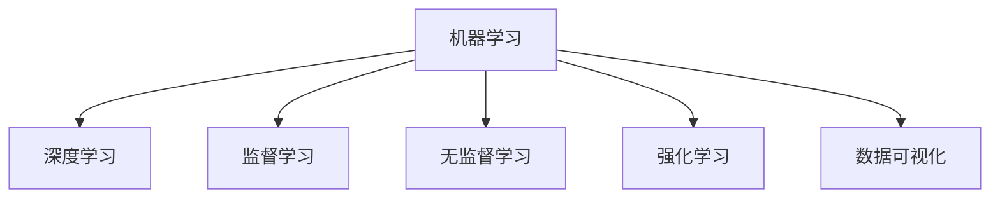

                 

# 数字化洞察力增强：AI驱动的问题解析方法

> 关键词：数字化转型, AI驱动, 问题解析, 算法优化, 数据分析, 数据可视化, 机器学习, 深度学习

## 1. 背景介绍

### 1.1 问题由来

在数字化转型的浪潮下，企业面临海量数据的爆发，对数据的分析和洞察能力成为决定竞争力的关键。传统的数据分析方法往往需要大量人力和时间，难以应对数据量的爆炸式增长。而人工智能（AI）特别是机器学习和深度学习技术的出现，为高效解析和洞察数据提供了新的手段。

AI驱动的问题解析方法，是指利用机器学习算法对数据进行建模、分析和预测，帮助企业从海量数据中提取有用信息，做出更精准的决策。近年来，越来越多的企业开始探索和应用AI技术，在金融、医疗、零售、制造等行业取得了显著成效。

### 1.2 问题核心关键点

AI驱动的问题解析方法的关键点包括：

- **数据准备**：确保数据的质量、完整性和可用性，是问题解析的基础。
- **模型选择**：根据业务需求选择合适的机器学习或深度学习模型。
- **特征工程**：通过特征提取和预处理，提升模型对数据的理解和预测能力。
- **算法优化**：通过超参数调优、模型融合等手段，提升模型性能。
- **数据可视化**：将模型结果可视化，帮助业务人员理解和应用解析结果。
- **模型部署**：将训练好的模型部署到实际业务场景中，实现持续分析和决策支持。

## 2. 核心概念与联系

### 2.1 核心概念概述

为更好地理解AI驱动的问题解析方法，本节将介绍几个密切相关的核心概念：

- **机器学习（Machine Learning）**：通过构建数学模型，利用数据对模型进行训练，从而实现对数据的预测或分类。
- **深度学习（Deep Learning）**：机器学习的一种高级形式，通过多层神经网络对数据进行特征提取和抽象，提升模型性能。
- **监督学习（Supervised Learning）**：利用标注数据训练模型，使模型能够对新数据进行预测或分类。
- **无监督学习（Unsupervised Learning）**：不依赖标注数据，通过数据的分布特性进行建模，适用于数据标注成本高或无法获取标注数据的情况。
- **强化学习（Reinforcement Learning）**：通过奖励机制训练模型，使其在特定环境中学习最优策略，适用于动态环境和复杂决策问题。
- **数据可视化（Data Visualization）**：通过图形、图表等形式，将数据和模型结果直观呈现，便于理解和分析。

这些核心概念之间的逻辑关系可以通过以下Mermaid流程图来展示：



这个流程图展示了几类主要机器学习方法和它们之间的关系：

1. 机器学习包含深度学习，是高级形式，常用于处理复杂数据。
2. 监督学习、无监督学习和强化学习是机器学习的不同应用形式。
3. 数据可视化作为机器学习结果的呈现形式，帮助理解和分析。

## 3. 核心算法原理 & 具体操作步骤

### 3.1 算法原理概述

AI驱动的问题解析方法的核心原理是利用机器学习或深度学习模型对数据进行建模和预测，从而实现对问题的解析和决策支持。其核心步骤包括数据准备、模型选择、特征工程、模型训练、结果解释和模型部署等。

以监督学习为例，具体步骤包括：

1. **数据准备**：收集和清洗数据，确保数据的完整性和可用性。
2. **模型选择**：根据任务类型选择合适的机器学习或深度学习模型，如线性回归、决策树、随机森林、卷积神经网络（CNN）、循环神经网络（RNN）等。
3. **特征工程**：从原始数据中提取和构造有用的特征，提升模型的预测能力。
4. **模型训练**：利用标注数据对模型进行训练，调整模型参数以最小化预测误差。
5. **结果解释**：通过特征重要性分析、模型可视化等手段，解释模型预测结果。
6. **模型部署**：将训练好的模型部署到实际业务场景中，持续监控和优化模型性能。

### 3.2 算法步骤详解

以下以线性回归模型为例，详细讲解AI驱动的问题解析方法的步骤：

#### 3.2.1 数据准备

1. **数据收集**：收集相关领域的历史数据，如销售记录、客户信息、市场调查等。
2. **数据清洗**：处理缺失值、异常值和重复数据，确保数据的一致性和完整性。
3. **数据划分**：将数据划分为训练集、验证集和测试集，一般按70%、15%和15%的比例进行划分。

#### 3.2.2 模型选择

根据任务类型选择合适的机器学习模型，如线性回归。线性回归用于建立因变量与自变量之间的线性关系，适用于预测连续型数据。

#### 3.2.3 特征工程

从原始数据中提取和构造有用的特征，提升模型的预测能力。常用的特征包括：

- **自变量特征**：如销售时间、季节、促销活动、地区等。
- **交互特征**：如销售时间与季节的交互，促销活动与地区的交互等。
- **派生特征**：如新客户数、回头客户数、客户流失率等。

#### 3.2.4 模型训练

利用训练集对模型进行训练，通过梯度下降等优化算法调整模型参数，最小化预测误差。训练过程包括：

1. **初始化参数**：设置模型的初始参数，如学习率、正则化系数等。
2. **前向传播**：将输入数据通过模型计算得到预测值。
3. **计算损失函数**：计算预测值与真实值之间的误差，如均方误差（MSE）。
4. **反向传播**：利用损失函数对模型参数进行调整。
5. **迭代优化**：重复以上步骤，直至模型收敛。

#### 3.2.5 结果解释

通过特征重要性分析、模型可视化等手段，解释模型预测结果。常用的方法包括：

1. **特征重要性分析**：计算各特征对预测结果的贡献度，如使用随机森林的特征重要性排序。
2. **模型可视化**：绘制模型决策边界和特征重要性图，帮助理解模型预测逻辑。
3. **残差分析**：分析残差分布，判断模型的预测误差是否满足假设。

#### 3.2.6 模型部署

将训练好的模型部署到实际业务场景中，持续监控和优化模型性能。部署过程包括：

1. **模型保存**：将训练好的模型保存为文件，以便后续调用。
2. **API接口**：封装模型为Web API接口，方便业务系统调用。
3. **监控系统**：集成监控系统，实时监控模型性能，检测异常。
4. **持续优化**：根据业务反馈，定期重新训练和优化模型。

### 3.3 算法优缺点

AI驱动的问题解析方法具有以下优点：

- **高效性**：利用机器学习模型对数据进行自动化分析和预测，大幅提升分析效率。
- **预测准确性**：通过科学的模型训练和优化，提高预测结果的准确性和可靠性。
- **可解释性**：通过特征重要性分析和模型可视化，帮助理解模型预测逻辑。
- **灵活性**：模型选择和特征工程灵活，适应不同业务场景和数据类型。

同时，该方法也存在以下局限性：

- **数据质量要求高**：对数据的完整性和一致性要求高，数据质量不足会影响模型性能。
- **计算资源消耗大**：训练大型深度学习模型需要高性能计算资源，如GPU、TPU等。
- **模型复杂度高**：深度学习模型结构复杂，难以解释和调试。
- **预测误差**：模型在处理新数据时可能存在预测误差，需要进行持续优化。

尽管存在这些局限性，但AI驱动的问题解析方法在许多领域已经取得了显著成效，成为现代数据分析和决策支持的重要手段。

### 3.4 算法应用领域

AI驱动的问题解析方法在多个领域得到广泛应用，包括：

- **金融风控**：利用机器学习模型预测信用风险、欺诈行为等，帮助金融机构降低风险。
- **医疗诊断**：利用深度学习模型对医学影像、电子病历等数据进行分析和预测，辅助医生诊断。
- **市场营销**：利用机器学习模型分析客户行为数据，优化营销策略和提升客户满意度。
- **供应链管理**：利用机器学习模型优化供应链流程，预测库存需求，提高供应链效率。
- **智能制造**：利用机器学习模型分析生产数据，优化生产计划和质量控制，提升生产效率。

除了以上领域，AI驱动的问题解析方法还在物流、能源、交通等领域得到应用，为各行各业带来显著的效率提升和成本降低。

## 4. 数学模型和公式 & 详细讲解

### 4.1 数学模型构建

以线性回归模型为例，其数学模型为：

$$
y = \beta_0 + \beta_1 x_1 + \beta_2 x_2 + \cdots + \beta_n x_n + \epsilon
$$

其中，$y$ 为因变量，$x_1, x_2, \cdots, x_n$ 为自变量，$\beta_0, \beta_1, \cdots, \beta_n$ 为模型参数，$\epsilon$ 为误差项。

### 4.2 公式推导过程

1. **假设检验**：假设因变量 $y$ 与自变量 $x_1, x_2, \cdots, x_n$ 之间存在线性关系。
2. **模型拟合**：利用训练集数据，最小化预测值与真实值之间的误差，求解模型参数。
3. **损失函数**：均方误差（MSE），即 $\frac{1}{N} \sum_{i=1}^N (y_i - \hat{y}_i)^2$，其中 $y_i$ 为真实值，$\hat{y}_i$ 为预测值。
4. **求解参数**：利用梯度下降等优化算法，求解模型参数。

### 4.3 案例分析与讲解

以房价预测为例，分析线性回归模型的应用：

1. **数据准备**：收集房屋面积、地理位置、建造年份等特征数据，确保数据完整性和一致性。
2. **特征工程**：构造交互特征，如地理位置与建造年份的交互。
3. **模型训练**：利用训练集数据，通过梯度下降算法调整模型参数，最小化预测误差。
4. **结果解释**：分析特征重要性，绘制决策边界，解释模型预测逻辑。
5. **模型部署**：将训练好的模型封装为API接口，部署到实际业务系统中，持续监控和优化。

## 5. 项目实践：代码实例和详细解释说明

### 5.1 开发环境搭建

在进行AI驱动的问题解析方法实践前，我们需要准备好开发环境。以下是使用Python进行TensorFlow开发的环境配置流程：

1. 安装Anaconda：从官网下载并安装Anaconda，用于创建独立的Python环境。
2. 创建并激活虚拟环境：
```bash
conda create -n tf-env python=3.8 
conda activate tf-env
```

3. 安装TensorFlow：根据CUDA版本，从官网获取对应的安装命令。例如：
```bash
conda install tensorflow -c conda-forge -c pytorch -c nvidia
```

4. 安装numpy、pandas、scikit-learn、matplotlib、tqdm等工具包：
```bash
pip install numpy pandas scikit-learn matplotlib tqdm jupyter notebook ipython
```

完成上述步骤后，即可在`tf-env`环境中开始问题解析方法的开发。

### 5.2 源代码详细实现

这里我们以房价预测为例，给出使用TensorFlow进行线性回归的PyTorch代码实现。

首先，定义训练数据和模型：

```python
import tensorflow as tf
import numpy as np
import pandas as pd

# 读取数据集
data = pd.read_csv('house_price.csv')

# 分离特征和标签
features = data[['area', 'location', 'year']]
labels = data['price']

# 数据标准化
mean = features.mean()
std = features.std()
features = (features - mean) / std

# 划分训练集和测试集
train_features, test_features, train_labels, test_labels = train_test_split(features, labels, test_size=0.2, random_state=42)

# 定义模型
model = tf.keras.Sequential([
    tf.keras.layers.Dense(64, activation='relu', input_shape=(features.shape[1],)),
    tf.keras.layers.Dense(1)
])
```

然后，定义损失函数和优化器：

```python
# 定义损失函数和优化器
loss_fn = tf.keras.losses.MeanSquaredError()
optimizer = tf.keras.optimizers.Adam(learning_rate=0.001)
```

接着，定义训练和评估函数：

```python
# 定义训练函数
def train_step(x, y):
    with tf.GradientTape() as tape:
        y_pred = model(x, training=True)
        loss = loss_fn(y, y_pred)
    gradients = tape.gradient(loss, model.trainable_variables)
    optimizer.apply_gradients(zip(gradients, model.trainable_variables))

# 定义评估函数
def evaluate_step(x, y):
    y_pred = model(x, training=False)
    loss = loss_fn(y, y_pred)
    mse = tf.reduce_mean(tf.square(y_pred - y))
    return mse
```

最后，启动训练流程并在测试集上评估：

```python
epochs = 100
batch_size = 64

# 训练模型
for epoch in range(epochs):
    train_loss = 0.0
    for i in range(0, len(train_features), batch_size):
        start = i
        end = min(i + batch_size, len(train_features))
        train_step(train_features[start:end], train_labels[start:end])
        train_loss += evaluate_step(train_features[start:end], train_labels[start:end])

    test_loss = evaluate_step(test_features, test_labels)
    print(f'Epoch {epoch+1}, train loss: {train_loss:.3f}, test loss: {test_loss:.3f}')
```

以上就是使用TensorFlow进行房价预测的完整代码实现。可以看到，TensorFlow提供了一个简洁的接口，可以轻松地定义和训练线性回归模型。

### 5.3 代码解读与分析

让我们再详细解读一下关键代码的实现细节：

**数据处理函数**：
- `read_csv`：从CSV文件中读取数据集。
- `train_test_split`：将数据集划分为训练集和测试集。
- `mean`和`std`：计算特征的均值和标准差，用于数据标准化。

**模型定义函数**：
- `Sequential`：定义一个线性堆叠模型，用于构建线性回归模型。
- `Dense`：定义模型层，使用ReLU激活函数。

**损失函数和优化器**：
- `MeanSquaredError`：定义均方误差损失函数。
- `Adam`：定义Adam优化器，设置学习率。

**训练和评估函数**：
- `train_step`：定义一个训练步骤，包括计算损失和更新模型参数。
- `evaluate_step`：定义一个评估步骤，计算测试集上的均方误差。

**训练流程**：
- `epochs`和`batch_size`：定义训练轮数和批次大小。
- `train_loss`和`test_loss`：计算训练集和测试集的均方误差，输出训练结果。

通过以上代码实现，我们完成了一个基本的线性回归模型训练和评估流程。开发者可以基于此代码，进一步扩展和优化模型，实现更复杂的问题解析需求。

## 6. 实际应用场景

### 6.1 智能客服系统

AI驱动的问题解析方法在智能客服系统中得到广泛应用。传统客服系统需要大量人力进行日常响应，且响应速度较慢。利用AI技术，可以构建一个24小时不间断响应的智能客服系统，提升客户体验和满意度。

在实际应用中，可以使用机器学习模型对客户提问进行分类，匹配最合适的回答模板，并通过对话系统实现智能回复。AI驱动的智能客服系统不仅能够快速响应客户问题，还能根据历史数据不断优化回答策略，提升回答质量。

### 6.2 金融风控

AI驱动的问题解析方法在金融风控领域具有重要应用价值。通过机器学习模型对客户信用数据进行分析和预测，可以识别出潜在风险客户，帮助金融机构降低风险。

在实际应用中，可以使用信用评分模型对客户的财务状况进行评估，预测其违约概率。同时，可以使用异常检测模型对客户的交易行为进行监控，及时发现异常交易行为，防范欺诈风险。

### 6.3 市场营销

AI驱动的问题解析方法在市场营销中具有重要作用。通过机器学习模型对客户行为数据进行分析，可以优化营销策略，提升客户满意度和忠诚度。

在实际应用中，可以使用聚类算法对客户进行分类，实现精准营销。同时，可以使用预测模型对客户的消费行为进行预测，优化库存管理和促销策略。

### 6.4 智能制造

AI驱动的问题解析方法在智能制造中具有重要应用价值。通过机器学习模型对生产数据进行分析和预测，可以优化生产计划和质量控制，提升生产效率。

在实际应用中，可以使用回归模型对生产线的运行状态进行预测，优化生产计划。同时，可以使用异常检测模型对生产过程中的异常情况进行监控，及时发现和处理问题。

### 6.5 未来应用展望

随着AI驱动的问题解析方法的发展，未来将在更多领域得到应用，为各行各业带来变革性影响：

1. **智慧城市治理**：利用AI技术对城市数据进行分析和预测，优化城市管理，提高城市运行效率。
2. **智慧医疗**：利用AI技术对医疗数据进行分析和预测，提升诊断和治疗效果，优化医疗资源配置。
3. **智慧教育**：利用AI技术对教育数据进行分析和预测，优化教学策略，提升教育质量。
4. **智慧交通**：利用AI技术对交通数据进行分析和预测，优化交通管理，提高交通运行效率。

未来，AI驱动的问题解析方法将在各个领域得到广泛应用，为社会带来更加智能化和高效的解决方案。

## 7. 工具和资源推荐

### 7.1 学习资源推荐

为了帮助开发者系统掌握AI驱动的问题解析方法的原理和实践技巧，这里推荐一些优质的学习资源：

1. **《深度学习》（Ian Goodfellow）**：深度学习的经典教材，系统介绍了深度学习的基本原理和应用。
2. **《Python深度学习》（Francois Chollet）**：TensorFlow官方教程，介绍了TensorFlow的使用方法和应用场景。
3. **《机器学习实战》（Peter Harrington）**：机器学习实战教程，提供了大量代码示例和应用案例。
4. **Kaggle竞赛平台**：提供大量数据集和竞赛任务，帮助开发者实践和提升AI问题解析能力。
5. **Coursera《机器学习》（Andrew Ng）**：斯坦福大学机器学习课程，涵盖机器学习的基本概念和经典算法。

通过对这些资源的学习实践，相信你一定能够快速掌握AI驱动的问题解析方法的精髓，并用于解决实际的AI问题。

### 7.2 开发工具推荐

高效的开发离不开优秀的工具支持。以下是几款用于AI驱动的问题解析方法开发的常用工具：

1. **TensorFlow**：由Google主导开发的开源深度学习框架，生产部署方便，适合大规模工程应用。
2. **PyTorch**：由Facebook开发的开源深度学习框架，灵活易用，适合研究和原型开发。
3. **Keras**：基于TensorFlow和Theano的高级API，提供简洁的接口，方便快速原型开发。
4. **Jupyter Notebook**：交互式笔记本，支持代码编写、数据可视化、文档编写等多种功能，适合学习和开发。
5. **GitHub**：代码托管平台，支持版本控制和协作开发，方便团队协作和项目管理。

合理利用这些工具，可以显著提升AI驱动的问题解析方法开发的效率，加速创新迭代的步伐。

### 7.3 相关论文推荐

AI驱动的问题解析方法的发展源于学界的持续研究。以下是几篇奠基性的相关论文，推荐阅读：

1. **《机器学习》（Tom Mitchell）**：机器学习的经典教材，介绍了机器学习的基本原理和应用。
2. **《深度学习》（Ian Goodfellow）**：深度学习的经典教材，系统介绍了深度学习的基本原理和应用。
3. **《神经网络与深度学习》（Michael Nielsen）**：介绍了神经网络和深度学习的基本原理和应用。
4. **《面向AI的机器学习》（John W. Sieber）**：介绍了机器学习和深度学习的最新进展和应用。

这些论文代表了大语言模型微调技术的发展脉络。通过学习这些前沿成果，可以帮助研究者把握学科前进方向，激发更多的创新灵感。

## 8. 总结：未来发展趋势与挑战

### 8.1 总结

本文对AI驱动的问题解析方法进行了全面系统的介绍。首先阐述了AI驱动的问题解析方法的研究背景和意义，明确了该方法在提高数据利用率、优化业务决策等方面的独特价值。其次，从原理到实践，详细讲解了问题解析的数学原理和关键步骤，给出了问题解析方法开发的完整代码实例。同时，本文还广泛探讨了问题解析方法在智能客服、金融风控、市场营销等多个行业领域的应用前景，展示了问题解析方法的巨大潜力。此外，本文精选了问题解析技术的各类学习资源，力求为读者提供全方位的技术指引。

通过本文的系统梳理，可以看到，AI驱动的问题解析方法正在成为数据科学和人工智能的重要范式，极大地拓展了数据处理和业务决策的边界，为各行各业带来了显著的效率提升和成本降低。未来，伴随AI驱动的问题解析方法的不断演进，将在更多领域得到应用，为各行各业带来变革性影响。

### 8.2 未来发展趋势

展望未来，AI驱动的问题解析方法将呈现以下几个发展趋势：

1. **模型复杂度增加**：随着深度学习模型的不断发展，模型的复杂度将进一步提升，具备更强大的表达能力和预测能力。
2. **数据类型多样化**：未来的问题解析方法将处理更多类型的数据，如图像、视频、语音等，实现多模态数据的协同建模。
3. **联邦学习**：在保护数据隐私的前提下，利用联邦学习技术，实现分布式数据协作和模型训练。
4. **模型压缩和优化**：为了提高模型在资源受限环境下的性能，未来的问题解析方法将更加注重模型压缩和优化技术。
5. **模型集成和融合**：通过模型集成和融合技术，实现不同模型的优势互补，提升整体性能。

以上趋势凸显了AI驱动的问题解析方法的发展方向，为数据科学和人工智能带来了更多的应用场景和技术挑战。

### 8.3 面临的挑战

尽管AI驱动的问题解析方法已经取得了瞩目成就，但在迈向更加智能化、普适化应用的过程中，它仍面临着诸多挑战：

1. **数据质量瓶颈**：数据质量的不足是问题解析面临的主要挑战之一。如何提高数据质量，确保数据的完整性和一致性，是未来需要解决的关键问题。
2. **模型泛化性不足**：深度学习模型在处理新数据时，可能存在泛化性不足的问题，需要进行持续优化和改进。
3. **计算资源消耗大**：训练大型深度学习模型需要高性能计算资源，如何降低计算成本，提高模型训练效率，是未来需要解决的重要问题。
4. **模型可解释性不足**：深度学习模型的黑盒特性，导致其难以解释和调试。如何提高模型的可解释性，增强用户信任，是未来需要解决的关键问题。
5. **隐私和安全问题**：数据隐私和安全问题是AI应用的重要挑战。如何保护用户数据隐私，防止数据泄露和滥用，是未来需要解决的关键问题。

正视问题解析面临的这些挑战，积极应对并寻求突破，将是大语言模型微调走向成熟的必由之路。相信随着学界和产业界的共同努力，这些挑战终将一一被克服，问题解析方法必将在构建人机协同的智能时代中扮演越来越重要的角色。

### 8.4 研究展望

面对AI驱动的问题解析方法所面临的种种挑战，未来的研究需要在以下几个方面寻求新的突破：

1. **数据增强和数据生成**：通过数据增强和数据生成技术，提升数据质量和多样性，增强模型的泛化能力。
2. **模型压缩和优化**：开发更加高效的模型压缩和优化技术，提高模型在资源受限环境下的性能。
3. **联邦学习和分布式计算**：利用联邦学习技术，实现分布式数据协作和模型训练，提升数据利用效率。
4. **模型集成和融合**：通过模型集成和融合技术，实现不同模型的优势互补，提升整体性能。
5. **可解释性和透明性**：通过可解释性和透明性技术，增强模型的可解释性，提高用户信任和接受度。

这些研究方向的探索，必将引领问题解析方法迈向更高的台阶，为构建安全、可靠、可解释、可控的智能系统铺平道路。面向未来，问题解析方法还需要与其他人工智能技术进行更深入的融合，如知识表示、因果推理、强化学习等，多路径协同发力，共同推动自然语言理解和智能交互系统的进步。只有勇于创新、敢于突破，才能不断拓展问题解析方法的边界，让智能技术更好地造福人类社会。

## 9. 附录：常见问题与解答

**Q1：问题解析方法是否适用于所有业务场景？**

A: 问题解析方法适用于大部分业务场景，但需要根据具体业务需求选择合适的模型和技术。对于一些特殊领域，如医疗、法律等，需要进一步优化模型和算法。

**Q2：问题解析方法是否需要大量的标注数据？**

A: 问题解析方法通常需要标注数据进行训练，但可以通过半监督学习和无监督学习技术，在少量标注数据情况下获得较好的效果。

**Q3：问题解析方法的计算成本是否过高？**

A: 问题解析方法在处理大规模数据时，计算成本较高。可以通过模型压缩和优化技术，降低计算成本，提高模型训练和推理效率。

**Q4：问题解析方法是否需要高精度的模型？**

A: 问题解析方法通常需要高精度的模型，以确保预测结果的准确性和可靠性。可以通过模型融合和集成技术，提升模型性能。

**Q5：问题解析方法是否需要持续更新和优化？**

A: 问题解析方法需要持续更新和优化，以适应数据分布的变化和业务需求的变化。通过持续学习和在线优化技术，可以提高模型的实时性和适应性。

通过以上问答，可以看到，问题解析方法在实际应用中需要根据具体业务场景进行优化和调整。只有在科学选择模型和算法的基础上，才能充分发挥问题解析方法的优势，提升业务决策的效率和准确性。

---

作者：禅与计算机程序设计艺术 / Zen and the Art of Computer Programming

