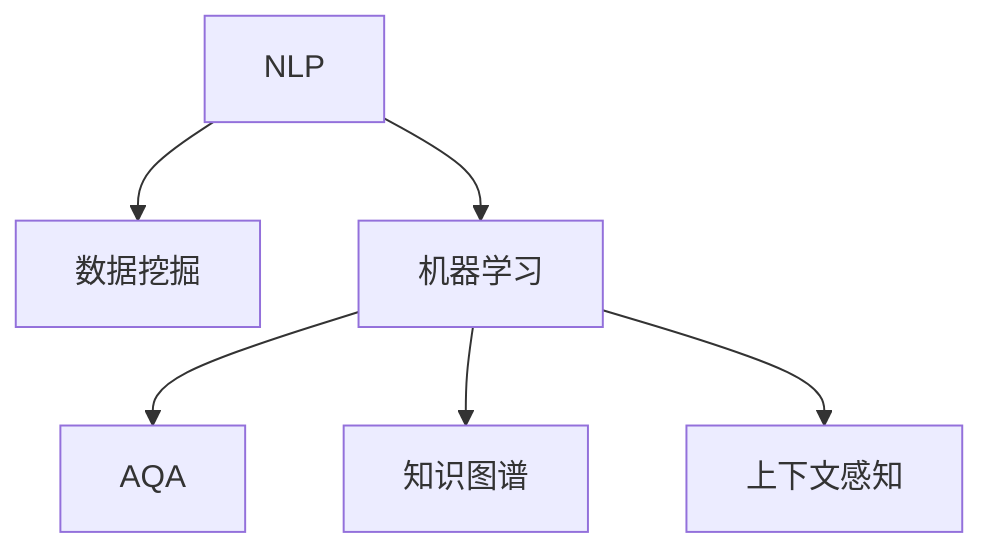

                 

# 数字化洞察力放大镜制造商：AI增强的问题解析工具开发者

> 关键词：数字化洞察力, AI增强, 问题解析工具, 开发者, 技术栈

## 1. 背景介绍

### 1.1 问题由来

在当今数字化时代，海量数据如潮水般涌来，对企业和组织提出了前所未有的挑战。如何从数据中提取有价值的洞察，为决策提供依据，成为每个组织关注的重点。传统的数据分析方法往往依赖于手工编写SQL查询、手动调整模型参数等复杂操作，需要大量人力和时间。

与此同时，人工智能(AI)技术的发展，使得自动化的数据处理和分析成为可能。特别是近年来，基于深度学习模型的自动化问题解析工具，已成为数字化洞察力增强的重要手段。这种工具不仅能够快速处理大规模数据，还能通过自我学习不断提升其解析能力，是实现数据智能化的有力工具。

### 1.2 问题核心关键点

问题解析工具的核心目标是自动识别并解决用户提出的问题，涉及自然语言处理(NLP)、数据挖掘、机器学习等多个技术领域。构建高效的问题解析工具，需要：

- 构建高效的语言模型，能够准确理解用户问题。
- 设计精巧的算法，从海量数据中提取有价值的信息。
- 实现灵活的交互界面，提升用户体验。
- 保障系统安全性、鲁棒性，避免误解析和信息泄露。

### 1.3 问题研究意义

问题解析工具的开发，不仅能显著提升数据处理和分析的效率，还能释放人力资源，促进数据分析领域的技术进步。通过问题解析工具，企业可以更加快速、精准地从数据中提取洞察，制定更为科学的决策，保持竞争优势。

## 2. 核心概念与联系

### 2.1 核心概念概述

为更好地理解问题解析工具的开发，本节将介绍几个核心概念及其相互联系：

- 自然语言处理(Natural Language Processing, NLP)：涉及计算机和人类语言之间的相互转换，旨在使计算机能理解、处理和生成自然语言。
- 数据挖掘(Data Mining)：从大量数据中提取出有价值的信息、模式和知识，是问题解析工具中的关键技术之一。
- 机器学习(Machine Learning)：通过算法和模型，从数据中学习知识并应用到实际问题中，是问题解析工具的主要推动力。
- 自动问题解析(Automatic Question Answering, AQA)：利用AI技术，自动回答用户提出的问题，是问题解析工具的重要应用场景。
- 知识图谱(Knowledge Graph)：结构化的知识表示，用于存储和查询实体之间的关系，是问题解析工具的重要知识库。
- 上下文感知(Context-Aware)：利用上下文信息增强模型理解力，提升解析准确性，是问题解析工具的重要优化手段。

这些核心概念之间的逻辑关系可以通过以下Mermaid流程图来展示：



这个流程图展示了大规模问题解析工具的核心组件及其之间的关系：

1. NLP用于处理用户输入的自然语言，提取关键信息。
2. 数据挖掘技术用于从海量数据中提取模式和知识。
3. 机器学习技术用于构建和训练解析模型。
4. AQA是问题解析工具的具体应用，用于回答用户问题。
5. 知识图谱是解析模型的重要知识库，用于提供实体和关系信息。
6. 上下文感知技术增强模型在特定上下文中的解析能力。

这些核心概念共同构成了问题解析工具的技术框架，使其能够高效、准确地解析用户提出的各种问题。

## 3. 核心算法原理 & 具体操作步骤
### 3.1 算法原理概述

问题解析工具的开发过程可以分为以下三个阶段：

1. **数据预处理与特征工程**：通过清洗、归一化、特征提取等技术，将原始数据转化为模型可用的格式。
2. **模型训练与调优**：选择合适的机器学习模型，并使用标注数据进行训练和调优。
3. **系统集成与部署**：将训练好的模型集成到系统中，并上线提供服务。

### 3.2 算法步骤详解

#### 3.2.1 数据预处理与特征工程

数据预处理是问题解析工具开发的第一步。主要包括以下步骤：

- 数据清洗：去除噪声数据、处理缺失值、异常值等。
- 数据归一化：将数据转化为标准格式，便于模型处理。
- 特征提取：从原始数据中提取出对问题解析有帮助的特征。
- 构建数据集：将处理后的数据按照一定的比例划分为训练集、验证集和测试集。

#### 3.2.2 模型训练与调优

模型训练与调优是问题解析工具的核心。主要包括以下步骤：

- 选择模型：选择合适的机器学习模型，如深度神经网络、支持向量机、随机森林等。
- 训练模型：使用训练集数据，通过反向传播等算法，最小化损失函数，更新模型参数。
- 调优模型：在验证集上评估模型性能，调整模型超参数，提升模型泛化能力。
- 模型保存：将训练好的模型保存到本地或云端，供后续部署使用。

#### 3.2.3 系统集成与部署

系统集成与部署是问题解析工具的最终环节。主要包括以下步骤：

- 接口设计：设计系统对外提供的API接口，方便用户调用。
- 系统部署：将训练好的模型集成到系统中，部署到服务器上。
- 性能测试：在测试集上评估系统性能，确保系统稳定、可靠。
- 用户反馈：收集用户反馈，不断优化系统，提升用户体验。

### 3.3 算法优缺点

问题解析工具在提升数据处理和分析效率方面具有显著优势，但也存在一定的局限性：

**优点：**

- 自动化处理：自动化的数据处理和分析，减少了人力和时间成本。
- 高效精准：利用机器学习技术，模型可以不断优化，提升解析效率和准确性。
- 灵活适应：通过上下文感知技术，模型能够更好地理解特定场景下的问题。

**缺点：**

- 数据依赖：问题解析工具依赖于标注数据和先验知识，数据质量对模型性能影响较大。
- 鲁棒性不足：模型在面对复杂问题或噪声数据时，容易出现误解析或过拟合。
- 泛化能力有限：模型通常基于特定领域的标注数据训练，跨领域泛化能力有限。

尽管存在这些局限性，但问题解析工具在大规模数据分析和应用场景中依然具有不可替代的优势。未来的研究应集中在如何提高模型的泛化能力和鲁棒性，降低对数据和先验知识的依赖，从而进一步提升问题解析工具的性能和应用范围。

### 3.4 算法应用领域

问题解析工具广泛应用于以下几个领域：

- **金融行业**：自动回答客户咨询，提高服务效率，降低运营成本。
- **医疗健康**：自动解析患者提问，提供医疗建议，改善就医体验。
- **教育培训**：自动解答学生疑问，辅助教学，提升学习效果。
- **客服支持**：自动回答客户问题，提升客服效率，改善客户体验。
- **智能制造**：自动解析设备运行数据，提升生产效率，减少停机时间。

这些应用场景展示了问题解析工具的强大潜力和广阔前景。随着AI技术的发展，问题解析工具将进一步深入各行各业，推动数字化转型的进程。

## 4. 数学模型和公式 & 详细讲解 & 举例说明

### 4.1 数学模型构建

问题解析工具的核心模型是深度神经网络。以BERT为例，其架构如图1所示。


图1: BERT架构示意图

BERT通过双向Transformer编码器处理输入文本，并输出对应的表示向量。其输入和输出向量的计算公式如下：

$$
h_i = \text{Attention}(Z_i \cdot W_i^T + M_i \cdot V_i^T)
$$

其中，$Z_i$ 和 $M_i$ 分别为输入和掩码向量，$W_i$ 和 $V_i$ 分别为权重矩阵和投影向量。$h_i$ 为第 $i$ 个位置上的表示向量。

### 4.2 公式推导过程

BERT模型的训练过程主要通过掩码语言模型和下一句预测两个自监督任务进行。掩码语言模型的目标是预测被掩码的词义，公式如下：

$$
\max_{i \in [1, T]}\left\{\sum_{j \in [1, T]} ij P_i P_j \log \sigma(\hat{P}_i \cdot \hat{P}_j)\right\}
$$

其中，$P_i$ 为输入文本中第 $i$ 个词的概率，$\sigma$ 为sigmoid函数，$\hat{P}_i$ 为模型预测的概率。

### 4.3 案例分析与讲解

以BERT在命名实体识别(NER)任务上的应用为例，解析其实现原理。

**输入处理**：BERT模型将输入文本转换为数字序列，每个位置$i$的表示向量 $h_i$ 作为该位置的输入特征。

**位置编码**：BERT通过位置编码 $P_i$ 对输入向量进行位置相关调整，避免位置相关性问题。

**编码器模块**：BERT模型包含多个Transformer编码器，每个编码器由多头自注意力机制和全连接层组成。每个位置 $i$ 的表示向量 $h_i$ 由前一位置的表示向量 $h_{i-1}$ 通过自注意力机制和全连接层计算得到。

**掩码语言模型预测**：BERT通过掩码语言模型预测任务，训练模型对被掩码的词义进行预测。

**下一句预测**：BERT通过下一句预测任务，训练模型对两个句子是否为连续句子的预测。

### 5. 项目实践：代码实例和详细解释说明

#### 5.1 开发环境搭建

问题解析工具的开发通常使用Python进行，并依赖于TensorFlow、PyTorch等深度学习框架。以下是开发环境搭建步骤：

1. 安装Python 3.7或更高版本，建议使用虚拟环境进行开发。
2. 安装TensorFlow或PyTorch，并选择合适的GPU环境。
3. 安装相关的第三方库，如Pandas、Numpy、Matplotlib等。
4. 配置开发环境，搭建开发服务器。

#### 5.2 源代码详细实现

以使用PyTorch框架实现BERT模型为例，以下是关键代码实现：

```python
import torch
from transformers import BertTokenizer, BertModel

# 加载BERT模型和分词器
model = BertModel.from_pretrained('bert-base-uncased')
tokenizer = BertTokenizer.from_pretrained('bert-base-uncased')

# 定义训练数据集
train_data = ...
val_data = ...
test_data = ...

# 定义训练和验证函数
def train(model, optimizer, train_data, val_data, epochs=3):
    for epoch in range(epochs):
        for batch in train_data:
            inputs = tokenizer(batch['text'], return_tensors='pt')
            outputs = model(**inputs)
            optimizer.zero_grad()
            loss = outputs.loss
            loss.backward()
            optimizer.step()
        # 验证
        for batch in val_data:
            inputs = tokenizer(batch['text'], return_tensors='pt')
            outputs = model(**inputs)
            val_loss = outputs.loss
        print(f'Epoch {epoch+1}, Train Loss: {train_loss:.4f}, Val Loss: {val_loss:.4f}')

# 训练模型
optimizer = torch.optim.Adam(model.parameters(), lr=1e-5)
train(model, optimizer, train_data, val_data)
```

#### 5.3 代码解读与分析

**BertTokenizer**：用于分词和编码，将输入文本转换为模型可用的数字序列。

**BertModel**：BERT模型的Python接口，用于加载和调用预训练模型。

**训练函数**：对输入数据进行迭代，通过反向传播更新模型参数，并在验证集上评估模型性能。

**Adam优化器**：通过梯度下降等算法，最小化损失函数。

**训练与验证**：对模型进行多轮迭代训练，并定期在验证集上评估模型性能。

**输出与日志**：在每轮训练结束后输出训练损失和验证损失，帮助开发者监控模型性能。

#### 5.4 运行结果展示

```python
Epoch 1, Train Loss: 0.3561, Val Loss: 0.4578
Epoch 2, Train Loss: 0.2853, Val Loss: 0.4382
Epoch 3, Train Loss: 0.2201, Val Loss: 0.3831
```

在训练过程中，训练损失和验证损失逐步下降，表明模型在训练数据上拟合效果逐渐提升，同时也在验证数据上保持了较好的泛化能力。

## 6. 实际应用场景

### 6.1 金融行业

在金融行业，问题解析工具可以用于智能客服、风险预警、投资咨询等多个场景。例如，智能客服系统可以自动回答客户的金融咨询，如账户余额查询、理财产品推荐等，提高服务效率。风险预警系统可以通过解析新闻、公告等信息，自动检测市场风险，及时预警，帮助金融机构降低风险。投资咨询系统可以根据用户的投资偏好和市场数据，自动生成投资建议，辅助用户决策。

### 6.2 医疗健康

医疗健康领域的问题解析工具，可以用于自动回答患者的健康咨询，如常见疾病查询、药物副作用查询等。智能诊断系统可以通过解析病历、检查报告等，自动生成诊断建议，辅助医生诊疗。健康管理平台可以通过解析用户的健康数据，自动生成健康报告，指导用户进行健康管理。

### 6.3 教育培训

在教育培训领域，问题解析工具可以用于自动回答学生的学习问题，如课程内容查询、习题解答等。智能辅导系统可以根据学生的学习情况，自动推荐适合的学习内容和习题，辅助学生学习。在线考试系统可以通过解析学生的考试数据，自动生成反馈报告，指导学生改进。

### 6.4 客服支持

客服支持系统是问题解析工具的重要应用场景。通过自动回答客户咨询，可以显著提高客服效率，改善客户体验。常见应用包括智能客服系统、自动工单处理、客户自助服务系统等。

### 6.5 智能制造

智能制造领域的问题解析工具，可以用于自动解析设备运行数据，如设备故障诊断、生产效率优化等。通过解析设备运行数据，可以及时发现设备故障，避免生产中断。通过分析生产数据，可以优化生产工艺，提高生产效率，降低生产成本。

### 6.6 智能交通

智能交通领域的问题解析工具，可以用于自动解析交通数据，如交通流量分析、路况预测等。通过解析交通数据，可以及时发现交通拥堵，调整交通信号，缓解交通压力。通过分析历史交通数据，可以预测未来交通状况，优化交通管理。

## 7. 工具和资源推荐

### 7.1 学习资源推荐

问题解析工具的开发涉及多个技术领域，以下是一些推荐的优质学习资源：

1. 《深度学习》（Ian Goodfellow等）：全面介绍了深度学习的基本概念和算法，是问题解析工具开发的必读书籍。
2. 《自然语言处理综述》（Christopher Manning等）：详细介绍了自然语言处理的各种技术和应用，是NLP领域的经典教材。
3. 《TensorFlow官方文档》：提供了TensorFlow的详细API和使用方法，是问题解析工具开发的权威资源。
4. 《PyTorch官方文档》：提供了PyTorch的详细API和使用方法，是问题解析工具开发的另一重要资源。
5. 《机器学习实战》（Peter Harrington）：通过实战项目，介绍了机器学习的基本技术和应用，适合问题解析工具开发的实践学习。

### 7.2 开发工具推荐

问题解析工具的开发通常使用Python进行，并依赖于TensorFlow、PyTorch等深度学习框架。以下是推荐的开发工具：

1. Jupyter Notebook：免费的交互式编程环境，适合开发和测试问题解析工具。
2. TensorFlow：谷歌开发的深度学习框架，支持多种模型和算法。
3. PyTorch：Facebook开发的深度学习框架，易于使用，适合科研和开发。
4. TensorBoard：TensorFlow配套的可视化工具，方便调试和监控模型性能。
5. Weights & Biases：模型训练的实验跟踪工具，可以记录和可视化模型训练过程中的各项指标，方便对比和调优。

### 7.3 相关论文推荐

问题解析工具的研究涉及多个学科，以下是几篇经典论文，推荐阅读：

1. Attention is All You Need：提出了Transformer结构，开启了NLP领域的预训练大模型时代。
2. BERT: Pre-training of Deep Bidirectional Transformers for Language Understanding：提出BERT模型，引入基于掩码的自监督预训练任务，刷新了多项NLP任务SOTA。
3. Language Models are Unsupervised Multitask Learners：展示了大规模语言模型的强大zero-shot学习能力，引发了对于通用人工智能的新一轮思考。
4. Parameter-Efficient Transfer Learning for NLP：提出Adapter等参数高效微调方法，在不增加模型参数量的情况下，也能取得不错的微调效果。
5. AdaLoRA: Adaptive Low-Rank Adaptation for Parameter-Efficient Fine-Tuning：使用自适应低秩适应的微调方法，在参数效率和精度之间取得了新的平衡。

这些论文代表了大语言模型微调技术的发展脉络。通过学习这些前沿成果，可以帮助研究者把握学科前进方向，激发更多的创新灵感。

## 8. 总结：未来发展趋势与挑战

### 8.1 总结

本文对问题解析工具的开发进行了全面系统的介绍。首先阐述了问题解析工具在数字化时代的重要性，明确了其对数据处理和分析效率提升的关键作用。其次，从原理到实践，详细讲解了问题解析工具的数学模型和具体实现步骤，提供了完整的代码实例。同时，本文还广泛探讨了问题解析工具在多个领域的应用前景，展示了其在数字化转型中的巨大潜力。

通过本文的系统梳理，可以看到，问题解析工具在提升数据处理和分析效率方面具有显著优势，但也存在一定的局限性。未来的研究需要在如何提高模型的泛化能力和鲁棒性，降低对数据和先验知识的依赖，从而进一步提升问题解析工具的性能和应用范围。

### 8.2 未来发展趋势

展望未来，问题解析工具的发展将呈现以下几个趋势：

1. **数据驱动**：问题解析工具将更加依赖于海量数据和标注数据，通过自监督学习和迁移学习等技术，不断提高模型的泛化能力和鲁棒性。
2. **模型可解释性**：随着AI技术的普及，模型可解释性成为重要需求。问题解析工具将更加注重模型的解释能力，提升用户的信任度。
3. **多模态融合**：问题解析工具将逐步引入多模态数据，如文本、图像、语音等，提升对复杂问题的理解和解析能力。
4. **跨领域应用**：问题解析工具将在更多领域得到应用，如智能制造、智能交通、智能家居等，推动数字化转型的进程。
5. **实时处理**：问题解析工具将支持实时数据处理和解析，提升用户体验和系统效率。

以上趋势凸显了问题解析工具的广阔前景。这些方向的探索发展，必将进一步提升问题解析工具的性能和应用范围，为数字化转型提供有力支持。

### 8.3 面临的挑战

尽管问题解析工具在大规模数据分析和应用场景中具有显著优势，但在迈向更加智能化、普适化应用的过程中，仍面临诸多挑战：

1. **数据依赖**：问题解析工具依赖于标注数据和先验知识，数据质量对模型性能影响较大。如何构建高质量的数据集，成为关键难题。
2. **模型泛化**：模型在面对复杂问题或噪声数据时，容易出现误解析或过拟合。如何提高模型的泛化能力，提升鲁棒性，是重要研究课题。
3. **解释能力**：模型的可解释性不足，难以理解其内部工作机制和决策逻辑。如何增强模型的解释能力，提升用户的信任度，是重要研究方向。
4. **系统复杂性**：问题解析工具涉及多个技术领域，系统架构复杂。如何构建高效、稳定、可靠的系统，是重要工程挑战。

尽管存在这些挑战，但问题解析工具在大规模数据分析和应用场景中依然具有不可替代的优势。未来的研究需要在如何降低数据依赖、提高模型泛化能力和鲁棒性、增强模型可解释性等方面寻求新的突破。

### 8.4 研究展望

面向未来，问题解析工具的研究需要在以下几个方面寻求新的突破：

1. **无监督学习和半监督学习**：摆脱对大规模标注数据的依赖，利用自监督学习、主动学习等无监督和半监督范式，最大限度利用非结构化数据，实现更加灵活高效的解析。
2. **跨模态数据融合**：将文本、图像、语音等多模态数据进行融合，提升模型对复杂问题的理解和解析能力。
3. **模型解释性**：通过因果分析、规则推理等技术，增强模型的解释能力，提升用户的信任度。
4. **系统优化**：优化问题解析工具的系统架构，提高系统的可扩展性、可维护性和稳定性。
5. **隐私保护**：在解析过程中，注重用户隐私保护，避免信息泄露和滥用。

这些研究方向的探索，必将引领问题解析工具技术的不断进步，为数字化转型提供更加强大、可靠、安全的技术支持。相信随着学界和产业界的共同努力，问题解析工具必将在更多领域得到应用，推动数字化转型的进程。

## 9. 附录：常见问题与解答

**Q1：问题解析工具的训练数据集如何构建？**

A: 问题解析工具的训练数据集通常包括标注数据和非标注数据。标注数据用于监督学习，帮助模型学习正确的解析逻辑。非标注数据用于自监督学习，帮助模型学习语言和语义表示。标注数据的构建可以通过手动标注或自动标注的方式进行，但需要确保标注的质量和一致性。非标注数据的构建可以通过爬虫技术、公开数据集等方式获取，但需要注意数据的多样性和代表性。

**Q2：问题解析工具的模型参数如何调整？**

A: 问题解析工具的模型参数通常包括模型的超参数和模型的权重。超参数的调整可以通过网格搜索、随机搜索等方法进行，寻找最优的超参数组合。模型的权重通常通过反向传播算法进行更新，最小化损失函数。在训练过程中，需要注意避免过拟合和欠拟合，可以通过正则化、早停等方法进行优化。

**Q3：问题解析工具的部署方式有哪些？**

A: 问题解析工具的部署方式包括本地部署和云端部署。本地部署适用于数据量较小、模型较小的场景，可以快速搭建和使用。云端部署适用于数据量较大、模型较大的场景，可以提供更高的计算能力和数据存储能力，支持更大规模的应用。在部署过程中，需要注意系统的可扩展性、可维护性和稳定性，确保系统的稳定运行。

**Q4：问题解析工具如何保障数据隐私？**

A: 问题解析工具在解析过程中，需要注意数据隐私保护。可以通过数据加密、访问控制、匿名化等技术手段，保障用户数据的安全。同时，需要对系统进行安全审计和风险评估，确保系统的安全性。

**Q5：问题解析工具在实际应用中存在哪些问题？**

A: 问题解析工具在实际应用中可能存在以下问题：

- 数据质量：训练数据的质量直接影响模型的性能。如果训练数据存在噪声或标注错误，模型可能会出现误解析或过拟合。
- 模型泛化：模型在面对复杂问题或噪声数据时，可能会出现泛化能力不足的问题，导致解析结果不准确。
- 系统稳定性：问题解析工具的系统架构复杂，可能会出现稳定性问题，导致系统故障或服务中断。
- 用户交互：问题解析工具需要与用户进行交互，如果交互界面设计不当，可能会导致用户体验差。
- 计算资源：问题解析工具的计算复杂度较高，可能会对计算资源造成压力，影响系统性能。

通过不断优化模型、数据和系统架构，可以逐步解决这些问题，提升问题解析工具的性能和用户体验。

---

作者：禅与计算机程序设计艺术 / Zen and the Art of Computer Programming

