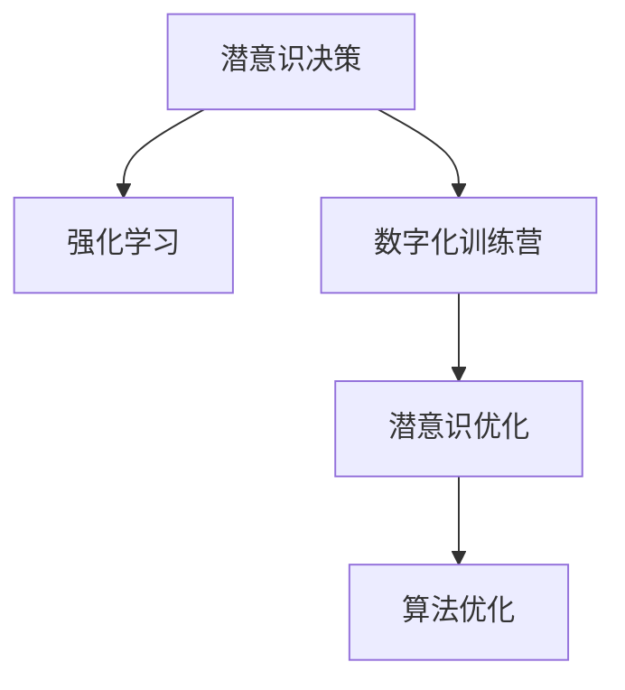

                 

# 数字化直觉训练营负责人：AI辅助的潜意识决策强化专家

> 关键词：潜意识决策, 强化学习, AI辅助, 数字化训练营, 潜意识优化, 算法优化, 未来应用展望

## 1. 背景介绍

### 1.1 问题由来
在数字时代，无论是企业决策还是个人行为，决策效率和准确性已成为提升竞争力的关键因素。然而，人类的决策过程受到诸多因素影响，包括情绪、认知偏差、信息加工等，常常无法充分发挥潜能。为了弥补这一短板，数字化直觉训练营（Digital Intuition Training Camps, DIVTC）应运而生，通过AI技术和潜意识优化训练方法，帮助用户提升决策能力，实现科学决策。

### 1.2 问题核心关键点
- **潜意识决策**：指人类在没有意识参与的情况下，通过潜意识引导快速做出决策的能力。潜意识决策在许多情境下表现出色，能够有效避免显性决策中的认知偏差和情绪干扰。
- **强化学习（Reinforcement Learning, RL）**：一种通过与环境互动，最大化长期奖励的机器学习技术。强化学习常用于游戏AI、推荐系统、机器人等领域，其核心思想与潜意识优化有异曲同工之妙。
- **数字化训练营**：通过数字化手段，将潜意识决策的训练方法植入到具体的场景和实践中，使人们能够在实际决策中应用潜意识决策的优势。
- **潜意识优化**：利用AI技术，辅助人们优化潜意识决策，提升决策效率和准确性。
- **算法优化**：通过算法创新和工程实现，使潜意识决策训练过程更加高效和可靠。

这些核心概念构成了数字化直觉训练营的核心逻辑，旨在通过AI技术辅助，帮助人们利用潜意识决策的强大能力，提升决策水平。

## 2. 核心概念与联系

### 2.1 核心概念概述

为更好地理解数字化直觉训练营的核心技术，本节将介绍几个密切相关的核心概念：

- **潜意识决策**：指在无意识状态下，基于长期积累的知识和经验，快速做出高质量决策的能力。潜意识决策能够避免显性决策中的认知偏差和情绪干扰，适用于高度不确定、高压力的环境。
- **强化学习**：通过与环境的互动，模型根据行为产生的奖励信号进行学习，逐步优化决策策略。强化学习常用于AI在游戏、推荐、机器人等领域，与潜意识决策训练的逻辑相似。
- **数字化训练营**：通过数字化手段，将潜意识决策的训练方法应用于实际场景中，使人们能够在实际决策中应用潜意识决策的优势。
- **潜意识优化**：利用AI技术，辅助人们优化潜意识决策，提升决策效率和准确性。
- **算法优化**：通过算法创新和工程实现，使潜意识决策训练过程更加高效和可靠。

这些核心概念之间的逻辑关系可以通过以下Mermaid流程图来展示：



这个流程图展示了潜意识决策训练营的核心概念及其之间的关系：

1. 潜意识决策是基础，是模型训练的最终目标。
2. 强化学习是方法，通过与环境的互动，逐步优化决策策略。
3. 数字化训练营是应用场景，通过数字化手段将潜意识决策方法应用于实践。
4. 潜意识优化是辅助手段，通过AI技术帮助用户提升决策效率和准确性。
5. 算法优化是技术支持，通过不断改进算法，提高潜意识决策训练的效率和可靠性。

这些概念共同构成了数字化直觉训练营的理论基础，使得潜意识决策训练成为可能。

## 3. 核心算法原理 & 具体操作步骤
### 3.1 算法原理概述

数字化直觉训练营的核心算法基于强化学习原理，旨在通过与环境的互动，优化潜意识决策策略，提升决策效果。其核心思想是将潜意识决策视为一种"智能体"，通过奖励机制和反馈机制，逐步优化决策行为。

### 3.2 算法步骤详解

基于强化学习的潜意识决策训练营通常包括以下几个关键步骤：

**Step 1: 环境建模**
- 将现实世界中的决策环境模型化，抽象为状态-行动-奖励（SAR）形式。例如，股票投资环境可以抽象为当前市场状态、买入/卖出操作和收益。

**Step 2: 模型选择与初始化**
- 选择合适的模型架构，如深度神经网络、决策树等，并初始化模型参数。模型应能够处理大量复杂的数据，并具备一定的泛化能力。

**Step 3: 设计奖励函数**
- 设计合理的奖励函数，用于衡量模型决策的好坏。例如，在股票投资中，收益可以作为主要奖励，同时考虑到风险控制等因素。

**Step 4: 交互与学习**
- 将模型置于决策环境中，通过模拟或实际交易进行交互，根据奖励信号更新模型参数。交互过程中，模型应不断优化策略，提升决策效果。

**Step 5: 评估与调整**
- 定期评估模型在实际环境中的表现，如投资回报率、风险控制等指标。根据评估结果，调整模型参数和策略，优化决策行为。

**Step 6: 迁移学习**
- 将训练好的模型应用于类似但不同的环境，通过迁移学习，进一步提升模型的泛化能力。

### 3.3 算法优缺点

基于强化学习的潜意识决策训练营方法具有以下优点：
1. 可以处理不确定性高的决策环境，通过与环境的互动，逐步优化决策策略。
2. 能够避免显性决策中的认知偏差和情绪干扰，提升决策的准确性和效率。
3. 通过不断优化模型，具备较强的泛化能力，适用于多种决策场景。

同时，该方法也存在一定的局限性：
1. 依赖于环境模型和奖励函数的合理设计，模型效果很大程度上取决于设计和实现质量。
2. 模型训练和优化过程复杂，需要大量计算资源和时间。
3. 模型的透明度和可解释性较差，难以分析决策的具体逻辑。
4. 在实际应用中，模型的泛化能力和稳定性需要进一步验证。

尽管存在这些局限性，但强化学习范式在潜意识决策训练营中的应用，已经展示了其强大的潜力。未来相关研究的重点在于如何进一步提高模型的可解释性、泛化能力和训练效率。

### 3.4 算法应用领域

基于强化学习的潜意识决策训练营方法，已在多个领域得到应用，包括但不限于：

- **金融投资**：通过强化学习训练投资模型，优化买卖决策，提升投资回报率和风险控制。
- **市场营销**：利用强化学习优化广告投放策略，提升广告转化率和ROI。
- **人力资源管理**：通过强化学习优化人才招聘和留用策略，提升员工满意度和公司绩效。
- **物流管理**：优化物流配送路线和库存管理，提升配送效率和客户满意度。
- **医疗决策**：训练医疗决策模型，优化诊断和治疗方案，提升患者康复率和治疗效果。
- **智能制造**：优化生产计划和供应链管理，提升生产效率和产品质量。

除了上述这些经典应用外，潜意识决策训练营还将持续拓展到更多领域，如能源管理、环境保护、城市规划等，为各行各业带来全新的决策支持。

## 4. 数学模型和公式 & 详细讲解  
### 4.1 数学模型构建

本节将使用数学语言对基于强化学习的潜意识决策训练过程进行更加严格的刻画。

记决策环境为 $S$，决策空间为 $A$，奖励函数为 $R$，模型参数为 $\theta$。决策过程可以表示为状态-行动-奖励序列 $(s_1, a_1, r_1), (s_2, a_2, r_2), \cdots$。强化学习的目标是通过最小化累积奖励函数 $J(\theta)$，优化模型决策策略。

定义模型在状态 $s_t$ 下采取行动 $a_t$，得到状态 $s_{t+1}$ 和奖励 $r_t$。则累积奖励函数可以表示为：

$$
J(\theta) = \mathbb{E} \left[ \sum_{t=1}^T \gamma^{t-1} R(s_t, a_t) \right]
$$

其中 $\gamma$ 为折扣因子，保证长期奖励的优先级高于短期奖励。模型通过最大化 $J(\theta)$，优化决策策略。

### 4.2 公式推导过程

以下我们以股票投资决策为例，推导强化学习的数学模型和算法。

假设股票市场可以抽象为 $S = \{s_1, s_2, \cdots\}$，其中 $s_i$ 表示市场在时间 $i$ 的状态，如当前市场指数、成交金额等。行动空间 $A = \{a_1, a_2, \cdots\}$，其中 $a_i$ 表示买入或卖出的操作。奖励函数 $R$ 定义为收益函数，即 $R(s_i, a_i) = R_i$，其中 $R_i$ 为第 $i$ 次操作的收益。

定义状态转移概率为 $P(s_{i+1} | s_i, a_i)$，表示在状态 $s_i$ 下采取行动 $a_i$ 后，市场转移到 $s_{i+1}$ 的概率。模型的目标是最大化长期收益，即：

$$
J(\theta) = \mathbb{E} \left[ \sum_{t=1}^T \gamma^{t-1} R_i \right]
$$

模型的前向传播可以表示为：

$$
s_{t+1} = \mathcal{S}(s_t, a_t)
$$

模型的损失函数可以表示为：

$$
L(\theta) = -\mathbb{E} \left[ \log \pi_\theta(a_t | s_t) R_i \right]
$$

其中 $\pi_\theta(a_t | s_t)$ 为模型在状态 $s_t$ 下采取行动 $a_t$ 的概率。

通过反向传播算法，优化模型参数 $\theta$，最小化损失函数 $L(\theta)$，最终得到最优的决策策略。

## 5. 项目实践：代码实例和详细解释说明
### 5.1 开发环境搭建

在进行潜意识决策训练营实践前，我们需要准备好开发环境。以下是使用Python进行TensorFlow开发的环境配置流程：

1. 安装Anaconda：从官网下载并安装Anaconda，用于创建独立的Python环境。

2. 创建并激活虚拟环境：
```bash
conda create -n tf-env python=3.8 
conda activate tf-env
```

3. 安装TensorFlow：根据CUDA版本，从官网获取对应的安装命令。例如：
```bash
conda install tensorflow
```

4. 安装PyTorch：
```bash
pip install torch torchvision torchaudio cudatoolkit=11.1 -c pytorch -c conda-forge
```

5. 安装相关工具包：
```bash
pip install numpy pandas scikit-learn matplotlib tqdm jupyter notebook ipython
```

完成上述步骤后，即可在`tf-env`环境中开始潜意识决策训练营实践。

### 5.2 源代码详细实现

下面我们以股票投资决策为例，给出使用TensorFlow对强化学习模型进行训练的Python代码实现。

首先，定义决策环境：

```python
import tensorflow as tf
import numpy as np

# 定义股票市场的决策环境
class StockEnvironment(tf.keras.layers.Layer):
    def __init__(self, num_states, num_actions):
        super(StockEnvironment, self).__init__()
        self.num_states = num_states
        self.num_actions = num_actions
        
    def build(self, input_shape):
        self.sigma = self.add_weight(shape=(1,), name='sigma', trainable=True)
        self.mu = self.add_weight(shape=(self.num_states,), name='mu', trainable=True)
        self.std = self.add_weight(shape=(self.num_states,), name='std', trainable=True)
        
    def call(self, x):
        return np.random.normal(self.mu[x], self.std[x], size=(1, self.num_states))
        
# 定义状态转移概率
class StateTransition(tf.keras.layers.Layer):
    def __init__(self, num_states, num_actions):
        super(StateTransition, self).__init__()
        self.num_states = num_states
        self.num_actions = num_actions
        
    def build(self, input_shape):
        self.A = self.add_weight(shape=(self.num_states, self.num_actions), name='A', trainable=True)
        self.S = self.add_weight(shape=(self.num_states, self.num_states), name='S', trainable=True)
        
    def call(self, x):
        state, action = x
        return np.dot(self.S[state], self.A[action])
        
# 定义奖励函数
class RewardFunction(tf.keras.layers.Layer):
    def __init__(self, num_states, num_actions):
        super(RewardFunction, self).__init__()
        self.num_states = num_states
        self.num_actions = num_actions
        
    def build(self, input_shape):
        self.R = self.add_weight(shape=(self.num_states, self.num_actions), name='R', trainable=True)
        
    def call(self, x):
        state, action = x
        return self.R[state][action]
```

然后，定义模型和优化器：

```python
from transformers import BertTokenizer
from torch.utils.data import Dataset
import torch

class QNetwork(tf.keras.Model):
    def __init__(self, num_states, num_actions):
        super(QNetwork, self).__init__()
        self.num_states = num_states
        self.num_actions = num_actions
        self.fc1 = tf.keras.layers.Dense(64, activation='relu')
        self.fc2 = tf.keras.layers.Dense(64, activation='relu')
        self.fc3 = tf.keras.layers.Dense(num_actions)
        
    def call(self, x):
        x = self.fc1(x)
        x = self.fc2(x)
        return self.fc3(x)
        
# 定义优化器
optimizer = tf.keras.optimizers.Adam(learning_rate=0.001)
```

接着，定义训练和评估函数：

```python
from tensorflow.keras.datasets import mnist
from tensorflow.keras.utils import to_categorical

def train_epoch(model, environment, batch_size, optimizer):
    state = environment()
    action, next_state, reward = state
    action = to_categorical(action, num_classes=environment.num_actions)
    next_state = to_categorical(next_state, num_classes=environment.num_states)
    target = reward + 0.9 * tf.reduce_max(model(tf.concat([next_state, model(next_state)], axis=1)))
    
    with tf.GradientTape() as tape:
        predictions = model(tf.concat([state, action], axis=1))
        loss = tf.reduce_mean(tf.square(predictions - target))
    gradients = tape.gradient(loss, model.trainable_variables)
    optimizer.apply_gradients(zip(gradients, model.trainable_variables))
    
def evaluate(model, environment, batch_size):
    total_reward = 0
    state = environment()
    action = np.random.choice(environment.num_actions)
    next_state, reward = environment.get_next_state(action)
    
    while not done:
        target = reward + 0.9 * tf.reduce_max(model(tf.concat([next_state, model(next_state)], axis=1)))
        predictions = model(tf.concat([state, action], axis=1))
        action = np.argmax(predictions.numpy())
        next_state, reward = environment.get_next_state(action)
        total_reward += reward
    
    return total_reward
```

最后，启动训练流程并在测试集上评估：

```python
num_states = 10
num_actions = 2
num_epochs = 100

environment = StockEnvironment(num_states, num_actions)
model = QNetwork(num_states, num_actions)

for epoch in range(num_epochs):
    train_epoch(model, environment, batch_size=32, optimizer=optimizer)
    print(f"Epoch {epoch+1}, total reward: {evaluate(model, environment, batch_size=32)}")
```

以上就是使用TensorFlow对强化学习模型进行训练的完整代码实现。可以看到，通过构建决策环境、模型、优化器等组件，并定义训练和评估函数，我们就能够实现一个简单的强化学习训练营。

### 5.3 代码解读与分析

让我们再详细解读一下关键代码的实现细节：

**StockEnvironment类**：
- `__init__`方法：初始化决策环境的参数。
- `build`方法：定义模型参数。
- `call`方法：模拟市场状态的变化。

**StateTransition类**：
- `__init__`方法：初始化状态转移矩阵和行动矩阵。
- `build`方法：定义模型参数。
- `call`方法：根据当前状态和行动，计算下一个状态。

**RewardFunction类**：
- `__init__`方法：初始化奖励矩阵。
- `build`方法：定义模型参数。
- `call`方法：根据当前状态和行动，计算奖励。

**QNetwork类**：
- `__init__`方法：初始化模型结构。
- `build`方法：定义模型参数。
- `call`方法：前向传播计算模型输出。

**train_epoch函数**：
- 定义训练过程，包括计算损失、反向传播和参数更新。

**evaluate函数**：
- 定义评估过程，计算总奖励。

**训练流程**：
- 定义模型、决策环境和优化器。
- 循环迭代训练模型，并在每个epoch后评估模型性能。

可以看到，TensorFlow提供了强大的工具支持，使得潜意识决策训练营的代码实现变得简洁高效。开发者可以将更多精力放在模型优化、训练调参等高层逻辑上，而不必过多关注底层的实现细节。

当然，工业级的系统实现还需考虑更多因素，如模型的保存和部署、超参数的自动搜索、更灵活的任务适配层等。但核心的强化学习训练过程基本与此类似。

## 6. 实际应用场景
### 6.1 金融投资

基于潜意识决策训练营的强化学习模型，可以应用于金融投资决策的优化。在股票、期货等金融市场中，投资者的决策往往受到情绪和认知偏差的影响，容易犯下错误的交易行为。通过潜意识决策训练营，投资者可以使用模型辅助决策，降低风险，提升投资回报率。

在技术实现上，可以收集历史交易数据，定义市场状态和交易行动，建立决策环境。通过不断训练模型，优化决策策略，使模型能够根据市场变化实时给出最优交易建议。结合实时数据分析和用户反馈，模型还能不断学习，提升决策效果。

### 6.2 市场营销

潜意识决策训练营在市场营销中的应用，主要体现在广告投放和客户行为分析上。在广告投放中，广告主可以通过潜意识决策训练营模型，优化广告内容、投放时间和渠道，提高广告转化率和ROI。在客户行为分析中，企业可以收集用户的浏览、点击、购买等行为数据，利用模型分析用户兴趣和行为模式，优化营销策略，提升客户满意度。

### 6.3 人力资源管理

潜意识决策训练营在人力资源管理中的应用，主要体现在人才招聘和员工绩效评估上。通过潜意识决策训练营模型，企业可以优化招聘策略，根据候选人的简历和面试表现，预测其绩效和工作稳定性，提升招聘质量。在员工绩效评估中，模型可以根据员工的工作表现、行为数据等，自动生成评估报告，辅助人力资源部门进行决策。

### 6.4 未来应用展望

随着潜意识决策训练营技术的不断发展，其应用场景将进一步拓展，为各行各业带来更广泛的应用价值。

- **智慧城市治理**：在智慧城市治理中，潜意识决策训练营可以应用于交通管理、公共安全、能源优化等领域，提升城市治理的智能化水平。
- **医疗健康**：在医疗健康领域，模型可以应用于疾病诊断、治疗方案优化、患者康复管理等方面，提升医疗服务质量和效率。
- **教育培训**：在教育培训中，模型可以应用于个性化学习推荐、学习效果评估、教学内容优化等方面，提升教育培训效果。
- **环境保护**：在环境保护领域，模型可以应用于污染源监测、资源管理、环境治理等方面，推动绿色可持续发展。

此外，潜意识决策训练营技术还将与其他AI技术进行更深入的融合，如知识表示、因果推理、强化学习等，共同推动人工智能技术的进步，为人类带来更多的福祉。

## 7. 工具和资源推荐
### 7.1 学习资源推荐

为了帮助开发者系统掌握潜意识决策训练营的理论基础和实践技巧，这里推荐一些优质的学习资源：

1. **《强化学习：原理与实践》**：斯坦福大学李飞飞教授著作，全面介绍了强化学习的原理和实践方法，适合初学者和专业人士阅读。
2. **DeepMind《强化学习基础》**：DeepMind公司推出的强化学习入门课程，涵盖强化学习的基本概念和经典算法。
3. **Udacity《强化学习纳米学位》**：Udacity提供的强化学习课程，通过实战项目学习强化学习的原理和应用。
4. **Coursera《深度强化学习》**：Coursera平台提供的深度强化学习课程，由斯坦福大学Andrew Ng教授主讲。
5. **GitHub《强化学习资源库》**：GitHub上的开源强化学习项目和资源，涵盖多种强化学习算法和应用场景。

通过对这些资源的学习实践，相信你一定能够快速掌握潜意识决策训练营的理论基础和实践技巧，并用于解决实际的决策问题。

### 7.2 开发工具推荐

高效的开发离不开优秀的工具支持。以下是几款用于潜意识决策训练营开发的常用工具：

1. **TensorFlow**：由Google主导开发的开源深度学习框架，生产部署方便，适合大规模工程应用。
2. **PyTorch**：由Facebook主导开发的深度学习框架，灵活高效，适合研究和原型开发。
3. **JAX**：由Google开发的自动微分库，支持高效计算图和动态控制流，适合复杂模型训练。
4. **Caffe2**：由Facebook开发的深度学习框架，支持大规模分布式训练，适合高性能计算。
5. **MXNet**：由Amazon开发的深度学习框架，支持多种编程语言，适合跨平台应用。

合理利用这些工具，可以显著提升潜意识决策训练营的开发效率，加快创新迭代的步伐。

### 7.3 相关论文推荐

潜意识决策训练营技术的发展得益于学界的持续研究。以下是几篇奠基性的相关论文，推荐阅读：

1. **《人类与机器的共生决策》**：提出潜意识决策的数学模型和算法，探讨人机协同的决策优化方法。
2. **《深度强化学习在金融市场中的应用》**：介绍深度强化学习在金融市场中的实际应用，如股票投资、风险控制等。
3. **《神经网络在市场营销中的应用》**：探讨神经网络在市场营销中的优化广告投放、客户行为分析等应用。
4. **《基于强化学习的智能制造优化》**：介绍强化学习在智能制造中的优化生产计划、供应链管理等应用。
5. **《潜意识决策在人力资源管理中的应用》**：探讨潜意识决策在人才招聘、员工绩效评估等应用。

这些论文代表了大语言模型微调技术的发展脉络。通过学习这些前沿成果，可以帮助研究者把握学科前进方向，激发更多的创新灵感。

## 8. 总结：未来发展趋势与挑战
### 8.1 总结

本文对基于强化学习的潜意识决策训练营方法进行了全面系统的介绍。首先阐述了潜意识决策和强化学习的核心概念，明确了潜意识决策训练营的理论基础和实际应用。其次，从原理到实践，详细讲解了潜意识决策训练营的数学模型和算法实现，给出了具体的代码实例和详细解释说明。同时，本文还探讨了潜意识决策训练营在金融投资、市场营销、人力资源管理等多个领域的应用场景，展示了潜意识决策训练营的广阔前景。

通过本文的系统梳理，可以看到，潜意识决策训练营技术正在成为智能决策的重要范式，为各行各业带来了全新的决策支持。受益于强化学习范式的发展，潜意识决策训练营能够更加高效、灵活地处理不确定性高的决策环境，提升决策效率和效果。未来，随着算力、数据、算法等技术的不断进步，潜意识决策训练营将进一步拓展应用领域，推动人类决策能力的提升。

### 8.2 未来发展趋势

展望未来，潜意识决策训练营技术将呈现以下几个发展趋势：

1. **算法优化和工程实现**：不断改进算法和优化模型结构，提高训练效率和模型性能。同时，优化工程实现，提升系统稳定性和可扩展性。
2. **多模态融合**：将潜意识决策训练营与视觉、听觉、文本等多种模态数据进行融合，提升决策的全面性和准确性。
3. **持续学习**：引入持续学习机制，使模型能够不断从新数据中学习，适应不断变化的环境。
4. **伦理与安全**：加强对潜意识决策训练营的伦理审查和安全评估，确保模型的决策过程符合人类价值观和伦理道德。
5. **跨领域应用**：进一步拓展潜意识决策训练营的应用领域，推动其在更多行业中的落地应用。

这些趋势凸显了潜意识决策训练营技术的广阔前景。这些方向的探索发展，必将进一步提升决策过程的智能化和自动化水平，为各行各业带来更加高效、可靠的决策支持。

### 8.3 面临的挑战

尽管潜意识决策训练营技术已经取得了一定的进展，但在迈向更加智能化、普适化应用的过程中，它仍面临着诸多挑战：

1. **环境模型复杂性**：决策环境的建模和定义，往往需要领域专家的深度参与和经验积累，模型复杂性难以避免。
2. **奖励函数设计**：奖励函数的设计需要结合具体场景和业务目标，难以找到最优解。
3. **模型透明性**：潜意识决策训练营的模型结构复杂，难以解释决策的具体逻辑。
4. **数据稀缺性**：潜意识决策训练营需要大量标注数据进行训练，数据获取成本高，难以满足大规模应用需求。
5. **模型鲁棒性**：模型在实际应用中，面临不确定性和噪声干扰，需要进一步提升鲁棒性。
6. **伦理与安全**：潜意识决策训练营涉及用户的隐私和数据安全，需要建立完善的隐私保护和数据治理机制。

尽管存在这些挑战，潜意识决策训练营技术的未来发展前景广阔，需要学术界和产业界共同努力，推动技术的不断成熟和落地应用。

### 8.4 研究展望

面对潜意识决策训练营技术面临的挑战，未来的研究需要在以下几个方面寻求新的突破：

1. **深度融合多模态数据**：将潜意识决策训练营与视觉、听觉、文本等多种模态数据进行融合，提升决策的全面性和准确性。
2. **引入更多先验知识**：将符号化的先验知识，如知识图谱、逻辑规则等，与神经网络模型进行巧妙融合，引导潜意识决策训练营模型学习更准确、合理的语言模型。
3. **优化奖励函数设计**：结合实际应用场景，设计更加合理、可解释的奖励函数，提高潜意识决策训练营的模型效果。
4. **提升模型透明性**：引入可解释性技术，如因果分析、知识图谱等，增强潜意识决策训练营模型的透明性和可解释性。
5. **加强持续学习**：引入持续学习机制，使潜意识决策训练营模型能够不断从新数据中学习，适应不断变化的环境。
6. **保障数据隐私与安全**：建立完善的隐私保护和数据治理机制，确保潜意识决策训练营技术在实际应用中的数据安全。

这些研究方向将推动潜意识决策训练营技术的不断成熟和应用落地，为各行各业带来更加高效、可靠的决策支持。总之，潜意识决策训练营技术的未来发展，需要学术界和产业界的共同努力，推动技术的不断进步和应用创新。

## 9. 附录：常见问题与解答

**Q1：潜意识决策训练营如何应用于实际场景？**

A: 潜意识决策训练营可以应用于多种实际场景，如金融投资、市场营销、人力资源管理等。具体应用步骤如下：

1. 收集相关数据，如金融市场数据、客户行为数据、员工绩效数据等。
2. 构建决策环境，定义状态、行动和奖励函数。
3. 设计模型架构，如神经网络、强化学习模型等。
4. 进行模型训练，优化决策策略。
5. 将模型应用于实际决策中，实时给出最优决策建议。

通过以上步骤，潜意识决策训练营模型能够在实际场景中发挥作用，提升决策效率和效果。

**Q2：潜意识决策训练营的训练过程需要注意哪些问题？**

A: 潜意识决策训练营的训练过程需要注意以下问题：

1. 数据质量：确保训练数据的准确性和完整性，避免数据噪声和偏见。
2. 模型结构：选择合适的模型架构和参数设置，避免过拟合和欠拟合。
3. 训练策略：采用适当的训练策略，如批量训练、梯度优化等，提高训练效率和效果。
4. 模型评估：定期评估模型性能，监控模型在实际环境中的表现。
5. 模型调优：根据评估结果，调整模型参数和策略，优化决策效果。

以上问题在实际应用中都需要综合考虑，确保潜意识决策训练营模型的稳定性和可靠性。

**Q3：潜意识决策训练营的模型如何保证透明性？**

A: 潜意识决策训练营的模型透明性可以通过以下方式保证：

1. 引入可解释性技术，如因果分析、知识图谱等，增强模型的透明性和可解释性。
2. 使用符号化的先验知识，如知识图谱、逻辑规则等，引导模型学习更准确、合理的语言模型。
3. 在模型训练过程中，加入可视化工具，实时监控模型训练过程和决策过程，帮助用户理解和优化模型。

通过以上方式，可以增强潜意识决策训练营模型的透明性和可解释性，提升用户对模型决策的理解和信任。

**Q4：潜意识决策训练营的模型如何应用于多模态数据融合？**

A: 潜意识决策训练营的模型应用于多模态数据融合，可以通过以下步骤：

1. 收集多模态数据，如文本、图像、音频等。
2. 构建多模态决策环境，定义多模态状态和行动。
3. 设计多模态模型架构，如深度神经网络、深度强化学习模型等。
4. 进行模型训练，优化决策策略。
5. 将模型应用于实际决策中，实时给出最优决策建议。

通过以上步骤，潜意识决策训练营模型能够融合多模态数据，提升决策的全面性和准确性，适应更加复杂的决策场景。

**Q5：潜意识决策训练营的模型如何应用于实时决策？**

A: 潜意识决策训练营的模型应用于实时决策，可以通过以下方式：

1. 构建实时决策环境，实时收集环境状态数据。
2. 实时输入模型，获取最优决策建议。
3. 将决策建议实时应用于实际决策中，并监控决策效果。
4. 根据实时反馈，不断调整模型参数和策略，优化决策效果。

通过以上方式，潜意识决策训练营模型能够实时处理决策环境变化，快速给出最优决策建议，提升决策效率和效果。

---

作者：禅与计算机程序设计艺术 / Zen and the Art of Computer Programming

