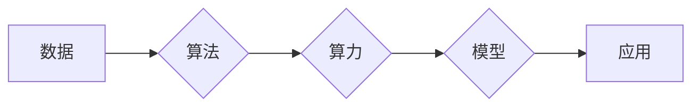

> 人工智能 (AI)
> 算法
> 算力
> 数据
> 深度学习
> 机器学习
> 计算机视觉

## 1. 背景介绍

人工智能 (AI) 作为科技发展的重要方向，近年来取得了令人瞩目的进展。从语音识别到图像识别，从自动驾驶到医疗诊断，AI技术正在深刻地改变着我们的生活。然而，AI的发展并非偶然，它背后蕴藏着三大核心动力源：算法、算力和数据。这三大要素相互依存、相互促进，共同推动着AI技术的不断进步。

## 2. 核心概念与联系

**2.1 算法**

算法是AI的核心驱动力，它指解决特定问题的步骤或规则。不同的算法适用于不同的任务，例如，用于图像识别的卷积神经网络算法，用于自然语言处理的循环神经网络算法，等等。

**2.2 算力**

算力是指计算机处理信息的速率和能力。AI算法的训练和运行都需要大量的计算资源，而强大的算力可以加速算法的训练速度，提高模型的精度和效率。

**2.3 数据**

数据是AI算法的燃料，它为算法提供学习和训练的素材。高质量的数据可以帮助AI模型更好地理解世界，提高预测和决策的准确性。

**2.4 三者之间的关系**

算法、算力和数据相互关联，共同构成了AI发展的基石。

* 数据为算法提供训练素材，算法通过学习数据，不断优化自身，提高性能。
* 算力为算法的训练和运行提供支持，强大的算力可以加速算法的训练速度，提高模型的精度和效率。
* 算法的进步可以更好地利用数据，提取更深层的特征，提高数据利用率。

**Mermaid 流程图**



## 3. 核心算法原理 & 具体操作步骤

### 3.1  算法原理概述

深度学习是目前AI领域最热门的算法之一，它模拟了人脑神经网络的结构和功能，通过多层神经网络进行特征提取和学习，从而实现对复杂数据的理解和处理。

### 3.2  算法步骤详解

1. **数据预处理:** 将原始数据进行清洗、转换和格式化，使其适合深度学习模型的训练。
2. **网络结构设计:** 根据具体任务选择合适的深度学习网络结构，例如卷积神经网络 (CNN) 用于图像识别，循环神经网络 (RNN) 用于自然语言处理。
3. **模型训练:** 使用训练数据训练深度学习模型，通过调整模型参数，使模型的预测结果与真实值尽可能接近。
4. **模型评估:** 使用测试数据评估模型的性能，例如准确率、召回率、F1-score等。
5. **模型调优:** 根据评估结果，调整模型参数或网络结构，进一步提高模型的性能。
6. **模型部署:** 将训练好的模型部署到实际应用场景中，用于进行预测或决策。

### 3.3  算法优缺点

**优点:**

* 能够处理复杂的数据，提取高层次的特征。
* 性能优异，在许多任务中取得了突破性的进展。
* 可迁移性强，可以应用于不同的领域和任务。

**缺点:**

* 训练数据量大，需要大量的计算资源和时间。
* 模型解释性差，难以理解模型的决策过程。
* 对数据质量要求高，数据噪声或偏差会影响模型性能。

### 3.4  算法应用领域

深度学习算法已广泛应用于各个领域，例如：

* **计算机视觉:** 图像识别、物体检测、图像分割、人脸识别等。
* **自然语言处理:** 文本分类、情感分析、机器翻译、对话系统等。
* **语音识别:** 语音转文本、语音助手等。
* **医疗诊断:** 疾病预测、图像分析、药物研发等。
* **金融分析:** 风险评估、欺诈检测、投资预测等。

## 4. 数学模型和公式 & 详细讲解 & 举例说明

### 4.1  数学模型构建

深度学习模型的核心是神经网络，它由多个层级的神经元组成。每个神经元接收来自上一层的输入信号，经过激活函数处理后，输出到下一层。

**神经网络模型数学表示:**

$$
y = f(W^L x^L + b^L)
$$

其中:

* $y$ 是输出值
* $x^L$ 是上一层神经元的输出值
* $W^L$ 是当前层的权重矩阵
* $b^L$ 是当前层的偏置向量
* $f$ 是激活函数

### 4.2  公式推导过程

深度学习模型的训练过程是通过反向传播算法来进行的。反向传播算法的核心思想是通过计算误差，反向传播到每一层，调整权重和偏置，使得模型的预测结果与真实值尽可能接近。

**反向传播算法公式:**

$$
\Delta W = \eta \frac{\partial Loss}{\partial W}
$$

$$
\Delta b = \eta \frac{\partial Loss}{\partial b}
$$

其中:

* $\Delta W$ 和 $\Delta b$ 是权重和偏置的更新量
* $\eta$ 是学习率
* $Loss$ 是损失函数，用于衡量模型的预测结果与真实值的差距

### 4.3  案例分析与讲解

例如，在图像识别任务中，深度学习模型可以学习到图像中不同物体特征的表示。通过训练大量的图像数据，模型可以识别出不同物体的类别，并进行分类。

## 5. 项目实践：代码实例和详细解释说明

### 5.1  开发环境搭建

使用Python语言开发深度学习项目，需要安装以下软件包:

* TensorFlow 或 PyTorch: 深度学习框架
* NumPy: 数值计算库
* Matplotlib: 数据可视化库

### 5.2  源代码详细实现

以下是一个使用TensorFlow实现图像分类的简单代码示例:

```python
import tensorflow as tf

# 定义模型结构
model = tf.keras.models.Sequential([
    tf.keras.layers.Conv2D(32, (3, 3), activation='relu', input_shape=(28, 28, 1)),
    tf.keras.layers.MaxPooling2D((2, 2)),
    tf.keras.layers.Conv2D(64, (3, 3), activation='relu'),
    tf.keras.layers.MaxPooling2D((2, 2)),
    tf.keras.layers.Flatten(),
    tf.keras.layers.Dense(10, activation='softmax')
])

# 编译模型
model.compile(optimizer='adam',
              loss='sparse_categorical_crossentropy',
              metrics=['accuracy'])

# 训练模型
model.fit(x_train, y_train, epochs=5)

# 评估模型
loss, accuracy = model.evaluate(x_test, y_test)
print('Test loss:', loss)
print('Test accuracy:', accuracy)
```

### 5.3  代码解读与分析

这段代码定义了一个简单的卷积神经网络模型，用于图像分类任务。模型包含两层卷积层、两层最大池化层、一层全连接层和一层输出层。

* 卷积层用于提取图像特征。
* 最大池化层用于降低特征维度，提高模型的鲁棒性。
* 全连接层用于将特征映射到类别输出。
* softmax 函数用于将输出值转换为概率分布。

### 5.4  运行结果展示

训练完成后，模型可以用于预测新的图像类别。

## 6. 实际应用场景

### 6.1  医疗诊断

深度学习算法可以用于辅助医生进行疾病诊断，例如，通过分析医学图像识别肿瘤、肺炎等疾病。

### 6.2  金融风险评估

深度学习算法可以用于评估金融风险，例如，识别欺诈交易、预测股票价格波动。

### 6.3  自动驾驶

深度学习算法是自动驾驶的核心技术之一，用于感知周围环境、规划路径、控制车辆。

### 6.4  未来应用展望

随着算法、算力和数据的不断发展，深度学习将在更多领域得到应用，例如：

* 个性化教育
* 智能家居
* 虚拟现实
* 人机交互

## 7. 工具和资源推荐

### 7.1  学习资源推荐

* **书籍:**
    * 深度学习 (Deep Learning) - Ian Goodfellow, Yoshua Bengio, Aaron Courville
    * 构建深度学习模型 (Hands-On Machine Learning with Scikit-Learn, Keras & TensorFlow) - Aurélien Géron
* **在线课程:**
    * TensorFlow 官方教程: https://www.tensorflow.org/tutorials
    * Coursera 深度学习课程: https://www.coursera.org/learn/deep-learning

### 7.2  开发工具推荐

* **TensorFlow:** https://www.tensorflow.org/
* **PyTorch:** https://pytorch.org/
* **Keras:** https://keras.io/

### 7.3  相关论文推荐

* **ImageNet Classification with Deep Convolutional Neural Networks** - Alex Krizhevsky, Ilya Sutskever, Geoffrey E. Hinton
* **Attention Is All You Need** - Ashish Vaswani, Noam Shazeer, Niki Parmar, Jakob Uszkoreit, Llion Jones, Aidan N. Gomez, Łukasz Kaiser, Illia Polosukhin

## 8. 总结：未来发展趋势与挑战

### 8.1  研究成果总结

近年来，深度学习算法取得了令人瞩目的进展，在图像识别、自然语言处理、语音识别等领域取得了突破性的成果。

### 8.2  未来发展趋势

* **模型更深、更广:** 研究更深层次、更广范围的神经网络结构，提高模型的表达能力和泛化能力。
* **数据更丰富、更智能:** 探索新的数据来源，利用数据增强技术提高数据质量，并研究数据智能化处理方法。
* **算力更强、更节能:** 开发更高效的计算硬件和算法，降低模型训练和运行的成本。
* **解释性更强:** 研究更易于理解的深度学习模型，提高模型的透明度和可信度。

### 8.3  面临的挑战

* **数据偏差:** 数据集中的偏差会影响模型的性能，需要研究如何构建更公平、更准确的数据集。
* **模型可解释性:** 深度学习模型的决策过程难以理解，需要研究如何提高模型的解释性。
* **安全性和隐私性:** 深度学习模型可能存在安全漏洞和隐私泄露风险，需要研究如何保障模型的安全性和隐私性。

### 8.4  研究展望

未来，深度学习技术将继续发展，并在更多领域发挥重要作用。我们需要加强基础理论研究，探索新的算法和模型，并关注深度学习技术的伦理和社会影响，确保其安全、可持续发展。

## 9. 附录：常见问题与解答

**Q1: 深度学习算法需要多少数据才能训练？**

A1: 深度学习算法对数据的需求量很大，一般来说，需要大量的标注数据才能训练出性能良好的模型。

**Q2: 深度学习算法的训练时间很长吗？**

A2: 深度学习算法的训练时间取决于模型的复杂度、数据的规模和算力的水平。训练大型模型可能需要数天甚至数周的时间。

**Q3: 深度学习算法的应用领域有哪些？**

A3: 深度学习算法已广泛应用于各个领域，例如计算机视觉、自然语言处理、语音识别、医疗诊断、金融分析等。


作者：禅与计算机程序设计艺术 / Zen and the Art of Computer Programming 
<end_of_turn>