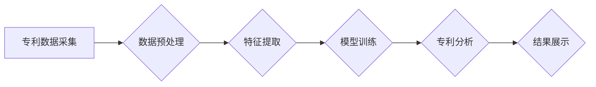

>  人工智能、专利分析、专利管理、机器学习、自然语言处理、知识图谱、数据挖掘

## 1. 背景介绍

在当今科技日新月异的时代，知识和技术的积累与创新成为企业和国家竞争力的关键。专利作为一种重要的知识产权，记录了创新的成果，也体现了企业的技术实力和市场竞争力。然而，传统的专利分析和管理方式往往面临着效率低下、信息获取困难、分析深度不足等问题。

随着人工智能（AI）技术的快速发展，其在专利分析与管理领域的应用逐渐受到重视。AI技术能够有效地处理海量专利数据，挖掘隐藏的知识和趋势，为企业和研究机构提供更精准、更深入的分析和决策支持。

## 2. 核心概念与联系

**2.1  专利分析**

专利分析是指对专利文献进行系统性的研究和分析，以获取专利技术信息、市场趋势、竞争对手情况等关键信息。传统的专利分析主要依赖于人工阅读和检索，效率低下，且难以处理海量数据。

**2.2  人工智能（AI）**

人工智能是指模拟人类智能行为的计算机系统。AI技术涵盖了机器学习、深度学习、自然语言处理、计算机视觉等多个领域。

**2.3  AI在专利分析中的应用**

AI技术能够有效地解决传统专利分析的痛点，其主要应用场景包括：

* **专利检索与分类:** 利用机器学习算法对专利文献进行自动分类和检索，提高检索效率和准确性。
* **专利技术分析:** 利用自然语言处理技术对专利文本进行分析，提取关键技术信息、发明内容、技术特征等，构建专利技术知识图谱。
* **专利趋势预测:** 利用数据挖掘技术分析专利数据，预测未来技术发展趋势和市场需求。
* **专利侵权风险评估:** 利用机器学习算法分析专利数据，识别潜在的侵权风险。

**2.4  AI专利分析流程**



## 3. 核心算法原理 & 具体操作步骤

**3.1  算法原理概述**

AI在专利分析中的核心算法主要包括：

* **机器学习算法:** 用于专利检索、分类、技术分析等任务。常见的机器学习算法包括支持向量机（SVM）、决策树、随机森林、神经网络等。
* **自然语言处理（NLP）算法:** 用于对专利文本进行分析，提取关键信息。常见的NLP算法包括词嵌入、文本分类、命名实体识别、关系抽取等。
* **数据挖掘算法:** 用于分析专利数据，发现隐藏的知识和趋势。常见的挖掘算法包括关联规则挖掘、聚类分析、异常检测等。

**3.2  算法步骤详解**

以专利检索为例，其具体操作步骤如下：

1. **数据采集:** 收集专利数据库中的专利文献数据。
2. **数据预处理:** 对专利数据进行清洗、格式化、标准化等处理，去除噪声和冗余信息。
3. **特征提取:** 从专利数据中提取特征，例如专利标题、摘要、关键词、技术领域等。
4. **模型训练:** 利用机器学习算法对专利数据进行训练，建立专利检索模型。
5. **专利检索:** 输入检索关键词，利用训练好的模型对专利数据库进行检索，返回与关键词相关的专利文献。

**3.3  算法优缺点**

**优点:**

* **提高效率:** 自动化专利检索和分析，大幅提高效率。
* **提升准确性:** 利用机器学习算法，提高检索和分析的准确性。
* **挖掘深度:** 能够挖掘隐藏的知识和趋势，提供更深入的分析。

**缺点:**

* **数据依赖:** 算法性能依赖于训练数据的质量和数量。
* **解释性:** 一些机器学习算法的决策过程难以解释。
* **技术门槛:** 需要一定的技术背景和经验才能开发和应用AI算法。

**3.4  算法应用领域**

AI在专利分析中的应用领域广泛，包括：

* **企业技术创新:** 帮助企业了解技术趋势、识别竞争对手、评估技术风险。
* **知识产权管理:** 帮助企业管理专利资产、识别侵权风险、制定专利策略。
* **科研成果转化:** 帮助科研机构挖掘专利价值、促进成果转化。
* **政策制定:** 帮助政府部门了解技术发展趋势、制定相关政策。

## 4. 数学模型和公式 & 详细讲解 & 举例说明

**4.1  数学模型构建**

在专利分析中，可以使用数学模型来表示专利之间的关系和相似度。例如，可以使用词嵌入技术将专利文本转换为向量表示，然后利用余弦相似度计算两个专利之间的相似度。

**4.2  公式推导过程**

假设有两个专利文本 $p_1$ 和 $p_2$，它们的词嵌入向量分别为 $v_1$ 和 $v_2$。余弦相似度公式如下：

$$
\text{相似度}(p_1, p_2) = \frac{v_1 \cdot v_2}{||v_1|| ||v_2||}
$$

其中，$v_1 \cdot v_2$ 表示两个向量的点积，$||v_1||$ 和 $||v_2||$ 分别表示两个向量的模长。

**4.3  案例分析与讲解**

假设有两个专利文本：

* $p_1$: “一种新型电池技术”
* $p_2$: “一种高性能锂离子电池”

如果这两个专利文本的词嵌入向量分别为 $v_1$ 和 $v_2$，并且 $v_1 \cdot v_2$ 大于 $||v_1|| ||v_2||$ 的一半，则说明这两个专利文本之间存在一定的相似度，可能涉及到相同的技术领域。

## 5. 项目实践：代码实例和详细解释说明

**5.1  开发环境搭建**

* Python 3.x
* Jupyter Notebook
* scikit-learn
* NLTK
* Gensim

**5.2  源代码详细实现**

```python
# 导入必要的库
import nltk
from sklearn.feature_extraction.text import TfidfVectorizer
from sklearn.metrics.pairwise import cosine_similarity

# 下载停用词列表
nltk.download('stopwords')

# 定义专利文本列表
patent_texts = [
    "一种新型电池技术",
    "一种高性能锂离子电池",
    "一种高效太阳能电池",
    "一种新型半导体材料"
]

# 使用TF-IDF向量化专利文本
vectorizer = TfidfVectorizer(stop_words='english')
patent_vectors = vectorizer.fit_transform(patent_texts)

# 计算专利之间的余弦相似度
similarity_matrix = cosine_similarity(patent_vectors)

# 打印相似度矩阵
print(similarity_matrix)
```

**5.3  代码解读与分析**

* 首先，导入必要的库，并下载停用词列表。
* 然后，定义专利文本列表。
* 使用TF-IDF向量化专利文本，将文本转换为数字向量。
* 计算专利之间的余弦相似度，得到相似度矩阵。
* 最后，打印相似度矩阵。

**5.4  运行结果展示**

运行代码后，会输出一个相似度矩阵，其中每个元素表示两个专利之间的相似度。相似度值越大，表示两个专利之间的相似度越高。

## 6. 实际应用场景

**6.1  企业技术创新**

* **技术趋势分析:** 利用AI分析专利数据，识别未来技术发展趋势，帮助企业制定技术创新战略。
* **竞争对手分析:** 分析竞争对手的专利布局，了解其技术实力和发展方向，制定相应的应对策略。
* **技术风险评估:** 识别潜在的技术风险，帮助企业避免技术陷阱。

**6.2  知识产权管理**

* **专利检索与分类:** 利用AI自动检索和分类专利文献，提高效率和准确性。
* **专利侵权风险评估:** 分析专利数据，识别潜在的侵权风险，帮助企业避免法律纠纷。
* **专利价值评估:** 利用AI分析专利数据，评估专利价值，帮助企业制定专利策略。

**6.3  科研成果转化**

* **专利挖掘:** 从科研成果中挖掘潜在的专利价值，促进成果转化。
* **专利申请:** 利用AI辅助撰写专利申请文件，提高申请成功率。
* **专利授权:** 分析专利授权情况，制定相应的授权策略。

**6.4  未来应用展望**

随着AI技术的不断发展，其在专利分析与管理领域的应用将更加广泛和深入。未来，AI将能够：

* 更准确地理解专利文本，提取更丰富的技术信息。
* 更深入地分析专利数据，发现更隐蔽的知识和趋势。
* 更智能地辅助专利分析和管理工作，提高效率和效益。

## 7. 工具和资源推荐

**7.1  学习资源推荐**

* **书籍:**
    * 《深度学习》
    * 《自然语言处理》
    * 《机器学习实战》
* **在线课程:**
    * Coursera
    * edX
    * Udacity

**7.2  开发工具推荐**

* **Python:** 
    * scikit-learn
    * NLTK
    * Gensim
* **其他工具:**
    * Elasticsearch
    * MongoDB

**7.3  相关论文推荐**

* **专利检索与分类:**
    * "A Survey of Patent Retrieval and Classification Techniques"
* **专利技术分析:**
    * "Patent Text Mining: A Survey"
* **专利趋势预测:**
    * "Predicting Future Patent Trends Using Machine Learning"

## 8. 总结：未来发展趋势与挑战

**8.1  研究成果总结**

AI在专利分析与管理领域的应用取得了显著的成果，能够有效提高效率、提升准确性、挖掘深度。

**8.2  未来发展趋势**

未来，AI在专利分析与管理领域的应用将更加智能化、自动化、个性化。

* **更智能的分析:** 利用深度学习等更先进的算法，更准确地理解专利文本，提取更丰富的技术信息。
* **更自动化的工作流程:** 利用AI自动化专利检索、分类、分析等工作流程，提高效率和降低成本。
* **更个性化的服务:** 根据用户的需求，提供个性化的专利分析和管理服务。

**8.3  面临的挑战**

* **数据质量:** AI算法的性能依赖于训练数据的质量和数量。
* **算法解释性:** 一些机器学习算法的决策过程难以解释，难以获得用户的信任。
* **技术门槛:** 开发和应用AI算法需要一定的技术背景和经验。

**8.4  研究展望**

未来，需要继续加强AI在专利分析与管理领域的研发，解决上述挑战，推动AI技术在该领域的应用更加广泛和深入。

## 9. 附录：常见问题与解答

**9.1  AI能否完全替代人工专利分析师？**

目前，AI技术还无法完全替代人工专利分析师。AI擅长处理海量数据、识别模式和趋势，但缺乏人类的创造力和批判性思维。人工专利分析师仍然需要在AI辅助下进行分析和判断，并提供专业意见和建议。

**9.2  如何选择合适的AI专利分析工具？**

选择合适的AI专利分析工具需要根据用户的需求和预算进行选择。一些常用的工具包括：

* **Google Patents:** 提供免费的专利检索和分析服务。
* **Espacenet:** 欧盟专利局的专利数据库，提供免费的专利检索和分析服务。
* **PatSnap:** 商业化的专利分析平台，提供更深入的分析功能。

**9.3  如何评估AI专利分析工具的性能？**

评估AI专利分析工具的性能可以从以下几个方面进行：

* **检索准确率:** 工具能够准确地检索到与关键词相关的专利文献。
* **分析深度:** 工具能够提取专利文本中的关键信息，并进行深入的分析。
* **用户体验:** 工具的界面友好，操作简单，易于使用。


作者：禅