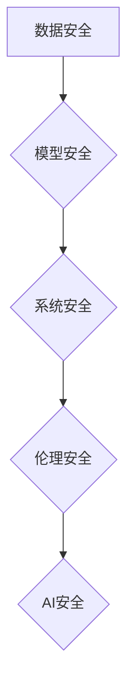

> AI安全, 伦理, 算法, 代码, 安全机制, 威胁模型, 攻击防御, 责任, 透明度

## 1. 背景介绍

人工智能（AI）技术近年来发展迅速，已广泛应用于各个领域，从医疗保健到金融，从自动驾驶到智能家居。然而，随着AI技术的应用越来越广泛，其安全问题也日益凸显。AI系统的安全漏洞可能导致各种风险，例如数据泄露、隐私侵犯、算法偏见、系统操纵等。因此，研究和开发AI安全技术至关重要，以确保AI技术的安全、可靠和可信赖。

## 2. 核心概念与联系

**2.1 AI安全概念**

AI安全是指确保人工智能系统在设计、开发、部署和使用过程中，能够安全、可靠、可控和负责任地运行，并避免潜在的风险和危害。

**2.2 AI安全威胁模型**

威胁模型是识别和分析潜在的AI安全威胁的一种方法。常见的AI安全威胁包括：

* **数据 poisoning:** 攻击者通过注入恶意数据来训练AI模型，从而导致模型产生错误或不可预知的输出。
* **模型攻击:** 攻击者通过修改模型的输入数据或参数来欺骗模型，使其产生错误的输出。
* **隐私泄露:** AI系统可能收集和处理大量敏感数据，攻击者可能利用漏洞窃取这些数据。
* **算法偏见:** AI模型可能存在算法偏见，导致其对不同群体产生不公平或歧视性的结果。

**2.3 AI安全机制**

AI安全机制是指用于防御AI安全威胁的技术和方法。常见的AI安全机制包括：

* **数据安全:** 通过加密、脱敏等技术保护数据安全。
* **模型安全:** 通过模型验证、模型健壮性测试等技术确保模型安全。
* **系统安全:** 通过访问控制、身份验证等技术保护AI系统的安全。
* **伦理安全:** 通过制定AI伦理准则和政策来确保AI技术的负责任使用。

**2.4 Mermaid 流程图**



## 3. 核心算法原理 & 具体操作步骤

**3.1 算法原理概述**

本节将介绍一种常用的AI安全算法，例如对抗训练算法。对抗训练是一种用于增强AI模型鲁棒性的技术。它通过在训练过程中添加对抗样本来训练模型，对抗样本是经过精心设计，能够欺骗模型的输入数据。通过对抗训练，模型能够学习识别和抵抗对抗样本，从而提高其鲁棒性。

**3.2 算法步骤详解**

1. **生成对抗样本:** 使用梯度攻击等方法生成对抗样本，这些样本与真实数据相近，但能够欺骗模型。
2. **训练模型:** 使用真实数据和对抗样本一起训练模型。
3. **评估模型性能:** 在测试集上评估模型的性能，包括其在真实数据和对抗样本上的准确率。
4. **重复步骤1-3:** 重复上述步骤，直到模型的性能达到预期水平。

**3.3 算法优缺点**

**优点:**

* 可以有效提高模型的鲁棒性。
* 相对简单易实现。

**缺点:**

* 需要大量的计算资源。
* 可能导致模型在真实数据上的性能下降。

**3.4 算法应用领域**

对抗训练算法广泛应用于各种AI领域，例如：

* **计算机视觉:** 提高图像识别、目标检测等任务的鲁棒性。
* **自然语言处理:** 提高文本分类、情感分析等任务的鲁棒性。
* **安全领域:** 检测和防御恶意软件攻击。

## 4. 数学模型和公式 & 详细讲解 & 举例说明

**4.1 数学模型构建**

对抗训练算法可以看作是一个优化问题。目标是找到一个模型参数，使得模型在真实数据和对抗样本上的性能都达到最佳。

**4.2 公式推导过程**

假设模型的输出为 $f(x)$，其中 $x$ 是输入数据。对抗样本 $x'$ 是通过以下公式生成的：

$$x' = x + \epsilon \cdot \operatorname{sign}(\nabla_x f(x))$$

其中 $\epsilon$ 是一个小的扰动值， $\operatorname{sign}$ 函数返回输入值的符号。

**4.3 案例分析与讲解**

例如，在图像识别任务中，对抗样本可以是经过微小扰动后的图像，这些扰动对人类视觉几乎不可察觉，但可以导致模型识别错误。

## 5. 项目实践：代码实例和详细解释说明

**5.1 开发环境搭建**

本节将使用Python语言和TensorFlow框架实现对抗训练算法。

**5.2 源代码详细实现**

```python
import tensorflow as tf

# 定义模型
model = tf.keras.models.Sequential([
    tf.keras.layers.Conv2D(32, (3, 3), activation='relu', input_shape=(28, 28, 1)),
    tf.keras.layers.MaxPooling2D((2, 2)),
    tf.keras.layers.Flatten(),
    tf.keras.layers.Dense(10, activation='softmax')
])

# 定义损失函数和优化器
loss_fn = tf.keras.losses.SparseCategoricalCrossentropy()
optimizer = tf.keras.optimizers.Adam()

# 定义对抗训练步骤
def adversarial_training_step(images, labels):
    with tf.GradientTape() as tape:
        predictions = model(images)
        loss = loss_fn(labels, predictions)
    gradients = tape.gradient(loss, model.trainable_variables)
    optimizer.apply_gradients(zip(gradients, model.trainable_variables))

# 训练模型
for epoch in range(10):
    for images, labels in train_dataset:
        adversarial_training_step(images, labels)

```

**5.3 代码解读与分析**

代码首先定义了一个简单的卷积神经网络模型。然后，定义了损失函数和优化器。

对抗训练步骤使用梯度攻击方法生成对抗样本，并使用这些样本训练模型。

**5.4 运行结果展示**

训练完成后，可以评估模型在真实数据和对抗样本上的性能。

## 6. 实际应用场景

**6.1 医疗诊断**

AI系统可以辅助医生进行疾病诊断，但需要确保其在处理患者数据时安全可靠。

**6.2 自动驾驶**

自动驾驶系统需要能够识别和应对各种道路场景，包括潜在的威胁。

**6.3 金融交易**

AI系统可以用于金融交易，但需要防止其被攻击者利用进行欺诈。

**6.4 未来应用展望**

随着AI技术的不断发展，其应用场景将更加广泛，AI安全也将变得更加重要。

## 7. 工具和资源推荐

**7.1 学习资源推荐**

* **书籍:**

    * "AI Safety: A Comprehensive Introduction" by Stuart Russell
    * "The Alignment Problem: Machine Learning and Human Values" by Brian Christian

* **在线课程:**

    * Coursera: "AI Safety" by DeepMind
    * edX: "AI Ethics" by MIT

**7.2 开发工具推荐**

* **TensorFlow:** 一个开源的机器学习框架。
* **PyTorch:** 另一个开源的机器学习框架。
* **OpenAI Gym:** 一个用于强化学习的开源库。

**7.3 相关论文推荐**

* "Intriguing Properties of Neural Networks" by Szegedy et al.
* "Adversarial Examples in the Physical World" by Eykholt et al.

## 8. 总结：未来发展趋势与挑战

**8.1 研究成果总结**

近年来，AI安全领域取得了显著进展，例如对抗训练算法、联邦学习等技术。

**8.2 未来发展趋势**

未来，AI安全研究将更加注重以下方面：

* **可解释性:** 使AI模型的决策过程更加透明可解释。
* **鲁棒性:** 使AI模型能够抵抗各种攻击和干扰。
* **公平性:** 确保AI模型对所有群体都公平公正。

**8.3 面临的挑战**

AI安全研究还面临着许多挑战，例如：

* **复杂性:** AI系统非常复杂，难以全面分析其安全风险。
* **动态性:** AI技术不断发展，新的安全威胁不断涌现。
* **伦理问题:** AI安全与伦理问题密切相关，需要进行深入探讨。

**8.4 研究展望**

未来，AI安全研究需要跨学科合作，结合人工智能、计算机科学、伦理学等领域的知识，才能有效应对AI安全挑战。

## 9. 附录：常见问题与解答

**9.1 如何评估AI模型的安全性能？**

可以使用各种方法评估AI模型的安全性能，例如对抗测试、健壮性测试、隐私保护测试等。

**9.2 如何防止AI模型被攻击？**

可以使用各种技术来防止AI模型被攻击，例如对抗训练、数据加密、模型隐藏等。

**9.3 如何确保AI模型的公平性？**

可以通过多种方法来确保AI模型的公平性，例如使用公平性指标、数据预处理、模型调优等。


作者：禅与计算机程序设计艺术 / Zen and the Art of Computer Programming 
<end_of_turn>