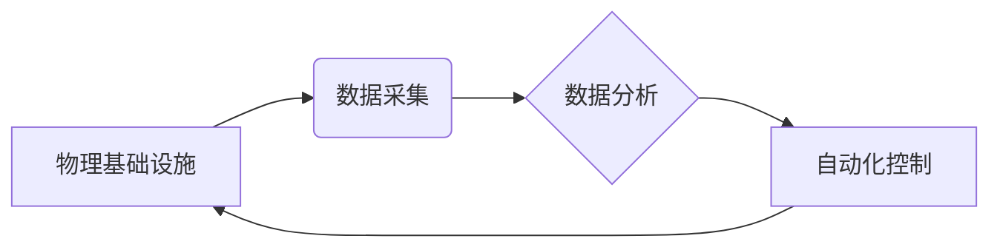

> AI、自动化、物理基础设施、机器学习、深度学习、云计算、数据中心、运维

## 1. 背景介绍

随着人工智能 (AI) 技术的飞速发展，其应用场景不断拓展，对计算资源的需求也呈指数级增长。传统的人工管理物理基础设施已经难以满足日益增长的需求，效率低下、成本高昂、维护复杂等问题日益突出。因此，利用 AI 技术自动管理物理基础设施，提高效率、降低成本、增强可靠性，成为当前技术发展的重要趋势。

AI 自动化物理基础设施 (AI-powered Physical Infrastructure Automation) 指利用人工智能技术，对物理基础设施进行智能化管理，包括服务器、网络设备、存储系统、电源系统等。通过机器学习、深度学习等算法，AI 系统可以自动识别、分析和预测物理基础设施的运行状态，并根据预设规则或学习到的知识，自动执行相应的管理操作，例如：

* **资源调度和优化:** 根据实时负载情况，智能分配资源，提高资源利用率。
* **故障预测和预防:** 通过分析设备运行数据，预测潜在故障，并提前采取措施进行预防。
* **性能监控和优化:** 实时监控设备性能，识别性能瓶颈，并自动调整配置，优化系统性能。
* **安全管理:** 识别和防御网络攻击，保护物理基础设施安全。

## 2. 核心概念与联系

AI 自动化物理基础设施的核心概念包括：

* **物理基础设施:** 指硬件设备和软件系统，包括服务器、网络设备、存储系统、电源系统、制冷系统等。
* **人工智能:** 指能够模拟人类智能行为的计算机系统，包括机器学习、深度学习、自然语言处理等技术。
* **数据采集和分析:** 通过传感器、监控系统等收集物理基础设施运行数据，并利用机器学习算法进行分析和预测。
* **自动化控制:** 根据数据分析结果，自动执行相应的管理操作，例如资源调度、故障修复、性能优化等。

**核心概念架构图:**



## 3. 核心算法原理 & 具体操作步骤

### 3.1  算法原理概述

AI 自动化物理基础设施主要利用以下核心算法：

* **机器学习:** 通过训练模型，从数据中学习规律，实现对物理基础设施运行状态的预测和分析。
* **深度学习:** 利用多层神经网络，对复杂数据进行更深入的学习和分析，提高预测精度。
* **强化学习:** 通过试错学习，让 AI 系统在物理基础设施管理中不断优化策略，提高效率。

### 3.2  算法步骤详解

**以机器学习为例，详细说明其在 AI 自动化物理基础设施中的应用步骤:**

1. **数据收集:** 收集物理基础设施运行数据，例如 CPU 使用率、内存使用率、网络流量、温度、湿度等。
2. **数据预处理:** 对收集到的数据进行清洗、转换、归一化等处理，使其适合机器学习模型训练。
3. **模型选择:** 根据具体应用场景，选择合适的机器学习模型，例如线性回归、决策树、支持向量机等。
4. **模型训练:** 利用预处理后的数据，训练选择的机器学习模型，使其能够学习物理基础设施运行的规律。
5. **模型评估:** 使用测试数据评估模型的性能，例如准确率、召回率、F1-score等。
6. **模型部署:** 将训练好的模型部署到生产环境中，用于对物理基础设施进行实时监控和预测。

### 3.3  算法优缺点

**机器学习算法的优缺点:**

* **优点:** 能够从数据中学习复杂规律，预测未来趋势，自动化程度高。
* **缺点:** 需要大量的数据进行训练，训练时间长，对数据质量要求高，解释性较差。

### 3.4  算法应用领域

机器学习算法在 AI 自动化物理基础设施中的应用领域广泛，例如：

* **资源调度和优化:** 根据预测的负载情况，智能分配资源，提高资源利用率。
* **故障预测和预防:** 通过分析设备运行数据，预测潜在故障，并提前采取措施进行预防。
* **性能监控和优化:** 实时监控设备性能，识别性能瓶颈，并自动调整配置，优化系统性能。
* **安全管理:** 识别和防御网络攻击，保护物理基础设施安全。

## 4. 数学模型和公式 & 详细讲解 & 举例说明

### 4.1  数学模型构建

**资源调度优化模型:**

假设物理基础设施有 N 台服务器，每个服务器有 M 个 CPU 核，负载为 L。目标是将任务分配到服务器上，使资源利用率最大化。

可以构建以下数学模型：

* **目标函数:** 最大化资源利用率，即最大化所有服务器 CPU 核的总使用率。
* **约束条件:** 每个任务的 CPU 需求必须满足，每个服务器的 CPU 核数有限。

### 4.2  公式推导过程

资源利用率可以表示为：

$$
Utilization = \frac{Total CPU Usage}{Total CPU Capacity}
$$

其中：

* Total CPU Usage: 所有服务器 CPU 核的总使用率。
* Total CPU Capacity: 所有服务器 CPU 核的总容量。

### 4.3  案例分析与讲解

**举例说明:**

假设有 3 台服务器，每台服务器有 4 个 CPU 核，负载为 20、15、10。

利用资源调度优化模型，可以将任务分配到服务器上，使资源利用率最大化。例如，可以将 20 的负载分配到第一台服务器，15 的负载分配到第二台服务器，10 的负载分配到第三台服务器。

## 5. 项目实践：代码实例和详细解释说明

### 5.1  开发环境搭建

* 操作系统: Ubuntu 20.04
* Python 版本: 3.8
* 必要的库: TensorFlow, PyTorch, scikit-learn

### 5.2  源代码详细实现

```python
# 导入必要的库
import tensorflow as tf

# 定义模型结构
model = tf.keras.models.Sequential([
    tf.keras.layers.Dense(64, activation='relu', input_shape=(10,)),
    tf.keras.layers.Dense(32, activation='relu'),
    tf.keras.layers.Dense(1)
])

# 编译模型
model.compile(optimizer='adam', loss='mse')

# 训练模型
model.fit(X_train, y_train, epochs=10)

# 评估模型
loss = model.evaluate(X_test, y_test)
print('Loss:', loss)
```

### 5.3  代码解读与分析

* 代码首先导入必要的库，例如 TensorFlow。
* 然后定义模型结构，使用多层神经网络，包括输入层、隐藏层和输出层。
* 接着编译模型，选择优化器、损失函数等参数。
* 训练模型，使用训练数据进行训练，并设置训练轮数。
* 最后评估模型，使用测试数据评估模型的性能。

### 5.4  运行结果展示

训练完成后，可以查看模型的损失值，以及在测试数据上的预测结果。

## 6. 实际应用场景

AI 自动化物理基础设施已在许多领域得到应用，例如：

* **云计算:** 自动管理云服务器、网络设备、存储系统等，提高资源利用率和服务质量。
* **数据中心:** 自动监控和管理数据中心环境，优化能源消耗和降低运营成本。
* **企业IT:** 自动管理企业内部的服务器、网络设备、存储系统等，提高IT运维效率。

### 6.4  未来应用展望

AI 自动化物理基础设施的未来应用前景广阔，例如：

* **更智能的自动化:** 利用更先进的 AI 算法，实现更智能的自动化管理，例如自动故障修复、自动性能优化等。
* **更个性化的服务:** 根据用户的需求，提供个性化的物理基础设施管理服务。
* **更安全的管理:** 利用 AI 技术，加强物理基础设施的安全防护，防止网络攻击和数据泄露。

## 7. 工具和资源推荐

### 7.1  学习资源推荐

* **书籍:**
    * "Hands-On Machine Learning with Scikit-Learn, Keras & TensorFlow" by Aurélien Géron
    * "Deep Learning" by Ian Goodfellow, Yoshua Bengio, and Aaron Courville
* **在线课程:**
    * Coursera: Machine Learning by Andrew Ng
    * Udacity: Deep Learning Nanodegree

### 7.2  开发工具推荐

* **TensorFlow:** 开源深度学习框架
* **PyTorch:** 开源深度学习框架
* **Kubernetes:** 用于容器编排和管理的开源平台

### 7.3  相关论文推荐

* "AutoML-Zero: Evolving Machine Learning Algorithms from Scratch"
* "Deep Reinforcement Learning for Resource Management in Data Centers"

## 8. 总结：未来发展趋势与挑战

### 8.1  研究成果总结

AI 自动化物理基础设施的研究取得了显著成果，例如：

* 开发出多种用于物理基础设施管理的 AI 算法。
* 建立了多种用于物理基础设施管理的平台和工具。
* 在云计算、数据中心等领域取得了实际应用。

### 8.2  未来发展趋势

未来 AI 自动化物理基础设施的发展趋势包括：

* **更智能的自动化:** 利用更先进的 AI 算法，实现更智能的自动化管理。
* **更个性化的服务:** 根据用户的需求，提供个性化的物理基础设施管理服务。
* **更安全的管理:** 利用 AI 技术，加强物理基础设施的安全防护。

### 8.3  面临的挑战

AI 自动化物理基础设施的发展也面临一些挑战，例如：

* **数据质量问题:** AI 算法对数据质量要求高，需要高质量的数据进行训练。
* **模型解释性问题:** 许多 AI 算法的决策过程难以解释，这可能会导致信任问题。
* **安全风险问题:** AI 系统可能存在安全漏洞，需要加强安全防护。

### 8.4  研究展望

未来研究方向包括：

* 开发更鲁棒、更安全的 AI 算法。
* 研究如何提高 AI 算法的解释性。
* 研究如何将 AI 技术应用于更广泛的物理基础设施管理场景。

## 9. 附录：常见问题与解答

**常见问题:**

* AI 自动化物理基础设施的成本如何？
* AI 自动化物理基础设施的安全性如何？
* AI 自动化物理基础设施的实施难度如何？

**解答:**

* AI 自动化物理基础设施的成本取决于具体应用场景和规模，但总体来说，可以降低运营成本和提高资源利用率。
* AI 自动化物理基础设施的安全性需要通过多种措施保障，例如数据加密、身份验证、访问控制等。
* AI 自动化物理基础设施的实施难度取决于具体应用场景和组织的 IT 基础设施水平，需要根据实际情况进行规划和实施。


作者：禅与计算机程序设计艺术 / Zen and the Art of Computer Programming 
<end_of_turn>