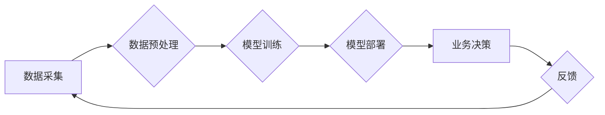

> AI, ERP, 优化, 机器学习, 深度学习, 自然语言处理, 预见性分析

## 1. 背景介绍

企业资源规划 (ERP) 系统是现代企业管理的核心，它整合了企业的财务、人力资源、生产、销售等各个部门的信息，为企业提供全面的管理视角和决策支持。然而，传统的ERP系统往往面临着以下挑战：

* **数据孤岛问题:** 不同部门的数据分散存储，难以进行整合和分析。
* **决策效率低下:**  ERP系统提供的报表和分析功能相对静态，难以满足企业对实时、动态决策的需求。
* **缺乏预测能力:**  传统的ERP系统主要关注历史数据，难以对未来趋势进行预测和预警。

随着人工智能 (AI) 技术的快速发展，AI驱动的ERP系统逐渐成为企业数字化转型的重要方向。AI技术能够有效解决传统ERP系统面临的挑战，提升企业运营效率、降低成本、增强竞争力。

## 2. 核心概念与联系

**2.1  AI驱动的ERP系统**

AI驱动的ERP系统是指将人工智能技术融入到ERP系统中，利用机器学习、深度学习、自然语言处理等技术，实现对企业数据的智能分析、预测和决策支持。

**2.2  核心概念**

* **机器学习 (Machine Learning):**  通过算法训练，使系统能够从数据中学习，并对新数据进行预测或分类。
* **深度学习 (Deep Learning):**  一种更高级的机器学习方法，利用多层神经网络模拟人类大脑的学习过程，能够处理更复杂的数据和任务。
* **自然语言处理 (Natural Language Processing):**  使计算机能够理解和处理人类语言，例如文本分析、语音识别等。

**2.3  架构图**



## 3. 核心算法原理 & 具体操作步骤

**3.1  算法原理概述**

AI驱动的ERP系统通常采用以下核心算法：

* **预测分析算法:**  例如ARIMA、LSTM等，用于预测未来需求、库存、销售额等。
* **分类算法:**  例如决策树、支持向量机等，用于分类客户、产品、订单等。
* **聚类算法:**  例如K-means、DBSCAN等，用于将数据进行分组，例如客户细分、产品推荐等。

**3.2  算法步骤详解**

以预测分析算法为例，其具体步骤如下：

1. **数据采集:** 从ERP系统中收集相关数据，例如历史销售数据、市场趋势数据、季节性因素等。
2. **数据预处理:** 对数据进行清洗、转换、特征工程等处理，使其适合模型训练。
3. **模型选择:** 根据预测任务选择合适的算法模型，例如ARIMA、LSTM等。
4. **模型训练:** 使用训练数据训练模型，调整模型参数，使其能够准确预测未来值。
5. **模型评估:** 使用测试数据评估模型的预测精度，例如均方误差、R-squared等指标。
6. **模型部署:** 将训练好的模型部署到ERP系统中，用于实时预测和决策支持。

**3.3  算法优缺点**

* **优点:** 能够自动学习数据模式，提高预测精度，提供实时决策支持。
* **缺点:** 需要大量数据进行训练，模型训练过程复杂，需要专业人员进行操作和维护。

**3.4  算法应用领域**

* **需求预测:**  预测未来产品需求，优化库存管理。
* **销售预测:**  预测未来销售额，制定销售策略。
* **风险预测:**  预测潜在的风险，采取预警措施。
* **客户行为预测:**  预测客户的购买行为，提供个性化服务。

## 4. 数学模型和公式 & 详细讲解 & 举例说明

**4.1  数学模型构建**

以ARIMA模型为例，其数学模型可以表示为：

$$
y_t = c + \sum_{i=1}^p \phi_i y_{t-i} + \sum_{j=1}^q \theta_j \epsilon_{t-j} + \epsilon_t
$$

其中：

* $y_t$：时间t的预测值
* $c$：常数项
* $\phi_i$：自回归系数
* $p$：自回归阶数
* $\theta_j$：移动平均系数
* $q$：移动平均阶数
* $\epsilon_t$：白噪声

**4.2  公式推导过程**

ARIMA模型的推导过程较为复杂，涉及时间序列分析、统计学等知识。

**4.3  案例分析与讲解**

假设一家服装公司想要预测未来三个月的销售额，可以使用ARIMA模型进行预测。首先需要收集历史销售数据，然后根据数据特征选择合适的ARIMA模型参数 (p, d, q)。最后，使用训练好的模型预测未来三个月的销售额。

## 5. 项目实践：代码实例和详细解释说明

**5.1  开发环境搭建**

* Python 3.x
* Jupyter Notebook
* pandas
* statsmodels
* matplotlib

**5.2  源代码详细实现**

```python
import pandas as pd
from statsmodels.tsa.arima.model import ARIMA
from matplotlib import pyplot as plt

# 加载数据
data = pd.read_csv('sales_data.csv', index_col='Date')

# 训练模型
model = ARIMA(data['Sales'], order=(5, 1, 0))
model_fit = model.fit()

# 预测未来三个月
forecast = model_fit.predict(start=len(data), end=len(data) + 2)

# 可视化结果
plt.plot(data['Sales'], label='实际销售')
plt.plot(forecast, label='预测销售')
plt.legend()
plt.show()
```

**5.3  代码解读与分析**

* 首先，使用pandas库加载销售数据。
* 然后，使用statsmodels库的ARIMA模型进行训练。
* 训练模型后，使用predict方法预测未来三个月的销售额。
* 最后，使用matplotlib库可视化预测结果。

**5.4  运行结果展示**

运行代码后，会生成一个图表，展示实际销售数据和预测销售数据。

## 6. 实际应用场景

AI驱动的ERP系统已在多个行业得到应用，例如：

* **制造业:**  优化生产计划、预测设备故障、提高生产效率。
* **零售业:**  预测商品需求、优化库存管理、个性化推荐。
* **金融业:**  风险评估、欺诈检测、客户服务自动化。

**6.4  未来应用展望**

随着AI技术的不断发展，AI驱动的ERP系统将更加智能化、个性化、自动化。未来，AI驱动的ERP系统将能够：

* 更准确地预测未来趋势，提供更精准的决策支持。
* 更深入地理解企业业务，提供更个性化的解决方案。
* 更智能地自动化流程，提高运营效率。

## 7. 工具和资源推荐

**7.1  学习资源推荐**

* **书籍:**
    * 《深度学习》
    * 《机器学习实战》
    * 《Python数据科学手册》
* **在线课程:**
    * Coursera
    * edX
    * Udacity

**7.2  开发工具推荐**

* **Python:**  数据分析、机器学习、深度学习
* **R:**  统计分析、数据可视化
* **TensorFlow:**  深度学习框架
* **PyTorch:**  深度学习框架

**7.3  相关论文推荐**

* **AI驱动的ERP系统综述**
* **基于机器学习的ERP系统预测分析**
* **深度学习在ERP系统中的应用**

## 8. 总结：未来发展趋势与挑战

**8.1  研究成果总结**

AI驱动的ERP系统已取得了显著的成果，能够有效提升企业运营效率、降低成本、增强竞争力。

**8.2  未来发展趋势**

* **更智能化:**  利用更先进的AI算法，实现更精准的预测和决策支持。
* **更个性化:**  根据企业具体需求，提供定制化的解决方案。
* **更自动化:**  自动化更多业务流程，提高运营效率。

**8.3  面临的挑战**

* **数据质量:**  AI模型的性能依赖于数据质量，需要保证数据的准确性和完整性。
* **模型解释性:**  一些AI模型的决策过程难以解释，需要提高模型的透明度和可解释性。
* **人才缺口:**  AI驱动的ERP系统需要专业的技术人才，人才缺口是一个亟待解决的问题。

**8.4  研究展望**

未来，研究者将继续探索更先进的AI算法，提高AI驱动的ERP系统的智能化、个性化和自动化程度。同时，也将关注数据质量、模型解释性和人才培养等问题，推动AI驱动的ERP系统健康发展。

## 9. 附录：常见问题与解答

**9.1  AI驱动的ERP系统与传统ERP系统有什么区别？**

AI驱动的ERP系统利用人工智能技术，能够自动学习数据模式，提供更精准的预测和决策支持，而传统ERP系统主要依赖人工操作和规则设定。

**9.2  AI驱动的ERP系统需要哪些技术支持？**

AI驱动的ERP系统需要数据分析、机器学习、深度学习、自然语言处理等技术支持。

**9.3  如何选择合适的AI算法？**

选择合适的AI算法需要根据具体的业务需求和数据特征进行分析。

**9.4  AI驱动的ERP系统有哪些应用场景？**

AI驱动的ERP系统已在制造业、零售业、金融业等多个行业得到应用。

**9.5  AI驱动的ERP系统有哪些挑战？**

AI驱动的ERP系统面临着数据质量、模型解释性和人才缺口等挑战。


作者：禅与计算机程序设计艺术 / Zen and the Art of Computer Programming 
<end_of_turn>