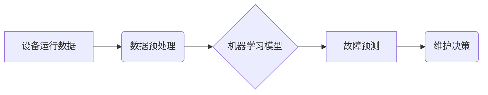

> 预测性维护，人工智能，机器学习，设备故障，数据分析，风险降低

## 1. 背景介绍

在当今数字化时代，工业设备的可靠性和可用性至关重要。设备故障不仅会导致生产停滞，还会带来巨大的经济损失和安全隐患。传统的维护模式，例如预防性维护和故障维修，往往存在成本高、效率低、资源浪费等问题。

预测性维护 (Predictive Maintenance) 作为一种新兴的维护模式，利用人工智能 (AI) 和机器学习 (ML) 技术，通过对设备运行数据的分析和预测，提前识别潜在的故障风险，从而实现设备的优化运行和故障的有效预防。

## 2. 核心概念与联系

预测性维护的核心概念是利用数据驱动的方式，通过分析设备运行数据中的模式和异常，预测设备的未来状态，从而实现故障的提前预警和预防。

**核心概念:**

* **设备运行数据:** 包括传感器数据、日志数据、历史维护记录等，这些数据反映了设备的运行状态和历史行为。
* **机器学习模型:** 利用算法从设备运行数据中学习模式和规律，建立预测模型，用于预测设备的未来状态。
* **故障预测:** 根据机器学习模型的预测结果，识别潜在的故障风险，并给出预警信息。

**架构图:**



## 3. 核心算法原理 & 具体操作步骤

### 3.1  算法原理概述

预测性维护中常用的机器学习算法包括：

* **监督学习:** 利用已知故障和正常运行数据的样本，训练模型进行故障预测。例如，分类算法（如逻辑回归、支持向量机）和回归算法（如线性回归、决策树）。
* **无监督学习:** 利用设备运行数据的特征，发现异常模式，识别潜在的故障风险。例如，聚类算法（如k-means聚类）和异常检测算法（如Isolation Forest）。
* **强化学习:** 通过与环境交互，学习最优的维护策略，以最大化设备的可用性和最小化维护成本。

### 3.2  算法步骤详解

**以监督学习为例，具体操作步骤如下:**

1. **数据收集:** 收集设备运行数据，包括传感器数据、日志数据、历史维护记录等。
2. **数据预处理:** 对收集到的数据进行清洗、转换、特征提取等操作，以提高模型的训练效果。
3. **模型选择:** 根据具体应用场景和数据特点，选择合适的机器学习算法。
4. **模型训练:** 利用训练数据，训练选择的机器学习模型。
5. **模型评估:** 利用测试数据，评估模型的预测性能，并进行模型调优。
6. **模型部署:** 将训练好的模型部署到生产环境中，用于实时预测设备故障风险。

### 3.3  算法优缺点

**监督学习:**

* **优点:** 预测精度高，能够准确识别故障风险。
* **缺点:** 需要大量的标注数据，数据标注成本高。

**无监督学习:**

* **优点:** 不需要标注数据，能够发现隐藏的异常模式。
* **缺点:** 预测精度相对较低，难以识别特定类型的故障。

**强化学习:**

* **优点:** 可以学习最优的维护策略，提高设备的可用性。
* **缺点:** 训练复杂，需要大量的环境交互数据。

### 3.4  算法应用领域

预测性维护算法广泛应用于各个行业，例如：

* **制造业:** 预防设备故障，提高生产效率。
* **能源行业:** 优化设备运行，降低能源消耗。
* **交通运输业:** 预防车辆故障，保障交通安全。
* **医疗保健业:** 预防医疗设备故障，保障患者安全。

## 4. 数学模型和公式 & 详细讲解 & 举例说明

### 4.1  数学模型构建

预测性维护中常用的数学模型包括：

* **线性回归模型:** 用于预测连续变量，例如设备寿命、故障发生时间等。
* **逻辑回归模型:** 用于预测分类变量，例如设备故障类型、故障严重程度等。
* **支持向量机模型:** 用于分类和回归问题，能够处理高维数据。

### 4.2  公式推导过程

**线性回归模型的公式:**

$$
y = \beta_0 + \beta_1x_1 + \beta_2x_2 + ... + \beta_nx_n + \epsilon
$$

其中:

* $y$ 是预测变量
* $x_1, x_2, ..., x_n$ 是自变量
* $\beta_0, \beta_1, ..., \beta_n$ 是模型参数
* $\epsilon$ 是误差项

### 4.3  案例分析与讲解

**举例说明:**

假设我们想要预测设备的寿命，并收集了设备运行时间、温度、压力等数据。我们可以使用线性回归模型，将这些数据作为自变量，设备寿命作为因变量，建立预测模型。通过训练模型，我们可以得到模型参数，并利用这些参数预测新设备的寿命。

## 5. 项目实践：代码实例和详细解释说明

### 5.1  开发环境搭建

* **操作系统:** Ubuntu 20.04 LTS
* **编程语言:** Python 3.8
* **机器学习库:** scikit-learn
* **数据处理库:** pandas, numpy

### 5.2  源代码详细实现

```python
import pandas as pd
from sklearn.model_selection import train_test_split
from sklearn.linear_model import LinearRegression
from sklearn.metrics import mean_squared_error

# 加载数据
data = pd.read_csv('device_data.csv')

# 选择特征和目标变量
features = ['runtime', 'temperature', 'pressure']
target = 'lifespan'

# 数据分割
X_train, X_test, y_train, y_test = train_test_split(data[features], data[target], test_size=0.2, random_state=42)

# 创建线性回归模型
model = LinearRegression()

# 模型训练
model.fit(X_train, y_train)

# 模型预测
y_pred = model.predict(X_test)

# 模型评估
mse = mean_squared_error(y_test, y_pred)
print(f'Mean Squared Error: {mse}')

# 保存模型
import joblib
joblib.dump(model, 'device_lifespan_model.pkl')
```

### 5.3  代码解读与分析

* **数据加载:** 使用 pandas 库加载设备运行数据。
* **特征选择:** 选择与设备寿命相关的特征变量。
* **数据分割:** 将数据分为训练集和测试集，用于模型训练和评估。
* **模型创建:** 使用 scikit-learn 库创建线性回归模型。
* **模型训练:** 使用训练数据训练模型，学习设备寿命与特征变量之间的关系。
* **模型预测:** 使用训练好的模型预测测试集的设备寿命。
* **模型评估:** 使用均方误差 (MSE) 评估模型的预测精度。
* **模型保存:** 使用 joblib 库保存训练好的模型，以便后续使用。

### 5.4  运行结果展示

运行代码后，会输出模型的均方误差值，以及保存训练好的模型文件。

## 6. 实际应用场景

### 6.1  制造业

在制造业中，预测性维护可以用于预测设备故障，例如机器工具、输送带、电机等。通过提前识别故障风险，可以及时进行维护，避免设备停机，提高生产效率。

### 6.2  能源行业

在能源行业中，预测性维护可以用于预测发电设备故障，例如燃气轮机、汽轮机、发电机等。通过提前识别故障风险，可以及时进行维护，避免设备停机，保障能源供应。

### 6.3  交通运输业

在交通运输业中，预测性维护可以用于预测车辆故障，例如发动机、变速箱、制动系统等。通过提前识别故障风险，可以及时进行维护，保障车辆安全，降低运营成本。

### 6.4  未来应用展望

随着人工智能和机器学习技术的不断发展，预测性维护将在更多领域得到应用，例如医疗保健、建筑、农业等。未来，预测性维护将更加智能化、自动化，能够更加精准地预测设备故障风险，并提供个性化的维护建议。

## 7. 工具和资源推荐

### 7.1  学习资源推荐

* **书籍:**
    * "Predictive Maintenance Handbook" by  John R.  Smith
    * "Machine Learning for Predictive Maintenance" by  David  J.  C.  Smith
* **在线课程:**
    * Coursera: "Predictive Maintenance with Machine Learning"
    * Udacity: "Machine Learning Engineer Nanodegree"

### 7.2  开发工具推荐

* **数据分析工具:**
    * Python (pandas, numpy, scikit-learn)
    * R
* **机器学习平台:**
    * TensorFlow
    * PyTorch
    * Azure Machine Learning

### 7.3  相关论文推荐

* "A Survey on Predictive Maintenance Using Machine Learning" by  A.  K.  Mishra et al.
* "Predictive Maintenance Using Machine Learning: A Review" by  S.  K.  Singh et al.

## 8. 总结：未来发展趋势与挑战

### 8.1  研究成果总结

预测性维护技术取得了显著的进展，能够有效降低设备故障风险，提高设备可用性。

### 8.2  未来发展趋势

* **更智能的预测模型:** 利用深度学习等更先进的机器学习算法，构建更智能的预测模型，提高预测精度。
* **更丰富的传感器数据:** 利用更丰富的传感器数据，例如图像、声音、振动等，构建更全面的设备状态模型。
* **更个性化的维护建议:** 根据设备的具体情况，提供个性化的维护建议，提高维护效率。

### 8.3  面临的挑战

* **数据质量问题:** 预测性维护依赖于高质量的数据，而实际应用中，数据往往存在噪声、缺失等问题。
* **模型解释性问题:** 许多机器学习模型是黑盒模型，难以解释模型的预测结果，这限制了模型的应用。
* **安全性和隐私问题:** 预测性维护涉及到设备运行数据，需要保障数据的安全性和隐私。

### 8.4  研究展望

未来，预测性维护技术将继续发展，并应用于更多领域。研究者将继续探索更智能、更可靠、更安全的预测性维护技术，为工业生产和社会发展提供更强大的支持。

## 9. 附录：常见问题与解答

**常见问题:**

* **预测性维护和预防性维护有什么区别？**

**解答:** 预防性维护是指定期对设备进行维护，即使设备没有出现故障，例如定期更换机油、润滑轴承等。而预测性维护是指利用数据分析预测设备故障风险，并根据预测结果进行维护，例如根据设备运行数据预测设备寿命，并在设备寿命即将到期之前进行维护。

* **预测性维护需要哪些数据？**

**解答:** 预测性维护需要设备运行数据，例如传感器数据、日志数据、历史维护记录等。

* **如何选择合适的预测性维护算法？**

**解答:** 选择合适的预测性维护算法需要根据具体应用场景和数据特点进行选择。例如，如果需要预测设备寿命，可以使用线性回归模型；如果需要识别设备故障类型，可以使用分类算法。


作者：禅与计算机程序设计艺术 / Zen and the Art of Computer Programming 
<end_of_turn>