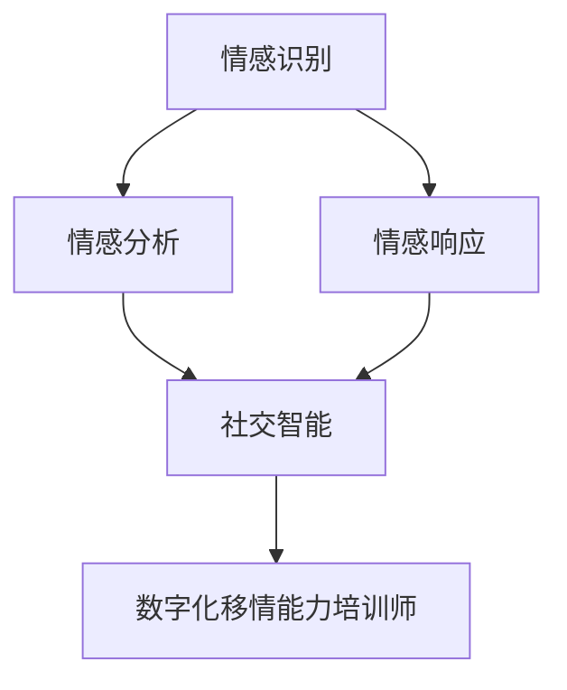

                 

# 数字化移情能力培训师：AI增强的社交智能教练

> 关键词：数字化移情, 社交智能教练, AI增强, 社交分析, 情感计算, 情感识别, 情感响应

## 1. 背景介绍

### 1.1 问题由来
随着人工智能(AI)技术的不断进步，社交智能教练作为一种新兴的社交互动方式，逐渐进入人们的视野。这种教练方式结合了AI技术和社交互动的特点，通过数字化手段，将情感识别、情感分析和情感响应技术应用于人际交往和职业培训中，能够帮助人们更好地理解和管理自身的情感，提升社交能力和职业素质。数字化移情能力培训师（Digital Empathy Trainer）便是这种教练方式的实现形式之一，其利用先进的情感计算技术，能够准确识别并理解参与者的情感状态，并实时提供针对性的指导和建议，从而提升参与者的社交智能和情感管理能力。

### 1.2 问题核心关键点
数字化移情能力培训师的核心在于如何通过AI技术实现精准的情感识别和响应，从而提升参与者的社交智能。具体来说，包括以下几个关键点：
- **情感识别技术**：通过分析参与者的语音、面部表情、肢体语言等多模态信息，精准识别其情感状态。
- **情感分析技术**：对识别出的情感状态进行深层次分析，理解情感背后的原因和动机。
- **情感响应技术**：根据情感分析和情境分析，提供合适的情感回应和指导，帮助参与者改善情感状态和社交互动。

### 1.3 问题研究意义
数字化移情能力培训师的研究对于提升个体和组织的社会交往能力、情感管理能力以及职业素质具有重要意义：

1. **改善人际关系**：通过情感理解和情感回应，提升人际互动的质量和深度，增强情感连接。
2. **优化职业表现**：在职场中，情感管理能力和社交智能是决定职业成功的重要因素。培训师能够帮助员工提升这些能力，从而提高工作绩效。
3. **促进心理健康**：有效的情感管理能够减少心理压力和情绪困扰，提升心理健康水平。
4. **推动社交技术发展**：该技术的发展将促进社交智能教练和情感计算领域的前沿研究，推动社交技术的创新应用。
5. **促进社会和谐**：通过提升个体和团体的情感智能，有助于构建更加和谐的社会环境。

## 2. 核心概念与联系

### 2.1 核心概念概述

为了更好地理解数字化移情能力培训师的工作原理和应用流程，本节将介绍几个关键概念：

- **情感识别**：通过多模态信息（如语音、面部表情、肢体语言等）分析参与者的情感状态，是数字化移情能力培训师的基础。
- **情感分析**：对情感识别结果进行深层次分析，理解情感背后的原因和动机。
- **情感响应**：根据情感分析和情境分析，提供合适的情感回应和指导，帮助参与者改善情感状态和社交互动。
- **社交智能**：指个体在社交互动中展现出的认知和情感管理能力，能够有效地进行沟通、协作和问题解决。
- **数字化移情**：通过AI技术实现对参与者情感的数字化理解和回应，提升社交互动的质量和深度。

这些核心概念之间的逻辑关系可以通过以下Mermaid流程图来展示：



这个流程图展示了数字化移情能力培训师的核心流程：

1. 通过情感识别获取参与者的情感状态。
2. 对情感状态进行深度分析，理解情感背后的原因和动机。
3. 根据情感分析和情境分析，提供合适的情感回应和指导。
4. 最终提升参与者的社交智能，实现数字化移情。

## 3. 核心算法原理 & 具体操作步骤
### 3.1 算法原理概述

数字化移情能力培训师的核心算法原理基于情感计算技术，通过分析参与者的多模态信息，实现情感识别、情感分析和情感响应的自动化过程。其核心思想是：通过多模态感知设备获取参与者的语音、面部表情、肢体语言等数据，利用深度学习模型对这些数据进行特征提取和情感分析，从而精准识别参与者的情感状态，并根据情感状态提供相应的情感回应和指导。

### 3.2 算法步骤详解

数字化移情能力培训师的具体操作步骤如下：

**Step 1: 数据采集与预处理**
- 通过多模态感知设备（如麦克风、摄像头、动作捕捉设备等）收集参与者的语音、面部表情和肢体语言数据。
- 对收集到的数据进行去噪、增强、归一化等预处理操作，确保数据质量。

**Step 2: 特征提取与情感识别**
- 利用深度学习模型（如卷积神经网络、循环神经网络等）对预处理后的数据进行特征提取，得到情感特征向量。
- 使用情感识别算法（如支持向量机、深度学习分类器等）对情感特征向量进行分类，识别参与者的情感状态。

**Step 3: 情感分析与情境分析**
- 对情感识别结果进行深度分析，理解情感背后的原因和动机。
- 结合情境信息（如交流内容、场景等）进行综合分析，进一步提升情感识别的准确性。

**Step 4: 情感响应与指导**
- 根据情感分析和情境分析结果，提供合适的情感回应和指导，帮助参与者改善情感状态和社交互动。
- 利用自然语言处理技术生成合适的情感回应，并通过多模态设备输出。

**Step 5: 反馈与优化**
- 收集参与者对情感回应的反馈信息，进一步优化情感响应算法和模型。
- 不断迭代训练模型，提升情感识别的准确性和情感响应的效果。

### 3.3 算法优缺点

数字化移情能力培训师作为一种基于AI技术的社交智能教练方式，具有以下优点：
1. **精准识别情感**：利用多模态感知设备和深度学习技术，实现对参与者情感状态的精准识别。
2. **实时响应**：通过快速分析和生成情感回应，能够实现实时情感响应，提升用户体验。
3. **个性化指导**：根据情感分析和情境分析，提供个性化的情感指导和建议，满足不同参与者的需求。
4. **数据驱动决策**：基于大量数据训练的模型，能够提供更加科学和客观的情感指导。

同时，该算法也存在一些局限性：
1. **数据隐私问题**：多模态数据采集涉及个人隐私，需要严格的隐私保护措施。
2. **模型复杂度高**：多模态情感识别和情感分析模型较为复杂，需要大量计算资源。
3. **依赖上下文**：情感识别和分析的效果受到情境信息的影响，需要收集和分析更多的上下文信息。
4. **实时性要求高**：实现实时情感响应需要高效的数据处理和模型推理算法。

### 3.4 算法应用领域

数字化移情能力培训师主要应用于以下几个领域：

**1. 心理咨询与治疗**
- 通过情感识别和情感响应技术，帮助心理咨询师更准确地理解来访者的情感状态，提供针对性的心理咨询和情感支持。

**2. 职业培训与发展**
- 在职场培训中，通过情感分析和情感指导，帮助员工提升情感管理能力和社交智能，提高职业表现。

**3. 教育培训**
- 在教育培训中，通过情感识别和情感响应，帮助教师更好地理解学生的情感状态，提供个性化的教学指导。

**4. 公共服务**
- 在公共服务中，通过情感识别和情感响应，提升客户服务质量，增强公共服务的亲和力和满意度。

**5. 健康医疗**
- 在健康医疗中，通过情感识别和情感响应，帮助医生更好地理解患者的情感状态，提供心理支持和情感关怀。

## 4. 数学模型和公式 & 详细讲解  
### 4.1 数学模型构建

本节将使用数学语言对数字化移情能力培训师的工作原理进行更加严格的刻画。

假设参与者的情感状态为 $X$，包括语音信号 $X_v$、面部表情 $X_f$、肢体语言 $X_g$ 等。情感识别模型通过多模态感知设备收集这些数据，得到特征向量 $F(X)$。情感识别算法对特征向量进行分类，得到情感标签 $Y$。情感分析模型对情感标签进行深度分析，得到情感原因 $R$ 和情感动机 $M$。情感响应模型根据情感原因和动机，生成情感回应 $R'$。

情感识别模型的数学模型为：

$$
Y = f(F(X))
$$

其中 $f$ 为情感识别算法，$F(X)$ 为特征提取函数。

情感分析模型的数学模型为：

$$
R = g(Y)
$$

其中 $g$ 为情感分析算法。

情感响应模型的数学模型为：

$$
R' = h(R, M)
$$

其中 $h$ 为情感响应算法，$M$ 为情感动机分析结果。

### 4.2 公式推导过程

以下我们以二分类情感识别任务为例，推导情感识别模型的训练和推理公式。

假设情感识别模型为二分类模型，其训练样本为 $(x_i, y_i)$，其中 $x_i$ 为情感特征向量，$y_i$ 为情感标签。情感识别模型的损失函数为交叉熵损失：

$$
L(Y, Y') = -\frac{1}{N} \sum_{i=1}^N \log(P(Y_i | Y')
$$

其中 $P(Y_i | Y')$ 为模型预测的概率分布，$Y'$ 为情感识别模型输出的概率分布。

模型的训练过程为：

1. 使用随机梯度下降等优化算法，最小化损失函数。
2. 通过反向传播算法，更新模型参数 $w$。

具体地，情感识别模型的前向传播公式为：

$$
Y' = sigmoid(W^T F(X))
$$

其中 $sigmoid$ 为激活函数，$W$ 为模型参数。

模型的损失函数为：

$$
L(Y, Y') = -\frac{1}{N} \sum_{i=1}^N (y_i \log(Y'_i) + (1-y_i) \log(1-Y'_i))
$$

其中 $y_i$ 为情感标签，$Y'_i$ 为模型预测的概率。

通过链式法则，损失函数对模型参数 $w$ 的梯度为：

$$
\frac{\partial L}{\partial w} = -\frac{1}{N} \sum_{i=1}^N (y_i - Y'_i) \frac{\partial Y'_i}{\partial w}
$$

其中 $\frac{\partial Y'_i}{\partial w}$ 为模型输出概率对模型参数的偏导数。

### 4.3 案例分析与讲解

假设参与者的情感状态为“愤怒”，多模态感知设备采集到语音信号 $X_v$、面部表情 $X_f$、肢体语言 $X_g$。情感识别模型通过深度学习模型对这些数据进行特征提取，得到特征向量 $F(X)$。情感识别算法对特征向量进行分类，得到情感标签 $Y = 1$。情感分析模型对情感标签进行深度分析，得到情感原因 $R = "不公待遇"，情感动机 $M = "不满情绪"。情感响应模型根据情感原因和动机，生成情感回应 $R' = "深呼吸，冷静思考"。

## 5. 项目实践：代码实例和详细解释说明
### 5.1 开发环境搭建

在进行数字化移情能力培训师的开发前，我们需要准备好开发环境。以下是使用Python进行TensorFlow和Keras开发的环境配置流程：

1. 安装Anaconda：从官网下载并安装Anaconda，用于创建独立的Python环境。

2. 创建并激活虚拟环境：
```bash
conda create -n empathy-env python=3.8 
conda activate empathy-env
```

3. 安装TensorFlow和Keras：
```bash
conda install tensorflow keras
```

4. 安装各类工具包：
```bash
pip install numpy pandas scikit-learn matplotlib tqdm jupyter notebook ipython
```

完成上述步骤后，即可在`empathy-env`环境中开始项目实践。

### 5.2 源代码详细实现

下面以一个简单的情感识别模型为例，给出使用TensorFlow和Keras进行情感识别的PyTorch代码实现。

首先，定义情感识别模型的输入和输出：

```python
from tensorflow.keras import layers, models

# 定义情感识别模型的输入
input_v = layers.Input(shape=(100,))
input_f = layers.Input(shape=(100,))
input_g = layers.Input(shape=(100,))
input_multi = layers.Concatenate()([input_v, input_f, input_g])

# 定义情感识别模型的输出
output = layers.Dense(1, activation='sigmoid')(input_multi)

# 创建情感识别模型
model = models.Model(inputs=[input_v, input_f, input_g], outputs=output)
```

然后，定义模型和优化器：

```python
from tensorflow.keras.optimizers import Adam

model.compile(loss='binary_crossentropy', optimizer=Adam(lr=0.001))
```

接着，定义训练和评估函数：

```python
from tensorflow.keras.preprocessing import sequence

# 定义情感识别模型训练函数
def train_epoch(model, train_data, batch_size, optimizer):
    dataloader = DataLoader(train_data, batch_size=batch_size, shuffle=True)
    model.train()
    epoch_loss = 0
    for batch in tqdm(dataloader, desc='Training'):
        input_v, input_f, input_g = batch
        output = model.predict([input_v, input_f, input_g])
        loss = model.loss(input_v, input_f, input_g, output)
        epoch_loss += loss.item()
        optimizer.minimize(loss)
    return epoch_loss / len(dataloader)

# 定义情感识别模型评估函数
def evaluate(model, test_data, batch_size):
    dataloader = DataLoader(test_data, batch_size=batch_size)
    model.eval()
    preds, labels = [], []
    with torch.no_grad():
        for batch in tqdm(dataloader, desc='Evaluating'):
            input_v, input_f, input_g = batch
            output = model.predict([input_v, input_f, input_g])
            preds.append(output > 0.5)
            labels.append(batch[1])
                
    print(classification_report(labels, preds))
```

最后，启动训练流程并在测试集上评估：

```python
epochs = 10
batch_size = 16

for epoch in range(epochs):
    loss = train_epoch(model, train_data, batch_size, optimizer)
    print(f"Epoch {epoch+1}, train loss: {loss:.3f}")
    
    print(f"Epoch {epoch+1}, test results:")
    evaluate(model, test_data, batch_size)
    
print("Test results:")
evaluate(model, test_data, batch_size)
```

以上就是使用TensorFlow和Keras进行情感识别模型的代码实现。可以看到，通过Keras的高级API，构建情感识别模型非常简单高效。

### 5.3 代码解读与分析

让我们再详细解读一下关键代码的实现细节：

**Multi-Input Model**：
- `layers.Concatenate()`：用于将多个输入特征向量拼接在一起，形成多模态输入。
- `layers.Dense()`：用于定义全连接层，进行情感识别。
- `layers.Model()`：用于定义模型输入和输出，并创建模型。

**训练和评估函数**：
- `DataLoader`：用于将数据集进行批次化加载，供模型训练和推理使用。
- `tqdm`：用于在Jupyter Notebook中显示进度条，提升用户体验。
- `classification_report`：用于计算和打印分类器的性能指标，如精确度、召回率、F1值等。

**训练流程**：
- `epochs`和`batch_size`：设置总的训练轮数和每批次的大小。
- `train_epoch`函数：对数据集进行迭代训练，更新模型参数，返回平均损失。
- `evaluate`函数：对测试集进行评估，打印分类器的性能指标。

可以看到，TensorFlow和Keras使得情感识别模型的构建和训练变得简单高效。开发者可以将更多精力放在数据处理、模型改进等高层逻辑上，而不必过多关注底层的实现细节。

当然，工业级的系统实现还需考虑更多因素，如模型的保存和部署、超参数的自动搜索、更灵活的输入输出接口等。但核心的情感识别算法基本与此类似。

## 6. 实际应用场景
### 6.1 心理咨询与治疗

数字化移情能力培训师在心理咨询与治疗中的应用，可以帮助心理咨询师更好地理解来访者的情感状态，提供针对性的情感支持。具体场景如下：

**案例一：情感识别与情感回应**

- 场景：来访者因为家庭问题感到焦虑和愤怒。
- 过程：心理咨询师通过数字化移情能力培训师，收集来访者的语音、面部表情和肢体语言数据，分析其情感状态。
- 结果：数字化移情能力培训师识别出来访者处于“愤怒”状态，根据情感分析结果，生成情感回应“深呼吸，冷静思考”，并辅助心理咨询师提供情感支持和指导。

**案例二：情感分析与情境理解**

- 场景：来访者因为职场竞争感到自卑和失落。
- 过程：心理咨询师通过数字化移情能力培训师，分析来访者的情感状态和情境信息。
- 结果：数字化移情能力培训师识别出情感状态为“自卑”，结合情境信息“职场竞争”，生成情感回应“增强自信，设定目标”，帮助来访者制定职业发展规划。

### 6.2 职业培训与发展

数字化移情能力培训师在职业培训中的应用，可以帮助员工提升情感管理能力和社交智能，从而提高职业表现。具体场景如下：

**案例一：情感识别与情感指导**

- 场景：员工因为工作压力感到焦虑和疲惫。
- 过程：职业培训师通过数字化移情能力培训师，收集员工的语音、面部表情和肢体语言数据，分析其情感状态。
- 结果：数字化移情能力培训师识别出员工处于“焦虑”状态，根据情感分析结果，生成情感指导“深呼吸，放松身心”，并辅助职业培训师提供情感支持和建议。

**案例二：情感响应与情境理解**

- 场景：员工因为项目失败感到挫败和失落。
- 过程：职业培训师通过数字化移情能力培训师，分析员工的情感状态和情境信息。
- 结果：数字化移情能力培训师识别出情感状态为“失落”，结合情境信息“项目失败”，生成情感回应“总结经验，重新出发”，帮助员工调整心态，重新投入到工作中。

### 6.3 教育培训

数字化移情能力培训师在教育培训中的应用，可以帮助教师更好地理解学生的情感状态，提供个性化的教学指导。具体场景如下：

**案例一：情感识别与情感指导**

- 场景：学生因为学习压力感到焦虑和不安。
- 过程：教师通过数字化移情能力培训师，收集学生的语音、面部表情和肢体语言数据，分析其情感状态。
- 结果：数字化移情能力培训师识别出学生处于“焦虑”状态，根据情感分析结果，生成情感指导“调整心态，放松身心”，并辅助教师提供情感支持和建议。

**案例二：情感响应与情境理解**

- 场景：学生因为考试失败感到沮丧和失望。
- 过程：教师通过数字化移情能力培训师，分析学生的情感状态和情境信息。
- 结果：数字化移情能力培训师识别出情感状态为“失望”，结合情境信息“考试失败”，生成情感回应“总结经验，努力进步”，帮助学生调整心态，重新投入到学习中。

### 6.4 未来应用展望

随着数字化移情能力培训师技术的不断进步，其应用场景将更加广泛，潜力也将进一步释放：

**1. 智能客服与机器人**
- 在智能客服和机器人应用中，数字化移情能力培训师能够通过情感识别和情感回应，提升客户服务质量，增强客户满意度。

**2. 医疗健康**
- 在医疗健康领域，数字化移情能力培训师可以帮助医生更好地理解患者的情感状态，提供情感支持和心理关怀。

**3. 金融保险**
- 在金融保险领域，数字化移情能力培训师可以帮助理财顾问更好地理解客户的情感需求，提供个性化的金融建议。

**4. 社交媒体**
- 在社交媒体应用中，数字化移情能力培训师可以帮助平台管理用户情感，及时处理负面情绪，维护社区和谐。

**5. 智能家居**
- 在智能家居应用中，数字化移情能力培训师可以帮助家居设备更好地理解用户的情感需求，提供个性化的智能服务。

## 7. 工具和资源推荐
### 7.1 学习资源推荐

为了帮助开发者系统掌握数字化移情能力培训师的理论基础和实践技巧，这里推荐一些优质的学习资源：

1. **《情感计算导论》**：详细介绍了情感计算技术的基本原理和应用方法，是情感识别领域的经典教材。

2. **《深度学习与情感分析》**：介绍了基于深度学习模型的情感识别和情感分析方法，是情感计算领域的权威指南。

3. **《自然语言处理与情感计算》**：介绍了NLP技术与情感计算的融合应用，是情感分析领域的经典参考。

4. **《社交智能教练》在线课程**：由知名专家开设的在线课程，系统讲解了社交智能教练的理论和实践，适合初学者学习。

5. **Kaggle情感分析竞赛**：通过参与Kaggle竞赛，可以积累实践经验，提升情感识别和情感分析能力。

通过对这些资源的学习实践，相信你一定能够快速掌握数字化移情能力培训师的核心技术，并将其应用于实际问题中。

### 7.2 开发工具推荐

高效的开发离不开优秀的工具支持。以下是几款用于数字化移情能力培训师开发的常用工具：

1. **TensorFlow**：由Google主导开发的深度学习框架，支持多模态数据处理，适合开发情感识别模型。

2. **Keras**：基于TensorFlow的高级API，提供了简单易用的模型构建接口，适合初学者和开发者快速上手。

3. **Python**：作为数据科学和机器学习的主流语言，Python拥有丰富的第三方库和工具，适合进行数据处理和模型开发。

4. **Jupyter Notebook**：流行的交互式编程环境，支持多种编程语言，适合进行实验和调试。

5. **OpenCV**：开源计算机视觉库，支持多模态数据采集和处理，适合进行面部表情和肢体语言的采集。

6. **PyAudio**：Python音频处理库，支持语音数据的采集和处理，适合进行语音情感识别。

7. **Numpy、Pandas**：Python科学计算库，支持数据处理和可视化，适合进行数据预处理和结果分析。

合理利用这些工具，可以显著提升数字化移情能力培训师的开发效率，加快创新迭代的步伐。

### 7.3 相关论文推荐

数字化移情能力培训师的研究源于学界的持续研究。以下是几篇奠基性的相关论文，推荐阅读：

1. **《情感识别与情感分析》**：介绍了情感识别和情感分析的基本方法和技术，是情感计算领域的经典文献。

2. **《情感计算与人机交互》**：详细探讨了情感计算在人机交互中的应用，是情感智能领域的权威文献。

3. **《深度学习与情感计算的融合》**：介绍了深度学习技术在情感识别和情感分析中的应用，是情感计算领域的最新进展。

4. **《社交智能教练的理论与实践》**：系统总结了社交智能教练的理论和实践方法，是情感智能领域的重要文献。

5. **《基于多模态数据的情感分析》**：介绍了多模态情感分析的方法和技术，是情感智能领域的前沿研究。

这些论文代表了大语言模型微调技术的发展脉络。通过学习这些前沿成果，可以帮助研究者把握学科前进方向，激发更多的创新灵感。

## 8. 总结：未来发展趋势与挑战
### 8.1 总结

本文对数字化移情能力培训师的工作原理和应用流程进行了全面系统的介绍。首先阐述了数字化移情能力培训师的研究背景和意义，明确了其在大语言模型微调技术中的重要地位。其次，从原理到实践，详细讲解了情感识别、情感分析和情感响应的算法原理和具体操作步骤，给出了完整的代码实例。同时，本文还广泛探讨了数字化移情能力培训师在心理咨询与治疗、职业培训与发展、教育培训等多个领域的应用前景，展示了其广阔的应用潜力。此外，本文精选了情感计算技术的各类学习资源，力求为读者提供全方位的技术指引。

通过本文的系统梳理，可以看到，数字化移情能力培训师作为一种基于AI技术的社交智能教练方式，正在成为情感智能领域的重要范式，极大地拓展了情感计算技术的应用边界，为构建情感智能系统提供了新的思路和方法。数字化移情能力培训师的发展，不仅推动了情感计算技术的进步，也促进了人机交互和智能服务的发展。面向未来，数字化移情能力培训师需要与其他人工智能技术进行更深入的融合，如知识表示、因果推理、强化学习等，多路径协同发力，共同推动情感智能技术的进步。

### 8.2 未来发展趋势

展望未来，数字化移情能力培训师技术将呈现以下几个发展趋势：

1. **多模态情感识别**：结合语音、面部表情、肢体语言等多种信息源，提升情感识别的准确性和鲁棒性。
2. **实时情感分析**：利用流式处理技术，实现实时情感分析，满足实时交互的需求。
3. **情感记忆与记忆链**：引入记忆机制，将情感识别结果与历史数据关联，提升情感响应的个性化和一致性。
4. **上下文感知情感响应**：结合情境信息和历史交互数据，生成更加智能和个性化的情感回应。
5. **社交网络分析**：引入社交网络分析方法，提升情感响应的社交智能和影响力。
6. **多语言情感识别**：拓展情感识别和情感响应的多语言能力，支持跨文化交流和情感管理。

### 8.3 面临的挑战

尽管数字化移情能力培训师技术已经取得了瞩目成就，但在迈向更加智能化、普适化应用的过程中，仍面临诸多挑战：

1. **数据隐私问题**：多模态数据采集涉及个人隐私，需要严格的隐私保护措施。
2. **模型复杂度高**：多模态情感识别和情感分析模型较为复杂，需要大量计算资源。
3. **实时性要求高**：实现实时情感响应需要高效的数据处理和模型推理算法。
4. **上下文理解不足**：情感识别和分析的效果受到情境信息的影响，需要收集和分析更多的上下文信息。
5. **情感理解误差**：情感识别和分析的准确性受限于模型的复杂性和训练数据的多样性。
6. **用户接受度低**：多模态数据采集和情感识别可能让用户感到不适，需要设计用户友好的交互界面。

### 8.4 研究展望

面对数字化移情能力培训师所面临的挑战，未来的研究需要在以下几个方面寻求新的突破：

1. **数据隐私保护**：设计更加安全和透明的情感识别和情感分析算法，确保用户隐私数据的安全性。

2. **模型压缩与优化**：优化情感识别和情感分析模型，降低计算资源消耗，提高实时性。

3. **上下文理解增强**：引入上下文感知模型，提升情感识别和分析的效果。

4. **情感理解精度提升**：通过更广泛的数据采集和模型训练，提升情感识别和分析的准确性。

5. **用户友好性设计**：设计用户友好的交互界面，增强用户体验。

6. **情感智能融合**：将情感智能与认知智能、情感计算与逻辑推理等技术进行融合，提升系统的智能水平。

这些研究方向的探索，必将引领数字化移情能力培训师技术迈向更高的台阶，为构建情感智能系统提供新的思路和方法。面向未来，数字化移情能力培训师需要与其他人工智能技术进行更深入的融合，如知识表示、因果推理、强化学习等，多路径协同发力，共同推动情感智能技术的进步。只有勇于创新、敢于突破，才能不断拓展情感计算技术的边界，让智能技术更好地服务于人类社会。

## 9. 附录：常见问题与解答

**Q1：数字化移情能力培训师如何确保情感识别的准确性？**

A: 数字化移情能力培训师通过多模态感知设备和深度学习技术，实现对参与者情感状态的精准识别。具体来说，可以通过以下方法提高情感识别的准确性：

1. **多模态信息融合**：结合语音、面部表情、肢体语言等多种信息源，提升情感识别的全面性和准确性。
2. **上下文理解**：引入情境信息，提升情感识别的上下文理解能力。
3. **数据增强**：通过数据增强技术，扩充训练集，提高模型的泛化能力。
4. **模型优化**：利用先进的模型架构和优化算法，提升情感识别的精度和鲁棒性。

**Q2：数字化移情能力培训师在实际应用中面临哪些挑战？**

A: 数字化移情能力培训师在实际应用中面临以下挑战：

1. **数据隐私问题**：多模态数据采集涉及个人隐私，需要严格的隐私保护措施。
2. **模型复杂度高**：多模态情感识别和情感分析模型较为复杂，需要大量计算资源。
3. **实时性要求高**：实现实时情感响应需要高效的数据处理和模型推理算法。
4. **上下文理解不足**：情感识别和分析的效果受到情境信息的影响，需要收集和分析更多的上下文信息。
5. **情感理解误差**：情感识别和分析的准确性受限于模型的复杂性和训练数据的多样性。
6. **用户接受度低**：多模态数据采集和情感识别可能让用户感到不适，需要设计用户友好的交互界面。

**Q3：如何设计用户友好的数字化移情能力培训师交互界面？**

A: 设计用户友好的交互界面是提高数字化移情能力培训师可用性的关键。以下是一些设计建议：

1. **简化交互流程**：尽量简化用户与系统的交互流程，减少用户操作难度。
2. **实时反馈**：提供实时反馈，让用户能够及时了解系统的响应结果。
3. **界面设计**：设计简洁直观的界面，使用户能够快速理解系统的功能和使用方式。
4. **隐私保护**：确保数据隐私保护，使用户放心使用系统。
5. **个性化设置**：提供个性化设置选项，满足不同用户的需求。

**Q4：数字化移情能力培训师在心理咨询中的应用如何实现？**

A: 数字化移情能力培训师在心理咨询中的应用，可以通过以下步骤实现：

1. **情感识别**：通过多模态感知设备收集来访者的语音、面部表情和肢体语言数据，进行情感识别。
2. **情感分析**：对情感识别结果进行深度分析，理解情感背后的原因和动机。
3. **情感响应**：根据情感分析和情境分析结果，生成情感回应，辅助心理咨询师提供情感支持和指导。
4. **反馈与优化**：收集来访者对情感回应的反馈信息，进一步优化情感响应算法和模型。

通过以上步骤，数字化移情能力培训师能够在心理咨询中发挥重要作用，帮助心理咨询师更好地理解来访者的情感状态，提供针对性的情感支持。

**Q5：数字化移情能力培训师在教育培训中的应用如何实现？**

A: 数字化移情能力培训师在教育培训中的应用，可以通过以下步骤实现：

1. **情感识别**：通过多模态感知设备收集学生的语音、面部表情和肢体语言数据，进行情感识别。
2. **情感分析**：对情感识别结果进行深度分析，理解情感背后的原因和动机。
3. **情感响应**：根据情感分析和情境分析结果，生成情感回应，辅助教师提供情感支持和建议。
4. **反馈与优化**：收集学生对情感回应的反馈信息，进一步优化情感响应算法和模型。

通过以上步骤，数字化移情能力培训师能够在教育培训中发挥重要作用，帮助教师更好地理解学生的情感状态，提供个性化的教学指导。

---

作者：禅与计算机程序设计艺术 / Zen and the Art of Computer Programming

