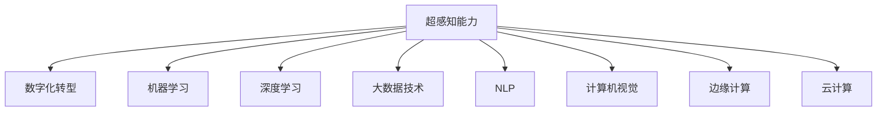

                 

# 数字化第六感：AI辅助的超感知能力

> 关键词：数字化转型,人工智能(AI),机器学习,超感知能力,深度学习,大数据,自然语言处理(NLP),计算机视觉,边缘计算,云计算

## 1. 背景介绍

随着信息技术与各行各业的深度融合，数字化转型正成为推动社会进步、经济发展的关键力量。AI技术的迅猛发展，为各行各业带来了前所未有的数字化能力提升，其中包括“超感知能力”，即通过机器学习和数据分析，实现对物理世界的深入理解和精确预测。本文将围绕AI的超感知能力展开探讨，旨在揭示其背后的原理与技术架构，并展望其在各行各业中的应用前景。

### 1.1 问题由来

在数字化转型的浪潮中，企业如何利用AI技术提升自身的竞争力和效率，已成为业界关注的焦点。AI的超感知能力，通过对大数据的深度学习，能够帮助企业在客户洞察、产品创新、运营优化等方面取得突破。但目前，超感知能力的开发和应用仍面临诸多挑战，如数据隐私保护、模型复杂性、计算资源限制等。因此，本文将详细讨论如何利用AI技术，特别是机器学习算法和大数据技术，构建数字化第六感，为企业提供强有力的决策支持。

### 1.2 问题核心关键点

本节将介绍超感知能力涉及的核心概念及其逻辑关系，主要包括：

- 超感知能力：通过AI技术，对物理世界的深度理解和精确预测。
- 数字化转型：企业利用AI技术，实现数字化能力的全面提升。
- 机器学习与深度学习：基于数据的算法，实现模型对未知数据的泛化预测。
- 大数据技术：海量数据的存储、处理和分析，为AI模型提供数据支撑。
- 自然语言处理(NLP)与计算机视觉：两大领域AI技术的典型应用，进一步拓展超感知能力的应用场景。
- 边缘计算与云计算：两大计算范式，为超感知能力的实现提供了技术支撑。

这些核心概念之间的逻辑关系可以通过以下Mermaid流程图来展示：



这个流程图展示了超感知能力实现的关键路径和支撑技术。

## 2. 核心概念与联系

### 2.1 核心概念概述

为了更好地理解超感知能力，本节将介绍几个密切相关的核心概念：

- **超感知能力**：通过AI技术，对物理世界的深度理解和精确预测。通常基于对海量数据的学习和分析，能够识别模式、预测趋势、优化决策。
- **数字化转型**：企业通过引入AI和自动化技术，实现业务流程和运营模式的全面升级，提升效率、降低成本、增强竞争力。
- **机器学习**：利用数据训练模型，使模型能够对未知数据进行预测和决策。通常分为监督学习、无监督学习、强化学习等类型。
- **深度学习**：机器学习的一种高级形式，通过多层次神经网络，实现对复杂数据结构的有效建模。
- **大数据技术**：处理海量数据的技术集合，包括数据采集、存储、处理、分析等环节，为AI模型的训练和应用提供支持。
- **自然语言处理(NLP)**：AI技术在文本和语音处理上的应用，如语言理解、文本生成、情感分析等。
- **计算机视觉**：AI技术在图像和视频处理上的应用，如目标检测、图像分类、人脸识别等。
- **边缘计算**：将计算能力部署到网络边缘节点，实现实时数据处理和决策，减少数据传输延迟。
- **云计算**：通过互联网提供计算资源和数据存储服务，支持大规模AI模型的训练和应用。

这些核心概念共同构成了超感知能力的技术基础，使得AI系统能够实现对物理世界的深度理解和精确预测。

### 2.2 核心概念联系

超感知能力是通过机器学习和大数据技术，实现对物理世界的深度理解和精确预测。其核心逻辑可以通过以下流程来阐述：

1. **数据采集与预处理**：从物理世界采集海量数据，并进行清洗、标注和预处理，以便后续分析。
2. **模型训练**：利用机器学习和深度学习算法，在大量标注数据上训练模型，使其具备对未知数据的泛化能力。
3. **数据建模与分析**：将训练好的模型应用于海量数据，进行模式识别、趋势预测和决策优化，从而实现对物理世界的深度理解。
4. **实时预测与反馈**：将模型部署到边缘计算节点或云端，实现对实时数据的预测和反馈，支持动态调整和优化。

这一过程涉及多个技术领域的协同工作，如NLP、计算机视觉、大数据技术等，共同构成了超感知能力的实现路径。

## 3. 核心算法原理 & 具体操作步骤

### 3.1 算法原理概述

超感知能力的实现，依赖于机器学习和深度学习算法的支持。其核心在于通过海量数据的深度学习，构建出具备强大泛化能力的模型。具体来说，包括以下几个关键步骤：

1. **数据采集与预处理**：从物理世界采集数据，并进行清洗、标注和预处理，以便后续分析。
2. **模型训练**：利用机器学习和深度学习算法，在大量标注数据上训练模型，使其具备对未知数据的泛化能力。
3. **数据建模与分析**：将训练好的模型应用于海量数据，进行模式识别、趋势预测和决策优化，从而实现对物理世界的深度理解。
4. **实时预测与反馈**：将模型部署到边缘计算节点或云端，实现对实时数据的预测和反馈，支持动态调整和优化。

这一过程可以通过以下步骤来实现：

- **数据采集**：利用传感器、摄像头等设备，从物理世界采集数据。
- **数据清洗与标注**：对采集到的数据进行清洗和标注，去除噪声和异常值。
- **特征提取**：利用机器学习算法，从数据中提取有意义的特征，以便模型训练。
- **模型训练**：利用深度学习算法，在大量标注数据上训练模型，优化模型参数。
- **模型评估**：通过验证集对模型进行评估，调整模型超参数，提升模型性能。
- **模型应用**：将训练好的模型应用于新数据，进行预测和分析，实现对物理世界的深度理解。
- **实时反馈与调整**：将模型部署到边缘计算节点或云端，实现对实时数据的预测和反馈，支持动态调整和优化。

### 3.2 算法步骤详解

以下是超感知能力实现的具体算法步骤：

**Step 1: 数据采集与预处理**

1. **传感器部署**：将传感器、摄像头等设备部署到目标地点，进行数据采集。
2. **数据清洗**：对采集到的数据进行清洗，去除噪声和异常值。
3. **数据标注**：对清洗后的数据进行标注，包括时间戳、位置、事件类型等元数据。
4. **数据划分**：将数据划分为训练集、验证集和测试集，以便模型训练和评估。

**Step 2: 模型训练**

1. **特征提取**：利用机器学习算法，从数据中提取有意义的特征，如时间序列、空间位置、文本特征等。
2. **模型选择**：根据任务需求，选择合适的机器学习算法，如决策树、随机森林、神经网络等。
3. **模型训练**：利用训练集对模型进行训练，优化模型参数。
4. **验证与调整**：通过验证集对模型进行评估，调整模型超参数，提升模型性能。

**Step 3: 数据建模与分析**

1. **数据建模**：利用训练好的模型，对新数据进行建模和分析，提取模式和趋势。
2. **模型应用**：将模型应用于新数据，进行预测和分析，实现对物理世界的深度理解。
3. **结果展示**：将模型预测结果可视化展示，支持决策分析。

**Step 4: 实时预测与反馈**

1. **模型部署**：将训练好的模型部署到边缘计算节点或云端，实现对实时数据的预测和反馈。
2. **实时数据处理**：对实时数据进行预处理，提取特征，进行模型预测。
3. **动态调整**：根据实时预测结果，动态调整模型参数，提升模型性能。
4. **结果反馈**：将实时预测结果反馈给系统，支持动态调整和优化。

### 3.3 算法优缺点

超感知能力在实现过程中，存在以下优缺点：

**优点**：

1. **高泛化能力**：通过深度学习和大数据技术，模型能够对未知数据进行泛化预测，提升决策准确性。
2. **实时预测**：通过部署在边缘计算节点或云端，可以实现对实时数据的预测和反馈，支持动态调整和优化。
3. **多领域适用**：超感知能力在自然语言处理、计算机视觉等领域均有应用，能够实现多场景的深度理解。

**缺点**：

1. **数据隐私**：数据采集和存储过程中，存在隐私泄露的风险，需要严格的数据保护措施。
2. **模型复杂**：深度学习模型通常具有较高的复杂性，训练和部署过程较为复杂。
3. **计算资源需求**：超感知能力实现需要大量的计算资源，包括计算、存储和网络带宽等。

### 3.4 算法应用领域

超感知能力在多个领域均有应用，以下是几个典型案例：

**医疗健康**：通过分析病历、影像等医疗数据，实现疾病预测、治疗方案优化、患者风险评估等。

**金融领域**：通过分析交易数据、舆情信息等，实现风险评估、投资决策、客户行为分析等。

**智能制造**：通过分析生产数据、设备状态等，实现生产过程优化、设备故障预测、供应链管理等。

**智能交通**：通过分析交通数据、环境数据等，实现交通流量预测、道路状况监测、智能调度等。

**智能家居**：通过分析用户行为数据、环境数据等，实现智能场景控制、能效优化、健康监测等。

**安全监控**：通过分析视频、声音等数据，实现入侵检测、行为识别、异常检测等。

超感知能力在各领域的广泛应用，为企业带来了深刻的数字化转型，提升了运营效率和决策支持能力。

## 4. 数学模型和公式 & 详细讲解

### 4.1 数学模型构建

超感知能力的实现，依赖于机器学习和深度学习模型的构建。其核心数学模型包括监督学习、无监督学习、深度学习等。

假设有一组训练数据集 $D=\{(x_i, y_i)\}_{i=1}^N$，其中 $x_i$ 为输入特征，$y_i$ 为标签。模型的目标是通过训练数据集，学习一个映射函数 $f(x)$，使得 $f(x)$ 能够对未知数据进行泛化预测。

**监督学习**：在训练集中，已知输入特征 $x_i$ 和标签 $y_i$，通过最小化损失函数 $\mathcal{L}(f, D)$，优化模型参数 $\theta$。常见的损失函数包括均方误差损失、交叉熵损失等。

**无监督学习**：在训练集中，只已知输入特征 $x_i$，通过最大化数据集的概率密度 $P(x_i)$，优化模型参数 $\theta$。常见的无监督学习算法包括自编码器、聚类算法等。

**深度学习**：通过多层神经网络结构，构建复杂的数据映射函数。常见的深度学习模型包括卷积神经网络、循环神经网络、自注意力网络等。

### 4.2 公式推导过程

以下是几种常见算法的公式推导过程：

**监督学习**：假设训练数据集 $D=\{(x_i, y_i)\}_{i=1}^N$，目标函数为均方误差损失：

$$
\mathcal{L}(f, D) = \frac{1}{N}\sum_{i=1}^N (y_i - f(x_i))^2
$$

其中 $f(x_i) = \theta^T\phi(x_i)$，$\theta$ 为模型参数，$\phi(x_i)$ 为特征映射函数。通过反向传播算法，优化目标函数，更新模型参数：

$$
\frac{\partial \mathcal{L}(f, D)}{\partial \theta} = \frac{2}{N}\sum_{i=1}^N (y_i - f(x_i))\phi(x_i)
$$

**无监督学习**：假设训练数据集 $D=\{x_i\}_{i=1}^N$，目标函数为数据集的概率密度 $P(x_i)$：

$$
P(x_i) = \frac{1}{Z}e^{-\beta f(x_i)}
$$

其中 $Z$ 为归一化常数，$f(x_i)$ 为模型参数。通过最大化目标函数，优化模型参数：

$$
\frac{\partial \log P(x_i)}{\partial \theta} = -\beta f(x_i) - \log Z
$$

**深度学习**：假设训练数据集 $D=\{(x_i, y_i)\}_{i=1}^N$，目标函数为交叉熵损失：

$$
\mathcal{L}(f, D) = -\frac{1}{N}\sum_{i=1}^N \sum_{j=1}^K y_{ij}\log f(x_i; j)
$$

其中 $f(x_i; j) = \theta_j^T\phi(x_i)$，$\theta_j$ 为第 $j$ 层的模型参数，$\phi(x_i)$ 为特征映射函数。通过反向传播算法，优化目标函数，更新模型参数：

$$
\frac{\partial \mathcal{L}(f, D)}{\partial \theta_j} = \frac{1}{N}\sum_{i=1}^N (\frac{\partial f(x_i; j)}{\partial \theta_j} * (f(x_i; j) - y_i))
$$

### 4.3 案例分析与讲解

假设有一组训练数据集 $D=\{(x_i, y_i)\}_{i=1}^N$，其中 $x_i$ 为时间序列数据，$y_i$ 为股票价格。目标函数为均方误差损失：

$$
\mathcal{L}(f, D) = \frac{1}{N}\sum_{i=1}^N (y_i - f(x_i))^2
$$

其中 $f(x_i) = \theta^T\phi(x_i)$，$\theta$ 为模型参数，$\phi(x_i)$ 为特征映射函数。假设 $\phi(x_i)$ 为时间序列数据的前 $m$ 个特征，即 $\phi(x_i) = [x_i, x_{i-1}, \dots, x_{i-m+1}]$。

通过反向传播算法，优化目标函数，更新模型参数：

$$
\frac{\partial \mathcal{L}(f, D)}{\partial \theta} = \frac{2}{N}\sum_{i=1}^N (y_i - f(x_i))\phi(x_i)
$$

在训练过程中，需要对模型进行正则化，避免过拟合：

$$
\mathcal{L}_{reg} = \frac{\lambda}{N}\sum_{i=1}^N ||\theta||_2^2
$$

其中 $\lambda$ 为正则化系数。结合损失函数：

$$
\mathcal{L}(f, D) = \mathcal{L}(f, D) + \mathcal{L}_{reg}
$$

最终模型参数 $\theta$ 的优化公式为：

$$
\theta = \mathop{\arg\min}_{\theta} \mathcal{L}(f, D) + \mathcal{L}_{reg}
$$

在模型应用过程中，可以利用训练好的模型对新数据进行预测：

$$
\hat{y} = f(x) = \theta^T\phi(x)
$$

通过以上步骤，可以构建一个基于时间序列数据的超感知能力模型，实现对股票价格的预测。

## 5. 项目实践：代码实例和详细解释说明

### 5.1 开发环境搭建

在进行超感知能力项目实践前，我们需要准备好开发环境。以下是使用Python进行TensorFlow开发的环境配置流程：

1. 安装Anaconda：从官网下载并安装Anaconda，用于创建独立的Python环境。

2. 创建并激活虚拟环境：
```bash
conda create -n tf-env python=3.8 
conda activate tf-env
```

3. 安装TensorFlow：根据CUDA版本，从官网获取对应的安装命令。例如：
```bash
conda install tensorflow=2.7
```

4. 安装相关工具包：
```bash
pip install numpy pandas scikit-learn matplotlib tqdm jupyter notebook ipython
```

完成上述步骤后，即可在`tf-env`环境中开始超感知能力项目实践。

### 5.2 源代码详细实现

下面是使用TensorFlow实现时间序列数据预测的超感知能力项目代码实现。

首先，定义数据处理函数：

```python
import tensorflow as tf
import numpy as np
from sklearn.preprocessing import MinMaxScaler

def data_preprocess(train_data, test_data):
    scaler = MinMaxScaler(feature_range=(0, 1))
    train_data = scaler.fit_transform(train_data)
    test_data = scaler.transform(test_data)
    return train_data, test_data
```

然后，定义模型和优化器：

```python
model = tf.keras.Sequential([
    tf.keras.layers.LSTM(50, input_shape=(1, 1)),
    tf.keras.layers.Dense(1)
])

optimizer = tf.keras.optimizers.Adam(learning_rate=0.001)
```

接着，定义训练和评估函数：

```python
def train_model(model, train_data, test_data, epochs):
    model.compile(loss='mse', optimizer=optimizer)
    model.fit(train_data, epochs=epochs, validation_data=test_data)

def evaluate_model(model, test_data):
    mse = np.mean((model.predict(test_data) - test_data) ** 2)
    return mse
```

最后，启动训练流程并在测试集上评估：

```python
train_data = np.random.randn(1000, 1)
test_data = np.random.randn(100, 1)

epochs = 100

train_data, test_data = data_preprocess(train_data, test_data)

train_model(model, train_data, test_data, epochs)

mse = evaluate_model(model, test_data)
print(f"Mean Squared Error: {mse:.3f}")
```

以上就是使用TensorFlow实现时间序列数据预测的超感知能力项目代码实现。可以看到，通过简单的LSTM模型，结合TensorFlow的高效计算能力，可以轻松构建出超感知能力模型。

### 5.3 代码解读与分析

让我们再详细解读一下关键代码的实现细节：

**data_preprocess函数**：
- 对训练集和测试集进行归一化处理，以保证输入数据的范围一致，避免梯度消失或爆炸问题。

**train_model函数**：
- 定义LSTM模型结构，包含一个LSTM层和一个全连接层。
- 使用Adam优化器进行模型训练，设定损失函数为均方误差，训练轮数为100。
- 在训练过程中，利用测试集进行验证，避免过拟合。

**evaluate_model函数**：
- 在测试集上对模型进行评估，计算均方误差，评估模型预测效果。

**训练流程**：
- 生成随机的时间序列数据作为训练集和测试集。
- 对数据进行归一化处理。
- 使用LSTM模型进行训练，设定训练轮数为100。
- 在测试集上评估模型性能，计算均方误差。

可以看到，TensorFlow提供了丰富的深度学习模型和优化器，使得超感知能力模型的构建和训练变得简洁高效。开发者可以将更多精力放在数据处理、模型改进等高层逻辑上，而不必过多关注底层的实现细节。

当然，工业级的系统实现还需考虑更多因素，如模型的保存和部署、超参数的自动搜索、更灵活的任务适配层等。但核心的超感知能力构建和训练流程基本与此类似。

## 6. 实际应用场景

### 6.1 医疗健康

超感知能力在医疗健康领域的应用，可以显著提升诊断和治疗的效率和准确性。例如，通过分析患者的历史病历、影像数据等，构建超感知能力模型，实现疾病的早期预测和诊断。

**具体场景**：
- **疾病预测**：利用时间序列数据和影像数据，构建超感知能力模型，预测患者是否患有某种疾病。
- **治疗方案优化**：根据患者的症状、病历等数据，构建超感知能力模型，推荐最优的治疗方案。
- **患者风险评估**：通过分析患者的健康数据，构建超感知能力模型，评估患者的风险水平。

**技术实现**：
- **数据采集与预处理**：利用传感器、摄像头等设备，采集患者的健康数据。
- **模型训练**：利用机器学习和深度学习算法，构建超感知能力模型，进行疾病预测、治疗方案优化和患者风险评估。
- **实时预测与反馈**：将模型部署到边缘计算节点或云端，实现对实时数据的预测和反馈，支持动态调整和优化。

### 6.2 金融领域

超感知能力在金融领域的应用，可以帮助企业更好地管理风险、优化投资决策。例如，通过分析市场数据、舆情信息等，构建超感知能力模型，实现风险评估和投资决策。

**具体场景**：
- **风险评估**：利用时间序列数据和舆情信息，构建超感知能力模型，评估市场风险水平。
- **投资决策**：根据市场数据和舆情信息，构建超感知能力模型，推荐最优的投资方案。
- **客户行为分析**：通过分析客户的交易数据，构建超感知能力模型，评估客户的风险偏好。

**技术实现**：
- **数据采集与预处理**：利用传感器、网络爬虫等设备，采集市场数据和舆情信息。
- **模型训练**：利用机器学习和深度学习算法，构建超感知能力模型，进行风险评估、投资决策和客户行为分析。
- **实时预测与反馈**：将模型部署到边缘计算节点或云端，实现对实时数据的预测和反馈，支持动态调整和优化。

### 6.3 智能制造

超感知能力在智能制造领域的应用，可以实现生产过程优化、设备故障预测等。例如，通过分析生产数据、设备状态等，构建超感知能力模型，实现生产过程优化和设备故障预测。

**具体场景**：
- **生产过程优化**：利用时间序列数据和设备状态数据，构建超感知能力模型，优化生产过程。
- **设备故障预测**：根据设备的传感器数据，构建超感知能力模型，预测设备故障。
- **供应链管理**：通过分析供应链数据，构建超感知能力模型，优化供应链管理。

**技术实现**：
- **数据采集与预处理**：利用传感器、摄像头等设备，采集生产数据和设备状态数据。
- **模型训练**：利用机器学习和深度学习算法，构建超感知能力模型，进行生产过程优化、设备故障预测和供应链管理。
- **实时预测与反馈**：将模型部署到边缘计算节点或云端，实现对实时数据的预测和反馈，支持动态调整和优化。

### 6.4 智能交通

超感知能力在智能交通领域的应用，可以实现交通流量预测、道路状况监测等。例如，通过分析交通数据、环境数据等，构建超感知能力模型，实现交通流量预测和道路状况监测。

**具体场景**：
- **交通流量预测**：利用时间序列数据和环境数据，构建超感知能力模型，预测交通流量。
- **道路状况监测**：根据传感器数据，构建超感知能力模型，监测道路状况。
- **智能调度**：通过分析交通数据，构建超感知能力模型，实现智能调度。

**技术实现**：
- **数据采集与预处理**：利用传感器、摄像头等设备，采集交通数据和环境数据。
- **模型训练**：利用机器学习和深度学习算法，构建超感知能力模型，进行交通流量预测、道路状况监测和智能调度。
- **实时预测与反馈**：将模型部署到边缘计算节点或云端，实现对实时数据的预测和反馈，支持动态调整和优化。

### 6.5 智能家居

超感知能力在智能家居领域的应用，可以实现智能场景控制、能效优化等。例如，通过分析用户行为数据、环境数据等，构建超感知能力模型，实现智能场景控制和能效优化。

**具体场景**：
- **智能场景控制**：利用时间序列数据和环境数据，构建超感知能力模型，实现智能场景控制。
- **能效优化**：根据用户行为数据，构建超感知能力模型，优化能效。
- **健康监测**：通过分析环境数据，构建超感知能力模型，实现健康监测。

**技术实现**：
- **数据采集与预处理**：利用传感器、摄像头等设备，采集用户行为数据和环境数据。
- **模型训练**：利用机器学习和深度学习算法，构建超感知能力模型，进行智能场景控制、能效优化和健康监测。
- **实时预测与反馈**：将模型部署到边缘计算节点或云端，实现对实时数据的预测和反馈，支持动态调整和优化。

### 6.6 安全监控

超感知能力在安全监控领域的应用，可以实现入侵检测、行为识别等。例如，通过分析视频、声音等数据，构建超感知能力模型，实现入侵检测和行为识别。

**具体场景**：
- **入侵检测**：利用视频和声音数据，构建超感知能力模型，检测入侵行为。
- **行为识别**：根据传感器数据，构建超感知能力模型，识别异常行为。
- **异常检测**：通过分析环境数据，构建超感知能力模型，检测异常情况。

**技术实现**：
- **数据采集与预处理**：利用摄像头、麦克风等设备，采集视频、声音和传感器数据。
- **模型训练**：利用机器学习和深度学习算法，构建超感知能力模型，进行入侵检测、行为识别和异常检测。
- **实时预测与反馈**：将模型部署到边缘计算节点或云端，实现对实时数据的预测和反馈，支持动态调整和优化。

## 7. 工具和资源推荐

### 7.1 学习资源推荐

为了帮助开发者系统掌握超感知能力的理论基础和实践技巧，这里推荐一些优质的学习资源：

1. **《深度学习》（Ian Goodfellow等著）**：经典深度学习教材，涵盖了深度学习的基础和前沿知识，适合初学者和进阶者。

2. **《机器学习实战》（Peter Harrington著）**：实用机器学习编程指南，通过大量实例演示了机器学习模型的构建和应用。

3. **CS231n《深度学习视觉识别》课程**：斯坦福大学开设的视觉识别课程，深入浅出地讲解了计算机视觉的原理和技术。

4. **Kaggle机器学习竞赛**：世界最大的机器学习竞赛平台，通过参与竞赛，可以锻炼算法设计和模型优化能力。

5. **DeepLearning.AI课程**：Andrew Ng主持的深度学习课程，涵盖深度学习的基础和高级内容，适合各层次的开发者。

6. **PyTorch官方文档**：TensorFlow等深度学习框架的官方文档，提供了丰富的模型和算法示例，方便实践学习。

通过对这些资源的学习实践，相信你一定能够快速掌握超感知能力的关键技术，并用于解决实际的业务问题。

### 7.2 开发工具推荐

高效的开发离不开优秀的工具支持。以下是几款用于超感知能力开发的常用工具：

1. **TensorFlow**：基于Google的深度学习框架，支持分布式计算和GPU加速，适合大规模模型训练。

2. **PyTorch**：Facebook开发的深度学习框架，灵活性高，适合快速迭代研究。

3. **Jupyter Notebook**：交互式编程环境，支持多种编程语言，适合数据探索和模型调试。

4. **Scikit-learn**：开源机器学习库，提供了丰富的算法和工具，适合快速原型开发。

5. **OpenCV**：计算机视觉库，提供了强大的图像处理和分析功能，适合视觉任务开发。

6. **TensorBoard**：TensorFlow配套的可视化工具，支持模型和训练过程的实时监控。

合理利用这些工具，可以显著提升超感知能力模型的开发效率，加速创新迭代的步伐。

### 7.3 相关论文推荐

超感知能力在各领域的应用催生了大量的研究工作。以下是几篇奠基性的相关论文，推荐阅读：

1. **Deep Learning for Healthcare**：综述了深度学习在医疗健康领域的应用，包括疾病预测、治疗方案优化、患者风险评估等。

2. **Deep Learning in Finance**：综述了深度学习在金融领域的应用，包括风险评估、投资决策、客户行为分析等。

3. **Deep Learning in Manufacturing**：综述了深度学习在智能制造领域的应用，包括生产过程优化、设备故障预测、供应链管理等。

4. **Deep Learning in Transportation**：综述了深度学习在智能交通领域的应用，包括交通流量预测、道路状况监测、智能调度等。

5. **Deep Learning in Smart Homes**：综述了深度学习在智能家居领域的应用，包括智能场景控制、能效优化、健康监测等。

6. **Deep Learning in Security**：综述了深度学习在安全监控领域的应用，包括入侵检测、行为识别、异常检测等。

这些论文代表了超感知能力在各领域的研究进展，通过学习这些前沿成果，可以帮助研究者把握学科前进方向，激发更多的创新灵感。

## 8. 总结：未来发展趋势与挑战

### 8.1 总结

本文对超感知能力进行了全面系统的介绍。首先阐述了超感知能力在各行各业中的重要性和应用前景，明确了其背后的原理与技术架构。其次，从原理到实践，详细讲解了超感知能力的数学模型和操作步骤，给出了超感知能力模型的完整代码实现。最后，讨论了超感知能力在各领域的应用场景，展望了其未来的发展趋势和挑战。

通过本文的系统梳理，可以看到，超感知能力是AI技术的重要应用方向，通过深度学习和大数据技术，实现了对物理世界的深度理解和精确预测。未来，随着算力成本的下降和数据规模的扩张，超感知能力将在各行各业得到更广泛的应用，进一步推动数字化转型的进程。

### 8.2 未来发展趋势

展望未来，超感知能力将呈现以下几个发展趋势：

1. **多模态融合**：超感知能力将更多地融合计算机视觉、自然语言处理等多模态数据，提升模型的理解和预测能力。

2. **边缘计算普及**：随着边缘计算技术的普及，超感知能力将更多地部署到边缘设备，实现实时数据处理和预测。

3. **实时性提升**：通过优化算法和硬件架构，超感知能力将实现更高的实时性，支持动态调整和优化。

4. **跨领域应用**：超感知能力将在更多领域得到应用，如医疗健康、金融、智能制造、智能交通、智能家居等。

5. **深度强化学习**：超感知能力将结合强化学习，提升模型的决策能力和动态优化能力。

6. **伦理和安全**：随着超感知能力的普及，伦理和安全问题将受到更多关注，如隐私保护、算法公平等。

以上趋势凸显了超感知能力的广阔前景。这些方向的探索发展，必将进一步提升超感知能力的性能和应用范围，为数字化转型带来更深远的变革。

### 8.3 面临的挑战

尽管超感知能力已经取得了显著进展，但在迈向更加智能化、普适化应用的过程中，仍面临诸多挑战：

1. **数据隐私保护**：数据采集和存储过程中，存在隐私泄露的风险，需要严格的数据保护措施。

2. **模型复杂性**：深度学习模型通常具有较高的复杂性，训练和部署过程较为复杂。

3. **计算资源需求**：超感知能力实现需要大量的计算资源，包括计算、存储和网络带宽等。

4. **模型鲁棒性**：超感知能力模型面对域外数据时，泛化性能往往大打折扣，需要提高模型鲁棒性。

5. **伦理和公平性**：超感知能力的应用需要考虑伦理和公平性问题，如算法偏见、隐私保护等。

6. **实时性和效率**：超感知能力模型需要具备较高的实时性和效率，支持动态调整和优化。

7. **可解释性**：超感知能力模型的决策过程需要具备可解释性，以便进行调试和优化。

8. **跨领域应用**：超感知能力在各领域的应用需要结合领域知识，提升模型的泛化性和实用性。

这些挑战凸显了超感知能力在实际应用中的复杂性和多样性，需要进一步的技术突破和创新。

### 8.4 研究展望

面对超感知能力面临的挑战，未来的研究需要在以下几个方面寻求新的突破：

1. **数据隐私保护**：研究隐私保护算法，如差分隐私、联邦学习等，确保数据隐私安全。

2. **模型压缩与优化**：研究模型压缩、量化等技术，提高模型效率，降低计算资源需求。

3. **鲁棒性提升**：研究鲁棒性优化算法，如对抗训练、正则化等，提升模型的泛化性能。

4. **伦理与安全**：研究伦理导向的模型评估指标，过滤和惩罚有害的输出倾向，确保模型安全。

5. **实时性提升**：研究实时计算架构，如边缘计算、分布式计算等，提升模型的实时性。

6. **跨领域应用**：研究领域知识融合算法，提升模型的泛化性和实用性。

7. **可解释性增强**：研究可解释性算法，如因果分析、解释性模型等，提高模型的可解释性。

8. **多模态融合**：研究多模态数据融合算法，提升模型的理解和预测能力。

这些研究方向的探索，必将引领超感知能力的技术进步，为各行各业提供更加智能、普适的决策支持。面向未来，超感知能力需要与其他AI技术进行更深入的融合，如知识表示、因果推理、强化学习等，多路径协同发力，共同推动AI技术的发展。只有勇于创新、敢于突破，才能不断拓展超感知能力的边界，让AI技术更好地造福人类社会。

## 9. 附录：常见问题与解答

**Q1：超感知能力能否应用于医疗健康领域？**

A: 超感知能力在医疗健康领域有广泛的应用前景。通过分析患者的病历、影像等数据，构建超感知能力模型，可以实现疾病的早期预测和诊断，优化治疗方案，评估患者风险等。但由于医疗数据的隐私性和敏感性，需要严格的数据保护措施。

**Q2：超感知能力是否适用于所有领域？**

A: 超感知能力在各个领域都有应用，但不同的领域需要结合具体的业务需求和技术特点。例如，在金融领域，超感知能力可以用于风险评估和投资决策；在智能制造领域，超感知能力可以用于生产过程优化和设备故障预测。因此，需要根据具体场景进行模型设计和优化。

**Q3：超感知能力的计算资源需求是否很高？**

A: 超感知能力通常需要大量的计算资源，包括计算、存储和网络带宽等。这是因为深度学习模型通常具有较高的复杂性，训练和推理过程需要大量的计算资源。但随着算力成本的下降和算法优化，超感知能力的应用正在逐渐普及。

**Q4：超感知能力在实际应用中如何保护数据隐私？**

A: 超感知能力在实际应用中需要严格的数据隐私保护措施。可以采用差分隐私、联邦学习等技术，确保数据在采集、存储和传输过程中不被泄露。同时，需要合理设计模型结构和算法，避免数据泄露和隐私侵犯。

**Q5：超感知能力的模型复杂性是否会影响其应用？**

A: 超感知能力模型的复杂性通常会影响其应用，特别是在实时性和计算资源有限的情况下。因此，需要通过模型压缩、量化等技术，提升模型效率，降低计算资源需求。同时，需要结合实际应用场景，选择合适的模型结构和算法。

通过这些常见问题的解答，可以看到超感知能力在各领域的广泛应用前景，同时也认识到其在实际应用中面临的挑战和优化方向。只有不断突破技术瓶颈，超感知能力才能在更多领域发挥其强大能力，推动数字化转型的进程。

---

作者：禅与计算机程序设计艺术 / Zen and the Art of Computer Programming

