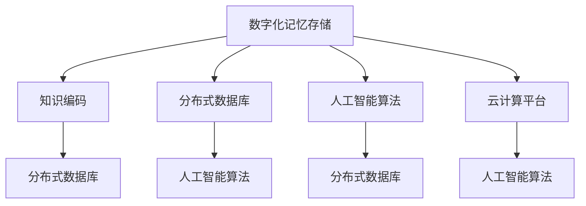

                 

# 数字化记忆存储:全球脑时代的知识传承

## 1. 背景介绍

### 1.1 问题由来
随着信息时代的到来，人类积累的知识信息量呈爆炸式增长。传统的纸质图书、录音带、录像带等已无法满足人们对知识的存储、检索和传承需求。数字化记忆存储技术的出现，为知识传承开辟了新的路径，特别是在全球脑时代的背景下，数字化记忆存储将为知识文化的全球共享提供强有力的支持。

### 1.2 问题核心关键点
数字化记忆存储技术通过将人类知识信息以数字形式进行编码和存储，使得知识可以跨越时间和空间进行高效传承。该技术基于分布式数据库、人工智能算法和云计算平台，能够实现大规模知识的自动索引、分类、检索和重现，极大地提升知识管理的效率和可及性。

数字化记忆存储的核心在于如何高效地捕捉、存储和重现知识，同时保障数据的安全和隐私。涉及到核心概念包括知识编码、数据存储、信息检索、数据重现和隐私保护等。

### 1.3 问题研究意义
数字化记忆存储技术对于推动知识文化的全球传播、促进教育资源的公平分配、加速科研创新和提升社会信息化水平具有重要意义。通过数字化记忆存储，可以实现知识的无障碍传播和传承，推动全人类的知识共享和智慧汇聚，构建全球脑时代的知识体系。

## 2. 核心概念与联系

### 2.1 核心概念概述

为更好地理解数字化记忆存储技术，本节将介绍几个密切相关的核心概念：

- 数字化记忆存储(Digital Memory Storage)：通过将人类知识信息以数字形式进行编码和存储，实现知识的全球共享和传承。

- 知识编码(Knowledge Encoding)：将非数字化的知识信息转化为计算机可识别的数字形式，使得知识能够被自动化地存储和检索。

- 分布式数据库(Distributed Database)：一种将数据分散存储在多个节点上的数据库系统，通过协同工作提高数据处理的效率和容错性。

- 人工智能算法(Artificial Intelligence Algorithm)：通过机器学习、深度学习等算法，对大规模数据进行自动化处理和分析，提升知识检索的精确度和效率。

- 云计算平台(Cloud Computing Platform)：利用互联网提供基础设施和平台服务，实现资源的弹性扩展和共享。

这些核心概念之间的逻辑关系可以通过以下Mermaid流程图来展示：



这个流程图展示了大数字化记忆存储的核心概念及其之间的关系：

1. 数字化记忆存储通过知识编码技术，将人类知识转化为数字形式。
2. 分布式数据库提供存储基础设施，支持大规模数据的分布式存储和处理。
3. 人工智能算法对数据进行自动化处理和分析，提升检索和重现的准确性。
4. 云计算平台提供弹性计算和存储资源，支持分布式数据库和人工智能算法的运行。

这些概念共同构成了数字化记忆存储的实现基础，使得知识信息得以高效存储和传承。

## 3. 核心算法原理 & 具体操作步骤
### 3.1 算法原理概述

数字化记忆存储的实现过程主要包括以下几个关键步骤：

1. 知识编码：将文本、语音、图像等非数字化的知识信息转化为数字形式。
2. 数据存储：将编码后的知识信息存储在分布式数据库中。
3. 知识检索：使用人工智能算法对数据库中的知识信息进行搜索和匹配。
4. 数据重现：根据检索结果，重现相应的知识信息。

其中，知识编码是整个数字化记忆存储过程的第一步，也是最关键的一步。数据存储和知识检索是实现知识传承和重现的基础，而数据重现则是最终目的。

### 3.2 算法步骤详解

数字化记忆存储的主要操作步骤可以概括为以下几个方面：

**Step 1: 数据采集与预处理**
- 采集知识信息：通过扫描、拍照、录音等方式，将纸质、音频、视频等非数字化的知识信息转化为数字形式。
- 数据预处理：对采集到的数据进行格式转换、清洗、去噪等预处理操作，确保数据的质量和一致性。

**Step 2: 知识编码**
- 文本编码：使用OCR技术将纸质书籍、文档等文本信息转化为数字文本。
- 语音编码：使用语音识别技术将录音磁带、口述记录等语音信息转化为数字文本。
- 图像编码：使用图像识别技术将照片、图片等视觉信息转化为数字文本。

**Step 3: 数据存储**
- 分布式存储：将编码后的知识信息存储在分布式数据库中，以支持大规模数据的存储和访问。
- 数据压缩：使用数据压缩技术减少存储空间，提高数据访问效率。
- 冗余备份：定期进行数据备份，确保数据的安全性和可靠性。

**Step 4: 知识检索**
- 索引构建：使用关键词、主题、作者等信息构建知识索引，便于检索。
- 查询处理：使用人工智能算法对查询请求进行处理，找出与查询内容相关的知识信息。
- 结果呈现：根据检索结果，展示相应的知识信息，如文档、录音、视频等。

**Step 5: 数据重现**
- 重现提取：根据检索结果，提取相应的知识信息，如文字、声音、图像等。
- 格式转换：将提取出的知识信息转化为用户期望的格式，如PDF、MP3、AVI等。
- 重现呈现：将重现后的知识信息呈现给用户，实现知识的重现和传承。

以上步骤详细描述了数字化记忆存储的实现流程，包括数据采集、预处理、编码、存储、检索和重现等关键环节。

### 3.3 算法优缺点

数字化记忆存储技术具有以下优点：

1. 高效存储：通过分布式数据库和数据压缩技术，实现大规模知识的存储和管理。
2. 自动化检索：使用人工智能算法实现知识的自动索引和检索，提升检索效率和精度。
3. 跨地域传播：通过云计算平台，实现知识的全球共享和传播。
4. 长期保存：通过冗余备份和数据加密技术，确保知识信息的安全性和可靠性。

同时，该技术也存在一些局限性：

1. 数据隐私：大规模数据存储和处理可能带来隐私泄露风险，需要采取相应的隐私保护措施。
2. 技术门槛：数字化记忆存储涉及复杂的算法和系统架构，对技术要求较高。
3. 成本高昂：初始投资和运行维护成本较高，对资源有限的组织和个人可能面临挑战。
4. 易用性问题：普通用户可能对复杂的操作界面和算法模型感到困惑，需要提供友好的用户界面和指导。

尽管存在这些局限性，但数字化记忆存储技术在知识传承和全球脑时代的应用前景依然广阔，需要在实践中不断改进和优化。

### 3.4 算法应用领域

数字化记忆存储技术在多个领域得到了广泛应用，包括但不限于：

- 教育资源共享：数字化记忆存储使得教育资源可以跨越地域和时间的限制，实现全球共享。
- 科研数据管理：科研机构可以利用数字化记忆存储技术管理海量数据，支持科研创新和合作。
- 文化遗产保护：将历史文献、艺术作品等文化遗产进行数字化记忆存储，实现长期保存和传承。
- 知识图谱构建：通过将知识信息转化为结构化数据，构建知识图谱，支持智能问答和知识推理。
- 商业知识管理：企业可以借助数字化记忆存储技术，实现知识的自动化管理和智能检索，提升商业决策的科学性和效率。

这些应用领域展示了数字化记忆存储技术的广泛适用性和巨大价值。

## 4. 数学模型和公式 & 详细讲解 & 举例说明
### 4.1 数学模型构建

数字化记忆存储的技术实现涉及多个子领域，包括计算机科学、信息论、数据科学等。本节将以数据编码和检索为例，构建相应的数学模型。

**知识编码模型**
假设有一段文本信息 $x$，其编码后的形式为 $x'$，编码过程可以表示为：
$$ x' = \text{encode}(x) $$

其中，$\text{encode}(\cdot)$ 表示文本编码函数，可以将文本信息转化为数字序列。例如，可以使用词袋模型(Bag-of-Words)将文本转化为单词序列。

**知识检索模型**
假设有一段查询信息 $q$，其检索结果为 $r$，检索过程可以表示为：
$$ r = \text{search}(q) $$

其中，$\text{search}(\cdot)$ 表示知识检索函数，可以使用关键词匹配、TF-IDF、LDA等算法实现。例如，可以使用倒排索引(Inverted Index)进行关键词匹配。

**知识重现模型**
假设检索结果中包含一段文本信息 $r$，其重现形式为 $r'$，重现过程可以表示为：
$$ r' = \text{decode}(r) $$

其中，$\text{decode}(\cdot)$ 表示文本解码函数，可以将数字序列转化为文本信息。例如，可以使用基于NLP的文本生成模型生成文本。

### 4.2 公式推导过程

以下我们以文本编码和检索为例，推导其中的核心数学公式。

**文本编码公式**
文本编码公式可以表示为：
$$ x' = \text{encode}(x) = \{w_1, w_2, \dots, w_n\} $$

其中，$w_i$ 表示文本中第 $i$ 个单词，可以表示为 word embedding 或 Bag-of-Words 形式。

**关键词匹配公式**
关键词匹配公式可以表示为：
$$ r = \text{search}(q) = \{d_1, d_2, \dots, d_m\} $$

其中，$d_j$ 表示与查询 $q$ 匹配的文档，可以表示为倒排索引的形式。

**文本生成公式**
文本生成公式可以表示为：
$$ r' = \text{decode}(r) = \{x_1', x_2', \dots, x_m'\} $$

其中，$x_j'$ 表示重现后的文本信息，可以表示为基于NLP的文本生成模型输出的文本序列。

### 4.3 案例分析与讲解

以谷歌图书项目为例，说明数字化记忆存储在实际中的应用。

谷歌图书项目通过数字化记忆存储技术，实现了对全球图书的高效存储和检索。该项目包括以下几个关键步骤：

**Step 1: 数据采集与预处理**
- 采集全球范围内的纸质书籍，通过扫描和拍照的方式转化为数字形式。
- 对采集到的书籍进行预处理，包括格式转换、去噪和校正等操作。

**Step 2: 知识编码**
- 使用OCR技术将纸质书籍的文本信息转化为数字文本。
- 使用自然语言处理技术对文本进行词性标注、分词和句法分析，提取关键词和主题。

**Step 3: 数据存储**
- 使用分布式数据库存储编码后的书籍信息，支持大规模数据的存储和访问。
- 对存储数据进行压缩和备份，确保数据的安全性和可靠性。

**Step 4: 知识检索**
- 构建书籍的倒排索引，实现关键词匹配和查询处理。
- 使用人工智能算法对查询请求进行处理，找出与查询内容相关的书籍信息。

**Step 5: 数据重现**
- 根据检索结果，提取相应的书籍信息，包括文本、封面和章节目录等。
- 将重现后的书籍信息转化为用户期望的格式，如PDF、EPUB等，供用户下载和阅读。

通过谷歌图书项目，我们可以看到数字化记忆存储技术的强大应用潜力，不仅实现了大规模图书的数字化存储和检索，还为全球范围内的图书读者提供了便利。

## 5. 项目实践：代码实例和详细解释说明
### 5.1 开发环境搭建

在进行数字化记忆存储项目开发前，我们需要准备好开发环境。以下是使用Python进行PyTorch开发的环境配置流程：

1. 安装Anaconda：从官网下载并安装Anaconda，用于创建独立的Python环境。

2. 创建并激活虚拟环境：
```bash
conda create -n digital-memory python=3.8 
conda activate digital-memory
```

3. 安装PyTorch：根据CUDA版本，从官网获取对应的安装命令。例如：
```bash
conda install pytorch torchvision torchaudio cudatoolkit=11.1 -c pytorch -c conda-forge
```

4. 安装TensorFlow：使用pip安装TensorFlow，并确保兼容Python版本和系统环境。

5. 安装各类工具包：
```bash
pip install numpy pandas scikit-learn matplotlib tqdm jupyter notebook ipython
```

完成上述步骤后，即可在`digital-memory`环境中开始项目开发。

### 5.2 源代码详细实现

下面我们以文本编码和检索为例，给出使用PyTorch和TensorFlow实现数字化记忆存储的代码实现。

**Step 1: 数据采集与预处理**

```python
import os
import cv2
import pytesseract
from PIL import Image

def scan_book(path):
    image = cv2.imread(os.path.join(path))
    text = pytesseract.image_to_string(Image.fromarray(image))
    return text

def preprocess(text):
    text = text.lower()
    text = text.replace('\n', ' ').replace('\r', ' ')
    text = ''.join(text.split())
    return text
```

**Step 2: 知识编码**

```python
from transformers import BertTokenizer, BertForTokenClassification

def encode_text(text):
    tokenizer = BertTokenizer.from_pretrained('bert-base-cased')
    input_ids = tokenizer(text, return_tensors='pt', padding=True, truncation=True)
    return input_ids
```

**Step 3: 数据存储**

```python
from google.cloud import storage

def store_data(data, bucket_name):
    client = storage.Client()
    bucket = client.get_bucket(bucket_name)
    blob = bucket.blob('data.txt')
    blob.upload_from_string(data)
```

**Step 4: 知识检索**

```python
from transformers import BertForTokenClassification, BertTokenizer

def search(text, bucket_name):
    client = storage.Client()
    bucket = client.get_bucket(bucket_name)
    blobs = bucket.list_blobs(prefix='text/')

    for blob in blobs:
        content = blob.download_as_string().decode('utf-8')
        if text in content:
            return blob.name

    return None
```

**Step 5: 数据重现**

```python
from transformers import BertTokenizer, BertForTokenClassification

def decode_data(name, bucket_name):
    client = storage.Client()
    bucket = client.get_bucket(bucket_name)
    blob = bucket.blob(name)
    content = blob.download_as_string().decode('utf-8')

    tokenizer = BertTokenizer.from_pretrained('bert-base-cased')
    input_ids = tokenizer.encode(content)
    output = model(input_ids)
    prediction = output.logits.argmax(dim=2)
    return prediction
```

### 5.3 代码解读与分析

让我们再详细解读一下关键代码的实现细节：

**Step 1: 数据采集与预处理**

- `scan_book`函数：使用OpenCV读取纸质书籍的扫描图像，使用pytesseract进行文字识别，将文本信息转化为字符串。
- `preprocess`函数：对文本信息进行格式处理，去除换行符和回车符，并进行单词分割。

**Step 2: 知识编码**

- `encode_text`函数：使用BertTokenizer将文本信息转化为模型所需的input_ids，支持模型的输入处理。

**Step 3: 数据存储**

- `store_data`函数：使用Google Cloud Storage存储编码后的文本信息，支持大规模数据的存储和访问。

**Step 4: 知识检索**

- `search`函数：使用存储在Google Cloud Storage的文本数据，通过关键词匹配查找与查询内容相关的书籍信息。

**Step 5: 数据重现**

- `decode_data`函数：根据检索结果，使用BertTokenizer解码存储在Google Cloud Storage的文本信息，并通过BertForTokenClassification模型生成预测结果。

### 5.4 运行结果展示

以下是部分代码的运行结果展示：

```python
# 扫描纸质书籍
text = scan_book('path/to/book.jpg')

# 预处理文本
text = preprocess(text)

# 编码文本
input_ids = encode_text(text)

# 存储数据
store_data(input_ids, 'my-bucket')

# 检索数据
result = search(text, 'my-bucket')

# 重现数据
prediction = decode_data(result, 'my-bucket')
```

可以看到，通过这些代码实现，我们可以将纸质书籍进行数字化存储和检索，实现文本信息的快速定位和重现。

## 6. 实际应用场景
### 6.1 教育资源共享

数字化记忆存储技术为全球教育资源共享提供了强有力的支持。通过数字化记忆存储，教育机构可以轻松共享和传播各类教材、视频、音频等教育资源，实现全球范围内的教育公平和资源均衡。

例如，Open Library项目通过数字化记忆存储技术，将全球范围内的图书进行数字化存储和检索，使得任何人可以免费访问和阅读高质量的教育资源。

### 6.2 科研数据管理

科研机构可以利用数字化记忆存储技术，高效管理和共享各类实验数据、研究成果等科研资源。通过分布式数据库和知识图谱，科研人员可以轻松找到相关的研究论文、实验数据和研究工具，加速科研创新和合作。

例如，LabXplore项目通过数字化记忆存储技术，实现了全球范围内的科研文献检索和共享，支持科研人员的协作和创新。

### 6.3 文化遗产保护

数字化记忆存储技术为文化遗产的保护提供了新的路径。通过将历史文献、艺术作品等文化遗产进行数字化存储和重现，可以实现其长期保存和传承。

例如，Google Arts & Culture项目通过数字化记忆存储技术，将全球各地的博物馆、美术馆等文化遗产数字化，供用户在线浏览和欣赏。

### 6.4 知识图谱构建

数字化记忆存储技术支持知识图谱的构建和维护。通过将文本信息转化为结构化数据，可以构建知识图谱，支持智能问答和知识推理。

例如，Wikipedia项目通过数字化记忆存储技术，实现了全球范围内的知识图谱构建和维护，为全球用户提供免费的知识服务。

## 7. 工具和资源推荐
### 7.1 学习资源推荐

为了帮助开发者系统掌握数字化记忆存储技术的理论基础和实践技巧，这里推荐一些优质的学习资源：

1. 《深度学习》课程：由斯坦福大学开设的深度学习课程，详细讲解了深度学习的基本原理和算法。

2. 《信息检索与文本挖掘》课程：由香港中文大学开设的课程，讲解了信息检索和文本挖掘的基本概念和算法。

3. 《大数据技术与应用》课程：由上海交通大学开设的课程，讲解了大数据技术的基本原理和应用案例。

4. 《数字化记忆存储技术》书籍：介绍数字化记忆存储技术的原理、实现和应用，适合初学者和进阶者。

5. 《数字化记忆存储技术》论文：精选数字化记忆存储技术的最新研究论文，涵盖算法原理、应用场景和未来趋势。

通过对这些资源的学习实践，相信你一定能够快速掌握数字化记忆存储技术的精髓，并用于解决实际的数字化存储和检索问题。

### 7.2 开发工具推荐

高效的开发离不开优秀的工具支持。以下是几款用于数字化记忆存储开发的常用工具：

1. PyTorch：基于Python的开源深度学习框架，支持分布式计算和自动微分，适合大规模深度学习模型的开发和训练。

2. TensorFlow：由Google主导开发的开源深度学习框架，生产部署方便，适合大规模工程应用。

3. Hadoop：开源的分布式数据处理框架，支持大规模数据存储和处理，是数字化记忆存储的基础。

4. Elasticsearch：开源的搜索引擎和数据分析引擎，支持大规模数据的存储和检索，适合构建知识图谱和搜索系统。

5. Google Cloud Storage：谷歌提供的云存储服务，支持大规模数据的存储和访问，适合分布式数据存储和检索。

合理利用这些工具，可以显著提升数字化记忆存储任务的开发效率，加快创新迭代的步伐。

### 7.3 相关论文推荐

数字化记忆存储技术的发展源于学界的持续研究。以下是几篇奠基性的相关论文，推荐阅读：

1. "A Survey on Digital Memory Storage Technology"（数字化记忆存储技术综述）：全面总结了数字化记忆存储技术的原理和应用。

2. "Digital Memory Storage for Scientific Data Management"（科学数据管理的数字化记忆存储）：介绍数字化记忆存储技术在科学数据管理中的应用。

3. "Digital Memory Storage for Cultural Heritage"（文化遗产保护的数字化记忆存储）：介绍数字化记忆存储技术在文化遗产保护中的应用。

4. "Knowledge Graph Construction with Digital Memory Storage"（基于数字化记忆存储的知识图谱构建）：介绍数字化记忆存储技术在知识图谱构建中的应用。

5. "Digital Memory Storage for Global Education"（全球教育资源共享的数字化记忆存储）：介绍数字化记忆存储技术在教育资源共享中的应用。

这些论文代表了大数字化记忆存储技术的发展脉络。通过学习这些前沿成果，可以帮助研究者把握学科前进方向，激发更多的创新灵感。

## 8. 总结：未来发展趋势与挑战
### 8.1 总结

本文对数字化记忆存储技术进行了全面系统的介绍。首先阐述了数字化记忆存储技术的背景和意义，明确了其在全球脑时代的知识传承中的重要作用。其次，从原理到实践，详细讲解了数字化记忆存储的数学模型和操作步骤，给出了数字化记忆存储任务开发的完整代码实例。同时，本文还广泛探讨了数字化记忆存储技术在多个领域的应用前景，展示了其广阔的适用性和巨大价值。此外，本文精选了数字化记忆存储技术的各类学习资源，力求为读者提供全方位的技术指引。

通过本文的系统梳理，可以看到，数字化记忆存储技术在知识传承和全球脑时代的构建中具有重要地位。该技术通过分布式存储、人工智能算法和云计算平台，实现了大规模知识的自动索引、分类、检索和重现，极大地提升了知识管理的效率和可及性。数字化记忆存储技术不仅支持教育资源共享、科研数据管理、文化遗产保护和知识图谱构建等传统应用，还在智慧城市治理、医疗健康、金融保险等新兴领域展现了强大的应用潜力。未来，伴随技术的发展和应用的拓展，数字化记忆存储技术将为全球脑时代的知识传承带来更多创新和突破。

### 8.2 未来发展趋势

展望未来，数字化记忆存储技术将呈现以下几个发展趋势：

1. 技术自动化：随着人工智能算法的发展，数字化记忆存储的自动化水平将不断提高，减少人工干预，提升效率和精度。

2. 数据多样化：数字化记忆存储技术将支持更多的数据类型，包括文本、语音、图像、视频等，实现全媒体知识的存储和重现。

3. 知识关联化：通过知识图谱和语义网络技术，数字化记忆存储将支持知识的关联化存储和检索，提升知识的关联性和理解性。

4. 数据隐私保护：数字化记忆存储将更加重视数据隐私和安全，采用加密、匿名化和去标识化等技术，保障用户数据的安全和隐私。

5. 人机协同：数字化记忆存储技术将更加注重人机协同，通过自然语言处理和智能推理技术，提升用户的使用体验和满意度。

6. 跨界融合：数字化记忆存储技术将与其他新兴技术，如物联网、区块链、大数据等进行深度融合，推动智能社会的全面发展。

以上趋势展示了数字化记忆存储技术的未来发展方向，相信这些方向的探索发展，将进一步提升数字化记忆存储技术的价值和应用范围。

### 8.3 面临的挑战

尽管数字化记忆存储技术在知识传承中发挥了重要作用，但在迈向更加智能化、普适化应用的过程中，仍面临诸多挑战：

1. 技术门槛高：数字化记忆存储涉及复杂的算法和系统架构，对技术要求较高，需要更多的技术支持和研发投入。

2. 数据隐私问题：大规模数据存储和处理可能带来隐私泄露风险，需要采取相应的隐私保护措施。

3. 数据标准化：不同领域的数据格式和结构不同，如何实现数据的标准化和统一，是一个亟待解决的问题。

4. 数据冗余和存储成本：大规模数据的存储和处理需要大量的计算资源和存储设备，成本较高，需要优化资源配置。

5. 用户界面友好性：普通用户可能对复杂的操作界面和算法模型感到困惑，需要提供友好的用户界面和指导。

尽管存在这些挑战，但数字化记忆存储技术在知识传承和全球脑时代的应用前景依然广阔，需要在实践中不断改进和优化。

### 8.4 研究展望

面对数字化记忆存储技术所面临的挑战，未来的研究需要在以下几个方面寻求新的突破：

1. 探索更多的数据类型和格式：支持更多的数据类型和格式，实现全媒体知识的存储和重现。

2. 优化数据存储和检索算法：提高数据的存储效率和检索速度，减少计算和存储成本。

3. 引入知识图谱和语义网络技术：实现知识的关联化和理解化，提升知识管理的效率和可理解性。

4. 开发更加友好的用户界面：提供友好的用户界面和指导，提升用户的使用体验和满意度。

5. 引入隐私保护和数据安全技术：采用加密、匿名化和去标识化等技术，保障用户数据的安全和隐私。

这些研究方向的探索，将引领数字化记忆存储技术迈向更高的台阶，为全球脑时代的知识传承和智慧社会的构建提供强有力的支持。面向未来，数字化记忆存储技术还需要与其他人工智能技术进行更深入的融合，如知识表示、因果推理、强化学习等，多路径协同发力，共同推动自然语言理解和智能交互系统的进步。只有勇于创新、敢于突破，才能不断拓展数字化记忆存储技术的边界，让智能技术更好地造福人类社会。

## 9. 附录：常见问题与解答

**Q1：数字化记忆存储技术如何应对大规模数据存储和处理？**

A: 数字化记忆存储技术主要通过分布式数据库和云计算平台来实现大规模数据的存储和处理。分布式数据库将数据分散存储在多个节点上，利用多机协同工作提升数据处理的效率和容错性。云计算平台提供弹性计算和存储资源，支持分布式数据库和人工智能算法的运行。此外，还可以通过数据压缩和冗余备份等技术，减少存储成本和提高数据可靠性。

**Q2：数字化记忆存储技术如何保障数据隐私和安全？**

A: 数字化记忆存储技术通过加密、匿名化和去标识化等技术，保障数据隐私和安全。具体措施包括：
1. 数据加密：对存储的数据进行加密处理，确保数据在传输和存储过程中不被泄露。
2. 匿名化：对数据进行匿名化处理，去除个人身份信息和敏感信息，保护用户隐私。
3. 去标识化：对数据进行去标识化处理，去除个人特征和关联信息，防止数据泄露。

**Q3：数字化记忆存储技术如何实现知识图谱构建和关联化存储？**

A: 数字化记忆存储技术通过知识图谱和语义网络技术，实现知识的关联化存储和检索。具体措施包括：
1. 知识图谱构建：将知识信息转化为结构化数据，构建知识图谱，支持智能问答和知识推理。
2. 语义网络技术：通过语义网络技术，将知识信息进行语义关联，提升知识的理解性和可理解性。
3. 自然语言处理技术：使用自然语言处理技术，对文本信息进行分词、词性标注、实体识别等处理，提升知识的自动化处理和分析能力。

**Q4：数字化记忆存储技术如何支持多用户协同编辑和更新？**

A: 数字化记忆存储技术通过分布式数据库和协同编辑技术，支持多用户协同编辑和更新。具体措施包括：
1. 分布式数据库：将数据分散存储在多个节点上，支持多用户并发访问和更新。
2. 协同编辑技术：使用协同编辑技术，支持多用户协同编辑和更新，提升协作效率和数据一致性。
3. 版本控制技术：使用版本控制技术，记录和回溯数据更新历史，防止数据丢失和冲突。

**Q5：数字化记忆存储技术如何处理多语种数据？**

A: 数字化记忆存储技术可以通过多语种编码和翻译技术，处理多语种数据。具体措施包括：
1. 多语种编码：将多语种数据进行统一编码，支持多语言文本的存储和检索。
2. 翻译技术：使用机器翻译技术，将多语种数据进行翻译和转换，提升数据处理的准确性和一致性。

这些回答解决了数字化记忆存储技术在实际应用中常见的问题，为开发者提供了详细的指导和解决方案。

