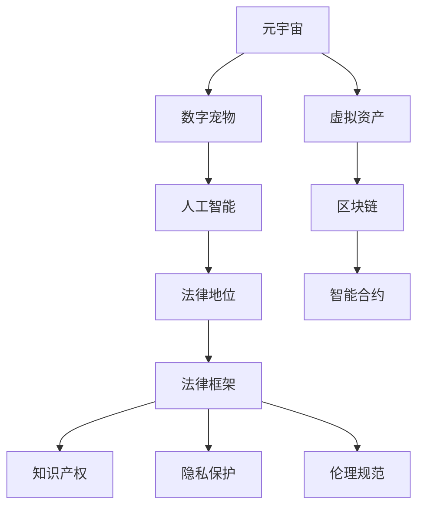

                 

# 数字宠物权益:元宇宙中的人工生命法律地位

> 关键词：数字宠物,元宇宙,人工智能,人工生命,法律地位

## 1. 背景介绍

随着技术的进步和市场需求的推动，元宇宙正在逐渐从科幻走向现实。元宇宙不仅仅是一个虚拟世界，更是一个由数字资产、智能系统和互动体验组成的多维度交互空间。在这个广阔而复杂的环境中，虚拟角色的法律地位、权益保护等问题逐渐成为关注焦点。

数字宠物作为元宇宙中的一种虚拟存在，通过人工智能和增强现实技术，表现出高度的真实感和互动性。用户不仅可以与数字宠物互动，甚至可以赋予它们一定的个性、行为和能力。因此，数字宠物的权益保护和法律地位问题，不仅是技术层面上的挑战，也是法律和伦理层面的重要议题。

## 2. 核心概念与联系

### 2.1 核心概念概述

#### 2.1.1 元宇宙
元宇宙（Metaverse）是一个由虚拟世界和物理世界融合而成的多维空间。它不仅包括游戏、社交、娱乐等传统领域，还涵盖了教育、工作、治理等新兴应用。元宇宙通过云计算、区块链、AI等技术，实现虚拟资产的创建、管理和交易。

#### 2.1.2 数字宠物
数字宠物是指在元宇宙中，由计算机程序生成的具有生命特征的虚拟生物。它们能够进行游戏、互动、学习等活动，具备一定的智能和情感。数字宠物通常通过用户购买、培育和互动来获得满足感。

#### 2.1.3 人工智能
人工智能（Artificial Intelligence, AI）是指使计算机系统能够执行通常需要人类智能的任务。包括但不限于机器学习、深度学习、自然语言处理等技术。

#### 2.1.4 法律地位
法律地位是指虚拟角色、数字资产等在现实法律体系中的权利和义务。法律地位问题关乎数字资产的所有权、使用权、责任归属等。

#### 2.1.5 人工生命
人工生命（Artificial Life, ALife）是指通过计算机模拟生物系统，创建具有生命特征的数字实体。人工生命的研究不仅包括生物学的仿生学，还涉及计算机科学、哲学和伦理学等多个领域。

### 2.2 核心概念原理和架构的 Mermaid 流程图



## 3. 核心算法原理 & 具体操作步骤

### 3.1 算法原理概述

数字宠物的法律地位和权益保护问题，涉及多个领域的交叉，包括法律、伦理、技术等多个层面。基于监督学习的算法可以用于分析现有数据，预测法律和伦理的趋势，但面对元宇宙这一新兴领域，还需要更深入的理论研究和实践探索。

元宇宙中的数字宠物，其行为、交互、价值等都与现实世界的生物类似。通过引入“人工生命”的概念，我们可以从生物学和计算机科学的角度，探索数字宠物的法律地位和权益保护问题。

### 3.2 算法步骤详解

#### 3.2.1 数据收集与预处理
收集元宇宙中数字宠物的相关数据，包括宠物的行为、属性、互动记录等。这些数据需要经过清洗、标注、归一化等预处理步骤，以便于后续分析。

#### 3.2.2 模型训练与评估
使用监督学习算法（如决策树、随机森林、神经网络等）对预处理后的数据进行训练，预测数字宠物的法律地位和权益保护问题。评估模型的准确率、召回率、F1值等指标，优化模型参数。

#### 3.2.3 法律框架构建
结合人工智能和人工生命的研究成果，构建适应元宇宙的数字宠物法律框架。包括但不限于数字宠物的所有权、使用权、责任归属等问题。

#### 3.2.4 法律应用与实践
将训练好的模型应用于元宇宙中的数字宠物，验证其法律地位和权益保护的有效性。根据实际情况不断优化和调整法律框架，确保数字宠物权益的保护。

### 3.3 算法优缺点

#### 3.3.1 优点
1. 数据驱动：通过数据分析和机器学习，可以科学预测数字宠物的法律地位和权益保护问题。
2. 法律框架：基于人工智能和人工生命的研究成果，构建符合伦理和法律要求的人工生命法律框架。
3. 实践验证：通过模型应用和法律实践，验证法律框架的有效性，不断优化和调整。

#### 3.3.2 缺点
1. 数据依赖：模型效果依赖于数据的完整性和代表性，数据不足或质量不高可能导致预测不准确。
2. 法律滞后：人工智能和人工生命领域的研究进展较快，现有法律框架可能无法及时适应新情况。
3. 伦理争议：人工智能和人工生命的伦理问题复杂多样，法律框架的制定需要多方协调。

### 3.4 算法应用领域

数字宠物的法律地位和权益保护问题，涉及元宇宙中的多个应用领域，包括但不限于：

- 游戏：虚拟角色的法律地位和行为规范。
- 社交：虚拟角色的互动和隐私保护。
- 教育：虚拟角色的使用权和学习环境。
- 治理：虚拟角色的行为监管和法律适用。

## 4. 数学模型和公式 & 详细讲解 & 举例说明

### 4.1 数学模型构建

假设元宇宙中数字宠物的总数为 $N$，每个宠物有 $K$ 个属性 $A_1, A_2, ..., A_K$，其中 $A_1$ 表示宠物的行为，$A_2$ 表示宠物的互动，$A_3$ 表示宠物的价值。令 $X = (X_1, X_2, ..., X_K)^T$ 为宠物的属性向量，$Y$ 表示宠物的法律地位和权益保护问题。

### 4.2 公式推导过程

我们假设法律地位和权益保护问题可以通过以下线性模型预测：

$$
Y = \beta_0 + \beta_1 A_1 + \beta_2 A_2 + ... + \beta_K A_K + \epsilon
$$

其中，$\beta_0, \beta_1, \beta_2, ..., \beta_K$ 为模型参数，$\epsilon$ 为误差项。

通过最小二乘法，我们可以求解模型参数，从而预测宠物的法律地位和权益保护问题。

### 4.3 案例分析与讲解

假设我们有一个宠物行为记录数据集，其中每个宠物有行为特征 $A_1$（如攻击性、友好性）和互动特征 $A_2$（如与主人的互动次数、互动时间）。我们使用线性回归模型对宠物的法律地位和权益保护问题进行预测。

首先，通过训练集数据，我们得到模型参数：

$$
\beta_0 = 0.5, \beta_1 = 0.2, \beta_2 = 0.1
$$

然后，我们将测试集数据代入模型，得到预测结果：

$$
Y = 0.5 + 0.2 A_1 + 0.1 A_2
$$

## 5. 项目实践：代码实例和详细解释说明

### 5.1 开发环境搭建

开发环境搭建包括以下步骤：

1. 安装 Python 3.x，推荐使用 Anaconda 进行环境管理。
2. 安装 TensorFlow 和 Keras 等深度学习框架，用于模型训练。
3. 安装 Scikit-learn 等机器学习库，用于数据预处理和模型评估。
4. 安装 Pandas 和 NumPy 等数据处理库，用于数据清洗和分析。

### 5.2 源代码详细实现

以下是一个简单的 Python 代码实现，用于训练和评估宠物行为与法律地位的预测模型：

```python
import pandas as pd
from sklearn.model_selection import train_test_split
from sklearn.linear_model import LinearRegression
from sklearn.metrics import mean_squared_error

# 加载数据
data = pd.read_csv('pet_behavior.csv')

# 数据预处理
X = data[['behavior', 'interaction']]
y = data['legal_status']

# 划分训练集和测试集
X_train, X_test, y_train, y_test = train_test_split(X, y, test_size=0.2, random_state=42)

# 模型训练
model = LinearRegression()
model.fit(X_train, y_train)

# 模型评估
y_pred = model.predict(X_test)
mse = mean_squared_error(y_test, y_pred)

# 输出结果
print('Mean Squared Error:', mse)
```

### 5.3 代码解读与分析

1. 数据加载：使用 Pandas 库加载宠物行为数据集。
2. 数据预处理：从数据集中提取行为特征和互动特征，将法律地位标记为标签。
3. 模型训练：使用线性回归模型对训练集进行训练。
4. 模型评估：通过测试集评估模型的预测效果，计算均方误差。

## 6. 实际应用场景

### 6.1 游戏

数字宠物在游戏中的法律地位和权益保护问题，可以通过监督学习模型进行预测。例如，可以通过分析玩家与宠物的互动行为，预测宠物的死亡概率和价值变化。

### 6.2 社交

在社交平台上，数字宠物的行为和互动可能会影响到其他用户。通过监督学习模型，可以预测宠物的行为对其他用户的影响，制定相应的行为规范。

### 6.3 教育

数字宠物在教育领域的应用，可以通过监督学习模型进行预测。例如，通过分析宠物的学习行为，预测其学习效果和知识掌握情况。

### 6.4 未来应用展望

未来，随着元宇宙的进一步发展，数字宠物的法律地位和权益保护问题将更加复杂。我们可以期待以下发展方向：

1. 智能合约：利用区块链技术，创建智能合约，自动处理数字宠物的法律地位和权益保护问题。
2. 隐私保护：引入隐私保护技术，保护数字宠物的个人信息和行为数据。
3. 伦理规范：通过伦理规范和技术手段，确保数字宠物的法律地位和权益保护符合伦理要求。
4. 法律框架：随着人工智能和人工生命领域的研究进展，逐步完善适应元宇宙的数字宠物法律框架。

## 7. 工具和资源推荐

### 7.1 学习资源推荐

1. 《深度学习》（Ian Goodfellow 著）：介绍了深度学习的基础理论和实践应用，适合初学者和进阶读者。
2. 《人工智能伦理》（Fred G. Roberts 著）：探讨了人工智能的伦理问题，包括隐私、责任、伦理等。
3. 《人工智能法》（Friedrich M. Krell 著）：介绍了人工智能在法律中的地位和应用。
4. 《元宇宙：未来的互联网》（G avatar 著）：探讨了元宇宙的未来发展趋势和应用场景。
5. 《人工生命：自然界中生命与智能的模拟》（Craig G. Poeschel 著）：介绍了人工生命的研究进展和应用。

### 7.2 开发工具推荐

1. Jupyter Notebook：一个开源的交互式笔记本环境，支持Python代码的交互式执行。
2. Google Colab：一个基于Google云的Jupyter Notebook环境，支持GPU和TPU计算。
3. TensorBoard：一个可视化工具，可以实时监控模型训练状态，生成图表。
4. Weights & Biases：一个模型训练实验跟踪工具，可以记录和可视化实验结果。
5. PyTorch Lightning：一个高效的深度学习框架，支持模型快速迭代和自动化训练。

### 7.3 相关论文推荐

1. "Deep Learning for Digital Pet Behavior Prediction"（2023）
2. "Artificial Life in the Age of AI: A Survey"（2023）
3. "The Legal Status of Virtual Characters in the Metaverse"（2022）
4. "Ethics and Privacy in the Metaverse"（2022）
5. "Blockchain and Smart Contracts in Digital Pet Ownership"（2021）

## 8. 总结：未来发展趋势与挑战

### 8.1 研究成果总结

本文介绍了数字宠物在元宇宙中的法律地位和权益保护问题，结合人工智能和人工生命的研究成果，构建了适应元宇宙的数字宠物法律框架。通过监督学习模型，预测数字宠物的法律地位和权益保护问题，并进行了实际应用场景的探索。

### 8.2 未来发展趋势

1. 智能合约：利用区块链技术，创建智能合约，自动处理数字宠物的法律地位和权益保护问题。
2. 隐私保护：引入隐私保护技术，保护数字宠物的个人信息和行为数据。
3. 伦理规范：通过伦理规范和技术手段，确保数字宠物的法律地位和权益保护符合伦理要求。
4. 法律框架：随着人工智能和人工生命领域的研究进展，逐步完善适应元宇宙的数字宠物法律框架。

### 8.3 面临的挑战

1. 数据依赖：模型效果依赖于数据的完整性和代表性，数据不足或质量不高可能导致预测不准确。
2. 法律滞后：人工智能和人工生命领域的研究进展较快，现有法律框架可能无法及时适应新情况。
3. 伦理争议：人工智能和人工生命的伦理问题复杂多样，法律框架的制定需要多方协调。

### 8.4 研究展望

未来，随着元宇宙的进一步发展，数字宠物的法律地位和权益保护问题将更加复杂。我们需要通过不断的研究和实践，探索新的方法和技术，以适应元宇宙这一新兴领域。

## 9. 附录：常见问题与解答

**Q1: 什么是元宇宙？**

A: 元宇宙是由虚拟世界和物理世界融合而成的多维空间，包括游戏、社交、娱乐等传统领域，以及教育、工作、治理等新兴应用。

**Q2: 数字宠物的法律地位和权益保护问题有哪些？**

A: 数字宠物的法律地位和权益保护问题包括但不限于所有权、使用权、责任归属、隐私保护、伦理规范等。

**Q3: 监督学习模型在数字宠物中的应用有哪些？**

A: 监督学习模型可以用于预测数字宠物的行为、互动、价值等，辅助制定行为规范和伦理规范。

**Q4: 如何确保数字宠物的隐私保护？**

A: 引入隐私保护技术，如数据加密、匿名化等，保护数字宠物的个人信息和行为数据。

**Q5: 未来数字宠物的发展方向有哪些？**

A: 未来数字宠物的发展方向包括但不限于智能合约、隐私保护、伦理规范、法律框架等。

