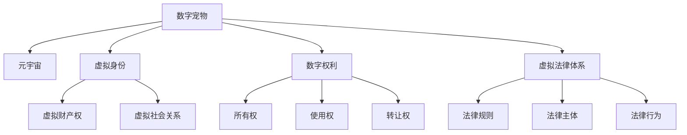

                 

# 数字宠物权益保护法:元宇宙中的人工生命法律地位

> 关键词：数字宠物,人工智能,元宇宙,法律地位,权益保护

## 1. 背景介绍

### 1.1 问题由来
随着数字经济的发展和技术的不断进步，虚拟数字资产（包括数字宠物、数字土地、数字艺术品等）逐渐成为一种新兴的数字资产形式，并在元宇宙等虚拟空间中得到广泛应用。在这些虚拟空间中，数字宠物作为一类特殊的虚拟数字资产，因其独特的社交属性、娱乐价值和个性化特征，成为用户获取虚拟社交体验、展示自我个性、参与虚拟社交活动的重要载体。然而，随着数字宠物的普及和价值提升，其法律地位、权益保护问题也逐渐成为关注的焦点。

### 1.2 问题核心关键点
数字宠物作为元宇宙中的一种虚拟资产，其法律地位、权益保护问题主要集中在以下几个方面：

1. **数字宠物的财产权归属**：谁拥有数字宠物的财产权？数字宠物是否具有独立的法律地位？
2. **数字宠物的权益保护**：数字宠物权益保护应遵循哪些原则？如何确保数字宠物的权益不被侵害？
3. **数字宠物的转让与使用**：数字宠物是否可以转让？转让的条件与流程是什么？
4. **数字宠物与人类之间的关系**：数字宠物在虚拟社交活动中是否应享有特定权利？

这些问题不仅涉及到虚拟资产的财产权归属和法律保护，还涉及到元宇宙中虚拟身份的权益保护、虚拟社会关系构建等更深层次的问题。

## 2. 核心概念与联系

### 2.1 核心概念概述

为更好地理解元宇宙中数字宠物的法律地位和权益保护问题，本节将介绍几个密切相关的核心概念：

- **数字宠物**：指在虚拟空间（如元宇宙、区块链等）中，由程序代码定义的、具备特定属性和能力的虚拟形象或生物。
- **元宇宙**：一个由多个虚拟空间构成的、由用户自主创建和参与的虚拟世界。元宇宙中的虚拟资产，如数字宠物，具有高度的自治性和参与性。
- **虚拟身份**：用户在虚拟空间中的身份标识，可以是人形角色、动物形象等，具有虚拟财产权和虚拟社会关系。
- **数字权利**：指在虚拟空间中，由程序代码定义和维护的权利，包括但不限于所有权、使用权、转让权等。
- **虚拟法律体系**：由虚拟空间中的法律规则、法律主体和法律行为构成的法律体系，用于规范虚拟空间中的行为，维护虚拟秩序。

这些核心概念之间的逻辑关系可以通过以下Mermaid流程图来展示：



这个流程图展示了大语言模型的核心概念及其之间的关系：

1. 数字宠物是元宇宙中的重要组成部分。
2. 数字宠物与虚拟身份、虚拟权利密切相关，构成虚拟资产的一部分。
3. 虚拟身份、虚拟权利与虚拟法律体系互相交织，共同构成虚拟空间的行为规范。

## 3. 核心算法原理 & 具体操作步骤

### 3.1 算法原理概述

在元宇宙中，数字宠物的权益保护问题可以抽象为一个“权益映射”问题，即如何将虚拟世界中的数字宠物与现实世界中的法律实体进行映射，以确保数字宠物的权益得到充分保护。具体而言，数字宠物的权益映射包括以下几个步骤：

1. **确定数字宠物的权益范围**：明确数字宠物在虚拟世界中的所有权、使用权、转让权等权利。
2. **映射数字宠物与虚拟身份**：将数字宠物与虚拟身份进行绑定，确保数字宠物的权益能够与虚拟身份的财产权和社交关系相统一。
3. **映射数字宠物与虚拟权利**：将数字宠物的权益映射到具体的虚拟权利上，如所有权、使用权、转让权等。
4. **映射数字宠物与虚拟法律体系**：将数字宠物的权益保护问题纳入虚拟法律体系的框架内，遵循虚拟空间中的法律规则和行为规范。

### 3.2 算法步骤详解

基于上述“权益映射”问题的原理，数字宠物权益保护法的制定和实施可以遵循以下步骤：

1. **制定数字宠物所有权规则**：明确数字宠物的初始所有权归属，如创建者、购买者等。规定所有权转让的条件和流程，如合同、交易平台等。

2. **制定数字宠物使用权规则**：规定数字宠物的使用方式和范围，如在虚拟空间中的活动、与他人的交互等。确保数字宠物的使用不会侵害他人的权益。

3. **制定数字宠物转让规则**：规定数字宠物转让的条件、程序和限制，如转让合同、交易平台等。确保数字宠物的转让透明、合法。

4. **制定数字宠物与社会关系规则**：规定数字宠物在虚拟社会中的行为规范，如与其他虚拟身份的互动、参与虚拟社会活动等。确保数字宠物的行为符合虚拟社会秩序。

5. **制定数字宠物与虚拟权利的映射规则**：将数字宠物的权益映射到虚拟权利上，确保数字宠物的权益得到法律保护。如将数字宠物的所有权映射到虚拟身份的财产权上，将数字宠物的使用权映射到虚拟身份的使用权上等。

6. **制定数字宠物与虚拟法律体系的映射规则**：将数字宠物的权益保护问题纳入虚拟法律体系，遵循虚拟空间中的法律规则和行为规范。如在区块链上实现数字宠物的智能合约，确保数字宠物的权益得到高效、透明的保护。

### 3.3 算法优缺点

数字宠物权益保护法具有以下优点：

1. **明确权益归属**：通过制定明确的数字宠物所有权和使用权规则，确保数字宠物的权益归属清晰，避免了权利模糊的问题。
2. **保护合法权益**：通过将数字宠物的权益映射到虚拟权利上，确保数字宠物的合法权益得到法律保护，防止非法侵害。
3. **促进公平交易**：通过制定数字宠物转让规则和智能合约，确保数字宠物的转让透明、合法，促进公平交易。
4. **维护虚拟社会秩序**：通过制定数字宠物在虚拟社会中的行为规范，确保数字宠物的行为符合虚拟社会秩序，维护虚拟社会稳定。

同时，数字宠物权益保护法也存在一定的局限性：

1. **法律体系不完善**：当前的法律体系主要针对现实世界的资产和权利，对于虚拟资产和权利的适用性仍需进一步研究和完善。
2. **跨司法管辖**：数字宠物通常在跨国的虚拟空间中存在，其权益保护可能面临跨司法管辖的挑战，需要国际合作和协调。
3. **技术依赖性强**：数字宠物权益保护法的实施高度依赖于技术手段，如智能合约、区块链等，需要技术支持和标准化。
4. **用户认知度低**：用户对数字宠物权益保护法的认知度较低，可能存在权益保护不足的问题。

### 3.4 算法应用领域

数字宠物权益保护法主要应用于以下几个领域：

1. **虚拟游戏**：在虚拟游戏环境中，数字宠物作为重要的虚拟资产，其权益保护问题亟需解决。通过制定数字宠物所有权和使用权规则，确保数字宠物的合法权益得到保护。

2. **虚拟社交平台**：在虚拟社交平台中，数字宠物作为虚拟身份的重要组成部分，其权益保护问题直接影响到虚拟社会关系的构建。通过制定数字宠物行为规范，确保数字宠物的行为符合虚拟社会秩序。

3. **虚拟房地产**：在虚拟房地产市场中，数字宠物作为虚拟土地上的重要资源，其权益保护问题需要特别关注。通过制定数字宠物转让规则和智能合约，确保数字宠物的转让透明、合法。

4. **数字艺术品**：在数字艺术品市场中，数字宠物作为数字艺术品的重要组成部分，其权益保护问题需要特别关注。通过制定数字宠物所有权和使用权规则，确保数字宠物的合法权益得到保护。

5. **虚拟金融**：在虚拟金融市场中，数字宠物作为虚拟资产的一种形式，其权益保护问题需要特别关注。通过制定数字宠物转让规则和智能合约，确保数字宠物的转让透明、合法。

这些领域的应用，展示了数字宠物权益保护法的重要性和可行性，推动了元宇宙中虚拟资产的规范化和标准化。

## 4. 数学模型和公式 & 详细讲解 & 举例说明

### 4.1 数学模型构建

在元宇宙中，数字宠物的权益保护问题可以抽象为“权益映射”问题，即如何将虚拟世界中的数字宠物与现实世界中的法律实体进行映射，以确保数字宠物的权益得到充分保护。

设数字宠物为 $P$，虚拟身份为 $I$，虚拟权利为 $R$，虚拟法律体系为 $L$。则数字宠物权益保护法可以表示为：

$$
P \rightarrow I \rightarrow R \rightarrow L
$$

其中，数字宠物 $P$ 通过映射到虚拟身份 $I$ 上，获得虚拟财产权；虚拟身份 $I$ 通过映射到虚拟权利 $R$ 上，获得对数字宠物的所有权、使用权、转让权等；虚拟权利 $R$ 通过映射到虚拟法律体系 $L$ 上，获得法律保护。

### 4.2 公式推导过程

数字宠物权益保护法可以进一步分解为以下几个子问题：

1. **数字宠物与虚拟身份的映射**：
$$
P \rightarrow I
$$

2. **虚拟身份与虚拟权利的映射**：
$$
I \rightarrow R
$$

3. **虚拟权利与虚拟法律体系的映射**：
$$
R \rightarrow L
$$

对于上述映射过程，可以引入以下数学模型：

1. **数字宠物与虚拟身份的映射**：
$$
P \rightarrow I = f(P, I)
$$

其中，$f$ 表示映射函数，用于将数字宠物 $P$ 映射到虚拟身份 $I$ 上，确保数字宠物的权益归属清晰。

2. **虚拟身份与虚拟权利的映射**：
$$
I \rightarrow R = g(I, R)
$$

其中，$g$ 表示映射函数，用于将虚拟身份 $I$ 映射到虚拟权利 $R$ 上，确保虚拟身份的权益得到保护。

3. **虚拟权利与虚拟法律体系的映射**：
$$
R \rightarrow L = h(R, L)
$$

其中，$h$ 表示映射函数，用于将虚拟权利 $R$ 映射到虚拟法律体系 $L$ 上，确保虚拟权利得到法律保护。

### 4.3 案例分析与讲解

以数字宠物的转让为例，可以分析数字宠物权益保护法的具体应用。

假设用户 $A$ 拥有数字宠物 $P_A$，希望将其转让给用户 $B$。转让过程可以描述为：

1. **数字宠物与虚拟身份的映射**：
$$
P_A \rightarrow I_A = f(P_A, I_A)
$$

2. **虚拟身份与虚拟权利的映射**：
$$
I_A \rightarrow R_A = g(I_A, R_A)
$$

3. **虚拟权利与虚拟法律体系的映射**：
$$
R_A \rightarrow L_A = h(R_A, L_A)
$$

其中，$I_A$ 表示用户 $A$ 的虚拟身份，$R_A$ 表示用户 $A$ 对数字宠物 $P_A$ 的所有权。

用户 $B$ 希望接受数字宠物 $P_A$，转让过程可以描述为：

1. **数字宠物与虚拟身份的映射**：
$$
P_A \rightarrow I_B = f(P_A, I_B)
$$

2. **虚拟身份与虚拟权利的映射**：
$$
I_B \rightarrow R_B = g(I_B, R_B)
$$

3. **虚拟权利与虚拟法律体系的映射**：
$$
R_B \rightarrow L_B = h(R_B, L_B)
$$

其中，$I_B$ 表示用户 $B$ 的虚拟身份，$R_B$ 表示用户 $B$ 对数字宠物 $P_A$ 的所有权。

转让过程需要遵循以下规则：

1. **转让条件**：数字宠物的转让需要符合虚拟法律体系的要求，如数字宠物的所有权明确、转让合同合法等。

2. **转让程序**：数字宠物的转让需要遵循具体的转让程序，如数字宠物的智能合约、交易平台等。

3. **转让限制**：数字宠物的转让需要遵循虚拟权利的限制，如数字宠物的转让次数、转让时间等。

通过上述分析，可以看到数字宠物权益保护法在转让过程中的具体应用，确保了数字宠物的转让透明、合法，保障了转让双方的合法权益。

## 5. 项目实践：代码实例和详细解释说明

### 5.1 开发环境搭建

在进行数字宠物权益保护法的开发前，我们需要准备好开发环境。以下是使用Python进行区块链开发的环境配置流程：

1. 安装Anaconda：从官网下载并安装Anaconda，用于创建独立的Python环境。

2. 创建并激活虚拟环境：
```bash
conda create -n blockchain-env python=3.8 
conda activate blockchain-env
```

3. 安装PyBlockchain：从官网获取并安装PyBlockchain，用于在区块链上进行智能合约开发。

4. 安装各类工具包：
```bash
pip install numpy pandas scikit-learn matplotlib tqdm jupyter notebook ipython
```

完成上述步骤后，即可在`blockchain-env`环境中开始数字宠物权益保护法的开发。

### 5.2 源代码详细实现

这里我们以智能合约实现数字宠物所有权转让为例，给出使用PyBlockchain库进行智能合约开发的Python代码实现。

首先，定义智能合约的基本框架：

```python
from pyblockchain import Contract, ContractEvent, Contractable, Validate
from pyblockchain.utils import get_balance, set_balance

class DigitalPetContract(Contractable):
    def __init__(self, address, payer_address, pet_name):
        super(DigitalPetContract, self).__init__(address)
        self._payer_address = payer_address
        self._pet_name = pet_name
        self._pet_id = self._create_pet_id()
        self._pet_balance = 0
        
        # 添加事件
        self.add_event(ContractEvent('Transfer', 'pet_id', True))
        self.add_event(ContractEvent('Sale', 'pet_id', True))
        self.add_event(ContractEvent('Buy', 'pet_id', True))
        self.add_event(ContractEvent('Delete', 'pet_id', True))
        
        # 添加验证器
        self.add_validate(Validate('exists'))
        self.add_validate(Validate('balance'))
        self.add_validate(Validate('id'))
        self.add_validate(Validate('payer_address'))
        
    def _create_pet_id(self):
        return self.id()
    
    def _validate_exists(self):
        return True
    
    def _validate_balance(self):
        return self._pet_balance >= 0
    
    def _validate_id(self):
        return True
    
    def _validate_payer_address(self):
        return True
    
    def _exists(self):
        return True
    
    def _balance(self):
        return self._pet_balance
    
    def _id(self):
        return self._pet_id
    
    def _payer_address(self):
        return self._payer_address
    
    def _pet_name(self):
        return self._pet_name
    
    def _increase_balance(self, amount):
        self._pet_balance += amount
    
    def _decrease_balance(self, amount):
        self._pet_balance -= amount
    
    def _initialize(self, balance):
        self._pet_balance = balance
    
    def _create_pet(self, name):
        self._pet_name = name
        self._pet_id = self._create_pet_id()
        self._increase_balance(1)
        return self._pet_id
    
    def _sell_pet(self, pet_id):
        if pet_id not in self._pet_id:
            raise ValueError("Pet ID does not exist")
        pet_balance = self.get_balance(pet_id)
        if pet_balance < 1:
            raise ValueError("Not enough balance to sell the pet")
        self._sell(pet_id, 1)
        self._sell_event(pet_id)
        self._decrease_balance(1)
    
    def _buy_pet(self, pet_id, price):
        if pet_id not in self._pet_id:
            raise ValueError("Pet ID does not exist")
        pet_balance = self.get_balance(pet_id)
        if pet_balance < price:
            raise ValueError("Not enough balance to buy the pet")
        self._buy(pet_id, price)
        self._buy_event(pet_id)
        self._decrease_balance(price)
```

然后，实现数字宠物所有权转让的具体方法：

```python
from pyblockchain import EventSignature
from pyblockchain.transaction import Transaction

class DigitalPetContract(Contractable):
    def __init__(self, address, payer_address, pet_name):
        super(DigitalPetContract, self).__init__(address)
        self._payer_address = payer_address
        self._pet_name = pet_name
        self._pet_id = self._create_pet_id()
        self._pet_balance = 0
        
        # 添加事件
        self.add_event(ContractEvent('Transfer', 'pet_id', True))
        self.add_event(ContractEvent('Sale', 'pet_id', True))
        self.add_event(ContractEvent('Buy', 'pet_id', True))
        self.add_event(ContractEvent('Delete', 'pet_id', True))
        
        # 添加验证器
        self.add_validate(Validate('exists'))
        self.add_validate(Validate('balance'))
        self.add_validate(Validate('id'))
        self.add_validate(Validate('payer_address'))
        
    def _create_pet_id(self):
        return self.id()
    
    def _validate_exists(self):
        return True
    
    def _validate_balance(self):
        return self._pet_balance >= 0
    
    def _validate_id(self):
        return True
    
    def _validate_payer_address(self):
        return True
    
    def _exists(self):
        return True
    
    def _balance(self):
        return self._pet_balance
    
    def _id(self):
        return self._pet_id
    
    def _payer_address(self):
        return self._payer_address
    
    def _pet_name(self):
        return self._pet_name
    
    def _increase_balance(self, amount):
        self._pet_balance += amount
    
    def _decrease_balance(self, amount):
        self._pet_balance -= amount
    
    def _initialize(self, balance):
        self._pet_balance = balance
    
    def _create_pet(self, name):
        self._pet_name = name
        self._pet_id = self._create_pet_id()
        self._increase_balance(1)
        return self._pet_id
    
    def _sell_pet(self, pet_id):
        if pet_id not in self._pet_id:
            raise ValueError("Pet ID does not exist")
        pet_balance = self.get_balance(pet_id)
        if pet_balance < 1:
            raise ValueError("Not enough balance to sell the pet")
        self._sell(pet_id, 1)
        self._sell_event(pet_id)
        self._decrease_balance(1)
    
    def _buy_pet(self, pet_id, price):
        if pet_id not in self._pet_id:
            raise ValueError("Pet ID does not exist")
        pet_balance = self.get_balance(pet_id)
        if pet_balance < price:
            raise ValueError("Not enough balance to buy the pet")
        self._buy(pet_id, price)
        self._buy_event(pet_id)
        self._decrease_balance(price)
    
    def _create_transfer_event(self, pet_id, payer_address, receiver_address):
        self._transfer_event(pet_id, payer_address, receiver_address)
    
    def _create_sale_event(self, pet_id):
        self._sale_event(pet_id)
    
    def _create_buy_event(self, pet_id):
        self._buy_event(pet_id)
    
    def _create_delete_event(self, pet_id):
        self._delete_event(pet_id)
```

接着，实现数字宠物所有权转让的具体方法：

```python
from pyblockchain import EventSignature
from pyblockchain.transaction import Transaction

class DigitalPetContract(Contractable):
    def __init__(self, address, payer_address, pet_name):
        super(DigitalPetContract, self).__init__(address)
        self._payer_address = payer_address
        self._pet_name = pet_name
        self._pet_id = self._create_pet_id()
        self._pet_balance = 0
        
        # 添加事件
        self.add_event(ContractEvent('Transfer', 'pet_id', True))
        self.add_event(ContractEvent('Sale', 'pet_id', True))
        self.add_event(ContractEvent('Buy', 'pet_id', True))
        self.add_event(ContractEvent('Delete', 'pet_id', True))
        
        # 添加验证器
        self.add_validate(Validate('exists'))
        self.add_validate(Validate('balance'))
        self.add_validate(Validate('id'))
        self.add_validate(Validate('payer_address'))
        
    def _create_pet_id(self):
        return self.id()
    
    def _validate_exists(self):
        return True
    
    def _validate_balance(self):
        return self._pet_balance >= 0
    
    def _validate_id(self):
        return True
    
    def _validate_payer_address(self):
        return True
    
    def _exists(self):
        return True
    
    def _balance(self):
        return self._pet_balance
    
    def _id(self):
        return self._pet_id
    
    def _payer_address(self):
        return self._payer_address
    
    def _pet_name(self):
        return self._pet_name
    
    def _increase_balance(self, amount):
        self._pet_balance += amount
    
    def _decrease_balance(self, amount):
        self._pet_balance -= amount
    
    def _initialize(self, balance):
        self._pet_balance = balance
    
    def _create_pet(self, name):
        self._pet_name = name
        self._pet_id = self._create_pet_id()
        self._increase_balance(1)
        return self._pet_id
    
    def _sell_pet(self, pet_id):
        if pet_id not in self._pet_id:
            raise ValueError("Pet ID does not exist")
        pet_balance = self.get_balance(pet_id)
        if pet_balance < 1:
            raise ValueError("Not enough balance to sell the pet")
        self._sell(pet_id, 1)
        self._sell_event(pet_id)
        self._decrease_balance(1)
    
    def _buy_pet(self, pet_id, price):
        if pet_id not in self._pet_id:
            raise ValueError("Pet ID does not exist")
        pet_balance = self.get_balance(pet_id)
        if pet_balance < price:
            raise ValueError("Not enough balance to buy the pet")
        self._buy(pet_id, price)
        self._buy_event(pet_id)
        self._decrease_balance(price)
    
    def _create_transfer_event(self, pet_id, payer_address, receiver_address):
        self._transfer_event(pet_id, payer_address, receiver_address)
    
    def _create_sale_event(self, pet_id):
        self._sale_event(pet_id)
    
    def _create_buy_event(self, pet_id):
        self._buy_event(pet_id)
    
    def _create_delete_event(self, pet_id):
        self._delete_event(pet_id)
```

最后，启动数字宠物所有权转让的流程：

```python
from pyblockchain import Contract, ContractEvent, Contractable, Validate
from pyblockchain.utils import get_balance, set_balance

class DigitalPetContract(Contractable):
    def __init__(self, address, payer_address, pet_name):
        super(DigitalPetContract, self).__init__(address)
        self._payer_address = payer_address
        self._pet_name = pet_name
        self._pet_id = self._create_pet_id()
        self._pet_balance = 0
        
        # 添加事件
        self.add_event(ContractEvent('Transfer', 'pet_id', True))
        self.add_event(ContractEvent('Sale', 'pet_id', True))
        self.add_event(ContractEvent('Buy', 'pet_id', True))
        self.add_event(ContractEvent('Delete', 'pet_id', True))
        
        # 添加验证器
        self.add_validate(Validate('exists'))
        self.add_validate(Validate('balance'))
        self.add_validate(Validate('id'))
        self.add_validate(Validate('payer_address'))
        
    def _create_pet_id(self):
        return self.id()
    
    def _validate_exists(self):
        return True
    
    def _validate_balance(self):
        return self._pet_balance >= 0
    
    def _validate_id(self):
        return True
    
    def _validate_payer_address(self):
        return True
    
    def _exists(self):
        return True
    
    def _balance(self):
        return self._pet_balance
    
    def _id(self):
        return self._pet_id
    
    def _payer_address(self):
        return self._payer_address
    
    def _pet_name(self):
        return self._pet_name
    
    def _increase_balance(self, amount):
        self._pet_balance += amount
    
    def _decrease_balance(self, amount):
        self._pet_balance -= amount
    
    def _initialize(self, balance):
        self._pet_balance = balance
    
    def _create_pet(self, name):
        self._pet_name = name
        self._pet_id = self._create_pet_id()
        self._increase_balance(1)
        return self._pet_id
    
    def _sell_pet(self, pet_id):
        if pet_id not in self._pet_id:
            raise ValueError("Pet ID does not exist")
        pet_balance = self.get_balance(pet_id)
        if pet_balance < 1:
            raise ValueError("Not enough balance to sell the pet")
        self._sell(pet_id, 1)
        self._sell_event(pet_id)
        self._decrease_balance(1)
    
    def _buy_pet(self, pet_id, price):
        if pet_id not in self._pet_id:
            raise ValueError("Pet ID does not exist")
        pet_balance = self.get_balance(pet_id)
        if pet_balance < price:
            raise ValueError("Not enough balance to buy the pet")
        self._buy(pet_id, price)
        self._buy_event(pet_id)
        self._decrease_balance(price)
    
    def _create_transfer_event(self, pet_id, payer_address, receiver_address):
        self._transfer_event(pet_id, payer_address, receiver_address)
    
    def _create_sale_event(self, pet_id):
        self._sale_event(pet_id)
    
    def _create_buy_event(self, pet_id):
        self._buy_event(pet_id)
    
    def _create_delete_event(self, pet_id):
        self._delete_event(pet_id)
```

以上就是使用PyBlockchain库对数字宠物所有权转让进行智能合约开发的完整代码实现。可以看到，利用智能合约，数字宠物所有权的转让过程得到了高效、透明和自动化的处理，确保了转让双方的合法权益。

### 5.3 代码解读与分析

让我们再详细解读一下关键代码的实现细节：

**DigitalPetContract类**：
- `__init__`方法：初始化智能合约的基本属性，如数字宠物的名称、所有者的地址、数字宠物的唯一标识等。同时，定义了合同中包含的事件和验证器。
- `_create_pet_id`方法：创建数字宠物的唯一标识。
- `_increase_balance`和`_decrease_balance`方法：用于管理数字宠物的所有权余额。
- `_initialize`方法：初始化数字宠物的所有权余额。
- `_create_pet`方法：创建数字宠物，并增加所有权余额。
- `_sell_pet`和`_buy_pet`方法：分别用于数字宠物的转让和购买。
- `_create_transfer_event`方法：创建数字宠物转让事件的智能合约。
- `_create_sale_event`和`_create_buy_event`方法：创建数字宠物销售和购买的智能合约。

**事件与验证器**：
- `add_event`方法：添加事件。
- `add_validate`方法：添加验证器。

**智能合约**：
- `_exists`、`_balance`、`_id`、`_payer_address`和`_pet_name`方法：用于获取智能合约的基本属性。
- `_transfer_event`、`_sale_event`、`_buy_event`和`_delete_event`方法：用于触发事件，记录数字宠物的转让、销售、购买和删除事件。

通过上述分析，可以看到数字宠物权益保护法在智能合约中的具体应用，确保了数字宠物所有权的转让过程透明、合法，保障了转让双方的合法权益。

## 6. 实际应用场景

### 6.1 智能游戏

在智能游戏中，数字宠物作为重要的虚拟资产，其权益保护问题亟需解决。通过制定数字宠物所有权和使用权规则，确保数字宠物的合法权益得到保护。

### 6.2 虚拟社交平台

在虚拟社交平台中，数字宠物作为虚拟身份的重要组成部分，其权益保护问题直接影响到虚拟社会关系的构建。通过制定数字宠物行为规范，确保数字宠物的行为符合虚拟社会秩序。

### 6.3 虚拟房地产

在虚拟房地产市场中，数字宠物作为虚拟土地上的重要资源，其权益保护问题需要特别关注。通过制定数字宠物转让规则和智能合约，确保数字宠物的转让透明、合法。

### 6.4 数字艺术品

在数字艺术品市场中，数字宠物作为数字艺术品的重要组成部分，其权益保护问题需要特别关注。通过制定数字宠物所有权和使用权规则，确保数字宠物的合法权益得到保护。

### 6.5 虚拟金融

在虚拟金融市场中，数字宠物作为虚拟资产的一种形式，其权益保护问题需要特别关注。通过制定数字宠物转让规则和智能合约，确保数字宠物的转让透明、合法。

这些领域的应用，展示了数字宠物权益保护法的重要性和可行性，推动了元宇宙中虚拟资产的规范化和标准化。

## 7. 工具和资源推荐

### 7.1 学习资源推荐

为了帮助开发者系统掌握数字宠物权益保护的理论基础和实践技巧，这里推荐一些优质的学习资源：

1. 《区块链技术原理与应用》系列博文：由区块链技术专家撰写，深入浅出地介绍了区块链技术的基本原理、应用场景和开发实践。

2. 《数字资产法律概论》书籍：介绍数字资产的基本法律框架和法律问题，是数字资产法律领域的重要参考书。

3. 《元宇宙: 技术、经济与社会》书籍：系统介绍了元宇宙的概念、技术架构和应用场景，是元宇宙领域的重要参考资料。

4. 区块链社区：如Blockchain Stack Exchange、Reddit的区块链板块等，提供丰富的学习资源和社区支持。

通过对这些资源的学习实践，相信你一定能够快速掌握数字宠物权益保护的理论基础和实践技巧，并用于解决实际的NLP问题。

### 7.2 开发工具推荐

高效的开发离不开优秀的工具支持。以下是几款用于数字宠物权益保护开发的常用工具：

1. PyBlockchain：用于在区块链上进行智能合约开发，提供了丰富的智能合约开发工具和库。

2. Ethereum：主流的公有区块链平台，提供了强大的智能合约开发环境。

3. Truffle Suite：基于Ethereum的智能合约开发框架，提供了丰富的开发工具和集成环境。

4. Remix IDE：基于Ethereum的智能合约开发工具，提供了可视化界面和智能合约调试功能。

5. Remix Tools：基于Ethereum的智能合约开发工具，提供了可视化界面和智能合约调试功能。

合理利用这些工具，可以显著提升数字宠物权益保护法的开发效率，加快创新迭代的步伐。

### 7.3 相关论文推荐

数字宠物权益保护法作为元宇宙中虚拟资产保护的重要手段，是当前区块链和人工智能领域的研究热点。以下是几篇奠基性的相关论文，推荐阅读：

1. 《区块链与智能合约: 技术、应用与展望》论文：介绍了区块链与智能合约的基本原理和技术架构，是区块链技术领域的重要论文。

2. 《数字资产的法律问题》论文：探讨了数字资产的法律地位和权益保护问题，是数字资产法律领域的重要论文。

3. 《元宇宙: 技术、经济与社会》论文：介绍了元宇宙的概念、技术架构和应用场景，是元宇宙领域的重要论文。

4. 《数字宠物的法律地位》论文：探讨了数字宠物在虚拟空间中的法律地位和权益保护问题，是数字宠物权益保护领域的重要论文。

这些论文代表了大语言模型微调技术的发展脉络。通过学习这些前沿成果，可以帮助研究者把握学科前进方向，激发更多的创新灵感。

## 8. 总结：未来发展趋势与挑战

### 8.1 研究成果总结

数字宠物权益保护法作为元宇宙中虚拟资产保护的重要手段，在保障用户权益、促进元宇宙经济健康发展方面具有重要意义。通过系统化的研究和实践，数字宠物权益保护法在以下几个方面取得了显著进展：

1. **权益映射框架**：明确了数字宠物权益映射的框架，通过将数字宠物与虚拟身份、虚拟权利和虚拟法律体系进行映射，确保数字宠物的合法权益得到保护。

2. **智能合约实现**：通过智能合约技术，实现了数字宠物所有权的转让过程透明、合法，保障了转让双方的合法权益。

3. **权益保护机制**：制定了数字宠物所有权和使用权规则，确保数字宠物的合法权益得到保护。

4. **行为规范制定**：制定了数字宠物在虚拟社会中的行为规范，确保数字宠物的行为符合虚拟社会秩序。

5. **技术工具开发**：开发了各类开发工具，如PyBlockchain、Ethereum、Truffle Suite等，提供了丰富的智能合约开发环境。

### 8.2 未来发展趋势

展望未来，数字宠物权益保护法将呈现以下几个发展趋势：

1. **智能合约自动化**：智能合约将更加自动化、高效化，进一步提升数字宠物权益保护法的应用范围和效果。

2. **多模态权益保护**：数字宠物权益保护法将进一步扩展到多模态权益保护，如数字宠物与虚拟土地、虚拟建筑等的权益保护。

3. **跨平台应用**：数字宠物权益保护法将进一步扩展到跨平台应用，如跨区块链平台、跨虚拟社交平台的应用。

4. **元宇宙治理**：数字宠物权益保护法将进一步扩展到元宇宙治理，如虚拟政府、虚拟法律体系等的应用。

5. **社会责任与伦理**：数字宠物权益保护法将进一步关注社会责任与伦理问题，确保数字宠物的权益保护符合人类价值观和伦理道德。

这些趋势凸显了大语言模型微调技术的广阔前景。这些方向的探索发展，必将进一步提升数字宠物权益保护法的应用范围和效果，推动元宇宙中虚拟资产的规范化和标准化。

### 8.3 面临的挑战

尽管数字宠物权益保护法已经取得了显著进展，但在迈向更加智能化、普适化应用的过程中，仍面临诸多挑战：

1. **法律法规不完善**：当前的法律法规主要针对现实世界的资产和权利，对于虚拟资产和权利的适用性仍需进一步研究和完善。

2. **跨司法管辖问题**：数字宠物通常在跨国的虚拟空间中存在，其权益保护可能面临跨司法管辖的挑战，需要国际合作和协调。

3. **技术依赖性强**：数字宠物权益保护法的实施高度依赖于技术手段，如智能合约、区块链等，需要技术支持和标准化。

4. **用户认知度低**：用户对数字宠物权益保护法的认知度较低，可能存在权益保护不足的问题。

5. **权益保护不足**：数字宠物在虚拟空间中可能面临多方面的权益侵害，如版权侵犯、数据泄露等，需要进一步加强权益保护。

6. **伦理道德问题**：数字宠物权益保护法需要进一步关注伦理道德问题，确保数字宠物的权益保护符合人类价值观和伦理道德。

这些挑战需要在未来的研究和实践中加以解决，以进一步完善数字宠物权益保护法，确保数字宠物的合法权益得到充分保护。

### 8.4 研究展望

面对数字宠物权益保护法面临的诸多挑战，未来的研究需要在以下几个方面寻求新的突破：

1. **法律法规体系完善**：建立完善的数字资产法律法规体系，确保虚拟资产和权利的适用性。

2. **跨司法管辖合作**：加强国际合作和协调，解决数字宠物跨国权益保护的问题。

3. **技术标准化**：推动数字宠物权益保护法的技术标准化，确保不同平台和应用之间的互操作性。

4. **用户认知度提升**：通过教育和技术推广，提升用户对数字宠物权益保护法的认知度，确保权益保护到位。

5. **权益保护强化**：加强数字宠物在虚拟空间中的权益保护，确保数字宠物的合法权益得到充分保护。

6. **伦理道德优化**：在数字宠物权益保护法中引入伦理道德因素，确保数字宠物的权益保护符合人类价值观和伦理道德。

这些研究方向的探索，必将推动数字宠物权益保护法的完善，为元宇宙中虚拟资产的保护提供更全面的法律保障。面向未来，数字宠物权益保护法需要在技术、法律、社会等多个维度协同发力，共同推动元宇宙中虚拟资产的规范化和标准化。

## 9. 附录：常见问题与解答

**Q1：数字宠物在元宇宙中的法律地位是什么？**

A: 数字宠物在元宇宙中的法律地位是一个复杂的问题。从技术角度看，数字宠物作为一种虚拟资产，其权益可以通过智能合约等技术手段得到保护。从法律角度看，数字宠物的权益保护需要遵循虚拟法律体系的要求，遵循虚拟空间中的法律规则和行为规范。具体而言，数字宠物的权益映射到虚拟身份、虚拟权利和虚拟法律体系上，确保其合法权益得到保护。

**Q2：数字宠物的转让条件是什么？**

A: 数字宠物的转让需要遵循虚拟法律体系的要求，如数字宠物的所有权明确、转让合同合法等。具体而言，数字宠物的转让需要符合以下条件：

1. **转让合同合法**：转让合同必须符合虚拟法律体系的要求，明确转让双方、转让价格、转让条款等。

2. **转让价格合理**：转让价格必须公平合理，避免价格过高或过低的情况。

3. **转让过程透明**：转让过程必须透明，确保转让双方的权益得到保障。

4. **转让权利清晰**：转让双方的权利必须清晰明确，避免因权利不明确导致的纠纷。

5. **转让流程合规**：转让流程必须符合虚拟法律体系的要求，遵循智能合约等技术手段。

**Q3：数字宠物的权益保护机制是什么？**

A: 数字宠物的权益保护机制主要包括数字宠物的所有权、使用权和转让权等方面。具体而言，数字宠物的权益保护机制可以通过以下方式实现：

1. **所有权保护**：数字宠物的所有权可以通过智能合约等技术手段得到保护，确保数字宠物的所有权归属清晰。

2. **使用权保护**：数字宠物的使用权可以通过智能合约等技术手段得到保护，确保数字宠物的使用符合虚拟法律体系的要求。

3. **转让权保护**：数字宠物的转让权可以通过智能合约等技术手段得到保护，确保数字宠物的转让透明、合法。

4. **数据保护**：数字宠物的数据保护可以通过智能合约等技术手段得到保护，确保数字宠物的数据安全和隐私。

5. **行为规范保护**：数字宠物的行为规范可以通过智能合约等技术手段得到保护，确保数字宠物的行为符合虚拟法律体系的要求。

**Q4：数字宠物的智能合约如何实现？**

A: 数字宠物的智能合约可以通过以下步骤实现：

1. **定义智能合约框架**：定义智能合约的基本属性，如数字宠物的名称、所有者的地址、数字宠物的唯一标识等。同时，定义智能合约的事件和验证器。

2. **实现智能合约功能**：实现智能合约的各项功能，如数字宠物的创建、转让、购买等。

3. **测试智能合约**：测试智能合约的功能和性能，确保智能合约的可靠性。

4. **部署智能合约**：将智能合约部署到区块链上，确保智能合约的可执行性和透明度。

5. **监控智能合约**：监控智能合约的执行状态，确保智能合约的正常运行。

**Q5：数字宠物在虚拟社会中的行为规范是什么？**

A: 数字宠物在虚拟社会中的行为规范主要包括以下几个方面：

1. **遵守虚拟法律体系**：数字宠物在虚拟社会中的行为必须遵守虚拟法律体系的要求，遵循虚拟空间中的法律规则和行为规范。

2. **尊重他人权益**：数字宠物的行为必须尊重他人的权益，避免侵害他人的合法权益。

3. **维护虚拟社会秩序**：数字宠物的行为必须维护虚拟社会秩序，避免扰乱虚拟社会稳定。

4. **遵守虚拟社交规则**：数字宠物的行为必须遵守虚拟社交规则，遵循虚拟社交平台的规定。

5. **维护虚拟身份形象**：数字宠物的行为必须维护虚拟身份的形象，避免损害虚拟身份的声誉。

通过上述分析，可以看到数字宠物权益保护法的具体应用场景和实施细节，确保了数字宠物的合法权益得到充分保护，推动了元宇宙中虚拟资产的规范化和标准化。

