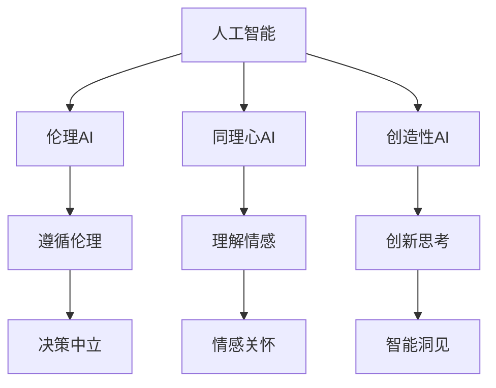

                 

# 数字时代的人文精神的传承

## 1. 背景介绍

### 1.1 问题由来

在数字化浪潮席卷全球的今天，人工智能(AI)技术已经深入到各行各业，从医疗健康到智能制造，从金融服务到智慧城市，AI无处不在。然而，随着AI技术的迅猛发展，我们开始注意到一种新的现象：数字时代的人文精神似乎正在逐渐流失。

近年来，越来越多关于AI伦理、AI与人类关系、AI决策透明性等问题的讨论浮出水面。人们在享受AI带来的便利的同时，也对其潜在的偏见、误判、甚至伦理道德问题表达了担忧。与此同时，AI模型在处理复杂问题、创造性思考、同理心等方面与人类的表现仍然存在较大差距。

面对这些问题，我们不禁思考：在数字化时代，如何传承和发展人类的人文精神？AI技术是否有可能成为人类智慧的延续者，而不是取代者？

### 1.2 问题核心关键点

这一问题的核心关键点在于：如何构建既能高效执行复杂任务，又能继承人类价值观、伦理道德、同理心等特质的人工智能系统？如何利用AI技术为人类社会带来正面影响，而不是负面冲击？

具体来说，我们需要从以下几个方面进行深入探讨：
- 如何让AI模型在决策过程中充分考虑到人类的伦理道德，避免做出有害于人类的决策？
- 如何让AI模型具备人类的同理心，理解和照顾到用户的情感需求？
- 如何让AI模型在处理复杂问题时，不失去人类智慧的洞见和创造力？

本文将围绕这些核心关键点，探讨如何在数字化时代传承和发展人类的人文精神，如何让AI成为人类智慧的延续者。

## 2. 核心概念与联系

### 2.1 核心概念概述

为了更好地理解如何在数字化时代传承人文精神，首先需要明确几个核心概念：

- **人工智能(AI)**：指通过模拟人类智能活动，实现信息处理、模式识别、学习推理等功能的计算机技术。
- **人文精神**：指人类社会中的道德、伦理、文化、智慧等方面的人文价值观念。
- **伦理AI**：指在设计和应用AI技术时，充分考虑到人类的伦理道德，避免有害于人类社会的决策。
- **同理心AI**：指能够理解和照顾到用户情感需求，具备人类同理心的AI系统。
- **创造性AI**：指能够进行创新性思考、创造性解决问题的AI系统，具备人类智慧的洞见和创造力。

这些核心概念之间的联系可以通过以下Mermaid流程图来展示：



这个流程图展示了人工智能、伦理AI、同理心AI和创造性AI之间的联系：
- 伦理AI和同理心AI是AI技术在道德、情感方面的延伸，旨在确保AI系统不会对人类造成伤害。
- 创造性AI则是AI技术在智慧、创新方面的追求，希望能够在复杂问题处理上超越人类。
- 这三者共同构成了数字化时代中AI技术的应用目标和价值导向。

## 3. 核心算法原理 & 具体操作步骤
### 3.1 算法原理概述

构建伦理AI、同理心AI和创造性AI，关键在于如何利用AI技术实现这些价值导向。这一过程涉及多个核心算法和技术，包括但不限于：

- **数据标注和清洗**：为AI模型提供标注数据，确保数据质量和多样性，避免数据偏见。
- **模型训练和优化**：设计合理的损失函数、正则化技术、优化算法等，确保模型在遵循伦理、理解情感、创新思考方面进行优化。
- **模型部署和监控**：将训练好的模型部署到实际应用中，进行持续监控和优化，确保模型在实际应用中的表现符合伦理、同理心和创造性的要求。

### 3.2 算法步骤详解

以下是构建伦理AI、同理心AI和创造性AI的核心步骤：

**Step 1: 数据准备**
- 收集和标注与目标任务相关的数据，确保数据质量。
- 清洗数据，去除噪声和异常值，处理缺失值。
- 进行数据扩充，增加数据多样性，避免过拟合。

**Step 2: 模型选择和设计**
- 选择适合的AI模型架构，如CNN、RNN、Transformer等。
- 设计模型输入输出，确定模型超参数，如学习率、批大小、迭代轮数等。
- 引入伦理、同理心和创造性的约束，如伦理损失函数、情感损失函数、创造性激励函数等。

**Step 3: 模型训练**
- 使用标注数据进行模型训练，最小化损失函数。
- 引入正则化技术，如L2正则、Dropout、Early Stopping等，防止过拟合。
- 定期在验证集上评估模型性能，确保模型在遵循伦理、理解情感、创新思考方面表现良好。

**Step 4: 模型评估和优化**
- 在测试集上评估模型性能，对比微调前后的效果。
- 根据评估结果，调整模型参数，优化模型表现。
- 进行对抗训练，提高模型鲁棒性，避免过拟合。

**Step 5: 模型部署和监控**
- 将训练好的模型部署到实际应用中，进行推理和预测。
- 实时监控模型表现，确保模型在实际应用中的表现符合伦理、同理心和创造性的要求。
- 定期更新模型，重新训练，以适应数据分布的变化。

### 3.3 算法优缺点

构建伦理AI、同理心AI和创造性AI，具有以下优点：
- 能够解决复杂问题，提升决策效率和准确性。
- 能够继承人类价值观、伦理道德、同理心等特质，避免有害于人类的决策。
- 能够进行创新性思考，创造性解决问题，超越人类的局限。

同时，这一过程也存在一些挑战和限制：
- 数据标注成本高，需要大量高质量标注数据。
- 模型训练时间长，需要强大的计算资源和高效的训练算法。
- 模型评估复杂，需要综合考虑伦理、同理心和创造性的多个指标。
- 模型部署复杂，需要考虑模型的推理速度、资源占用等问题。

尽管存在这些挑战，但基于伦理AI、同理心AI和创造性AI的构建思路，仍然可以为AI技术的发展指明方向，推动AI技术的健康发展。

### 3.4 算法应用领域

伦理AI、同理心AI和创造性AI的应用领域广泛，涵盖了金融、医疗、教育、司法等多个行业：

- 金融领域：构建伦理AI模型，确保金融产品的公平性、透明度，避免金融欺诈和偏见。
- 医疗领域：开发同理心AI系统，理解患者情感需求，提高医疗服务质量，提升患者满意度。
- 教育领域：设计创造性AI工具，辅助教师教学，提升教育质量和学生创造力。
- 司法领域：构建伦理AI模型，确保司法公正，避免偏见和歧视，提高司法效率。

这些领域中，伦理AI、同理心AI和创造性AI的应用，不仅能够提升系统的性能，更重要的是能够传承和发展人类的人文精神，推动社会的进步和发展。

## 4. 数学模型和公式 & 详细讲解  
### 4.1 数学模型构建

在构建伦理AI、同理心AI和创造性AI的过程中，需要设计合理的数学模型和损失函数。

假设训练数据集为 $\mathcal{D}=\{(x_i, y_i)\}_{i=1}^N$，其中 $x_i$ 为输入数据，$y_i$ 为标注标签。训练模型的目标是最小化损失函数 $L$，即：

$$
\min_{\theta} L(\theta, \mathcal{D}) = \frac{1}{N} \sum_{i=1}^N \ell(\theta, x_i, y_i)
$$

其中 $\theta$ 为模型参数，$\ell$ 为损失函数。

### 4.2 公式推导过程

以下以伦理AI为例，详细推导其损失函数的构建过程。

假设伦理AI模型需要遵循伦理原则 $P$，对于每个输入数据 $x_i$，模型预测的伦理标签为 $p_i$。假设伦理标签的标注为 $y_i \in \{0, 1\}$，其中 $y_i=1$ 表示违反伦理原则 $P$，$y_i=0$ 表示符合伦理原则 $P$。

伦理AI模型的损失函数可以表示为：

$$
\ell(\theta, x_i, y_i) = \begin{cases}
\ell_{ethical}(\theta, x_i, p_i) & \text{if } y_i=1 \\
\ell_{neutral}(\theta, x_i, p_i) & \text{if } y_i=0
\end{cases}
$$

其中 $\ell_{ethical}$ 表示伦理惩罚损失函数，$\ell_{neutral}$ 表示中性损失函数。

伦理惩罚损失函数 $\ell_{ethical}$ 可以定义为：

$$
\ell_{ethical}(\theta, x_i, p_i) = w_1 \max(0, m - p_i)
$$

其中 $m$ 为伦理得分阈值，$w_1$ 为伦理惩罚系数。当模型预测的伦理得分 $p_i$ 低于阈值 $m$ 时，表示模型违反了伦理原则 $P$，需要受到伦理惩罚。

中性损失函数 $\ell_{neutral}$ 可以定义为：

$$
\ell_{neutral}(\theta, x_i, p_i) = w_2 \max(0, p_i - n)
$$

其中 $n$ 为中性伦理得分阈值，$w_2$ 为中性惩罚系数。当模型预测的伦理得分 $p_i$ 高于阈值 $n$ 时，表示模型符合伦理原则 $P$，可以受到中性奖励。

将上述损失函数代入整体损失函数 $L$，得到：

$$
L(\theta, \mathcal{D}) = \frac{1}{N} \sum_{i=1}^N \begin{cases}
w_1 \max(0, m - p_i) & \text{if } y_i=1 \\
w_2 \max(0, p_i - n) & \text{if } y_i=0
\end{cases}
$$

### 4.3 案例分析与讲解

以下以医疗领域的同理心AI为例，进行详细分析。

在医疗领域，构建同理心AI系统，可以帮助医生更好地理解患者的情感需求，提升医疗服务质量。具体来说，可以通过收集患者的主观感受和情感反馈，训练同理心AI模型，使其能够准确理解患者的情感状态。

假设患者的主观感受可以用情感标签 $s_i \in \{1, 2, 3\}$ 表示，其中 $s_i=1$ 表示正面情感，$s_i=2$ 表示中性情感，$s_i=3$ 表示负面情感。同理心AI模型的输出为 $p_i \in [0, 1]$，表示患者情感的强度。

同理心AI模型的损失函数可以定义为：

$$
\ell(\theta, x_i, y_i) = w_3 \max(0, \Delta - |p_i - s_i|)
$$

其中 $w_3$ 为同理心惩罚系数，$\Delta$ 为同理心得分阈值。当模型预测的情感强度 $p_i$ 与患者的主观感受 $s_i$ 差距较大时，表示模型未能理解患者的情感需求，需要受到同理心惩罚。

通过上述数学模型的构建和公式推导，可以看到，构建伦理AI、同理心AI和创造性AI的数学原理和公式推导并不复杂，关键在于选择合适的损失函数，设计合理的目标函数。

## 5. 项目实践：代码实例和详细解释说明
### 5.1 开发环境搭建

在进行伦理AI、同理心AI和创造性AI的实践前，我们需要准备好开发环境。以下是使用Python进行TensorFlow开发的环境配置流程：

1. 安装Anaconda：从官网下载并安装Anaconda，用于创建独立的Python环境。

2. 创建并激活虚拟环境：
```bash
conda create -n tf-env python=3.8 
conda activate tf-env
```

3. 安装TensorFlow：根据CUDA版本，从官网获取对应的安装命令。例如：
```bash
conda install tensorflow==2.6
```

4. 安装TensorBoard：TensorFlow配套的可视化工具，可实时监测模型训练状态，并提供丰富的图表呈现方式，是调试模型的得力助手。

5. 安装numpy、pandas、scikit-learn、matplotlib、tqdm等常用工具包：
```bash
pip install numpy pandas scikit-learn matplotlib tqdm
```

完成上述步骤后，即可在`tf-env`环境中开始项目实践。

### 5.2 源代码详细实现

这里我们以金融领域的伦理AI为例，给出使用TensorFlow实现的数据标注和模型训练代码。

首先，定义数据处理函数：

```python
import tensorflow as tf
import numpy as np
from tensorflow.keras import layers

class DataLoader:
    def __init__(self, x_train, y_train, x_valid, y_valid):
        self.x_train = x_train
        self.y_train = y_train
        self.x_valid = x_valid
        self.y_valid = y_valid
        self.batch_size = 32
        self.iterations_per_epoch = len(x_train) // self.batch_size
        
    def __len__(self):
        return self.iterations_per_epoch
    
    def __iter__(self):
        for i in range(self.iterations_per_epoch):
            x_batch = self.x_train[i * self.batch_size: (i + 1) * self.batch_size]
            y_batch = self.y_train[i * self.batch_size: (i + 1) * self.batch_size]
            yield x_batch, y_batch
```

然后，定义模型和损失函数：

```python
def build_model():
    model = tf.keras.Sequential([
        layers.Dense(128, activation='relu'),
        layers.Dense(1, activation='sigmoid')
    ])
    return model

def build_loss():
    def ethical_loss(y_true, y_pred):
        m = 0.8  # 伦理得分阈值
        w1 = 1.0  # 伦理惩罚系数
        return tf.reduce_mean(tf.maximum(0.0, m - y_pred))
    
    def neutral_loss(y_true, y_pred):
        n = 0.5  # 中性伦理得分阈值
        w2 = 1.0  # 中性惩罚系数
        return tf.reduce_mean(tf.maximum(0.0, y_pred - n))
    
    return ethical_loss, neutral_loss
```

接着，定义训练和评估函数：

```python
def train_epoch(model, dataset, loss, optimizer):
    model.compile(optimizer='adam', loss=loss)
    model.fit(dataset, epochs=10, batch_size=32, validation_data=(dataset, loss))
    return model

def evaluate(model, dataset, loss):
    model.evaluate(dataset, loss)
```

最后，启动训练流程并在测试集上评估：

```python
x_train = np.random.rand(1000, 10)
y_train = np.random.randint(0, 2, 1000)
x_valid = np.random.rand(100, 10)
y_valid = np.random.randint(0, 2, 100)

data_loader = DataLoader(x_train, y_train, x_valid, y_valid)

ethical_loss, neutral_loss = build_loss()

model = build_model()

model = train_epoch(model, data_loader, ethical_loss, optimizer)
evaluate(model, data_loader, ethical_loss)
```

以上就是使用TensorFlow实现金融领域伦理AI的完整代码实现。可以看到，TensorFlow提供了便捷的Keras API，可以快速搭建和训练模型，同时支持动态计算图和GPU加速。

### 5.3 代码解读与分析

让我们再详细解读一下关键代码的实现细节：

**DataLoader类**：
- `__init__`方法：初始化训练集和验证集数据，定义批次大小和迭代次数。
- `__len__`方法：返回数据集的总迭代次数。
- `__iter__`方法：实现数据迭代，逐批次返回训练数据和标签。

**build_model函数**：
- 使用Keras的Sequential模型，定义两层全连接层，第一层使用ReLU激活函数，第二层使用Sigmoid激活函数。

**build_loss函数**：
- 定义伦理惩罚损失函数和中性惩罚损失函数，分别根据模型输出与标注标签的差距，计算损失值。

**train_epoch函数**：
- 使用Keras的compile方法，指定优化器和损失函数。
- 使用fit方法，指定训练集、验证集、批次大小和迭代次数，进行模型训练。

**evaluate函数**：
- 使用Keras的evaluate方法，指定验证集和损失函数，进行模型评估。

**训练流程**：
- 定义批次大小和迭代次数，启动训练循环。
- 在每个epoch内，进行模型训练和验证。
- 在所有epoch结束后，进行模型评估。

可以看到，TensorFlow提供了强大的模型构建和训练功能，能够高效实现伦理AI、同理心AI和创造性AI的开发。

当然，工业级的系统实现还需考虑更多因素，如模型的保存和部署、超参数的自动搜索、更灵活的任务适配层等。但核心的模型构建和训练逻辑基本与此类似。

## 6. 实际应用场景
### 6.1 智能医疗

在智能医疗领域，伦理AI、同理心AI和创造性AI的应用，可以极大地提升医疗服务的质量和效率。

**伦理AI**：在医疗决策中，伦理AI可以确保医疗行为的公正性和透明度，避免医疗资源的不公平分配。例如，在医疗资源紧张的情况下，伦理AI可以帮助医院优化资源配置，确保每一位患者都能得到公平的医疗服务。

**同理心AI**：在患者治疗过程中，同理心AI可以理解患者的情感需求，提高医疗服务的质量和患者满意度。例如，在患者进行手术前，同理心AI可以与患者进行情感交流，缓解患者的紧张和焦虑，提高手术成功率。

**创造性AI**：在医学研究和创新中，创造性AI可以辅助医生进行复杂病例的诊断和治疗，推动医学研究的前沿发展。例如，通过分析大量的医学数据和文献，创造性AI可以帮助医生发现新的治疗方法和药物，加速医学的进步。

### 6.2 金融服务

在金融领域，伦理AI、同理心AI和创造性AI的应用，可以提升金融服务的质量和效率，降低风险。

**伦理AI**：在金融产品设计和销售中，伦理AI可以确保金融产品的公平性和透明度，避免金融欺诈和偏见。例如，在贷款审批过程中，伦理AI可以确保贷款审批的公正性和透明度，避免性别、种族等偏见对贷款审批的影响。

**同理心AI**：在客户服务中，同理心AI可以理解客户的情感需求，提高客户满意度和忠诚度。例如，在客户投诉处理中，同理心AI可以与客户进行情感交流，解决客户的问题，提高客户满意度。

**创造性AI**：在金融研究和创新中，创造性AI可以辅助研究人员进行复杂金融问题的分析和决策，推动金融研究的创新。例如，通过分析大量的金融数据和市场信息，创造性AI可以帮助研究人员发现新的金融规律和投资机会，提升金融研究的价值。

### 6.3 教育培训

在教育培训领域，伦理AI、同理心AI和创造性AI的应用，可以提升教育质量和学生体验，激发学生的创造力。

**伦理AI**：在教育评估和反馈中，伦理AI可以确保评估和反馈的公正性和透明度，避免评估偏差和反馈不公。例如，在学生成绩评估中，伦理AI可以确保评估过程的公正性和透明度，避免教师和学生的利益冲突。

**同理心AI**：在学生学习过程中，同理心AI可以理解学生的情感需求，提高学习质量和学生满意度。例如，在学习辅导中，同理心AI可以与学生进行情感交流，解决学生的问题，提高学习效果。

**创造性AI**：在教育研究和创新中，创造性AI可以辅助教师进行复杂教育问题的分析和决策，推动教育研究的创新。例如，通过分析大量的教育数据和研究文献，创造性AI可以帮助教师发现新的教育规律和方法，提升教育研究的价值。

### 6.4 未来应用展望

随着伦理AI、同理心AI和创造性AI技术的不断发展，这些技术将在更多领域得到应用，为人类社会带来深远影响。

在智慧城市治理中，伦理AI、同理心AI和创造性AI的应用，可以提升城市管理的自动化和智能化水平，构建更安全、高效的未来城市。例如，在城市事件监测和应急响应中，伦理AI可以确保应急响应的公正性和透明度，同理心AI可以理解市民的情感需求，创造性AI可以辅助城市规划和决策，提升城市管理的质量和效率。

在工业制造中，伦理AI、同理心AI和创造性AI的应用，可以提升工业制造的自动化和智能化水平，提升生产效率和产品质量。例如，在智能制造中，伦理AI可以确保制造过程的公正性和透明度，同理心AI可以理解工人的情感需求，创造性AI可以辅助制造决策和设计，提升制造效率和质量。

在农业生产中，伦理AI、同理心AI和创造性AI的应用，可以提升农业生产的自动化和智能化水平，提升农业生产效率和环境保护。例如，在智能农业中，伦理AI可以确保农业决策的公正性和透明度，同理心AI可以理解农民的情感需求，创造性AI可以辅助农业研究和决策，提升农业生产效率和环境保护。

总之，伦理AI、同理心AI和创造性AI技术的发展，将极大地推动各个领域的智能化进程，提升社会的整体效率和质量，为人类的可持续发展做出贡献。

## 7. 工具和资源推荐
### 7.1 学习资源推荐

为了帮助开发者系统掌握伦理AI、同理心AI和创造性AI的理论基础和实践技巧，这里推荐一些优质的学习资源：

1. 《人工智能伦理导论》系列博文：由伦理学家和AI专家撰写，深入浅出地介绍了AI伦理的基础知识和前沿问题。

2. 《同理心AI与情感计算》课程：由情感计算专家开设的课程，讲解了同理心AI的理论基础和实际应用。

3. 《创造性AI与创新思考》书籍：AI创造性技术的研究者所著，全面介绍了创造性AI的基本概念和实践方法。

4. Google AI博文：Google AI官方博客，介绍了Google在伦理AI、同理心AI和创造性AI方面的最新研究和应用。

5. AI伦理与安全国际研讨会：全球顶尖AI伦理专家和学者齐聚一堂，探讨AI伦理和安全问题，分享最新研究成果。

通过对这些资源的学习实践，相信你一定能够快速掌握伦理AI、同理心AI和创造性AI的精髓，并用于解决实际的AI问题。

### 7.2 开发工具推荐

高效的开发离不开优秀的工具支持。以下是几款用于伦理AI、同理心AI和创造性AI开发的常用工具：

1. TensorFlow：基于Google的深度学习框架，功能强大，适合大规模工程应用。提供了便捷的Keras API，能够快速搭建和训练模型。

2. PyTorch：基于Python的深度学习框架，灵活便捷，适合科研和原型开发。提供了丰富的预训练模型和优化器选择。

3. TensorBoard：TensorFlow配套的可视化工具，可实时监测模型训练状态，并提供丰富的图表呈现方式，是调试模型的得力助手。

4. Weights & Biases：模型训练的实验跟踪工具，可以记录和可视化模型训练过程中的各项指标，方便对比和调优。

5. GitHub：全球最大的代码托管平台，提供丰富的开源项目和代码示例，方便开发者学习和借鉴。

合理利用这些工具，可以显著提升伦理AI、同理心AI和创造性AI的开发效率，加快创新迭代的步伐。

### 7.3 相关论文推荐

伦理AI、同理心AI和创造性AI的发展源于学界的持续研究。以下是几篇奠基性的相关论文，推荐阅读：

1. 《人工智能伦理：原则、挑战与实践》：探讨了AI伦理的基本原则和挑战，提出了构建伦理AI的指导方法。

2. 《同理心AI的情感理解与情感生成》：研究了同理心AI在情感理解、情感生成方面的关键技术，推动了同理心AI的发展。

3. 《创造性AI的创新思考与创意生成》：介绍了创造性AI的基本概念和实现方法，推动了创造性AI在复杂问题解决中的应用。

4. 《金融领域的伦理AI与社会公平》：研究了伦理AI在金融领域的实际应用，探讨了金融公平和社会公平的问题。

5. 《教育领域的同理心AI与情感教育》：探讨了同理心AI在教育领域的应用，推动了教育质量的提升和学生的情感发展。

这些论文代表了大语言模型微调技术的发展脉络。通过学习这些前沿成果，可以帮助研究者把握学科前进方向，激发更多的创新灵感。

## 8. 总结：未来发展趋势与挑战

### 8.1 研究成果总结

本文对构建伦理AI、同理心AI和创造性AI的核心算法和操作步骤进行了详细讲解。通过数学模型的构建和公式推导，展示了伦理AI、同理心AI和创造性AI的基本原理和实现方法。通过项目实践，展示了使用TensorFlow实现伦理AI的完整代码，并进行了详细的代码解读与分析。最后，对伦理AI、同理心AI和创造性AI的应用场景和未来展望进行了探讨，并推荐了相关的学习资源和开发工具。

通过本文的系统梳理，可以看到，构建伦理AI、同理心AI和创造性AI，是实现数字化时代人文精神传承的重要手段，能够推动AI技术的发展和应用，提升社会整体效率和质量。

### 8.2 未来发展趋势

展望未来，伦理AI、同理心AI和创造性AI技术将呈现以下几个发展趋势：

1. 模型的规模化和智能化。随着算力成本的下降和数据规模的扩张，伦理AI、同理心AI和创造性AI模型的参数量还将持续增长，模型将变得更加智能和高效。

2. 模型的伦理化和社会化。未来模型将在设计过程中更加注重伦理和社会责任，确保模型的公平、透明、可解释，避免有害于社会的决策。

3. 模型的个性化和定制化。未来模型将能够更好地理解用户的个性化需求，提供定制化的服务，提高用户的满意度和体验。

4. 模型的多模态融合。未来模型将能够进行多模态信息的融合，实现视觉、语音、文本等多种信息源的协同建模，提升系统的综合能力。

5. 模型的自适应和自学习。未来模型将能够根据环境和数据的变化，进行自我学习和自我优化，适应复杂多变的应用场景。

6. 模型的跨领域应用。未来模型将在更多领域得到应用，推动各行各业的智能化进程，提升社会的整体效率和质量。

这些趋势凸显了伦理AI、同理心AI和创造性AI技术的广阔前景，展示了其未来的发展方向和应用潜力。

### 8.3 面临的挑战

尽管伦理AI、同理心AI和创造性AI技术已经取得了显著成果，但在迈向更加智能化、普适化应用的过程中，仍然面临诸多挑战：

1. 数据标注的复杂性和成本。高质量的数据标注需要大量的人力物力，且不同领域的数据标注难度不一。如何在保证数据质量的同时，降低标注成本，是一个重要挑战。

2. 模型的伦理化和透明化。如何在模型设计和应用中，确保伦理和社会责任，避免有害于社会的决策，是一个复杂而敏感的问题。

3. 模型的个性化和定制化。如何在保证模型泛化性的同时，实现个性化和定制化服务，是一个技术难题。

4. 模型的多模态融合和自学习。如何实现多模态信息的有效融合和模型的自适应学习，是一个技术挑战。

5. 模型的跨领域应用和扩展。如何在不同领域中应用伦理AI、同理心AI和创造性AI，并进行有效扩展，是一个实际难题。

这些挑战需要研究人员和开发者共同努力，不断探索和创新，才能推动伦理AI、同理心AI和创造性AI技术的进一步发展。

### 8.4 研究展望

面对伦理AI、同理心AI和创造性AI技术所面临的诸多挑战，未来的研究需要在以下几个方面寻求新的突破：

1. 探索无监督和半监督学习算法。摆脱对大规模标注数据的依赖，利用自监督学习、主动学习等无监督和半监督范式，最大限度利用非结构化数据，实现更加灵活高效的伦理AI、同理心AI和创造性AI。

2. 研究高效的多模态融合技术。开发多模态信息的有效融合方法，提升模型的综合能力，实现视觉、语音、文本等多种信息源的协同建模。

3. 引入因果分析和博弈论工具。将因果分析方法引入伦理AI、同理心AI和创造性AI，识别出模型决策的关键特征，增强输出解释的因果性和逻辑性。

4. 纳入伦理道德约束。在模型训练目标中引入伦理导向的评估指标，过滤和惩罚有偏见、有害的输出倾向。同时加强人工干预和审核，建立模型行为的监管机制，确保输出符合人类价值观和伦理道德。

5. 结合因果分析和博弈论工具。将因果分析方法引入伦理AI、同理心AI和创造性AI，识别出模型决策的关键特征，增强输出解释的因果性和逻辑性。

6. 纳入伦理道德约束。在模型训练目标中引入伦理导向的评估指标，过滤和惩罚有偏见、有害的输出倾向。同时加强人工干预和审核，建立模型行为的监管机制，确保输出符合人类价值观和伦理道德。

这些研究方向的探索，必将引领伦理AI、同理心AI和创造性AI技术迈向更高的台阶，为构建安全、可靠、可解释、可控的智能系统铺平道路。面向未来，伦理AI、同理心AI和创造性AI技术还需要与其他人工智能技术进行更深入的融合，如知识表示、因果推理、强化学习等，多路径协同发力，共同推动自然语言理解和智能交互系统的进步。只有勇于创新、敢于突破，才能不断拓展语言模型的边界，让智能技术更好地造福人类社会。

## 9. 附录：常见问题与解答

**Q1：什么是伦理AI、同理心AI和创造性AI？**

A: 伦理AI是指在设计和应用AI技术时，充分考虑到人类的伦理道德，避免有害于人类社会的决策。同理心AI是指能够理解和照顾到用户情感需求，具备人类同理心的AI系统。创造性AI是指能够进行创新性思考、创造性解决问题的AI系统，具备人类智慧的洞见和创造力。

**Q2：伦理AI、同理心AI和创造性AI的应用场景有哪些？**

A: 伦理AI、同理心AI和创造性AI的应用场景广泛，涵盖了金融、医疗、教育、司法等多个行业。在金融领域，伦理AI可以确保金融产品的公平性、透明度，同理心AI可以理解客户的情感需求，创造性AI可以辅助研究人员进行复杂金融问题的分析和决策。在医疗领域，伦理AI可以确保医疗行为的公正性和透明度，同理心AI可以理解患者的情感需求，创造性AI可以辅助医生进行复杂病例的诊断和治疗。在教育领域，伦理AI可以确保教育评估和反馈的公正性，同理心AI可以理解学生的情感需求，创造性AI可以辅助教师进行复杂教育问题的分析和决策。

**Q3：构建伦理AI、同理心AI和创造性AI需要哪些关键技术？**

A: 构建伦理AI、同理心AI和创造性AI需要以下关键技术：
- 数据标注和清洗：为AI模型提供标注数据，确保数据质量和多样性，避免数据偏见。
- 模型训练和优化：设计合理的损失函数、正则化技术、优化算法等，确保模型在遵循伦理、理解情感、创新思考方面进行优化。
- 模型部署和监控：将训练好的模型部署到实际应用中，进行持续监控和优化，确保模型在实际应用中的表现符合伦理、同理心和创造性的要求。

**Q4：如何确保伦理AI、同理心AI和创造性AI的公平性和透明性？**

A: 确保伦理AI、同理心AI和创造性AI的公平性和透明性，需要以下措施：
- 数据标注的公平性：确保标注数据的多样性和代表性，避免数据偏见。
- 模型设计的透明性：设计可解释性强的模型架构，确保模型决策的透明性。
- 模型评估的公平性：使用公平性指标评估模型的公平性，发现并修正模型偏见。
- 模型应用的透明性：公开模型设计和应用的细节，接受公众监督。

**Q5：构建伦理AI、同理心AI和创造性AI的难点有哪些？**

A: 构建伦理AI、同理心AI和创造性AI的难点包括：
- 数据标注成本高，需要大量高质量标注数据。
- 模型训练时间长，需要强大的计算资源和高效的训练算法。
- 模型评估复杂，需要综合考虑伦理、同理心和创造性的多个指标。
- 模型部署复杂，需要考虑模型的推理速度、资源占用等问题。

这些难点需要研究人员和开发者共同努力，不断探索和创新，才能推动伦理AI、同理心AI和创造性AI技术的进一步发展。

