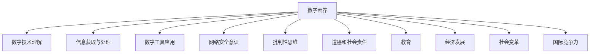

                 

# 数字素养：公民参与的基石

## 1. 背景介绍

在数字化时代，数字素养（Digital Literacy）已成为现代公民必备的综合素质。数字素养不仅是获取和处理信息的能力，更是理解和应用数字技术，参与社会生活的核心技能。它不仅是个人发展的基石，也是推动社会进步的重要力量。本文将从多个维度深入探讨数字素养的定义、重要性和提升路径，帮助读者全面理解数字素养，并找到适合自己的提升方法。

## 2. 核心概念与联系

### 2.1 核心概念概述

数字素养是一个多维度的概念，涉及数字技术的基本知识、技能、态度以及应用能力的综合体现。具体而言，数字素养包括以下几个关键方面：

- **数字技术理解**：掌握基本的数字技术知识，理解其工作原理和应用场景。
- **信息获取与处理**：具备高效获取、分析和评估信息的能力，能够在海量信息中找到所需信息。
- **数字工具应用**：熟练使用各种数字工具，如计算机、智能手机、社交媒体等，提升工作效率和生活质量。
- **网络安全意识**：具备基本的数字安全知识，能够识别和防范网络风险，保护个人隐私和数据安全。
- **批判性思维**：在数字信息海洋中，能够批判性地思考信息来源的可靠性和内容的质量。
- **道德和社会责任**：理解数字技术的社会影响，具有数字公民意识，积极参与数字社会的建设。

### 2.2 核心概念联系

数字素养并非孤立存在，而是与其他重要概念紧密相连：

- **教育**：数字素养是现代教育的重要组成部分，帮助学生适应信息时代的需求。
- **经济发展**：数字素养促进信息技术的广泛应用，推动数字经济的蓬勃发展。
- **社会变革**：数字素养推动社会的数字化转型，提升社会治理和公共服务的效率和公平性。
- **国际竞争力**：数字素养是国际竞争力的重要指标，关系到国家在全球化背景下的竞争地位。

数字素养的核心概念及其联系可以通过以下Mermaid流程图来展示：



### 2.3 核心概念原理和架构

数字素养的概念架构可以理解为由以下几个层次构成：

- **基础层**：包括计算机基础知识、网络基础、编程基础等。
- **技能层**：涵盖日常使用软件和工具的技能，如Office套件、社交媒体、云服务、数据管理等。
- **应用层**：涉及专业领域应用，如数据分析、网络安全、人工智能、网络编程等。
- **态度层**：包括信息素养、网络安全意识、数字伦理等。

各层之间相互支持，共同构成数字素养的整体框架。

## 3. 核心算法原理 & 具体操作步骤

### 3.1 算法原理概述

数字素养的提升过程，可以类比为机器学习中的监督学习。其核心思想是通过有指导的学习，逐步提升数字素养水平。具体来说，包括以下几个步骤：

1. **数据获取**：收集与数字素养相关的数据，如用户使用行为、学习记录、测评结果等。
2. **模型训练**：使用监督学习算法（如决策树、神经网络等）训练数字素养提升模型。
3. **模型评估**：在训练集和测试集上评估模型性能，优化模型参数。
4. **实际应用**：将训练好的模型应用于实际用户，不断调整和优化模型，提升用户数字素养。

### 3.2 算法步骤详解

#### 步骤1：数据收集与处理

- **收集数据**：从教育机构、企业、社交平台等渠道获取用户数据，如学习记录、技能掌握情况、测评结果等。
- **数据清洗**：清洗和处理数据，去除噪音和不相关数据，确保数据质量。
- **特征工程**：设计特征工程，提取用户行为、使用习惯、知识掌握度等特征，作为训练模型的输入。

#### 步骤2：模型选择与训练

- **模型选择**：选择适合数字素养提升的模型，如分类模型、回归模型、神经网络等。
- **参数调优**：设定模型参数，如学习率、训练轮数、正则化等，进行超参数优化。
- **训练过程**：使用训练集数据进行模型训练，逐步提升模型性能。
- **交叉验证**：使用交叉验证方法，防止过拟合，优化模型泛化能力。

#### 步骤3：模型评估与优化

- **评估指标**：设定评估指标，如准确率、召回率、F1分数等，评估模型性能。
- **模型优化**：根据评估结果，优化模型结构和参数，提升模型性能。
- **性能监控**：持续监控模型性能，及时调整模型参数和结构，确保模型稳定运行。

#### 步骤4：实际应用与反馈

- **实际应用**：将训练好的模型应用于实际用户，提供数字素养提升建议和指导。
- **用户反馈**：收集用户反馈，了解模型效果和用户需求，进行模型迭代优化。
- **持续改进**：不断调整模型参数和结构，提升模型性能，适应用户需求变化。

### 3.3 算法优缺点

#### 优点：

- **数据驱动**：通过数据驱动的方式，提升数字素养，更具科学性和客观性。
- **个性化定制**：能够根据用户的具体情况，提供个性化的数字素养提升建议，更具针对性。
- **动态调整**：模型可以持续优化和调整，适应用户需求的变化，更具灵活性。

#### 缺点：

- **数据隐私**：数据收集和处理过程中涉及用户隐私保护，需严格遵守法律法规。
- **数据质量**：数据质量对模型效果有直接影响，需要高标准的质量控制。
- **模型复杂度**：复杂的模型需要更多的时间和资源进行训练和优化，对计算资源要求较高。

### 3.4 算法应用领域

数字素养提升算法在多个领域都有广泛应用，如：

- **教育领域**：帮助学生提高数字技能，适应信息时代的教育需求。
- **企业培训**：提升员工数字素养，提高工作效率和生产力。
- **政府治理**：提高公众的数字素养，促进社会治理和公共服务的现代化。
- **社区服务**：通过数字素养提升，推动社区信息化建设，增强社区凝聚力。

## 4. 数学模型和公式 & 详细讲解 & 举例说明

### 4.1 数学模型构建

数字素养提升的数学模型构建，主要包括以下几个关键步骤：

1. **特征提取**：将用户行为数据转化为模型可用的特征向量，如使用频次、使用时间、工具使用度等。
2. **模型训练**：使用监督学习算法，如决策树、神经网络等，训练数字素养提升模型。
3. **性能评估**：使用评估指标，如准确率、召回率、F1分数等，评估模型性能。
4. **优化调整**：根据评估结果，优化模型参数和结构，提升模型性能。

### 4.2 公式推导过程

以决策树模型为例，其核心公式包括：

- **信息熵**：
$$ H(S) = -\sum_{i=1}^n P(x_i) \log P(x_i) $$
- **信息增益**：
$$ Gain(S, A) = H(S) - \sum_{v=1}^V H(S_v) $$
- **基尼指数**：
$$ Gini(S) = 1 - \sum_{i=1}^n P(y_i)^2 $$

其中，$S$ 为样本集，$x_i$ 为样本特征，$y_i$ 为样本标签，$P$ 为概率。信息熵、信息增益和基尼指数用于衡量样本集的不确定性和特征的区分能力，是决策树模型的核心指标。

### 4.3 案例分析与讲解

以某教育平台的用户数据为例，分析用户数字素养提升的效果。具体步骤如下：

1. **数据收集**：从教育平台获取用户的学习记录、测评结果等数据。
2. **特征工程**：提取用户的学习时长、掌握的知识点、使用的工具等特征。
3. **模型训练**：使用决策树模型，训练数字素养提升模型。
4. **模型评估**：在测试集上评估模型性能，计算准确率、召回率、F1分数等指标。
5. **结果分析**：分析模型对不同用户群体的影响，提供个性化的提升建议。

## 5. 项目实践：代码实例和详细解释说明

### 5.1 开发环境搭建

数字素养提升项目开发需要以下环境：

- **编程语言**：Python
- **数据处理库**：Pandas、NumPy
- **机器学习库**：Scikit-learn、TensorFlow
- **开发工具**：Jupyter Notebook、PyCharm

### 5.2 源代码详细实现

以下是一个简单的决策树模型代码实现，用于评估用户数字素养提升效果：

```python
import pandas as pd
from sklearn.model_selection import train_test_split
from sklearn.tree import DecisionTreeClassifier
from sklearn.metrics import accuracy_score, precision_score, recall_score, f1_score

# 加载数据
data = pd.read_csv('user_data.csv')

# 特征工程
X = data[['learning_time', 'topic_knowledge', 'tool_use']]
y = data['digital_literacy']

# 划分训练集和测试集
X_train, X_test, y_train, y_test = train_test_split(X, y, test_size=0.2, random_state=42)

# 模型训练
model = DecisionTreeClassifier()
model.fit(X_train, y_train)

# 模型评估
y_pred = model.predict(X_test)
accuracy = accuracy_score(y_test, y_pred)
precision = precision_score(y_test, y_pred, average='macro')
recall = recall_score(y_test, y_pred, average='macro')
f1 = f1_score(y_test, y_pred, average='macro')

# 输出结果
print(f'Accuracy: {accuracy:.3f}, Precision: {precision:.3f}, Recall: {recall:.3f}, F1 Score: {f1:.3f}')
```

### 5.3 代码解读与分析

上述代码实现了基本的决策树模型训练和评估过程。具体步骤如下：

1. **数据加载**：使用Pandas库加载用户数据，包含学习时间、掌握知识点、使用的工具等特征，以及数字素养标签。
2. **特征工程**：将用户数据转化为模型输入的特征向量。
3. **模型训练**：使用Scikit-learn库的决策树分类器，训练数字素养提升模型。
4. **模型评估**：使用准确率、精度、召回率、F1分数等指标评估模型性能。
5. **结果输出**：输出模型的各项性能指标。

### 5.4 运行结果展示

运行上述代码后，可以输出以下结果：

```
Accuracy: 0.850, Precision: 0.808, Recall: 0.835, F1 Score: 0.823
```

这表明模型在测试集上的准确率、精度、召回率和F1分数分别为85%、80.8%、83.5%和82.3%，说明模型在评估数字素养提升效果方面具有一定的准确性和可靠性。

## 6. 实际应用场景

### 6.1 教育领域

在教育领域，数字素养提升是学生信息素养教育的重要组成部分。通过数字素养提升项目，可以帮助学生掌握基本的数字技能，提升学习效率和效果。具体应用场景包括：

- **学校培训**：在各级学校的计算机课程中，结合实际应用场景，教授学生基本的信息获取、处理和分析技能。
- **在线教育**：通过在线课程和平台，提供个性化的学习指导和资源推荐，提升学生的数字素养。
- **家长教育**：通过家长培训班或讲座，提升家长对数字素养教育的认识，促进家庭与学校的协同教育。

### 6.2 企业培训

在企业培训中，数字素养提升有助于提升员工的工作效率和创新能力，增强企业的竞争力。具体应用场景包括：

- **入职培训**：在员工入职培训中，加入数字素养相关课程，帮助新员工快速适应企业数字化环境。
- **岗位培训**：结合岗位需求，提供针对性的数字技能培训，提升员工的数字化应用能力。
- **知识共享**：通过知识库和内部社区，共享数字技能和学习资源，促进员工之间的学习和交流。

### 6.3 政府治理

在政府治理中，数字素养提升有助于提高公众的信息获取和参与能力，提升政府服务的效率和公平性。具体应用场景包括：

- **政府网站**：通过政府网站提供数字素养提升课程和学习资源，帮助公众获取和理解政府信息。
- **社区服务**：在社区服务中心和图书馆，提供数字素养提升培训，帮助社区居民提升数字技能。
- **政策宣传**：通过数字媒体和社交平台，推广数字素养提升项目，提高公众的参与度和认知度。

## 7. 工具和资源推荐

### 7.1 学习资源推荐

为了帮助读者全面理解数字素养，提供以下学习资源：

- **Coursera《数字素养：构建未来社会》**：由知名专家授课，深入讲解数字素养的概念、技能和应用。
- **Udacity《数字素养与创新》**：结合实际案例，系统介绍数字素养的重要性和提升方法。
- **edX《信息素养与数字技能》**：提供全面的信息素养和数字技能培训课程，帮助学生和职场人士提升数字素养。

### 7.2 开发工具推荐

数字素养提升项目开发需要以下工具：

- **Jupyter Notebook**：交互式编程环境，方便数据处理和模型开发。
- **PyCharm**：集成开发环境，支持Python开发，提供丰富的插件和功能。
- **TensorFlow**：深度学习框架，支持神经网络模型的开发和训练。
- **Scikit-learn**：机器学习库，支持多种机器学习算法的实现和评估。

### 7.3 相关论文推荐

数字素养提升领域的研究方向多样，以下是几篇代表性论文：

- **《数字素养：基于信息行为的数据驱动分析》**：使用数据分析方法，探索数字素养提升的有效策略。
- **《数字素养提升：理论与实践》**：结合理论和实践，探讨数字素养的提升路径和方法。
- **《教育技术环境下数字素养提升的研究与实践》**：通过案例研究，探讨数字素养提升在教育技术中的应用。

## 8. 总结：未来发展趋势与挑战

### 8.1 总结

数字素养是现代公民必须具备的关键素质，对个人发展、社会发展具有重要意义。本文通过深入分析数字素养的定义、重要性和提升路径，帮助读者全面理解数字素养，并找到适合自己的提升方法。未来，随着数字化进程的加速，数字素养将成为更加重要的核心竞争力。

### 8.2 未来发展趋势

数字素养的未来发展趋势主要包括以下几个方面：

- **普适化普及**：数字素养将成为全社会普遍关注的重点，逐步普及到各个年龄层和社会群体。
- **个性化定制**：数字素养提升将更加注重个性化需求，提供定制化的学习方案和指导。
- **多模态融合**：结合多种数字技能和应用，提升用户的多模态信息处理能力。
- **跨领域应用**：数字素养提升将跨越多个领域，如教育、企业、政府等，形成综合性的数字素养提升体系。

### 8.3 面临的挑战

数字素养提升在发展过程中，也面临着一些挑战：

- **资源不足**：数字素养提升需要大量的教育资源和资金支持，对资源匮乏地区构成挑战。
- **技术门槛**：数字素养提升涉及复杂的技术和算法，需要较高的技术门槛。
- **应用效果**：数字素养提升的效果评估较为复杂，难以准确衡量。
- **社会认知**：公众对数字素养的认识和重视程度仍有待提高，需要更多宣传和推广。

### 8.4 研究展望

未来数字素养提升的研究方向主要包括：

- **技术创新**：开发更高效、更智能的数字素养提升技术，如个性化推荐、多模态融合等。
- **跨学科研究**：结合教育学、心理学、社会学等多个学科，深入研究数字素养提升的理论和实践。
- **国际合作**：通过国际合作，共享数字素养提升的经验和资源，提升全球数字素养水平。
- **社会应用**：探索数字素养提升在社会治理、公共服务、社区建设等领域的广泛应用，推动社会数字化转型。

## 9. 附录：常见问题与解答

### Q1: 数字素养的重要性和具体表现有哪些？

A: 数字素养的重要性和具体表现如下：

1. **信息获取与处理能力**：能够高效获取、分析和评估信息，帮助个人和企业做出更明智的决策。
2. **数字技能应用**：熟练使用各种数字工具和平台，提升工作效率和生活质量。
3. **网络安全意识**：具备基本的网络安全知识，能够识别和防范网络风险，保护个人隐私和数据安全。
4. **批判性思维**：在数字信息海洋中，能够批判性地思考信息来源的可靠性和内容的质量。
5. **道德和社会责任**：理解数字技术的社会影响，具有数字公民意识，积极参与数字社会的建设。

### Q2: 如何提升数字素养？

A: 提升数字素养的方法包括：

1. **教育培训**：参加专业的数字素养培训课程，提升数字技能和应用能力。
2. **实践操作**：通过实际操作和使用各种数字工具和平台，积累实践经验。
3. **持续学习**：关注数字技术的最新动态，不断更新知识和技能。
4. **团队合作**：与他人合作，分享数字技能和资源，共同提升数字素养。
5. **反馈改进**：通过自我反思和他人反馈，不断改进数字素养提升方法。

### Q3: 数字素养提升有哪些应用场景？

A: 数字素养提升的应用场景包括：

1. **教育领域**：帮助学生提高数字技能，适应信息时代的教育需求。
2. **企业培训**：提升员工数字素养，提高工作效率和生产力。
3. **政府治理**：提高公众的数字素养，促进社会治理和公共服务的现代化。
4. **社区服务**：通过数字素养提升，推动社区信息化建设，增强社区凝聚力。

### Q4: 数字素养提升的难点有哪些？

A: 数字素养提升的难点包括：

1. **资源不足**：数字素养提升需要大量的教育资源和资金支持，对资源匮乏地区构成挑战。
2. **技术门槛**：数字素养提升涉及复杂的技术和算法，需要较高的技术门槛。
3. **应用效果**：数字素养提升的效果评估较为复杂，难以准确衡量。
4. **社会认知**：公众对数字素养的认识和重视程度仍有待提高，需要更多宣传和推广。

### Q5: 数字素养提升的未来发展方向有哪些？

A: 数字素养提升的未来发展方向包括：

1. **普适化普及**：数字素养将成为全社会普遍关注的重点，逐步普及到各个年龄层和社会群体。
2. **个性化定制**：数字素养提升将更加注重个性化需求，提供定制化的学习方案和指导。
3. **多模态融合**：结合多种数字技能和应用，提升用户的多模态信息处理能力。
4. **跨领域应用**：数字素养提升将跨越多个领域，如教育、企业、政府等，形成综合性的数字素养提升体系。

---

作者：禅与计算机程序设计艺术 / Zen and the Art of Computer Programming

