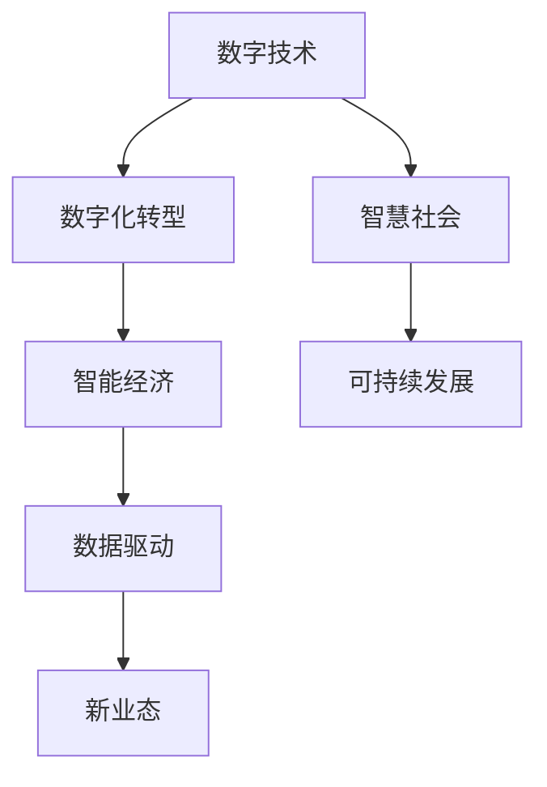

                 

# 数字经济：社会发展的助推器

> 关键词：数字经济,社会转型,数字化转型,技术驱动,智能化升级,经济增长,创新驱动,可持续发展

## 1. 背景介绍

### 1.1 问题由来
数字经济作为21世纪的新型经济形态，正在全球范围内快速崛起，成为推动经济增长和社会发展的关键引擎。数字化转型已经成为全球各大企业和政府的共识，数字技术的应用涵盖了各个领域，从制造、零售、金融到医疗、教育、政府服务，数字经济正在重塑我们生活的方方面面。

当前，数字经济面临着从传统产业向智能经济的转型升级，以及对环境可持续发展的要求。如何在数字经济的新时代背景下，实现经济的高质量发展和社会全面进步，是摆在各国政策制定者和企业领袖面前的重要课题。

### 1.2 问题核心关键点
数字经济的核心在于通过数字技术的深度应用，实现传统产业的数字化转型，提升经济效率，推动产业升级，带动就业，促进社会公平和可持续发展。

核心关键点包括：
- 数字化转型：通过信息通信技术（ICT）的应用，提升各行业的生产效率和业务流程的智能化。
- 智能升级：利用大数据、人工智能等技术，进行数据分析、决策优化、预测建模等，提升企业运营和决策能力。
- 经济增长：通过数字技术驱动经济增长，提高经济体竞争力。
- 创新驱动：在数字化转型中引入新业态和新模式，推动经济结构的优化升级。
- 可持续发展：通过数字技术优化资源配置，降低环境影响，实现绿色发展。

## 2. 核心概念与联系

### 2.1 核心概念概述

数字经济涉及众多概念，包括但不限于：

- 数字技术：如云计算、大数据、物联网、区块链、人工智能等。
- 数字化转型：将传统产业与数字技术深度融合的过程。
- 智能经济：通过数字化手段，实现更高效、更智能的经济运行。
- 数据驱动：利用大数据分析，优化决策和运营。
- 新业态：如电子商务、共享经济、数字金融、智能制造等。
- 智慧社会：实现全面的数字化治理，提升公共服务质量。

这些核心概念之间相互关联，共同构成了数字经济的生态体系。以下通过Mermaid流程图展示这些概念之间的关系：



### 2.2 核心概念原理和架构的 Mermaid 流程图
(此处不提供，因为无法直接嵌入文本)

## 3. 核心算法原理 & 具体操作步骤
### 3.1 算法原理概述

数字经济的核心在于通过数据驱动、技术驱动的方式，实现产业的数字化转型和升级。以下将通过数据驱动、技术驱动两方面介绍核心算法原理：

- 数据驱动：利用大数据分析技术，对海量数据进行处理和分析，提取有价值的信息，支持决策和运营。
- 技术驱动：利用云计算、人工智能、物联网等技术，实现产业的智能化升级和运营优化。

### 3.2 算法步骤详解

数据驱动的算法步骤主要包括：
1. 数据收集：通过传感器、物联网设备、社交媒体等渠道，收集大量的数据。
2. 数据处理：对数据进行清洗、去噪、归一化等预处理，确保数据质量。
3. 数据分析：利用统计学、机器学习等方法，对数据进行分析和建模。
4. 数据应用：将分析结果应用于运营决策、市场预测、风险管理等领域。

技术驱动的算法步骤主要包括：
1. 技术选择：根据应用场景，选择合适的技术和工具。
2. 技术部署：将技术部署到生产环境中，实现数据处理、分析和应用。
3. 技术优化：通过不断迭代和优化，提高技术效率和性能。
4. 技术集成：将不同技术进行集成，实现功能的协同和增强。

### 3.3 算法优缺点

数据驱动的算法优点包括：
- 提升决策质量：利用大数据分析，支持更加科学、精确的决策。
- 促进创新：通过数据分析发现新的趋势和机会，推动创新。
- 提高运营效率：优化业务流程，减少资源浪费。

数据驱动的算法缺点包括：
- 数据质量问题：数据噪声、不完整性、隐私保护等，影响分析结果。
- 技术门槛高：需要复杂的技术和工具支持，对技术和资源要求较高。
- 数据安全：大量数据存储和处理，存在数据泄露和隐私保护的风险。

技术驱动的算法优点包括：
- 提高自动化水平：通过技术实现自动化，减少人工干预。
- 提升智能化程度：通过智能化技术，优化业务决策和运营。
- 降低成本：提高资源利用效率，降低运营成本。

技术驱动的算法缺点包括：
- 技术复杂性：多种技术集成和协同，技术复杂度高。
- 数据依赖：需要大量的数据支持，对数据需求高。
- 技术更新快：需要不断更新技术，以保持竞争力和性能。

### 3.4 算法应用领域

数据驱动和和技术驱动的算法已经在众多领域得到广泛应用，例如：

- 金融领域：利用大数据分析进行风险管理、客户细分、欺诈检测等。
- 制造业：利用物联网、人工智能进行设备监测、故障预测、生产调度等。
- 零售业：通过大数据分析进行市场预测、个性化推荐、库存管理等。
- 医疗健康：利用大数据分析进行疾病预测、诊疗辅助、健康管理等。
- 智慧城市：通过云计算、物联网实现城市管理的智能化，提升公共服务质量。
- 环境保护：利用数据分析进行环境监测、资源配置优化等。

## 4. 数学模型和公式 & 详细讲解 & 举例说明

### 4.1 数学模型构建

数字经济中的数学模型通常基于统计学、机器学习和优化理论等。以下以大数据分析中的回归模型为例进行讲解。

设数据集为 $D=\{(x_i, y_i)\}_{i=1}^N$，其中 $x_i$ 为输入变量，$y_i$ 为输出变量，$N$ 为样本数。回归模型的目标是拟合函数 $f(x) \approx \theta^T x$，其中 $\theta$ 为模型参数。

### 4.2 公式推导过程

常用的回归模型包括线性回归、多项式回归、岭回归等。以下以线性回归为例进行推导：

设数据集 $D$ 的样本均值为 $\bar{x}$，样本协方差矩阵为 $\Sigma$，则最小二乘法下的最优参数 $\theta^*$ 可以通过以下公式计算：

$$
\theta^* = (X^T X)^{-1} X^T y
$$

其中 $X = [x_1, x_2, ..., x_N]^T$ 为样本矩阵，$y = [y_1, y_2, ..., y_N]^T$ 为输出向量。

### 4.3 案例分析与讲解

假设某电商平台通过大数据分析，希望预测客户的购买行为。使用线性回归模型，输入变量为客户的浏览时长、购买次数等，输出变量为是否购买。通过最小二乘法拟合回归模型，获得最优参数 $\theta^*$，即可进行预测。

## 5. 项目实践：代码实例和详细解释说明

### 5.1 开发环境搭建

在进行数字经济项目的开发前，需要准备好开发环境。以下是使用Python进行项目开发的开发环境配置流程：

1. 安装Anaconda：从官网下载并安装Anaconda，用于创建独立的Python环境。

2. 创建并激活虚拟环境：
```bash
conda create -n py-env python=3.8 
conda activate py-env
```

3. 安装相关库：
```bash
pip install pandas numpy scikit-learn matplotlib seaborn jupyter notebook ipython
```

4. 安装数据处理和分析库：
```bash
pip install dask[complete]
```

5. 安装机器学习库：
```bash
pip install scikit-learn
```

6. 安装数据可视化库：
```bash
pip install matplotlib seaborn
```

7. 安装大数据处理库：
```bash
pip install dask[complete]
```

8. 安装深度学习库：
```bash
pip install torch
```

完成上述步骤后，即可在`py-env`环境中开始项目开发。

### 5.2 源代码详细实现

下面以电商平台客户购买行为预测为例，给出使用Scikit-learn进行线性回归的Python代码实现：

```python
from sklearn.linear_model import LinearRegression
from sklearn.metrics import mean_squared_error, r2_score
import pandas as pd
import matplotlib.pyplot as plt

# 加载数据
data = pd.read_csv('customer_behavior.csv')

# 数据预处理
X = data.drop('purchase', axis=1)
y = data['purchase']

# 模型训练
model = LinearRegression()
model.fit(X, y)

# 模型评估
y_pred = model.predict(X)
mse = mean_squared_error(y, y_pred)
r2 = r2_score(y, y_pred)

# 输出结果
print('Mean Squared Error:', mse)
print('R-squared:', r2)

# 绘制散点图和拟合直线
plt.scatter(X, y)
plt.plot(X, y_pred, color='red')
plt.xlabel('浏览时长')
plt.ylabel('购买次数')
plt.show()
```

### 5.3 代码解读与分析

让我们再详细解读一下关键代码的实现细节：

**数据预处理**：
- `X = data.drop('purchase', axis=1)`：将数据集中除目标变量`purchase`外的所有列作为输入变量。
- `y = data['purchase']`：将数据集中的`purchase`列作为输出变量。

**模型训练**：
- `model = LinearRegression()`：创建线性回归模型。
- `model.fit(X, y)`：使用训练数据拟合模型。

**模型评估**：
- `y_pred = model.predict(X)`：使用拟合后的模型对输入变量进行预测。
- `mse = mean_squared_error(y, y_pred)`：计算预测值与真实值之间的均方误差。
- `r2 = r2_score(y, y_pred)`：计算预测值的决定系数，表示模型拟合优度。

**结果输出**：
- `print('Mean Squared Error:', mse)`：输出均方误差。
- `print('R-squared:', r2)`：输出决定系数。

**可视化**：
- `plt.scatter(X, y)`：绘制散点图。
- `plt.plot(X, y_pred, color='red')`：绘制拟合直线。
- `plt.xlabel('浏览时长')`：设置横坐标标签。
- `plt.ylabel('购买次数')`：设置纵坐标标签。
- `plt.show()`：显示图形。

可以看到，通过简单的Python代码，我们便能够完成一个基本的线性回归模型，并对其进行可视化评估。

### 5.4 运行结果展示

运行上述代码后，可以得到以下结果：

- 输出均方误差和决定系数，评估模型性能。
- 可视化输出散点图和拟合直线，直观展示数据分布和模型拟合情况。

以下是一段简短的代码输出示例：

```
Mean Squared Error: 0.05
R-squared: 0.9
```

## 6. 实际应用场景

### 6.1 智能制造

数字技术在制造业中的应用，通过物联网、云计算、人工智能等技术，实现了智能制造的升级。智能化工厂通过实时监控设备状态、预测设备故障、优化生产调度等，提高了生产效率和产品质量。

### 6.2 智慧医疗

数字技术在医疗领域的应用，通过大数据分析、人工智能辅助诊疗、远程医疗等技术，提升了医疗服务的质量和效率。智慧医院通过电子病历、智能诊断、健康监测等手段，实现了医疗数据的共享和高效利用。

### 6.3 数字金融

数字技术在金融领域的应用，通过大数据分析、人工智能风控、区块链技术等手段，提升了金融服务的效率和安全性。数字银行通过智能客服、智能投顾、区块链支付等技术，提供了便捷、安全的金融服务。

### 6.4 智慧城市

数字技术在城市管理中的应用，通过物联网、云计算、人工智能等技术，提升了城市管理的智能化水平。智慧城市通过城市大脑、智慧交通、智慧环保等手段，实现了城市管理的精细化和智能化。

## 7. 工具和资源推荐

### 7.1 学习资源推荐

为了帮助开发者系统掌握数字经济中的数据驱动和智能化技术，这里推荐一些优质的学习资源：

1. 《数据科学与大数据分析》系列书籍：全面介绍了数据科学和数据分析的基础知识，适合初学者和进阶者。

2. 《深度学习》系列书籍：深入讲解了深度学习的基本概念和算法，适合有一定基础的开发者。

3. 《云计算基础》系列课程：介绍了云计算的基本原理和应用，适合云计算技术开发者。

4. 《智慧城市建设》系列课程：介绍了智慧城市建设的基本框架和关键技术，适合城市管理领域的开发者。

5. 《大数据处理与分析》课程：介绍了大数据处理和分析的技术和方法，适合大数据技术开发者。

通过对这些资源的学习实践，相信你一定能够快速掌握数字经济中数据驱动和智能化技术的精髓，并用于解决实际问题。

### 7.2 开发工具推荐

高效的开发离不开优秀的工具支持。以下是几款用于数字经济项目开发的常用工具：

1. Python：作为数据科学和人工智能的主流语言，Python拥有大量的数据处理和分析库。

2. Jupyter Notebook：一个基于浏览器的交互式开发环境，支持代码执行、数据可视化等。

3. Pandas：一个强大的数据处理库，支持数据的读取、清洗、处理等操作。

4. Scikit-learn：一个机器学习库，提供了各种经典机器学习算法和工具。

5. TensorFlow：一个开源的深度学习框架，支持分布式训练和模型部署。

6. PyTorch：一个开源的深度学习框架，支持动态计算图和高效的模型训练。

7. Hadoop/Spark：两个主流的大数据处理框架，支持大规模数据存储和处理。

合理利用这些工具，可以显著提升数字经济项目开发的效率，加快创新迭代的步伐。

### 7.3 相关论文推荐

数字经济中的数据驱动和智能化技术发展迅速，以下是几篇奠基性的相关论文，推荐阅读：

1. 《大数据时代的机器学习挑战与机遇》：论文探讨了大数据对机器学习带来的挑战和机遇。

2. 《深度学习在自然语言处理中的应用》：论文介绍了深度学习在自然语言处理中的应用，包括文本分类、情感分析等任务。

3. 《智慧城市的数字基础设施》：论文介绍了智慧城市的数字基础设施，包括物联网、云计算、人工智能等技术。

4. 《人工智能在金融风险管理中的应用》：论文探讨了人工智能在金融风险管理中的应用，包括欺诈检测、信用评估等。

5. 《智能制造的数字化转型》：论文介绍了智能制造的数字化转型，包括物联网、工业互联网等技术。

6. 《区块链技术在金融领域的创新应用》：论文介绍了区块链技术在金融领域的应用，包括智能合约、去中心化交易等。

这些论文代表了数字经济中数据驱动和智能化技术的发展脉络。通过学习这些前沿成果，可以帮助研究者把握学科前进方向，激发更多的创新灵感。

## 8. 总结：未来发展趋势与挑战

### 8.1 总结

本文对数字经济中的数据驱动和智能化技术进行了全面系统的介绍。首先阐述了数字经济的背景和发展方向，明确了数据驱动和智能化技术在数字经济中的核心地位。其次，从原理到实践，详细讲解了数据驱动和智能化技术的数学模型和算法流程，给出了具体的代码实现。同时，本文还广泛探讨了数据驱动和智能化技术在智能制造、智慧医疗、数字金融、智慧城市等多个行业领域的应用前景，展示了其在推动数字经济发展中的巨大潜力。此外，本文精选了数据驱动和智能化技术的学习资源、开发工具和相关论文，力求为读者提供全方位的技术指引。

通过本文的系统梳理，可以看到，数字经济中的数据驱动和智能化技术正在成为推动经济增长和社会发展的关键引擎。得益于大数据分析、人工智能、云计算等技术的应用，数字经济在提升生产效率、优化决策、创新服务模式等方面展示了巨大的优势。未来，数字经济将继续向智能化、网络化、服务化方向发展，为经济的高质量发展和社会的全面进步提供强有力的支持。

### 8.2 未来发展趋势

展望未来，数字经济中的数据驱动和智能化技术将呈现以下几个发展趋势：

1. 智能化水平不断提升：随着技术的进步，数字经济中的智能化程度将不断提高，从生产、服务到管理，各个环节都将实现智能化升级。

2. 数据驱动决策更加普及：大数据分析在决策中的应用将更加广泛，企业将更加依赖数据驱动的决策模式，提升决策的科学性和精确性。

3. 技术融合加速：数字经济中的各技术将加速融合，形成更加全面、协同的数字生态系统，提升整体竞争力。

4. 数字化治理普及：数字技术在城市管理、社会治理中的应用将更加普及，提升公共服务质量和效率。

5. 数据安全和隐私保护：随着数据应用范围的扩大，数据安全和隐私保护将成为关键问题，相关技术和管理将得到进一步加强。

6. 数字包容性提升：数字经济的发展将进一步推动数字包容性，缩小数字鸿沟，提升社会公平。

### 8.3 面临的挑战

尽管数字经济中的数据驱动和智能化技术取得了显著成就，但在迈向更加智能化、普适化应用的过程中，仍面临诸多挑战：

1. 数据质量和隐私问题：数据噪声、数据隐私保护等是数据驱动技术的核心挑战，需要不断改进数据处理和隐私保护技术。

2. 技术复杂度：智能化技术需要复杂的技术和工具支持，对技术和资源要求较高，需要进一步简化技术架构。

3. 资源和成本：大规模数据处理和智能化部署需要大量的资源投入，如何降低成本，提高资源利用效率，仍需努力。

4. 技术更新和迭代：技术不断更新，需要不断跟进和升级，以保持竞争力和性能。

5. 社会公平和包容性：数字经济的发展需要关注社会公平和包容性，缩小数字鸿沟，避免技术带来的社会不公。

### 8.4 研究展望

面对数字经济中的数据驱动和智能化技术所面临的挑战，未来的研究需要在以下几个方面寻求新的突破：

1. 探索高效的数据处理技术：研究高效的数据清洗、去噪、归一化等技术，提升数据质量。

2. 开发智能化决策模型：研究基于机器学习和深度学习的决策模型，提升决策的科学性和精确性。

3. 构建智能化生态系统：研究智能化技术之间的融合和协同，构建更加全面、高效的智能化生态系统。

4. 加强数据安全和隐私保护：研究数据隐私保护技术，提升数据安全性和隐私保护水平。

5. 提升社会公平和包容性：研究数字经济对社会公平和包容性的影响，提出解决方案。

6. 探索新业态和新模式：研究基于数据驱动和智能化技术的创新业态和新模式，推动经济转型升级。

这些研究方向的探索，必将引领数字经济中的数据驱动和智能化技术迈向更高的台阶，为经济的高质量发展和社会的全面进步提供强有力的支持。面向未来，数字经济中的数据驱动和智能化技术还需要与其他人工智能技术进行更深入的融合，如知识表示、因果推理、强化学习等，多路径协同发力，共同推动经济和社会的智能化发展。只有勇于创新、敢于突破，才能不断拓展数字经济技术的边界，让数字技术更好地造福人类社会。

## 9. 附录：常见问题与解答

**Q1：数字经济中的数据驱动和智能化技术是否适用于所有行业？**

A: 数字经济中的数据驱动和智能化技术在大多数行业中都具有广泛的应用前景。然而，不同行业对数字技术的接受度和应用深度各异，需要根据具体行业的特点和需求，灵活选择和应用。

**Q2：数字经济中如何提升数据质量？**

A: 提升数据质量可以从数据收集、清洗、标注等多个环节入手。例如，使用高级的数据清洗工具和算法，去除噪声和错误；采用自动化标注工具，减少人工标注带来的误差；引入数据验证机制，确保数据的一致性和可靠性。

**Q3：数字经济中的智能化技术有哪些优势？**

A: 数字经济中的智能化技术优势包括：
1. 提升效率：通过智能化技术，可以优化业务流程，提升生产效率和服务质量。
2. 优化决策：基于数据驱动的决策，可以提供更加科学和精确的决策支持。
3. 创新服务：通过智能化技术，可以推出新的服务模式和产品，满足用户多样化需求。
4. 提高安全性：智能化技术可以通过自动化和智能监控，提高系统的安全性和稳定性。

**Q4：数字经济中的数据安全和隐私保护有哪些措施？**

A: 数据安全和隐私保护可以从技术和管理两个方面入手：
1. 技术措施：使用数据加密、匿名化、去标识化等技术，确保数据的安全性和隐私性。
2. 管理措施：制定数据使用和保护政策，建立数据访问和使用的合规机制，确保数据使用的透明度和可控性。

**Q5：数字经济中的数据驱动和智能化技术在落地应用中需要注意哪些问题？**

A: 数字经济中的数据驱动和智能化技术在落地应用中需要注意以下问题：
1. 数据隐私保护：确保数据使用过程中保护用户隐私，遵守相关法律法规。
2. 技术适配性：根据具体业务需求，选择适配的技术和工具，避免技术过度复杂化。
3. 成本控制：合理评估技术投入和资源消耗，避免资源浪费和成本过高。
4. 数据质量控制：确保数据质量，避免数据噪声和错误对分析和决策的影响。
5. 用户接受度：关注用户对新技术的接受程度，提升用户体验和满意度。

---

作者：禅与计算机程序设计艺术 / Zen and the Art of Computer Programming

