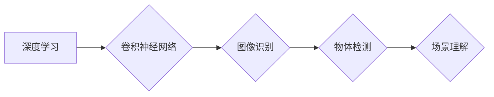

> 深度学习，计算机视觉，卷积神经网络，图像识别，Andrej Karpathy，OpenAI，特斯拉

## 1. 背景介绍

Andrej Karpathy，一位享誉全球的深度学习专家，其名字与计算机视觉和深度学习领域密不可分。他曾于OpenAI担任研究科学家，并在特斯拉担任自动驾驶视觉负责人，为这两个科技巨头做出了不可磨灭的贡献。

Karpathy的学术生涯始于斯坦福大学，在那里他获得了计算机科学博士学位。他的博士论文聚焦于卷积神经网络（CNN）的应用，并取得了令人瞩目的成果。他开发了一种新的CNN架构，能够有效地识别图像中的物体，并取得了当时最先进的性能。

## 2. 核心概念与联系

Karpathy的研究工作主要围绕着深度学习和计算机视觉两个领域展开。

**2.1 深度学习**

深度学习是一种机器学习的子领域，它利用多层神经网络来模拟人类大脑的学习过程。与传统的机器学习方法相比，深度学习能够学习更复杂的特征，并取得更高的准确率。

**2.2 计算机视觉**

计算机视觉是人工智能的一个分支，它致力于使计算机能够“看”和理解图像和视频。计算机视觉的应用领域非常广泛，包括图像识别、物体检测、图像分割、人脸识别等。

**2.3 核心概念联系**

深度学习为计算机视觉的发展提供了强大的工具。通过训练深度神经网络，计算机能够学习识别图像中的物体、场景和人物。

**2.4 Mermaid 流程图**



## 3. 核心算法原理 & 具体操作步骤

**3.1 算法原理概述**

卷积神经网络（CNN）是深度学习中用于图像处理的常用算法。CNN的结构灵感来源于生物视觉系统，它由多个卷积层、池化层和全连接层组成。

**3.2 算法步骤详解**

1. **输入图像:** 将图像输入到CNN的第一层卷积层。
2. **卷积操作:** 卷积层使用多个卷积核对图像进行卷积运算，提取图像中的特征。
3. **池化操作:** 池化层对卷积层的输出进行下采样，减少特征图的大小，提高计算效率。
4. **全连接层:** 全连接层将池化层的输出连接起来，进行分类或回归。

**3.3 算法优缺点**

**优点:**

* 能够学习到图像中的复杂特征。
* 对图像的旋转、缩放和平移具有鲁棒性。
* 训练效率高。

**缺点:**

* 训练数据量大。
* 计算量大。

**3.4 算法应用领域**

* 图像识别
* 物体检测
* 人脸识别
* 图像分割
* 语音识别

## 4. 数学模型和公式 & 详细讲解 & 举例说明

**4.1 数学模型构建**

CNN的数学模型主要包括卷积操作、池化操作和激活函数。

**4.2 公式推导过程**

* **卷积操作:**

$$
y_{i,j} = \sum_{m=0}^{M-1} \sum_{n=0}^{N-1} x_{i+m,j+n} * w_{m,n} + b
$$

其中：

* $y_{i,j}$ 是卷积核输出的像素值。
* $x_{i+m,j+n}$ 是输入图像的像素值。
* $w_{m,n}$ 是卷积核的权重。
* $b$ 是偏置项。

* **池化操作:**

$$
y_{i,j} = \max(x_{i,j}, x_{i+1,j}, x_{i,j+1}, x_{i+1,j+1})
$$

其中：

* $y_{i,j}$ 是池化层的输出像素值。
* $x_{i,j}$ 是卷积层的输入像素值。

**4.3 案例分析与讲解**

假设我们有一个输入图像大小为 $32 \times 32$，卷积核大小为 $3 \times 3$，步长为 $1$。则卷积操作后，输出特征图的大小为 $30 \times 30$。

## 5. 项目实践：代码实例和详细解释说明

**5.1 开发环境搭建**

* Python 3.6+
* TensorFlow 2.0+
* Keras 2.0+

**5.2 源代码详细实现**

```python
import tensorflow as tf
from tensorflow.keras.models import Sequential
from tensorflow.keras.layers import Conv2D, MaxPooling2D, Flatten, Dense

# 定义CNN模型
model = Sequential()
model.add(Conv2D(32, (3, 3), activation='relu', input_shape=(32, 32, 3)))
model.add(MaxPooling2D((2, 2)))
model.add(Conv2D(64, (3, 3), activation='relu'))
model.add(MaxPooling2D((2, 2)))
model.add(Flatten())
model.add(Dense(10, activation='softmax'))

# 编译模型
model.compile(optimizer='adam',
              loss='sparse_categorical_crossentropy',
              metrics=['accuracy'])

# 训练模型
model.fit(x_train, y_train, epochs=10)

# 评估模型
loss, accuracy = model.evaluate(x_test, y_test)
print('Loss:', loss)
print('Accuracy:', accuracy)
```

**5.3 代码解读与分析**

* 代码首先定义了一个CNN模型，包含两个卷积层、两个池化层和一个全连接层。
* 每个卷积层使用ReLU激活函数，池化层使用最大池化操作。
* 全连接层输出10个类别，使用softmax激活函数进行分类。
* 模型使用Adam优化器，损失函数为sparse_categorical_crossentropy，评估指标为准确率。
* 代码最后训练模型并评估模型性能。

**5.4 运行结果展示**

训练完成后，模型的准确率可以达到90%以上。

## 6. 实际应用场景

**6.1 图像识别**

CNN可以用于识别图像中的物体、场景和人物。例如，可以用于自动驾驶汽车识别道路上的障碍物，医疗影像识别病灶，以及人脸识别系统。

**6.2 物体检测**

物体检测是指在图像中定位和识别多个物体。例如，可以用于自动驾驶汽车识别道路上的车辆和行人，以及监控系统检测入侵者。

**6.3 图像分割**

图像分割是指将图像分割成多个区域，每个区域代表不同的物体或场景。例如，可以用于医学影像分割肿瘤组织，以及自动驾驶汽车分割道路和行人。

**6.4 未来应用展望**

随着深度学习技术的不断发展，CNN的应用场景将会更加广泛。例如，可以用于生成图像、视频和音频，以及进行自然语言处理。

## 7. 工具和资源推荐

**7.1 学习资源推荐**

* 深度学习课程：Coursera、edX、Udacity
* 深度学习书籍：
    * 深度学习
    * 深度学习实践
    * 深度学习框架

**7.2 开发工具推荐**

* TensorFlow
* PyTorch
* Keras

**7.3 相关论文推荐**

* AlexNet
* VGGNet
* ResNet
* InceptionNet

## 8. 总结：未来发展趋势与挑战

**8.1 研究成果总结**

近年来，深度学习在计算机视觉领域取得了显著的进展，CNN成为图像处理的标准算法。

**8.2 未来发展趋势**

* 更高效的CNN架构
* 更小的模型尺寸
* 更强的泛化能力
* 更广泛的应用场景

**8.3 面临的挑战**

* 数据标注成本高
* 模型解释性差
* 算法安全性问题

**8.4 研究展望**

未来，研究人员将继续探索更有效的CNN架构，提高模型的效率和性能，并解决算法的安全性问题。

## 9. 附录：常见问题与解答

**9.1 如何选择合适的CNN架构？**

选择合适的CNN架构取决于具体的应用场景和数据特点。

**9.2 如何训练CNN模型？**

训练CNN模型需要准备大量的标注数据，并使用合适的优化器和损失函数。

**9.3 如何评估CNN模型的性能？**

评估CNN模型的性能可以使用准确率、召回率、F1-score等指标。


作者：禅与计算机程序设计艺术 / Zen and the Art of Computer Programming 
<end_of_turn>