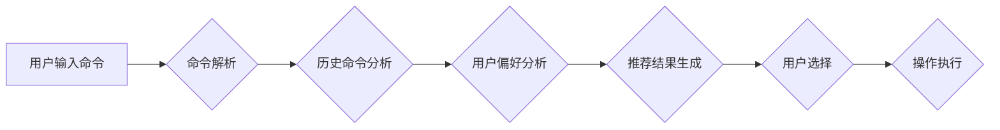

> CUI, 个性化推荐, 用户体验, 算法, 模型, 应用场景, 未来趋势

## 1. 背景介绍

随着计算机技术的发展，用户界面 (UI) 的设计也日益复杂，从传统的图形用户界面 (GUI) 到如今更智能的自然语言交互界面 (NUI)，用户体验 (UX) 始终是核心关注点。其中，命令行界面 (CUI) 作为一种简洁高效的交互方式，在服务器管理、开发调试等领域依然扮演着重要角色。然而，传统的 CUI 缺乏个性化定制和智能推荐功能，用户需要花费大量时间和精力进行命令输入和操作，这限制了其在用户体验方面的提升。

个性化推荐技术，通过分析用户的行为模式、偏好和历史数据，为用户提供定制化的服务和建议，已在电商、社交媒体等领域取得广泛应用。将个性化推荐技术引入 CUI，可以有效提升用户体验，提高工作效率，并为用户提供更智能、更便捷的交互方式。

## 2. 核心概念与联系

### 2.1 个性化推荐

个性化推荐是指根据用户的个人特征、行为模式和偏好，为用户提供定制化的产品、服务或内容建议。其核心目标是提高用户满意度、促进用户参与度和转化率。

### 2.2 CUI 与 个性化推荐

CUI 的个性化推荐是指根据用户的历史命令、操作习惯、环境配置等信息，为用户提供智能的命令建议、快捷方式配置和操作流程优化。

**Mermaid 流程图**



## 3. 核心算法原理 & 具体操作步骤

### 3.1 算法原理概述

CUI 中的个性化推荐算法主要基于以下几个方面：

* **命令历史分析:** 分析用户的历史命令输入，识别常用的命令、命令组合和操作模式。
* **用户偏好学习:** 通过用户对命令的反馈、操作时间、频率等信息，学习用户的偏好和习惯。
* **上下文感知:** 结合用户的当前环境、系统状态和任务目标，提供更精准的命令建议。
* **机器学习模型:** 利用机器学习算法，例如协同过滤、内容过滤和深度学习，构建个性化推荐模型。

### 3.2 算法步骤详解

1. **数据收集:** 收集用户的历史命令、操作日志、环境信息等数据。
2. **数据预处理:** 对收集到的数据进行清洗、转换和特征提取，例如将命令转换为词向量、提取用户操作时间和频率等。
3. **模型训练:** 利用机器学习算法，训练个性化推荐模型。
4. **推荐结果生成:** 当用户输入部分命令时，模型会根据用户的历史数据、偏好和上下文信息，生成个性化的命令建议。
5. **用户反馈:** 收集用户的反馈信息，例如是否使用推荐的命令、对推荐结果的评价等，用于模型的持续优化。

### 3.3 算法优缺点

**优点:**

* **提升用户体验:** 提供智能的命令建议，减少用户输入时间和精力，提高工作效率。
* **个性化定制:** 根据用户的习惯和偏好，提供定制化的命令体验。
* **自动化操作:** 通过推荐快捷方式和操作流程，自动化完成重复性操作。

**缺点:**

* **数据依赖:** 个性化推荐算法依赖于用户的历史数据，对于新用户或数据量不足的情况，推荐效果可能较差。
* **模型复杂度:** 训练个性化推荐模型需要大量的计算资源和专业知识。
* **隐私安全:** 用户数据收集和使用需要谨慎处理，确保用户隐私安全。

### 3.4 算法应用领域

* **服务器管理:** 为管理员提供智能的命令建议，例如启动、停止服务、查看日志等。
* **开发调试:** 为开发人员提供代码补全、错误提示和调试建议。
* **数据分析:** 为数据分析师提供数据查询、统计分析和可视化建议。
* **自动化脚本:** 为用户提供自动化脚本的生成和执行建议。

## 4. 数学模型和公式 & 详细讲解 & 举例说明

### 4.1 数学模型构建

个性化推荐模型通常基于协同过滤或内容过滤算法。

**协同过滤:**

* **用户-物品评分矩阵:** 将用户和命令作为行和列，用户对命令的评分作为矩阵元素。
* **相似度计算:** 计算用户之间的相似度或命令之间的相似度，例如余弦相似度或皮尔逊相关系数。
* **推荐生成:** 根据用户或命令的相似度，推荐用户可能感兴趣的命令或用户可能喜欢的命令。

**内容过滤:**

* **命令特征向量:** 将命令转换为特征向量，例如命令词频、语法结构、功能类别等。
* **用户偏好向量:** 将用户的偏好信息转换为向量，例如用户喜欢的命令类别、操作频率等。
* **相似度计算:** 计算命令特征向量和用户偏好向量的相似度，例如余弦相似度。
* **推荐生成:** 根据命令和用户偏好之间的相似度，推荐用户可能感兴趣的命令。

### 4.2 公式推导过程

**余弦相似度:**

$$
\text{相似度} = \frac{\mathbf{u} \cdot \mathbf{v}}{\|\mathbf{u}\| \|\mathbf{v}\|}
$$

其中：

* $\mathbf{u}$ 和 $\mathbf{v}$ 是两个向量的表示。
* $\mathbf{u} \cdot \mathbf{v}$ 是两个向量的点积。
* $\|\mathbf{u}\|$ 和 $\|\mathbf{v}\|$ 是两个向量的模长。

### 4.3 案例分析与讲解

假设有一个用户历史命令数据，包含以下命令：

* `ls -l`
* `mkdir new_folder`
* `cd new_folder`
* `touch file1.txt`

我们可以将这些命令转换为特征向量，例如：

* `ls -l`: [1, 1, 0, 0]
* `mkdir new_folder`: [0, 1, 1, 0]
* `cd new_folder`: [0, 0, 1, 1]
* `touch file1.txt`: [0, 0, 0, 1]

如果用户输入了 `ls`, 我们可以计算 `ls` 和每个命令的余弦相似度，并推荐相似度最高的命令。

## 5. 项目实践：代码实例和详细解释说明

### 5.1 开发环境搭建

* 操作系统: Linux
* 编程语言: Python
* 库依赖: numpy, pandas, scikit-learn

### 5.2 源代码详细实现

```python
import numpy as np
from sklearn.metrics.pairwise import cosine_similarity

# 用户历史命令数据
commands = [
    ['ls -l', 'mkdir new_folder', 'cd new_folder', 'touch file1.txt'],
    ['ls -l', 'cd /home', 'rm file.txt'],
    ['mkdir new_project', 'cd new_project', 'touch README.md'],
]

# 命令特征向量化
def vectorize_commands(commands):
    # ... (实现命令特征向量化)

# 计算命令之间的余弦相似度
def calculate_similarity(commands):
    # ... (计算命令之间的余弦相似度)

# 推荐命令
def recommend_commands(user_input, commands, similarity_matrix):
    # ... (根据用户输入和相似度矩阵推荐命令)

# 示例代码
user_input = 'ls'
similarity_matrix = calculate_similarity(commands)
recommendations = recommend_commands(user_input, commands, similarity_matrix)
print(f"推荐命令: {recommendations}")
```

### 5.3 代码解读与分析

* `vectorize_commands()` 函数将命令转换为特征向量，例如使用词频统计或语法分析。
* `calculate_similarity()` 函数计算命令之间的余弦相似度，用于衡量命令之间的相关性。
* `recommend_commands()` 函数根据用户输入和命令之间的相似度，推荐用户可能感兴趣的命令。

### 5.4 运行结果展示

运行上述代码，将输出用户输入 `ls` 时推荐的命令列表。

## 6. 实际应用场景

### 6.1 服务器管理

* 为管理员提供智能的命令建议，例如启动、停止服务、查看日志等。
* 自动化完成重复性操作，例如备份数据、重启服务器等。

### 6.2 开发调试

* 为开发人员提供代码补全、错误提示和调试建议。
* 自动生成测试用例和代码文档。

### 6.3 数据分析

* 为数据分析师提供数据查询、统计分析和可视化建议。
* 自动生成数据报表和图表。

### 6.4 未来应用展望

* 与人工智能技术结合，实现更智能的命令理解和推荐。
* 与自然语言交互技术结合，实现语音控制和文本输入的个性化推荐。
* 与云计算技术结合，实现跨平台和跨设备的个性化推荐。

## 7. 工具和资源推荐

### 7.1 学习资源推荐

* **书籍:**
    * 《推荐系统》
    * 《机器学习》
* **在线课程:**
    * Coursera: Recommender Systems
    * edX: Machine Learning

### 7.2 开发工具推荐

* **Python:** 
    * scikit-learn
    * TensorFlow
    * PyTorch
* **命令行工具:**
    * bash
    * zsh

### 7.3 相关论文推荐

* **协同过滤:**
    * "Collaborative Filtering for Implicit Feedback Datasets"
* **内容过滤:**
    * "Content-Based Recommendation Systems"
* **个性化推荐:**
    * "A Survey on Recommender Systems"

## 8. 总结：未来发展趋势与挑战

### 8.1 研究成果总结

CUI 中的个性化推荐技术取得了显著进展，为用户提供了更智能、更便捷的交互方式。

### 8.2 未来发展趋势

* **人工智能技术融合:** 将人工智能技术与个性化推荐技术融合，实现更智能的命令理解和推荐。
* **多模态交互:** 支持语音、文本、图像等多模态交互，提供更丰富的个性化推荐体验。
* **跨平台和跨设备:** 实现跨平台和跨设备的个性化推荐，提供更连续的用户体验。

### 8.3 面临的挑战

* **数据隐私安全:** 用户数据收集和使用需要谨慎处理，确保用户隐私安全。
* **算法复杂度:** 训练个性化推荐模型需要大量的计算资源和专业知识。
* **用户接受度:** 用户需要接受个性化推荐的理念，并愿意提供数据用于模型训练。

### 8.4 研究展望

未来，CUI 中的个性化推荐技术将继续发展，为用户提供更智能、更便捷、更个性化的交互体验。


## 9. 附录：常见问题与解答

**Q1: 如何收集用户历史命令数据？**

**A1:** 可以通过日志文件、命令行记录等方式收集用户历史命令数据。

**Q2: 如何选择合适的个性化推荐算法？**

**A2:** 需要根据用户的行为模式、数据量和应用场景选择合适的算法。

**Q3: 如何评估个性化推荐效果？**

**A3:** 可以使用准确率、召回率、F1-score等指标评估个性化推荐效果。

**Q4: 如何解决数据隐私安全问题？**

**A4:** 可以采用数据匿名化、加密等技术保护用户隐私。

**Q5: 如何提高个性化推荐的准确性？**

**A5:** 可以增加用户数据量、改进算法模型、引入多源数据等方式提高个性化推荐的准确性。


作者：禅与计算机程序设计艺术 / Zen and the Art of Computer Programming 
<end_of_turn>