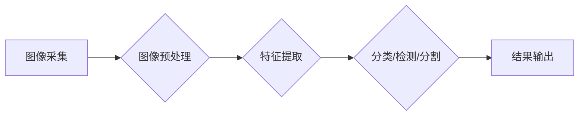

> Computer Vision (CV), 图像处理, 深度学习, CNN, OpenCV, TensorFlow, PyTorch

## 1. 背景介绍

计算机视觉 (Computer Vision, CV) 作为人工智能 (Artificial Intelligence, AI) 的重要分支，致力于赋予计算机“看”的能力，使其能够理解、解释和分析图像和视频信息。近年来，随着深度学习技术的飞速发展，CV 领域取得了令人瞩目的进展，在医疗诊断、自动驾驶、人脸识别、物体检测等领域展现出巨大的应用潜力。

传统的CV方法主要依赖于手工设计的特征提取算法，但这些算法难以适应复杂场景和变化的图像数据。深度学习的出现则为CV领域带来了革命性的变革。深度神经网络 (Deep Neural Networks, DNN) 能够自动学习图像特征，并实现更准确、更鲁棒的视觉理解。

## 2. 核心概念与联系

**2.1 核心概念**

* **图像处理:** 对图像进行数字化、增强、变换等操作，以提取图像信息或改善图像质量。
* **特征提取:** 从图像中提取具有代表性的特征，用于描述图像内容或识别图像类别。
* **分类:** 将图像归类到预定义的类别中，例如识别物体、场景或人物。
* **检测:** 在图像中定位和识别特定物体，并输出其位置和大小。
* **分割:** 将图像分割成多个区域，每个区域对应不同的物体或场景。

**2.2 联系**

CV 领域的核心概念相互关联，形成一个完整的视觉理解体系。图像处理为特征提取提供基础，特征提取为分类、检测和分割提供输入，最终实现对图像的理解和分析。

**2.3 Mermaid 流程图**



## 3. 核心算法原理 & 具体操作步骤

**3.1 算法原理概述**

卷积神经网络 (Convolutional Neural Networks, CNN) 是 CV 领域最常用的深度学习算法之一。CNN 借鉴了生物视觉系统的结构和功能，利用卷积操作和池化操作来提取图像特征，并通过全连接层进行分类或回归。

**3.2 算法步骤详解**

1. **输入层:** 将图像数据作为输入，每个像素点对应一个神经元。
2. **卷积层:** 使用卷积核 (Filter) 对图像进行卷积运算，提取图像局部特征。
3. **池化层:** 对卷积层的输出进行池化操作，例如最大池化或平均池化，降低特征维度并提高鲁棒性。
4. **全连接层:** 将池化层的输出连接到全连接层，进行分类或回归。
5. **输出层:** 输出分类结果或回归值。

**3.3 算法优缺点**

* **优点:**
    * 能够自动学习图像特征，无需人工设计。
    * 对图像变化具有较强的鲁棒性。
    * 在图像分类、物体检测等任务上取得了优异的性能。
* **缺点:**
    * 训练数据量大，计算资源消耗高。
    * 对小样本数据训练效果较差。
    * 模型解释性较差。

**3.4 算法应用领域**

* **图像分类:** 将图像归类到预定义的类别中，例如识别动物、植物或场景。
* **物体检测:** 在图像中定位和识别特定物体，并输出其位置和大小。
* **图像分割:** 将图像分割成多个区域，每个区域对应不同的物体或场景。
* **人脸识别:** 根据人脸特征识别个人身份。
* **自动驾驶:** 利用摄像头和传感器数据，帮助车辆感知周围环境并做出决策。

## 4. 数学模型和公式 & 详细讲解 & 举例说明

**4.1 数学模型构建**

CNN 的数学模型主要包括卷积层、池化层和全连接层。

* **卷积层:** 使用卷积核对图像进行卷积运算，计算公式如下：

$$
y_{i,j} = \sum_{m=0}^{M-1} \sum_{n=0}^{N-1} x_{i+m,j+n} * w_{m,n} + b
$$

其中：

* $y_{i,j}$ 是卷积层的输出值。
* $x_{i+m,j+n}$ 是输入图像的像素值。
* $w_{m,n}$ 是卷积核的权重值。
* $b$ 是偏置项。

* **池化层:** 对卷积层的输出进行池化操作，例如最大池化或平均池化。

* **全连接层:** 将池化层的输出连接到全连接层，计算公式如下：

$$
z_k = \sum_{i=0}^{N-1} w_{ki} x_i + b_k
$$

其中：

* $z_k$ 是全连接层的输出值。
* $w_{ki}$ 是全连接层的权重值。
* $x_i$ 是池化层的输出值。
* $b_k$ 是偏置项。

**4.2 公式推导过程**

卷积核的权重值和偏置项可以通过反向传播算法进行训练，以最小化模型的损失函数。

**4.3 案例分析与讲解**

例如，在图像分类任务中，CNN 可以学习到不同类别图像的特征，并将其映射到不同的类别标签。训练过程中，CNN 会不断调整卷积核的权重值和偏置项，以使模型的预测结果与真实标签尽可能一致。

## 5. 项目实践：代码实例和详细解释说明

**5.1 开发环境搭建**

* Python 3.x
* TensorFlow 或 PyTorch
* OpenCV

**5.2 源代码详细实现**

```python
import tensorflow as tf
from tensorflow.keras.models import Sequential
from tensorflow.keras.layers import Conv2D, MaxPooling2D, Flatten, Dense

# 定义 CNN 模型
model = Sequential()
model.add(Conv2D(32, (3, 3), activation='relu', input_shape=(28, 28, 1)))
model.add(MaxPooling2D((2, 2)))
model.add(Conv2D(64, (3, 3), activation='relu'))
model.add(MaxPooling2D((2, 2)))
model.add(Flatten())
model.add(Dense(10, activation='softmax'))

# 编译模型
model.compile(optimizer='adam',
              loss='sparse_categorical_crossentropy',
              metrics=['accuracy'])

# 训练模型
model.fit(x_train, y_train, epochs=10)

# 评估模型
loss, accuracy = model.evaluate(x_test, y_test)
print('Test loss:', loss)
print('Test accuracy:', accuracy)
```

**5.3 代码解读与分析**

* 该代码定义了一个简单的 CNN 模型，用于 MNIST 手写数字识别任务。
* 模型包含两个卷积层、两个池化层、一个 Flatten 层和一个全连接层。
* 训练过程中，模型使用 Adam 优化器、交叉熵损失函数和准确率作为评估指标。

**5.4 运行结果展示**

训练完成后，模型可以用于预测新的手写数字图像。

## 6. 实际应用场景

**6.1 医疗诊断:**

* **病灶检测:** 利用 CNN 从医学图像中检测肿瘤、骨折等病灶。
* **疾病诊断:** 根据患者的影像数据，辅助医生诊断疾病类型。

**6.2 自动驾驶:**

* **物体检测:** 检测道路上的车辆、行人、交通信号灯等物体。
* **场景理解:** 理解道路环境，例如识别道路类型、车道线等。

**6.3 人脸识别:**

* **身份验证:** 利用人脸特征进行身份识别，例如解锁手机、支付等。
* **监控系统:** 在监控系统中识别嫌疑人。

**6.4 其他应用场景:**

* **图像检索:** 根据图像内容检索相似图像。
* **视频分析:** 从视频中提取关键信息，例如人物动作识别、事件检测等。

**6.5 未来应用展望**

随着深度学习技术的不断发展，CV 领域将有更多新的应用场景出现，例如：

* **增强现实 (AR):** 将虚拟物体叠加到现实世界中，例如 AR 游戏、虚拟试衣等。
* **虚拟现实 (VR):** 创建沉浸式的虚拟环境，例如 VR 游戏、虚拟旅游等。
* **机器人视觉:** 为机器人赋予视觉感知能力，使其能够更好地理解周围环境并与人类交互。

## 7. 工具和资源推荐

**7.1 学习资源推荐**

* **书籍:**
    * 《Deep Learning》 by Ian Goodfellow, Yoshua Bengio, and Aaron Courville
    * 《Computer Vision: Algorithms and Applications》 by Richard Szeliski
* **在线课程:**
    * Coursera: Deep Learning Specialization
    * Udacity: Computer Vision Nanodegree
* **博客和网站:**
    * Towards Data Science
    * Machine Learning Mastery

**7.2 开发工具推荐**

* **Python:** 广泛用于 CV 开发，拥有丰富的库和工具。
* **OpenCV:** 一款开源的计算机视觉库，提供图像处理、特征提取、物体检测等功能。
* **TensorFlow:** 一款开源的深度学习框架，支持 CNN 等模型训练。
* **PyTorch:** 一款开源的深度学习框架，以其灵活性和易用性而闻名。

**7.3 相关论文推荐**

* **AlexNet:** Krizhevsky, A., Sutskever, I., & Hinton, G. E. (2012). Imagenet classification with deep convolutional neural networks. In Advances in neural information processing systems (pp. 1097-1105).
* **VGGNet:** Simonyan, K., & Zisserman, A. (2014). Very deep convolutional networks for large-scale image recognition. arXiv preprint arXiv:1409.1556.
* **ResNet:** He, K., Zhang, X., Ren, S., & Sun, J. (2016). Deep residual learning for image recognition. In Proceedings of the IEEE conference on computer vision and pattern recognition (pp. 770-778).

## 8. 总结：未来发展趋势与挑战

**8.1 研究成果总结**

近年来，CV 领域取得了显著进展，深度学习算法在图像分类、物体检测、图像分割等任务上取得了优异的性能。

**8.2 未来发展趋势**

* **更深更广的网络结构:** 研究更深、更广的网络结构，以提高模型的表达能力和泛化能力。
* **自监督学习:** 利用无标签数据进行自监督学习，降低对标注数据的依赖。
* **跨模态学习:** 将图像与其他模态数据（例如文本、音频）进行融合，实现更全面的理解。
* **边缘计算:** 将 CV 模型部署到边缘设备上，实现实时处理和低延迟。

**8.3 面临的挑战**

* **数据标注:** 高质量的标注数据是深度学习模型训练的基础，但标注数据成本高、效率低。
* **模型解释性:** 深度学习模型的决策过程难以解释，这限制了其在安全关键应用中的应用。
* **公平性与伦理:** CV 模型可能存在偏见和歧视，需要关注公平性和伦理问题。

**8.4 研究展望**

未来，CV 领域将继续朝着更智能、更安全、更公平的方向发展，为人类社会带来更多福祉。

## 9. 附录：常见问题与解答

**9.1 如何选择合适的 CNN 架构？**

选择合适的 CNN 架构取决于具体的应用场景和数据特点。

* **图像分类:** AlexNet、VGGNet、ResNet 等经典架构