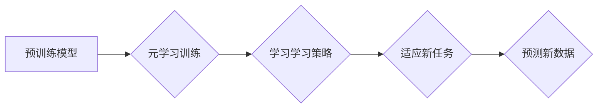

> Few-Shot Learning, 元学习, 迁移学习, 知识蒸馏, 深度学习, 机器学习

## 1. 背景介绍

在机器学习领域，传统的监督学习方法通常需要大量的标记数据才能训练出准确的模型。然而，在现实世界中，获取大量标记数据的成本往往很高，并且某些领域的数据稀缺性更加突出。为了解决这个问题，Few-Shot Learning (少样本学习) 应运而生。

Few-Shot Learning 是一种机器学习范式，它旨在训练模型能够在仅有少量标记样本的情况下学习新的任务。这种能力对于处理数据稀缺、快速适应新任务的场景至关重要。

## 2. 核心概念与联系

Few-Shot Learning 的核心概念是**迁移学习**和**元学习**。

* **迁移学习**是指利用已学习到的知识和经验来解决新的、相关的问题。在 Few-Shot Learning 中，模型会先在大量数据上预训练，然后利用这些预训练知识来适应新的任务，即使这个任务只有很少的标记样本。
* **元学习**则是一种更高级的学习方法，它旨在学习如何学习。元学习模型会学习如何从少量数据中学习新的任务，并能够泛化到新的任务和数据分布。

**Few-Shot Learning 的工作流程:**



## 3. 核心算法原理 & 具体操作步骤

### 3.1  算法原理概述

Few-Shot Learning 的核心算法通常基于**支持向量机 (SVM)**、**神经网络**或**元学习**。

* **SVM** 是一种经典的分类算法，它可以利用少量标记样本找到一个最佳的分类边界。在 Few-Shot Learning 中，SVM 可以通过核函数将数据映射到高维空间，从而提高分类精度。
* **神经网络** 是一种更强大的学习模型，它可以学习复杂的非线性关系。在 Few-Shot Learning 中，神经网络可以利用预训练知识和少量标记样本进行微调，从而快速适应新的任务。
* **元学习** 是一种更高级的学习方法，它可以学习如何学习。元学习模型会学习如何从少量数据中学习新的任务，并能够泛化到新的任务和数据分布。

### 3.2  算法步骤详解

以下是一个基于神经网络的 Few-Shot Learning 算法的步骤详解：

1. **预训练模型:** 在一个大型数据集上预训练一个神经网络模型，例如 ImageNet。
2. **元学习训练:** 使用少量标记样本进行元学习训练。元学习训练的目标是学习一个能够适应新任务的学习策略。
3. **适应新任务:** 将预训练模型和学习到的学习策略应用于新的任务。
4. **预测新数据:** 使用训练好的模型对新的数据进行预测。

### 3.3  算法优缺点

**优点:**

* 可以有效利用少量标记数据。
* 能够快速适应新的任务。
* 泛化能力强。

**缺点:**

* 训练成本较高。
* 对于某些任务，仍然需要大量的标记数据才能达到最佳性能。

### 3.4  算法应用领域

Few-Shot Learning 已经在许多领域取得了成功，例如：

* **图像分类:** 识别新的物体类别，即使只有少量示例图像。
* **自然语言处理:** 翻译新的语言对，即使只有少量平行文本数据。
* **语音识别:** 识别新的说话者，即使只有少量语音样本。

## 4. 数学模型和公式 & 详细讲解 & 举例说明

### 4.1  数学模型构建

Few-Shot Learning 的数学模型通常基于**支持向量机 (SVM)** 或**神经网络**。

**SVM 模型:**

```latex
f(x) = sign(w^T x + b)
```

其中，$x$ 是输入数据，$w$ 是权重向量，$b$ 是偏置项。

**神经网络模型:**

```latex
y = f(W_1 x_1 + b_1)
```

其中，$x_1$ 是输入数据，$W_1$ 是权重矩阵，$b_1$ 是偏置项，$f$ 是激活函数。

### 4.2  公式推导过程

SVM 模型的推导过程涉及到**最大间隔分类**和**拉格朗日乘子法**。

神经网络模型的推导过程涉及到**反向传播算法**和**梯度下降法**。

### 4.3  案例分析与讲解

**案例:**

假设我们有一个图像分类任务，需要识别猫和狗的图片。我们只有少量标记的猫和狗图片。

**解决方案:**

我们可以使用 Few-Shot Learning 的方法来解决这个问题。首先，我们可以在 ImageNet 等大型数据集上预训练一个神经网络模型。然后，我们使用少量标记的猫和狗图片进行元学习训练。最后，我们将预训练模型和学习到的学习策略应用于新的猫和狗图片，并使用模型进行预测。

## 5. 项目实践：代码实例和详细解释说明

### 5.1  开发环境搭建

* Python 3.6+
* TensorFlow 2.0+
* PyTorch 1.0+

### 5.2  源代码详细实现

```python
# 导入必要的库
import tensorflow as tf

# 定义 Few-Shot Learning 模型
class FewShotModel(tf.keras.Model):
    def __init__(self, num_classes, embedding_dim):
        super(FewShotModel, self).__init__()
        self.embedding = tf.keras.layers.Embedding(input_dim=num_classes, output_dim=embedding_dim)
        self.fc = tf.keras.layers.Dense(units=num_classes, activation='softmax')

    def call(self, inputs):
        embeddings = self.embedding(inputs)
        outputs = self.fc(embeddings)
        return outputs

# 实例化 Few-Shot Learning 模型
model = FewShotModel(num_classes=10, embedding_dim=128)

# 训练模型
model.compile(optimizer='adam', loss='sparse_categorical_crossentropy', metrics=['accuracy'])
model.fit(x_train, y_train, epochs=10)

# 评估模型
loss, accuracy = model.evaluate(x_test, y_test)
print('Loss:', loss)
print('Accuracy:', accuracy)
```

### 5.3  代码解读与分析

* **FewShotModel 类:** 定义了 Few-Shot Learning 模型的结构。
* **embedding 层:** 将类别标签映射到嵌入空间。
* **fc 层:** 全连接层，用于分类。
* **训练模型:** 使用 Adam 优化器、交叉熵损失函数和准确率指标训练模型。
* **评估模型:** 使用测试数据评估模型的性能。

### 5.4  运行结果展示

运行代码后，可以得到模型的训练损失和准确率。

## 6. 实际应用场景

Few-Shot Learning 在许多实际应用场景中发挥着重要作用，例如：

* **医疗诊断:** 利用少量病历数据进行疾病诊断。
* **个性化推荐:** 根据用户的少量反馈进行个性化推荐。
* **机器人控制:** 利用少量示范数据训练机器人完成新的任务。

### 6.4  未来应用展望

随着 Few-Shot Learning 技术的不断发展，它将在更多领域得到应用，例如：

* **自动驾驶:** 利用少量标注数据训练自动驾驶系统。
* **药物研发:** 利用少量实验数据进行药物研发。
* **自然语言理解:** 利用少量文本数据进行自然语言理解。

## 7. 工具和资源推荐

### 7.1  学习资源推荐

* **书籍:**
    * Few-Shot Learning by Timothy Hospedales
    * Deep Learning by Ian Goodfellow
* **论文:**
    * Prototypical Networks for Few-Shot Learning by Snell et al.
    * Matching Networks for One Shot Learning by Vinyals et al.
* **在线课程:**
    * Stanford CS231n: Convolutional Neural Networks for Visual Recognition
    * Deep Learning Specialization by Andrew Ng

### 7.2  开发工具推荐

* **TensorFlow:** 开源深度学习框架。
* **PyTorch:** 开源深度学习框架。
* **Keras:** 高级深度学习 API。

### 7.3  相关论文推荐

* Prototypical Networks for Few-Shot Learning
* Matching Networks for One Shot Learning
* Meta-Learning with Differentiable Convex Optimization

## 8. 总结：未来发展趋势与挑战

### 8.1  研究成果总结

Few-Shot Learning 已经取得了显著的进展，在图像分类、自然语言处理等领域取得了令人印象深刻的成果。

### 8.2  未来发展趋势

* **更有效的 Few-Shot Learning 算法:** 研究更有效的 Few-Shot Learning 算法，例如基于 Transformer 的 Few-Shot Learning 模型。
* **跨模态 Few-Shot Learning:** 研究跨模态 Few-Shot Learning，例如将图像和文本数据结合起来进行 Few-Shot 学习。
* **Few-Shot Reinforcement Learning:** 研究 Few-Shot Reinforcement Learning，例如利用少量示范数据训练强化学习模型。

### 8.3  面临的挑战

* **数据稀缺性:** 即使 Few-Shot Learning 可以利用少量数据，但对于某些任务，仍然需要大量的标记数据才能达到最佳性能。
* **泛化能力:** Few-Shot Learning 模型的泛化能力仍然需要进一步提高，尤其是在面对新的任务和数据分布时。
* **计算成本:** 训练 Few-Shot Learning 模型的计算成本仍然较高。

### 8.4  研究展望

Few-Shot Learning 是一项充满挑战和机遇的领域。未来，随着算法的不断改进和计算资源的不断提升，Few-Shot Learning 将在更多领域得到应用，并推动人工智能技术的发展。

## 9. 附录：常见问题与解答

**Q1: Few-Shot Learning 和 Transfer Learning 的区别是什么？**

**A1:** Few-Shot Learning 和 Transfer Learning 都是利用已学习到的知识和经验来解决新的问题的方法。

* **Few-Shot Learning:** 侧重于利用少量标记数据进行学习，即使只有几个或几十个样本。
* **Transfer Learning:** 侧重于利用预训练模型在新的任务上的微调，通常需要更多的标记数据。

**Q2: Few-Shot Learning 的应用场景有哪些？**

**A2:** Few-Shot Learning 的应用场景非常广泛，例如：

* **图像分类:** 识别新的物体类别，即使只有少量示例图像。
* **自然语言处理:** 翻译新的语言对，即使只有少量平行文本数据。
* **语音识别:** 识别新的说话者，即使只有少量语音样本。

**Q3: Few-Shot Learning 的未来发展趋势是什么？**

**A3:** Few-Shot Learning 的未来发展趋势包括：

* **更有效的 Few-Shot Learning 算法:** 研究更有效的 Few-Shot Learning 算法，例如基于 Transformer 的 Few-Shot Learning 模型。
* **跨模态 Few-Shot Learning:** 研究跨模态 Few-Shot Learning，例如将图像和文本数据结合起来进行 Few-Shot 学习。
* **Few-Shot Reinforcement Learning:** 研究 Few-Shot Reinforcement Learning，例如利用少量示范数据训练强化学习模型。


作者：禅与计算机程序设计艺术 / Zen and the Art of Computer Programming 
<end_of_turn>