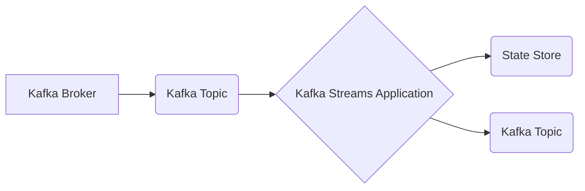

> Kafka Streams, Apache Kafka, 流式处理, 微服务, 数据分析, 实时计算, Java

## 1. 背景介绍

在当今数据爆炸的时代，海量数据实时生成和流动已成为常态。如何高效地处理这些实时数据，从中挖掘价值，成为了企业和研究机构面临的重大挑战。Apache Kafka作为一款高性能、分布式、可扩展的消息队列系统，为实时数据处理提供了坚实的基础。而Kafka Streams则是在Kafka之上构建的流式处理框架，它提供了丰富的API和工具，使开发者能够轻松地构建和部署实时数据处理应用程序。

Kafka Streams的出现，为实时数据分析、事件驱动架构、数据集成等领域带来了革命性的变革。它简化了流式处理开发流程，提高了开发效率，并提供了强大的功能，例如状态管理、窗口操作、数据聚合等，满足了各种复杂的数据处理需求。

## 2. 核心概念与联系

Kafka Streams的核心概念包括：

* **Kafka Topic:** Kafka Streams处理的数据存储在Kafka Topic中，Topic可以理解为一个主题或分类，数据以消息的形式存储在Topic中。
* **Streams:** Streams是Kafka Streams处理数据的基本单位，它代表一个数据流，可以从Kafka Topic中读取数据，并进行一系列的处理操作。
* **Processor:** Processor是Streams处理数据的核心组件，它负责对数据进行处理，例如过滤、转换、聚合等操作。
* **State Store:** State Store用于存储Streams处理过程中的状态信息，例如计数器、累加器等，它可以帮助Streams实现状态管理功能。

**Kafka Streams与Kafka的关系**

Kafka Streams是基于Kafka构建的流式处理框架，它依赖于Kafka的分布式存储和消息传递机制。Kafka Streams可以从Kafka Topic中读取数据，并将处理结果写入Kafka Topic，实现数据流的处理和传递。

**Kafka Streams架构图**



## 3. 核心算法原理 & 具体操作步骤

### 3.1  算法原理概述

Kafka Streams的核心算法原理是基于**流式数据处理模型**和**状态管理机制**。

* **流式数据处理模型:** Kafka Streams将数据视为一个持续流动的序列，并使用**微批处理**的方式进行处理。微批处理将数据划分为小的批次，每个批次都独立处理，并最终将结果合并。这种方式可以保证数据处理的实时性，同时也能利用批处理的效率。
* **状态管理机制:** Kafka Streams提供了**状态存储**功能，可以将处理过程中的状态信息持久化存储，并用于后续处理。状态存储可以帮助Streams实现**状态管理**功能，例如计数器、累加器、滑动窗口等。

### 3.2  算法步骤详解

Kafka Streams处理数据的步骤如下：

1. **读取数据:** 从Kafka Topic中读取数据，并将其转换为Streams对象。
2. **处理数据:** 使用Processor对数据进行处理，例如过滤、转换、聚合等操作。
3. **状态管理:** 使用State Store存储处理过程中的状态信息。
4. **写入结果:** 将处理结果写入Kafka Topic，或其他目标系统。

### 3.3  算法优缺点

**优点:**

* **实时性:** 微批处理方式保证了数据的实时性。
* **可扩展性:** 基于Kafka的分布式架构，Kafka Streams可以轻松地扩展到多个节点。
* **易用性:** Kafka Streams提供了丰富的API和工具，简化了流式处理开发流程。
* **状态管理:** 提供了状态存储功能，可以实现状态管理功能。

**缺点:**

* **复杂性:** 流式处理模型相对复杂，需要一定的学习成本。
* **性能瓶颈:** 在处理大量数据时，微批处理方式可能会导致性能瓶颈。

### 3.4  算法应用领域

Kafka Streams的应用领域非常广泛，例如：

* **实时数据分析:** 实时分析用户行为、市场趋势等数据。
* **事件驱动架构:** 基于事件驱动模型构建应用程序，例如订单处理、用户注册等。
* **数据集成:** 将数据从不同来源集成到一个统一的平台。
* **机器学习:** 实时训练机器学习模型，并进行预测。

## 4. 数学模型和公式 & 详细讲解 & 举例说明

### 4.1  数学模型构建

Kafka Streams的处理过程可以抽象为一个**流式数据处理模型**，该模型可以表示为一个**状态转换图**。

状态转换图中，每个节点代表一个状态，每个边代表一个状态转换。数据流从源节点开始，经过一系列的状态转换，最终到达目标节点。

### 4.2  公式推导过程

Kafka Streams的处理过程涉及到一些数学公式，例如：

* **窗口操作:** 窗口操作可以将数据划分为不同的时间窗口，并对每个窗口进行处理。窗口操作的公式可以表示为：

$$
W_t = \{x \in D | t - \Delta \le t_x \le t\}
$$

其中：

* $W_t$ 表示时间 $t$ 的窗口
* $D$ 表示所有数据
* $x$ 表示数据点
* $t_x$ 表示数据点 $x$ 的时间戳
* $\Delta$ 表示窗口大小

* **状态更新:** 状态更新公式可以表示为：

$$
S_{t+1} = f(S_t, x_t)
$$

其中：

* $S_t$ 表示时间 $t$ 的状态
* $x_t$ 表示时间 $t$ 的数据点
* $f$ 表示状态更新函数

### 4.3  案例分析与讲解

例如，我们可以使用Kafka Streams实现一个实时用户访问统计应用程序。

该应用程序可以从Kafka Topic中读取用户访问日志，并对每个用户进行计数。

我们可以使用窗口操作将数据划分为时间窗口，并对每个窗口进行计数。

状态更新函数可以将用户访问计数更新到State Store中。

## 5. 项目实践：代码实例和详细解释说明

### 5.1  开发环境搭建

* **Java Development Kit (JDK):** 至少需要 JDK 8 或更高版本。
* **Apache Kafka:** 至少需要 Kafka 2.0 或更高版本。
* **Apache ZooKeeper:** 用于 Kafka 集群的协调和管理。
* **Maven:** 用于项目构建和依赖管理。

### 5.2  源代码详细实现

```java
import org.apache.kafka.common.serialization.Serdes;
import org.apache.kafka.streams.KafkaStreams;
import org.apache.kafka.streams.StreamsBuilder;
import org.apache.kafka.streams.StreamsConfig;
import org.apache.kafka.streams.kstream.KStream;
import org.apache.kafka.streams.kstream.Produced;

import java.util.Properties;

public class UserAccessCounter {

    public static void main(String[] args) {
        Properties props = new Properties();
        props.put(StreamsConfig.APPLICATION_ID_CONFIG, "user-access-counter");
        props.put(StreamsConfig.BOOTSTRAP_SERVERS_CONFIG, "localhost:9092");
        props.put(StreamsConfig.DEFAULT_KEY_SERDE_CLASS_CONFIG, Serdes.String().getClass());
        props.put(StreamsConfig.DEFAULT_VALUE_SERDE_CLASS_CONFIG, Serdes.String().getClass());

        StreamsBuilder builder = new StreamsBuilder();
        KStream<String, String> userAccessLogStream = builder.stream("user-access-log");

        userAccessLogStream
                .groupByKey()
                .windowedBy(TimeWindows.of(60000)) // 窗口大小为 60 秒
                .count()
                .toStream()
                .to("user-access-count", Produced.with(Serdes.String(), Serdes.Long()));

        KafkaStreams streams = new KafkaStreams(builder.build(), props);
        streams.start();

        Runtime.getRuntime().addShutdownHook(new Thread(streams::close));
    }
}
```

### 5.3  代码解读与分析

* **配置 KafkaStreams:** 首先，我们需要配置 KafkaStreams 的属性，包括应用程序 ID、Kafka 集群地址、序列化器等。
* **读取数据:** 使用 `builder.stream()` 方法从 Kafka Topic "user-access-log" 中读取数据。
* **分组和窗口化:** 使用 `groupByKey()` 方法将数据按用户分组，然后使用 `windowedBy()` 方法将数据划分为 60 秒的窗口。
* **计数:** 使用 `count()` 方法对每个窗口中的数据进行计数。
* **写入结果:** 使用 `toStream()` 方法将计数结果转换为流，然后使用 `to()` 方法将结果写入 Kafka Topic "user-access-count"。

### 5.4  运行结果展示

运行该代码后，Kafka Streams 会从 "user-access-log" Topic 中读取用户访问日志，并对每个用户进行计数，并将结果写入 "user-access-count" Topic。

## 6. 实际应用场景

Kafka Streams在实际应用场景中具有广泛的应用价值，例如：

* **实时用户行为分析:** 可以实时分析用户访问网站、应用程序的行为，例如页面浏览、点击次数、停留时间等，并根据分析结果进行个性化推荐、用户画像构建等。
* **实时订单处理:** 可以实时处理订单信息，例如订单创建、支付、发货等，并根据订单状态进行相应的处理，例如发送通知、更新库存等。
* **实时风险监控:** 可以实时监控用户行为、交易数据等，并根据预设规则进行风险识别和预警，例如欺诈行为、异常交易等。

### 6.4  未来应用展望

随着数据量的不断增长和实时计算需求的不断提升，Kafka Streams的应用场景将会更加广泛。

例如，可以利用Kafka Streams进行实时机器学习，实时训练模型并进行预测；可以利用Kafka Streams进行实时数据可视化，实时展示数据变化趋势；可以利用Kafka Streams进行实时数据治理，实时监控数据质量、数据安全等。

## 7. 工具和资源推荐

### 7.1  学习资源推荐

* **Apache Kafka 官方文档:** https://kafka.apache.org/documentation/
* **Kafka Streams 官方文档:** https://kafka.apache.org/documentation/#streams_intro
* **Kafka Streams 入门教程:** https://www.baeldung.com/kafka-streams

### 7.2  开发工具推荐

* **IntelliJ IDEA:** https://www.jetbrains.com/idea/
* **Eclipse:** https://www.eclipse.org/

### 7.3  相关论文推荐

* **Kafka Streams: A Stream Processing Framework for Apache Kafka:** https://arxiv.org/abs/1606.04937

## 8. 总结：未来发展趋势与挑战

### 8.1  研究成果总结

Kafka Streams作为一款成熟的流式处理框架，已经取得了显著的成果，例如：

* **高性能:** Kafka Streams基于Kafka的分布式架构，可以处理海量数据。
* **易用性:** Kafka Streams提供了丰富的API和工具，简化了流式处理开发流程。
* **可扩展性:** Kafka Streams可以轻松地扩展到多个节点。

### 8.2  未来发展趋势

Kafka Streams的未来发展趋势包括：

* **更强大的状态管理功能:** 提供更灵活、更强大的状态管理功能，例如支持分布式状态存储、状态迁移等。
* **更丰富的处理功能:** 提供更多类型的处理功能，例如支持机器学习、图形数据处理等。
* **更完善的生态系统:** 发展更完善的生态系统，例如提供更多第三方工具、库和服务。

### 8.3  面临的挑战

Kafka Streams也面临一些挑战，例如：

* **复杂性:** 流式处理模型相对复杂，需要一定的学习成本。
* **性能瓶颈:** 在处理大量数据时，微批处理方式可能会导致性能瓶颈。
* **生态系统完善度:** Kafka Streams的生态系统相比其他流式处理框架还相对较弱。

### 8.4