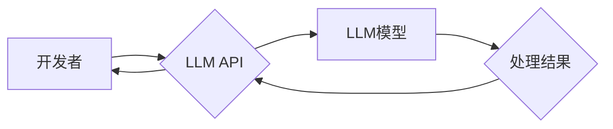

> LLM, API设计, 自然语言处理, 机器学习, 应用程序接口, AI服务, 可用性, 效率, 性能

## 1. 背景介绍

近年来，大型语言模型（LLM）在自然语言处理（NLP）领域取得了突破性的进展，展现出强大的文本生成、翻译、摘要和问答能力。这些模型的出现为开发基于AI的应用程序打开了新的大门，但也带来了新的挑战。如何将这些强大的模型能力有效地集成到应用程序中，并使其易于使用，成为了一个关键问题。

LLM API（应用程序接口）应运而生，它为开发者提供了一种便捷的方式来访问和利用LLM的强大功能。通过定义明确的接口规范和数据格式，LLM API使得开发者能够轻松地将LLM集成到自己的应用程序中，无需深入了解模型的内部结构和训练过程。

## 2. 核心概念与联系

LLM API的设计旨在提供一个简单、高效、可靠的接口，让开发者能够轻松地调用LLM模型进行各种自然语言处理任务。

**核心概念：**

* **LLM模型:** 大型语言模型，例如GPT-3、BERT、LaMDA等，拥有庞大的参数量和强大的文本处理能力。
* **API接口:**  应用程序接口，定义了应用程序之间通信的规则和协议。
* **请求和响应:** API交互的基本模式，开发者向API发送请求，API处理请求并返回响应。
* **数据格式:** API交互中使用的标准数据格式，例如JSON、XML等。

**架构图：**



## 3. 核心算法原理 & 具体操作步骤

### 3.1  算法原理概述

LLM API通常基于Transformer模型架构，该架构能够有效地处理长文本序列，并捕捉文本中的语义关系。

Transformer模型的核心是注意力机制，它允许模型关注输入序列中与当前任务相关的部分，从而提高处理效率和准确性。

### 3.2  算法步骤详解

1. **预处理:** 将用户输入的文本进行预处理，例如分词、词嵌入等，将其转换为模型可理解的格式。
2. **编码:** 使用Transformer编码器将预处理后的文本编码成一个向量表示，该向量包含了文本的语义信息。
3. **解码:** 使用Transformer解码器根据编码后的向量生成相应的输出文本。
4. **后处理:** 对解码后的文本进行后处理，例如去除非法字符、格式化输出等。

### 3.3  算法优缺点

**优点:**

* 强大的文本处理能力
* 能够处理长文本序列
* 具有良好的泛化能力

**缺点:**

* 计算资源消耗大
* 训练时间长
* 容易受到训练数据质量的影响

### 3.4  算法应用领域

* 文本生成
* 机器翻译
* 文本摘要
* 问答系统
* 对话机器人

## 4. 数学模型和公式 & 详细讲解 & 举例说明

### 4.1  数学模型构建

Transformer模型的核心是注意力机制，其数学模型可以表示为：

$$
Attention(Q, K, V) = softmax(\frac{QK^T}{\sqrt{d_k}})V
$$

其中：

* $Q$：查询矩阵
* $K$：键矩阵
* $V$：值矩阵
* $d_k$：键向量的维度
* $softmax$：softmax函数

### 4.2  公式推导过程

注意力机制的目的是计算查询向量与键向量的相关性，并根据相关性对值向量进行加权求和。

* $QK^T$：计算查询向量与键向量的点积，得到一个得分矩阵。
* $\frac{QK^T}{\sqrt{d_k}}$：对得分矩阵进行归一化，使得每个元素的范围在0到1之间。
* $softmax$：对归一化后的得分矩阵应用softmax函数，得到每个键向量的权重。
* $V$：使用权重对值向量进行加权求和，得到最终的输出向量。

### 4.3  案例分析与讲解

例如，在机器翻译任务中，查询向量可以表示源语言的词语，键向量可以表示目标语言的词语，值向量可以表示目标语言的词语嵌入。

注意力机制可以帮助模型关注源语言中与目标语言词语相关的词语，从而提高翻译的准确性。

## 5. 项目实践：代码实例和详细解释说明

### 5.1  开发环境搭建

* Python 3.7+
* TensorFlow/PyTorch
* CUDA Toolkit

### 5.2  源代码详细实现

```python
import torch
from transformers import AutoModelForSeq2SeqLM, AutoTokenizer

# 加载预训练模型和词典
model_name = "t5-base"
tokenizer = AutoTokenizer.from_pretrained(model_name)
model = AutoModelForSeq2SeqLM.from_pretrained(model_name)

# 定义输入文本
input_text = "Hello, world!"

# 对文本进行编码
input_ids = tokenizer.encode(input_text, return_tensors="pt")

# 使用模型进行解码
output = model.generate(input_ids)

# 将输出文本解码
output_text = tokenizer.decode(output[0], skip_special_tokens=True)

# 打印输出文本
print(output_text)
```

### 5.3  代码解读与分析

* 代码首先加载预训练的T5模型和词典。
* 然后定义输入文本，并使用词典对文本进行编码。
* 使用模型进行解码，得到输出文本的token序列。
* 最后使用词典将token序列解码成可读的文本。

### 5.4  运行结果展示

```
Hello, world!
```

## 6. 实际应用场景

LLM API在各个领域都有广泛的应用场景：

* **聊天机器人:**  构建更智能、更自然的对话机器人，能够理解用户的意图并提供更精准的回复。
* **文本生成:**  自动生成各种类型的文本，例如文章、故事、诗歌等，提高内容创作效率。
* **机器翻译:**  实现更高效、更准确的机器翻译，突破语言障碍。
* **问答系统:**  构建更智能的问答系统，能够理解用户的复杂问题并提供准确的答案。
* **代码生成:**  辅助程序员编写代码，提高开发效率。

### 6.4  未来应用展望

随着LLM技术的不断发展，LLM API的应用场景将会更加广泛，例如：

* **个性化教育:**  根据学生的学习情况提供个性化的学习内容和辅导。
* **医疗诊断:**  辅助医生进行疾病诊断，提高诊断准确率。
* **法律服务:**  自动分析法律文件，提供法律建议。

## 7. 工具和资源推荐

### 7.1  学习资源推荐

* **论文:**  Attention Is All You Need
* **博客:**  The Illustrated Transformer
* **在线课程:**  DeepLearning.AI

### 7.2  开发工具推荐

* **Hugging Face Transformers:**  提供各种预训练的LLM模型和工具。
* **OpenAI API:**  提供GPT-3等强大的LLM模型的API接口。
* **Google Cloud AI Platform:**  提供基于LLM的云服务。

### 7.3  相关论文推荐

* **BERT: Pre-training of Deep Bidirectional Transformers for Language Understanding**
* **GPT-3: Language Models are Few-Shot Learners**
* **T5: Text-to-Text Transfer Transformer**

## 8. 总结：未来发展趋势与挑战

### 8.1  研究成果总结

LLM API的发展为将AI技术应用于实际场景提供了强大的工具。

LLM模型的不断进步，以及API设计的不断优化，使得LLM技术更加易于使用和部署。

### 8.2  未来发展趋势

* **模型规模和性能的提升:**  未来LLM模型的规模和性能将会进一步提升，能够处理更复杂的任务。
* **多模态LLM:**  融合文本、图像、音频等多模态数据，构建更智能的LLM模型。
* **可解释性增强:**  提高LLM模型的可解释性，帮助开发者更好地理解模型的决策过程。

### 8.3  面临的挑战

* **数据安全和隐私:**  LLM模型的训练和使用需要大量的数据，如何保证数据安全和隐私是一个重要的挑战。
* **模型偏见和公平性:**  LLM模型可能存在偏见和不公平性，需要采取措施来 mitigate 这些问题。
* **伦理问题:**  LLM技术的应用可能会带来一些伦理问题，例如虚假信息生成、深度伪造等，需要进行深入的探讨和研究。

### 8.4  研究展望

未来，LLM API将会继续发展和完善，为开发者提供更强大、更易用的工具，推动AI技术在各个领域的应用。

## 9. 附录：常见问题与解答

* **Q: 如何选择合适的LLM模型？**

* **A:**  选择合适的LLM模型需要根据具体的应用场景和需求进行考虑，例如模型规模、性能、支持的语言等。

* **Q: 如何处理LLM模型的输出结果？**

* **A:**  LLM模型的输出结果可能需要进行一些后处理，例如去除非法字符、格式化输出等。

* **Q: 如何评估LLM模型的性能？**

* **A:**  可以使用各种指标来评估LLM模型的性能，例如准确率、BLEU分数等。


作者：禅与计算机程序设计艺术 / Zen and the Art of Computer Programming 
<end_of_turn>