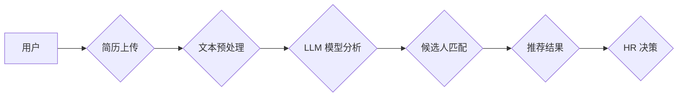

> Large Language Model (LLM), 人力资源 (HR), 招聘助手, AI 驱动的招聘, 自然语言处理 (NLP), 机器学习 (ML)

## 1. 背景介绍

人力资源 (HR) 部门一直是企业运营中不可或缺的一部分，招聘流程是 HR 工作的核心环节之一。传统的招聘流程通常耗时费力，效率低下，并且容易受到主观因素的影响。随着人工智能 (AI) 技术的快速发展，特别是大型语言模型 (LLM) 的出现，AI 驱动的招聘助手逐渐成为 HR 领域的新兴趋势。

LLM 是一种强大的深度学习模型，能够理解和生成人类语言。其强大的文本处理能力赋予其在招聘领域广泛的应用潜力。AI 招聘助手可以自动化许多招聘流程，例如简历筛选、候选人匹配、面试预审等，从而提高招聘效率，降低成本，并帮助 HR 团队做出更客观、更精准的人才决策。

## 2. 核心概念与联系

**2.1 核心概念**

* **大型语言模型 (LLM):** 训练于海量文本数据，能够理解和生成人类语言的深度学习模型。
* **自然语言处理 (NLP):** 使计算机能够理解、解释和生成人类语言的技术领域。
* **机器学习 (ML):** 算法能够从数据中学习并改进其性能的技术领域。
* **招聘助手:** 利用 AI 技术辅助 HR 团队完成招聘流程的自动化工具。

**2.2 架构图**



**2.3 联系**

LLM 在招聘助手中的核心作用是通过 NLP 技术对简历进行分析和理解，并根据预设的招聘需求进行候选人匹配。

## 3. 核心算法原理 & 具体操作步骤

**3.1 算法原理概述**

AI 招聘助手通常采用以下核心算法：

* **文本分类:** 将简历分类到不同的职位类别或技能组。
* **关键词提取:** 从简历中提取关键信息，例如技能、经验、教育背景等。
* **语义相似度计算:** 计算候选人简历与职位描述的语义相似度，以评估候选人的匹配度。
* **推荐算法:** 根据候选人的匹配度和其他因素，推荐最合适的候选人。

**3.2 算法步骤详解**

1. **数据收集:** 收集大量简历和职位描述数据，并进行清洗和预处理。
2. **模型训练:** 使用 LLM 模型训练文本分类、关键词提取、语义相似度计算等算法。
3. **简历分析:** 将上传的简历进行文本预处理，提取关键信息，并使用训练好的模型进行分析。
4. **候选人匹配:** 根据分析结果，计算候选人与职位描述的语义相似度，并进行排名。
5. **推荐结果:** 将匹配度最高的候选人推荐给 HR 团队。

**3.3 算法优缺点**

* **优点:**
    * 自动化招聘流程，提高效率。
    * 降低招聘成本。
    * 减少主观因素的影响，提高招聘决策的客观性。
* **缺点:**
    * 模型训练需要大量数据，数据质量直接影响模型性能。
    * 算法难以完全理解复杂的语言表达，可能存在误判。
    * 缺乏对候选人软技能和文化匹配的评估能力。

**3.4 算法应用领域**

* 简历筛选
* 候选人匹配
* 面试预审
* 薪酬预测
* 员工流失预测

## 4. 数学模型和公式 & 详细讲解 & 举例说明

**4.1 数学模型构建**

在 AI 招聘助手中，常用的数学模型包括：

* **词嵌入模型 (Word Embedding):** 将单词映射到低维向量空间，捕捉单词之间的语义关系。常用的词嵌入模型包括 Word2Vec 和 GloVe。
* **文本分类模型 (Text Classification):** 将文本分类到预定义的类别。常用的文本分类模型包括 Naive Bayes、支持向量机 (SVM) 和深度学习模型 (如 RNN、Transformer)。
* **语义相似度计算模型 (Semantic Similarity):** 计算两个文本之间的语义相似度。常用的语义相似度计算模型包括余弦相似度、Jaccard 指数和 Word Mover's Distance。

**4.2 公式推导过程**

* **词嵌入模型:**

Word2Vec 使用负采样 (Negative Sampling) 训练词嵌入模型。目标函数为：

$$
J(\theta) = \sum_{i=1}^{N} \sum_{j=1}^{M} \log \sigma(v_i^T w_j) - \sum_{i=1}^{N} \sum_{j \in \mathcal{N}(i)} \log \sigma(-v_i^T w_j)
$$

其中：

* $\theta$ 是模型参数。
* $N$ 是句子数量。
* $M$ 是词典大小。
* $v_i$ 是第 $i$ 个词的词向量。
* $w_j$ 是第 $j$ 个词的词向量。
* $\mathcal{N}(i)$ 是第 $i$ 个词的负采样词集。
* $\sigma$ 是 sigmoid 函数。

* **语义相似度计算:**

余弦相似度计算公式为：

$$
\text{cosine similarity}(A, B) = \frac{A \cdot B}{||A|| ||B||}
$$

其中：

* $A$ 和 $B$ 是两个词向量的向量。
* $A \cdot B$ 是两个向量之间的点积。
* $||A||$ 和 $||B||$ 是两个向量的模长。

**4.3 案例分析与讲解**

假设我们有一个招聘助手模型，需要判断候选人简历是否符合软件工程师职位要求。

1. 模型首先使用词嵌入模型将简历中的关键词转换为词向量。
2. 然后，模型使用文本分类模型将简历分类到软件工程师职位类别。
3. 最后，模型使用语义相似度计算模型计算候选人简历与职位描述的语义相似度。

如果候选人简历的分类结果为软件工程师，并且语义相似度较高，则模型会将该候选人推荐给 HR 团队。

## 5. 项目实践：代码实例和详细解释说明

**5.1 开发环境搭建**

* Python 3.7+
* TensorFlow 或 PyTorch
* NLTK 或 SpaCy

**5.2 源代码详细实现**

```python
import nltk
from nltk.corpus import stopwords
from sklearn.feature_extraction.text import TfidfVectorizer
from sklearn.metrics.pairwise import cosine_similarity

# 下载停用词列表
nltk.download('stopwords')

# 定义文本预处理函数
def preprocess_text(text):
    # 转换为小写
    text = text.lower()
    # 去除停用词
    stop_words = set(stopwords.words('english'))
    words = [word for word in text.split() if word not in stop_words]
    # 返回预处理后的文本
    return ' '.join(words)

# 定义计算语义相似度的函数
def calculate_similarity(text1, text2):
    # 使用 TF-IDF 向量化文本
    vectorizer = TfidfVectorizer()
    vectors = vectorizer.fit_transform([text1, text2])
    # 计算余弦相似度
    similarity = cosine_similarity(vectors[0], vectors[1])[0][0]
    return similarity

# 示例代码
text1 = "I am a software engineer with 5 years of experience."
text2 = "I have 3 years of experience in software development."

# 预处理文本
text1 = preprocess_text(text1)
text2 = preprocess_text(text2)

# 计算语义相似度
similarity = calculate_similarity(text1, text2)

# 打印结果
print(f"Semantic Similarity: {similarity}")
```

**5.3 代码解读与分析**

* 代码首先定义了文本预处理函数，用于将文本转换为小写，去除停用词等操作。
* 然后，代码定义了计算语义相似度的函数，使用 TF-IDF 向量化文本，并计算余弦相似度。
* 示例代码演示了如何使用这些函数计算两个文本的语义相似度。

**5.4 运行结果展示**

运行代码后，会输出两个文本的语义相似度值。

## 6. 实际应用场景

**6.1 简历筛选**

AI 招聘助手可以自动筛选符合招聘要求的简历，帮助 HR 团队快速缩小候选人范围。

**6.2 候选人匹配**

AI 招聘助手可以根据候选人的技能、经验和教育背景等信息，与职位描述进行匹配，推荐最合适的候选人。

**6.3 面试预审**

AI 招聘助手可以利用自然语言处理技术，对候选人的面试录音进行分析，评估候选人的沟通能力、专业知识等。

**6.4 未来应用展望**

* **个性化招聘体验:** AI 招聘助手可以根据候选人的个人喜好和职业目标，提供个性化的招聘建议和推荐。
* **虚拟面试:** AI 招聘助手可以模拟面试场景，帮助候选人进行模拟练习，并提供反馈意见。
* **员工流失预测:** AI 招聘助手可以分析员工的离职数据，预测员工流失风险，帮助企业制定相应的挽留策略。

## 7. 工具和资源推荐

**7.1 学习资源推荐**

* **书籍:**
    * Deep Learning by Ian Goodfellow, Yoshua Bengio, and Aaron Courville
    * Natural Language Processing with Python by Steven Bird, Ewan Klein, and Edward Loper
* **在线课程:**
    * Coursera: Natural Language Processing Specialization
    * Udacity: Deep Learning Nanodegree

**7.2 开发工具推荐**

* **Python:** 广泛用于 AI 和 NLP 开发。
* **TensorFlow:** 开源深度学习框架。
* **PyTorch:** 开源深度学习框架。
* **NLTK:** 自然语言处理工具包。
* **SpaCy:** 高性能自然语言处理库。

**7.3 相关论文推荐**

* Attention Is All You Need (Vaswani et al., 2017)
* BERT: Pre-training of Deep Bidirectional Transformers for Language Understanding (Devlin et al., 2018)
* GPT-3: Language Models are Few-Shot Learners (Brown et al., 2020)

## 8. 总结：未来发展趋势与挑战

**8.1 研究成果总结**

近年来，AI 招聘助手领域取得了显著进展，特别是 LLM 的出现，为招聘自动化提供了新的可能性。

**8.2 未来发展趋势**

* **更强大的 LLM 模型:** 未来将出现更强大的 LLM 模型，能够更好地理解和生成人类语言，从而提高招聘助手性能。
* **更个性化的招聘体验:** AI 招聘助手将更加注重个性化，为候选人提供更精准的招聘建议和推荐。
* **更全面的招聘流程自动化:** AI 招聘助手将逐步覆盖招聘流程的各个环节，例如面试安排、候选人评估等。

**8.3 面临的挑战**

* **数据质量:** AI 招聘助手依赖于大量高质量的数据进行训练，数据质量直接影响模型性能。
* **算法公平性:** 算法可能存在偏见，导致招聘结果不公平。
* **隐私保护:** AI 招聘助手需要处理大量个人信息，需要确保数据隐私安全。

**8.4 研究展望**

未来研究方向包括：

* 开发更公平、更透明的 AI 招聘算法。
* 研究如何更好地利用非文本数据，例如候选人的社交媒体信息、工作经历等。
* 探索 AI 招聘助手与人类协作的最佳模式。

## 9. 附录：常见问题与解答

**9